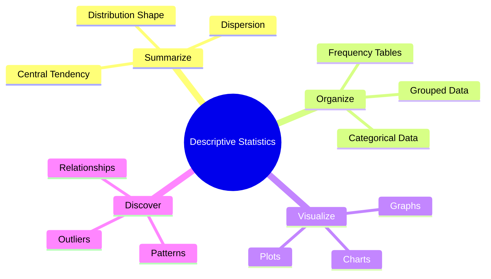
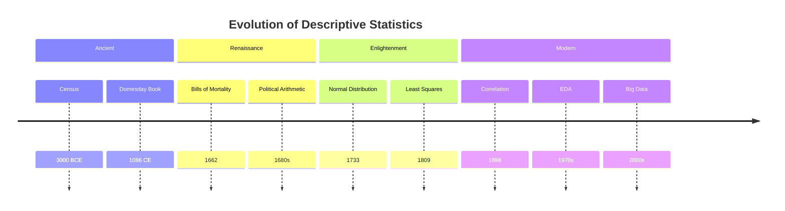
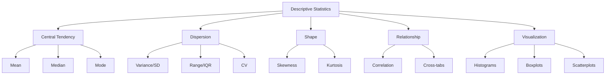
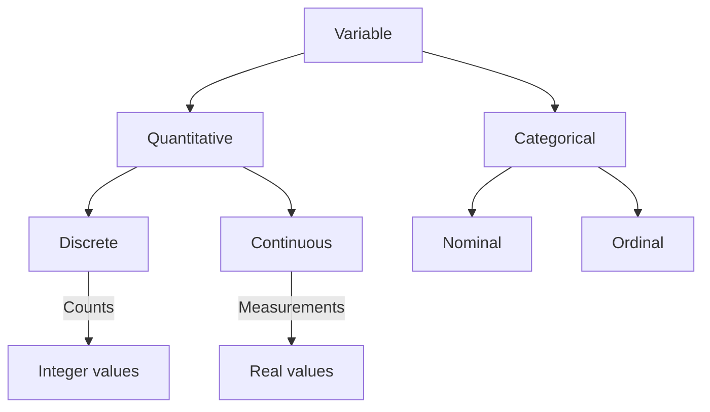
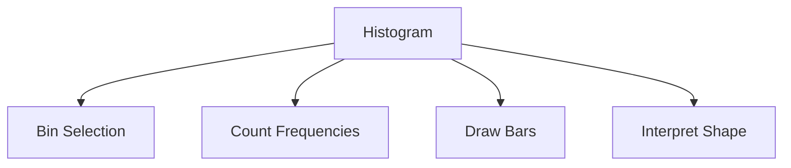
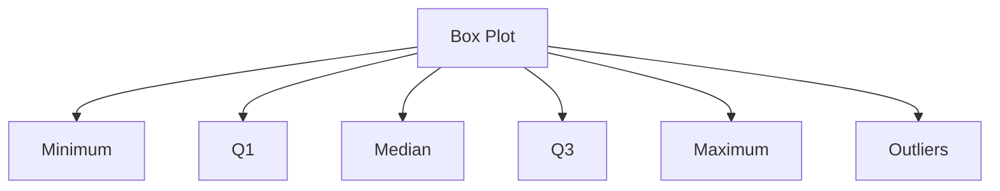
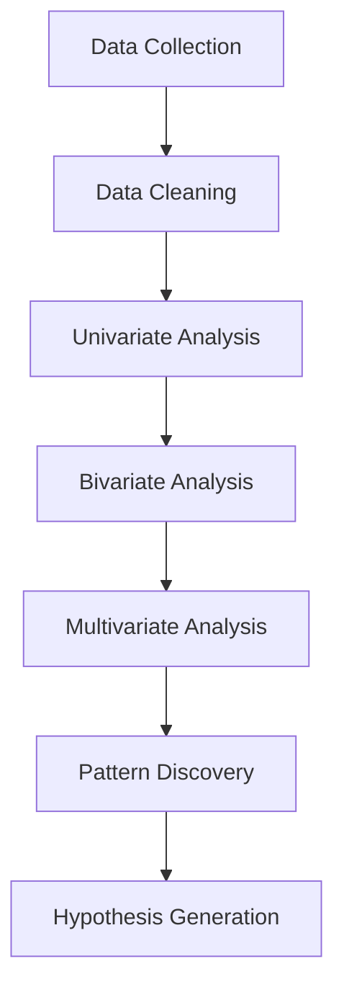
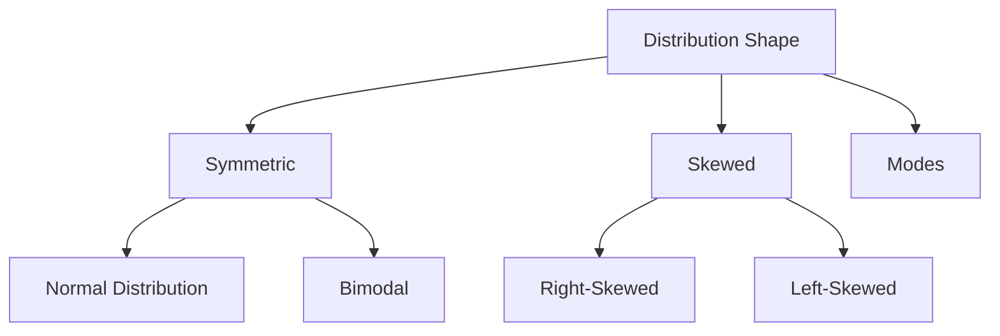
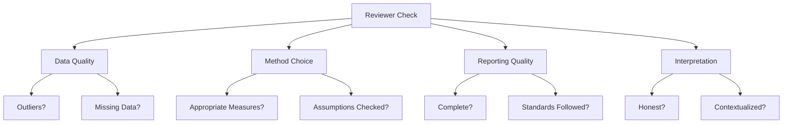

# 📊 Chapter 1: Descriptive Statistics

### *The Complete Guide — From First Principles to Publication-Ready Analysis*

<div align="center">

[]()
[]()
[]()
[]()
[]()

**[📖 Start Reading](#-chapter-1-descriptive-statistics) · [🗺️ Table of Contents](#-table-of-contents) · [🏠 Home](../README.md) · [➡️ Next Chapter](./02-central-tendency.md)**

</div>

---

> *"The goal is to turn data into information, and information into insight."* — **Carly Fiorina**

---

## 📋 Table of Contents

<details>
<summary><strong>📚 Click to expand full table of contents (100+ sections)</strong></summary>

### 1. Fundamentals
- [1.1 What is Descriptive Statistics?](#11-what-is-descriptive-statistics)
- [1.2 Historical Background](#12-historical-background)
- [1.3 Evolution of Descriptive Statistics](#13-evolution-of-descriptive-statistics)
- [1.4 Importance in Science](#14-importance-in-science)
- [1.5 Importance in Medical Research](#15-importance-in-medical-research)
- [1.6 Importance in Public Health](#16-importance-in-public-health)
- [1.7 Importance in Machine Learning](#17-importance-in-machine-learning)
- [1.8 Importance in AI](#18-importance-in-ai)
- [1.9 Types of Descriptive Statistics](#19-types-of-descriptive-statistics)

### 2. Data Fundamentals
- [2.1 Population vs Sample Summary](#21-population-vs-sample-summary)
- [2.2 Data Types](#22-data-types)
- [2.3 Variables](#23-variables)
- [2.4 Measurement Scales](#24-measurement-scales)
- [2.5 Raw Data](#25-raw-data)
- [2.6 Ordered Data](#26-ordered-data)

### 3. Frequency Distributions
- [3.1 Frequency Distribution](#31-frequency-distribution)
- [3.2 Relative Frequency](#32-relative-frequency)
- [3.3 Cumulative Frequency](#33-cumulative-frequency)
- [3.4 Frequency Tables](#34-frequency-tables)
- [3.5 Grouped Data](#35-grouped-data)
- [3.6 Ungrouped Data](#36-ungrouped-data)
- [3.7 Class Intervals](#37-class-intervals)
- [3.8 Class Boundaries](#38-class-boundaries)
- [3.9 Class Midpoints](#39-class-midpoints)

### 4. Data Visualization
- [4.1 Histograms](#41-histograms)
- [4.2 Frequency Polygon](#42-frequency-polygon)
- [4.3 Ogive](#43-ogive)
- [4.4 Bar Chart](#44-bar-chart)
- [4.5 Pie Chart](#45-pie-chart)
- [4.6 Line Graph](#46-line-graph)
- [4.7 Stem-and-Leaf Plot](#47-stem-and-leaf-plot)
- [4.8 Dot Plot](#48-dot-plot)
- [4.9 Box Plot](#49-box-plot)
- [4.10 Scatter Plot](#410-scatter-plot)
- [4.11 Heat Map](#411-heat-map)
- [4.12 Mosaic Plot](#412-mosaic-plot)
- [4.13 Treemap](#413-treemap)
- [4.14 Radar Chart](#414-radar-chart)
- [4.15 Pareto Chart](#415-pareto-chart)
- [4.16 Data Visualization Principles](#416-data-visualization-principles)

### 5. Exploratory Data Analysis (EDA)
- [5.1 Exploratory Data Analysis (EDA)](#51-exploratory-data-analysis-eda)
- [5.2 Data Cleaning](#52-data-cleaning)
- [5.3 Missing Data](#53-missing-data)
- [5.4 Outlier Detection](#54-outlier-detection)
- [5.5 Five Number Summary](#55-five-number-summary)
- [5.6 Quartiles](#56-quartiles)
- [5.7 Deciles](#57-deciles)
- [5.8 Percentiles](#58-percentiles)
- [5.9 Quantiles](#59-quantiles)

### 6. Distribution Shape
- [6.1 Distribution Shape](#61-distribution-shape)
- [6.2 Symmetry](#62-symmetry)
- [6.3 Left Skewness](#63-left-skewness)
- [6.4 Right Skewness](#64-right-skewness)
- [6.5 Kurtosis](#65-kurtosis)
- [6.6 Heavy-tailed Distributions](#66-heavy-tailed-distributions)
- [6.7 Light-tailed Distributions](#67-light-tailed-distributions)
- [6.8 Empirical Rule](#68-empirical-rule)
- [6.9 Chebyshev's Theorem](#69-chebyshevs-theorem)

### 7. Data Presentation
- [7.1 Data Summarization](#71-data-summarization)
- [7.2 Tabular Presentation](#72-tabular-presentation)
- [7.3 Graphical Presentation](#73-graphical-presentation)
- [7.4 Numerical Presentation](#74-numerical-presentation)

### 8. Field Applications
- [8.1 Descriptive Statistics in Clinical Trials](#81-descriptive-statistics-in-clinical-trials)
- [8.2 Descriptive Statistics in DHS Surveys](#82-descriptive-statistics-in-dhs-surveys)
- [8.3 Descriptive Statistics in Epidemiology](#83-descriptive-statistics-in-epidemiology)
- [8.4 Descriptive Statistics in Economics](#84-descriptive-statistics-in-economics)
- [8.5 Descriptive Statistics in Agriculture](#85-descriptive-statistics-in-agriculture)
- [8.6 Descriptive Statistics in Psychology](#86-descriptive-statistics-in-psychology)
- [8.7 Descriptive Statistics in Bioinformatics](#87-descriptive-statistics-in-bioinformatics)
- [8.8 Descriptive Statistics in AI](#88-descriptive-statistics-in-ai)
- [8.9 Descriptive Statistics in Data Science](#89-descriptive-statistics-in-data-science)

### 9. Reporting
- [9.1 Reporting Mean ± SD](#91-reporting-mean--sd)
- [9.2 Reporting Median (IQR)](#92-reporting-median-iqr)
- [9.3 Reporting Percentages](#93-reporting-percentages)
- [9.4 Choosing Appropriate Summaries](#94-choosing-appropriate-summaries)
- [9.5 Journal Reporting Standards](#95-journal-reporting-standards)
- [9.6 CONSORT Recommendations](#96-consort-recommendations)
- [9.7 STROBE Recommendations](#97-strobe-recommendations)
- [9.8 PRISMA Recommendations](#98-prisma-recommendations)
- [9.9 Common Reporting Errors](#99-common-reporting-errors)
- [9.10 Statistical Interpretation](#910-statistical-interpretation)
- [9.11 Practical Interpretation](#911-practical-interpretation)

### 10. Reviewer & AI Perspectives
- [10.1 Reviewer Perspective](#101-reviewer-perspective)
- [10.2 Common Reviewer Comments](#102-common-reviewer-comments)
- [10.3 AI Mistakes](#103-ai-mistakes)
- [10.4 R Implementation](#104-r-implementation)
- [10.5 Python Implementation](#105-python-implementation)
- [10.6 SPSS Implementation](#106-spss-implementation)
- [10.7 STATA Implementation](#107-stata-implementation)
- [10.8 SAS Implementation](#108-sas-implementation)
- [10.9 Excel Implementation](#109-excel-implementation)

### 11. Assessment & Summary
- [11.1 Real Research Example](#111-real-research-example)
- [11.2 Worked Example](#112-worked-example)
- [11.3 Practice Questions](#113-practice-questions)
- [11.4 MCQs](#114-mcqs)
- [11.5 Numerical Problems](#115-numerical-problems)
- [11.6 Chapter Summary](#116-chapter-summary)
- [11.7 Formula Sheet](#117-formula-sheet)
- [11.8 Further Reading](#118-further-reading)

</details>

---

## 1. Fundamentals

### 1.1 What is Descriptive Statistics?

> 📖 **Definition**: Descriptive statistics is the branch of statistics that deals with summarizing, organizing, and presenting data in a meaningful way.

Descriptive statistics serves as the foundation of all statistical analysis. While inferential statistics draws conclusions about populations from samples, descriptive statistics simply describes the data at hand.

**Key Functions:**



### 1.2 Historical Background

| Period | Key Developments | Major Contributors |
|--------|-----------------|-------------------|
| **Ancient** (3000 BCE - 500 CE) | Census data, population records | Babylonians, Egyptians, Romans |
| **Renaissance** (1500s-1700s) | Political arithmetic, life tables | John Graunt, William Petty |
| **Enlightenment** (1700s-1800s) | Normal distribution, least squares | Gauss, Laplace, de Moivre |
| **Modern** (1800s-1900s) | Correlation, regression, EDA | Galton, Pearson, Fisher, Tukey |
| **Digital Age** (1900s-Present) | Computational statistics, ML | Modern statisticians, computer scientists |

### 1.3 Evolution of Descriptive Statistics



### 1.4 Importance in Science

| Scientific Area | Role of Descriptive Statistics |
|----------------|-------------------------------|
| **Biology** | Summarizing measurements, characterizing populations |
| **Physics** | Describing measurement distributions, error analysis |
| **Chemistry** | Characterizing samples, quality control |
| **Environmental Science** | Summarizing pollution levels, climate data |
| **Social Sciences** | Describing survey responses, demographic data |
| **Astronomy** | Summarizing observations, characterizing celestial objects |

### 1.5 Importance in Medical Research

| Application | Example |
|------------|---------|
| **Clinical Trials** | Baseline characteristics, treatment effects |
| **Observational Studies** | Patient demographics, risk factor distributions |
| **Diagnostic Testing** | Reference ranges, test characteristics |
| **Drug Development** | Safety profiles, efficacy measures |
| **Epidemiology** | Disease incidence, prevalence rates |
| **Survival Analysis** | Median survival, event frequencies |

### 1.6 Importance in Public Health

> [!TIP]
> *Descriptive statistics is the cornerstone of public health surveillance, monitoring, and response.*

**Key Applications:**
- **Disease Surveillance**: Tracking incidence and prevalence
- **Health Indicators**: Monitoring population health
- **Health Disparities**: Identifying vulnerable populations
- **Resource Allocation**: Informing public health decisions
- **Epidemic Response**: Characterizing outbreak patterns
- **DHS Surveys**: National health indicators

### 1.7 Importance in Machine Learning

| ML Task | Role of Descriptive Statistics |
|---------|-------------------------------|
| **Data Preprocessing** | Understanding distributions, handling missing values |
| **Feature Engineering** | Scaling, normalization, transformations |
| **Model Selection** | Understanding data characteristics |
| **Evaluation** | Performance metrics interpretation |
| **Feature Importance** | Understanding variable relationships |
| **EDA** | Discovering patterns, outliers |

### 1.8 Importance in AI

> 🤖 *"Descriptive statistics provides the foundation for AI systems to understand the data they are learning from."*

**AI Applications:**
- **Data Understanding**: Characterizing training data
- **Bias Detection**: Identifying biases in datasets
- **Model Validation**: Ensuring data quality
- **Explainable AI**: Understanding data distributions
- **Automated ML**: Feature selection and preprocessing
- **Evaluation**: Understanding model performance

### 1.9 Types of Descriptive Statistics



---

## 2. Data Fundamentals

### 2.1 Population vs Sample Summary

| Aspect | Population | Sample |
|--------|-----------|--------|
| **Definition** | Entire group of interest | Subset of population |
| **Size** | N | n |
| **Parameter** | μ, σ, ρ | Statistic |
| **Notation** | Greek | Roman |
| **Access** | Often unknown | Known |
| **Cost** | Expensive | Feasible |
| **Time** | Time-consuming | Faster |

### 2.2 Data Types

| Type | Description | Examples |
|------|-------------|----------|
| **Quantitative** | Numerical measurements | Height, weight, age |
| - *Discrete* | Countable values | Number of patients, count |
| - *Continuous* | Infinite possible values | Blood pressure, temperature |
| **Categorical** | Groups or categories | Gender, blood type |
| - *Nominal* | No order | Race, country |
| - *Ordinal* | Ordered categories | Education level, severity |

### 2.3 Variables

> 📖 **Definition**: A variable is any characteristic that can be measured and can vary across individuals or observations.



### 2.4 Measurement Scales

| Scale | Description | Operations | Examples |
|-------|-------------|------------|----------|
| **Nominal** | Categories without order | =, ≠ | Gender, blood type |
| **Ordinal** | Ordered categories | =, ≠, <, > | Education, pain scale |
| **Interval** | Equal intervals, no true zero | +, - | Temperature (°C), IQ |
| **Ratio** | Equal intervals, true zero | ×, ÷ | Height, weight, age |

### 2.5 Raw Data

> 📖 **Definition**: Raw data are unprocessed, original observations collected from a study or experiment.

**Characteristics:**
- Unprocessed
- Original form
- Contains all observations
- May include errors
- Requires cleaning

### 2.6 Ordered Data

> 📖 **Definition**: Ordered data are observations arranged in ascending order.

**Benefits:**
- Easy to find minimum/maximum
- Facilitates median calculation
- Enables percentile computation
- Provides distribution insight

---

## 3. Frequency Distributions

### 3.1 Frequency Distribution

> 📖 **Definition**: A frequency distribution is a table that shows the frequency of each value or class interval.

### 3.2 Relative Frequency

$$\text{Relative Frequency} = \frac{\text{Frequency}}{\text{Total Observations}}$$

### 3.3 Cumulative Frequency

$$\text{Cumulative Frequency} = \sum_{i=1}^k f_i$$

### 3.4 Frequency Tables

| Blood Type | Frequency | Relative Frequency | Cumulative Frequency |
|------------|-----------|-------------------|---------------------|
| O+ | 35 | 0.35 | 35 |
| A+ | 28 | 0.28 | 63 |
| B+ | 18 | 0.18 | 81 |
| AB+ | 12 | 0.12 | 93 |
| O- | 4 | 0.04 | 97 |
| A- | 2 | 0.02 | 99 |
| B- | 1 | 0.01 | 100 |

### 3.5 Grouped Data

> 📖 **Definition**: Grouped data are observations organized into class intervals.

### 3.6 Ungrouped Data

> 📖 **Definition**: Ungrouped data are individual observations not organized into classes.

### 3.7 Class Intervals

> 📖 **Definition**: Class intervals are ranges of values used to group continuous data.

### 3.8 Class Boundaries

> 📖 **Definition**: Class boundaries are the true limits of class intervals, eliminating gaps.

### 3.9 Class Midpoints

$$\text{Class Midpoint} = \frac{\text{Lower Class Limit} + \text{Upper Class Limit}}{2}$$

---

## 4. Data Visualization

### 4.1 Histograms

> 📖 **Definition**: A histogram is a graphical representation of the distribution of numerical data.



**Components:**
- X-axis: Variable values (bins)
- Y-axis: Frequency or density
- Bars: No gaps between bins

**Interpretation:**
- Shape: Distribution pattern
- Peaks: Modes
- Spread: Variation
- Gaps: Missing data

### 4.2 Frequency Polygon

> 📖 **Definition**: A frequency polygon is a line graph connecting the midpoints of histogram bars.

### 4.3 Ogive

> 📖 **Definition**: An ogive is a line graph of cumulative frequencies.

### 4.4 Bar Chart

> 📖 **Definition**: A bar chart displays categorical data with rectangular bars.

**Types:**
- Vertical bar chart
- Horizontal bar chart
- Stacked bar chart
- Grouped bar chart

### 4.5 Pie Chart

> 📖 **Definition**: A pie chart is a circular graph showing proportions of a whole.

**When to Use:**
- Categorical data
- Few categories
- Emphasizing proportions

### 4.6 Line Graph

> 📖 **Definition**: A line graph displays data points connected by straight lines.

**Use Cases:**
- Time series data
- Trends over time
- Comparing changes

### 4.7 Stem-and-Leaf Plot

> 📖 **Definition**: A stem-and-leaf plot retains original data values while showing distribution.

**Example:**
```text
2 | 3 5 7 8
3 | 0 2 2 4 5 6 8 9
4 | 1 3 5 7
5 | 0 2 6
```

### 4.8 Dot Plot

> 📖 **Definition**: A dot plot uses dots on a simple scale to show data distribution.

**Characteristics:**
- One dot per observation
- Stacked dots for repeated values
- Good for small datasets

### 4.9 Box Plot

> 📖 **Definition**: A box plot displays the five-number summary of data.



### 4.10 Scatter Plot

> 📖 **Definition**: A scatter plot shows the relationship between two quantitative variables.

### 4.11 Heat Map

> 📖 **Definition**: A heat map uses color to represent data values in a matrix.

### 4.12 Mosaic Plot

> 📖 **Definition**: A mosaic plot displays the relationship between two or more categorical variables.

### 4.13 Treemap

> 📖 **Definition**: A treemap uses nested rectangles to show hierarchical data.

### 4.14 Radar Chart

> 📖 **Definition**: A radar chart displays multivariate data on radial axes.

### 4.15 Pareto Chart

> 📖 **Definition**: A Pareto chart combines a bar chart and line graph to show frequency and cumulative percentage.

### 4.16 Data Visualization Principles

> [!TIP]
> *A good visualization tells a story with data.*

**Key Principles:**
1. **Clarity**: Make the message clear
2. **Accuracy**: Represent data correctly
3. **Simplicity**: Avoid clutter
4. **Context**: Provide necessary background
5. **Consistency**: Use uniform scales
6. **Honesty**: Don't distort data

---

## 5. Exploratory Data Analysis (EDA)

### 5.1 Exploratory Data Analysis (EDA)

> 📖 **Definition**: EDA is an approach to analyzing datasets to summarize their main characteristics, often with visual methods.



### 5.2 Data Cleaning

**Common Issues:**
- Missing values
- Duplicate records
- Inconsistent formats
- Outliers
- Data entry errors
- Incomplete responses

### 5.3 Missing Data

**Types:**
- MCAR: Missing Completely at Random
- MAR: Missing at Random
- MNAR: Missing Not at Random

**Handling Methods:**
- Listwise deletion
- Mean/median imputation
- Multiple imputation
- Indicator variables

### 5.4 Outlier Detection

**Methods:**

```mermaid
graph TD
    O[Outlier Detection] --> Z[Z-Score Method]
    O --> I[IQR Method]
    O --> V[Visualization]
    
    Z --> Z1[|Z| > 3]
    I --> I1[< Q1-1.5*IQR or > Q3+1.5*IQR]
    V --> V1[Boxplot, Scatter Plot]
```

### 5.5 Five Number Summary

| Component | Description | Calculation |
|-----------|-------------|-------------|
| Minimum | Smallest value | x(1) |
| Q1 | 25th percentile | (n+1)/4 |
| Median | 50th percentile | (n+1)/2 |
| Q3 | 75th percentile | 3(n+1)/4 |
| Maximum | Largest value | x(n) |

### 5.6 Quartiles

> 📖 **Definition**: Quartiles divide data into four equal parts.

**Calculation:**
- Q1 = 25th percentile
- Q2 = 50th percentile (median)
- Q3 = 75th percentile

### 5.7 Deciles

> 📖 **Definition**: Deciles divide data into ten equal parts.

### 5.8 Percentiles

> 📖 **Definition**: Percentiles divide data into 100 equal parts.

### 5.9 Quantiles

> 📖 **Definition**: Quantiles divide data into equal-sized groups.

---

## 6. Distribution Shape

### 6.1 Distribution Shape



### 6.2 Symmetry

> 📖 **Definition**: A distribution is symmetric if it is identical on both sides of its center.

**Properties:**
- Mean = Median = Mode
- Skewness = 0
- Bell curve shape

### 6.3 Left Skewness

> 📖 **Definition**: Left skewness occurs when the left tail is longer than the right tail.

**Properties:**
- Mean < Median < Mode
- Long left tail
- Negative skewness

### 6.4 Right Skewness

> 📖 **Definition**: Right skewness occurs when the right tail is longer than the left tail.

**Properties:**
- Mean > Median > Mode
- Long right tail
- Positive skewness

### 6.5 Kurtosis

> 📖 **Definition**: Kurtosis measures the "tailedness" of a probability distribution.

```mermaid
graph TD
    K[Kurtosis] --> M[Mesokurtic]
    K --> L[Leptokurtic]
    K --> P[Platykurtic]
    
    M --> |Kurtosis = 3| Normal
    L --> |Kurtosis > 3| Heavy Tails
    P --> |Kurtosis < 3| Light Tails
```

### 6.6 Heavy-tailed Distributions

> 📖 **Definition**: Heavy-tailed distributions have higher probability of extreme values.

**Examples:**
- Cauchy distribution
- Student's t (df small)
- Pareto distribution

### 6.7 Light-tailed Distributions

> 📖 **Definition**: Light-tailed distributions have lower probability of extreme values.

**Examples:**
- Uniform distribution
- Normal distribution
- Exponential distribution

### 6.8 Empirical Rule

> 📖 **Definition**: For a normal distribution, approximately 68-95-99.7% of data fall within 1-2-3 standard deviations.

| Range | Percentage |
|-------|------------|
| μ ± 1σ | 68% |
| μ ± 2σ | 95% |
| μ ± 3σ | 99.7% |

### 6.9 Chebyshev's Theorem

> 📖 **Definition**: For any distribution, at least 1-1/k² of data fall within k standard deviations of the mean.

$$P(|X - \mu| < k\sigma) \geq 1 - \frac{1}{k^2}$$

| k | Minimum % |
|---|-----------|
| 2 | 75% |
| 3 | 88.9% |
| 4 | 93.75% |

---

## 7. Data Presentation

### 7.1 Data Summarization

**Purposes:**
- Communication
- Decision making
- Pattern discovery
- Quality assessment

### 7.2 Tabular Presentation

**Types:**
- Frequency tables
- Contingency tables
- Summary tables
- Demographic tables

### 7.3 Graphical Presentation

**Types:**
- Quantitative: Histograms, boxplots
- Categorical: Bar charts, pie charts
- Relational: Scatter plots, heat maps

### 7.4 Numerical Presentation

**Types:**
- Summary statistics
- Confidence intervals
- Effect sizes

---

## 8. Field Applications

### 8.1 Descriptive Statistics in Clinical Trials

**CONSORT Required Baseline Table:**

| Variable | Treatment (n=150) | Control (n=150) |
|----------|------------------|------------------|
| Age, mean (SD) | 54.3 (12.1) | 53.8 (11.9) |
| Gender, male (%) | 82 (54.7%) | 79 (52.7%) |
| BMI, median (IQR) | 27.5 (24.8-30.2) | 27.2 (24.5-29.8) |
| SBP, mean (SD) | 145.3 (18.7) | 144.8 (19.2) |

### 8.2 Descriptive Statistics in DHS Surveys

**DHS Survey Statistics:**
- Sampling weights
- Complex survey design
- National indicators
- Demographic summaries

### 8.3 Descriptive Statistics in Epidemiology

| Measure | Formula | Use |
|---------|---------|-----|
| Incidence | Cases/Population | New cases |
| Prevalence | Cases/Population | Total cases |
| Mortality | Deaths/Population | Death rate |
| Attack Rate | Ill/Exposed | Outbreak spread |

### 8.4 Descriptive Statistics in Economics

**Common Measures:**
- GDP per capita (mean)
- Income distribution (median, Gini)
- Inflation rate (mean)
- Unemployment rate (percentage)

### 8.5 Descriptive Statistics in Agriculture

**Applications:**
- Crop yield distributions
- Soil quality measures
- Weather patterns
- Pest incidence

### 8.6 Descriptive Statistics in Psychology

**Common Statistics:**
- Test scores (mean, SD)
- Reliability measures
- Normative data
- Effect sizes

### 8.7 Descriptive Statistics in Bioinformatics

**Applications:**
- Gene expression distributions
- Quality metrics
- Normalization methods
- Differential expression

### 8.8 Descriptive Statistics in AI

| Application | Role |
|-------------|------|
| Data Characterization | Understanding datasets |
| Bias Detection | Identifying biases |
| Model Evaluation | Performance metrics |
| Feature Engineering | Transformations |

### 8.9 Descriptive Statistics in Data Science

**Workflow:**
1. Data collection
2. Data cleaning
3. EDA
4. Feature engineering
5. Model building
6. Evaluation

---

## 9. Reporting

### 9.1 Reporting Mean ± SD

**Format:** Mean ± SD (n=XX)

**Example:** Age: 54.3 ± 12.1 years

**Guidelines:**
- Use appropriate precision
- Include sample size
- Check distribution
- Report with measure of dispersion

### 9.2 Reporting Median (IQR)

**Format:** Median (IQR)

**Example:** Length of stay: 5 (3-8) days

**Guidelines:**
- Use for skewed data
- Include Q1 and Q3
- May include range

### 9.3 Reporting Percentages

**Format:** Percentage (n/N)

**Example:** Male: 82 (54.7%)

**Guidelines:**
- Include numerator and denominator
- Use appropriate precision
- Report with confidence intervals

### 9.4 Choosing Appropriate Summaries

| Data Type | Central Tendency | Dispersion |
|-----------|-----------------|------------|
| Normal | Mean | SD |
| Skewed | Median | IQR |
| Categorical | Mode | Frequency |
| Ordinal | Median | IQR |

### 9.5 Journal Reporting Standards

**General Requirements:**
- Sample size for each analysis
- Appropriate precision
- Complete reporting
- Reproducibility
- Transparency

### 9.6 CONSORT Recommendations

**Clinical Trials:**
- Baseline demographic and clinical characteristics
- Means and SDs for continuous variables
- Frequencies and percentages for categorical variables
- Complete case reporting

### 9.7 STROBE Recommendations

**Observational Studies:**
- Describe participant characteristics
- Report missing data frequencies
- Present statistics by exposure/outcome
- Include confidence intervals

### 9.8 PRISMA Recommendations

**Systematic Reviews:**
- Describe study characteristics
- Report statistical heterogeneity
- Present summary statistics
- Include forest plots

### 9.9 Common Reporting Errors

| Error | Correction |
|-------|------------|
| Missing SD/IQR | Always report with central tendency |
| Wrong precision | Match instrument precision |
| No sample sizes | Include n for all statistics |
| Inconsistent format | Use uniform formatting |
| Overinterpretation | Describe, don't explain causally |

### 9.10 Statistical Interpretation

> [!WARNING]
> *Descriptive statistics describe; they do not explain or infer.*

**Guidelines:**
- Use descriptive language
- Avoid causal claims
- Contextualize results
- Acknowledge limitations

### 9.11 Practical Interpretation

**Questions to Consider:**
- What does this number mean?
- Is it clinically significant?
- How does it compare to literature?
- What are the implications?

---

## 10. Reviewer & AI Perspectives

### 10.1 Reviewer Perspective



### 10.2 Common Reviewer Comments

| Issue | Reviewer Comment |
|-------|-----------------|
| **Skewed Data** | "Please report median (IQR) instead of mean (SD) for hospital stay." |
| **Missing Information** | "Include sample sizes and missing data descriptions." |
| **Inappropriate Measure** | "The mean is not appropriate for ordinal data." |
| **Overinterpretation** | "Avoid causal language in descriptive statistics." |

### 10.3 AI Mistakes

> [!CAUTION]
> *Large language models can produce statistically fluent but factually incorrect explanations.*

| AI Error | Example | How to Verify |
|----------|---------|---------------|
| **Wrong Formula** | Using population variance for sample data | Check degrees of freedom |
| **Hallucinated Values** | Making up statistics without data | Compare with actual data |
| **Missing Context** | No mention of distribution checks | Always assess distribution |
| **Causal Claims** | "Shows that X causes Y" | Descriptive ≠ Causal |
| **Overconfidence** | "Data are perfectly normal" | Check actual distribution |

### 10.4 R Implementation

<details>
<summary>📋 Click to expand R code</summary>

```r
# Load necessary libraries
library(dplyr)
library(ggplot2)
library(tidyr)

# Load Iris dataset
data(iris)

# Comprehensive descriptive statistics
descriptive_summary <- iris %>%
  group_by(Species) %>%
  summarise(
    n = n(),
    mean_sepal = mean(Sepal.Length),
    median_sepal = median(Sepal.Length),
    sd_sepal = sd(Sepal.Length),
    min_sepal = min(Sepal.Length),
    max_sepal = max(Sepal.Length),
    q1_sepal = quantile(Sepal.Length, 0.25),
    q3_sepal = quantile(Sepal.Length, 0.75),
    skew_sepal = e1071::skewness(Sepal.Length),
    kurt_sepal = e1071::kurtosis(Sepal.Length)
  )

print(descriptive_summary)

# Create comprehensive visualizations
# Histogram with density
ggplot(iris, aes(x = Sepal.Length, fill = Species)) +
  geom_histogram(aes(y = ..density..), bins = 20, alpha = 0.6) +
  geom_density(alpha = 0.3) +
  facet_wrap(~Species) +
  labs(
    title = "Distribution of Sepal Length by Species",
    x = "Sepal Length (cm)",
    y = "Density"
  ) +
  theme_minimal()

# Boxplot with points
ggplot(iris, aes(x = Species, y = Sepal.Length, fill = Species)) +
  geom_boxplot(alpha = 0.7) +
  geom_jitter(width = 0.2, alpha = 0.3) +
  labs(
    title = "Sepal Length by Species",
    x = "Species",
    y = "Sepal Length (cm)"
  ) +
  theme_minimal()
```
</details>

### 10.5 Python Implementation

<details>
<summary>📋 Click to expand Python code</summary>

```python
import pandas as pd
import numpy as np
import matplotlib.pyplot as plt
import seaborn as sns
from scipy import stats
from sklearn.datasets import load_iris

# Load data
iris = load_iris()
df = pd.DataFrame(iris.data, columns=iris.feature_names)
df['species'] = iris.target_names[iris.target]

# Comprehensive descriptive statistics
summary_stats = df.groupby('species').agg([
    'count', 'mean', 'std', 'median',
    ('min', 'min'), ('max', 'max'),
    ('q1', lambda x: x.quantile(0.25)),
    ('q3', lambda x: x.quantile(0.75)),
    ('skew', lambda x: stats.skew(x)),
    ('kurt', lambda x: stats.kurtosis(x))
])

print(summary_stats)

# Create visualizations
fig, axes = plt.subplots(2, 2, figsize=(15, 12))

# Histogram by species
for i, species in enumerate(df['species'].unique()):
    ax = axes[0, i]
    subset = df[df['species'] == species]
    ax.hist(subset['sepal length (cm)'], bins=15, alpha=0.7, 
            color=['blue', 'green', 'red'][i])
    ax.set_title(f'Sepal Length: {species}')
    ax.set_xlabel('Sepal Length (cm)')
    ax.set_ylabel('Frequency')

# Boxplot
sns.boxplot(data=df, x='species', y='sepal length (cm)', ax=axes[1, 0])
axes[1, 0].set_title('Boxplot by Species')

# Violin plot
sns.violinplot(data=df, x='species', y='sepal length (cm)', ax=axes[1, 1])
axes[1, 1].set_title('Violin Plot by Species')

plt.tight_layout()
plt.show()
```
</details>

### 10.6 SPSS Implementation

```spss
* Comprehensive descriptive analysis.
DESCRIPTIVES VARIABLES=SepalLength SepalWidth PetalLength PetalWidth
  /STATISTICS=MEAN STDDEV MIN MAX.

FREQUENCIES VARIABLES=SepalLength SepalWidth PetalLength PetalWidth
  /STATISTICS=MEDIAN MODE.

EXAMINE VARIABLES=SepalLength BY Species
  /PLOT BOXPLOT HISTOGRAM
  /STATISTICS DESCRIPTIVES.
```

### 10.7 STATA Implementation

```stata
* Load dataset.
use iris.dta

* Descriptive statistics.
summarize SepalLength SepalWidth PetalLength PetalWidth, detail

* By group.
bysort Species: summarize SepalLength, detail

* Visualizations.
histogram SepalLength, by(Species) normal
graph box SepalLength, over(Species)
```

### 10.8 SAS Implementation

```sas
* Descriptive statistics.
PROC MEANS DATA=iris N MEAN STD MEDIAN Q1 Q3 MIN MAX;
    CLASS Species;
    VAR SepalLength SepalWidth PetalLength PetalWidth;
RUN;

* Visualizations.
PROC SGPLOT DATA=iris;
    VBOX SepalLength / GROUP=Species;
    TITLE "Boxplot of Sepal Length by Species";
RUN;
```

### 10.9 Excel Implementation

**Functions:**
- Mean: `=AVERAGE(range)`
- Median: `=MEDIAN(range)`
- Mode: `=MODE.SNGL(range)`
- SD: `=STDEV.S(range)`
- Variance: `=VAR.S(range)`
- Min: `=MIN(range)`
- Max: `=MAX(range)`
- Q1: `=QUARTILE.EXC(range,1)`
- Q3: `=QUARTILE.EXC(range,3)`
- IQR: `=Q3 - Q1`

---

## 11. Assessment & Summary

### 11.1 Real Research Example

**DHS Survey Analysis:**

| Indicator | Bangladesh | Nepal | Mozambique |
|-----------|------------|-------|------------|
| Population (millions) | 163.0 | 29.7 | 30.8 |
| Life Expectancy (years) | 72.6 | 70.8 | 61.3 |
| Fertility Rate (per woman) | 2.1 | 2.1 | 4.8 |
| Maternal Mortality Ratio | 176 | 186 | 489 |
| Under-5 Mortality (per 1000) | 31 | 32 | 73 |
| Skilled Birth Attendance (%) | 58 | 79 | 68 |
| Contraceptive Use (%) | 62 | 56 | 25 |

### 11.2 Worked Example

**Dataset:** Blood pressure (mmHg) from 10 patients

`118, 122, 130, 145, 119, 125, 138, 128, 121, 150`

**Step 1: Sort Data**
`118, 119, 121, 122, 125, 128, 130, 138, 145, 150`

**Step 2: Calculate Measures**
- Mean = 129.6 mmHg
- Median = 126.5 mmHg
- Mode = No mode (all unique)
- SD = 11.4 mmHg
- Range = 32 mmHg
- IQR = 22.5 mmHg

**Step 3: Create Five-Number Summary**
| Min | Q1 | Median | Q3 | Max |
|-----|----|--------|----|-----|
| 118 | 121.5 | 126.5 | 139.5 | 150 |

**Step 4: Interpret**
The typical blood pressure is approximately 130 mmHg, with most values between 121.5 and 139.5 mmHg.

### 11.3 Practice Questions

<details>
<summary>📝 Click to reveal practice questions</summary>

**MCQs:**

1. Which measure is most appropriate for skewed data?
   - A) Mean
   - B) Median ✓
   - C) Mode
   - D) Range

2. The five-number summary includes:
   - A) Min, Q1, Median, Q3, Max ✓
   - B) Mean, SD, Min, Max
   - C) Min, Max, Range, IQR
   - D) Q1, Q2, Q3, Q4

3. For a normal distribution, approximately what percentage falls within ±2 SD?
   - A) 68%
   - B) 95% ✓
   - C) 99.7%
   - D) 50%

**True/False:**
1. The mean is always the best measure of central tendency. **False**
2. A histogram shows the distribution of categorical data. **False**
3. The IQR is resistant to outliers. **True**

</details>

### 11.4 MCQs

<details>
<summary>📝 Click to reveal 20 MCQs</summary>

1. Which of the following is NOT a measure of central tendency?
   - A) Mean
   - B) Median
   - C) Range ✓
   - D) Mode

2. The standard deviation is a measure of:
   - A) Central tendency
   - B) Dispersion ✓
   - C) Shape
   - D) Position

3. Which measure is most appropriate for nominal data?
   - A) Mean
   - B) Median
   - C) Mode ✓
   - D) Standard deviation

4. The IQR is the difference between:
   - A) Mean and median
   - B) Q3 and Q1 ✓
   - C) Max and min
   - D) Q2 and Q1

5. Which distribution has mean < median < mode?
   - A) Symmetric
   - B) Right-skewed
   - C) Left-skewed ✓
   - D) Bimodal

6. Chebyshev's theorem applies to:
   - A) Only normal distributions
   - B) Any distribution ✓
   - C) Only symmetric distributions
   - D) Only large samples

7. A boxplot displays the:
   - A) Mean and SD
   - B) Five-number summary ✓
   - C) Frequency distribution
   - D) Correlation

8. The coefficient of variation is:
   - A) SD/Mean × 100 ✓
   - B) Mean/SD × 100
   - C) Range/SD × 100
   - D) IQR/Mean × 100

9. Which measure is scale-independent?
   - A) Standard deviation
   - B) Variance
   - C) Coefficient of variation ✓
   - D) Range

10. For right-skewed data:
    - A) Mean < Median
    - B) Mean > Median ✓
    - C) Mean = Median
    - D) Mode > Mean

</details>

### 11.5 Numerical Problems

<details>
<summary>📝 Click to reveal numerical problems</summary>

**Problem 1:** Calculate the mean, median, variance, and standard deviation for: [5, 7, 8, 9, 10, 12, 15]

**Solution:**
- Mean = 9.43
- Median = 9
- Variance = 12.52
- SD = 3.54

**Problem 2:** Create a five-number summary for: [2, 3, 5, 7, 8, 10, 12, 15, 18]

**Solution:**
- Min = 2
- Q1 = 5
- Median = 8
- Q3 = 12
- Max = 18

**Problem 3:** A dataset has mean = 100, SD = 15. What is the coefficient of variation?

**Solution:**
CV = (15/100) × 100 = 15%

</details>

### 11.6 Chapter Summary

> 🎯 **Key Takeaways**

1. **Descriptive statistics summarizes, organizes, and presents data**
2. **Choose measures based on data type and distribution**
3. **Visualization is essential for understanding data**
4. **EDA is critical before any statistical analysis**
5. **Report appropriate measures with proper formatting**
6. **Follow CONSORT/STROBE/PRISMA guidelines**
7. **Interpret descriptively, not causally**

### 11.7 Formula Sheet

| Measure | Formula | Use |
|---------|---------|-----|
| **Mean** | \(\bar{x} = \frac{\sum x}{n}\) | Symmetric data |
| **Variance** | \(s^2 = \frac{\sum(x-\bar{x})^2}{n-1}\) | Data spread |
| **SD** | \(s = \sqrt{s^2}\) | Data spread |
| **CV** | \(CV = \frac{s}{\bar{x}} \times 100\%\) | Relative variation |
| **Skewness** | \(g_1 = \frac{\sum(x-\bar{x})^3/n}{s^3}\) | Distribution shape |
| **Kurtosis** | \(g_2 = \frac{\sum(x-\bar{x})^4/n}{s^4} - 3\) | Tail behavior |

### 11.8 Further Reading

**Recommended Textbooks:**
1. *The Elements of Statistical Learning* - Hastie, Tibshirani, Friedman
2. *Applied Linear Statistical Models* - Kutner et al.
3. *Statistical Inference* - Casella & Berger

**Online Resources:**
- [Khan Academy: Statistics](https://www.khanacademy.org)
- [StatQuest](https://www.youtube.com/c/statquest)
- [R for Data Science](https://r4ds.had.co.nz)

---

## 📊 Navigation

<div align="center">

**[⬅ Previous: Repository Home](../README.md)**

**[🏠 Back to Repository](../README.md)**

**[➡ Next: Chapter 2 - Measures of Central Tendency](./02-central-tendency.md)**

</div>

---

## 📝 Bengali Summary (বাংলা সারাংশ)

### অধ্যায় ১: বর্ণনামূলক পরিসংখ্যান

> *"লক্ষ্য হল তথ্যকে জ্ঞানে রূপান্তর করা, এবং জ্ঞানকে অন্তর্দৃষ্টিতে পরিণত করা।"*

**মূল ধারণা:**

বর্ণনামূলক পরিসংখ্যান হলো পরিসংখ্যানের সেই শাখা যা ডেটা সংক্ষিপ্তকরণ, সংগঠিতকরণ এবং উপস্থাপনের সাথে সম্পর্কিত। এটি সকল পরিসংখ্যানগত বিশ্লেষণের ভিত্তি।

**প্রধান উপাদানসমূহ:**

1. **কেন্দ্রীয় প্রবণতা**: গড়, মধ্যমা, প্রচুরক
2. **বিক্ষেপণ**: পরিসর, মানক বিচ্যুতি, আন্তঃচতুর্থাংশ পরিসর
3. **আকৃতি**: তির্যকতা, কুর্তোসিস, প্রতিসাম্য
4. **ভিজুয়ালাইজেশন**: হিস্টোগ্রাম, বক্সপ্লট, স্ক্যাটারপ্লট

**প্রয়োগ ক্ষেত্র:**
- ক্লিনিকাল ট্রায়াল
- জনস্বাস্থ্য
- মেশিন লার্নিং
- কৃত্রিম বুদ্ধিমত্তা
- ডেটা সায়েন্স

---

## 📚 References & Resources

### Key References

1. Altman, D. G., & Bland, J. M. (2005). Standard deviations and standard errors. *BMJ*, 331(7521), 903.

2. Bland, J. M., & Altman, D. G. (1996). The use of transformation when comparing two means. *BMJ*, 312(7039), 1153.

3. Cumming, G., Fidler, F., & Vaux, D. L. (2007). Error bars in experimental biology. *Journal of Cell Biology*, 177(1), 7-11.

4. Fisher, R. A. (1925). *Statistical Methods for Research Workers*. Edinburgh: Oliver & Boyd.

5. Galton, F. (1888). Co-relations and their measurement, chiefly from anthropometric data. *Proceedings of the Royal Society of London*, 45, 135-145.

6. Gauss, C. F. (1809). *Theoria motus corporum coelestium*. Hamburg: Perthes & Besser.

7. Graunt, J. (1662). *Natural and Political Observations Made upon the Bills of Mortality*. London.

8. Pearson, K. (1895). Contributions to the mathematical theory of evolution. *Philosophical Transactions of the Royal Society of London*, 186, 343-414.

9. Tukey, J. W. (1977). *Exploratory Data Analysis*. Reading, MA: Addison-Wesley.

### Recommended Textbooks

1. Casella, G., & Berger, R. L. (2002). *Statistical Inference* (2nd ed.). Cengage Learning.

2. Gelman, A., & Hill, J. (2006). *Data Analysis Using Regression and Multilevel/Hierarchical Models*. Cambridge University Press.

3. Hastie, T., Tibshirani, R., & Friedman, J. (2009). *The Elements of Statistical Learning* (2nd ed.). Springer.

4. Kutner, M. H., Nachtsheim, C. J., Neter, J., & Li, W. (2005). *Applied Linear Statistical Models* (5th ed.). McGraw-Hill.

5. Wilcox, R. R. (2012). *Introduction to Robust Estimation and Hypothesis Testing* (3rd ed.). Academic Press.

### Online Resources

1. **Khan Academy**: Comprehensive statistics tutorials - https://www.khanacademy.org/math/statistics-probability

2. **StatQuest with Josh Starmer**: YouTube channel with clear statistical explanations - https://www.youtube.com/c/statquest

3. **R for Data Science**: Free online textbook - https://r4ds.had.co.nz/

4. **Python Data Science Handbook**: Free online book - https://jakevdp.github.io/PythonDataScienceHandbook/

5. **OpenIntro Statistics**: Free introductory statistics textbook - https://www.openintro.org/book/os/

6. **CONSORT Statement**: Clinical trial reporting guidelines - https://www.consort-statement.org/

7. **STROBE Statement**: Observational study reporting guidelines - https://www.strobe-statement.org/

8. **PRISMA Statement**: Systematic review reporting guidelines - https://www.prisma-statement.org/

---

<div align="center">

*Chapter 1: Descriptive Statistics*

*Statistics for Scientists — An Open-Access Textbook*

[](https://github.com/your-repo)
[](LICENSE)

</div>
