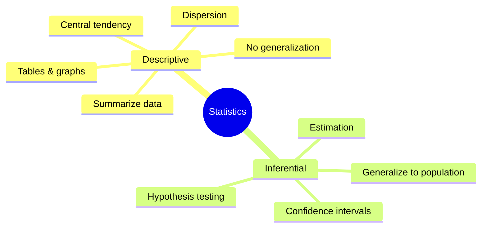
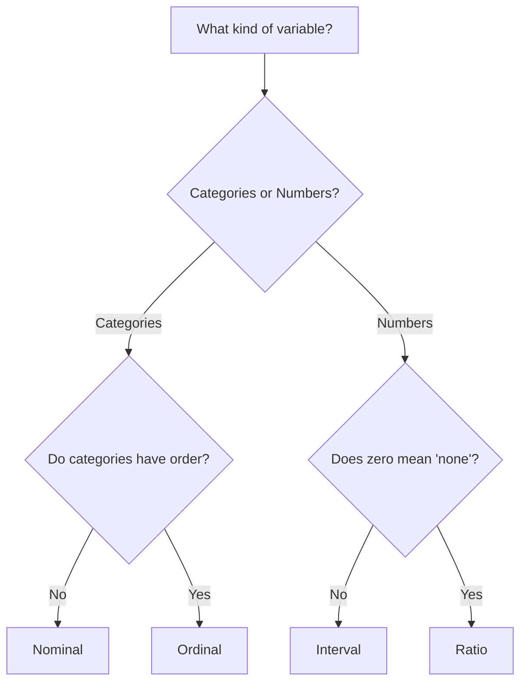
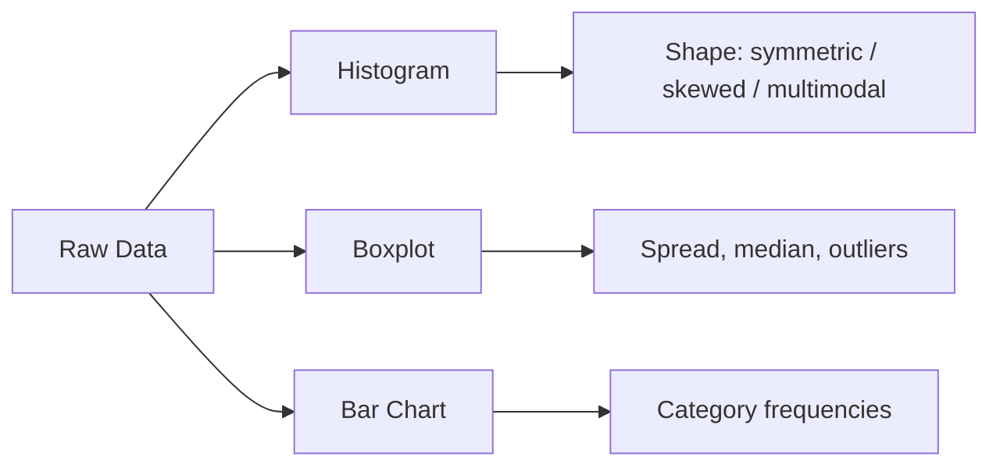

# Chapter 1: Descriptive Statistics

[⬅ Previous: Preface](../00-front-matter/preface.md) | [🏠 Home](../README.md) | [➡ Next: Central Tendency](./02-central-tendency.md)

---

## Learning Objectives

By the end of this chapter, you will be able to:

- [ ] Define descriptive statistics and distinguish it from inferential statistics
- [ ] Classify variables by measurement scale (nominal, ordinal, interval, ratio)
- [ ] Construct frequency distributions and grouped frequency tables
- [ ] Build and interpret histograms, boxplots, stem-and-leaf plots, and bar charts
- [ ] Compute basic summary statistics in R, Python, SPSS, STATA, and SAS
- [ ] Recognize how descriptive statistics are reported (and misreported) in published research
- [ ] Critique a "Table 1" from a real paper as a scientific reviewer would

## Prerequisites

- Basic algebra (summation notation, Σ)
- No prior statistics knowledge required

## Estimated Study Time

⏱️ 3–4 hours (including coding exercises)

---

## Why This Topic Matters

> [!TIP]
> Every statistical analysis — no matter how advanced — begins with descriptive statistics. If you cannot describe your data honestly, no p-value or machine learning model downstream will save you.

Descriptive statistics are the vocabulary of quantitative science. A logistic regression coefficient means nothing if you don't know that your outcome variable was coded 0/1 with a 92%/8% split. A "Table 1" in a clinical paper — the baseline characteristics table — is often the *most scrutinized* table by peer reviewers, because it reveals whether groups were comparable before any intervention.

## Big Picture



Descriptive statistics answer: **"What does my sample look like?"**
Inferential statistics answer: **"What can I conclude about the population?"**

This chapter covers only the first question. Chapters 5 onward cover the second.

## Historical Background

Modern descriptive statistics emerged from three converging traditions: political arithmetic (John Graunt's 1662 analysis of London mortality records), the German *Statistik* tradition of state description, and 19th-century social physics (Adolphe Quetelet's "average man," 1835). Karl Pearson later formalized moments, skewness, and kurtosis in the 1890s, giving descriptive statistics its modern mathematical vocabulary.

## Core Intuition

Imagine handing someone 10,000 raw numbers. They cannot process this. Descriptive statistics compress this into a handful of numbers and pictures that preserve the *essential shape* of the data — where it's centered, how spread out it is, and what shape it takes (symmetric, skewed, multimodal).

## Data Types and Measurement Scales

| Scale | Definition | Example | Valid Operations | Valid Central Tendency |
|---|---|---|---|---|
| **Nominal** | Categories, no order | Blood type, sex, country | =, ≠ | Mode only |
| **Ordinal** | Ordered categories, unequal intervals | Pain scale (mild/moderate/severe), education level | =, ≠, <, > | Median, mode |
| **Interval** | Ordered, equal intervals, no true zero | Temperature (°C), IQ score | +, −, comparisons | Mean, median, mode |
| **Ratio** | Ordered, equal intervals, true zero | Age, weight, blood pressure, income | +, −, ×, ÷ | Mean, median, mode |



> [!WARNING]
> A common error in published research is treating ordinal Likert-scale data (e.g., 1–5 agreement scales) as if it were interval data by computing means and running t-tests. Many reviewers now flag this and request non-parametric alternatives (Chapter 26 covers this debate in depth).

## Frequency Distributions

A **frequency distribution** tabulates how often each value (or range of values) occurs.

**Ungrouped example** — systolic blood pressure category counts (n = 50 patients):

| BP Category | Frequency (f) | Relative Frequency | Cumulative Frequency |
|---|---|---|---|
| Normal (<120) | 18 | 36% | 18 |
| Elevated (120–129) | 12 | 24% | 30 |
| Stage 1 HTN (130–139) | 11 | 22% | 41 |
| Stage 2 HTN (≥140) | 9 | 18% | 50 |

**Grouped frequency table construction rule (Sturges' Rule):**

$$k = 1 + 3.322 \log_{10}(n)$$

where $k$ is the recommended number of class intervals and $n$ is the sample size.

## Graphical Presentation

| Chart Type | Best For | Avoid When |
|---|---|---|
| Histogram | Continuous data distribution shape | Small n (<20) |
| Bar chart | Categorical comparisons | Continuous data |
| Boxplot | Comparing spread/outliers across groups | Bimodal data (hides modes) |
| Stem-and-leaf | Small datasets, retains raw values | Large n |
| Pie chart | Simple part-of-whole (≤5 categories) | More than 5–6 categories |



## Worked Example

**Dataset**: Systolic blood pressure (mmHg) of 10 patients:
`118, 122, 130, 145, 119, 125, 138, 128, 121, 150`

**Manual calculation of range**: max − min = 150 − 118 = **32 mmHg**

**Sorted data**: 118, 119, 121, 122, 125, 128, 130, 138, 145, 150

We revisit this exact dataset in Chapter 2 (Central Tendency) and Chapter 3 (Dispersion) to compute mean, median, variance, and standard deviation on the same numbers, so you can trace one dataset through all three chapters.

## Software Implementation

### R

```r
bp <- c(118, 122, 130, 145, 119, 125, 138, 128, 121, 150)

summary(bp)                 # Five-number summary
hist(bp, main = "Systolic BP Distribution", xlab = "mmHg", col = "steelblue")
boxplot(bp, main = "Systolic BP Boxplot")

# Frequency table with cut()
bp_cat <- cut(bp, breaks = c(0, 120, 130, 140, 200),
              labels = c("Normal", "Elevated", "Stage1", "Stage2"))
table(bp_cat)
prop.table(table(bp_cat)) * 100
```

### Python

```python
import pandas as pd
import matplotlib.pyplot as plt

bp = pd.Series([118, 122, 130, 145, 119, 125, 138, 128, 121, 150])

print(bp.describe())

bp.plot(kind="hist", bins=5, title="Systolic BP Distribution")
plt.xlabel("mmHg")
plt.show()

bp.plot(kind="box", title="Systolic BP Boxplot")
plt.show()

# Frequency table
bins = [0, 120, 130, 140, 200]
labels = ["Normal", "Elevated", "Stage1", "Stage2"]
bp_cat = pd.cut(bp, bins=bins, labels=labels)
print(bp_cat.value_counts())
print(bp_cat.value_counts(normalize=True) * 100)
```

### SPSS

```spss
FREQUENCIES VARIABLES=bp
  /STATISTICS=MEAN MEDIAN MODE STDDEV RANGE MIN MAX
  /HISTOGRAM
  /ORDER=ANALYSIS.

EXAMINE VARIABLES=bp
  /PLOT BOXPLOT HISTOGRAM
  /STATISTICS DESCRIPTIVES.
```

### STATA

```stata
summarize bp, detail
histogram bp, normal
graph box bp

* Grouped frequency table
egen bp_cat = cut(bp), at(0,120,130,140,200) label
tabulate bp_cat
```

### SAS

```sas
PROC MEANS DATA=work.patients N MEAN MEDIAN STD MIN MAX;
    VAR bp;
RUN;

PROC SGPLOT DATA=work.patients;
    HISTOGRAM bp;
RUN;

PROC FORMAT;
    VALUE bpfmt low-120='Normal' 120-<130='Elevated'
                130-<140='Stage1' 140-high='Stage2';
RUN;

PROC FREQ DATA=work.patients;
    TABLES bp;
    FORMAT bp bpfmt.;
RUN;
```

## Real Research Example — DHS Survey

In Demographic and Health Survey (DHS) datasets, descriptive statistics are always reported **weighted** (using sampling weights), because DHS uses stratified multi-stage cluster sampling. A common reviewer complaint on manuscripts using DHS data is reporting unweighted percentages without justification — this is covered fully in Chapter 16 (Survey Statistics — DHS).

## Common Mistakes

| Mistake | Why It's Wrong | Fix |
|---|---|---|
| Reporting mean ± SD for skewed data | Mean is not representative under skew | Report median (IQR) |
| Using pie charts for >6 categories | Impossible to compare slice sizes visually | Use bar chart |
| Ignoring missing data in frequency tables | Percentages misleading | Report valid % and missing % separately |
| Treating Likert data as interval by default | Distorts distributional assumptions | Justify explicitly or use ordinal methods |

## Reviewer Perspective

> [!NOTE]
> **Typical Journal Reviewer Comment**: *"Table 1 reports means and standard deviations for length of hospital stay, which is typically right-skewed. Please report median and interquartile range instead, or justify the use of the mean."*

## AI Evaluation Perspective

When an AI system (e.g., an automated statistical review assistant) scans a manuscript's Table 1, it typically checks: (1) whether the variable's reported summary statistic matches its likely distribution shape, (2) whether percentages sum to ~100% within categories, and (3) whether sample sizes are consistent across all reported variables.

## Frequently Asked Questions

**Q: Is descriptive statistics "real" statistics, or just data summary?**
A: It is the foundation of all statistics. Every inferential test relies on assumptions about the same distributional shape that descriptive statistics reveal.

**Q: Should I always report both mean and median?**
A: For skewed data, reporting both (plus the SD and IQR) is increasingly the norm in high-quality journals, since it lets readers judge skewness themselves.

## Practice Problems

### MCQs
1. Which measurement scale has a true zero point? (a) Nominal (b) Ordinal (c) Interval (d) **Ratio**
2. Sturges' Rule is used to determine: (a) sample size (b) **number of class intervals** (c) confidence level (d) skewness

### Short Questions
1. Classify: eye color, exam grade (A–F), temperature in °C, number of children.
2. Why is a pie chart discouraged for data with 10 categories?

### Programming Exercise
Using the blood pressure dataset above, reproduce the histogram and frequency table in **both** R and Python and compare the visual outputs.

## Chapter Summary

- Descriptive statistics summarize a *sample*; inferential statistics generalize to a *population*.
- Measurement scale (nominal/ordinal/interval/ratio) determines which summary statistics are valid.
- Frequency distributions and graphs (histogram, boxplot, bar chart) reveal shape, center, and spread.
- Real-world data often violates convenient assumptions (e.g., skew) — reviewers actively check for this.

## Key Takeaways

- 📌 Always check measurement scale before choosing a summary statistic.
- 📌 Visualize before you summarize numerically.
- 📌 Mismatched statistic-to-distribution-shape is one of the most common reviewer complaints.

## Recommended Papers

- Altman, D.G. & Bland, J.M. (1996). "Presentation of numerical data." *BMJ*.
- Vetter, T.R. (2017). "Descriptive Statistics: Reporting the Answers to the 5 Basic Questions." *Anesthesia & Analgesia*.

## Further Reading

- Tukey, J.W. (1977). *Exploratory Data Analysis*. Addison-Wesley.

## References

1. Graunt, J. (1662). *Natural and Political Observations Made upon the Bills of Mortality*.
2. Pearson, K. (1895). "Contributions to the Mathematical Theory of Evolution." *Philosophical Transactions of the Royal Society*.
3. Sturges, H.A. (1926). "The Choice of a Class Interval." *Journal of the American Statistical Association*.

---

## Previous Chapter
[⬅ Preface](../00-front-matter/preface.md)

## Next Chapter
[➡ Chapter 2: Central Tendency](./02-central-tendency.md)
