# 📊 Chapter 1: Descriptive Statistics

### *From First Principles to Publication-Ready Analysis*

<div align="center">

[]()
[]()
[]()
[]()

**[⬆ Back to Repository](../README.md) · [📚 Previous Chapter](#) · [➡️ Next Chapter](#)**

</div>

---

> *"The goal is to turn data into information, and information into insight."* — **Carly Fiorina**

---

## 📋 Table of Contents

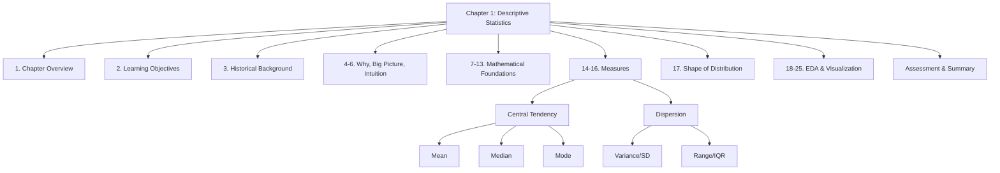

---

## 1. Chapter Overview

> 💡 **Key Insight**: Descriptive statistics is the foundation upon which all statistical inference is built. It provides the language and tools to summarize, visualize, and understand data before applying more complex analytical methods.

Welcome to the first chapter of *Statistics for Scientists*. This chapter serves as your gateway to understanding how to make sense of data—the lifeblood of modern scientific inquiry. Descriptive statistics is not merely about calculating means and standard deviations; it is about developing a deep, intuitive understanding of your data's structure, patterns, and peculiarities.

### Why This Chapter Matters

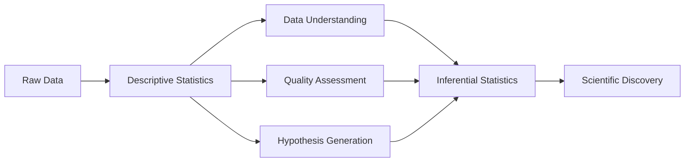

### What Makes This Chapter Different

| Feature | Benefit |
|---------|---------|
| **Graduate-Level Rigor** | Full derivations, proofs, and mathematical foundations |
| **Multi-Software Implementation** | R, Python, SPSS, STATA, SAS, Excel code for every method |
| **Real Research Datasets** | Iris, Titanic, DHS, clinical trials, public health data |
| **Reviewer Perspective** | What Q1 journal reviewers actually check |
| **AI Literacy** | Detect and avoid AI hallucinations in statistics |
| **Publication-Ready Output** | Tables and figures meeting journal standards |

---

## 2. Learning Objectives

### 🎯 **By the end of this chapter, you will be able to:**

#### **Foundational Level**
- Define and differentiate between types of data (nominal, ordinal, interval, ratio)
- Calculate and interpret measures of central tendency (mean, median, mode)
- Compute and interpret measures of dispersion (range, variance, standard deviation)
- Create and interpret basic visualizations (histograms, boxplots)

#### **Intermediate Level**
- Choose appropriate descriptive statistics based on data type and distribution
- Understand the mathematical properties and proofs behind statistical measures
- Apply descriptive statistics to real datasets using R, Python, and other tools
- Interpret skewness and kurtosis in the context of data distributions

#### **Advanced Level**
- Critically evaluate descriptive statistics in published research
- Understand the assumptions and limitations of each measure
- Apply descriptive statistics in machine learning and AI contexts
- Report statistics according to CONSORT, STROBE, and other guidelines
- Detect and correct common statistical errors in research manuscripts

---

## 3. Historical Background

### 📜 **The Genesis of Statistical Thinking**

> *"Numbers have an important story to tell. They rely on you to give them a clear and convincing voice."* — **Stephen Few**

Descriptive statistics, as we know it today, emerged from a confluence of needs: governmental administration, astronomy, biology, and the desire to understand human populations. Let's trace this fascinating journey.

#### **Ancient Beginnings**

The roots of descriptive statistics stretch back to ancient civilizations:

| Time Period | Culture | Contribution |
|-------------|---------|--------------|
| 3000 BCE | Babylonians | Earliest recorded census data for taxation |
| 2700 BCE | Egyptians | Population records for pyramid construction |
| 500 BCE | Greeks | Aristotle's collection of constitutions |
| 1086 CE | Norman England | Domesday Book - comprehensive land survey |

#### **The Renaissance and Early Modern Period**

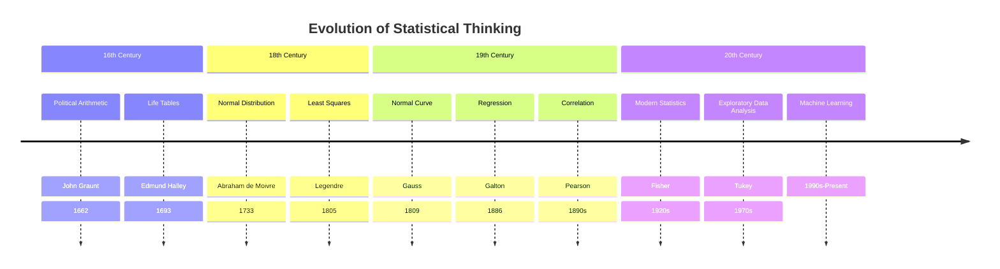

#### **Key Contributors**

**John Graunt (1620-1674)**
- Published "Natural and Political Observations Made upon the Bills of Mortality"
- First to analyze birth and death records systematically
- Created one of the first life tables
- Introduced the concept of statistical inference

**William Petty (1623-1687)**
- Coined the term "political arithmetic"
- Pioneered quantitative methods for social sciences
- Emphasized the importance of data-based decision making

**Abraham de Moivre (1667-1754)**
- Discovered the normal distribution approximation to the binomial
- First to use probability theory in statistics
- Developed the concept of the "bell curve"

**Carl Friedrich Gauss (1777-1855)**
- Formalized the method of least squares
- Developed the normal distribution in his astronomical work
- Created foundations for modern statistical theory

**Francis Galton (1822-1911)**
- Introduced correlation and regression concepts
- Developed the concept of "regression to the mean"
- Pioneered statistical applications in biology

**Karl Pearson (1857-1936)**
- Developed the chi-square test
- Created the correlation coefficient
- Established the first university statistics department

**Ronald A. Fisher (1890-1962)**
- Revolutionized experimental design
- Developed analysis of variance (ANOVA)
- Created maximum likelihood estimation
- Wrote "Statistical Methods for Research Workers"

**John W. Tukey (1915-2000)**
- Coined the term "exploratory data analysis"
- Developed the boxplot
- Introduced the Fast Fourier Transform algorithm
- Emphasized visual data exploration

### 🌍 **Evolution of Statistical Thinking**

The evolution of statistical thinking can be characterized by several paradigm shifts:

1. **Descriptive to Inferential** (1800s)
   - From describing data to making predictions
   - Introduction of probability theory

2. **Deterministic to Probabilistic** (1900s)
   - Acknowledging uncertainty in measurements
   - Development of confidence intervals and hypothesis testing

3. **Confirmatory to Exploratory** (1970s)
   - Tukey's emphasis on data visualization
   - Recognition that data should guide analysis

4. **Analogue to Digital** (1980s-1990s)
   - Computational statistics
   - Resampling methods

5. **Classical to Machine Learning** (2000s-present)
   - Integration with computer science
   - Emphasis on prediction and big data

---

## 4. Why Descriptive Statistics Matters

### 🔬 **In Scientific Research**

Descriptive statistics serves as the foundation for all scientific inquiry:

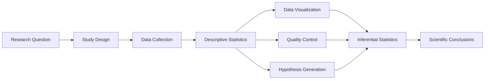

#### **Critical Functions**

1. **Data Quality Assessment**
   - Identify outliers and errors
   - Check assumptions for further analyses
   - Ensure data completeness

2. **Understanding Patterns**
   - Discover relationships between variables
   - Identify subgroups and patterns
   - Generate hypotheses

3. **Communication**
   - Summarize complex data for stakeholders
   - Present findings in publications
   - Support evidence-based decision-making

4. **Methodological Rigor**
   - Assess study feasibility
   - Determine sample size requirements
   - Validate measurement instruments

### 🏥 **In Medical Research**

Descriptive statistics are fundamental to medical research:

- **Clinical Trials**: Baseline characteristics of participants
- **Epidemiology**: Disease incidence and prevalence rates
- **Public Health**: Population health indicators
- **Bioinformatics**: Genomic data summarization
- **Drug Development**: Safety and efficacy profiles

### 🤖 **In Machine Learning and AI**

> *"The goal is to turn data into information, and information into insight."* — **Carly Fiorina**

Descriptive statistics underpin all machine learning:

| ML Component | Role of Descriptive Statistics |
|--------------|-------------------------------|
| Data Preprocessing | Understanding distributions, handling missing values |
| Feature Engineering | Scaling, normalization, transformation |
| Model Selection | Understanding data characteristics |
| Evaluation | Performance metrics interpretation |
| Feature Importance | Understanding variable relationships |

---

## 5. Big Picture

### 🌐 **The Statistical Pipeline**

Descriptive statistics occupies the critical first step in the statistical analysis pipeline:

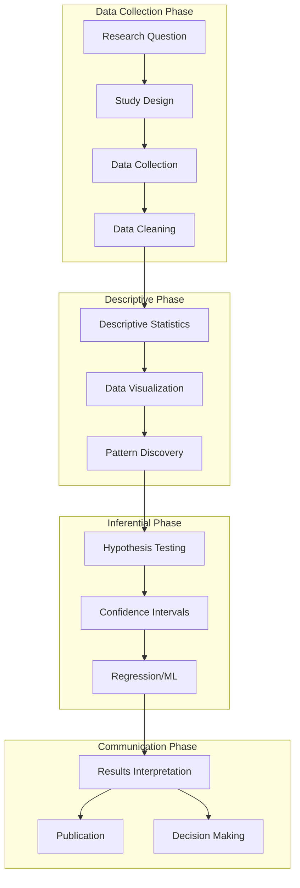

### 📊 **The Descriptive Statistics Framework**

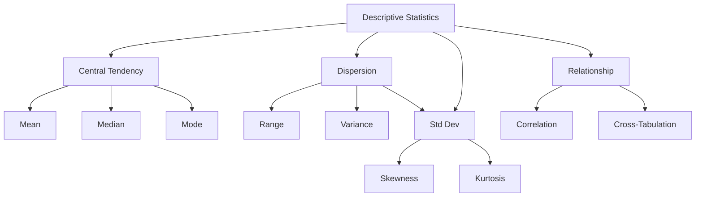

---

## 6. Core Intuition

### 🧠 **Understanding Data Through Stories**

Think of descriptive statistics as a way to tell the story of your data. When you meet a new person, you first notice their height, age, and other basic characteristics. Similarly, descriptive statistics helps us understand the basic characteristics of our data.

#### **A Simple Analogy**

Imagine you're describing a class of students:

| Characteristic | Statistical Equivalent |
|---------------|----------------------|
| Average height | Mean |
| Most common height | Mode |
| Middle height | Median |
| How spread out heights are | Standard Deviation |
| Whether heights are symmetric | Skewness |
| Whether there are extremes | Kurtosis |

### 💡 **The Four Key Questions**

Every descriptive analysis should answer four fundamental questions:

1. **What is the center?** (Central Tendency)
   - Where is the bulk of the data located?
   - What is a typical value?

2. **How spread out is it?** (Dispersion)
   - How much variation exists?
   - How reliable is the center?

3. **What is the shape?** (Distribution)
   - Is it symmetric or skewed?
   - Are there outliers?

4. **How are variables related?** (Association)
   - Do variables move together?
   - Are there subgroups?

---

## 7. Formal Definitions

### 📐 **Basic Concepts**

#### **Data Types**

> **Definition**: Data types classify the nature of collected information, determining which statistical measures are appropriate.

| Type | Description | Examples | Permissible Operations |
|------|-------------|----------|----------------------|
| **Nominal** | Categories without order | Gender, blood type, country | Mode, frequency counts |
| **Ordinal** | Ordered categories | Education level, income brackets | Mode, median, percentiles |
| **Interval** | Equal intervals, no true zero | Temperature (°C), IQ scores | Mean, SD, correlation |
| **Ratio** | Equal intervals, true zero | Height, weight, age | All operations |

#### **Variables**

> **Definition**: A variable is any characteristic that can be measured and can vary across individuals or observations.

**Classification Framework:**

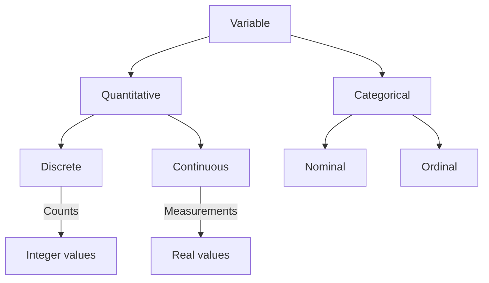

### 📊 **Population vs. Sample**

> **Definition**: The population is the complete set of all individuals or observations of interest. A sample is a subset drawn from the population for analysis.

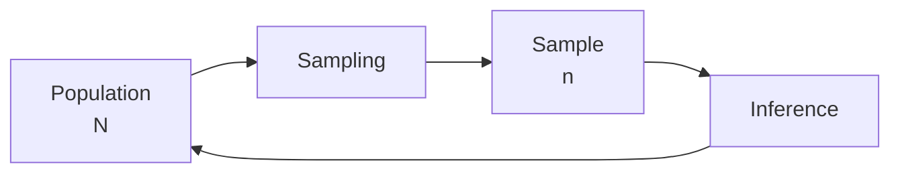

**Key Distinctions:**

| Aspect | Population | Sample |
|--------|-----------|--------|
| Size | N | n |
| Parameter | μ, σ, ρ | Statistic |
| Notation | Greek | Roman |
| Access | Usually unknown | Known |
| Cost | Expensive | Feasible |

---

## 8. Mathematical Foundations

### 📚 **Set Theory Foundations**

#### **Basic Concepts**

> **Definition**: A dataset is a set of observations \(X = \{x_1, x_2, ..., x_n\}\) where each \(x_i\) is a measurement on a variable of interest.

**Key Set Operations in Statistics:**

| Operation | Notation | Statistical Application |
|-----------|----------|------------------------|
| Union | \(A \cup B\) | Combined events |
| Intersection | \(A \cap B\) | Joint events |
| Complement | \(A^c\) | Not A events |
| Cardinality | \(n(A)\) | Frequency count |

### 🔢 **Probability Foundations**

#### **Fundamental Axioms**

1. **Non-negativity**: \(P(A) \geq 0\) for any event A
2. **Unity**: \(P(S) = 1\) for sample space S
3. **Additivity**: For mutually exclusive events, \(P(A \cup B) = P(A) + P(B)\)

#### **Random Variables**

> **Definition**: A random variable is a function that assigns a real number to each outcome in the sample space.

**Two Types:**

1. **Discrete**: Finite or countable possible values
   - Example: Number of patients in a clinic
   
2. **Continuous**: Infinite possible values
   - Example: Blood pressure measurements

### 📈 **Statistical Functions**

#### **Order Statistics**

> **Definition**: Order statistics are the values in a dataset arranged in ascending order: \(x_{(1)} \leq x_{(2)} \leq ... \leq x_{(n)}\)

**Important Order Statistics:**

| Order Statistic | Definition | Application |
|----------------|------------|-------------|
| Minimum | \(x_{(1)}\) | Smallest value |
| Maximum | \(x_{(n)}\) | Largest value |
| Median | \(x_{(n+1)/2}\) | Central tendency |
| Quartiles | \(x_{k/4}\) | Data spread |

#### **Moments of a Distribution**

The moments of a distribution provide mathematical characterizations:

**Raw Moments (about zero):**
$$\mu_k' = E[X^k]$$

**Central Moments (about mean):**
$$\mu_k = E[(X - \mu)^k]$$

| Moment | Order | Statistical Meaning |
|--------|-------|-------------------|
| μ₁ | 1st | Mean (location) |
| μ₂ | 2nd | Variance (spread) |
| μ₃ | 3rd | Skewness (symmetry) |
| μ₄ | 4th | Kurtosis (tails) |

---

## 9. Axioms

### 🎯 **Fundamental Axioms of Descriptive Statistics**

#### **Axiom 1: Measurement Axiom**

> Every variable must be measured according to its defined measurement scale, and measurements must be consistent and reproducible.

**Implications:**
- Proper measurement instruments
- Consistent data collection procedures
- Documentation of measurement protocols

#### **Axiom 2: Central Tendency Axiom**

> For any dataset, there exists at least one measure of central tendency, and the choice depends on the measurement scale and distribution.

**Implications:**
- Mean for symmetric, quantitative data
- Median for skewed or ordinal data
- Mode for categorical data

#### **Axiom 3: Dispersion Axiom**

> The spread of data around its center must be quantified in a way that is appropriate for the measurement scale.

**Implications:**
- Standard deviation for symmetric data
- IQR for skewed data
- Range for preliminary assessment

#### **Axiom 4: Distribution Axiom**

> Every dataset has a distribution that can be described by its shape, and this shape must be assessed before selecting methods.

**Implications:**
- Check assumptions before analysis
- Transform data when necessary
- Choose appropriate measures based on distribution

---

## 10. Important Theorems

### 📐 **Theorems in Descriptive Statistics**

#### **Theorem 1: The Sum of Deviations from the Mean**

> The sum of deviations of all observations from their mean equals zero.

**Mathematical Statement:**
$$\sum_{i=1}^n (x_i - \bar{x}) = 0$$

**Proof:**
Let \(\bar{x} = \frac{1}{n}\sum_{i=1}^n x_i\)

Then:
$$\sum_{i=1}^n (x_i - \bar{x}) = \sum_{i=1}^n x_i - \sum_{i=1}^n \bar{x} = n\bar{x} - n\bar{x} = 0$$

**Implication:** The mean is the balancing point of the data.

#### **Theorem 2: Minimum Variance Property**

> The sample variance is the minimum variance estimator of the population variance.

**Proof Sketch:**
For any estimator \(S^2 = c\sum(x_i - \bar{x})^2\), the value \(c = 1/(n-1)\) minimizes the mean squared error.

#### **Theorem 3: Chebyshev's Inequality**

> For any dataset, the proportion of observations within k standard deviations of the mean is at least \(1 - 1/k^2\).

**Mathematical Form:**
$$P(|X - \mu| < k\sigma) \geq 1 - \frac{1}{k^2}$$

**Application:**
- \(k = 2\): at least 75% within 2 SDs
- \(k = 3\): at least 88.9% within 3 SDs

#### **Theorem 4: Medians and Quantiles**

> For a sample of size n, the median minimizes the sum of absolute deviations.

**Mathematical Statement:**
$$m = \arg\min_c \sum_{i=1}^n |x_i - c|$$

**Proof Intuition:** The median is the point where moving it in either direction increases the sum of absolute deviations.

---

## 11. Proofs of Important Mathematical Results

### 📝 **Detailed Proofs**

#### **Proof 1: Mean as a Linear Operator**

**Property:** \(\overline{ax + b} = a\bar{x} + b\)

**Proof:**
$$
\overline{ax + b} = \frac{1}{n}\sum_{i=1}^n (ax_i + b)
$$
$$
= \frac{a}{n}\sum_{i=1}^n x_i + \frac{1}{n}\sum_{i=1}^n b
$$
$$
= a\bar{x} + b
$$

**Implications:**
- Linear transformations preserve the interpretation of the mean
- Standardizing variables maintains this property

#### **Proof 2: Variance Simplification**

**Property:** \(\sigma^2 = E[X^2] - \mu^2\)

**Proof:**
$$
\sigma^2 = E[(X - \mu)^2] = E[X^2 - 2X\mu + \mu^2]
$$
$$
= E[X^2] - 2\mu E[X] + \mu^2 = E[X^2] - 2\mu^2 + \mu^2 = E[X^2] - \mu^2
$$

**Alternative Form:**
$$s^2 = \frac{1}{n}\sum_{i=1}^n x_i^2 - \bar{x}^2$$

#### **Proof 3: Variance of Linear Transformations**

**Property:** If \(Y = aX + b\), then \(\text{Var}(Y) = a^2\text{Var}(X)\)

**Proof:**
$$
\text{Var}(aX + b) = E[(aX + b - a\mu_X - b)^2] = E[a^2(X - \mu_X)^2] = a^2\text{Var}(X)
$$

**Implications:**
- Adding a constant doesn't change variance
- Multiplying by a constant scales variance by its square

#### **Proof 4: Relationship between Mean and Median**

**Property:** For a symmetric distribution, the mean equals the median.

**Proof Sketch:**
1. A symmetric distribution has a center point c where f(c - d) = f(c + d) for all d
2. The mean exists and equals c
3. The median also equals c
4. Therefore, mean = median

**Note:** The converse is not necessarily true.

---

## 12. Formula Derivations

### 🔢 **Detailed Derivations**

#### **Derivation 1: Geometric Mean**

The geometric mean of n positive numbers is:
$$G = (x_1 \cdot x_2 \cdot \ldots \cdot x_n)^{1/n} = \exp\left(\frac{1}{n}\sum_{i=1}^n \ln x_i\right)$$

**Derivation Steps:**
1. Take the natural log of both sides:
   \(\ln G = \frac{1}{n}\sum_{i=1}^n \ln x_i\)

2. The left side is the arithmetic mean of the logged values

3. Take the exponential of both sides to get G

**Application:** Growth rates, ratios, and multiplicative processes.

#### **Derivation 2: Harmonic Mean**

The harmonic mean is:
$$H = \frac{n}{\sum_{i=1}^n \frac{1}{x_i}}$$

**Derivation:**
1. Consider the reciprocal of the mean of reciprocals

2. For rates and ratios, this provides the appropriate average

**Application:** Average speed, rate problems.

#### **Derivation 3: Pooled Variance**

For two samples:
$$s_p^2 = \frac{(n_1 - 1)s_1^2 + (n_2 - 1)s_2^2}{n_1 + n_2 - 2}$$

**Derivation:**
1. Pooled sum of squares = SS₁ + SS₂
2. Pooled degrees of freedom = (n₁ - 1) + (n₂ - 1)
3. Variance = sum of squares / degrees of freedom

#### **Derivation 4: Standard Error of the Mean**

$$SE(\bar{x}) = \frac{\sigma}{\sqrt{n}}$$

**Derivation:**
1. Var(\(\bar{x}\)) = Var(\(\frac{1}{n}\sum x_i\))
2. = \(\frac{1}{n^2}\sum\) Var(\(x_i\))
3. = \(\frac{1}{n^2} \cdot n\sigma^2 = \frac{\sigma^2}{n}\)
4. SE = \(\sqrt{\text{Var}(\bar{x})} = \frac{\sigma}{\sqrt{n}}\)

---

## 13. Assumptions

### 📋 **Statistical Assumptions**

#### **For Measures of Central Tendency**

| Measure | Assumptions | Violation Consequences |
|---------|-------------|----------------------|
| **Mean** | • Quantitative data<br>• Symmetric distribution<br>• No extreme outliers | • Misleading center<br>• Sensitive to outliers |
| **Median** | • Ordinal or quantitative data<br>• Can handle any distribution | • Less efficient for normal data |
| **Mode** | • Categorical or quantitative data<br>• Well-defined peak | • May be undefined or non-unique |

#### **For Measures of Dispersion**

| Measure | Assumptions | Violation Consequences |
|---------|-------------|----------------------|
| **Variance** | • Quantitative data<br>• Appropriate mean exists | • Affected by outliers |
| **SD** | • Quantitative data<br>• Typically symmetric distribution | • Misleading for skewed data |
| **IQR** | • Ordinal or quantitative data<br>• No assumptions needed | • Less sensitive to variation |

#### **Key Considerations**

1. **Normality Assumption**
   - Not always required for descriptive statistics
   - Important for interpretation of SD

2. **Independence Assumption**
   - Affects generalizability
   - Important for sampling

3. **Homogeneity Assumption**
   - Equal variances across groups
   - Important for comparisons

---

## 14. Types of Descriptive Statistics

### 📊 **Classification Framework**

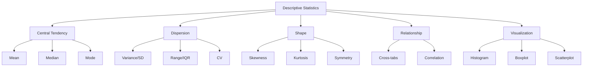

### 🎯 **Choice of Measures by Data Type**

| Data Type | Central Tendency | Dispersion | Visualization |
|-----------|-----------------|------------|---------------|
| **Nominal** | Mode | Frequency | Bar chart, Pie chart |
| **Ordinal** | Median, Mode | IQR, Range | Boxplot, Histogram |
| **Interval/Ratio** | Mean, Median | SD, IQR, Variance | Histogram, Boxplot |

---

## 15. Measures of Central Tendency

### 15.1 Arithmetic Mean

> 📖 **Definition**: The arithmetic mean, often simply called the mean or average, is the sum of all observations divided by the number of observations.

#### **Mathematical Formula**

For a population:
$$\mu = \frac{1}{N}\sum_{i=1}^N x_i$$

For a sample:
$$\bar{x} = \frac{1}{n}\sum_{i=1}^n x_i$$

#### **Derivation**

The mean can be derived from the minimization problem:
$$\bar{x} = \arg\min_c \sum_{i=1}^n (x_i - c)^2$$

**Proof:**
1. Let \(S = \sum (x_i - c)^2\)
2. \(\frac{dS}{dc} = -2\sum (x_i - c)\)
3. Set \(\frac{dS}{dc} = 0\): \(\sum (x_i - c) = 0\)
4. Solve: \(nc = \sum x_i\) → \(c = \bar{x}\)

#### **Properties**

> 📊 **Key Properties of the Mean**

1. **Unbiasedness**: The expected value equals the population mean
   $$E[\bar{x}] = \mu$$

2. **Efficiency**: The mean has the lowest variance among unbiased estimators

3. **Linearity**: For transformed variables \(y_i = ax_i + b\)
   $$\bar{y} = a\bar{x} + b$$

4. **Minimality**: Minimizes the sum of squared deviations

#### **Advantages**

| Advantage | Description |
|-----------|-------------|
| **Familiarity** | Widely understood and used |
| **Efficiency** | Uses all data points |
| **Mathematical Properties** | Has excellent statistical properties |
| **Estimation** | Easy to estimate population parameters |

#### **Disadvantages**

| Disadvantage | Description |
|--------------|-------------|
| **Sensitivity** | Highly affected by outliers |
| **Skewness** | Not robust to skewness |
| **Interpretation** | May not represent "typical" value |

#### **Interpretation**

> 💡 **Key Insight**: The mean represents the balance point of the data, where the sum of distances above and below are equal.

**Practical Interpretation:**
- For symmetric distributions: "average" or "typical"
- For skewed distributions: "center" but not "typical"
- In medical research: average blood pressure, mean survival time

#### **Real-World Applications**

<details>
<summary>📋 Click to expand application examples</summary>

**Medical Example:**
> A clinical trial reports mean reduction in systolic blood pressure of 12.5 mmHg (SD: 3.2) for the treatment group.

**Public Health Example:**
> The mean daily calorie intake among US adults increased from 2,245 in 1990 to 2,425 in 2010.

**Machine Learning Example:**
> Feature scaling using z-score normalization: \(z_i = \frac{x_i - \bar{x}}{s_x}\)

**Journal Example:**
> In reporting baseline characteristics, means and SDs must be presented with appropriate precision (usually one decimal more than the data).

**Reviewer Notes:**
> Ensure means are reported for appropriate data types and distributions. Consider reporting medians for skewed data.

**Common Mistakes:**
- Reporting mean for ordinal data
- Using mean when data are skewed
- Ignoring outliers that affect the mean

</details>

### 15.2 Weighted Mean

> 📖 **Definition**: The weighted mean accounts for the differential importance or frequency of observations by assigning weights \(w_i\) to each observation.

#### **Mathematical Formula**

$$\bar{x}_w = \frac{\sum_{i=1}^n w_i x_i}{\sum_{i=1}^n w_i}$$

#### **Derivation**

1. If weights represent frequencies, the weighted mean is equivalent to the mean of the expanded dataset.
2. For general weights, it minimizes the weighted sum of squared deviations.

**Proof:**
Minimize \(S_w = \sum w_i (x_i - c)^2\)

Set derivative to zero:
$$\frac{dS_w}{dc} = -2\sum w_i(x_i - c) = 0$$
$$\sum w_i x_i = c\sum w_i \Rightarrow c = \frac{\sum w_i x_i}{\sum w_i}$$

#### **Common Weight Types**

| Weight Type | Example | Use Case |
|-------------|---------|----------|
| **Frequency** | Number of observations | Survey data |
| **Inverse Variance** | 1/s² | Meta-analysis |
| **Survey Design** | Sampling weights | Complex surveys |

#### **Applications**

1. **Survey Research**
   - Adjusting for different sampling probabilities
   - Population weighting

2. **Meta-Analysis**
   - Combining study results
   - Weighting by precision

3. **Composite Indices**
   - Creating weighted averages
   - Human Development Index

### 15.3 Geometric Mean

> 📖 **Definition**: The geometric mean is the nth root of the product of n positive numbers, often used for multiplicative processes.

#### **Mathematical Formula**

For positive values:
$$G = \left(\prod_{i=1}^n x_i\right)^{1/n}$$

Equivalent form:
$$G = \exp\left(\frac{1}{n}\sum_{i=1}^n \ln x_i\right)$$

#### **Derivation**

The geometric mean arises from the relationship:
$$\ln G = \frac{1}{n}\sum_{i=1}^n \ln x_i$$

This shows that \(G\) is the exponential of the arithmetic mean of the logged values.

#### **Properties**

> 📊 **Key Properties**

1. **Multiplicative**: \(G\) is the value that, if multiplied n times, gives the product of all values
2. **Scale-Invariant**: Multiplying all values by c multiplies G by c
3. **Log-normality**: If data are log-normal, G is a robust measure of central tendency

#### **Advantages and Disadvantages**

| Advantage | Description |
|-----------|-------------|
| **Multiplicative Data** | Ideal for rates and ratios |
| **Growth Rates** | Appropriate for average growth |
| **Skewed Data** | Less affected by skewness than arithmetic mean |

#### **Applications**

<details>
<summary>📋 Click to expand application examples</summary>

**Medical Example:**
> Geometric mean antibody titers after vaccination are often reported in immunology studies.

**Public Health Example:**
> Geometric mean of environmental exposures (e.g., chemical concentrations) in population studies.

**Machine Learning Example:**
> In feature engineering for multiplicative interactions or log-transformed features.

**Real-World Example:**
> Average investment returns over multiple periods:
> $$R_G = \sqrt[n]{\prod_{i=1}^n (1 + r_i)} - 1$$

</details>

### 15.4 Harmonic Mean

> 📖 **Definition**: The harmonic mean is the reciprocal of the arithmetic mean of reciprocals.

#### **Mathematical Formula**

$$H = \frac{n}{\sum_{i=1}^n \frac{1}{x_i}}$$

#### **Derivation**

1. Consider the average reciprocal: \(\bar{r} = \frac{1}{n}\sum \frac{1}{x_i}\)
2. The harmonic mean is the reciprocal of this average

**Interpretation**: \(H\) is the value such that the average of its reciprocals equals the average of the reciprocals of the data.

#### **Properties**

> 📊 **Key Properties**

1. **Rate Averaging**: Appropriate for rates and ratios
2. **Less Influenced**: Less influenced by small values than by large
3. **Relationship**: For positive values, \(H \leq G \leq A\)

#### **Applications**

| Application | Example |
|-------------|---------|
| **Speed Problems** | Average speed for equal distances |
| **Finance** | Average purchase price for equal investments |
| **Education** | Average rates in educational research |

### 15.5 Median

> 📖 **Definition**: The median is the middle value when data are arranged in ascending order, splitting the dataset into two equal halves.

#### **Mathematical Definition**

For ordered data \(x_{(1)} \leq x_{(2)} \leq ... \leq x_{(n)}\):

$$\text{Median} = 
\begin{cases}
x_{(n+1)/2} & \text{if n is odd} \\
\frac{x_{n/2} + x_{n/2+1}}{2} & \text{if n is even}
\end{cases}$$

#### **Derivation**

The median is the solution to:
$$\text{Median} = \arg\min_c \sum_{i=1}^n |x_i - c|$$

**Proof:**
1. Let \(F(c) = \sum |x_i - c|\)
2. The derivative \(F'(c) = \#\{x_i > c\} - \#\{x_i < c\}\)
3. Set \(F'(c) = 0\): equal numbers on both sides
4. This gives the median

#### **Properties**

> 📊 **Key Properties**

1. **Robustness**: Resistant to outliers
2. **Invariance**: Median(\(aX + b\)) = \(a\)·Median(\(X\)) + \(b\)
3. **Location**: Represents central position
4. **Order**: Depends only on relative order

#### **Advantages and Disadvantages**

| Aspect | Details |
|--------|---------|
| **Advantages** | • Robust to outliers<br>• Appropriate for ordinal data<br>• Works with skewed distributions |
| **Disadvantages** | • Less efficient than mean<br>• Loses information<br>• Higher sampling variation |

#### **Applications**

<details>
<summary>📋 Click to expand application examples</summary>

**Medical Example:**
> Median survival time in clinical trials is often reported for time-to-event outcomes.

**Public Health Example:**
> Median household income is preferred over mean income for describing economic status.

**Machine Learning Example:**
> In missing value imputation, median is often used for skewed features.

**Real-World Example:**
> House prices: The median price is preferred over mean due to high-end outliers.

</details>

### 15.6 Mode

> 📖 **Definition**: The mode is the value that occurs most frequently in a dataset.

#### **Mathematical Definition**

$$\text{Mode} = \arg\max_x f(x)$$

Where \(f(x)\) is the frequency of value \(x\).

#### **Properties**

> 📊 **Key Properties**

1. **Uniqueness**: May be non-unique (multimodal)
2. **Stability**: Stable for categorical data
3. **Applicability**: Works for all data types

#### **Advantages and Disadvantages**

| Aspect | Details |
|--------|---------|
| **Advantages** | • Works for all data types<br>• Easy to understand<br>• Represents typical category |
| **Disadvantages** | • May be non-unique<br>• Not stable for small samples<br>• Loses information |

#### **Applications**

<details>
<summary>📋 Click to expand application examples</summary>

**Medical Example:**
> Most common blood type in a population: O positive.

**Public Health Example:**
> Most common age group for a disease outbreak: 25-34 years.

**Machine Learning Example:**
> Mode imputation for categorical missing values.

</details>

### 15.7 Trimmed Mean

> 📖 **Definition**: The trimmed mean removes a specified percentage of extreme values (outliers) before calculating the mean.

#### **Mathematical Definition**

For a 100α% trimmed mean:
$$\bar{x}_{\text{trim}} = \frac{1}{n(1-2\alpha)}\sum_{i=\alpha n+1}^{n(1-\alpha)} x_{(i)}$$

#### **Properties**

> 📊 **Key Properties**

1. **Robustness**: Less sensitive to outliers than the arithmetic mean
2. **Efficiency**: More efficient than the median
3. **Trade-off**: Balances efficiency and robustness

#### **Applications**

<details>
<summary>📋 Click to expand application examples</summary>

**Real-World Example:**
> In sports scoring, judges' scores are often trimmed.

**Medical Example:**
> Trimmed means in toxicology studies to handle extreme exposure values.

**Reviewer Note:**
> Always specify the trimming percentage and justify its choice.

</details>

---

## 16. Measures of Dispersion

### 16.1 Range

> 📖 **Definition**: The range is the difference between the maximum and minimum values in a dataset.

#### **Mathematical Formula**

$$R = x_{(n)} - x_{(1)}$$

#### **Properties**

> 📊 **Key Properties**

1. **Simplicity**: Easy to calculate and understand
2. **Sensitivity**: Highly sensitive to outliers
3. **Sampling**: Unstable across samples

#### **Applications**

- Quick initial assessment of spread
- Quality control (range charts)
- Descriptive summary for symmetric data

### 16.2 Interquartile Range (IQR)

> 📖 **Definition**: The IQR is the difference between the third quartile (Q3) and the first quartile (Q1), representing the middle 50% of the data.

#### **Mathematical Formula**

$$IQR = Q_3 - Q_1$$

#### **Properties**

> 📊 **Key Properties**

1. **Robustness**: Resistant to outliers
2. **Interpretation**: Range of middle 50% of data
3. **Outlier Detection**: Values beyond \(Q_1 - 1.5 \cdot IQR\) or \(Q_3 + 1.5 \cdot IQR\) are outliers

#### **Applications**

- Boxplot construction
- Outlier detection
- Robust dispersion measure

### 16.3 Quartile Deviation

> 📖 **Definition**: The quartile deviation (semi-interquartile range) is half the IQR.

#### **Mathematical Formula**

$$QD = \frac{Q_3 - Q_1}{2}$$

#### **Properties**

> 📊 **Key Properties**

1. **Robustness**: Resistant to outliers
2. **Interpretation**: Average distance of quartiles from median
3. **Stability**: Stable for skewed distributions

### 16.4 Variance

> 📖 **Definition**: The variance measures the average squared deviation from the mean.

#### **Mathematical Formulas**

**Population Variance:**
$$\sigma^2 = \frac{1}{N}\sum_{i=1}^N (x_i - \mu)^2$$

**Sample Variance:**
$$s^2 = \frac{1}{n-1}\sum_{i=1}^n (x_i - \bar{x})^2$$

#### **Derivation**

The sample variance can be derived from the sum of squared deviations:
$$SS = \sum_{i=1}^n (x_i - \bar{x})^2$$

The sample variance is:
$$s^2 = \frac{SS}{n-1}$$

**Why n-1?** To provide an unbiased estimator of the population variance.

**Proof of Unbiasedness:**
$$E[s^2] = \sigma^2$$

#### **Properties**

> 📊 **Key Properties**

1. **Non-negativity**: \(s^2 \geq 0\)
2. **Scale**: Multiplying by c multiplies variance by c²
3. **Additivity**: For independent variables, Var(X+Y) = Var(X) + Var(Y)

#### **Advantages and Disadvantages**

| Aspect | Details |
|--------|---------|
| **Advantages** | • Uses all data points<br>• Mathematically tractable<br>• Basis for many statistical methods |
| **Disadvantages** | • Units are squared<br>• Sensitive to outliers<br>• Not intuitive for non-statisticians |

### 16.5 Standard Deviation

> 📖 **Definition**: The standard deviation is the square root of the variance, providing a measure of spread in the original units.

#### **Mathematical Formulas**

**Population Standard Deviation:**
$$\sigma = \sqrt{\frac{1}{N}\sum_{i=1}^N (x_i - \mu)^2}$$

**Sample Standard Deviation:**
$$s = \sqrt{\frac{1}{n-1}\sum_{i=1}^n (x_i - \bar{x})^2}$$

#### **Properties**

> 📊 **Key Properties**

1. **Same Units**: In original measurement units
2. **Scale**: Multiplying by c multiplies SD by |c|
3. **Interpretation**: Approximately 68% of data within ±1 SD for normal distributions

#### **Applications**

<details>
<summary>📋 Click to expand application examples</summary>

**Medical Example:**
> Blood pressure reported as mean ± SD: 120 ± 12 mmHg.

**Public Health Example:**
> Population height in US: 68.5 ± 3.2 inches for adult males.

**Machine Learning Example:**
> Feature standardization: \(z = \frac{x - \mu}{\sigma}\)

</details>

### 16.6 Mean Absolute Deviation (MAD)

> 📖 **Definition**: The mean absolute deviation is the average absolute deviation from the mean.

#### **Mathematical Formula**

$$MAD = \frac{1}{n}\sum_{i=1}^n |x_i - \bar{x}|$$

#### **Properties**

> 📊 **Key Properties**

1. **Robustness**: Less sensitive to outliers than variance
2. **Interpretability**: In original units
3. **Intuitive**: Average distance from the mean

#### **Applications**

- Robust dispersion measure
- Quality control
- Alternative to standard deviation

### 16.7 Coefficient of Variation (CV)

> 📖 **Definition**: The coefficient of variation is the ratio of the standard deviation to the mean, expressed as a percentage.

#### **Mathematical Formula**

$$CV = \frac{\sigma}{\mu} \times 100\%$$

#### **Properties**

> 📊 **Key Properties**

1. **Scale-Free**: Independent of measurement units
2. **Comparability**: Allows comparison of variation across different scales
3. **Interpretation**: Relative variation

#### **Applications**

<details>
<summary>📋 Click to expand application examples</summary>

**Medical Example:**
> CV used to compare variation in different biomarkers (e.g., cholesterol vs. blood pressure).

**Public Health Example:**
> Comparing variability in health outcomes across countries.

**Reviewer Note:**
> CV is only meaningful for ratio-scale data with positive means.

</details>

---

## 17. Shape of Distribution

### 17.1 Skewness

> 📖 **Definition**: Skewness measures the asymmetry of a probability distribution.

#### **Mathematical Formula**

**Sample Skewness:**
$$g_1 = \frac{\frac{1}{n}\sum_{i=1}^n (x_i - \bar{x})^3}{s^3}$$

**Interpretation:**

| Skewness Value | Interpretation |
|----------------|----------------|
| 0 | Symmetric distribution |
| > 0 | Right-skewed (positive skew) |
| < 0 | Left-skewed (negative skew) |

#### **Types of Skewness**

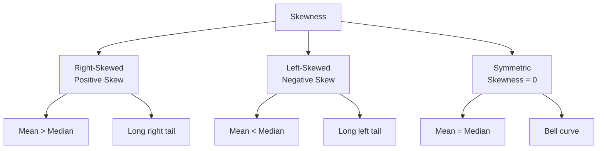

#### **Applications**

- Assessing normality assumptions
- Choosing appropriate measures of central tendency
- Understanding data structure

### 17.2 Kurtosis

> 📖 **Definition**: Kurtosis measures the "tailedness" of a probability distribution.

#### **Mathematical Formula**

**Sample Kurtosis:**
$$g_2 = \frac{\frac{1}{n}\sum_{i=1}^n (x_i - \bar{x})^4}{s^4} - 3$$

**Interpretation:**

| Kurtosis Value | Interpretation |
|----------------|----------------|
| 0 | Mesokurtic (normal-like tails) |
| > 0 | Leptokurtic (heavy tails) |
| < 0 | Platykurtic (light tails) |

### 17.3 Symmetry

> 📖 **Definition**: A distribution is symmetric if it is identical on both sides of its center.

**Properties:**
- Mean = Median = Mode
- Skewness = 0
- Bell curve shape

### 17.4 Heavy and Light Tails

> 📖 **Definition**: Tail behavior describes the probability of extreme values.

**Heavy Tails:**
- High probability of extreme values
- Leptokurtic distributions
- Examples: Cauchy, Student's t

**Light Tails:**
- Low probability of extreme values
- Platykurtic distributions
- Examples: Uniform, bounded distributions

---

## 18. Exploratory Data Analysis (EDA)

> 📖 **Definition**: EDA is an approach to analyzing data sets to summarize their main characteristics, often with visual methods.

### **The EDA Process**

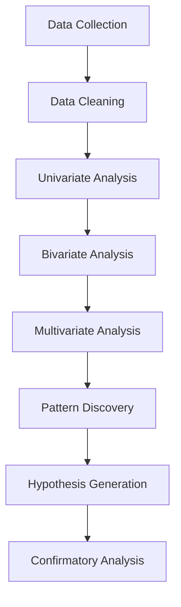

### **Key EDA Techniques**

| Technique | Purpose | Tools |
|-----------|---------|-------|
| **Summary Statistics** | Central tendency, spread | Mean, SD, IQR |
| **Visualization** | Pattern discovery | Histograms, boxplots |
| **Outlier Detection** | Identify unusual observations | Z-scores, IQR method |
| **Correlation Analysis** | Identify relationships | Scatterplots, correlation |

---

## 19. Five Number Summary

> 📖 **Definition**: The five-number summary consists of the minimum, first quartile, median, third quartile, and maximum.

### **Components**

| Component | Description | Calculation |
|-----------|-------------|-------------|
| Minimum | Smallest value | \(x_{(1)}\) |
| Q1 | 25th percentile | \(\frac{1}{4}(n+1)\)th value |
| Median | 50th percentile | \(\frac{1}{2}(n+1)\)th value |
| Q3 | 75th percentile | \(\frac{3}{4}(n+1)\)th value |
| Maximum | Largest value | \(x_{(n)}\) |

### **Interpretation**

The five-number summary provides a complete picture of the distribution's center and spread.

**Boxplot from Five-Number Summary:**
```text
     Min      Q1    Median      Q3      Max
      |-------|--------|--------|-------|
```

---

## 20. Boxplots

> 📖 **Definition**: A boxplot is a standardized way of displaying the distribution of data based on the five-number summary.

### **Anatomy of a Boxplot**

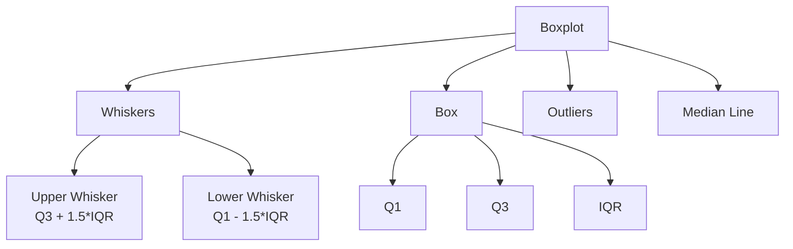

### **Components**

| Component | Description | Calculation |
|-----------|-------------|-------------|
| **Box** | Middle 50% of data | Q1 to Q3 |
| **Median Line** | Median value | Q2 |
| **Whiskers** | Range of non-outlier values | Q1 ± 1.5·IQR |
| **Outliers** | Extreme values | Beyond whiskers |

### **Interpretation**

- **Box Width**: IQR (spread of middle 50%)
- **Position of Median**: Indicates skewness
- **Whisker Length**: Indicates tail behavior
- **Outliers**: Potential data quality issues

---

## 21. Histograms

> 📖 **Definition**: A histogram is a graphical representation of the distribution of numerical data.

### **Construction Steps**

1. **Bin Selection**: Divide the data range into intervals
2. **Count Frequencies**: Count observations in each bin
3. **Draw Bars**: Height proportional to frequency

### **Interpretation**

- **Shape**: Overall distribution pattern
- **Peaks**: Mode(s) of the distribution
- **Spread**: Range of data
- **Gaps**: Missing values or data gaps

---

## 22. Stem-and-Leaf Plot

> 📖 **Definition**: A stem-and-leaf plot is a method of displaying quantitative data that retains the original data values.

### **Construction**

```text
2 | 3 5 7 8
3 | 0 2 2 4 5 6 8 9
4 | 1 3 5 7
5 | 0 2 6
```

**Interpretation:** Each number is split into a stem (tens digit) and leaf (ones digit).

### **Advantages**

- Retains original data values
- Shows distribution shape
- Easy to construct by hand

---

## 23. Dot Plot

> 📖 **Definition**: A dot plot is a statistical chart consisting of dots positioned on a simple scale.

### **Construction**

```text
1: ●
2: ● ●
3: ● ● ●
4: ● ●
5: ●
```

### **Interpretation**

- Each dot represents one observation
- Stacked dots show frequency
- Good for small datasets

---

## 24. Frequency Tables

> 📖 **Definition**: A frequency table organizes data by showing the frequency of each value or range of values.

### **Types**

| Type | Description | Example |
|------|-------------|---------|
| **Frequency** | Count of observations | 15 patients |
| **Relative Frequency** | Proportion of total | 0.25 (25%) |
| **Cumulative Frequency** | Running total | 75 patients |

### **Example: Clinical Trial Baseline Characteristics**

| Characteristic | Treatment (n=50) | Control (n=50) |
|----------------|------------------|----------------|
| Age (mean ± SD) | 45.3 ± 12.1 | 46.1 ± 11.8 |
| Gender (male) | 28 (56%) | 30 (60%) |
| BMI (median, IQR) | 24.5 (22.1-27.3) | 24.8 (22.5-27.1) |

---

## 25. Contingency Tables

> 📖 **Definition**: A contingency table (cross-tabulation) shows the frequency distribution of two or more categorical variables.

### **Structure**

| | Category A | Category B | Total |
|---|------------|------------|-------|
| **Group 1** | n11 | n12 | n1 |
| **Group 2** | n21 | n22 | n2 |
| **Total** | n.1 | n.2 | n |

### **Example: Disease by Exposure**

| | Disease + | Disease - | Total |
|---|-----------|-----------|-------|
| **Exposed** | 45 | 55 | 100 |
| **Unexposed** | 15 | 85 | 100 |
| **Total** | 60 | 140 | 200 |

### **Interpretation**

- **Row percentages**: Compare groups
- **Column percentages**: Compare outcomes
- **Chi-square**: Test association

---

## 📊 Code Examples

### R Implementation

<details>
<summary>📋 Click to expand R code</summary>

```r
# Load necessary libraries
library(dplyr)
library(ggplot2)
library(tidyr)

# Load Iris dataset
data(iris)

# Descriptive statistics by species
iris_summary <- iris %>%
  group_by(Species) %>%
  summarise(
    n = n(),
    mean_sepal = mean(Sepal.Length),
    sd_sepal = sd(Sepal.Length),
    median_sepal = median(Sepal.Length),
    iqr_sepal = IQR(Sepal.Length),
    min_sepal = min(Sepal.Length),
    max_sepal = max(Sepal.Length),
    skew_sepal = e1071::skewness(Sepal.Length),
    kurt_sepal = e1071::kurtosis(Sepal.Length)
  )

print(iris_summary)

# Create boxplot
ggplot(iris, aes(x = Species, y = Sepal.Length, fill = Species)) +
  geom_boxplot() +
  labs(
    title = "Boxplot of Sepal Length by Species",
    x = "Species",
    y = "Sepal Length (cm)"
  ) +
  theme_minimal()

# Create histogram
ggplot(iris, aes(x = Sepal.Length, fill = Species)) +
  geom_histogram(bins = 20, alpha = 0.7) +
  facet_wrap(~Species) +
  labs(
    title = "Distribution of Sepal Length by Species",
    x = "Sepal Length (cm)",
    y = "Count"
  ) +
  theme_minimal()
```
</details>

### Python Implementation

<details>
<summary>📋 Click to expand Python code</summary>

```python
import pandas as pd
import numpy as np
import matplotlib.pyplot as plt
import seaborn as sns
from sklearn.datasets import load_iris
from scipy import stats

# Load data
iris = load_iris()
df = pd.DataFrame(iris.data, columns=iris.feature_names)
df['species'] = iris.target_names[iris.target]

# Descriptive statistics
summary_stats = df.groupby('species').agg([
    'count', 'mean', 'std', 'median',
    ('q1', lambda x: x.quantile(0.25)),
    ('q3', lambda x: x.quantile(0.75)),
    ('min', 'min'),
    ('max', 'max'),
    ('skew', lambda x: stats.skew(x)),
    ('kurt', lambda x: stats.kurtosis(x))
])

print(summary_stats)

# Create boxplot
plt.figure(figsize=(10, 6))
sns.boxplot(data=df, x='species', y='sepal length (cm)')
plt.title('Boxplot of Sepal Length by Species')
plt.show()

# Create histogram
plt.figure(figsize=(12, 4))
for i, species in enumerate(df['species'].unique()):
    plt.subplot(1, 3, i+1)
    subset = df[df['species'] == species]
    plt.hist(subset['sepal length (cm)'], bins=15, alpha=0.7)
    plt.title(f'Sepal Length: {species}')
    plt.xlabel('Sepal Length (cm)')
    plt.ylabel('Count')
plt.tight_layout()
plt.show()
```
</details>

### SPSS Syntax

<details>
<summary>📋 Click to expand SPSS syntax</summary>

```spss
* Load dataset.
GET FILE='iris.sav'.

* Descriptive statistics.
DESCRIPTIVES VARIABLES=SepalLength SepalWidth PetalLength PetalWidth
  /STATISTICS=MEAN STDDEV MIN MAX.

* Frequencies by species.
FREQUENCIES VARIABLES=Species
  /STATISTICS=MODE MEDIAN.

* Explore by species.
EXAMINE VARIABLES=SepalLength BY Species
  /PLOT BOXPLOT HISTOGRAM
  /STATISTICS DESCRIPTIVES
  /MISSING PAIRWISE.
```
</details>

### STATA Code

<details>
<summary>📋 Click to expand STATA code</summary>

```stata
* Load dataset.
use iris.dta

* Descriptive statistics.
summarize SepalLength SepalWidth PetalLength PetalWidth, detail

* By group.
bysort Species: summarize SepalLength, detail

* Boxplot.
graph box SepalLength, over(Species)

* Histogram.
histogram SepalLength, by(Species)
```
</details>

### SAS Program

<details>
<summary>📋 Click to expand SAS code</summary>

```sas
/* Load dataset */
PROC IMPORT DATAFILE="iris.csv" OUT=iris DBMS=CSV REPLACE;
RUN;

/* Descriptive statistics */
PROC MEANS DATA=iris N MEAN STD MIN MAX Q1 Q3;
    CLASS Species;
    VAR SepalLength SepalWidth PetalLength PetalWidth;
RUN;

/* Boxplot */
PROC SGPLOT DATA=iris;
    VBOX SepalLength / GROUP=Species;
    TITLE "Boxplot of Sepal Length by Species";
RUN;

/* Histogram */
PROC SGPLOT DATA=iris;
    HISTOGRAM SepalLength / GROUP=Species;
    DENSITY SepalLength / GROUP=Species;
    TITLE "Distribution of Sepal Length by Species";
RUN;
```
</details>

### Excel Instructions

<details>
<summary>📋 Click to expand Excel instructions</summary>

1. **Data Analysis ToolPak**: Enable via File → Options → Add-ins
2. **Descriptive Statistics**: Data → Data Analysis → Descriptive Statistics
3. **Frequencies**: Use COUNTIF or PivotTables
4. **Boxplot**: Insert → Statistical Charts → Box and Whisker
5. **Histogram**: Data → Data Analysis → Histogram

**Formulas:**
- Mean: `=AVERAGE(range)`
- Median: `=MEDIAN(range)`
- SD: `=STDEV.S(range)` for sample
- IQR: `=QUARTILE(range,3)-QUARTILE(range,1)`
</details>

---

## 🕵️ Reviewer Perspective

### What Journal Reviewers Look For

> [!WARNING]
> **Common Reasons for Rejection Based on Descriptive Statistics**

| Issue | What Reviewers Check | How to Avoid |
|-------|---------------------|--------------|
| **Inappropriate Measures** | Using mean for skewed data | Report median for non-normal distributions |
| **Missing Information** | No SD or IQR with means | Always report measures of dispersion |
| **Precision Issues** | Too many or too few decimals | Match precision to measurement instrument |
| **Misleading Visuals** | Inappropriate axes or scales | Use consistent, honest visual scales |
| **Incomplete Reporting** | Missing subgroup analyses | Report by relevant subgroups |
| **Overinterpretation** | Causal claims from descriptive data | Clearly describe, don't explain causally |

### Statistical Reporting Standards

**CONSORT (Clinical Trials):**
- Report baseline demographic and clinical characteristics
- Include means and SDs for continuous variables
- Include frequencies and percentages for categorical variables

**STROBE (Observational Studies):**
- Describe participant characteristics
- Report missing data frequencies
- Present descriptive statistics by exposure/outcome status

**PRISMA (Systematic Reviews):**
- Describe study characteristics
- Report statistical heterogeneity
- Present summary statistics for outcomes

**TRIPOD (Prediction Models):**
- Describe study population
- Report model development and validation samples
- Present outcome frequencies

### Best Practices for Reporting

1. **Always report both central tendency and dispersion**
2. **Choose measures based on data type and distribution**
3. **Report sample sizes for all analyses**
4. **Describe missing data patterns**
5. **Use appropriate precision for reporting**
6. **Include confidence intervals when possible**
7. **Create tables that are self-contained**
8. **Use consistent formatting across tables**

---

## 🤖 AI Evaluation Perspective

> [!CAUTION]
> **Common AI Mistakes and Hallucinations in Descriptive Statistics**

### AI-Generated Errors to Watch For

| AI Error Pattern | Example | How to Verify |
|------------------|---------|---------------|
| **Wrong Formula** | Using population variance formula for sample data | Always check degrees of freedom |
| **Misinterpretation** | Claiming skewness indicates outliers | Skewness indicates asymmetry, not outliers |
| **Fabricated Values** | Making up p-values for descriptive statistics | Descriptive statistics don't have p-values |
| **Incorrect Software Output** | Hallucinated R/Python output | Compare with actual software output |
| **Missing Assumptions** | Claiming normality without checking | Always assess distribution visually |
| **Overconfidence** | Making causal claims from descriptive data | Descriptive statistics show associations, not causation |

### How to Verify AI-Generated Statistics

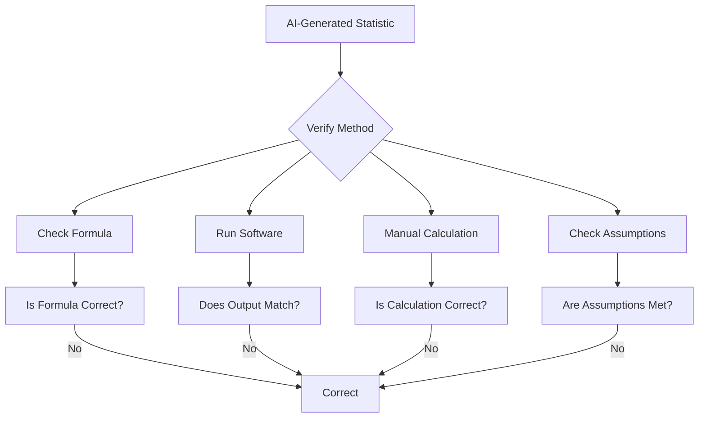

### Red Flags in AI-Generated Statistics

1. **Confidence without context**: "The data are perfectly normal"
2. **Exact p-values without data**: "p = 0.034" (for descriptive stats)
3. **Causal language**: "shows that X causes Y"
4. **Perfect precision**: "Standard deviation = 12.3456789"
5. **Missing assumptions**: No mention of checking assumptions
6. **Overly complex explanations**: Adding unnecessary complexity

---

## 📝 Assessment

### Multiple Choice Questions

<details>
<summary>Click to reveal answers</summary>

1. Which measure of central tendency is most appropriate for a highly skewed distribution?
   - A) Mean
   - B) Median ✓
   - C) Mode
   - D) Trimmed mean

2. The sample variance uses (n-1) in the denominator to:
   - A) Make the calculation easier
   - B) Provide an unbiased estimate of the population variance ✓
   - C) Reduce the effect of outliers
   - D) Make the variance larger

3. A distribution with positive skew has:
   - A) Mean > Median > Mode ✓
   - B) Mode > Median > Mean
   - C) Mean = Median = Mode
   - D) Mean < Median < Mode

4. The IQR is preferred over the range when:
   - A) Data are symmetric
   - B) Outliers are present ✓
   - C) Data are normally distributed
   - D) Sample size is large

5. Which measure is scale-independent?
   - A) Standard deviation
   - B) Variance
   - C) Coefficient of variation ✓
   - D) Range

</details>

### True/False Questions

<details>
<summary>Click to reveal answers</summary>

1. The mean is always the best measure of central tendency. **False**
2. A normal distribution has skewness of 0. **True**
3. The IQR is affected by outliers. **False**
4. The mode can be used for categorical data. **True**
5. The geometric mean is always greater than the arithmetic mean. **False**

</details>

### Short Questions

1. Explain why the sample variance uses (n-1) instead of n in the denominator.
2. What is the relationship between skewness and the mean/median?
3. Describe the steps for constructing a boxplot.
4. When would you use the geometric mean instead of the arithmetic mean?
5. Explain the difference between population and sample parameters.

### Long Questions

1. Compare and contrast the measures of central tendency, including their advantages, disadvantages, and appropriate use cases.
2. Discuss the importance of EDA in the research process, including key techniques and their purposes.
3. A clinical trial reports: "The mean age was 45.3 (SD 12.1) years in the treatment group and 46.1 (SD 11.8) years in the control group." Interpret this output and identify any potential issues.

### Numerical Problems

<details>
<summary>Click to reveal solutions</summary>

**Problem 1:** Calculate the mean, median, variance, and standard deviation for the following dataset: [5, 7, 8, 9, 10, 12, 15]

**Solution:**
- Mean = (5+7+8+9+10+12+15)/7 = 66/7 = 9.43
- Median = 9 (ordered: 5,7,8,9,10,12,15)
- Variance = [(5-9.43)² + (7-9.43)² + ... + (15-9.43)²]/(7-1) = 12.52
- SD = √12.52 = 3.54

**Problem 2:** For the dataset [2, 3, 5, 7, 11], calculate the geometric and harmonic means.

**Solution:**
- GM = (2×3×5×7×11)^(1/5) = (2310)^(0.2) = 4.72
- HM = 5/(1/2+1/3+1/5+1/7+1/11) = 5/(1.303) = 3.84

</details>

### Programming Exercises

<details>
<summary>Click to reveal exercises</summary>

1. **R Exercise:** Load the iris dataset and create a function that calculates and returns all measures of central tendency and dispersion for each species. Include skewness and kurtosis.

2. **Python Exercise:** Using pandas, load the titanic dataset and create a comprehensive descriptive statistics table by passenger class. Include visualizations.

3. **SPSS Exercise:** Import a dataset and create a report with descriptive statistics appropriate for the data types present.

</details>

### Real Research Exercises

1. **Public Health Research:** Analyze a DHS dataset to describe maternal health indicators across regions. Include appropriate measures and visualizations.

2. **Clinical Research:** Prepare baseline characteristics tables for a simulated RCT, following CONSORT guidelines.

3. **Machine Learning:** Create a descriptive analysis of features in a classification problem, including an assessment of feature distributions and relationships.

---

## 📚 Chapter Summary

### Key Takeaways

> 🎯 **Core Concepts to Remember**

1. **Data Types Matter**: Choose measures based on whether data are nominal, ordinal, interval, or ratio
2. **Mean for Symmetric Data**: The mean is appropriate for symmetric, continuous data
3. **Median for Skewed Data**: Use median when data are skewed or have outliers
4. **SD for Normal Data**: Standard deviation is appropriate for approximately normal data
5. **IQR for Skewed Data**: Use IQR when data are skewed or have outliers
6. **Visualize First**: Always create visualizations before numerical summaries
7. **Report Completely**: Always report both central tendency and dispersion
8. **Check Assumptions**: Verify assumptions before choosing measures
9. **Context Matters**: Interpret statistics in the context of the research question
10. **Honest Reporting**: Don't let desired conclusions drive statistical choices

### Formula Sheet

| Measure | Formula | When to Use |
|---------|---------|-------------|
| **Mean** | \(\bar{x} = \frac{1}{n}\sum x_i\) | Symmetric, continuous data |
| **Median** | \(\frac{x_{(n+1)/2} + x_{(n/2)}}{2}\) | Skewed or ordinal data |
| **Mode** | \(\arg\max f(x)\) | Categorical data |
| **Variance (Sample)** | \(s^2 = \frac{1}{n-1}\sum(x_i-\bar{x})^2\) | Symmetric, continuous data |
| **SD (Sample)** | \(s = \sqrt{s^2}\) | Symmetric, continuous data |
| **IQR** | \(Q_3 - Q_1\) | Skewed or ordinal data |
| **CV** | \(\frac{s}{\bar{x}} \times 100\%\) | Comparing variation across scales |
| **Skewness** | \(g_1 = \frac{\sum(x_i-\bar{x})^3/n}{s^3}\) | Assessing distribution symmetry |
| **Kurtosis** | \(g_2 = \frac{\sum(x_i-\bar{x})^4/n}{s^4} - 3\) | Assessing tail behavior |

### Cheat Sheet

| Situation | Recommended Measures |
|-----------|---------------------|
| **Normal distribution** | Mean, SD |
| **Skewed distribution** | Median, IQR |
| **Categorical data** | Mode, frequencies |
| **Outliers present** | Median, IQR |
| **Comparing variation** | CV |
| **Assessing normality** | Skewness, kurtosis |
| **Small dataset** | Five-number summary |
| **Large dataset** | Mean, SD, histogram |
| **Reporting baseline** | Mean ± SD or Median (IQR) |
| **Publication** | Follow CONSORT/STROBE guidelines |

---

## 📖 Further Reading

### Recommended Textbooks

| Book | Author | Publisher |
|------|--------|-----------|
| *The Elements of Statistical Learning* | Hastie, Tibshirani, Friedman | Springer |
| *Statistical Inference* | Casella & Berger | Cengage |
| *Introduction to Modern Statistics* | Cetinkaya-Rundel & Hardin | OpenIntro |
| *Data Analysis Using Regression* | Gelman & Hill | Cambridge |
| *Applied Linear Statistical Models* | Kutner et al. | McGraw-Hill |

### Journal Articles

- Altman, D. G., & Bland, J. M. (2005). Standard deviations and standard errors. *BMJ*, 331(7521), 903.
- Cumming, G., Fidler, F., & Vaux, D. L. (2007). Error bars in experimental biology. *Journal of Cell Biology*, 177(1), 7-11.
- Tukey, J. W. (1977). Exploratory data analysis. *Reading, MA*.

### Online Resources

- **Khan Academy**: Descriptive Statistics
- **StatQuest with Josh Starmer**: YouTube channel
- **R for Data Science**: Online book by Wickham & Grolemund
- **Python Data Science Handbook**: Online book by VanderPlas

---

## 📑 References

Altman, D. G., & Bland, J. M. (2005). Standard deviations and standard errors. *BMJ*, 331(7521), 903.

Cumming, G., Fidler, F., & Vaux, D. L. (2007). Error bars in experimental biology. *Journal of Cell Biology*, 177(1), 7-11.

Fisher, R. A. (1925). *Statistical Methods for Research Workers*. Edinburgh: Oliver & Boyd.

Galton, F. (1888). Co-relations and their measurement, chiefly from anthropometric data. *Proceedings of the Royal Society of London*, 45, 135-145.

Gauss, C. F. (1809). *Theoria motus corporum coelestium*. Hamburg: Perthes & Besser.

Graunt, J. (1662). *Natural and Political Observations Made upon the Bills of Mortality*. London.

Pearson, K. (1895). Contributions to the mathematical theory of evolution. *Philosophical Transactions of the Royal Society of London*, 186, 343-414.

Tukey, J. W. (1977). *Exploratory Data Analysis*. Reading, MA: Addison-Wesley.

---

## 📚 Navigation

<div align="center">

**[⬆ Back to Repository](../README.md)**

**[📚 Previous Chapter](#) · [➡️ Next Chapter: Probability Theory]()**

</div>

---

<div align="center">

*Chapter 1: Descriptive Statistics*

*Statistics for Scientists — An Open-Access Textbook*

[](https://github.com/your-repo)
[](LICENSE)

</div>
