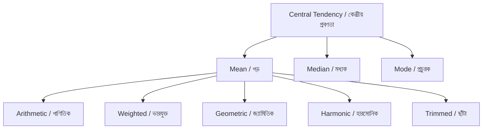
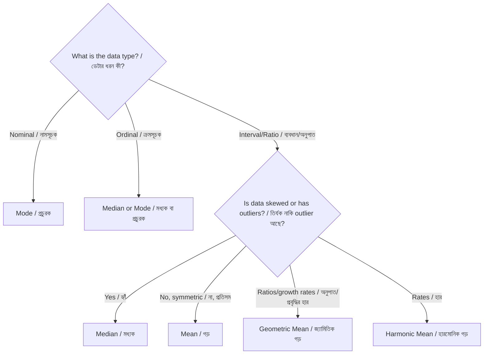

# Chapter 2: Measures of Central Tendency
# দ্বিতীয় অধ্যায়: কেন্দ্রীয় প্রবণতার পরিমাপ

[⬅ Previous: Descriptive Statistics / পূর্ববর্তী: বর্ণনামূলক পরিসংখ্যান](./01-descriptive-statistics.md) | [🏠 Home / হোম](../README.md) | [➡ Next: Dispersion / পরবর্তী: বিস্তৃতি](./03-dispersion.md)

---

> [!NOTE]
> **Bilingual Chapter / দ্বিভাষিক অধ্যায়**
> This chapter is presented in **English and Bengali (বাংলা)** side by side, section by section, so that Bengali-speaking students can learn the exact same rigorous content in their first language without losing any mathematical precision. Formulas, code, and tables are universal and are not translated, since mathematics and programming syntax are language-independent — only the surrounding explanation is duplicated in both languages.
>
> এই অধ্যায়টি **ইংরেজি ও বাংলা** উভয় ভাষায়, অংশ অনুযায়ী, পাশাপাশি উপস্থাপন করা হয়েছে, যাতে বাংলাভাষী শিক্ষার্থীরা তাদের মাতৃভাষায় একই কঠোর, নির্ভুল বিষয়বস্তু শিখতে পারে গাণিতিক যথার্থতা না হারিয়ে। সূত্র, কোড এবং টেবিলগুলো সার্বজনীন এবং অনুবাদ করা হয়নি, কারণ গণিত ও প্রোগ্রামিং সিনট্যাক্স ভাষা-নিরপেক্ষ — শুধুমাত্র চারপাশের ব্যাখ্যাগুলো উভয় ভাষায় দেওয়া হয়েছে।

---

## Learning Objectives / শিখনফল

**English:**
- [ ] Compute mean, median, and mode by hand and in software
- [ ] Understand the mathematical properties of the mean (least-squares property)
- [ ] Choose the appropriate measure of central tendency given data shape
- [ ] Compute weighted mean, trimmed mean, geometric mean, and harmonic mean
- [ ] Understand how outliers and skew affect each measure
- [ ] Critically interpret "average" claims in scientific and media reporting
- [ ] Apply central tendency measures to real public health, clinical, and survey datasets
- [ ] Recognize common statistical reporting errors involving central tendency

**বাংলা:**
- [ ] হাতে-কলমে এবং সফটওয়্যারে গড় (mean), মধ্যক (median), এবং প্রচুরক (mode) গণনা করতে পারা
- [ ] গড়ের গাণিতিক বৈশিষ্ট্য (least-squares property) বোঝা
- [ ] উপাত্তের গঠন অনুযায়ী সঠিক কেন্দ্রীয় প্রবণতার পরিমাপ নির্বাচন করতে পারা
- [ ] ভারযুক্ত গড় (weighted mean), ছাঁটা গড় (trimmed mean), জ্যামিতিক গড় (geometric mean), এবং হারমোনিক গড় (harmonic mean) গণনা করতে পারা
- [ ] ব্যতিক্রমী মান (outlier) এবং তির্যকতা (skew) কীভাবে প্রতিটি পরিমাপকে প্রভাবিত করে তা বোঝা
- [ ] বৈজ্ঞানিক ও গণমাধ্যমের প্রতিবেদনে "গড়" সংক্রান্ত দাবিগুলো সমালোচনামূলকভাবে ব্যাখ্যা করতে পারা
- [ ] বাস্তব জনস্বাস্থ্য, ক্লিনিক্যাল, এবং সার্ভে উপাত্তে কেন্দ্রীয় প্রবণতার পরিমাপ প্রয়োগ করতে পারা
- [ ] কেন্দ্রীয় প্রবণতা সংক্রান্ত সাধারণ পরিসংখ্যানগত প্রতিবেদন ত্রুটি চিহ্নিত করতে পারা

## Prerequisites / পূর্বশর্ত

**English**: Chapter 1 (Descriptive Statistics); summation notation ($\sum$); basic algebra.

**বাংলা**: প্রথম অধ্যায় (বর্ণনামূলক পরিসংখ্যান); সমষ্টি নোটেশন ($\sum$); মৌলিক বীজগণিত।

## Estimated Study Time / আনুমানিক অধ্যয়ন সময়

⏱️ **English**: 3–4 hours (including bilingual reading and coding exercises)
⏱️ **বাংলা**: ৩–৪ ঘণ্টা (দ্বিভাষিক পঠন এবং কোডিং অনুশীলনসহ)

---

## Why This Topic Matters / কেন এই বিষয়টি গুরুত্বপূর্ণ

> [!TIP]
> **English**: "On average" is the most quoted — and most misused — phrase in scientific communication. Which average, computed how, determines whether a claim is honest or misleading.
>
> **বাংলা**: "গড়ে" (on average) হলো বৈজ্ঞানিক যোগাযোগে সবচেয়ে বেশি উদ্ধৃত — এবং সবচেয়ে বেশি ভুলভাবে ব্যবহৃত — বাক্যাংশ। কোন গড়, কীভাবে গণনা করা হয়েছে, তার উপর নির্ভর করে একটি দাবি সৎ নাকি বিভ্রান্তিকর।

**English**: Imagine a newspaper headline: "Average household income rose by 15% this year." If this "average" is the arithmetic mean and a handful of extremely wealthy households pulled the number up, most families may have seen no real improvement at all. Understanding *which* central tendency measure is being used — and why — is essential for reading science and news critically.

**বাংলা**: একটি সংবাদপত্রের শিরোনাম কল্পনা করুন: "এই বছর গড় পারিবারিক আয় ১৫% বৃদ্ধি পেয়েছে।" যদি এই "গড়" গাণিতিক গড় (arithmetic mean) হয় এবং কয়েকটি অত্যন্ত ধনী পরিবার সংখ্যাটি উপরে টেনে তোলে, তাহলে বেশিরভাগ পরিবার আসলে কোনো প্রকৃত উন্নতি নাও দেখতে পারে। *কোন* কেন্দ্রীয় প্রবণতার পরিমাপ ব্যবহার করা হচ্ছে — এবং কেন — তা বোঝা বিজ্ঞান ও সংবাদ সমালোচনামূলকভাবে পড়ার জন্য অপরিহার্য।

## Big Picture / সামগ্রিক চিত্র



## Historical Background / ঐতিহাসিক পটভূমি

**English**: The arithmetic mean has been used since antiquity for dividing goods and measuring astronomical observations, but its formal statistical justification came from Carl Friedrich Gauss and Adrien-Marie Legendre in the early 1800s through the method of least squares. The median's robustness properties were explored extensively by Francis Edgeworth in the 1880s. The geometric and harmonic means trace back to ancient Greek mathematics (Pythagoras), originally defined as "means" in the context of musical ratios and proportional reasoning, long before their statistical applications in growth rates and rates emerged.

**বাংলা**: গাণিতিক গড় প্রাচীনকাল থেকে পণ্য বণ্টন এবং জ্যোতির্বিদ্যা সংক্রান্ত পর্যবেক্ষণ পরিমাপের জন্য ব্যবহৃত হয়ে আসছে, কিন্তু এর আনুষ্ঠানিক পরিসংখ্যানগত যৌক্তিকতা এসেছে কার্ল ফ্রিডরিখ গাউস এবং আদ্রিয়াঁ-মারি লেজেন্দ্রের কাছ থেকে, ১৮০০ সালের প্রথম দিকে ন্যূনতম বর্গের পদ্ধতির (method of least squares) মাধ্যমে। মধ্যকের দৃঢ়তার (robustness) বৈশিষ্ট্য ১৮৮০-এর দশকে ফ্রান্সিস এজওয়ার্থ ব্যাপকভাবে অনুসন্ধান করেছিলেন। জ্যামিতিক ও হারমোনিক গড় প্রাচীন গ্রিক গণিতে (পিথাগোরাস) ফিরে যায়, মূলত সাঙ্গীতিক অনুপাত এবং আনুপাতিক যুক্তির প্রেক্ষাপটে "গড়" হিসেবে সংজ্ঞায়িত, প্রবৃদ্ধির হার এবং হারের পরিসংখ্যানগত প্রয়োগ আসার অনেক আগে।

## Core Intuition / মূল স্বজ্ঞা

**English**: Central tendency answers: **"If I had to describe this dataset with one number, what would it be?"** The three classical answers — mean, median, mode — each optimize a different criterion, and each can give a dramatically different answer for the same dataset when the data are skewed.

**বাংলা**: কেন্দ্রীয় প্রবণতা এই প্রশ্নের উত্তর দেয়: **"যদি আমাকে এই ডেটাসেটটিকে একটি সংখ্যা দিয়ে বর্ণনা করতে হয়, তবে সেটি কী হবে?"** তিনটি ধ্রুপদী উত্তর — গড়, মধ্যক, প্রচুরক — প্রতিটি ভিন্ন ভিন্ন মানদণ্ড অপ্টিমাইজ করে, এবং উপাত্ত তির্যক (skewed) হলে একই ডেটাসেটের জন্য প্রতিটি নাটকীয়ভাবে ভিন্ন উত্তর দিতে পারে।

---

## Mathematical Foundation / গাণিতিক ভিত্তি

### Arithmetic Mean / গাণিতিক গড়

$$\bar{x} = \frac{1}{n}\sum_{i=1}^{n} x_i$$

**English — Least-squares property**: the mean is the value $c$ that minimizes $\sum_{i=1}^n (x_i - c)^2$. This is proved by differentiating with respect to $c$ and setting to zero:

$$\frac{d}{dc}\sum (x_i - c)^2 = -2\sum(x_i - c) = 0 \implies \sum x_i = nc \implies c = \bar{x}$$

**বাংলা — ন্যূনতম বর্গের বৈশিষ্ট্য**: গড় হলো সেই মান $c$ যা $\sum_{i=1}^n (x_i - c)^2$ কে সর্বনিম্ন করে। এটি $c$ এর সাপেক্ষে অন্তরীকরণ (differentiate) করে এবং শূন্যের সমান বসিয়ে প্রমাণ করা হয়:

$$\frac{d}{dc}\sum (x_i - c)^2 = -2\sum(x_i - c) = 0 \implies \sum x_i = nc \implies c = \bar{x}$$

**English**: In plain language, this means the mean is the "balance point" of the data — the point where the sum of distances (squared) to every data point is as small as possible. This is exactly analogous to a physical center of mass on a number line.

**বাংলা**: সহজ ভাষায়, এর অর্থ হলো গড় হলো ডেটার "ভারসাম্য বিন্দু" (balance point) — সেই বিন্দু যেখানে প্রতিটি ডেটা পয়েন্টের দূরত্বের বর্গের সমষ্টি যতটা সম্ভব ছোট হয়। এটি একটি সংখ্যারেখায় ভরকেন্দ্রের (center of mass) সাথে সম্পূর্ণরূপে সাদৃশ্যপূর্ণ।

### Median / মধ্যক

The middle value when data are ordered. For $n$ observations:

$$\text{Median} = \begin{cases} x_{\left(\frac{n+1}{2}\right)} & n \text{ odd} \\[4pt] \frac{1}{2}\left(x_{(n/2)} + x_{(n/2 + 1)}\right) & n \text{ even} \end{cases}$$

**English — Least-absolute-deviations property**: the median minimizes $\sum_{i=1}^n |x_i - c|$.

**বাংলা — ন্যূনতম পরম বিচ্যুতির বৈশিষ্ট্য**: মধ্যক $\sum_{i=1}^n |x_i - c|$ কে সর্বনিম্ন করে।

**English**: This absolute-value (rather than squared) criterion is exactly why the median doesn't "care" how far an extreme value is from the rest of the data — only that it's on one side or the other. This is the mathematical root of the median's famous robustness to outliers.

**বাংলা**: এই পরম মান (squared নয়) মানদণ্ডই মূলত কারণ কেন মধ্যক "চিন্তা করে না" একটি চরম মান বাকি ডেটা থেকে কতদূরে — শুধু এটি একপাশে না অন্যপাশে তা গুরুত্বপূর্ণ। এটিই মধ্যকের বিখ্যাত outlier-দৃঢ়তার (robustness) গাণিতিক মূল।

### Mode / প্রচুরক

**English**: The most frequently occurring value. The only measure valid for nominal data. A distribution can be unimodal, bimodal, or multimodal.

**বাংলা**: সবচেয়ে বেশি ঘটে যাওয়া মান। শুধুমাত্র নামসূচক (nominal) ডেটার জন্য বৈধ একমাত্র পরিমাপ। একটি বণ্টন এককরূপী (unimodal), দ্বিরূপী (bimodal), অথবা বহুরূপী (multimodal) হতে পারে।

### Weighted Mean / ভারযুক্ত গড়

$$\bar{x}_w = \frac{\sum_{i=1}^n w_i x_i}{\sum_{i=1}^n w_i}$$

**English**: Used extensively in survey statistics (Chapter 16, planned) where each observation carries a sampling weight — some individuals in a survey represent more people in the underlying population than others, and ignoring this systematically biases the estimate.

**বাংলা**: সার্ভে পরিসংখ্যানে ব্যাপকভাবে ব্যবহৃত হয় (১৬শ অধ্যায়, পরিকল্পিত) যেখানে প্রতিটি পর্যবেক্ষণ একটি নমুনা ওজন (sampling weight) বহন করে — একটি সার্ভেতে কিছু ব্যক্তি অন্তর্নিহিত জনসংখ্যার তুলনায় বেশি মানুষের প্রতিনিধিত্ব করে, এবং এটি উপেক্ষা করলে অনুমান পদ্ধতিগতভাবে পক্ষপাতদুষ্ট (biased) হয়ে যায়।

### Geometric Mean / জ্যামিতিক গড়

$$GM = \left(\prod_{i=1}^n x_i\right)^{1/n}$$

**English**: Used for growth rates, ratios, and log-normally distributed data (e.g., viral load, antibody titers in immunology, or compound annual growth rates in economics).

**বাংলা**: প্রবৃদ্ধির হার, অনুপাত, এবং লগ-নরমাল বিতরণকৃত ডেটার (যেমন, ভাইরাল লোড, ইমিউনোলজিতে অ্যান্টিবডি টাইটার, অথবা অর্থনীতিতে যৌগিক বার্ষিক প্রবৃদ্ধির হার) জন্য ব্যবহৃত হয়।

### Harmonic Mean / হারমোনিক গড়

$$HM = \frac{n}{\sum_{i=1}^n \frac{1}{x_i}}$$

**English**: Used for rates (e.g., average speed over a fixed distance, or the F1-score in machine learning — Chapter 24, planned — which is the harmonic mean of precision and recall).

**বাংলা**: হারের জন্য ব্যবহৃত হয় (যেমন, একটি নির্দিষ্ট দূরত্বের উপর গড় গতি, অথবা মেশিন লার্নিংয়ে F1-স্কোর — ২৪শ অধ্যায়, পরিকল্পিত — যা precision এবং recall-এর হারমোনিক গড়)।

### Trimmed Mean / ছাঁটা গড়

**English**: Computed by removing a fixed percentage of the smallest and largest values before averaging the rest. It sits conceptually between the mean (uses all data, sensitive to outliers) and the median (ignores magnitude entirely, maximally robust). A 10% trimmed mean removes the bottom and top 10% of sorted values.

**বাংলা**: বাকি অংশের গড় নেওয়ার আগে সবচেয়ে ছোট এবং বড় মানগুলোর একটি নির্দিষ্ট শতাংশ অপসারণ করে গণনা করা হয়। এটি ধারণাগতভাবে গড়ের (সব ডেটা ব্যবহার করে, outlier-সংবেদনশীল) এবং মধ্যকের (মাত্রাকে সম্পূর্ণরূপে উপেক্ষা করে, সর্বোচ্চ দৃঢ়) মধ্যে অবস্থান করে। একটি ১০% ছাঁটা গড় সাজানো মানগুলোর নিচের এবং উপরের ১০% অপসারণ করে।

---

## Choosing the Right Measure / সঠিক পরিমাপ নির্বাচন



| Measure / পরিমাপ | Sensitive to Outliers? / Outlier-সংবেদনশীল? | Uses All Data? / সব ডেটা ব্যবহার করে? | Valid Scale / বৈধ স্কেল |
|---|---|---|---|
| Mean / গড় | Yes (highly) / হ্যাঁ (অত্যধিক) | Yes / হ্যাঁ | Interval, Ratio |
| Median / মধ্যক | No (robust) / না (দৃঢ়) | No (only order) / না (শুধু ক্রম) | Ordinal, Interval, Ratio |
| Mode / প্রচুরক | No / না | No / না | Nominal, Ordinal, Interval, Ratio |
| Geometric Mean / জ্যামিতিক গড় | Yes / হ্যাঁ | Yes / হ্যাঁ | Ratio (positive values only / শুধু ধনাত্মক মান) |
| Harmonic Mean / হারমোনিক গড় | Yes / হ্যাঁ | Yes / হ্যাঁ | Ratio (positive values only / শুধু ধনাত্মক মান) |
| Trimmed Mean / ছাঁটা গড় | Reduced / হ্রাসকৃত | Partially / আংশিকভাবে | Interval, Ratio |

---

## Worked Example 1 — Blood Pressure / উদাহরণ ১ — রক্তচাপ

**English**: Continuing the systolic BP dataset from Chapter 1:

**বাংলা**: প্রথম অধ্যায়ের সিস্টোলিক রক্তচাপ ডেটাসেট অব্যাহত রেখে:

`118, 119, 121, 122, 125, 128, 130, 138, 145, 150` (n = 10, sorted / সাজানো)

**Mean / গড়**:
$$\bar{x} = \frac{118+119+121+122+125+128+130+138+145+150}{10} = \frac{1296}{10} = 129.6 \text{ mmHg}$$

**Median / মধ্যক** (n = 10, even / জোড়):
$$\text{Median} = \frac{125 + 128}{2} = 126.5 \text{ mmHg}$$

**Mode / প্রচুরক**: No value repeats → this dataset has **no mode**.
কোনো মান পুনরাবৃত্তি হয় না → এই ডেটাসেটের **কোনো প্রচুরক নেই**।

**English — Effect of an outlier**: Suppose the last patient's BP was mistakenly entered as 250 instead of 150.
- New mean = 141.6 mmHg (jumps by 12 points)
- New median = 126.5 mmHg (**unchanged** — median is robust)

**বাংলা — Outlier-এর প্রভাব**: ধরুন শেষ রোগীর রক্তচাপ ভুলবশত ১৫০ এর পরিবর্তে ২৫০ লেখা হয়েছে।
- নতুন গড় = ১৪১.৬ mmHg (১২ পয়েন্ট বৃদ্ধি পায়)
- নতুন মধ্যক = ১২৬.৫ mmHg (**অপরিবর্তিত** — মধ্যক দৃঢ়)

**English**: This single example is the clearest demonstration of why medians are preferred for skewed clinical data such as length of hospital stay, cost data, or viral load.

**বাংলা**: এই একটি উদাহরণই সবচেয়ে স্পষ্টভাবে দেখায় কেন হাসপাতালে থাকার দৈর্ঘ্য, খরচের ডেটা, বা ভাইরাল লোডের মতো তির্যক ক্লিনিক্যাল ডেটার জন্য মধ্যক পছন্দ করা হয়।

## Worked Example 2 — Household Income (Geometric Mean) / উদাহরণ ২ — পারিবারিক আয় (জ্যামিতিক গড়)

**English**: Consider five households with monthly income (in thousands of BDT): `20, 25, 30, 40, 500`. The last household is a very high earner.

**বাংলা**: পাঁচটি পরিবারের মাসিক আয় (হাজার টাকায়) বিবেচনা করুন: `২০, ২৫, ৩০, ৪০, ৫০০`। শেষ পরিবারটি খুব বেশি আয় করে।

**Arithmetic mean / গাণিতিক গড়**:
$$\bar{x} = \frac{20+25+30+40+500}{5} = \frac{615}{5} = 123 \text{ thousand BDT}$$

**English**: This "average" of 123,000 BDT does not represent any household well — four of five households earn far less than this.

**বাংলা**: এই "গড়" ১,২৩,০০০ টাকা কোনো পরিবারকেই ভালোভাবে প্রতিনিধিত্ব করে না — পাঁচটির মধ্যে চারটি পরিবার এর চেয়ে অনেক কম আয় করে।

**Median / মধ্যক**: sorted data `20, 25, 30, 40, 500` → middle value = **30 thousand BDT**, a far more representative "typical" income.

**Geometric mean / জ্যামিতিক গড়**:
$$GM = (20 \times 25 \times 30 \times 40 \times 500)^{1/5} = (300{,}000{,}000)^{1/5} \approx 49.6 \text{ thousand BDT}$$

**English**: The geometric mean (49.6) sits between the median and the mean — it is less distorted by the single extreme value than the arithmetic mean, which is why economists often use geometric means for income and growth data.

**বাংলা**: জ্যামিতিক গড় (৪৯.৬) মধ্যক এবং গড়ের মধ্যে অবস্থান করে — এটি একক চরম মান দ্বারা গাণিতিক গড়ের তুলনায় কম বিকৃত হয়, এই কারণেই অর্থনীতিবিদরা প্রায়ই আয় এবং প্রবৃদ্ধির ডেটার জন্য জ্যামিতিক গড় ব্যবহার করেন।

## Worked Example 3 — Mode with Categorical Data / উদাহরণ ৩ — শ্রেণীগত ডেটাসহ প্রচুরক

**English**: In a survey of 20 patients' blood types: `O+ (8), A+ (6), B+ (4), AB+ (2)`. Since blood type is nominal, only the mode is valid: **O+** is the modal blood type.

**বাংলা**: ২০ জন রোগীর রক্তের গ্রুপের একটি জরিপে: `O+ (৮), A+ (৬), B+ (৪), AB+ (২)`। যেহেতু রক্তের গ্রুপ নামসূচক, শুধুমাত্র প্রচুরক বৈধ: **O+** হলো প্রচুরক রক্তের গ্রুপ।

---

## Software Implementation / সফটওয়্যার বাস্তবায়ন

**English**: The code blocks below are identical regardless of language — code syntax does not need translation, since programming languages are already universal. Comments are provided in English; Bengali-speaking learners are encouraged to add their own Bengali comments as they practice.

**বাংলা**: নিচের কোড ব্লকগুলো ভাষা নির্বিশেষে অভিন্ন — কোড সিনট্যাক্সের অনুবাদের প্রয়োজন নেই, কারণ প্রোগ্রামিং ভাষা ইতিমধ্যে সার্বজনীন। মন্তব্য (comments) ইংরেজিতে দেওয়া হয়েছে; বাংলাভাষী শিক্ষার্থীদের অনুশীলনের সময় নিজেদের বাংলা মন্তব্য যোগ করতে উৎসাহিত করা হচ্ছে।

### R

```r
bp <- c(118, 122, 130, 145, 119, 125, 138, 128, 121, 150)

mean(bp)
median(bp)

# Mode (R has no built-in mode function)
get_mode <- function(v) {
  uniq_v <- unique(v)
  uniq_v[which.max(tabulate(match(v, uniq_v)))]
}
get_mode(bp)

# Trimmed mean (removes top/bottom 10%)
mean(bp, trim = 0.1)

# Weighted mean
w <- c(1,1,2,1,1,1,1,1,1,3)
weighted.mean(bp, w)

# Geometric mean
exp(mean(log(bp)))

# Harmonic mean
length(bp) / sum(1/bp)
```

### Python

```python
import numpy as np
from scipy import stats

bp = np.array([118, 122, 130, 145, 119, 125, 138, 128, 121, 150])

print("Mean:", np.mean(bp))
print("Median:", np.median(bp))
print("Mode:", stats.mode(bp, keepdims=True))
print("Trimmed mean:", stats.trim_mean(bp, 0.1))
print("Geometric mean:", stats.gmean(bp))
print("Harmonic mean:", stats.hmean(bp))

weights = np.array([1,1,2,1,1,1,1,1,1,3])
print("Weighted mean:", np.average(bp, weights=weights))
```

### SPSS

```spss
DESCRIPTIVES VARIABLES=bp
  /STATISTICS=MEAN MEDIAN.

FREQUENCIES VARIABLES=bp
  /STATISTICS=MODE.
```

### STATA

```stata
summarize bp, detail
* Displays mean, median (p50), and percentiles

* Mode
tabulate bp, sort
```

### SAS

```sas
PROC MEANS DATA=work.patients MEAN MEDIAN MODE;
    VAR bp;
RUN;
```

### Excel

```text
=AVERAGE(A2:A11)        ' Arithmetic mean
=MEDIAN(A2:A11)         ' Median
=MODE.SNGL(A2:A11)      ' Mode
=TRIMMEAN(A2:A11, 0.2)  ' 10% trimmed from each side (20% total)
=GEOMEAN(A2:A11)        ' Geometric mean
=HARMEAN(A2:A11)        ' Harmonic mean
=SUMPRODUCT(A2:A11,B2:B11)/SUM(B2:B11)   ' Weighted mean (weights in column B)
```

### SQL

```sql
-- Arithmetic mean
SELECT AVG(bp) AS mean_bp FROM patients;

-- Median (varies by database; PostgreSQL example using percentile_cont)
SELECT PERCENTILE_CONT(0.5) WITHIN GROUP (ORDER BY bp) AS median_bp
FROM patients;

-- Mode (most frequent value)
SELECT bp, COUNT(*) AS freq
FROM patients
GROUP BY bp
ORDER BY freq DESC
LIMIT 1;

-- Weighted mean using a weight column w
SELECT SUM(bp * w) / SUM(w) AS weighted_mean_bp
FROM patients;
```

---

## Real Research Examples / বাস্তব গবেষণা উদাহরণ

### Public Health / জনস্বাস্থ্য

**English**: In income and cost-effectiveness research, the **geometric mean** is standard because healthcare costs and income data are typically log-normally distributed. Reporting an arithmetic mean of household income without noting the underlying skew is a frequent target of reviewer criticism in health economics journals.

**বাংলা**: আয় এবং খরচ-কার্যকারিতা গবেষণায়, **জ্যামিতিক গড়** মানসম্মত কারণ স্বাস্থ্যসেবার খরচ এবং আয়ের ডেটা সাধারণত লগ-নরমাল বিতরণকৃত হয়। অন্তর্নিহিত তির্যকতা উল্লেখ না করে পারিবারিক আয়ের গাণিতিক গড় প্রতিবেদন করা স্বাস্থ্য অর্থনীতি জার্নালে সমালোচকদের একটি ঘন ঘন লক্ষ্যবস্তু।

### DHS Survey Data / DHS সার্ভে ডেটা

**English**: Demographic and Health Survey (DHS) datasets require **weighted means** because of complex multi-stage cluster sampling — a household in a small, oversampled stratum should not count equally with a household in a large, undersampled stratum. Ignoring survey weights when computing a "national average" (e.g., average number of children per woman) produces a biased estimate that does not represent the true national population.

**বাংলা**: ডেমোগ্রাফিক অ্যান্ড হেলথ সার্ভে (DHS) ডেটাসেটে **ভারযুক্ত গড়** প্রয়োজন জটিল বহু-পর্যায়ের ক্লাস্টার নমুনায়নের কারণে — একটি ছোট, অতি-নমুনাকৃত স্তরের একটি পরিবার একটি বড়, কম-নমুনাকৃত স্তরের একটি পরিবারের সমান গণনা করা উচিত নয়। "জাতীয় গড়" (যেমন, প্রতি নারীর গড় সন্তান সংখ্যা) গণনা করার সময় সার্ভে ওজন উপেক্ষা করলে একটি পক্ষপাতদুষ্ট অনুমান তৈরি হয় যা প্রকৃত জাতীয় জনসংখ্যাকে প্রতিনিধিত্ব করে না।

### Clinical Trials / ক্লিনিক্যাল ট্রায়াল

**English**: Length of ICU stay, time-to-recovery, and cost data in clinical trials are almost always right-skewed. Reporting only the mean (without median/IQR) in a CONSORT-style results table is a common reason for reviewer requests for revision.

**বাংলা**: ক্লিনিক্যাল ট্রায়ালে ICU-তে থাকার দৈর্ঘ্য, আরোগ্যের সময়, এবং খরচের ডেটা প্রায় সবসময়ই ডানদিকে তির্যক (right-skewed)। একটি CONSORT-শৈলীর ফলাফল টেবিলে শুধুমাত্র গড় (মধ্যক/IQR ছাড়া) প্রতিবেদন করা সমালোচকদের সংশোধনের অনুরোধের একটি সাধারণ কারণ।

---

## Common Mistakes / সাধারণ ভুল

| Mistake / ভুল | Consequence / পরিণতি |
|---|---|
| Reporting mean for heavily skewed data / ভারী তির্যক ডেটার জন্য গড় প্রতিবেদন করা | Misrepresents "typical" value / "সাধারণ" মানকে ভুলভাবে উপস্থাপন করে |
| Computing mode for continuous data without binning / বিনিং ছাড়া অবিচ্ছিন্ন ডেটার জন্য প্রচুরক গণনা করা | Often meaningless (every value unique) / প্রায়ই অর্থহীন (প্রতিটি মান অনন্য) |
| Ignoring weights in survey data means / সার্ভে ডেটার গড়ে ওজন উপেক্ষা করা | Biased population estimate / পক্ষপাতদুষ্ট জনসংখ্যা অনুমান |
| Confusing "average" with "mean" in lay communication / সাধারণ যোগাযোগে "গড়" ও "mean" গুলিয়ে ফেলা | Ambiguity — always specify which measure / অস্পষ্টতা — সর্বদা নির্দিষ্ট করুন কোন পরিমাপ |
| Using arithmetic mean for ratio/rate data / অনুপাত/হার ডেটার জন্য গাণিতিক গড় ব্যবহার করা | Should use geometric or harmonic mean instead / পরিবর্তে জ্যামিতিক বা হারমোনিক গড় ব্যবহার করা উচিত |

## Reviewer Perspective / পর্যালোচক দৃষ্টিভঙ্গি

> [!NOTE]
> **English — Typical Reviewer Comment**: *"The authors report the mean number of ICU days (mean = 14.2, SD = 22.1). Given SD > mean, this variable is almost certainly right-skewed. Please report median (IQR) instead."*
>
> **বাংলা — সাধারণ পর্যালোচক মন্তব্য**: *"লেখকরা ICU দিনের গড় সংখ্যা প্রতিবেদন করেছেন (গড় = ১৪.২, SD = ২২.১)। যেহেতু SD > গড়, এই ভেরিয়েবলটি প্রায় নিশ্চিতভাবে ডানদিকে তির্যক। অনুগ্রহ করে পরিবর্তে মধ্যক (IQR) প্রতিবেদন করুন।"*

**English**: A useful reviewer heuristic: **if SD > mean for a non-negative variable, the distribution is very likely skewed**, and the mean is a poor summary.

**বাংলা**: একটি উপযোগী পর্যালোচক নিয়ম: **যদি একটি অ-ঋণাত্মক ভেরিয়েবলের জন্য SD > গড় হয়, তাহলে বিতরণটি খুব সম্ভবত তির্যক**, এবং গড় একটি দুর্বল সারাংশ।

## AI Evaluation Perspective / AI মূল্যায়ন দৃষ্টিভঙ্গি

**English**: Automated statistical review tools flag exactly this SD > mean pattern, along with mismatches between the stated central tendency measure and accompanying spread measure (e.g., mean reported with IQR instead of SD, or vice versa). AI-generated statistical summaries sometimes report a mean for skewed data without flagging skewness at all — always ask an AI tool to check the SD-to-mean ratio explicitly.

**বাংলা**: স্বয়ংক্রিয় পরিসংখ্যানগত পর্যালোচনা টুল ঠিক এই SD > গড় প্যাটার্নটি চিহ্নিত করে, পাশাপাশি বর্ণিত কেন্দ্রীয় প্রবণতা পরিমাপ এবং সহগামী বিস্তৃতি পরিমাপের মধ্যে অমিল (যেমন, SD-এর পরিবর্তে IQR সহ গড় প্রতিবেদন করা, বা বিপরীতভাবে)। AI-জেনারেটেড পরিসংখ্যানগত সারাংশ কখনও কখনও তির্যকতা মোটেও চিহ্নিত না করে তির্যক ডেটার জন্য একটি গড় প্রতিবেদন করে — সর্বদা একটি AI টুলকে স্পষ্টভাবে SD-থেকে-গড় অনুপাত পরীক্ষা করতে বলুন।

---

## Frequently Asked Questions / প্রায়শই জিজ্ঞাসিত প্রশ্ন

**Q (EN): Why does the median "ignore" extreme values?**
A: Because it only depends on the *rank* of the middle observation(s), not their magnitude.

**প্রশ্ন (বাংলা): মধ্যক কেন চরম মান "উপেক্ষা" করে?**
উত্তর: কারণ এটি শুধুমাত্র মধ্যম পর্যবেক্ষণের *ক্রম* (rank) এর উপর নির্ভর করে, তাদের মাত্রার উপর নয়।

**Q (EN): When would I use geometric mean over arithmetic mean?**
A: When your data are ratios, growth rates, or multiplicative in nature (e.g., percentage changes, dilution titers).

**প্রশ্ন (বাংলা): গাণিতিক গড়ের পরিবর্তে কখন জ্যামিতিক গড় ব্যবহার করব?**
উত্তর: যখন আপনার ডেটা অনুপাত, প্রবৃদ্ধির হার, অথবা প্রকৃতিতে গুণনীয় (যেমন, শতাংশ পরিবর্তন, তরলীকরণ টাইটার)।

**Q (EN): Can a dataset have more than one mode?**
A: Yes — this is called bimodal (two modes) or multimodal (more than two). It often signals that the data come from two or more distinct underlying groups.

**প্রশ্ন (বাংলা): একটি ডেটাসেটে কি একাধিক প্রচুরক থাকতে পারে?**
উত্তর: হ্যাঁ — একে বলা হয় দ্বিরূপী (দুইটি প্রচুরক) বা বহুরূপী (দুইয়ের বেশি)। এটি প্রায়ই ইঙ্গিত দেয় যে ডেটা দুই বা ততোধিক ভিন্ন অন্তর্নিহিত গোষ্ঠী থেকে এসেছে।

**Q (EN): Is the trimmed mean commonly reported in published research?**
A: Less commonly than mean or median, but it appears in robust statistics literature and in fields like sports analytics (e.g., trimmed scoring in judged competitions) where a small number of extreme scores should not dominate the summary.

**প্রশ্ন (বাংলা): প্রকাশিত গবেষণায় কি ছাঁটা গড় সাধারণত প্রতিবেদন করা হয়?**
উত্তর: গড় বা মধ্যকের তুলনায় কম সাধারণভাবে, তবে এটি দৃঢ় পরিসংখ্যান সাহিত্যে এবং স্পোর্টস অ্যানালিটিক্সের মতো ক্ষেত্রে দেখা যায় (যেমন, বিচারকৃত প্রতিযোগিতায় ছাঁটা স্কোরিং) যেখানে অল্প সংখ্যক চরম স্কোরের সারাংশে প্রাধান্য পাওয়া উচিত নয়।

---

## Practice Problems / অনুশীলনী সমস্যা

### MCQs / বহুনির্বাচনী প্রশ্ন

1. Which measure minimizes the sum of squared deviations? / কোন পরিমাপ বর্গীয় বিচ্যুতির সমষ্টি সর্বনিম্ন করে?
   (a) Mode / প্রচুরক (b) **Mean / গড়** (c) Median / মধ্যক (d) Geometric mean / জ্যামিতিক গড়

2. For a nominal variable like blood type, which central tendency measure is valid? / রক্তের গ্রুপের মতো একটি নামসূচক ভেরিয়েবলের জন্য কোন কেন্দ্রীয় প্রবণতা পরিমাপ বৈধ?
   (a) Mean / গড় (b) Median / মধ্যক (c) **Mode / প্রচুরক** (d) Geometric mean / জ্যামিতিক গড়

3. Which measure is preferred for compound growth rates? / যৌগিক প্রবৃদ্ধির হারের জন্য কোন পরিমাপ পছন্দনীয়?
   (a) Arithmetic mean / গাণিতিক গড় (b) **Geometric mean / জ্যামিতিক গড়** (c) Mode / প্রচুরক (d) Trimmed mean / ছাঁটা গড়

4. F1-score in machine learning is the ______ of precision and recall. / মেশিন লার্নিংয়ে F1-স্কোর হলো precision এবং recall-এর ______।
   (a) Arithmetic mean / গাণিতিক গড় (b) Median / মধ্যক (c) **Harmonic mean / হারমোনিক গড়** (d) Mode / প্রচুরক

### Short Questions / সংক্ষিপ্ত প্রশ্ন

1. Explain why SD > mean is a red flag for a non-negative variable. / ব্যাখ্যা করুন কেন একটি অ-ঋণাত্মক ভেরিয়েবলের জন্য SD > গড় একটি লাল পতাকা।
2. Compute the mean and median of: 5, 7, 7, 9, 100. / গণনা করুন: ৫, ৭, ৭, ৯, ১০০ এর গড় এবং মধ্যক।
3. In your own words, explain the difference between a trimmed mean and a median. / নিজের ভাষায়, ছাঁটা গড় এবং মধ্যকের মধ্যে পার্থক্য ব্যাখ্যা করুন।

### Long Questions / দীর্ঘ প্রশ্ন

1. Derive the least-squares property of the arithmetic mean from first principles, and explain why this derivation fails to hold for the median. / প্রথম নীতি থেকে গাণিতিক গড়ের ন্যূনতম বর্গের বৈশিষ্ট্য প্রতিপাদন করুন, এবং ব্যাখ্যা করুন কেন এই প্রতিপাদন মধ্যকের জন্য প্রযোজ্য হয় না।
2. A hospital wants to report "typical" length of stay to a funding agency. Discuss which central tendency measure(s) you would recommend, and why, considering both statistical validity and how the funding agency might interpret the number. / একটি হাসপাতাল একটি অর্থায়ন সংস্থাকে "সাধারণ" থাকার দৈর্ঘ্য প্রতিবেদন করতে চায়। আলোচনা করুন আপনি কোন কেন্দ্রীয় প্রবণতা পরিমাপ(গুলি) সুপারিশ করবেন এবং কেন, পরিসংখ্যানগত বৈধতা এবং অর্থায়ন সংস্থা কীভাবে সংখ্যাটি ব্যাখ্যা করতে পারে উভয়ই বিবেচনা করে।

### Programming Exercise / প্রোগ্রামিং অনুশীলনী

**English**: Simulate 1,000 draws from a log-normal distribution in R or Python. Compare the arithmetic mean, geometric mean, and median. Which is closest to the "typical" value visually seen in a histogram?

**বাংলা**: R বা Python-এ একটি লগ-নরমাল বিতরণ থেকে ১,০০০টি ড্র সিমুলেট করুন। গাণিতিক গড়, জ্যামিতিক গড়, এবং মধ্যক তুলনা করুন। হিস্টোগ্রামে দৃশ্যমান "সাধারণ" মানের সবচেয়ে কাছাকাছি কোনটি?

### Real Dataset Exercise / বাস্তব ডেটাসেট অনুশীলনী

**English**: Find a publicly available household income dataset (e.g., a national statistics bureau release) and compute the mean, median, and geometric mean of income. Write a short paragraph explaining which measure best represents "typical" income and why.

**বাংলা**: একটি সর্বজনীনভাবে উপলব্ধ পারিবারিক আয় ডেটাসেট খুঁজুন (যেমন, একটি জাতীয় পরিসংখ্যান ব্যুরো প্রকাশনা) এবং আয়ের গড়, মধ্যক, এবং জ্যামিতিক গড় গণনা করুন। একটি সংক্ষিপ্ত অনুচ্ছেদ লিখুন ব্যাখ্যা করে কোন পরিমাপটি "সাধারণ" আয়কে সবচেয়ে ভালোভাবে প্রতিনিধিত্ব করে এবং কেন।

### Sample Answers / নমুনা উত্তর

<details>
<summary><strong>Click to reveal sample answer for Short Question 2 / ছোট প্রশ্ন ২-এর নমুনা উত্তর দেখতে ক্লিক করুন</strong></summary>

**English**: Data: 5, 7, 7, 9, 100 (n = 5, already sorted).
Mean = (5+7+7+9+100)/5 = 128/5 = 25.6
Median = middle value of sorted data = **7**
Note how dramatically the single outlier (100) inflates the mean while leaving the median completely unaffected.

**বাংলা**: ডেটা: ৫, ৭, ৭, ৯, ১০০ (n = ৫, ইতিমধ্যে সাজানো)।
গড় = (৫+৭+৭+৯+১০০)/৫ = ১২৮/৫ = ২৫.৬
মধ্যক = সাজানো ডেটার মধ্যম মান = **৭**
লক্ষ্য করুন কীভাবে একক outlier (১০০) নাটকীয়ভাবে গড়কে স্ফীত করে অথচ মধ্যককে সম্পূর্ণ অপ্রভাবিত রাখে।

</details>

---

## Bilingual Glossary / দ্বিভাষিক শব্দকোষ

| English Term | বাংলা পরিভাষা | Definition / সংজ্ঞা |
|---|---|---|
| Mean | গড় (গাণিতিক গড়) | Sum of values divided by count / মানের সমষ্টি সংখ্যা দিয়ে ভাগ |
| Median | মধ্যক | Middle value of sorted data / সাজানো ডেটার মধ্যম মান |
| Mode | প্রচুরক | Most frequent value / সবচেয়ে বেশি ঘটে যাওয়া মান |
| Weighted Mean | ভারযুক্ত গড় | Mean adjusted by importance weights / গুরুত্বের ওজন দ্বারা সমন্বিত গড় |
| Geometric Mean | জ্যামিতিক গড় | nth root of the product of n values / n সংখ্যক মানের গুণফলের n-তম মূল |
| Harmonic Mean | হারমোনিক গড় | Reciprocal of the mean of reciprocals / বিপরীতমুখী মানের গড়ের বিপরীত |
| Trimmed Mean | ছাঁটা গড় | Mean after removing extreme values / চরম মান অপসারণের পর গড় |
| Outlier | ব্যতিক্রমী মান | Value far from the rest of the data / বাকি ডেটা থেকে অনেক দূরে অবস্থিত মান |
| Skewness | তির্যকতা | Asymmetry in a distribution / একটি বিতরণে অপ্রতিসাম্যতা |
| Robust (statistic) | দৃঢ় (পরিসংখ্যান) | Not strongly affected by outliers / outlier দ্বারা শক্তিশালীভাবে প্রভাবিত নয় |
| Sampling Weight | নমুনা ওজন | Adjustment factor in survey data / সার্ভে ডেটায় সমন্বয় ফ্যাক্টর |
| Unimodal / Bimodal | এককরূপী / দ্বিরূপী | One mode / two modes / একটি প্রচুরক / দুইটি প্রচুরক |

---

## Chapter Summary / অধ্যায় সারসংক্ষেপ

**English**:
- Mean minimizes squared deviations; median minimizes absolute deviations; mode is the most frequent value.
- Median is robust to outliers and skew; mean is not.
- Specialized means (weighted, geometric, harmonic, trimmed) serve specific data structures (survey weights, ratios, rates, outlier-heavy data).
- Real-world reporting failures (e.g., unweighted survey averages, mean-only reporting of skewed clinical data) are among the most common statistical errors flagged by reviewers.

**বাংলা**:
- গড় বর্গীয় বিচ্যুতি সর্বনিম্ন করে; মধ্যক পরম বিচ্যুতি সর্বনিম্ন করে; প্রচুরক হলো সবচেয়ে বেশি ঘটে যাওয়া মান।
- মধ্যক outlier এবং তির্যকতার প্রতি দৃঢ়; গড় তা নয়।
- বিশেষায়িত গড় (ভারযুক্ত, জ্যামিতিক, হারমোনিক, ছাঁটা) নির্দিষ্ট ডেটা গঠনের জন্য কাজ করে (সার্ভে ওজন, অনুপাত, হার, outlier-সমৃদ্ধ ডেটা)।
- বাস্তব-জগতের প্রতিবেদন ব্যর্থতা (যেমন, ওজনহীন সার্ভে গড়, তির্যক ক্লিনিক্যাল ডেটার শুধুমাত্র-গড় প্রতিবেদন) পর্যালোচকদের দ্বারা চিহ্নিত সবচেয়ে সাধারণ পরিসংখ্যানগত ভুলগুলোর মধ্যে অন্যতম।

## Key Takeaways / মূল বিষয়সমূহ

- 📌 **English**: Always inspect skew before choosing mean vs. median. / **বাংলা**: গড় বনাম মধ্যক বেছে নেওয়ার আগে সর্বদা তির্যকতা পরীক্ষা করুন।
- 📌 **English**: SD > mean on a non-negative variable is a skewness warning sign. / **বাংলা**: একটি অ-ঋণাত্মক ভেরিয়েবলে SD > গড় একটি তির্যকতার সতর্কতা চিহ্ন।
- 📌 **English**: Report the measure that matches the data's actual distributional behavior, not the one that is easiest to compute. / **বাংলা**: যে পরিমাপ গণনা করা সবচেয়ে সহজ তা নয়, বরং যেটি ডেটার প্রকৃত বণ্টন আচরণের সাথে মিলে যায় তা প্রতিবেদন করুন।

## Recommended Papers / প্রস্তাবিত গবেষণাপত্র

- Bland, J.M. & Altman, D.G. (1996). "The use of transformation when comparing two means." *BMJ*.

## Further Reading / আরও পঠন

- Wilcox, R.R. (2012). *Introduction to Robust Estimation and Hypothesis Testing*.

## References / তথ্যসূত্র

1. Weisberg, H.F. (1992). *Central Tendency and Variability*. Sage Publications.
2. Edgeworth, F.Y. (1887). "On Observations Relating to Several Quantities." *Hermathena*.
3. Gauss, C.F. (1809). *Theoria Motus Corporum Coelestium* — early formalization of least squares.

---

## Previous Chapter / পূর্ববর্তী অধ্যায়
[⬅ Chapter 1: Descriptive Statistics / প্রথম অধ্যায়: বর্ণনামূলক পরিসংখ্যান](./01-descriptive-statistics.md)

## Next Chapter / পরবর্তী অধ্যায়
[➡ Chapter 3: Dispersion / তৃতীয় অধ্যায়: বিস্তৃতি](./03-dispersion.md)
