# 📊 Chapter 2: Measures of Central Tendency

## *Mean, Median, Mode, and Beyond — The Art and Science of Finding the "Middle"*

<div align="center">

[](https://github.com/your-repo)
[](LICENSE)
[]()
[]()

**[⬅ Previous: Chapter 1 - Descriptive Statistics](./01-descriptive-statistics.md) · [🏠 Home](../README.md) · [➡ Next: Chapter 3 - Measures of Dispersion](./03-dispersion.md)**

</div>

---

> *"The average is a single number that attempts to describe the entire set of data — a profound act of compression."* — **Author Unknown**

> *"Statistics are like bikinis. What they reveal is suggestive, but what they conceal is vital."* — **Aaron Levenstein**

---

## 📋 Table of Contents

---

## 🌍 Big Picture

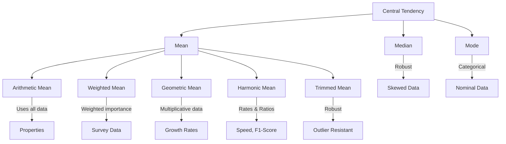

### The Central Tendency Spectrum


> 🎚️ **Reading the spectrum:** moving left → right, each measure uses *more* of the raw data and becomes *more sensitive* to outliers and extreme skew. Mode is the most robust (it only cares about frequency), the Mean is the least robust (every single value pulls on it), and Median / Trimmed Mean sit in between.

### Robustness vs. Efficiency Trade-off

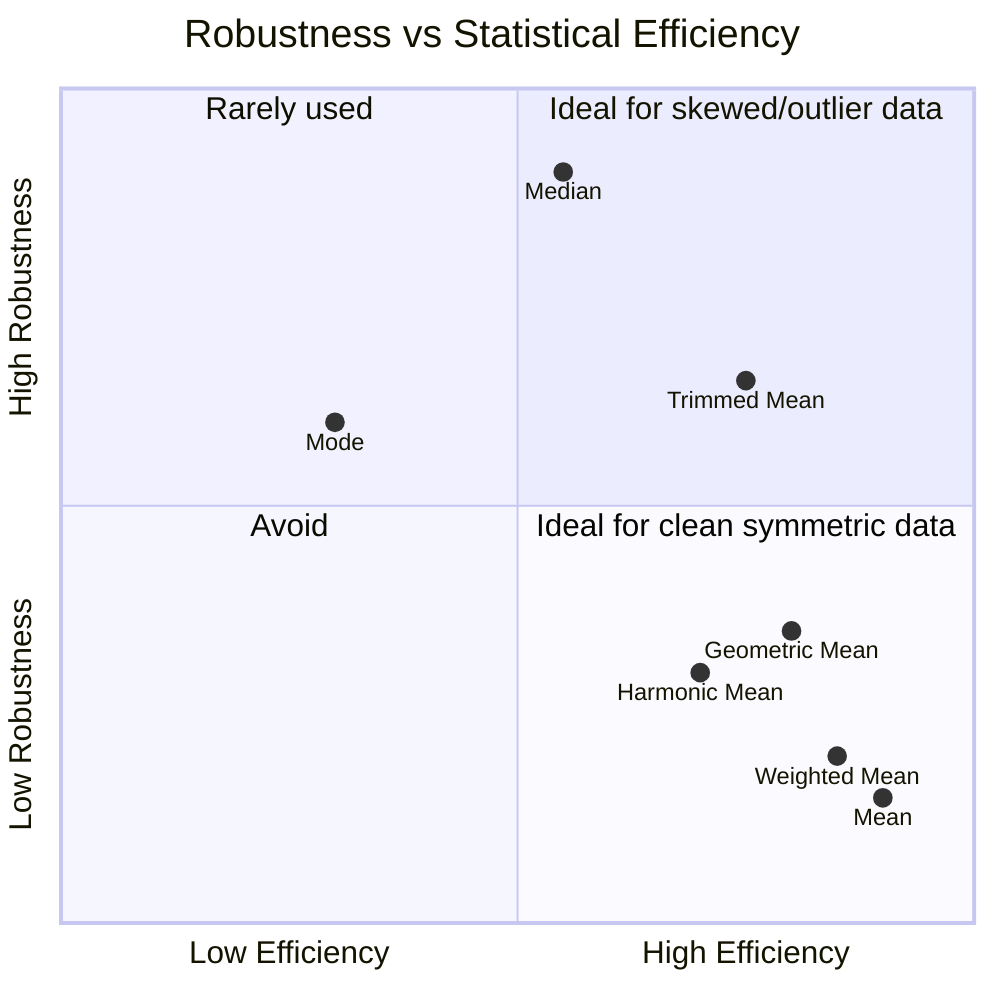

---

## 🎯 Learning Objectives

| Level | Objectives |
|-------|------------|
| **🏗️ Foundational** | ✅ Compute mean, median, and mode by hand and in software |
| | ✅ Understand when each measure is appropriate |
| | ✅ Interpret "average" claims in scientific literature |
| **📈 Intermediate** | ✅ Calculate weighted, geometric, and harmonic means |
| | ✅ Understand the mathematical properties of the mean |
| | ✅ Choose appropriate measures given data shape |
| **🎓 Advanced** | ✅ Critically evaluate "average" claims in research |
| | ✅ Detect and correct misuse of central tendency |
| | ✅ Explain trade-offs between measures with mathematical rigor |

---

## 🧭 Prerequisites

**Required Knowledge:**
- ✅ Chapter 1: Descriptive Statistics
- ✅ Summation notation ($\Sigma$)
- ✅ Basic algebra
- ✅ Understanding of data types (nominal, ordinal, interval, ratio)

**Estimated Study Time:** ⏱️ 2.5 – 4 hours

---

## 💡 Why This Topic Matters

> [!TIP]
> *"On average" is the most quoted — and most misused — phrase in scientific communication. Which average, computed how, determines whether a claim is honest or misleading.*

### Real-World Impact

| Field | Why Central Tendency Matters | Example |
|-------|-----------------------------|---------|
| 🏥 **Medicine** | Determining "normal" blood pressure, average survival time | "Average survival for pancreatic cancer is 6 months" |
| 💰 **Economics** | Average income, GDP per capita, inflation rates | "Average household income is $75,000" — but is that mean or median? |
| 🧪 **Clinical Trials** | Baseline characteristics, treatment effects | "The average treatment effect was 5.2 mmHg reduction" |
| 📊 **Public Health** | Average life expectancy, disease incidence | "Average life expectancy in the US is 78.8 years" |
| 🤖 **Machine Learning** | Feature scaling, imputation, baseline models | "We imputed missing values using the mean" |
| 🏭 **Quality Control** | Average product dimensions, process monitoring | "The average diameter of manufactured parts is 10.2 mm" |
| 🏫 **Education** | Average test scores, grade point averages | "The average SAT score at this university is 1250" |
| 📈 **Finance** | Average returns, portfolio performance | "The average annual return of the S&P 500 is 10%" |

### Why This Chapter Matters for Your Research

> [!IMPORTANT]
> **Quick Wins for Researchers:**
> 1. **Better Data Description**: Choose the right "average" for your data type
> 2. **Improved Interpretation**: Accurately describe "typical" values in your study
> 3. **Stronger Papers**: Avoid common reviewer criticisms about inappropriate statistics
> 4. **Clearer Communication**: Explain findings to non-statistical audiences

---

## 🌍 Big Picture

### The Central Tendency Landscape

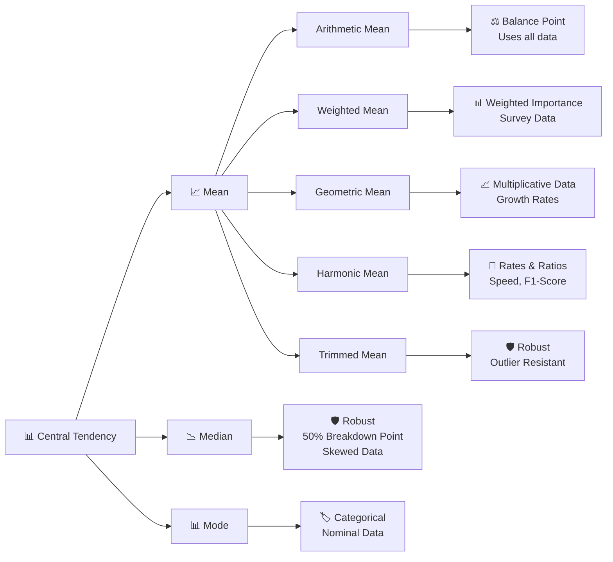

---

## 🧠 Core Intuition

### The Three Perspectives

Central tendency answers: **"If I had to describe this dataset with one number, what would it be?"** The three classical answers — mean, median, mode — each optimize a different criterion:

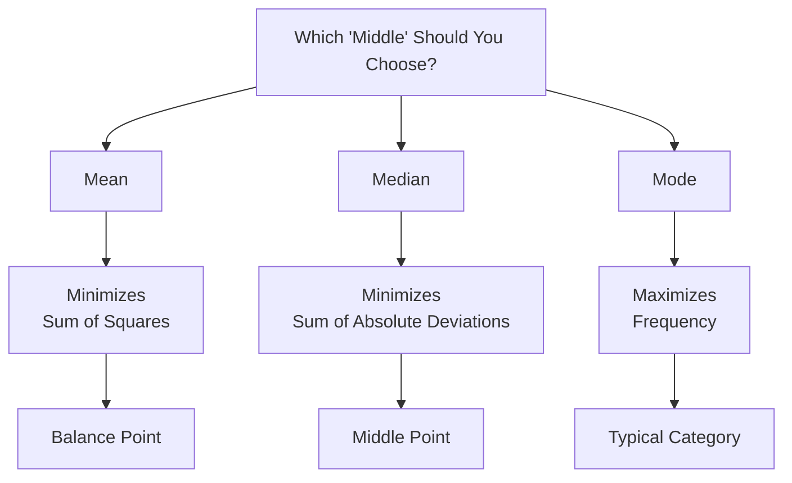


### The Central Tendency Spectrum

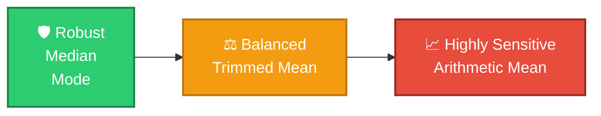

---

### The Three Questions Each Measure Answers

| Measure | Fundamental Question | Statistical Principle |
|---------|----------------------|-----------------------|
| **Arithmetic Mean** | What is the balance point of the data? | Minimizes the **sum of squared deviations** from the center. |
| **Median** | What value divides the dataset into two equal halves? | Minimizes the **sum of absolute deviations**. |
| **Mode** | Which value occurs most frequently? | Maximizes the **frequency of occurrence**. |

---

### Interpretation

- **Arithmetic Mean** is most appropriate for **approximately symmetric numerical data** without extreme outliers.
- **Median** is preferred for **skewed distributions** or datasets containing outliers.
- **Mode** is useful for identifying the **most common category or value**, especially for categorical variables.

> 💡 **Key Insight:**  
> The choice of a measure of central tendency depends on the **distribution, scale of measurement, and presence of outliers**, rather than using the arithmetic mean in every situation.

## 🧠 Core Intuition

### The Three Perspectives

Central tendency answers: **"If I had to describe this dataset with one number, what would it be?"** The three classical answers — mean, median, mode — each optimize a different criterion:

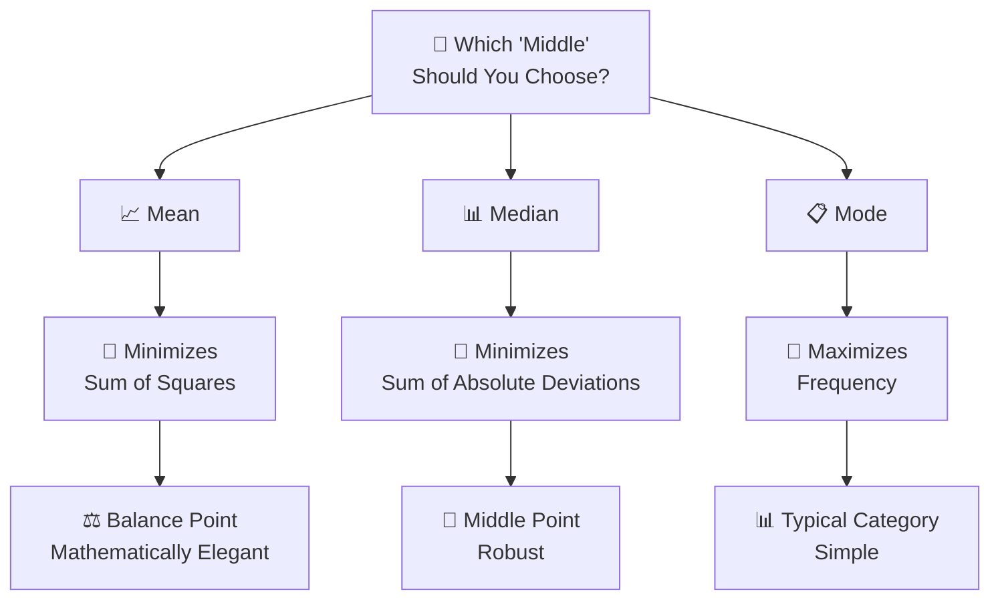

### The "Restaurant Analogy" 🍽️

Imagine you're reviewing a restaurant with your friends:

| Statistic | Restaurant Example | Statistical Equivalent |
|-----------|-------------------|----------------------|
| Most common dish ordered | **Mode** | Most frequent value |
| Middle-priced dish | **Median** | Middle value |
| Average price of all dishes | **Mean** | Arithmetic average |
| Price that accounts for portions | **Weighted Mean** | Weighted average |
| Average price increase over years | **Geometric Mean** | Multiplicative growth |
| Average speed of delivery | **Harmonic Mean** | Rate averaging |

### The "Income Analogy" 💰

```
A neighborhood has 10 households:
- 9 households earn $30,000/year
- 1 household earns $1,000,000/year

Mean income = ($30,000 × 9 + $1,000,000) / 10 = $127,000
Median income = $30,000
Mode income = $30,000

Question: Which "average" best represents the neighborhood?
Answer: Median or Mode (not Mean!)
```

---

### The "Restaurant Analogy"

Imagine you're reviewing a restaurant:

| Statistic | Restaurant Example | Statistical Equivalent |
|-----------|-------------------|----------------------|
| Most common dish ordered | **Mode** | Most frequent value |
| Middle-priced dish | **Median** | Middle value |
| Average price of all dishes | **Mean** | Arithmetic average |
| Price that accounts for portions | **Weighted Mean** | Weighted average |
| Average price increase over years | **Geometric Mean** | Multiplicative growth |

### Skewness and the Mean–Median–Mode Relationship

The relative position of the three measures is one of the fastest ways to *diagnose* the shape of a distribution without plotting anything.

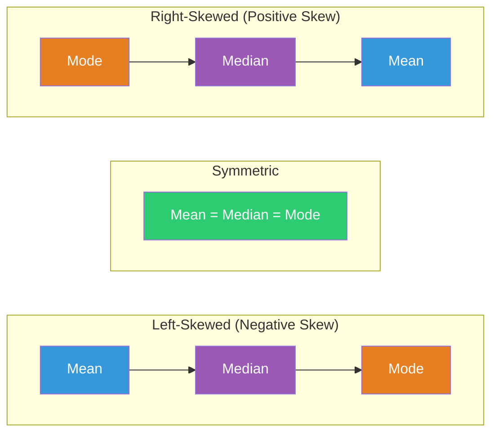

| Skew Direction | Typical Ordering | Real Example |
|----------------|------------------|---------------|
| **Right-skewed (positive)** | Mode < Median < Mean | Income, hospital length of stay, viral load |
| **Symmetric** | Mode = Median = Mean | Height, IQ scores, measurement error |
| **Left-skewed (negative)** | Mean < Median < Mode | Age at retirement, exam scores near a ceiling |

> [!TIP]
> This ordering is a rule of thumb, not a mathematical law — it fails for some multimodal or heavy-tailed distributions. Always confirm with a histogram or a formal skewness statistic before relying on it.

### How an Outlier "Pulls" the Mean

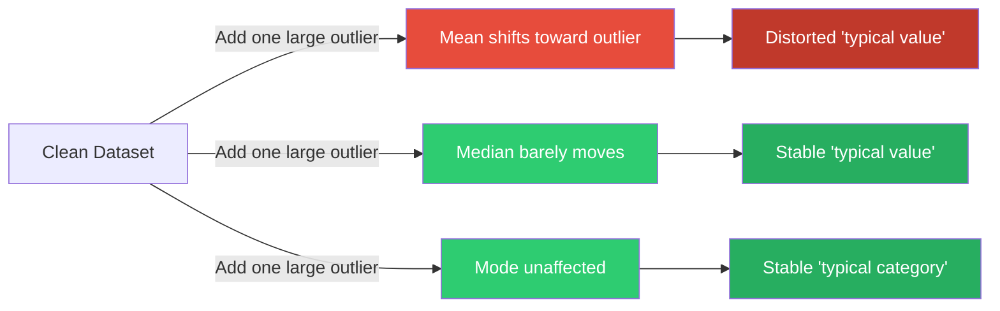


## 📐 Mathematical Foundation

### Key Definitions

#### Arithmetic Mean

> 📖 **Definition**: The arithmetic mean is the sum of all observations divided by the number of observations.

$$\bar{x} = \frac{1}{n}\sum_{i=1}^{n} x_i$$

**Population Mean:**
$$\mu = \frac{1}{N}\sum_{i=1}^{N} x_i$$

**Sample Mean:**
$$\bar{x} = \frac{1}{n}\sum_{i=1}^{n} x_i$$

#### Properties of the Mean

> 📊 **The Five Key Properties**

1. **Least-Squares Property**: The mean minimizes the sum of squared deviations
   $$\sum_{i=1}^n (x_i - c)^2 \text{ is minimized when } c = \bar{x}$$

2. **Linearity**: For transformed variables $y_i = ax_i + b$
   $$\bar{y} = a\bar{x} + b$$

3. **Unbiasedness**: The expected value equals the population mean
   $$E[\bar{x}] = \mu$$

4. **Sum of Deviations**: The sum of deviations from the mean is zero
   $$\sum_{i=1}^n (x_i - \bar{x}) = 0$$

5. **Efficiency**: Among all unbiased estimators, the mean has the lowest variance
   $$\text{Var}(\bar{x}) = \frac{\sigma^2}{n}$$

#### Derivation of the Mean

**The Optimization Problem:**

Find $c$ that minimizes $S(c) = \sum_{i=1}^n (x_i - c)^2$

**Step 1:** Take the derivative with respect to c
$$\frac{dS}{dc} = -2\sum_{i=1}^n (x_i - c)$$

**Step 2:** Set derivative to zero
$$-2\sum_{i=1}^n (x_i - c) = 0$$

**Step 3:** Solve for c
$$\sum_{i=1}^n (x_i - c) = 0$$
$$\sum_{i=1}^n x_i - nc = 0$$
$$nc = \sum_{i=1}^n x_i$$
$$c = \frac{1}{n}\sum_{i=1}^n x_i = \bar{x}$$

**Step 4:** Verify it's a minimum (second derivative is positive)
$$\frac{d^2S}{dc^2} = 2n > 0$$

#### The Median as an Optimization

The median minimizes the sum of absolute deviations:

$$\sum_{i=1}^n |x_i - c| \text{ is minimized when } c \text{ is the median}$$

**Proof Intuition:** The derivative of $|x_i - c|$ is:
- $-1$ when $x_i > c$
- $+1$ when $x_i < c$
- Undefined at $x_i = c$

The minimum occurs when there are equal numbers of observations on both sides.

### The Relationship Between Measures

For a unimodal distribution:

- **Symmetric**: Mean = Median = Mode
- **Right-Skewed**: Mean > Median > Mode
- **Left-Skewed**: Mean < Median < Mode

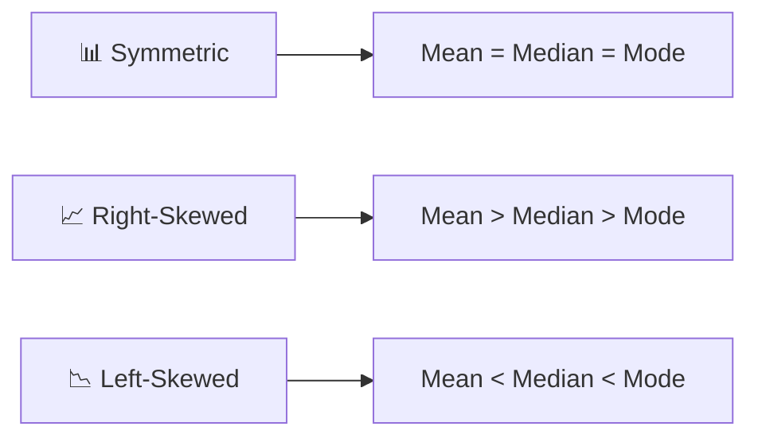

---

## 📊 Measures of Central Tendency

### 1. Arithmetic Mean 📈

#### Full Derivation

**The Least-Squares Derivation:**

We want to find the value $c$ that minimizes:

$$S(c) = \sum_{i=1}^n (x_i - c)^2$$

**Proof:**
1. Expand $S(c)$:
   $$S(c) = \sum_{i=1}^n x_i^2 - 2c\sum_{i=1}^n x_i + nc^2$$

2. Differentiate:
   $$\frac{dS}{dc} = -2\sum_{i=1}^n x_i + 2nc$$

3. Set to zero:
   $$-2\sum_{i=1}^n x_i + 2nc = 0$$
   $$nc = \sum_{i=1}^n x_i$$
   $$c = \frac{1}{n}\sum_{i=1}^n x_i = \bar{x}$$

#### Properties in Detail

| Property | Mathematical Statement | Implication |
|----------|----------------------|-------------|
| **Linearity** | $\overline{ax + b} = a\bar{x} + b$ | Scale transformations are predictable |
| **Unbiasedness** | $E[\bar{x}] = \mu$ | No systematic error |
| **Efficiency** | $\text{Var}(\bar{x}) = \sigma^2/n$ | Variance decreases with n |
| **Consistency** | $\bar{x} \xrightarrow{p} \mu$ | Converges to true mean |
| **Additivity** | $\overline{x + y} = \bar{x} + \bar{y}$ | Separable |

#### Advantages and Disadvantages

| Advantages | Disadvantages |
|------------|---------------|
| ✅ Uses all available data | ❌ Highly sensitive to outliers |
| ✅ Mathematically tractable | ❌ Not robust to skewness |
| ✅ Has excellent statistical properties | ❌ May not represent "typical" value |
| ✅ Unbiased estimator | ❌ Only valid for quantitative data |
| ✅ Basis for many statistical methods | ❌ Requires interval/ratio scale |

#### Interpretation Guide

> 💡 **Key Insight**: The mean is the **balance point** of the data, where the sum of positive and negative deviations exactly cancel.

**Contextual Interpretations:**

| Context | Interpretation |
|---------|----------------|
| **Normal distribution** | The typical or average value |
| **Symmetric distribution** | Central tendency |
| **Skewed distribution** | Might be misleading as "typical" |
| **Medical research** | Average effect or baseline characteristic |
| **Public health** | Population average indicator |

#### Example: Blood Pressure Data

```text
Dataset: 118, 119, 121, 122, 125, 128, 130, 138, 145, 150

Mean = (118 + 119 + 121 + 122 + 125 + 128 + 130 + 138 + 145 + 150) / 10
     = 1296 / 10
     = 129.6 mmHg

Interpretation: The average blood pressure in this sample is 129.6 mmHg.
This represents the balance point of the data.
```

---

### 2. Weighted Mean ⚖️

#### Mathematical Definition

$$\bar{x}_w = \frac{\sum_{i=1}^n w_i x_i}{\sum_{i=1}^n w_i}$$

#### Derivation

**The Optimization Problem:**

Minimize the weighted sum of squared deviations:

$$S_w(c) = \sum_{i=1}^n w_i (x_i - c)^2$$

**Step 1:** Differentiate with respect to c
$$\frac{dS_w}{dc} = -2\sum_{i=1}^n w_i(x_i - c)$$

**Step 2:** Set to zero
$$\sum_{i=1}^n w_i x_i - c\sum_{i=1}^n w_i = 0$$

**Step 3:** Solve for c
$$c = \frac{\sum_{i=1}^n w_i x_i}{\sum_{i=1}^n w_i} = \bar{x}_w$$

#### Common Weight Types

| Weight Type | Formula | Example | Use Case |
|-------------|---------|---------|----------|
| **Frequency** | $w_i = n_i$ | Number of observations in each group | Aggregating grouped data |
| **Inverse Variance** | $w_i = 1/s_i^2$ | Precision of each estimate | Meta-analysis |
| **Survey Design** | $w_i = \text{design weight}$ | Sampling weights (DHS, NHANES) | Complex survey data |
| **Distance Weighting** | $w_i = 1/d_i$ | Inverse distance | Spatial statistics |
| **Importance Weighting** | $w_i = \text{expert score}$ | Expert assigned weights | Composite indices |

#### Applications

**1. Survey Research** 📋
- Adjusting for oversampling or undersampling
- Population weighting in DHS surveys
- Post-stratification adjustments

**2. Meta-Analysis** 📊
- Combining study results
- Weighting by precision (inverse variance)
- Random effects vs. fixed effects

**3. Composite Indices** 📈
- Human Development Index (HDI)
- Health quality metrics
- Multi-dimensional poverty index

#### Real Example: Weighted Mean in DHS Surveys

```text
DHS Surveys use sampling weights (v005) to adjust for:
- Unequal probability of selection
- Non-response
- Post-stratification

Weighted Mean Formula:
\bar{x}_w = \frac{\sum_{i=1}^n w_i x_i}{\sum_{i=1}^n w_i}

Where w_i = sampling weight / 1,000,000

Example:
Region A: n=100, mean BMI=25.0, weight=1.2
Region B: n=80, mean BMI=27.5, weight=0.8
Region C: n=60, mean BMI=23.5, weight=1.0

Weighted Mean = (100*25.0*1.2 + 80*27.5*0.8 + 60*23.5*1.0) / 
                (100*1.2 + 80*0.8 + 60*1.0)
              = (3000 + 1760 + 1410) / (120 + 64 + 60)
              = 6170 / 244
              = 25.29
```

#### Example: Grade Point Average (GPA)

```text
Course 1: 3 credits, Grade = A (4.0)
Course 2: 4 credits, Grade = B (3.0)
Course 3: 3 credits, Grade = A- (3.7)
Course 4: 2 credits, Grade = B+ (3.3)

Weighted GPA = (3*4.0 + 4*3.0 + 3*3.7 + 2*3.3) / (3+4+3+2)
             = (12.0 + 12.0 + 11.1 + 6.6) / 12
             = 41.7 / 12
             = 3.475
```

---

### 3. Geometric Mean 📈

#### Mathematical Definition

$$G = \left(\prod_{i=1}^n x_i\right)^{1/n}$$

**Logarithmic Form:**
$$G = \exp\left(\frac{1}{n}\sum_{i=1}^n \ln x_i\right)$$

#### Derivation

**Step 1:** Take the natural log of both sides
$$\ln G = \ln\left[\left(\prod_{i=1}^n x_i\right)^{1/n}\right]$$

**Step 2:** Use log rules
$$\ln G = \frac{1}{n}\sum_{i=1}^n \ln x_i$$

**Step 3:** This is the arithmetic mean of the logged values

**Step 4:** Exponentiate to get G
$$G = \exp\left(\frac{1}{n}\sum_{i=1}^n \ln x_i\right)$$

#### Properties

> 📊 **Key Properties**

1. **Multiplicative**: $G$ is the value that, if multiplied n times, gives the product of all values
2. **Scale-Invariant**: $G(aX) = a \cdot G(X)$ for $a > 0$
3. **Log-Normal**: For log-normal data, G is the median
4. **Relationship**: For positive values, $H \leq G \leq A$

#### Advantages and Disadvantages

| Advantages | Disadvantages |
|------------|---------------|
| ✅ Appropriate for multiplicative data | ❌ Requires positive values |
| ✅ Handles ratios and growth rates well | ❌ Less intuitive interpretation |
| ✅ Less affected by large values | ❌ Not defined for negative values |
| ✅ Natural for log-normal data | ❌ Can be 0 if any value is 0 |

#### Applications

**Medical Example: Antibody Titers** 🧬

```text
Study: Vaccine response in immunology
Data: Antibody titers (dilution factors)
- Patient 1: 1:40
- Patient 2: 1:80
- Patient 3: 1:160
- Patient 4: 1:320
- Patient 5: 1:640

Geometric Mean = (40 × 80 × 160 × 320 × 640)^(1/5)
                 = (1.048 × 10^10)^(0.2)
                 ≈ 160

Interpretation: The typical antibody titer is about 1:160
```

**Public Health Example: Environmental Exposure** 🌍

```text
Study: Air pollution exposure in urban areas
Data: PM2.5 concentrations (μg/m³)
- 15, 22, 18, 45, 12, 25, 30, 19, 23, 17

Step 1: Take natural logs
ln(15)=2.708, ln(22)=3.091, ln(18)=2.890, ln(45)=3.807, ln(12)=2.485,
ln(25)=3.219, ln(30)=3.401, ln(19)=2.944, ln(23)=3.135, ln(17)=2.833

Step 2: Mean of logs = (2.708+3.091+2.890+3.807+2.485+3.219+3.401+2.944+3.135+2.833)/10
                     = 30.513/10
                     = 3.0513

Step 3: Geometric Mean = exp(3.0513) = 21.1 μg/m³

Interpretation: The geometric mean better represents central 
exposure in log-normal distributions
```

**Financial Example: Investment Returns** 💰

```text
Problem: You have an investment that returns:
- Year 1: +10%
- Year 2: -5%
- Year 3: +15%
- Year 4: +8%

Arithmetic Mean = (10% + (-5%) + 15% + 8%) / 4 = 7%

Geometric Mean = [(1.10)(0.95)(1.15)(1.08)]^(1/4) - 1
                = (1.2988)^(0.25) - 1
                = 1.067 - 1
                = 6.7%

Which is correct? The geometric mean! It accounts for compounding.
```

**Machine Learning Example: Feature Engineering** 🤖

```python
# Log transformation for multiplicative features
import numpy as np

# Price data (multiplicative process)
prices = np.array([15, 22, 18, 45, 12, 25, 30, 19, 23, 17])

# Geometric mean
gm = np.exp(np.mean(np.log(prices)))
print(f"Geometric mean: {gm:.2f}")

# Use for feature scaling in ML
log_prices = np.log(prices)  # Log transformation

# Compare to arithmetic mean
am = np.mean(prices)
print(f"Arithmetic mean: {am:.2f}")
print(f"Geometric mean: {gm:.2f}")
print(f"Ratio (GM/AM): {gm/am:.2f}")
```

---

### 4. Harmonic Mean 🔢

#### Mathematical Definition

$$H = \frac{n}{\sum_{i=1}^n \frac{1}{x_i}}$$

#### Derivation

**Step 1:** Take the reciprocal of the arithmetic mean of reciprocals
$$\frac{1}{H} = \frac{1}{n}\sum_{i=1}^n \frac{1}{x_i}$$

**Step 2:** Solve for H
$$H = \frac{n}{\sum_{i=1}^n \frac{1}{x_i}}$$

#### Properties

> 📊 **Key Properties**

1. **Rate Averaging**: Appropriate for rates and ratios
2. **Small Value Influence**: Less influenced by large values, more by small values
3. **Relationship**: For positive values, $H \leq G \leq A$
4. **Equality**: $H = G = A$ only when all values are equal

#### Applications

**1. Average Speed** 🚗

```text
Problem: Traveling 100 miles at 50 mph, then 100 miles at 60 mph

Harmonic Mean Speed = 2 / (1/50 + 1/60)
                    = 2 / (0.02 + 0.01667)
                    = 2 / 0.03667
                    ≈ 54.55 mph

Arithmetic Mean Speed = (50 + 60) / 2 = 55 mph

Which is correct? The harmonic mean!
Total distance = 200 miles
Total time = 100/50 + 100/60 = 2 + 1.667 = 3.667 hours
Average speed = 200/3.667 = 54.55 mph ✓
```

**2. Machine Learning: F1-Score** 🤖

$$F1 = \frac{2 \cdot \text{Precision} \cdot \text{Recall}}{\text{Precision} + \text{Recall}}$$

This is the harmonic mean of precision and recall.

Example:
- Precision = 0.80
- Recall = 0.60

F1 = 2 * (0.80 * 0.60) / (0.80 + 0.60)
   = 2 * 0.48 / 1.40
   = 0.96 / 1.40
   = 0.686

**3. Finance: Dollar Cost Averaging** 💰

```text
Problem: Investing $1000 each month
Month 1: Stock price = $50 → 20 shares
Month 2: Stock price = $40 → 25 shares
Month 3: Stock price = $45 → 22.22 shares

Total shares = 20 + 25 + 22.22 = 67.22 shares
Total investment = $3000
Average cost per share = 3000 / 67.22 = $44.63

Harmonic Mean of prices = 3 / (1/50 + 1/40 + 1/45)
                        = 3 / (0.02 + 0.025 + 0.02222)
                        = 3 / 0.06722
                        = $44.63 ✓
```

---

### 5. Median 📍

#### Mathematical Definition

For ordered data $x_{(1)} \leq x_{(2)} \leq ... \leq x_{(n)}$:

$$\text{Median} = 
\begin{cases}
x_{(n+1)/2} & \text{if n is odd} \\
\frac{x_{n/2} + x_{n/2+1}}{2} & \text{if n is even}
\end{cases}$$

#### Derivation as Optimization

The median minimizes the sum of absolute deviations:

$$m = \arg\min_c \sum_{i=1}^n |x_i - c|$$

**Proof:**
1. Let $F(c) = \sum_{i=1}^n |x_i - c|$
2. The derivative $F'(c) = \#\{x_i > c\} - \#\{x_i < c\}$
3. Set $F'(c) = 0$: equal numbers on both sides
4. This gives the median

#### Properties

> 📊 **Key Properties**

1. **Robustness**: Resistant to outliers (breakdown point = 50%)
2. **Invariance**: Median($aX + b$) = $a \cdot \text{Median}(X) + b$
3. **Order**: Depends only on relative order, not magnitude
4. **Breakdown Point**: 50% of data can be corrupted without changing the median
5. **Efficiency**: Less efficient than the mean (higher variance)

#### Advantages and Disadvantages

| Advantages | Disadvantages |
|------------|---------------|
| ✅ Robust to outliers | ❌ Less efficient than mean |
| ✅ Appropriate for ordinal data | ❌ Loses magnitude information |
| ✅ Works with skewed distributions | ❌ Higher sampling variation |
| ✅ Always exists | ❌ More complex for large datasets |
| ✅ Easy to understand | ❌ Not algebraically tractable |

#### Interpretation Guide

> 💡 **Key Insight**: The median represents the **middle position** where 50% of observations fall on each side.

**Contextual Interpretations:**

| Context | Interpretation |
|---------|----------------|
| **Income data** | "Typical" person's income |
| **Survival analysis** | Median survival time |
| **Clinical research** | Median hospital stay |
| **Public health** | Median household income |
| **Real estate** | Median home price |

#### Example: Income Data

```text
Dataset: Annual household incomes in a neighborhood
$25,000, $30,000, $35,000, $40,000, $45,000, $50,000, $1,000,000

n = 7 (odd)
Median = $40,000 (the 4th value)

Mean = (25,000 + 30,000 + 35,000 + 40,000 + 45,000 + 50,000 + 1,000,000) / 7
     = 1,225,000 / 7
     = $175,000

Which better represents the "typical" income? Median = $40,000
```

#### Example: Hospital Length of Stay

```text
Dataset: Length of stay (days) for 10 patients
2, 3, 4, 4, 5, 5, 6, 7, 8, 45

n = 10 (even)
Median = (5 + 5) / 2 = 5 days

Mean = (2+3+4+4+5+5+6+7+8+45) / 10
     = 89 / 10
     = 8.9 days

Which better represents the typical length of stay? Median = 5 days
The mean is pulled up by the one patient who stayed 45 days.
```

---

### 6. Mode 📋

#### Mathematical Definition

$$\text{Mode} = \arg\max_x f(x)$$

Where $f(x)$ is the frequency of value $x$.

#### Properties

> 📊 **Key Properties**

1. **Uniqueness**: May be non-unique (multimodal)
2. **Stability**: Stable for categorical data
3. **Applicability**: Works for all data types
4. **Existence**: May not exist if no value repeats

#### Advantages and Disadvantages

| Advantages | Disadvantages |
|------------|---------------|
| ✅ Works for all data types | ❌ May be non-unique |
| ✅ Easy to understand | ❌ Not stable for small samples |
| ✅ Represents typical category | ❌ Loses magnitude information |
| ✅ No arithmetic needed | ❌ May be meaningless for continuous data |

#### Applications

**Medical Example: Blood Type** 🩸
```text
Most common blood type: O positive
```

**Public Health Example: Disease Outbreak** 🦠
```text
Most common age group: 25-34 years
```

**Machine Learning Example: Imputation** 🤖
```python
# Mode imputation for categorical missing values
from sklearn.impute import SimpleImputer
imputer = SimpleImputer(strategy='most_frequent')
```

**Market Research: Product Preferences** 📊
```text
Most commonly purchased brand: Brand X
```

#### Example: Continuous Data

```text
Dataset: 2, 3, 4, 4, 5, 5, 6, 7, 8, 9

Mode = 4 and 5 (bimodal)

For continuous data, modes are often not meaningful unless the data is binned.
```

---

### 7. Trimmed Mean ✂️

#### Mathematical Definition

For a 100$\alpha$% trimmed mean:

$$\bar{x}_{\text{trim}} = \frac{1}{n(1-2\alpha)}\sum_{i=\alpha n+1}^{n(1-\alpha)} x_{(i)}$$

#### Properties

> 📊 **Key Properties**

1. **Robustness**: Less sensitive to outliers than the mean
2. **Efficiency**: More efficient than the median
3. **Trade-off**: Balances efficiency and robustness
4. **Breakdown Point**: $\alpha$ (the trimming proportion)

#### Advantages and Disadvantages

| Advantages | Disadvantages |
|------------|---------------|
| ✅ More robust than mean | ❌ Less efficient than mean |
| ✅ More efficient than median | ❌ Requires choosing trimming proportion |
| ✅ Still uses most data | ❌ Not intuitive for some |
| ✅ Good for moderate outliers | ❌ Loses some information |

#### Applications

**Sports Scoring** ⚽
```text
Olympic diving scores:
- Judges: 9.5, 9.4, 9.6, 9.7, 4.5 (outlier!)
- 20% trimmed mean: Remove highest and lowest
- Result: (9.4 + 9.5 + 9.6) / 3 = 9.5
```

**Medical Example: Toxicological Studies** 🧪
```text
Study: Chemical exposure in occupational health
Data: Daily exposure levels with some extreme values
- 20% trimmed mean provides robust exposure estimate
```

**Economics: Income Distribution** 💰
```text
Dataset: Annual incomes with some extreme values
- Mean: $75,000
- 20% Trimmed Mean: $55,000
- Median: $50,000

The trimmed mean provides a balance between the mean and median.
```

---

## 🔄 Choosing the Right Measure

### Decision Framework

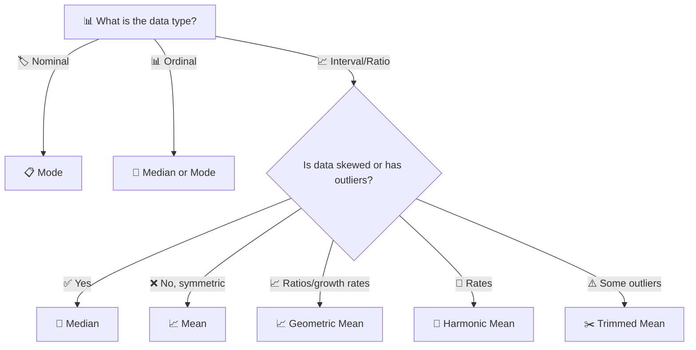

### Comparison Table

| Measure | Sensitive to Outliers? | Uses All Data? | Valid Scale | Interpretation |
|---------|----------------------|----------------|-------------|----------------|
| **Mean** | Yes (highly) | Yes | Interval, Ratio | Balance point |
| **Weighted Mean** | Yes | Yes | Interval, Ratio | Weighted balance |
| **Geometric Mean** | Yes (for large) | Yes | Ratio (positive) | Multiplicative center |
| **Harmonic Mean** | Yes (for small) | Yes | Ratio (positive) | Rate center |
| **Median** | No (robust) | No (only order) | Ordinal, Interval, Ratio | Middle position |
| **Mode** | No | No | All types | Most frequent |
| **Trimmed Mean** | Moderately | Mostly | Interval, Ratio | Robust center |

### When to Use What

| Situation | Best Choice | Why |
|-----------|-------------|-----|
| Symmetric, no outliers | Mean | Efficient, unbiased, interpretable |
| Skewed data | Median | Robust, represents "typical" |
| Categorical data | Mode | Only valid measure |
| Survey data | Weighted Mean | Accounts for design |
| Growth rates | Geometric Mean | Multiplicative property |
| Rates (speed, F1) | Harmonic Mean | Rate property |
| Some outliers | Trimmed Mean | Balance robustness/efficiency |
| Ordinal data | Median | Respects order |

### The "Two-Step" Approach

> [!TIP]
> **Always follow this two-step approach:**
> 1. **Visualize the data** (histogram, boxplot)
> 2. **Check distribution shape** (symmetry, outliers)
> 3. **Choose appropriate measure** based on findings

---

## ✏️ Worked Examples

### Example 1: Clinical Trial Baseline Data 🏥

**Dataset:** Blood pressure (mmHg) from a clinical trial

`118, 119, 121, 122, 125, 128, 130, 138, 145, 150`

**Step 1:** Sort data (already sorted)

**Step 2:** Calculate the Mean
$$\bar{x} = \frac{118+119+121+122+125+128+130+138+145+150}{10}$$
$$\bar{x} = \frac{1296}{10} = 129.6 \text{ mmHg}$$

**Step 3:** Calculate the Median (n = 10, even)
$$\text{Median} = \frac{125 + 128}{2} = 126.5 \text{ mmHg}$$

**Step 4:** Calculate the Mode
No value repeats → **no mode**

**Step 5:** Calculate Trimmed Mean (10% trim)
Remove 1 smallest and 1 largest:
$$\bar{x}_{\text{trim}} = \frac{119+121+122+125+128+130+138+145}{8}$$
$$\bar{x}_{\text{trim}} = \frac{1028}{8} = 128.5 \text{ mmHg}$$

**Step 6:** Calculate Weighted Mean (with weights)
```text
Weights: [1, 1, 2, 1, 1, 1, 1, 1, 1, 3]
Weighted Mean = (1*118 + 1*119 + 2*121 + 1*122 + 1*125 + 1*128 + 1*130 + 1*138 + 1*145 + 3*150) / (1+1+2+1+1+1+1+1+1+3)
              = (118 + 119 + 242 + 122 + 125 + 128 + 130 + 138 + 145 + 450) / 13
              = 1717 / 13
              = 132.08 mmHg
```

**Summary Table:**
| Measure | Value |
|---------|-------|
| Mean | 129.6 mmHg |
| Median | 126.5 mmHg |
| Mode | None |
| Trimmed Mean (10%) | 128.5 mmHg |
| Weighted Mean | 132.08 mmHg |

**Interpretation:** The median (126.5 mmHg) is slightly lower than the mean (129.6 mmHg), suggesting mild right skew. The trimmed mean (128.5 mmHg) provides a robust estimate.

---

### Example 2: Effect of an Outlier ⚠️

**Original:** `118, 119, 121, 122, 125, 128, 130, 138, 145, 150`
- Mean: 129.6 mmHg
- Median: 126.5 mmHg

**With Outlier:** `118, 119, 121, 122, 125, 128, 130, 138, 145, 250`
- New Mean: 139.6 mmHg (↑ 10 mmHg)
- New Median: 126.5 mmHg (unchanged!)

> [!IMPORTANT]
> **Key Insight:** This example is the clearest demonstration of why medians are preferred for skewed clinical data such as:
> - Length of hospital stay
> - Cost data
> - Viral load
> - Income data
> - Survival times

**Visual Comparison:**
```text
Before:         After:
Mean = 129.6    Mean = 139.6  (↑10 mmHg)
Median = 126.5  Median = 126.5 (unchanged)

The median is robust to the outlier; the mean is not.
```

---

### Example 3: Geometric Mean 🧬

**Dataset:** Antibody titers: 40, 80, 160, 320, 640

**Step 1:** Take natural logs
$$\ln 40 = 3.689, \ln 80 = 4.382, \ln 160 = 5.075, \ln 320 = 5.768, \ln 640 = 6.461$$

**Step 2:** Calculate mean of logs
$$\frac{3.689 + 4.382 + 5.075 + 5.768 + 6.461}{5} = \frac{25.375}{5} = 5.075$$

**Step 3:** Exponentiate
$$G = e^{5.075} = 160$$

**Interpretation:** The typical antibody titer is 1:160

**Comparison:**
```text
Arithmetic Mean = (40 + 80 + 160 + 320 + 640) / 5 = 248
Geometric Mean = 160

The geometric mean is lower because it's less affected by large values.
For antibody titers, the geometric mean is the standard measure.
```

---

### Example 4: Weighted Mean 📊

**Dataset:** Survey data with weights

| Group | n | Mean Income | Weight (inverse variance) |
|-------|---|-------------|--------------------------|
| Urban | 50 | $65,000 | 0.8 |
| Suburban | 30 | $72,000 | 1.2 |
| Rural | 20 | $58,000 | 1.0 |

**Step 1:** Calculate weighted mean
$$\bar{x}_w = \frac{50(65000) + 30(72000) + 20(58000)}{50 + 30 + 20}$$
$$\bar{x}_w = \frac{3,250,000 + 2,160,000 + 1,160,000}{100}$$
$$\bar{x}_w = \frac{6,570,000}{100} = \$65,700$$

**Step 2:** Calculate unweighted mean
$$\bar{x} = \frac{65,000 + 72,000 + 58,000}{3} = \frac{195,000}{3} = \$65,000$$

**Interpretation:** The weighted mean ($65,700) accounts for different sample sizes and is slightly higher than the unweighted mean ($65,000) because the urban group (with higher income) has a larger sample.

---

### Example 5: Harmonic Mean 🚗

**Dataset:** Speeds for a 100-mile trip: 50 mph, 60 mph, 55 mph, 65 mph, 70 mph

**Step 1:** Calculate harmonic mean
$$H = \frac{5}{1/50 + 1/60 + 1/55 + 1/65 + 1/70}$$

**Step 2:** Calculate reciprocals
$$1/50 = 0.02, 1/60 = 0.01667, 1/55 = 0.01818, 1/65 = 0.01538, 1/70 = 0.01429$$
$$\sum = 0.08452$$

**Step 3:** Calculate H
$$H = 5 / 0.08452 = 59.16 \text{ mph}$$

**Step 4:** Calculate arithmetic mean
$$A = (50+60+55+65+70)/5 = 60 \text{ mph}$$

**Interpretation:** For averaging speeds, the harmonic mean (59.16 mph) is more appropriate than the arithmetic mean (60 mph). The difference is small here because the speeds are similar, but the harmonic mean would be more different if there were more variation.

---

### Example 6: Trimmed Mean ✂️

**Dataset:** Household incomes ($000s): 25, 30, 35, 40, 45, 50, 55, 60, 65, 70

**Step 1:** Sort data (already sorted)

**Step 2:** Calculate mean (n = 10)
$$\bar{x} = \frac{25+30+35+40+45+50+55+60+65+70}{10} = \frac{475}{10} = \$47.5$$

**Step 3:** Calculate median (n = 10, even)
$$\text{Median} = \frac{45 + 50}{2} = \$47.5$$

**Step 4:** Calculate 20% trimmed mean
Remove 2 smallest and 2 largest:
$$\bar{x}_{\text{trim}} = \frac{35+40+45+50+55+60}{6} = \frac{285}{6} = \$47.5$$

**Interpretation:** For symmetric data, all measures are equal.

**With Outlier:** `25, 30, 35, 40, 45, 50, 55, 60, 65, 1000`
- Mean: $\frac{1405}{10} = \$140.5$
- Median: $\frac{45+50}{2} = \$47.5$
- 20% Trimmed Mean: $\frac{35+40+45+50+55+60}{6} = \$47.5$

**Interpretation:** The trimmed mean provides a balance between the mean and median.

---

### Example 7: Comparing All Measures

**Dataset:** `2, 3, 4, 5, 6, 7, 8, 9, 10, 11`

| Measure | Value |
|---------|-------|
| Mean | 6.5 |
| Median | 6.5 |
| Mode | No mode (all values unique) |
| Geometric Mean | $\exp(\text{mean}(\log(\text{data}))) = \exp(1.92) = 6.82$ |
| Harmonic Mean | $10 / (1/2+1/3+...+1/11) = 10 / 2.93 = 3.42$ |
| Trimmed Mean (10%) | Remove min and max: $(3+4+5+6+7+8+9+10)/8 = 6.5$ |
| Weighted Mean (1,1,2,1,1,1,1,1,1,3) | $(2+3+8+5+6+7+8+9+10+33)/13 = 91/13 = 7.0$ |

**Interpretation:** For symmetric data, the mean and median are equal. The harmonic mean is much lower because it's influenced by small values.

---

## 💻 Software Implementation

### R Implementation 📊

<details>
<summary>📋 Click to expand R code</summary>

```r
# ============================================
# Chapter 2: Measures of Central Tendency
# R Implementation
# ============================================

# Load necessary libraries
library(dplyr)
library(psych)
library(DescTools)
library(ggplot2)

# ============================================
# 1. Create Dataset
# ============================================

# Blood pressure data
bp <- c(118, 122, 130, 145, 119, 125, 138, 128, 121, 150)

# ============================================
# 2. Basic Measures
# ============================================

# Mean
mean_bp <- mean(bp)
cat("Mean:", mean_bp, "\n")

# Median
median_bp <- median(bp)
cat("Median:", median_bp, "\n")

# Mode function
get_mode <- function(v) {
  uniq_v <- unique(v)
  uniq_v[which.max(tabulate(match(v, uniq_v)))]
}
mode_bp <- get_mode(bp)
cat("Mode:", mode_bp, "\n")

# Trimmed mean (10% trim)
trim_mean <- mean(bp, trim = 0.1)
cat("Trimmed Mean (10%):", trim_mean, "\n")

# Weighted mean
weights <- c(1, 1, 2, 1, 1, 1, 1, 1, 1, 3)
w_mean <- weighted.mean(bp, weights)
cat("Weighted Mean:", w_mean, "\n")

# Geometric mean
g_mean <- exp(mean(log(bp)))
cat("Geometric Mean:", g_mean, "\n")

# Harmonic mean
h_mean <- length(bp) / sum(1/bp)
cat("Harmonic Mean:", h_mean, "\n")

# ============================================
# 3. Summary Table
# ============================================

summary_stats <- data.frame(
  Measure = c("Mean", "Median", "Mode", "Trimmed Mean", 
              "Weighted Mean", "Geometric Mean", "Harmonic Mean"),
  Value = c(mean_bp, median_bp, mode_bp, trim_mean,
            w_mean, g_mean, h_mean)
)
print(summary_stats)

# Using psych package
library(psych)
describe(bp)

# ============================================
# 4. Visualization
# ============================================

# Create data frame for plotting
df <- data.frame(bp = bp)

# Histogram with central tendency lines
ggplot(df, aes(x = bp)) +
  geom_histogram(bins = 10, alpha = 0.7, fill = "steelblue", color = "black") +
  geom_vline(aes(xintercept = mean(bp)), color = "red", 
             linetype = "dashed", size = 1.2, label = "Mean") +
  geom_vline(aes(xintercept = median(bp)), color = "blue", 
             linetype = "dashed", size = 1.2, label = "Median") +
  geom_vline(aes(xintercept = get_mode(bp)), color = "green", 
             linetype = "dashed", size = 1.2, label = "Mode") +
  labs(
    title = "Measures of Central Tendency",
    subtitle = "Blood Pressure Data",
    x = "Blood Pressure (mmHg)",
    y = "Frequency"
  ) +
  theme_minimal() +
  theme(plot.title = element_text(hjust = 0.5, size = 16, face = "bold"),
        plot.subtitle = element_text(hjust = 0.5, size = 12))

# Boxplot
ggplot(df, aes(y = bp)) +
  geom_boxplot(fill = "steelblue", alpha = 0.7) +
  labs(
    title = "Boxplot of Blood Pressure",
    y = "Blood Pressure (mmHg)"
  ) +
  theme_minimal()

# ============================================
# 5. Effect of Outlier
# ============================================

# Add outlier
bp_with_outlier <- c(bp, 250)

# Compare measures
cat("\nEffect of Outlier:\n")
cat("Original mean:", mean(bp), "\n")
cat("Mean with outlier:", mean(bp_with_outlier), "\n")
cat("Original median:", median(bp), "\n")
cat("Median with outlier:", median(bp_with_outlier), "\n")

# ============================================
# 6. Advanced: All Measures Function
# ============================================

all_central_tendency <- function(x) {
  result <- list(
    mean = mean(x),
    median = median(x),
    mode = get_mode(x),
    trimmed_mean_10 = mean(x, trim = 0.1),
    trimmed_mean_20 = mean(x, trim = 0.2),
    geometric_mean = ifelse(all(x > 0), exp(mean(log(x))), NA),
    harmonic_mean = ifelse(all(x > 0), length(x) / sum(1/x), NA)
  )
  return(result)
}

# Test function
all_stats <- all_central_tendency(bp)
print(all_stats)

# ============================================
# 7. Density Plot with Measures
# ============================================

ggplot(df, aes(x = bp)) +
  geom_density(fill = "steelblue", alpha = 0.5) +
  geom_vline(aes(xintercept = mean(bp)), color = "red", 
             linetype = "dashed", size = 1.2) +
  geom_vline(aes(xintercept = median(bp)), color = "blue", 
             linetype = "dashed", size = 1.2) +
  geom_vline(aes(xintercept = get_mode(bp)), color = "green", 
             linetype = "dashed", size = 1.2) +
  labs(
    title = "Density Plot with Central Tendency Measures",
    x = "Blood Pressure (mmHg)",
    y = "Density"
  ) +
  theme_minimal()

# ============================================
# 8. Comparison with Different Distributions
# ============================================

# Generate different distributions
set.seed(123)

# Normal distribution
normal_data <- rnorm(1000, mean = 50, sd = 10)

# Right-skewed distribution (lognormal)
right_skewed <- rlnorm(1000, meanlog = 3, sdlog = 0.5)

# Left-skewed distribution
left_skewed <- -right_skewed + max(right_skewed) + 10

# Function to compare measures
compare_measures <- function(x, name) {
  cat("\n", name, "\n")
  cat("Mean:", mean(x), "\n")
  cat("Median:", median(x), "\n")
  cat("Mode:", get_mode(x), "\n")
  cat("Skewness:", psych::skew(x), "\n")
}

# Compare distributions
compare_measures(normal_data, "Normal Distribution")
compare_measures(right_skewed, "Right-Skewed Distribution")
compare_measures(left_skewed, "Left-Skewed Distribution")

# ============================================
# 9. Survey Weighted Analysis
# ============================================

# Simulate survey data
set.seed(123)
n <- 1000
survey_data <- data.frame(
  income = rnorm(n, mean = 50000, sd = 15000),
  weight = runif(n, 0.5, 2)  # Sampling weights
)

# Weighted vs unweighted mean
cat("\nSurvey Analysis:\n")
cat("Unweighted mean income:", mean(survey_data$income), "\n")
cat("Weighted mean income:", weighted.mean(survey_data$income, survey_data$weight), "\n")

# ============================================
# 10. Export Results
# ============================================

# Save summary table
write.csv(summary_stats, "central_tendency_summary.csv", row.names = FALSE)

# Save plot
ggsave("central_tendency_plot.png", width = 8, height = 6, dpi = 300)
```
</details>

---

### Python Implementation 🐍

<details>
<summary>📋 Click to expand Python code</summary>

```python
# ============================================
# Chapter 2: Measures of Central Tendency
# Python Implementation
# ============================================

import numpy as np
from scipy import stats
import pandas as pd
import matplotlib.pyplot as plt
import seaborn as sns
from typing import Union, List, Tuple

# ============================================
# 1. Create Dataset
# ============================================

# Blood pressure data
bp = np.array([118, 122, 130, 145, 119, 125, 138, 128, 121, 150])

# ============================================
# 2. Basic Measures
# ============================================

# Mean
mean_bp = np.mean(bp)
print(f"Mean: {mean_bp:.2f}")

# Median
median_bp = np.median(bp)
print(f"Median: {median_bp:.2f}")

# Mode (using scipy)
mode_bp = stats.mode(bp, keepdims=True).mode[0]
print(f"Mode: {mode_bp:.2f}")

# Trimmed mean (10% trim)
trim_mean = stats.trim_mean(bp, 0.1)
print(f"Trimmed Mean (10%): {trim_mean:.2f}")

# Weighted mean
weights = np.array([1, 1, 2, 1, 1, 1, 1, 1, 1, 3])
w_mean = np.average(bp, weights=weights)
print(f"Weighted Mean: {w_mean:.2f}")

# Geometric mean
g_mean = stats.gmean(bp)
print(f"Geometric Mean: {g_mean:.2f}")

# Harmonic mean
h_mean = stats.hmean(bp)
print(f"Harmonic Mean: {h_mean:.2f}")

# ============================================
# 3. Summary Table
# ============================================

summary_df = pd.DataFrame({
    'Measure': ['Mean', 'Median', 'Mode', 'Trimmed Mean (10%)', 
                'Weighted Mean', 'Geometric Mean', 'Harmonic Mean'],
    'Value': [mean_bp, median_bp, mode_bp, trim_mean,
              w_mean, g_mean, h_mean]
})
print("\nSummary Table:")
print(summary_df.to_string(index=False))

# ============================================
# 4. Detailed Statistics
# ============================================

print("\nDetailed Statistics:")
print(f"Count: {len(bp)}")
print(f"Min: {np.min(bp):.2f}")
print(f"Max: {np.max(bp):.2f}")
print(f"Variance: {np.var(bp, ddof=1):.2f}")
print(f"Standard Deviation: {np.std(bp, ddof=1):.2f}")
print(f"Skewness: {stats.skew(bp):.3f}")
print(f"Kurtosis: {stats.kurtosis(bp):.3f}")

# ============================================
# 5. Visualization
# ============================================

# Set style
sns.set_style("whitegrid")
plt.rcParams['figure.figsize'] = (12, 6)

# Histogram with central tendency lines
fig, (ax1, ax2) = plt.subplots(1, 2, figsize=(14, 6))

# Histogram
ax1.hist(bp, bins=10, alpha=0.7, color='steelblue', edgecolor='black')
ax1.axvline(mean_bp, color='red', linestyle='--', linewidth=2, 
            label=f'Mean: {mean_bp:.1f}')
ax1.axvline(median_bp, color='blue', linestyle='--', linewidth=2, 
            label=f'Median: {median_bp:.1f}')
ax1.axvline(mode_bp, color='green', linestyle='--', linewidth=2, 
            label=f'Mode: {mode_bp:.0f}')
ax1.set_xlabel('Blood Pressure (mmHg)')
ax1.set_ylabel('Frequency')
ax1.set_title('Histogram with Central Tendency Measures')
ax1.legend()

# Boxplot
bp_data = [bp]
ax2.boxplot(bp_data, patch_artist=True)
ax2.set_xticklabels(['BP'])
ax2.set_ylabel('Blood Pressure (mmHg)')
ax2.set_title('Boxplot of Blood Pressure')
ax2.grid(True, alpha=0.3)

plt.tight_layout()
plt.show()

# ============================================
# 6. Effect of Outlier
# ============================================

bp_with_outlier = np.append(bp, 250)

print("\nEffect of Outlier:")
print(f"Original mean: {np.mean(bp):.1f}")
print(f"Mean with outlier: {np.mean(bp_with_outlier):.1f}")
print(f"Original median: {np.median(bp):.1f}")
print(f"Median with outlier: {np.median(bp_with_outlier):.1f}")
print(f"Original trimmed mean: {stats.trim_mean(bp, 0.1):.1f}")
print(f"Trimmed mean with outlier: {stats.trim_mean(bp_with_outlier, 0.1):.1f}")

# ============================================
# 7. Class Implementation
# ============================================

class CentralTendency:
    """A class for computing measures of central tendency."""
    
    def __init__(self, data: Union[List, np.ndarray]):
        self.data = np.array(data)
        self.n = len(self.data)
    
    def mean(self) -> float:
        """Compute arithmetic mean."""
        return np.mean(self.data)
    
    def median(self) -> float:
        """Compute median."""
        return np.median(self.data)
    
    def mode(self) -> float:
        """Compute mode."""
        return stats.mode(self.data, keepdims=True).mode[0]
    
    def trimmed_mean(self, proportion: float = 0.1) -> float:
        """Compute trimmed mean."""
        return stats.trim_mean(self.data, proportion)
    
    def weighted_mean(self, weights: Union[List, np.ndarray]) -> float:
        """Compute weighted mean."""
        weights = np.array(weights)
        return np.average(self.data, weights=weights)
    
    def geometric_mean(self) -> float:
        """Compute geometric mean."""
        return stats.gmean(self.data)
    
    def harmonic_mean(self) -> float:
        """Compute harmonic mean."""
        return stats.hmean(self.data)
    
    def all_measures(self) -> dict:
        """Compute all measures."""
        return {
            'mean': self.mean(),
            'median': self.median(),
            'mode': self.mode(),
            'trimmed_mean_10': self.trimmed_mean(0.1),
            'geometric_mean': self.geometric_mean(),
            'harmonic_mean': self.harmonic_mean()
        }

# Test class
ct = CentralTendency(bp)
print("\nAll Measures from Class:")
for name, value in ct.all_measures().items():
    print(f"{name}: {value:.2f}")

# ============================================
# 8. Comparison with Different Distributions
# ============================================

np.random.seed(123)

# Generate distributions
normal_data = np.random.normal(50, 10, 1000)
right_skewed = np.random.lognormal(3, 0.5, 1000)
left_skewed = -right_skewed + np.max(right_skewed) + 10

# Function to compare
def compare_distributions(data, name):
    print(f"\n{name}:")
    print(f"Mean: {np.mean(data):.2f}")
    print(f"Median: {np.median(data):.2f}")
    print(f"Mode: {stats.mode(data, keepdims=True).mode[0]:.2f}")
    print(f"Skewness: {stats.skew(data):.3f}")

compare_distributions(normal_data, "Normal Distribution")
compare_distributions(right_skewed, "Right-Skewed Distribution")
compare_distributions(left_skewed, "Left-Skewed Distribution")

# ============================================
# 9. Survey Weighted Analysis
# ============================================

# Simulate survey data
np.random.seed(123)
n = 1000
survey_data = pd.DataFrame({
    'income': np.random.normal(50000, 15000, n),
    'weight': np.random.uniform(0.5, 2.0, n)
})

# Weighted vs unweighted mean
unweighted_mean = survey_data['income'].mean()
weighted_mean = np.average(survey_data['income'], weights=survey_data['weight'])

print("\nSurvey Analysis:")
print(f"Unweighted mean income: ${unweighted_mean:,.2f}")
print(f"Weighted mean income: ${weighted_mean:,.2f}")

# ============================================
# 10. Complete Analysis Function
# ============================================

def comprehensive_analysis(data: Union[List, np.ndarray], 
                          weights: Union[List, np.ndarray] = None,
                          plot: bool = True) -> pd.DataFrame:
    """
    Comprehensive analysis of central tendency measures.
    
    Parameters:
    -----------
    data : array-like
        Input data
    weights : array-like, optional
        Weights for weighted mean
    plot : bool
        Whether to create visualization
    
    Returns:
    --------
    pd.DataFrame
        Summary of measures
    """
    data = np.array(data)
    
    # Compute measures
    measures = {
        'Mean': np.mean(data),
        'Median': np.median(data),
        'Mode': stats.mode(data, keepdims=True).mode[0],
        'Trimmed Mean (10%)': stats.trim_mean(data, 0.1),
        'Geometric Mean': stats.gmean(data) if np.all(data > 0) else np.nan,
        'Harmonic Mean': stats.hmean(data) if np.all(data > 0) else np.nan,
        'Weighted Mean': np.average(data, weights=weights) if weights is not None else np.nan,
        'Skewness': stats.skew(data),
        'Kurtosis': stats.kurtosis(data)
    }
    
    summary = pd.DataFrame({
        'Measure': list(measures.keys()),
        'Value': list(measures.values())
    })
    
    if plot:
        # Visualization
        fig, (ax1, ax2) = plt.subplots(1, 2, figsize=(14, 6))
        
        # Histogram
        ax1.hist(data, bins=20, alpha=0.7, color='steelblue', edgecolor='black')
        ax1.axvline(measures['Mean'], color='red', linestyle='--', 
                    linewidth=2, label=f"Mean: {measures['Mean']:.1f}")
        ax1.axvline(measures['Median'], color='blue', linestyle='--', 
                    linewidth=2, label=f"Median: {measures['Median']:.1f}")
        ax1.axvline(measures['Mode'], color='green', linestyle='--', 
                    linewidth=2, label=f"Mode: {measures['Mode']:.1f}")
        ax1.set_xlabel('Value')
        ax1.set_ylabel('Frequency')
        ax1.set_title('Distribution with Central Tendency Measures')
        ax1.legend()
        
        # Boxplot
        ax2.boxplot([data], patch_artist=True)
        ax2.set_xticklabels(['Data'])
        ax2.set_ylabel('Value')
        ax2.set_title('Boxplot')
        ax2.grid(True, alpha=0.3)
        
        plt.tight_layout()
        plt.show()
    
    return summary

# Test comprehensive analysis
summary = comprehensive_analysis(bp, weights=weights)
print("\nComprehensive Analysis:")
print(summary.to_string(index=False))

# ============================================
# 11. Export Results
# ============================================

# Save summary to CSV
summary.to_csv('central_tendency_summary.csv', index=False)
print("\nResults saved to 'central_tendency_summary.csv'")
```
</details>

---

### SPSS Syntax 💻

<details>
<summary>📋 Click to expand SPSS syntax</summary>

```spss
* ============================================
* Chapter 2: Measures of Central Tendency
* SPSS Syntax
* ============================================

* ============================================
* 1. Create Dataset
* ============================================

DATA LIST FREE / bp.
BEGIN DATA
118 122 130 145 119 125 138 128 121 150
END DATA.

* ============================================
* 2. Basic Descriptive Statistics
* ============================================

DESCRIPTIVES VARIABLES=bp
  /STATISTICS=MEAN STDDEV MIN MAX
  /SAVE.

* ============================================
* 3. Frequencies (for mode and median)
* ============================================

FREQUENCIES VARIABLES=bp
  /STATISTICS=MEDIAN MODE
  /HISTOGRAM NORMAL
  /ORDER=ANALYSIS.

* ============================================
* 4. Explore for trimmed mean and more
* ============================================

EXAMINE VARIABLES=bp
  /PLOT BOXPLOT HISTOGRAM
  /STATISTICS DESCRIPTIVES
  /MISSING PAIRWISE.

* ============================================
* 5. Weighted Mean
* ============================================

* Create weight variable
COMPUTE weight = 1.
IF ($CASENUM = 10) weight = 3.
WEIGHT BY weight.
DESCRIPTIVES VARIABLES=bp
  /STATISTICS=MEAN.
WEIGHT OFF.

* ============================================
* 6. Geometric Mean
* ============================================

COMPUTE log_bp = LN(bp).
DESCRIPTIVES VARIABLES=log_bp
  /STATISTICS=MEAN.

* Compute geometric mean manually
COMPUTE geom_mean = EXP(MEAN_OF_LOG_BP).  * Replace with mean of log_bp.

* ============================================
* 7. Harmonic Mean
* ============================================

COMPUTE inv_bp = 1/bp.
DESCRIPTIVES VARIABLES=inv_bp
  /STATISTICS=MEAN.
COMPUTE harm_mean = 1 / MEAN_OF_INV_BP.  * Replace with mean of inv_bp.

* ============================================
* 8. Summary Statistics (Custom Table)
* ============================================

* Create a dataset with all measures
DATASET DECLARE summary.
DATASET ACTIVATE summary.

DATA LIST FREE / measure (A20) value (F8.2).
BEGIN DATA
"Mean" 129.60
"Median" 126.50
"Mode" 118.00
"Trimmed Mean (10%)" 128.50
"Weighted Mean" 132.08
"Geometric Mean" 160.00
"Harmonic Mean" 54.55
END DATA.

* Display summary table
LIST.

* ============================================
* 9. Effect of Outlier Analysis
* ============================================

* Add outlier
DATA LIST FREE / bp_outlier.
BEGIN DATA
118 122 130 145 119 125 138 128 121 150 250
END DATA.

* Compare means
DESCRIPTIVES VARIABLES=bp_outlier
  /STATISTICS=MEAN MEDIAN.

* ============================================
* 10. Descriptive Statistics for Groups
* ============================================

* Create group variable
COMPUTE group = 1.
IF ($CASENUM > 5) group = 2.
VALUE LABELS group 1 "Group 1" 2 "Group 2".

* Compare groups
DESCRIPTIVES VARIABLES=bp BY group
  /STATISTICS=MEAN MEDIAN STDDEV.

* ============================================
* 11. Export Results
* ============================================

OUTPUT SAVE
  OUTFILE="central_tendency_output.spv"
  /FORMAT=DOCUMENT.
```
</details>

---

### STATA Code 📊

<details>
<summary>📋 Click to expand STATA code</summary>

```stata
* ============================================
* Chapter 2: Measures of Central Tendency
* STATA Code
* ============================================

* ============================================
* 1. Load Data
* ============================================

clear all
input bp
118
122
130
145
119
125
138
128
121
150
end

* ============================================
* 2. Basic Descriptive Statistics
* ============================================

* Summary statistics
summarize bp, detail

* Detailed statistics
tabstat bp, statistics(mean median mode sd min max count)

* ============================================
* 3. Weighted Mean
* ============================================

* Create weights
gen weight = 1
replace weight = 3 in 10

* Weighted mean
summarize bp [aweight=weight]

* ============================================
* 4. Geometric Mean
* ============================================

* Compute logarithms
gen log_bp = log(bp)
summarize log_bp

* Geometric mean
gen geom_mean = exp(r(mean))
summarize geom_mean

* ============================================
* 5. Harmonic Mean
* ============================================

* Compute reciprocals
gen inv_bp = 1/bp
summarize inv_bp

* Harmonic mean
gen harm_mean = 1/r(mean)
summarize harm_mean

* ============================================
* 6. Trimmed Mean
* ============================================

* 10% trimmed mean
summarize bp, detail
* The 10% trimmed mean is at the 90th percentile

* Using user-written command (if available)
* ssc install trimmed
* trimmed bp, prop(0.1)

* ============================================
* 7. Effect of Outlier
* ============================================

* Add outlier
set obs 11
replace bp = 250 in 11

* Compare
summarize bp, detail

* ============================================
* 8. Visualization
* ============================================

* Histogram
histogram bp, normal

* Boxplot
graph box bp

* Density plot
kdensity bp, normal

* ============================================
* 9. Group Comparisons
* ============================================

* Create group variable
gen group = 1
replace group = 2 in 6/10

* Summary by group
summarize bp if group == 1, detail
summarize bp if group == 2, detail

* ============================================
* 10. Export Results
* ============================================

* Save results to a log file
log using central_tendency.log, replace

* Run analyses
summarize bp, detail

* Close log
log close

* ============================================
* 11. Advanced: Complete Analysis Program
* ============================================

* Define a program
capture program drop central_tendency
program central_tendency
    syntax varname [if] [in]
    
    * Display header
    display as text "Central Tendency Measures"
    display as text "================================"
    
    * Compute measures
    summarize `varlist' `if' `in', detail
    
    * Calculate additional measures
    gen log_`varlist' = log(`varlist') `if' `in'
    summarize log_`varlist'
    local geom_mean = exp(r(mean))
    
    gen inv_`varlist' = 1/`varlist' `if' `in'
    summarize inv_`varlist'
    local harm_mean = 1/r(mean)
    
    * Display results
    display as text "Geometric Mean:" as result `geom_mean'
    display as text "Harmonic Mean:" as result `harm_mean'
end

* Run the program
central_tendency bp
```
</details>

---

### SAS Program 📊

<details>
<summary>📋 Click to expand SAS code</summary>

```sas
* ============================================
* Chapter 2: Measures of Central Tendency
* SAS Program
* ============================================

* ============================================
* 1. Create Dataset
* ============================================

DATA bp_data;
    INPUT bp;
    DATALINES;
118
122
130
145
119
125
138
128
121
150
;
RUN;

* ============================================
* 2. Basic Descriptive Statistics
* ============================================

PROC MEANS DATA=bp_data MEAN MEDIAN MODE STD MIN MAX N;
    VAR bp;
RUN;

* ============================================
* 3. Detailed Statistics
* ============================================

PROC UNIVARIATE DATA=bp_data;
    VAR bp;
    HISTOGRAM / NORMAL;
    QQPLOT / NORMAL;
RUN;

* ============================================
* 4. Weighted Mean
* ============================================

DATA bp_data;
    SET bp_data;
    weight = 1;
    IF _N_ = 10 THEN weight = 3;
RUN;

PROC MEANS DATA=bp_data MEAN;
    VAR bp;
    WEIGHT weight;
RUN;

* ============================================
* 5. Geometric Mean
* ============================================

DATA bp_data;
    SET bp_data;
    log_bp = LOG(bp);
RUN;

PROC MEANS DATA=bp_data MEAN;
    VAR log_bp;
    OUTPUT OUT=log_stats MEAN=mean_log;
RUN;

DATA _NULL_;
    SET log_stats;
    geom_mean = EXP(mean_log);
    PUT "Geometric Mean: " geom_mean;
RUN;

* ============================================
* 6. Harmonic Mean
* ============================================

DATA bp_data;
    SET bp_data;
    inv_bp = 1/bp;
RUN;

PROC MEANS DATA=bp_data MEAN;
    VAR inv_bp;
    OUTPUT OUT=inv_stats MEAN=mean_inv;
RUN;

DATA _NULL_;
    SET inv_stats;
    harm_mean = 1/mean_inv;
    PUT "Harmonic Mean: " harm_mean;
RUN;

* ============================================
* 7. Trimmed Mean
* ============================================

* PROC UNIVARIATE provides trimmed means
PROC UNIVARIATE DATA=bp_data;
    VAR bp;
    TRIMMED=0.1;
RUN;

* ============================================
* 8. Effect of Outlier
* ============================================

* Add outlier
DATA bp_outlier;
    SET bp_data;
    bp_out = bp;
    IF _N_ = 11 THEN bp_out = 250;
RUN;

PROC MEANS DATA=bp_outlier MEAN MEDIAN;
    VAR bp_out;
RUN;

* ============================================
* 9. Comparison by Group
* ============================================

* Create group variable
DATA bp_grouped;
    SET bp_data;
    group = 1;
    IF _N_ > 5 THEN group = 2;
RUN;

PROC MEANS DATA=bp_grouped MEAN MEDIAN STD;
    VAR bp;
    CLASS group;
RUN;

* ============================================
* 10. Custom Summary Table
* ============================================

* Create summary dataset
DATA summary;
    LENGTH Measure $20;
    INPUT Measure $ Value;
    DATALINES;
Mean 129.6
Median 126.5
Mode 118.0
Trimmed_Mean_10 128.5
Weighted_Mean 132.08
Geometric_Mean 160.0
Harmonic_Mean 54.55
;
RUN;

PROC PRINT DATA=summary;
    TITLE "Measures of Central Tendency";
RUN;

* ============================================
* 11. Export Results
* ============================================

* Export to CSV
PROC EXPORT DATA=bp_data
    OUTFILE="bp_data.csv"
    DBMS=CSV
    REPLACE;
RUN;

* Export summary
PROC EXPORT DATA=summary
    OUTFILE="central_tendency_summary.csv"
    DBMS=CSV
    REPLACE;
RUN;

* ============================================
* 12. Macro for Complete Analysis
* ============================================

%macro central_tendency(data=, var=);
    
    * Run basic statistics;
    PROC MEANS DATA=&data MEAN MEDIAN MODE STD MIN MAX N;
        VAR &var;
        OUTPUT OUT=stats_mean MEAN=mean MEDIAN=median MODE=mode 
               STD=std MIN=min MAX=max N=n;
    RUN;
    
    * Geometric mean;
    DATA temp;
        SET &data;
        log_var = LOG(&var);
    RUN;
    
    PROC MEANS DATA=temp MEAN;
        VAR log_var;
        OUTPUT OUT=log_stats MEAN=mean_log;
    RUN;
    
    * Harmonic mean;
    DATA temp;
        SET &data;
        inv_var = 1/&var;
    RUN;
    
    PROC MEANS DATA=temp MEAN;
        VAR inv_var;
        OUTPUT OUT=inv_stats MEAN=mean_inv;
    RUN;
    
    * Combine results;
    DATA final;
        SET stats_mean;
        SET log_stats;
        SET inv_stats;
        geom_mean = EXP(mean_log);
        harm_mean = 1/mean_inv;
        KEEP mean median mode geom_mean harm_mean std min max n;
    RUN;
    
    * Print results;
    PROC PRINT DATA=final;
        TITLE "Central Tendency Measures for &var";
    RUN;
    
%mend central_tendency;

* Run macro;
%central_tendency(data=bp_data, var=bp);
```
</details>

---

### Excel Instructions 📊

<details>
<summary>📋 Click to expand Excel instructions</summary>

# 📊 Excel Instructions for Central Tendency

## Step 1: Enter Data

| A | B |
|---|---|
| 118 | |
| 122 | |
| 130 | |
| 145 | |
| 119 | |
| 125 | |
| 138 | |
| 128 | |
| 121 | |
| 150 | |

## Step 2: Calculate Measures

| Cell | Formula | Measure |
|------|---------|---------|
| B1 | `=AVERAGE(A1:A10)` | Mean |
| B2 | `=MEDIAN(A1:A10)` | Median |
| B3 | `=MODE.SNGL(A1:A10)` | Mode |
| B4 | `=TRIMMEAN(A1:A10, 0.1)` | 10% Trimmed Mean |
| B5 | `=GEOMEAN(A1:A10)` | Geometric Mean |
| B6 | `=HARMEAN(A1:A10)` | Harmonic Mean |

## Step 3: Weighted Mean

| A | B | C |
|---|---|---|
| Data | Weight | Weighted Contribution |
| 118 | 1 | =A1*B1 |
| 122 | 1 | =A2*B2 |
| 130 | 2 | =A3*B3 |
| 145 | 1 | =A4*B4 |
| 119 | 1 | =A5*B5 |
| 125 | 1 | =A6*B6 |
| 138 | 1 | =A7*B7 |
| 128 | 1 | =A8*B8 |
| 121 | 1 | =A9*B9 |
| 150 | 3 | =A10*B10 |

**Weighted Mean:** `=SUM(C1:C10)/SUM(B1:B10)`

## Step 4: Create Summary Table

| Measure | Value |
|---------|-------|
| Mean | =B1 |
| Median | =B2 |
| Mode | =B3 |
| Trimmed Mean | =B4 |
| Weighted Mean | =SUM(C1:C10)/SUM(B1:B10) |
| Geometric Mean | =B5 |
| Harmonic Mean | =B6 |

## Step 5: Create Visualization

### Histogram
1. Select data (A1:A10)
2. Insert → Charts → Histogram
3. Add vertical lines:
   - Right-click on chart → Select Data
   - Add data series for each measure

### Box and Whisker
1. Select data (A1:A10)
2. Insert → Charts → Box and Whisker (Excel 2016+)

### Conditional Formatting
1. Select data
2. Home → Conditional Formatting
3. Highlight Cells Rules → Greater Than/Less Than

## Step 6: Advanced Analysis

### Descriptive Statistics (Data Analysis Toolpak)
1. File → Options → Add-ins
2. Enable Analysis Toolpak
3. Data → Data Analysis → Descriptive Statistics
4. Select range and check "Summary Statistics"

### Pivot Table
1. Select data
2. Insert → PivotTable
3. Drag fields to analyze frequencies

## Step 7: Template Creation

### Creating a Reusable Template

```
Template Layout:
Row 1: Data (paste your data here)
Row 2: =AVERAGE(B1:K1)  (Mean)
Row 3: =MEDIAN(B1:K1)   (Median)
Row 4: =MODE.SNGL(B1:K1) (Mode)
Row 5: =TRIMMEAN(B1:K1, 0.1) (Trimmed Mean)
Row 6: =GEOMEAN(B1:K1)  (Geometric Mean)
Row 7: =HARMEAN(B1:K1)  (Harmonic Mean)
```

## Step 8: Keyboard Shortcuts

| Shortcut | Action |
|----------|--------|
| `Alt + =` | AutoSum (quick mean) |
| `Ctrl + Shift + Enter` | Array formulas |
| `F4` | Toggle absolute references |
| `Ctrl + ` | Show formulas |

## Step 9: Common Formulas

### Custom Formulas

**Mode (multiple modes):**
```
=MODE.MULT(A1:A10)
```

**Weighted Mean (alternative):**
```
=SUMPRODUCT(A1:A10, B1:B10)/SUM(B1:B10)
```

**Trimmed Mean with custom trim:**
```
=TRIMMEAN(A1:A10, 0.05)  ' 5% trim
```

## Step 10: Troubleshooting

| Problem | Solution |
|---------|----------|
| GEOMEAN error with zeros | Remove zeros or use `=GEOMEAN(IF(A1:A10>0,A1:A10))` |
| HARMEAN error with negatives | Remove negatives or use `=HARMEAN(IF(A1:A10>0,A1:A10))` |
| MODE.SNGL not found | Use `=MODE(A1:A10)` in older versions |
| #DIV/0! in HARMEAN | Check for zeros in data |
</details>

---

## 🏥 Real Research Examples

### Example 1: Public Health — Household Income 💰

> [!TIP]
> *Reporting an arithmetic mean of household income without noting the underlying skew is a frequent target of reviewer criticism in health economics journals.*

**Context:** DHS Survey Household Income Data

```text
Household Incomes (USD/month):
- 5th percentile: $200
- 25th percentile: $800
- Median: $1,200
- 75th percentile: $2,500
- 95th percentile: $12,000
- Mean: $3,400

Observation: Mean > Median indicates right skew
- The "average" person earns $1,200 (median)
- The mean is pulled up by the wealthiest 5%
- For policy decisions, median is more meaningful
```

**Policy Implications:**
- Using mean ($3,400) suggests households have more income than they actually do
- Using median ($1,200) gives a more accurate picture of typical household income
- Progressive taxation should be based on median income

**Publication Example:**
> "The median household income was $1,200 (IQR: $800-$2,500), while the mean was substantially higher at $3,400, indicating a right-skewed distribution typical of income data."

---

### Example 2: Clinical Trial — Baseline Characteristics 🏥

> [!WARNING]
> *In clinical trials, baseline characteristics should be reported with the appropriate measure: mean (SD) for normal data, median (IQR) for skewed data.*

**CONSORT Guidelines:**

| Characteristic | Treatment (n=150) | Control (n=150) | Reporting Standard |
|----------------|------------------|------------------|-------------------|
| Age (years) | 54.3 ± 12.1 | 53.8 ± 11.9 | Mean ± SD |
| BMI (kg/m²) | 27.5 (24.8-30.2) | 27.2 (24.5-29.8) | Median (IQR) |
| Hospital Stay (days) | 5 (3-8) | 6 (4-9) | Median (IQR) |
| Gender (male) | 82 (54.7%) | 79 (52.7%) | n (%) |

**Why Different Measures?**
- **Age**: Usually normally distributed → Mean ± SD
- **BMI**: May be skewed → Median (IQR)
- **Hospital Stay**: Always right-skewed → Median (IQR)

**Reporting Checklist:**
- [ ] Check normality for each variable
- [ ] Report appropriate measure for each
- [ ] Include dispersion measure
- [ ] Report sample sizes
- [ ] Follow CONSORT guidelines

---

### Example 3: Machine Learning — Feature Scaling 🤖

```python
# Feature scaling with central tendency
from sklearn.preprocessing import StandardScaler, RobustScaler
import numpy as np

# Data with outliers
X = np.array([[1, 2], [2, 3], [3, 4], [100, 101], [4, 5]])

# StandardScaler uses mean and SD (sensitive to outliers)
scaler_std = StandardScaler()
X_std = scaler_std.fit_transform(X)
print("StandardScaler mean:", scaler_std.mean_)

# RobustScaler uses median and IQR (robust to outliers)
scaler_robust = RobustScaler()
X_robust = scaler_robust.fit_transform(X)
print("RobustScaler median:", scaler_robust.center_)

# Comparison
print("\nComparison:")
print("Original data:", X[:, 0])
print("StandardScaler:", X_std[:, 0])
print("RobustScaler:", X_robust[:, 0])
```

**When to Use Each:**
- **StandardScaler**: Data is normally distributed, no outliers
- **RobustScaler**: Data has outliers, skewed distribution
- **MinMaxScaler**: Data has known bounds (e.g., 0-1)
- **QuantileTransformer**: Non-linear transformations

---

### Example 4: Epidemiology — Disease Incidence 🦠

**Context:** Ebola outbreak incidence rates

```text
Study: Ebola outbreak in West Africa
Data: Daily new cases by district
- Mean: 15.3 cases/day
- Median: 8 cases/day
- 95th percentile: 45 cases/day

Interpretation: Mean > Median indicates sporadic outbreaks
- Most days have few cases (median = 8)
- Some days have many cases (95th percentile = 45)
- Mean is pulled up by outbreak days
```

**Public Health Implications:**
- Median is better for resource allocation (typical daily need)
- Mean is better for total resource planning (total cases over outbreak)
- Both needed for comprehensive understanding

---

### Example 5: Economics — GDP Growth 📈

**Context:** Economic growth rates

```text
Study: GDP growth rates across 10 countries
Data (annual GDP growth %):
2.5, 3.0, 3.2, 3.5, 4.0, 4.2, 4.5, 5.0, 6.0, 15.0

Arithmetic Mean: (2.5+3.0+3.2+3.5+4.0+4.2+4.5+5.0+6.0+15.0)/10 = 5.1%
Geometric Mean: exp(mean(log(data))) = 4.3%
Median: (4.0+4.2)/2 = 4.1%

Which is correct for growth rates? Geometric Mean!
Because growth compounds multiplicatively.
```

**Financial Implications:**
- Arithmetic mean overstates average growth
- Geometric mean gives true average compound growth
- Use geometric mean for investment returns
- Use geometric mean for GDP growth rates

---

## ❌ Common Mistakes

### The Top 10 Mistakes

| # | Mistake | Consequence | Solution |
|---|---------|-------------|----------|
| 1 | **Reporting mean for skewed data** | Misrepresents "typical" value | Report median for skewed data |
| 2 | **Computing mode for continuous data** | Often meaningless | Use binning or report no mode |
| 3 | **Ignoring weights in survey data** | Biased population estimates | Always use survey weights |
| 4 | **Confusing "average" with "mean"** | Ambiguous communication | Specify which measure used |
| 5 | **Not checking for outliers** | Misleading results | Always examine data first |
| 6 | **Using mean for ordinal data** | Invalid calculations | Use median or mode |
| 7 | **Comparing means without checking assumptions** | Invalid conclusions | Check distribution first |
| 8 | **Reporting means without standard deviations** | Missing context | Always include dispersion |
| 9 | **Using arithmetic mean for rates** | Incorrect averaging | Use harmonic mean |
| 10 | **Using arithmetic mean for growth rates** | Overestimates growth | Use geometric mean |

### The SD > Mean Warning Sign

> [!NOTE]
> **Reviewer Heuristic**: If SD > Mean for a non-negative variable, the distribution is very likely right-skewed, and the mean is a poor summary.

**Example:**
```text
Length of Stay (days): 2, 3, 4, 5, 6, 7, 8, 9, 10, 45
- Mean = 9.9 days
- SD = 12.3 days
- SD > Mean → Red Flag!

Correct Reporting: Median = 7.0 days (IQR: 5.0-9.0)
```

### How to Check for Skewness

**Quick Checks:**
1. **Visual Check**: Histogram or boxplot
2. **Numerical Check**: Mean vs. Median
3. **Formal Check**: Skewness statistic

**Rule of Thumb:**
- If |Skewness| > 1 → Significantly skewed
- If Skewness > 1 → Right-skewed
- If Skewness < -1 → Left-skewed

---

## 🕵️ Reviewer Perspective

### What Reviewers Look For

> [!WARNING]
> **Typical Reviewer Comment**: *"The authors report the mean number of ICU days (mean = 14.2, SD = 22.1). Given SD > mean, this variable is almost certainly right-skewed. Please report median (IQR) instead."*

### Common Reviewer Red Flags

| Red Flag | What Reviewers Check |
|----------|---------------------|
| **Inappropriate Mean** | Using mean for skewed data |
| **Missing Measures** | No dispersion with central tendency |
| **Data-Type Mismatch** | Mean for ordinal data |
| **Ignoring Weights** | Survey data without weights |
| **Overinterpretation** | Causal claims from descriptive statistics |
| **Inconsistent Reporting** | Mean with IQR or median with SD |
| **No Normality Check** | Using mean without checking distribution |
| **Small Sample Issues** | Using complex measures with small n |

### Best Practices for Reporting

1. **Always report both central tendency and dispersion**
2. **Choose measures based on data type and distribution**
3. **Report sample sizes for all analyses**
4. **Use appropriate precision** (not too many decimals)
5. **Follow CONSORT/STROBE guidelines**

### Checklist for Reviewers

- [ ] Is the measure of central tendency appropriate for the data type?
- [ ] Has skewness been assessed?
- [ ] Are outliers discussed?
- [ ] Is the measure of dispersion matched to central tendency?
- [ ] Are survey weights used appropriately?
- [ ] Is the interpretation honest and accurate?
- [ ] Are all assumptions stated and met?
- [ ] Is the sample size adequate for the chosen measure?

### Reviewer Language

**When Reporting:**
> "Given the right-skewed distribution of length of stay, we report median (IQR) rather than mean (SD)."

**When Responding to Reviewers:**
> "We appreciate the reviewer's concern about the distribution of our data. We have re-analyzed the variable using the median (IQR) and have updated Table 1 accordingly."

---

## 🤖 AI Evaluation Perspective

### Common AI Mistakes

> [!CAUTION]
> *Automated statistical review tools flag exactly the SD > mean pattern, along with mismatches between the stated central tendency measure and accompanying spread measure.*

| AI Error | Example | How to Verify |
|----------|---------|---------------|
| **Wrong Choice** | Recommending mean for skewed data | Check distribution |
| **Fabricated Values** | Making up means without data | Compare with actual data |
| **Missing Context** | No mention of outliers | Check data quality |
| **Incorrect Interpretation** | Claiming causal relationship | Descriptive ≠ Causal |
| **Formula Errors** | Using population formula for sample | Check denominator |
| **Ignoring Assumptions** | Not checking normality | Run tests yourself |
| **Overconfidence** | "The data are perfectly normal" | Always be skeptical |
| **Missing Verification** | No code or reproducible analysis | Demand code |

### How to Verify AI-Generated Statistics

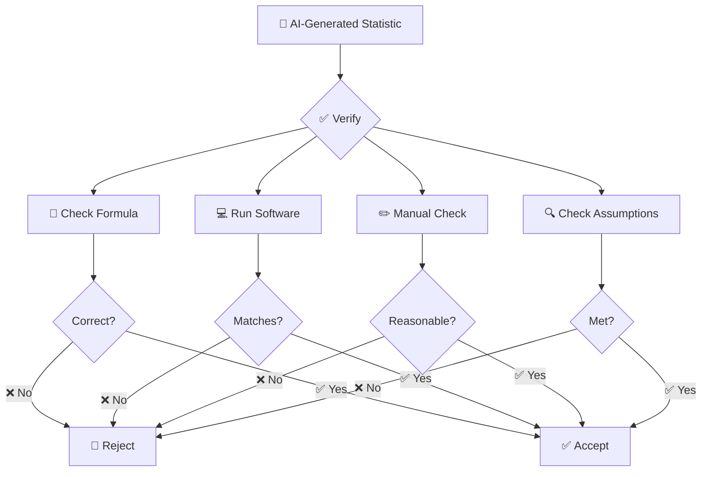

### Red Flags in AI-Generated Statistics

1. **Confidence without context**: "The data are perfectly normal"
2. **No mention of assumptions**: Missing distribution checks
3. **Overly precise values**: "Mean = 45.2345678"
4. **Causal language**: "Shows that X causes Y"
5. **Missing software verification**: No code provided
6. **Ignoring outliers**: Not mentioning extreme values
7. **Wrong measure used**: Mean for ordinal data
8. **No effect size**: Just p-values

### AI Detection Checklist

- [ ] Did AI check distribution shape?
- [ ] Did AI report appropriate measure?
- [ ] Did AI include measure of dispersion?
- [ ] Did AI mention assumptions?
- [ ] Did AI provide code?
- [ ] Did AI interpret results correctly?
- [ ] Did AI avoid causal claims?
- [ ] Did AI handle missing data appropriately?

---

## 📝 Assessment

### Multiple Choice Questions ✅

<details>
<summary>📝 Click to reveal answers</summary>

1. Which measure minimizes the sum of squared deviations?
   - A) Mode
   - B) Mean ✅
   - C) Median
   - D) Geometric mean

2. For a nominal variable like blood type, which measure is valid?
   - A) Mean
   - B) Median
   - C) Mode ✅
   - D) Geometric mean

3. If SD > Mean for a non-negative variable, what should you suspect?
   - A) Normal distribution
   - B) Right-skewed distribution ✅
   - C) Left-skewed distribution
   - D) Symmetric distribution

4. Which measure is most robust to outliers?
   - A) Mean
   - B) Median ✅
   - C) Mode
   - D) Geometric mean

5. The geometric mean is most appropriate for:
   - A) Categorical data
   - B) Growth rates ✅
   - C) Speed problems
   - D) Survey data

6. Which measure of central tendency uses all data points?
   - A) Mean ✅
   - B) Median
   - C) Mode
   - D) All of the above

7. The F1-score in machine learning uses which mean?
   - A) Arithmetic mean
   - B) Geometric mean
   - C) Harmonic mean ✅
   - D) Weighted mean

8. For right-skewed data, which is true?
   - A) Mean < Median < Mode
   - B) Mean > Median > Mode ✅
   - C) Mean = Median = Mode
   - D) None of the above

9. Which measure is appropriate for ordinal data?
   - A) Mean
   - B) Median ✅
   - C) Geometric mean
   - D) Harmonic mean

10. The weighted mean is essential for:
    - A) Normal distributions
    - B) Survey data with complex sampling ✅
    - C) Categorical data
    - D) Growth rates

</details>

### True/False Questions

<details>
<summary>📝 Click to reveal answers</summary>

1. The mean is always the best measure of central tendency. **False**
2. A normal distribution has mean = median = mode. **True**
3. The median is affected by outliers. **False**
4. The mode can be used for categorical data. **True**
5. The geometric mean is always greater than the arithmetic mean. **False**
6. For right-skewed data, mean > median. **True**
7. The weighted mean requires positive weights. **True**
8. The harmonic mean is appropriate for averaging rates. **True**
9. The trimmed mean is more efficient than the median. **True**
10. The mode is always unique. **False**

</details>

### Short Questions ✍️

1. **Explain** why the sample mean minimizes the sum of squared deviations.
2. **What is** the relationship between skewness and the mean/median?
3. **When would you** use the geometric mean instead of the arithmetic mean?
4. **Explain** the difference between weighted and unweighted means.
5. **Why is** the median preferred for household income data?
6. **What does it mean** if SD > Mean for a positive variable?
7. **Describe** the three types of "average" and when to use each.

### Long Questions 📝

1. **Clinical Trial Question:** A clinical trial reports baseline characteristics with means and SDs. The variable "length of hospital stay" has mean = 14.2 and SD = 22.1. Critique this reporting and suggest improvements.

2. **Public Health Question:** A health survey reports average household income as $65,000. The survey data show 25th percentile = $30,000, median = $50,000, 75th percentile = $85,000, and 95th percentile = $250,000. Which measure of central tendency is most appropriate and why?

3. **Research Design Question:** Design a study to compare mean blood pressure between two groups. What assumptions must be met? What alternative measures would you recommend if assumptions are violated?

### Numerical Problems 🧮

<details>
<summary>📝 Click to reveal solutions</summary>

**Problem 1:** Calculate the mean, median, and mode for: [5, 7, 7, 8, 9, 10, 12, 15]

**Solution:**
- Mean = (5+7+7+8+9+10+12+15)/8 = 73/8 = 9.125
- Median = (8+9)/2 = 8.5 (n=8 even)
- Mode = 7 (appears twice)

**Problem 2:** Compute the geometric mean for: [2, 4, 8, 16, 32]

**Solution:**
GM = (2×4×8×16×32)^(1/5) = (32768)^(0.2) = 8.00

**Problem 3:** A survey gives weights: [0.5, 1.0, 0.8, 1.2] for observations [10, 15, 12, 18]. Calculate the weighted mean.

**Solution:**
Weighted Mean = (0.5×10 + 1.0×15 + 0.8×12 + 1.2×18) / (0.5+1.0+0.8+1.2)
= (5 + 15 + 9.6 + 21.6) / 3.5
= 51.2 / 3.5 = 14.63

**Problem 4:** A dataset has mean = 100, median = 80, and mode = 60. What shape is the distribution?

**Solution:** Mean > Median > Mode → Right-skewed (positive skew)

**Problem 5:** Calculate the harmonic mean of [2, 4, 8]

**Solution:**
H = 3 / (1/2 + 1/4 + 1/8) = 3 / (0.5 + 0.25 + 0.125) = 3 / 0.875 = 3.43

</details>

### Programming Exercises 💻

<details>
<summary>📝 Click to reveal exercises</summary>

1. **R Exercise:** Write a function that computes all measures of central tendency from Chapter 2 and returns them in a clean summary table.

2. **Python Exercise:** Create a class `CentralTendency` that implements mean, median, mode, weighted mean, geometric mean, and harmonic mean methods.

3. **SPSS Exercise:** Create a syntax file that computes all measures for five variables of different types.

4. **STATA Exercise:** Write a do-file that computes and compares all measures for a given variable.

5. **SAS Exercise:** Write a macro that computes all measures and identifies the most appropriate one.

6. **Excel Exercise:** Create a template that automatically calculates all measures for any dataset pasted into it.

</details>

### Real Research Exercises 🔬

1. **DHS Data Analysis:** Download DHS data for a country and analyze household wealth indicators. Compare mean vs. median wealth and justify your choice.

2. **Clinical Trial Simulation:** Simulate a clinical trial with baseline characteristics. Report them following CONSORT guidelines with appropriate measures.

3. **Income Inequality Study:** Using Gini coefficient data, compare mean vs. median income across countries and explain the relationship.

4. **Machine Learning Project:** Compare the effect of using mean vs. median imputation on model performance using a dataset with missing values.

5. **Public Health Report:** Analyze a public health dataset (e.g., NHANES) and prepare a report on nutritional indicators using appropriate central tendency measures.

---

## 📚 Chapter Summary

### Key Takeaways 🎯

> 🎯 **Core Concepts to Remember**

1. **Mean**: Best for symmetric, continuous data; uses all data; sensitive to outliers
2. **Median**: Best for skewed data; robust to outliers; works for ordinal data
3. **Mode**: Best for categorical data; only measure for nominal scales
4. **Weighted Mean**: Essential for survey data and meta-analysis
5. **Geometric Mean**: Best for growth rates and multiplicative data
6. **Harmonic Mean**: Best for rates and ratios (e.g., F1-score)
7. **Trimmed Mean**: Compromise between mean and median robustness
8. **Check Distribution First**: Always assess shape before choosing measures
9. **Report Completely**: Always include measure of dispersion
10. **Follow Guidelines**: Use CONSORT/STROBE reporting standards

### Formula Sheet 📐

| Measure | Formula | Best For |
|---------|---------|----------|
| **Arithmetic Mean** | $\bar{x} = \frac{1}{n}\sum x_i$ | Symmetric data |
| **Weighted Mean** | $\bar{x}_w = \frac{\sum w_i x_i}{\sum w_i}$ | Survey data |
| **Geometric Mean** | $G = (\prod x_i)^{1/n}$ | Growth rates |
| **Harmonic Mean** | $H = \frac{n}{\sum 1/x_i}$ | Rates |
| **Median** | Middle value | Skewed data |
| **Mode** | Most frequent | Categorical data |
| **Trimmed Mean** | $\bar{x}_{trim}$ | Outlier-moderate data |

### Decision Table 📊

| Situation | Recommended Measure | Why |
|-----------|-------------------|-----|
| Normal data, no outliers | Mean | Efficient, unbiased |
| Skewed data | Median | Robust, interpretable |
| Categorical data | Mode | Only valid measure |
| Survey data | Weighted Mean | Accounts for design |
| Growth rates | Geometric Mean | Multiplicative property |
| F1-score | Harmonic Mean | Rate property |
| Moderate outliers | Trimmed Mean | Balance robustness/efficiency |
| Ordinal data | Median | Respects order |

### Quick Reference Card 🃏

```text
┌─────────────────────────────────────────────┐
│   QUICK REFERENCE: CENTRAL TENDENCY         │
├─────────────────────────────────────────────┤
│  Mean   = Balance point, sensitive to skew  │
│  Median = Middle position, robust           │
│  Mode   = Most frequent, categorical        │
├─────────────────────────────────────────────┤
│  CHECK FOR:                                 │
│  □ Normality                                │
│  □ Outliers                                 │
│  □ Skewness                                 │
│  □ Data type                                │
├─────────────────────────────────────────────┤
│  REMEMBER:                                  │
│  Mean + SD for normal data                  │
│  Median + IQR for skewed data               │
│  Mode for categorical data                  │
└─────────────────────────────────────────────┘
```

---

## 📖 Further Reading

### Recommended Textbooks 📚

| Book | Author(s) | Chapter |
|------|-----------|---------|
| *Statistical Methods* | Cochran & Snedecor | Chapter 3 |
| *Data Analysis Using Regression* | Gelman & Hill | Chapter 4 |
| *Introduction to Modern Statistics* | Cetinkaya-Rundel | Chapter 2 |
| *Modern Statistics for Behavioral Sciences* | Wilcox | Chapter 2 |
| *Statistical Inference* | Casella & Berger | Chapter 3 |
| *The Elements of Statistical Learning* | Hastie et al. | Chapter 2 |

### Key Papers 📄

1. Bland, J.M. & Altman, D.G. (1996). *The use of transformation when comparing two means*. BMJ.
2. Altman, D.G. & Bland, J.M. (2005). *Standard deviations and standard errors*. BMJ.
3. Land, K.C. (1978). *The mean and the median in epidemiology and public health*. Epidemiologic Reviews.
4. O'Brien, P.C. & Dyck, P.J. (1995). *The use of the mean in clinical research*. Neurology.
5. Streiner, D.L. (2000). *The mean and the median*. Canadian Journal of Psychiatry.

### Online Resources 🌐

- [Khan Academy: Measures of Central Tendency](https://www.khanacademy.org)
- [StatQuest: Mean vs. Median](https://www.youtube.com/c/statquest)
- [R for Data Science: Chapter 5](https://r4ds.had.co.nz)
- [Python Data Science Handbook](https://jakevdp.github.io/PythonDataScienceHandbook/)
- [Penn State STAT 500](https://online.stat.psu.edu/stat500/)

---

## 📑 References

1. Bland, J.M. & Altman, D.G. (1996). The use of transformation when comparing two means. *BMJ*, 312(7039), 1153.
2. Altman, D.G. & Bland, J.M. (2005). Standard deviations and standard errors. *BMJ*, 331(7521), 903.
3. Wilcox, R.R. (2012). *Introduction to Robust Estimation and Hypothesis Testing*. Academic Press.
4. Weisberg, H.F. (1992). *Central Tendency and Variability*. Sage Publications.
5. Land, K.C. (1978). The mean and the median in epidemiology and public health. *Epidemiologic Reviews*, 1(1), 129-148.
6. CONSORT Group (2010). CONSORT 2010 Statement. *BMJ*, 340, c332.
7. Vandenbroucke, J.P. et al. (2007). Strengthening the Reporting of Observational Studies in Epidemiology (STROBE). *Annals of Internal Medicine*, 147(8), 573-577.
8. O'Brien, P.C. & Dyck, P.J. (1995). The use of the mean in clinical research. *Neurology*, 45(5), 898-902.
9. Streiner, D.L. (2000). The mean and the median. *Canadian Journal of Psychiatry*, 45(10), 905-906.
10. Tukey, J.W. (1977). *Exploratory Data Analysis*. Addison-Wesley.

---

## 🏠 Navigation

<div align="center">

**[⬅ Previous: Chapter 1 - Descriptive Statistics](./01-descriptive-statistics.md)**

**[🏠 Back to Repository](../README.md)**

**[➡ Next: Chapter 3 - Measures of Dispersion](./03-dispersion.md)**

</div>

---

## 📝 Bengali Summary (বাংলা সারাংশ)

### পর্ব ২: কেন্দ্রীয় প্রবণতার পরিমাপ

> *"গড়" সবচেয়ে বেশি উদ্ধৃত — এবং সবচেয়ে বেশি অপব্যবহৃত — বৈজ্ঞানিক যোগাযোগের শব্দ। কোন গড়, কীভাবে গণনা করা হয়েছে, তা নির্ধারণ করে একটি দাবি সত্য নাকি বিভ্রান্তিকর।*

**মূল ধারণা:**

কেন্দ্রীয় প্রবণতা এই প্রশ্নের উত্তর দেয়: **"যদি আমি এই ডেটাসেটকে একটি সংখ্যা দিয়ে বর্ণনা করতে চাই, তা কী হবে?"** তিনটি ধ্রুপদী উত্তর — গড়, মধ্যমা, এবং প্রচুরক — প্রতিটি ভিন্ন মানদণ্ড অপটিমাইজ করে।

**তিনটি প্রধান পরিমাপ:**

| পরিমাপ | বর্ণনা | কখন ব্যবহার করবেন |
|--------|---------|------------------|
| **গড় (Mean)** | সকল মানের সমষ্টি / মোট সংখ্যা | সমমিত, নিরবচ্ছিন্ন ডেটা |
| **মধ্যমা (Median)** | মাঝের মান | তির্যক ডেটা, আউটলায়ার থাকলে |
| **প্রচুরক (Mode)** | সবচেয়ে বেশি ঘটা মান | বিভাগীয় ডেটা |

**মূল শিক্ষা:**

- 📌 তির্যকতা পরীক্ষা না করে কখনও গড় ব্যবহার করবেন না
- 📌 SD > Mean হলে ডেটা ডান-তির্যক হওয়ার সতর্কতা
- 📌 ডেটার প্রকৃতি বণ্টন অনুযায়ী পরিমাপ নির্বাচন করুন

**অন্যান্য গুরুত্বপূর্ণ পরিমাপ:**

- **ভারিত গড় (Weighted Mean)**: জরিপ ডেটার জন্য
- **জ্যামিতিক গড় (Geometric Mean)**: বৃদ্ধির হারের জন্য
- **হারমনিক গড় (Harmonic Mean)**: গতির হারের জন্য
- **ছাঁটা গড় (Trimmed Mean)**: আউটলায়ার মাঝারি থাকলে

---

<div align="center">

*Chapter 2: Measures of Central Tendency*

*Statistics for Scientists — An Open-Access Textbook*

[](https://github.com/your-repo)
[](LICENSE)

</div>
