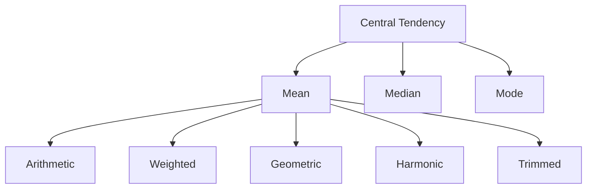
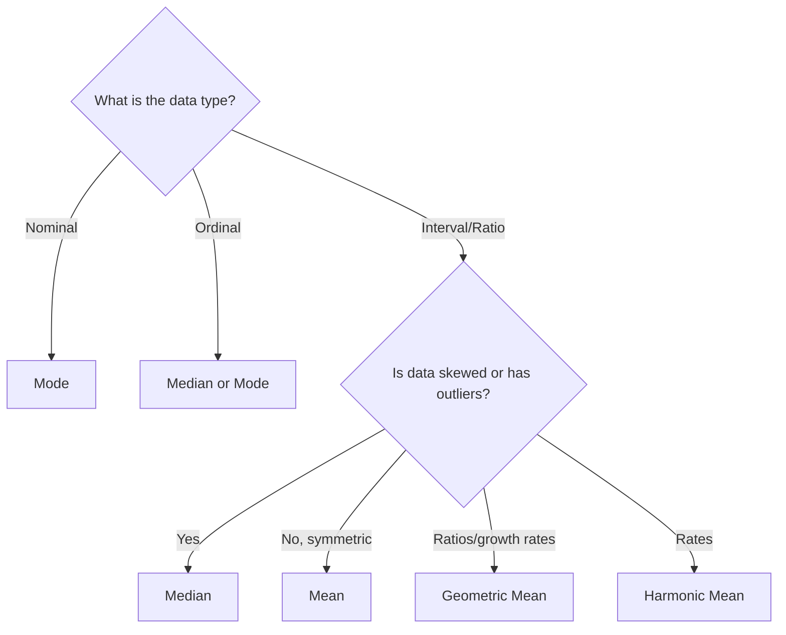

# Chapter 2: Measures of Central Tendency

[⬅ Previous: Descriptive Statistics](./01-descriptive-statistics.md) | [🏠 Home](../README.md) | [➡ Next: Dispersion](./03-dispersion.md)

---

## Learning Objectives

- [ ] Compute mean, median, and mode by hand and in software
- [ ] Understand the mathematical properties of the mean (least-squares property)
- [ ] Choose the appropriate measure of central tendency given data shape
- [ ] Compute weighted mean, trimmed mean, and geometric mean
- [ ] Understand how outliers and skew affect each measure
- [ ] Critically interpret "average" claims in scientific and media reporting

## Prerequisites

- Chapter 1 (Descriptive Statistics)
- Summation notation

## Estimated Study Time

⏱️ 2–3 hours

---

## Why This Topic Matters

> [!TIP]
> "On average" is the most quoted — and most misused — phrase in scientific communication. Which average, computed how, determines whether a claim is honest or misleading.

## Big Picture



## Core Intuition

Central tendency answers: **"If I had to describe this dataset with one number, what would it be?"** The three classical answers — mean, median, mode — each optimize a different criterion.

## Mathematical Foundation

### Arithmetic Mean

$$\bar{x} = \frac{1}{n}\sum_{i=1}^{n} x_i$$

**Least-squares property**: the mean is the value $c$ that minimizes $\sum_{i=1}^n (x_i - c)^2$. This is proved by differentiating with respect to $c$ and setting to zero:

$$\frac{d}{dc}\sum (x_i - c)^2 = -2\sum(x_i - c) = 0 \implies \sum x_i = nc \implies c = \bar{x}$$

### Median

The middle value when data are ordered. For $n$ observations:

$$\text{Median} = \begin{cases} x_{\left(\frac{n+1}{2}\right)} & n \text{ odd} \\[4pt] \frac{1}{2}\left(x_{(n/2)} + x_{(n/2 + 1)}\right) & n \text{ even} \end{cases}$$

**Least-absolute-deviations property**: the median minimizes $\sum_{i=1}^n |x_i - c|$.

### Mode

The most frequently occurring value. The only measure valid for nominal data. A distribution can be unimodal, bimodal, or multimodal.

### Weighted Mean

$$\bar{x}_w = \frac{\sum_{i=1}^n w_i x_i}{\sum_{i=1}^n w_i}$$

Used extensively in survey statistics (Chapter 16) where each observation carries a sampling weight.

### Geometric Mean

$$GM = \left(\prod_{i=1}^n x_i\right)^{1/n}$$

Used for growth rates, ratios, and log-normally distributed data (e.g., viral load, antibody titers in immunology).

### Harmonic Mean

$$HM = \frac{n}{\sum_{i=1}^n \frac{1}{x_i}}$$

Used for rates (e.g., average speed, F1-score in machine learning — Chapter 24).

## Choosing the Right Measure



| Measure | Sensitive to Outliers? | Uses All Data? | Valid Scale |
|---|---|---|---|
| Mean | Yes (highly) | Yes | Interval, Ratio |
| Median | No (robust) | No (only order) | Ordinal, Interval, Ratio |
| Mode | No | No | Nominal, Ordinal, Interval, Ratio |
| Geometric Mean | Yes | Yes | Ratio (positive values only) |

## Worked Example

Continuing the systolic BP dataset from Chapter 1:

`118, 119, 121, 122, 125, 128, 130, 138, 145, 150` (n = 10, sorted)

**Mean**:
$$\bar{x} = \frac{118+119+121+122+125+128+130+138+145+150}{10} = \frac{1296}{10} = 129.6 \text{ mmHg}$$

**Median** (n = 10, even):
$$\text{Median} = \frac{125 + 128}{2} = 126.5 \text{ mmHg}$$

**Mode**: No value repeats → this dataset has **no mode**.

**Effect of an outlier**: Suppose the last patient's BP was mistakenly entered as 250 instead of 150.
- New mean = 141.6 mmHg (jumps by 12 points)
- New median = 126.5 mmHg (**unchanged** — median is robust)

This single example is the clearest demonstration of why medians are preferred for skewed clinical data such as length of hospital stay, cost data, or viral load.

## Software Implementation

### R

```r
bp <- c(118, 122, 130, 145, 119, 125, 138, 128, 121, 150)

mean(bp)
median(bp)

# Mode (R has no built-in mode function)
get_mode <- function(v) {
  uniq_v <- unique(v)
  uniq_v[which.max(tabulate(match(v, uniq_v)))]
}
get_mode(bp)

# Trimmed mean (removes top/bottom 10%)
mean(bp, trim = 0.1)

# Weighted mean
w <- c(1,1,2,1,1,1,1,1,1,3)
weighted.mean(bp, w)

# Geometric mean
exp(mean(log(bp)))
```

### Python

```python
import numpy as np
from scipy import stats

bp = np.array([118, 122, 130, 145, 119, 125, 138, 128, 121, 150])

print("Mean:", np.mean(bp))
print("Median:", np.median(bp))
print("Mode:", stats.mode(bp, keepdims=True))
print("Trimmed mean:", stats.trim_mean(bp, 0.1))
print("Geometric mean:", stats.gmean(bp))
print("Harmonic mean:", stats.hmean(bp))

weights = np.array([1,1,2,1,1,1,1,1,1,3])
print("Weighted mean:", np.average(bp, weights=weights))
```

### SPSS

```spss
DESCRIPTIVES VARIABLES=bp
  /STATISTICS=MEAN MEDIAN.

FREQUENCIES VARIABLES=bp
  /STATISTICS=MODE.
```

### STATA

```stata
summarize bp, detail
* Displays mean, median (p50), and percentiles

* Mode
tabulate bp, sort
```

### SAS

```sas
PROC MEANS DATA=work.patients MEAN MEDIAN MODE;
    VAR bp;
RUN;
```

## Real Research Example — Public Health

In income and cost-effectiveness research, the **geometric mean** is standard because healthcare costs and income data are typically log-normally distributed. Reporting an arithmetic mean of household income without noting the underlying skew is a frequent target of reviewer criticism in health economics journals.

## Common Mistakes

| Mistake | Consequence |
|---|---|
| Reporting mean for heavily skewed data (income, cost, length of stay) | Misrepresents "typical" value |
| Computing mode for continuous data without binning | Often meaningless (every value unique) |
| Ignoring weights in survey data means | Biased population estimate |
| Confusing "average" with "mean" in lay communication | Ambiguity — always specify which measure |

## Reviewer Perspective

> [!NOTE]
> **Typical Reviewer Comment**: *"The authors report the mean number of ICU days (mean = 14.2, SD = 22.1). Given SD > mean, this variable is almost certainly right-skewed. Please report median (IQR) instead."*

A useful reviewer heuristic: **if SD > mean for a non-negative variable, the distribution is very likely skewed**, and the mean is a poor summary.

## AI Evaluation Perspective

Automated statistical review tools flag exactly this SD > mean pattern, along with mismatches between the stated central tendency measure and accompanying spread measure (e.g., mean reported with IQR instead of SD, or vice versa).

## Frequently Asked Questions

**Q: Why does the median "ignore" extreme values?**
A: Because it only depends on the *rank* of the middle observation(s), not their magnitude.

**Q: When would I use geometric mean over arithmetic mean?**
A: When your data are ratios, growth rates, or multiplicative in nature (e.g., percentage changes, dilution titers).

## Practice Problems

### MCQs
1. Which measure minimizes the sum of squared deviations? (a) Mode (b) **Mean** (c) Median (d) Geometric mean
2. For a nominal variable like blood type, which central tendency measure is valid? (a) Mean (b) Median (c) **Mode** (d) Geometric mean

### Short Questions
1. Explain why SD > mean is a red flag for a non-negative variable.
2. Compute the mean and median of: 5, 7, 7, 9, 100.

### Programming Exercise
Simulate 1,000 draws from a log-normal distribution in R or Python. Compare the arithmetic mean, geometric mean, and median. Which is closest to the "typical" value visually seen in a histogram?

## Chapter Summary

- Mean minimizes squared deviations; median minimizes absolute deviations; mode is the most frequent value.
- Median is robust to outliers and skew; mean is not.
- Specialized means (weighted, geometric, harmonic) serve specific data structures (survey weights, ratios, rates).

## Key Takeaways

- 📌 Always inspect skew before choosing mean vs. median.
- 📌 SD > mean on a non-negative variable is a skewness warning sign.
- 📌 Report the measure that matches the data's actual distributional behavior, not the one that is easiest to compute.

## Recommended Papers

- Bland, J.M. & Altman, D.G. (1996). "The use of transformation when comparing two means." *BMJ*.

## Further Reading

- Wilcox, R.R. (2012). *Introduction to Robust Estimation and Hypothesis Testing*.

## References

1. Weisberg, H.F. (1992). *Central Tendency and Variability*. Sage Publications.

---

## Previous Chapter
[⬅ Chapter 1: Descriptive Statistics](./01-descriptive-statistics.md)

## Next Chapter
[➡ Chapter 3: Dispersion](./03-dispersion.md)
