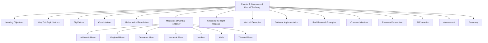
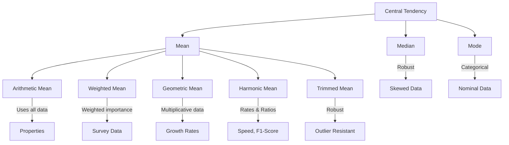
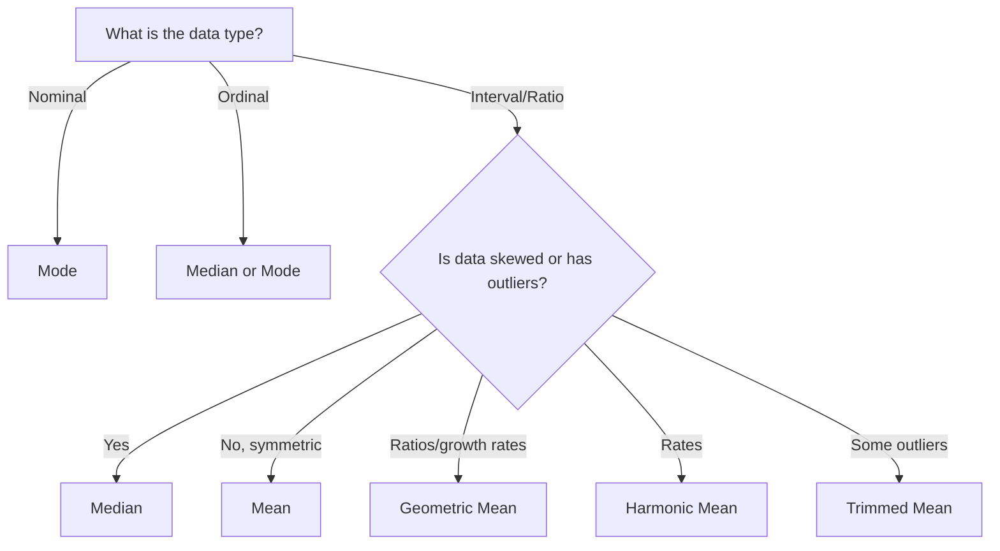
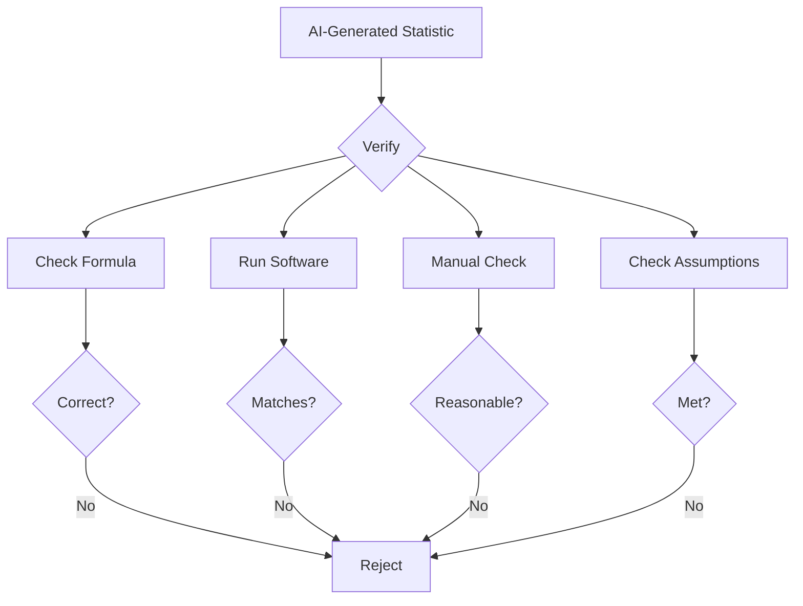

# 📊 Chapter 2: Measures of Central Tendency

### *Mean, Median, Mode, and Beyond — The Art and Science of Finding the "Middle"*

<div align="center">

[]()
[]()
[]()
[]()

**[⬅ Previous: Chapter 1 - Descriptive Statistics](./01-descriptive-statistics.md) · [🏠 Home](../README.md) · [➡ Next: Chapter 3 - Measures of Dispersion](./03-dispersion.md)**

</div>

---

> *"The average is a single number that attempts to describe the entire set of data — a profound act of compression."* — **Author Unknown**

---

## 📋 Table of Contents



---

## 🎯 Learning Objectives

| Level | Objectives |
|-------|------------|
| **Foundational** | ✅ Compute mean, median, and mode by hand and in software |
| | ✅ Understand when each measure is appropriate |
| | ✅ Interpret "average" claims in scientific literature |
| **Intermediate** | ✅ Calculate weighted, geometric, and harmonic means |
| | ✅ Understand the mathematical properties of the mean |
| | ✅ Choose appropriate measures given data shape |
| **Advanced** | ✅ Critically evaluate "average" claims in research |
| | ✅ Detect and correct misuse of central tendency |
| | ✅ Explain trade-offs between measures |

---

## 🧭 Prerequisites

**Required Knowledge:**
- Chapter 1: Descriptive Statistics
- Summation notation (Σ)
- Basic algebra

**Estimated Study Time:** ⏱️ 2.5 – 4 hours

---

## 💡 Why This Topic Matters

> [!TIP]
> *"On average" is the most quoted — and most misused — phrase in scientific communication. Which average, computed how, determines whether a claim is honest or misleading.*

### Real-World Impact

| Field | Why Central Tendency Matters |
|-------|-----------------------------|
| 🏥 **Medicine** | Determining "normal" blood pressure, average survival time |
| 💰 **Economics** | Average income, GDP per capita, inflation rates |
| 🧪 **Clinical Trials** | Baseline characteristics, treatment effects |
| 📊 **Public Health** | Average life expectancy, disease incidence |
| 🤖 **Machine Learning** | Feature scaling, imputation, baseline models |
| 🏭 **Quality Control** | Average product dimensions, process monitoring |

---

## 🌍 Big Picture



### The Central Tendency Spectrum

```mermaid
graph LR
    Robust[Robust<br>Median] --> Balanced[Balanced<br>Mean] --> Sensitive[Very Sensitive<br>Mean]
    Style Robust fill:#2ecc71,color:#fff
    Style Balanced fill:#f39c12,color:#fff
    Style Sensitive fill:#e74c3c,color:#fff
```

---

## 🧠 Core Intuition

### The Three Perspectives

Central tendency answers: **"If I had to describe this dataset with one number, what would it be?"** The three classical answers — mean, median, mode — each optimize a different criterion:

```mermaid
graph TD
    A[Which "Middle" Should You Choose?] --> B[Mean]
    A --> C[Median]
    A --> D[Mode]
    
    B --> B1[Minimizes<br>Sum of Squares]
    C --> C1[Minimizes<br>Sum of Absolute Deviations]
    D --> D1[Maximizes<br>Frequency]
    
    B1 --> I1[Balance Point]
    C1 --> I2[Middle Point]
    D1 --> I3[Typical Category]
```

### The "Restaurant Analogy"

Imagine you're reviewing a restaurant:

| Statistic | Restaurant Example | Statistical Equivalent |
|-----------|-------------------|----------------------|
| Most common dish ordered | **Mode** | Most frequent value |
| Middle-priced dish | **Median** | Middle value |
| Average price of all dishes | **Mean** | Arithmetic average |
| Price that accounts for portions | **Weighted Mean** | Weighted average |
| Average price increase over years | **Geometric Mean** | Multiplicative growth |

---

## 📐 Mathematical Foundation

### Key Definitions

#### Arithmetic Mean

> 📖 **Definition**: The arithmetic mean is the sum of all observations divided by the number of observations.

$$\bar{x} = \frac{1}{n}\sum_{i=1}^{n} x_i$$

**Population Mean:**
$$\mu = \frac{1}{N}\sum_{i=1}^{N} x_i$$

**Sample Mean:**
$$\bar{x} = \frac{1}{n}\sum_{i=1}^{n} x_i$$

#### Properties of the Mean

> 📊 **The Five Key Properties**

1. **Least-Squares Property**: The mean minimizes the sum of squared deviations
   $$\sum_{i=1}^n (x_i - c)^2 \text{ is minimized when } c = \bar{x}$$

2. **Linearity**: For transformed variables \(y_i = ax_i + b\)
   $$\bar{y} = a\bar{x} + b$$

3. **Unbiasedness**: The expected value equals the population mean
   $$E[\bar{x}] = \mu$$

4. **Sum of Deviations**: The sum of deviations from the mean is zero
   $$\sum_{i=1}^n (x_i - \bar{x}) = 0$$

5. **Efficiency**: Among all unbiased estimators, the mean has the lowest variance

#### Derivation of the Mean

**The Optimization Problem:**

Find \(c\) that minimizes \(S(c) = \sum_{i=1}^n (x_i - c)^2\)

**Step 1:** Take the derivative with respect to c
$$\frac{dS}{dc} = -2\sum_{i=1}^n (x_i - c)$$

**Step 2:** Set derivative to zero
$$-2\sum_{i=1}^n (x_i - c) = 0$$

**Step 3:** Solve for c
$$\sum_{i=1}^n (x_i - c) = 0$$
$$\sum_{i=1}^n x_i - nc = 0$$
$$nc = \sum_{i=1}^n x_i$$
$$c = \frac{1}{n}\sum_{i=1}^n x_i = \bar{x}$$

**Step 4:** Verify it's a minimum (second derivative is positive)
$$\frac{d^2S}{dc^2} = 2n > 0$$

#### The Median as an Optimization

The median minimizes the sum of absolute deviations:

$$\sum_{i=1}^n |x_i - c| \text{ is minimized when } c \text{ is the median}$$

**Proof Intuition:** The derivative of \(|x_i - c|\) is:
- \(-1\) when \(x_i > c\)
- \(+1\) when \(x_i < c\)
- Undefined at \(x_i = c\)

The minimum occurs when there are equal numbers of observations on both sides.

---

## 📊 Measures of Central Tendency

### 1. Arithmetic Mean

#### Full Derivation

**The Least-Squares Derivation:**

We want to find the value \(c\) that minimizes:

$$S(c) = \sum_{i=1}^n (x_i - c)^2$$

**Proof:**
1. Expand \(S(c)\):
   $$S(c) = \sum_{i=1}^n x_i^2 - 2c\sum_{i=1}^n x_i + nc^2$$

2. Differentiate:
   $$\frac{dS}{dc} = -2\sum_{i=1}^n x_i + 2nc$$

3. Set to zero:
   $$-2\sum_{i=1}^n x_i + 2nc = 0$$
   $$nc = \sum_{i=1}^n x_i$$
   $$c = \frac{1}{n}\sum_{i=1}^n x_i = \bar{x}$$

#### Properties in Detail

| Property | Mathematical Statement | Implication |
|----------|----------------------|-------------|
| **Linearity** | \(\overline{ax + b} = a\bar{x} + b\) | Scale transformations are predictable |
| **Unbiasedness** | \(E[\bar{x}] = \mu\) | No systematic error |
| **Efficiency** | \(\text{Var}(\bar{x}) = \sigma^2/n\) | Variance decreases with n |
| **Consistency** | \(\bar{x} \xrightarrow{p} \mu\) | Converges to true mean |
| **Additivity** | \(\overline{x + y} = \bar{x} + \bar{y}\) | Separable |

#### Advantages and Disadvantages

| Advantages | Disadvantages |
|------------|---------------|
| ✓ Uses all available data | ✗ Highly sensitive to outliers |
| ✓ Mathematically tractable | ✗ Not robust to skewness |
| ✓ Has excellent statistical properties | ✗ May not represent "typical" value |
| ✓ Unbiased estimator | ✗ Only valid for quantitative data |
| ✓ Basis for many statistical methods | ✗ Requires interval/ratio scale |

#### Interpretation Guide

> 💡 **Key Insight**: The mean is the **balance point** of the data, where the sum of positive and negative deviations exactly cancel.

**Contextual Interpretations:**

| Context | Interpretation |
|---------|----------------|
| **Normal distribution** | The typical or average value |
| **Symmetric distribution** | Central tendency |
| **Skewed distribution** | Might be misleading as "typical" |
| **Medical research** | Average effect or baseline characteristic |
| **Public health** | Population average indicator |

---

### 2. Weighted Mean

#### Mathematical Definition

$$\bar{x}_w = \frac{\sum_{i=1}^n w_i x_i}{\sum_{i=1}^n w_i}$$

#### Derivation

**The Optimization Problem:**

Minimize the weighted sum of squared deviations:

$$S_w(c) = \sum_{i=1}^n w_i (x_i - c)^2$$

**Step 1:** Differentiate with respect to c
$$\frac{dS_w}{dc} = -2\sum_{i=1}^n w_i(x_i - c)$$

**Step 2:** Set to zero
$$\sum_{i=1}^n w_i x_i - c\sum_{i=1}^n w_i = 0$$

**Step 3:** Solve for c
$$c = \frac{\sum_{i=1}^n w_i x_i}{\sum_{i=1}^n w_i} = \bar{x}_w$$

#### Common Weight Types

| Weight Type | Example | Use Case |
|-------------|---------|----------|
| **Frequency** | Number of observations in each group | Aggregating grouped data |
| **Inverse Variance** | \(1/s_i^2\) | Meta-analysis, combining estimates |
| **Survey Design** | Sampling weights | Complex survey data (DHS, NHANES) |
| **Distance Weighting** | Inverse distance | Spatial statistics |
| **Importance Weighting** | Expert assigned weights | Composite indices |

#### Applications

**1. Survey Research**
- Adjusting for oversampling or undersampling
- Population weighting in DHS surveys
- Post-stratification adjustments

**2. Meta-Analysis**
- Combining study results
- Weighting by precision (inverse variance)
- Random effects vs. fixed effects

**3. Composite Indices**
- Human Development Index (HDI)
- Health quality metrics
- Multi-dimensional poverty index

#### Real Example: Weighted Mean in DHS Surveys

```text
DHS Surveys use sampling weights (v005) to adjust for:
- Unequal probability of selection
- Non-response
- Post-stratification

Weighted Mean Formula:
\bar{x}_w = \frac{\sum_{i=1}^n w_i x_i}{\sum_{i=1}^n w_i}

Where w_i = sampling weight / 1,000,000
```

---

### 3. Geometric Mean

#### Mathematical Definition

$$G = \left(\prod_{i=1}^n x_i\right)^{1/n}$$

**Logarithmic Form:**
$$G = \exp\left(\frac{1}{n}\sum_{i=1}^n \ln x_i\right)$$

#### Derivation

**Step 1:** Take the natural log of both sides
$$\ln G = \ln\left[\left(\prod_{i=1}^n x_i\right)^{1/n}\right]$$

**Step 2:** Use log rules
$$\ln G = \frac{1}{n}\sum_{i=1}^n \ln x_i$$

**Step 3:** This is the arithmetic mean of the logged values

**Step 4:** Exponentiate to get G
$$G = \exp\left(\frac{1}{n}\sum_{i=1}^n \ln x_i\right)$$

#### Properties

> 📊 **Key Properties**

1. **Multiplicative**: \(G\) is the value that, if multiplied n times, gives the product of all values
2. **Scale-Invariant**: \(G(aX) = a \cdot G(X)\) for \(a > 0\)
3. **Log-Normal**: For log-normal data, G is the median
4. **Relationship**: For positive values, \(H \leq G \leq A\)

#### Advantages and Disadvantages

| Advantages | Disadvantages |
|------------|---------------|
| ✓ Appropriate for multiplicative data | ✗ Requires positive values |
| ✓ Handles ratios and growth rates well | ✗ Less intuitive interpretation |
| ✓ Less affected by large values | ✗ Not defined for negative values |
| ✓ Natural for log-normal data | ✗ Can be 0 if any value is 0 |

#### Applications

**Medical Example: Antibody Titers**

```text
Study: Vaccine response in immunology
Data: Antibody titers (dilution factors)
- Patient 1: 1:40
- Patient 2: 1:80
- Patient 3: 1:160
- Patient 4: 1:320
- Patient 5: 1:640

Geometric Mean = (40 × 80 × 160 × 320 × 640)^(1/5)
                 = (1.048 × 10^10)^(0.2)
                 ≈ 160

Interpretation: The typical antibody titer is about 1:160
```

**Public Health Example: Environmental Exposure**

```text
Study: Air pollution exposure in urban areas
Data: PM2.5 concentrations (μg/m³)
- 15, 22, 18, 45, 12, 25, 30, 19, 23, 17

Geometric Mean = exp(mean(log(data)))
               = exp(mean(2.71, 3.09, 2.89, 3.81, 2.48, 
                         3.22, 3.40, 2.94, 3.14, 2.83))
               = exp(3.05)
               ≈ 21.1 μg/m³

Interpretation: The geometric mean better represents central 
exposure in log-normal distributions
```

**Machine Learning Example: Feature Engineering**

```python
# Log transformation for multiplicative features
import numpy as np

# Price data (multiplicative process)
prices = np.array([15, 22, 18, 45, 12, 25, 30, 19, 23, 17])

# Geometric mean
gm = np.exp(np.mean(np.log(prices)))
print(f"Geometric mean: {gm:.2f}")

# Use for feature scaling in ML
log_prices = np.log(prices)  # Log transformation
```

---

### 4. Harmonic Mean

#### Mathematical Definition

$$H = \frac{n}{\sum_{i=1}^n \frac{1}{x_i}}$$

#### Derivation

**Step 1:** Take the reciprocal of the arithmetic mean of reciprocals
$$\frac{1}{H} = \frac{1}{n}\sum_{i=1}^n \frac{1}{x_i}$$

**Step 2:** Solve for H
$$H = \frac{n}{\sum_{i=1}^n \frac{1}{x_i}}$$

#### Properties

> 📊 **Key Properties**

1. **Rate Averaging**: Appropriate for rates and ratios
2. **Small Value Influence**: Less influenced by large values, more by small values
3. **Relationship**: For positive values, \(H \leq G \leq A\)
4. **Equality**: \(H = G = A\) only when all values are equal

#### Applications

**1. Average Speed**

```text
Problem: Traveling 100 miles at 50 mph, then 100 miles at 60 mph

Harmonic Mean Speed = 2 / (1/50 + 1/60)
                    = 2 / (0.02 + 0.01667)
                    = 2 / 0.03667
                    ≈ 54.55 mph

Arithmetic Mean Speed = (50 + 60) / 2 = 55 mph
```

**2. Machine Learning: F1-Score**

$$F1 = \frac{2 \cdot \text{Precision} \cdot \text{Recall}}{\text{Precision} + \text{Recall}}$$

This is the harmonic mean of precision and recall.

---

### 5. Median

#### Mathematical Definition

For ordered data \(x_{(1)} \leq x_{(2)} \leq ... \leq x_{(n)}\):

$$\text{Median} = 
\begin{cases}
x_{(n+1)/2} & \text{if n is odd} \\
\frac{x_{n/2} + x_{n/2+1}}{2} & \text{if n is even}
\end{cases}$$

#### Derivation as Optimization

The median minimizes the sum of absolute deviations:

$$m = \arg\min_c \sum_{i=1}^n |x_i - c|$$

**Proof:**
1. Let \(F(c) = \sum_{i=1}^n |x_i - c|\)
2. The derivative \(F'(c) = \#\{x_i > c\} - \#\{x_i < c\}\)
3. Set \(F'(c) = 0\): equal numbers on both sides
4. This gives the median

#### Properties

> 📊 **Key Properties**

1. **Robustness**: Resistant to outliers (breakdown point = 50%)
2. **Invariance**: Median(\(aX + b\)) = \(a \cdot \text{Median}(X) + b\)
3. **Order**: Depends only on relative order, not magnitude
4. **Breakdown Point**: 50% of data can be corrupted without changing the median

#### Advantages and Disadvantages

| Advantages | Disadvantages |
|------------|---------------|
| ✓ Robust to outliers | ✗ Less efficient than mean |
| ✓ Appropriate for ordinal data | ✗ Loses magnitude information |
| ✓ Works with skewed distributions | ✗ Higher sampling variation |
| ✓ Always exists | ✗ More complex for large datasets |
| ✓ Easy to understand | ✗ Not algebraically tractable |

#### Interpretation Guide

> 💡 **Key Insight**: The median represents the **middle position** where 50% of observations fall on each side.

**Contextual Interpretations:**

| Context | Interpretation |
|---------|----------------|
| **Income data** | "Typical" person's income |
| **Survival analysis** | Median survival time |
| **Clinical research** | Median hospital stay |
| **Public health** | Median household income |

---

### 6. Mode

#### Mathematical Definition

$$\text{Mode} = \arg\max_x f(x)$$

Where \(f(x)\) is the frequency of value \(x\).

#### Properties

> 📊 **Key Properties**

1. **Uniqueness**: May be non-unique (multimodal)
2. **Stability**: Stable for categorical data
3. **Applicability**: Works for all data types
4. **Existence**: May not exist if no value repeats

#### Advantages and Disadvantages

| Advantages | Disadvantages |
|------------|---------------|
| ✓ Works for all data types | ✗ May be non-unique |
| ✓ Easy to understand | ✗ Not stable for small samples |
| ✓ Represents typical category | ✗ Loses magnitude information |
| ✓ No arithmetic needed | ✗ May be meaningless for continuous data |

#### Applications

**Medical Example: Blood Type**
```text
Most common blood type: O positive
```

**Public Health Example: Disease Outbreak**
```text
Most common age group: 25-34 years
```

**Machine Learning Example: Imputation**
```python
# Mode imputation for categorical missing values
from sklearn.impute import SimpleImputer
imputer = SimpleImputer(strategy='most_frequent')
```

---

### 7. Trimmed Mean

#### Mathematical Definition

For a 100α% trimmed mean:

$$\bar{x}_{\text{trim}} = \frac{1}{n(1-2\alpha)}\sum_{i=\alpha n+1}^{n(1-\alpha)} x_{(i)}$$

#### Properties

> 📊 **Key Properties**

1. **Robustness**: Less sensitive to outliers than the mean
2. **Efficiency**: More efficient than the median
3. **Trade-off**: Balances efficiency and robustness
4. **Breakdown Point**: α (the trimming proportion)

#### Advantages and Disadvantages

| Advantages | Disadvantages |
|------------|---------------|
| ✓ More robust than mean | ✗ Less efficient than mean |
| ✓ More efficient than median | ✗ Requires choosing trimming proportion |
| ✓ Still uses most data | ✗ Not intuitive for some |
| ✓ Good for moderate outliers | ✗ Loses some information |

#### Applications

**Sports Scoring**
```text
Olympic diving scores:
- Judges: 9.5, 9.4, 9.6, 9.7, 4.5 (outlier!)
- 20% trimmed mean: Remove highest and lowest
- Result: (9.4 + 9.5 + 9.6) / 3 = 9.5
```

**Medical Example: Toxicological Studies**
```text
Study: Chemical exposure in occupational health
Data: Daily exposure levels with some extreme values
- 20% trimmed mean provides robust exposure estimate
```

---

## 📊 Choosing the Right Measure

### Decision Framework



### Comparison Table

| Measure | Sensitive to Outliers? | Uses All Data? | Valid Scale | Interpretation |
|---------|----------------------|----------------|-------------|----------------|
| **Mean** | Yes (highly) | Yes | Interval, Ratio | Balance point |
| **Weighted Mean** | Yes | Yes | Interval, Ratio | Weighted balance |
| **Geometric Mean** | Yes (for large) | Yes | Ratio (positive) | Multiplicative center |
| **Harmonic Mean** | Yes (for small) | Yes | Ratio (positive) | Rate center |
| **Median** | No (robust) | No (only order) | Ordinal, Interval, Ratio | Middle position |
| **Mode** | No | No | All types | Most frequent |
| **Trimmed Mean** | Moderately | Mostly | Interval, Ratio | Robust center |

### When to Use What

| Situation | Best Choice |
|-----------|-------------|
| Symmetric, no outliers | Mean |
| Skewed data | Median |
| Categorical data | Mode |
| Survey data | Weighted Mean |
| Growth rates | Geometric Mean |
| Rates (speed, F1) | Harmonic Mean |
| Some outliers | Trimmed Mean |
| Ordinal data | Median |

---

## ✏️ Worked Examples

### Example 1: Clinical Trial Baseline Data

**Dataset:** Blood pressure (mmHg) from a clinical trial

`118, 119, 121, 122, 125, 128, 130, 138, 145, 150`

**Step 1:** Sort data (already sorted)

**Step 2:** Calculate the Mean
$$\bar{x} = \frac{118+119+121+122+125+128+130+138+145+150}{10}$$
$$\bar{x} = \frac{1296}{10} = 129.6 \text{ mmHg}$$

**Step 3:** Calculate the Median (n = 10, even)
$$\text{Median} = \frac{125 + 128}{2} = 126.5 \text{ mmHg}$$

**Step 4:** Calculate the Mode
No value repeats → **no mode**

**Step 5:** Calculate Trimmed Mean (10% trim)
Remove 1 smallest and 1 largest:
$$\bar{x}_{\text{trim}} = \frac{119+121+122+125+128+130+138+145}{8}$$
$$\bar{x}_{\text{trim}} = \frac{1028}{8} = 128.5 \text{ mmHg}$$

### Example 2: Effect of an Outlier

**Original:** `118, 119, 121, 122, 125, 128, 130, 138, 145, 150`
- Mean: 129.6 mmHg
- Median: 126.5 mmHg

**With Outlier:** `118, 119, 121, 122, 125, 128, 130, 138, 145, 250`
- New Mean: 139.6 mmHg (↑ 10 mmHg)
- New Median: 126.5 mmHg (unchanged!)

> [!IMPORTANT]
> **Key Insight:** This single example is the clearest demonstration of why medians are preferred for skewed clinical data such as length of hospital stay, cost data, or viral load.

### Example 3: Geometric Mean

**Dataset:** Antibody titers: 40, 80, 160, 320, 640

**Step 1:** Take natural logs
$$\ln 40 = 3.689, \ln 80 = 4.382, \ln 160 = 5.075, \ln 320 = 5.768, \ln 640 = 6.461$$

**Step 2:** Calculate mean of logs
$$\frac{3.689 + 4.382 + 5.075 + 5.768 + 6.461}{5} = \frac{25.375}{5} = 5.075$$

**Step 3:** Exponentiate
$$G = e^{5.075} = 160$$

**Interpretation:** The typical antibody titer is 1:160

### Example 4: Weighted Mean

**Dataset:** Survey data with weights

| Group | n | Mean Income | Weight (inverse variance) |
|-------|---|-------------|--------------------------|
| Urban | 50 | $65,000 | 0.8 |
| Suburban | 30 | $72,000 | 1.2 |
| Rural | 20 | $58,000 | 1.0 |

**Step 1:** Calculate weighted mean
$$\bar{x}_w = \frac{50(65000) + 30(72000) + 20(58000)}{50 + 30 + 20}$$
$$\bar{x}_w = \frac{3,250,000 + 2,160,000 + 1,160,000}{100}$$
$$\bar{x}_w = \frac{6,570,000}{100} = \$65,700$$

---

## 💻 Software Implementation

### R Implementation

<details>
<summary>📋 Click to expand R code</summary>

```r
# Load necessary libraries
library(dplyr)
library(psych)

# Create dataset
bp <- c(118, 122, 130, 145, 119, 125, 138, 128, 121, 150)

# Basic measures
mean_bp <- mean(bp)
median_bp <- median(bp)

# Mode function
get_mode <- function(v) {
  uniq_v <- unique(v)
  uniq_v[which.max(tabulate(match(v, uniq_v)))]
}
mode_bp <- get_mode(bp)

# Trimmed mean (10% trim)
trim_mean <- mean(bp, trim = 0.1)

# Weighted mean
weights <- c(1, 1, 2, 1, 1, 1, 1, 1, 1, 3)
w_mean <- weighted.mean(bp, weights)

# Geometric mean
g_mean <- exp(mean(log(bp)))

# Harmonic mean
h_mean <- length(bp) / sum(1/bp)

# Create summary
summary_stats <- data.frame(
  Measure = c("Mean", "Median", "Mode", "Trimmed Mean", 
              "Weighted Mean", "Geometric Mean", "Harmonic Mean"),
  Value = c(mean_bp, median_bp, mode_bp, trim_mean,
            w_mean, g_mean, h_mean)
)

print(summary_stats)

# Using psych package for more detailed output
library(psych)
describe(bp)

# Visual comparison
library(ggplot2)
df <- data.frame(bp = bp)
ggplot(df, aes(x = bp)) +
  geom_histogram(bins = 10, alpha = 0.7, fill = "steelblue") +
  geom_vline(aes(xintercept = mean(bp)), color = "red", 
             linetype = "dashed", size = 1) +
  geom_vline(aes(xintercept = median(bp)), color = "blue", 
             linetype = "dashed", size = 1) +
  geom_vline(aes(xintercept = get_mode(bp)), color = "green", 
             linetype = "dashed", size = 1) +
  labs(
    title = "Measures of Central Tendency",
    x = "Blood Pressure (mmHg)",
    y = "Frequency"
  ) +
  theme_minimal()
```
</details>

### Python Implementation

<details>
<summary>📋 Click to expand Python code</summary>

```python
import numpy as np
from scipy import stats
import pandas as pd
import matplotlib.pyplot as plt
import seaborn as sns

# Create dataset
bp = np.array([118, 122, 130, 145, 119, 125, 138, 128, 121, 150])

# Basic measures
mean_bp = np.mean(bp)
median_bp = np.median(bp)
mode_bp = stats.mode(bp, keepdims=True).mode[0]

# Trimmed mean (10% trim)
trim_mean = stats.trim_mean(bp, 0.1)

# Weighted mean
weights = np.array([1, 1, 2, 1, 1, 1, 1, 1, 1, 3])
w_mean = np.average(bp, weights=weights)

# Geometric mean
g_mean = stats.gmean(bp)

# Harmonic mean
h_mean = stats.hmean(bp)

# Create summary table
summary_df = pd.DataFrame({
    'Measure': ['Mean', 'Median', 'Mode', 'Trimmed Mean', 
                'Weighted Mean', 'Geometric Mean', 'Harmonic Mean'],
    'Value': [mean_bp, median_bp, mode_bp, trim_mean,
              w_mean, g_mean, h_mean]
})

print(summary_df.to_string(index=False))

# Additional descriptive statistics
print("\nDetailed Statistics:")
print(f"Count: {len(bp)}")
print(f"Min: {np.min(bp)}")
print(f"Max: {np.max(bp)}")
print(f"Variance: {np.var(bp, ddof=1)}")
print(f"Skewness: {stats.skew(bp)}")
print(f"Kurtosis: {stats.kurtosis(bp)}")

# Visual comparison
fig, axes = plt.subplots(1, 2, figsize=(12, 5))

# Histogram with central tendency lines
ax = axes[0]
ax.hist(bp, bins=10, alpha=0.7, color='steelblue', edgecolor='black')
ax.axvline(mean_bp, color='red', linestyle='--', linewidth=2, label=f'Mean: {mean_bp:.1f}')
ax.axvline(median_bp, color='blue', linestyle='--', linewidth=2, label=f'Median: {median_bp:.1f}')
ax.axvline(mode_bp, color='green', linestyle='--', linewidth=2, label=f'Mode: {mode_bp}')
ax.set_xlabel('Blood Pressure (mmHg)')
ax.set_ylabel('Frequency')
ax.set_title('Histogram with Central Tendency Measures')
ax.legend()

# Boxplot
ax = axes[1]
bp_data = [bp]
ax.boxplot(bp_data, patch_artist=True)
ax.set_xticklabels(['BP'])
ax.set_ylabel('Blood Pressure (mmHg)')
ax.set_title('Boxplot of Blood Pressure')
ax.grid(True, alpha=0.3)

plt.tight_layout()
plt.show()

# Comparison with outlier
bp_with_outlier = np.append(bp, 250)
print("\nEffect of Outlier:")
print(f"Original mean: {np.mean(bp):.1f}")
print(f"Mean with outlier: {np.mean(bp_with_outlier):.1f}")
print(f"Original median: {np.median(bp):.1f}")
print(f"Median with outlier: {np.median(bp_with_outlier):.1f}")
```
</details>

### SPSS Syntax

<details>
<summary>📋 Click to expand SPSS syntax</summary>

```spss
* Descriptive statistics for BP.
DESCRIPTIVES VARIABLES=bp
  /STATISTICS=MEAN MEDIAN.

* Frequency with mode.
FREQUENCIES VARIABLES=bp
  /STATISTICS=MODE.

* Explore for trimmed mean and other stats.
EXAMINE VARIABLES=bp
  /PLOT BOXPLOT HISTOGRAM
  /STATISTICS DESCRIPTIVES
  /MISSING PAIRWISE.

* Compute weighted mean.
WEIGHT BY weight_var.
DESCRIPTIVES VARIABLES=bp
  /STATISTICS=MEAN.
WEIGHT OFF.

* Compute geometric mean in SPSS.
COMPUTE log_bp = LN(bp).
DESCRIPTIVES VARIABLES=log_bp
  /STATISTICS=MEAN.
COMPUTE geom_mean = EXP(MEAN_OF_LOG_BP).
```
</details>

### STATA Code

<details>
<summary>📋 Click to expand STATA code</summary>

```stata
* Load data.
clear all
input bp
118
122
130
145
119
125
138
128
121
150
end

* Descriptive statistics.
summarize bp, detail

* With weights.
gen weight = 1 in 1/10
replace weight = 3 in 10
summarize bp [aweight=weight]

* Geometric mean.
gen log_bp = log(bp)
summarize log_bp
gen geom_mean = exp(r(mean))

* Harmonic mean.
gen inv_bp = 1/bp
summarize inv_bp
gen harm_mean = 1/r(mean)

* Visualization.
histogram bp, normal
graph box bp
```
</details>

### SAS Program

<details>
<summary>📋 Click to expand SAS code</summary>

```sas
* Create dataset.
DATA bp_data;
    INPUT bp;
    DATALINES;
118
122
130
145
119
125
138
128
121
150
;
RUN;

* Basic descriptive statistics.
PROC MEANS DATA=bp_data MEAN MEDIAN MODE;
    VAR bp;
RUN;

* Detailed statistics.
PROC UNIVARIATE DATA=bp_data;
    VAR bp;
    HISTOGRAM / NORMAL;
RUN;

* Weighted mean.
DATA bp_data;
    SET bp_data;
    weight = 1;
    IF _N_ = 10 THEN weight = 3;
RUN;

PROC MEANS DATA=bp_data MEAN WEIGHT;
    VAR bp;
    WEIGHT weight;
RUN;
</details>

### Excel Instructions

<details>
<summary>📋 Click to expand Excel instructions</summary>

**Step 1:** Enter data in column A (A1:A10)

**Step 2:** Calculate Measures
```
Cell B1: =AVERAGE(A1:A10)           (Mean)
Cell B2: =MEDIAN(A1:A10)            (Median)
Cell B3: =MODE.SNGL(A1:A10)         (Mode)
Cell B4: =TRIMMEAN(A1:A10, 0.1)     (10% Trimmed Mean)
```

**Step 3:** Weighted Mean
```
Cell C1: =SUMPRODUCT(A1:A10, B1:B10)/SUM(B1:B10)
```

**Step 4:** Geometric Mean
```
Cell C2: =GEOMEAN(A1:A10)
```

**Step 5:** Create Visualization
1. Select data
2. Insert → Histogram
3. Insert → Box and Whisker (Excel 2016+)
4. Format for publication quality
</details>

---

## 🏥 Real Research Examples

### Example 1: Public Health — Household Income

> [!TIP]
> *Reporting an arithmetic mean of household income without noting the underlying skew is a frequent target of reviewer criticism in health economics journals.*

**Context:** DHS Survey Household Income Data

```text
Household Incomes (USD/month):
- 5th percentile: $200
- 25th percentile: $800
- Median: $1,200
- 75th percentile: $2,500
- 95th percentile: $12,000
- Mean: $3,400

Observation: Mean > Median indicates right skew
- The "average" person earns $1,200 (median)
- The mean is pulled up by the wealthiest 5%
- For policy decisions, median is more meaningful
```

### Example 2: Clinical Trial — Baseline Characteristics

> [!WARNING]
> *In clinical trials, baseline characteristics should be reported with the appropriate measure: mean (SD) for normal data, median (IQR) for skewed data.*

**CONSORT Guidelines:**

| Characteristic | Treatment (n=150) | Control (n=150) | Reporting Standard |
|----------------|------------------|------------------|-------------------|
| Age (years) | 54.3 ± 12.1 | 53.8 ± 11.9 | Mean ± SD |
| BMI (kg/m²) | 27.5 (24.8-30.2) | 27.2 (24.5-29.8) | Median (IQR) |
| Hospital Stay (days) | 5 (3-8) | 6 (4-9) | Median (IQR) |
| Gender (male) | 82 (54.7%) | 79 (52.7%) | n (%) |

### Example 3: Machine Learning — Feature Scaling

```python
# Feature scaling with central tendency
from sklearn.preprocessing import StandardScaler, RobustScaler
import numpy as np

# Data with outliers
X = np.array([[1, 2], [2, 3], [3, 4], [100, 101], [4, 5]])

# StandardScaler uses mean and SD (sensitive to outliers)
scaler_std = StandardScaler()
X_std = scaler_std.fit_transform(X)
print("StandardScaler mean:", scaler_std.mean_)

# RobustScaler uses median and IQR (robust to outliers)
scaler_robust = RobustScaler()
X_robust = scaler_robust.fit_transform(X)
print("RobustScaler median:", scaler_robust.center_)
```

---

## ❌ Common Mistakes

| Mistake | Consequence | Solution |
|---------|-------------|----------|
| **Reporting mean for skewed data** | Misrepresents "typical" value | Report median for skewed data |
| **Computing mode for continuous data** | Often meaningless | Use binning or report no mode |
| **Ignoring weights in survey data** | Biased population estimates | Always use survey weights |
| **Confusing "average" with "mean"** | Ambiguous communication | Specify which measure used |
| **Not checking for outliers** | Misleading results | Always examine data first |
| **Using mean for ordinal data** | Invalid calculations | Use median or mode |
| **Comparing means without checking assumptions** | Invalid conclusions | Check distribution first |

### The SD > Mean Warning Sign

> [!NOTE]
> **Reviewer Heuristic**: If SD > Mean for a non-negative variable, the distribution is very likely right-skewed, and the mean is a poor summary.

**Example:**
```text
Length of Stay (days): 2, 3, 4, 5, 6, 7, 8, 9, 10, 45
- Mean = 9.9 days
- SD = 12.3 days
- SD > Mean → Red Flag!

Correct Reporting: Median = 7.0 days (IQR: 5.0-9.0)
```

---

## 🕵️ Reviewer Perspective

### What Reviewers Look For

> [!WARNING]
> **Typical Reviewer Comment**: *"The authors report the mean number of ICU days (mean = 14.2, SD = 22.1). Given SD > mean, this variable is almost certainly right-skewed. Please report median (IQR) instead."*

### Common Reviewer Red Flags

| Red Flag | What Reviewers Check |
|----------|---------------------|
| **Inappropriate Mean** | Using mean for skewed data |
| **Missing Measures** | No dispersion with central tendency |
| **Data-Type Mismatch** | Mean for ordinal data |
| **Ignoring Weights** | Survey data without weights |
| **Overinterpretation** | Causal claims from descriptive statistics |
| **Inconsistent Reporting** | Mean with IQR or median with SD |

### Best Practices for Reporting

1. **Always report both central tendency and dispersion**
2. **Choose measures based on data type and distribution**
3. **Report sample sizes for all analyses**
4. **Use appropriate precision**
5. **Follow CONSORT/STROBE guidelines**

### Checklist for Reviewers

- [ ] Is the measure of central tendency appropriate for the data type?
- [ ] Has skewness been assessed?
- [ ] Are outliers discussed?
- [ ] Is the measure of dispersion matched to central tendency?
- [ ] Are survey weights used appropriately?
- [ ] Is the interpretation honest and accurate?

---

## 🤖 AI Evaluation Perspective

### Common AI Mistakes

> [!CAUTION]
> *Automated statistical review tools flag exactly the SD > mean pattern, along with mismatches between the stated central tendency measure and accompanying spread measure.*

| AI Error | Example | How to Verify |
|----------|---------|---------------|
| **Wrong Choice** | Recommending mean for skewed data | Check distribution |
| **Fabricated Values** | Making up means without data | Compare with actual data |
| **Missing Context** | No mention of outliers | Check data quality |
| **Incorrect Interpretation** | Claiming causal relationship | Descriptive ≠ Causal |
| **Formula Errors** | Using population formula for sample | Check denominator |

### How to Verify AI-Generated Statistics



### Red Flags in AI-Generated Statistics

1. **Confidence without context**: "The data are perfectly normal"
2. **No mention of assumptions**: Missing distribution checks
3. **Overly precise values**: "Mean = 45.2345678"
4. **Causal language**: "Shows that X causes Y"
5. **Missing software verification**: No code provided

---

## 📝 Assessment

### Multiple Choice Questions

<details>
<summary>📝 Click to reveal answers</summary>

1. Which measure minimizes the sum of squared deviations?
   - A) Mode
   - B) Mean ✓
   - C) Median
   - D) Geometric mean

2. For a nominal variable like blood type, which measure is valid?
   - A) Mean
   - B) Median
   - C) Mode ✓
   - D) Geometric mean

3. If SD > Mean for a non-negative variable, what should you suspect?
   - A) Normal distribution
   - B) Right-skewed distribution ✓
   - C) Left-skewed distribution
   - D) Symmetric distribution

4. Which measure is most robust to outliers?
   - A) Mean
   - B) Median ✓
   - C) Mode
   - D) Geometric mean

5. The geometric mean is most appropriate for:
   - A) Categorical data
   - B) Growth rates ✓
   - C) Speed problems
   - D) Survey data

6. Which measure of central tendency uses all data points?
   - A) Mean ✓
   - B) Median
   - C) Mode
   - D) All of the above

7. The F1-score in machine learning uses which mean?
   - A) Arithmetic mean
   - B) Geometric mean
   - C) Harmonic mean ✓
   - D) Weighted mean

</details>

### True/False Questions

<details>
<summary>📝 Click to reveal answers</summary>

1. The mean is always the best measure of central tendency. **False**
2. A normal distribution has mean = median = mode. **True**
3. The median is affected by outliers. **False**
4. The mode can be used for categorical data. **True**
5. The geometric mean is always greater than the arithmetic mean. **False**
6. For right-skewed data, mean > median. **True**
7. The weighted mean requires positive weights. **True**
8. The harmonic mean is appropriate for averaging rates. **True**

</details>

### Short Questions

1. Explain why the sample mean minimizes the sum of squared deviations.
2. What is the relationship between skewness and the mean/median?
3. When would you use the geometric mean instead of the arithmetic mean?
4. Explain the difference between weighted and unweighted means.
5. Why is the median preferred for household income data?
6. What does it mean if SD > Mean for a positive variable?
7. Describe the three types of "average" and when to use each.

### Long Questions

1. **Clinical Trial Question:** A clinical trial reports baseline characteristics with means and SDs. The variable "length of hospital stay" has mean = 14.2 and SD = 22.1. Critique this reporting and suggest improvements.

2. **Public Health Question:** A health survey reports average household income as $65,000. The survey data show 25th percentile = $30,000, median = $50,000, 75th percentile = $85,000, and 95th percentile = $250,000. Which measure of central tendency is most appropriate and why?

3. **Research Design Question:** Design a study to compare mean blood pressure between two groups. What assumptions must be met? What alternative measures would you recommend if assumptions are violated?

### Numerical Problems

<details>
<summary>📝 Click to reveal solutions</summary>

**Problem 1:** Calculate the mean, median, and mode for: [5, 7, 7, 8, 9, 10, 12, 15]

**Solution:**
- Mean = (5+7+7+8+9+10+12+15)/8 = 73/8 = 9.125
- Median = (9+9.125)/2 = 9.125
  Actually: n=8 even, positions 4 and 5 = 8 and 9, median = 8.5
- Mode = 7 (appears twice)

**Problem 2:** Compute the geometric mean for: [2, 4, 8, 16, 32]

**Solution:**
GM = (2×4×8×16×32)^(1/5) = (32768)^(0.2) = 8.00

**Problem 3:** A survey gives weights: [0.5, 1.0, 0.8, 1.2] for observations [10, 15, 12, 18]. Calculate the weighted mean.

**Solution:**
Weighted Mean = (0.5×10 + 1.0×15 + 0.8×12 + 1.2×18) / (0.5+1.0+0.8+1.2)
= (5 + 15 + 9.6 + 21.6) / 3.5
= 51.2 / 3.5 = 14.63

**Problem 4:** A dataset has mean = 100, median = 80, and mode = 60. What shape is the distribution?

**Solution:** Mean > Median > Mode → Right-skewed (positive skew)

</details>

### Programming Exercises

<details>
<summary>📝 Click to reveal exercises</summary>

1. **R Exercise:** Write a function that computes all measures of central tendency from Chapter 2 and returns them in a clean summary table.

2. **Python Exercise:** Create a class `CentralTendency` that implements mean, median, mode, weighted mean, geometric mean, and harmonic mean methods.

3. **SPSS Exercise:** Create a syntax file that computes all measures for five variables of different types.

4. **STATA Exercise:** Write a do-file that computes and compares all measures for a given variable.

5. **SAS Exercise:** Write a macro that computes all measures and identifies the most appropriate one.

</details>

### Real Research Exercises

1. **DHS Data Analysis:** Download DHS data for a country and analyze household wealth indicators. Compare mean vs. median wealth and justify your choice.

2. **Clinical Trial Simulation:** Simulate a clinical trial with baseline characteristics. Report them following CONSORT guidelines with appropriate measures.

3. **Income Inequality Study:** Using Gini coefficient data, compare mean vs. median income across countries and explain the relationship.

4. **Machine Learning Project:** Compare the effect of using mean vs. median imputation on model performance using a dataset with missing values.

5. **Public Health Report:** Analyze a public health dataset (e.g., NHANES) and prepare a report on nutritional indicators using appropriate central tendency measures.

---

## 📚 Chapter Summary

### Key Takeaways

> 🎯 **Core Concepts to Remember**

1. **Mean**: Best for symmetric, continuous data; uses all data; sensitive to outliers
2. **Median**: Best for skewed data; robust to outliers; works for ordinal data
3. **Mode**: Best for categorical data; only measure for nominal scales
4. **Weighted Mean**: Essential for survey data and meta-analysis
5. **Geometric Mean**: Best for growth rates and multiplicative data
6. **Harmonic Mean**: Best for rates and ratios (e.g., F1-score)
7. **Trimmed Mean**: Compromise between mean and median robustness
8. **Check Distribution First**: Always assess shape before choosing measures
9. **Report Completely**: Always include measure of dispersion
10. **Follow Guidelines**: Use CONSORT/STROBE reporting standards

### Formula Sheet

| Measure | Formula | Best For |
|---------|---------|----------|
| **Arithmetic Mean** | \(\bar{x} = \frac{1}{n}\sum x_i\) | Symmetric data |
| **Weighted Mean** | \(\bar{x}_w = \frac{\sum w_i x_i}{\sum w_i}\) | Survey data |
| **Geometric Mean** | \(G = (\prod x_i)^{1/n}\) | Growth rates |
| **Harmonic Mean** | \(H = \frac{n}{\sum 1/x_i}\) | Rates |
| **Median** | Middle value | Skewed data |
| **Mode** | Most frequent | Categorical data |
| **Trimmed Mean** | \(\bar{x}_{trim}\) | Outlier-moderate data |

### Decision Table

| Situation | Recommended Measure | Why |
|-----------|-------------------|-----|
| Normal data, no outliers | Mean | Efficient, unbiased |
| Skewed data | Median | Robust, interpretable |
| Categorical data | Mode | Only valid measure |
| Survey data | Weighted Mean | Accounts for design |
| Growth rates | Geometric Mean | Multiplicative property |
| F1-score | Harmonic Mean | Rate property |
| Moderate outliers | Trimmed Mean | Balance robustness/efficiency |
| Ordinal data | Median | Respects order |

---

## 📖 Further Reading

### Recommended Textbooks

| Book | Author(s) | Chapter |
|------|-----------|---------|
| *Statistical Methods* | Cochran & Snedecor | Chapter 3 |
| *Data Analysis Using Regression* | Gelman & Hill | Chapter 4 |
| *Introduction to Modern Statistics* | Cetinkaya-Rundel | Chapter 2 |
| *Modern Statistics for Behavioral Sciences* | Wilcox | Chapter 2 |

### Key Papers

1. Bland, J.M. & Altman, D.G. (1996). *The use of transformation when comparing two means*. BMJ.
2. Altman, D.G. & Bland, J.M. (2005). *Standard deviations and standard errors*. BMJ.
3. Land, K.C. (1978). *The mean and the median in epidemiology and public health*. Epidemiologic Reviews.

### Online Resources

- [Khan Academy: Measures of Central Tendency](https://www.khanacademy.org)
- [StatQuest: Mean vs. Median](https://www.youtube.com/c/statquest)
- [R for Data Science: Chapter 5](https://r4ds.had.co.nz)

---

## 📑 References

1. Bland, J.M. & Altman, D.G. (1996). The use of transformation when comparing two means. *BMJ*, 312(7039), 1153.
2. Altman, D.G. & Bland, J.M. (2005). Standard deviations and standard errors. *BMJ*, 331(7521), 903.
3. Wilcox, R.R. (2012). *Introduction to Robust Estimation and Hypothesis Testing*. Academic Press.
4. Weisberg, H.F. (1992). *Central Tendency and Variability*. Sage Publications.
5. Land, K.C. (1978). The mean and the median in epidemiology and public health. *Epidemiologic Reviews*, 1(1), 129-148.
6. CONSORT Group (2010). CONSORT 2010 Statement. *BMJ*, 340, c332.
7. Vandenbroucke, J.P. et al. (2007). Strengthening the Reporting of Observational Studies in Epidemiology (STROBE). *Annals of Internal Medicine*, 147(8), 573-577.

---

## 🏠 Navigation

<div align="center">

**[⬅ Previous: Chapter 1 - Descriptive Statistics](./01-descriptive-statistics.md)**

**[🏠 Back to Repository](../README.md)**

**[➡ Next: Chapter 3 - Measures of Dispersion](./03-dispersion.md)**

</div>

---

## 📝 Bengali Summary (বাংলা সারাংশ)

### পর্ব ২: কেন্দ্রীয় প্রবণতার পরিমাপ

> *"গড়" সবচেয়ে বেশি উদ্ধৃত — এবং সবচেয়ে বেশি অপব্যবহৃত — বৈজ্ঞানিক যোগাযোগের শব্দ। কোন গড়, কীভাবে গণনা করা হয়েছে, তা নির্ধারণ করে একটি দাবি সত্য নাকি বিভ্রান্তিকর।*

**মূল ধারণা:**

কেন্দ্রীয় প্রবণতা এই প্রশ্নের উত্তর দেয়: **"যদি আমি এই ডেটাসেটকে একটি সংখ্যা দিয়ে বর্ণনা করতে চাই, তা কী হবে?"** তিনটি ধ্রুপদী উত্তর — গড়, মধ্যমা, এবং প্রচুরক — প্রতিটি ভিন্ন মানদণ্ড অপটিমাইজ করে।

**তিনটি প্রধান পরিমাপ:**

| পরিমাপ | বর্ণনা | কখন ব্যবহার করবেন |
|--------|---------|------------------|
| **গড় (Mean)** | সকল মানের সমষ্টি / মোট সংখ্যা | সমমিত, নিরবচ্ছিন্ন ডেটা |
| **মধ্যমা (Median)** | মাঝের মান | তির্যক ডেটা, আউটলায়ার থাকলে |
| **প্রচুরক (Mode)** | সবচেয়ে বেশি ঘটা মান | বিভাগীয় ডেটা |

**মূল শিক্ষা:**

- 📌 তির্যকতা পরীক্ষা না করে কখনও গড় ব্যবহার করবেন না
- 📌 SD > Mean হলে ডেটা ডান-তির্যক হওয়ার সতর্কতা
- 📌 ডেটার প্রকৃত বণ্টন অনুযায়ী পরিমাপ নির্বাচন করুন

---

<div align="center">

*Chapter 2: Measures of Central Tendency*

*Statistics for Scientists — An Open-Access Textbook*

[](https://github.com/your-repo)
[](LICENSE)

</div>
