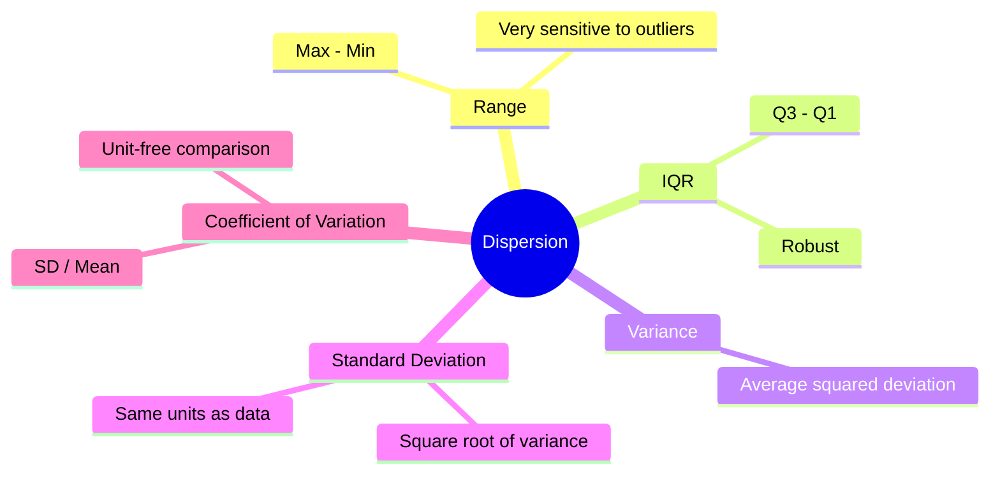
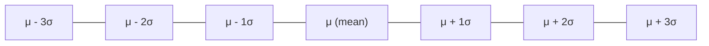
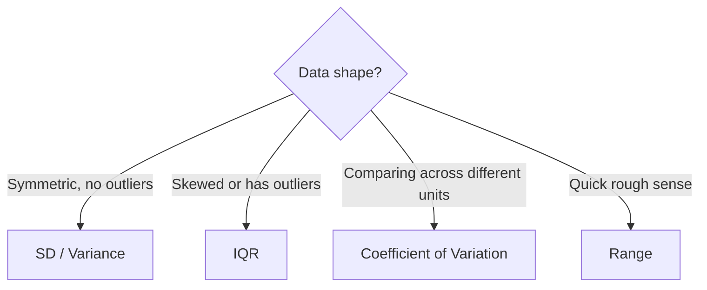

# Chapter 3: Measures of Dispersion

[⬅ Previous: Central Tendency](./02-central-tendency.md) | [🏠 Home](../README.md) | [➡ Next: Correlation](./04-correlation.md)

---

## Learning Objectives

- [ ] Compute range, IQR, variance, standard deviation, and coefficient of variation
- [ ] Derive the variance formula and understand the $n-1$ divisor (Bessel's correction)
- [ ] Distinguish population variance from sample variance
- [ ] Interpret standard deviation using the Empirical Rule
- [ ] Compare variability across groups with different units using CV
- [ ] Identify outliers using IQR-based fences

## Prerequisites

- Chapter 1 (Descriptive Statistics)
- Chapter 2 (Central Tendency)

## Estimated Study Time

⏱️ 2–3 hours

---

## Why This Topic Matters

> [!TIP]
> Two datasets can have identical means yet describe entirely different realities. Dispersion tells you how much to trust the "typical value" as representative of the whole.

## Big Picture



## Core Intuition

Consider two classes with mean exam score = 75:
- Class A: scores tightly clustered 70–80
- Class B: scores ranging 20–100

Central tendency alone cannot distinguish these. Dispersion measures quantify **how spread out** values are around the center.

## Mathematical Foundation

### Range

$$\text{Range} = x_{max} - x_{min}$$

Simple but extremely sensitive to a single outlier and ignores all other data points.

### Interquartile Range (IQR)

$$IQR = Q_3 - Q_1$$

where $Q_1$ (25th percentile) and $Q_3$ (75th percentile) bound the middle 50% of data. Robust to outliers.

**Outlier fences (Tukey's rule):**

$$\text{Lower fence} = Q_1 - 1.5 \times IQR \qquad \text{Upper fence} = Q_3 + 1.5 \times IQR$$

Any observation beyond these fences is flagged as a potential outlier — this is exactly what a boxplot's "whiskers" represent.

### Population Variance

$$\sigma^2 = \frac{1}{N}\sum_{i=1}^{N}(x_i - \mu)^2$$

### Sample Variance (with Bessel's Correction)

$$s^2 = \frac{1}{n-1}\sum_{i=1}^{n}(x_i - \bar{x})^2$$

> [!NOTE]
> **Why $n-1$, not $n$?** Using the sample mean $\bar{x}$ (instead of the true population mean $\mu$) to compute deviations slightly *underestimates* the true variance, because $\bar{x}$ is, by construction, the value that minimizes $\sum(x_i - c)^2$ within the sample. Dividing by $n-1$ instead of $n$ corrects this downward bias, making $s^2$ an **unbiased estimator** of $\sigma^2$. This can be proven formally by showing $E[s^2] = \sigma^2$ using the decomposition of degrees of freedom.

### Standard Deviation

$$s = \sqrt{s^2}$$

Expressed in the *original units* of the data (unlike variance, which is in squared units) — this is why SD, not variance, is typically reported.

### Coefficient of Variation (CV)

$$CV = \frac{s}{\bar{x}} \times 100\%$$

Used to compare variability between datasets measured on **different scales or units** (e.g., comparing variability of height in cm vs. weight in kg).

## The Empirical Rule (68–95–99.7 Rule)

For approximately normal distributions:

| Interval | Approx. % of Data |
|---|---|
| $\mu \pm 1\sigma$ | 68% |
| $\mu \pm 2\sigma$ | 95% |
| $\mu \pm 3\sigma$ | 99.7% |



## Decision Tree: Which Dispersion Measure?



## Worked Example

Using the same BP dataset: `118, 119, 121, 122, 125, 128, 130, 138, 145, 150` ($\bar{x} = 129.6$)

**Step 1 — Deviations from mean:**

| $x_i$ | $x_i - \bar{x}$ | $(x_i - \bar{x})^2$ |
|---|---|---|
| 118 | −11.6 | 134.56 |
| 119 | −10.6 | 112.36 |
| 121 | −8.6 | 73.96 |
| 122 | −7.6 | 57.76 |
| 125 | −4.6 | 21.16 |
| 128 | −1.6 | 2.56 |
| 130 | 0.4 | 0.16 |
| 138 | 8.4 | 70.56 |
| 145 | 15.4 | 237.16 |
| 150 | 20.4 | 416.16 |

Sum of squared deviations = 1126.4

**Sample variance**:
$$s^2 = \frac{1126.4}{10-1} = 125.16$$

**Sample standard deviation**:
$$s = \sqrt{125.16} = 11.19 \text{ mmHg}$$

**Coefficient of variation**:
$$CV = \frac{11.19}{129.6} \times 100\% = 8.6\%$$

**Range** = 150 − 118 = 32 mmHg

**IQR**: $Q_1 = 121.25$, $Q_3 = 137.0$ → $IQR = 15.75$

## Software Implementation

### R

```r
bp <- c(118, 122, 130, 145, 119, 125, 138, 128, 121, 150)

var(bp)          # sample variance (n-1 divisor)
sd(bp)           # sample standard deviation
range(bp)
IQR(bp)
quantile(bp, probs = c(0.25, 0.75))

cv <- sd(bp) / mean(bp) * 100
cv

# Tukey outlier fences
Q1 <- quantile(bp, 0.25); Q3 <- quantile(bp, 0.75)
IQR_val <- Q3 - Q1
lower_fence <- Q1 - 1.5 * IQR_val
upper_fence <- Q3 + 1.5 * IQR_val
c(lower_fence, upper_fence)
```

### Python

```python
import numpy as np
from scipy import stats

bp = np.array([118, 122, 130, 145, 119, 125, 138, 128, 121, 150])

print("Variance (sample):", np.var(bp, ddof=1))
print("SD (sample):", np.std(bp, ddof=1))
print("Range:", np.ptp(bp))
print("IQR:", stats.iqr(bp))

cv = np.std(bp, ddof=1) / np.mean(bp) * 100
print("CV:", cv)

q1, q3 = np.percentile(bp, [25, 75])
iqr = q3 - q1
lower_fence, upper_fence = q1 - 1.5*iqr, q3 + 1.5*iqr
print(lower_fence, upper_fence)
```

### SPSS

```spss
DESCRIPTIVES VARIABLES=bp
  /STATISTICS=VARIANCE STDDEV RANGE.

EXAMINE VARIABLES=bp
  /PLOT BOXPLOT
  /STATISTICS DESCRIPTIVES EXTREME.
```

### STATA

```stata
summarize bp, detail
* Reports variance implicitly via SD; percentiles shown directly

* Coefficient of variation
sum bp
display r(sd)/r(mean)*100
```

### SAS

```sas
PROC MEANS DATA=work.patients VAR STD RANGE CV;
    VAR bp;
RUN;

PROC UNIVARIATE DATA=work.patients;
    VAR bp;
    OUTPUT OUT=stats QRANGE=iqr;
RUN;
```

## Real Research Example — Clinical Trials

In clinical trial reporting (per CONSORT guidelines, Chapter 38), both a central tendency **and** a dispersion measure must always be reported together. Reporting a mean difference in blood pressure reduction between two arms *without* SD or a confidence interval is considered incomplete reporting and is routinely flagged by reviewers and by CONSORT checklists.

## Common Mistakes

| Mistake | Why It's Wrong |
|---|---|
| Reporting variance instead of SD in text | Wrong units, hard to interpret |
| Using SD for skewed data | Assumes symmetry; misleading |
| Confusing population and sample formulas | Biased estimates in small samples |
| Comparing SDs across variables measured in different units | Use CV instead |

## Reviewer Perspective

> [!NOTE]
> **Typical Reviewer Comment**: *"Table 2 reports mean weight loss (kg) and mean height reduction (cm) with SD, then claims weight loss was 'more variable.' This comparison is invalid across different units — please report coefficient of variation instead."*

## AI Evaluation Perspective

Automated checks often verify that every reported mean is paired with a dispersion measure, and that variance/SD values are internally consistent (e.g., $SD = \sqrt{Variance}$) — inconsistencies here are a common sign of a typo or copy-paste error propagated through a manuscript.

## Frequently Asked Questions

**Q: Why not always use IQR since it's more robust?**
A: SD has better mathematical properties for downstream inferential procedures (e.g., it appears directly in the normal distribution's formula and in standard error calculations), so it remains standard for approximately normal data.

**Q: Is a high CV always bad?**
A: Not inherently — it just means the phenomenon is highly variable relative to its mean. Biological measurements (e.g., cytokine levels) often have naturally high CVs.

## Practice Problems

### MCQs
1. Bessel's correction divides by: (a) $n$ (b) **$n-1$** (c) $n+1$ (d) $\sqrt{n}$
2. Which measure is most robust to outliers? (a) Range (b) Variance (c) **IQR** (d) Standard deviation

### Short Questions
1. Explain in your own words why sample variance uses $n-1$.
2. Two variables have SD = 5. Variable A has mean 10, Variable B has mean 100. Which is more variable relative to its scale?

### Programming Exercise
Add an outlier (e.g., 300) to the BP dataset. Recompute range, IQR, variance, and SD in R or Python. Which measures change the most? Which barely change?

## Chapter Summary

- Range and variance/SD are sensitive to outliers; IQR is robust.
- Sample variance uses $n-1$ (Bessel's correction) to remain unbiased.
- CV enables comparison of variability across different units or scales.
- Dispersion must always accompany central tendency in scientific reporting.

## Key Takeaways

- 📌 Never report a mean without a companion dispersion measure.
- 📌 Match your dispersion measure to your central tendency measure (mean↔SD, median↔IQR).
- 📌 Use CV only when comparing variables of different units or vastly different scales.

## Recommended Papers

- Altman, D.G. et al. (1983). "Statistical guidelines for contributors to medical journals." *BMJ*.

## Further Reading

- Rosner, B. (2015). *Fundamentals of Biostatistics*, 8th ed. — Chapter 2.

## References

1. Bessel, F.W. (1838). Original correction referenced in modern statistical theory texts.
2. Tukey, J.W. (1977). *Exploratory Data Analysis*.

---

## Previous Chapter
[⬅ Chapter 2: Central Tendency](./02-central-tendency.md)

## Next Chapter
[➡ Chapter 4: Correlation](./04-correlation.md)
