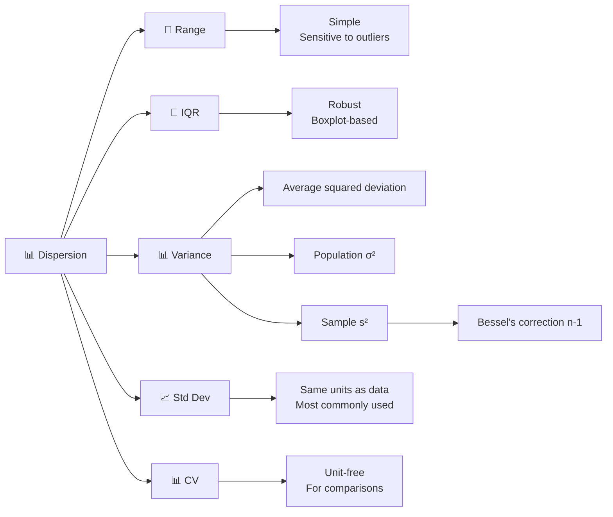
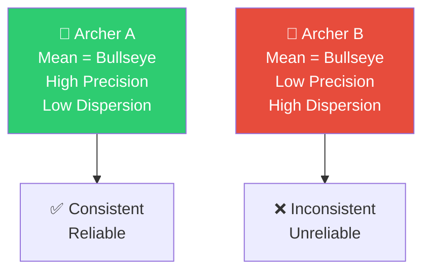
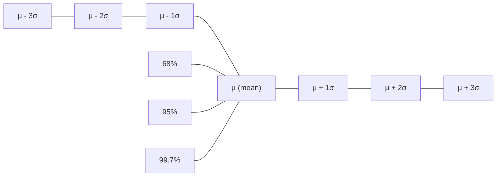
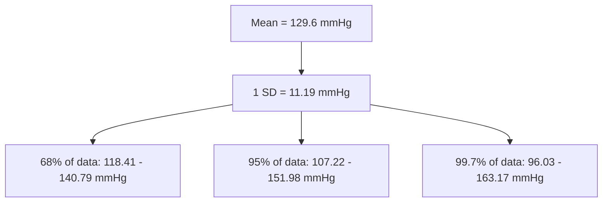
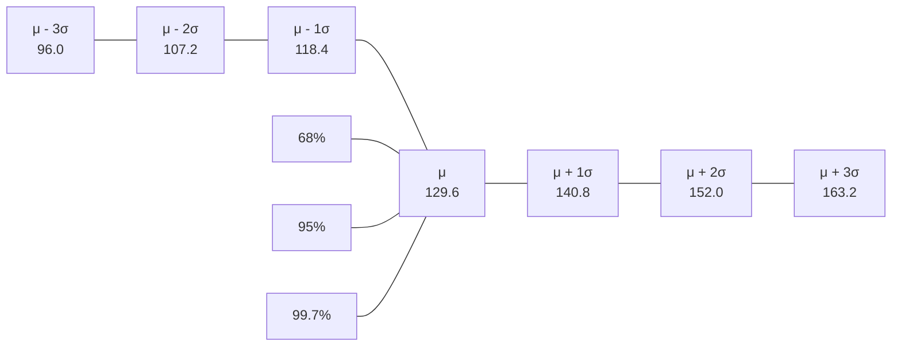
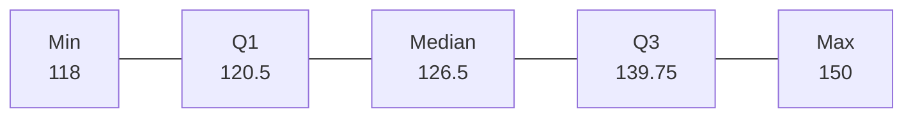
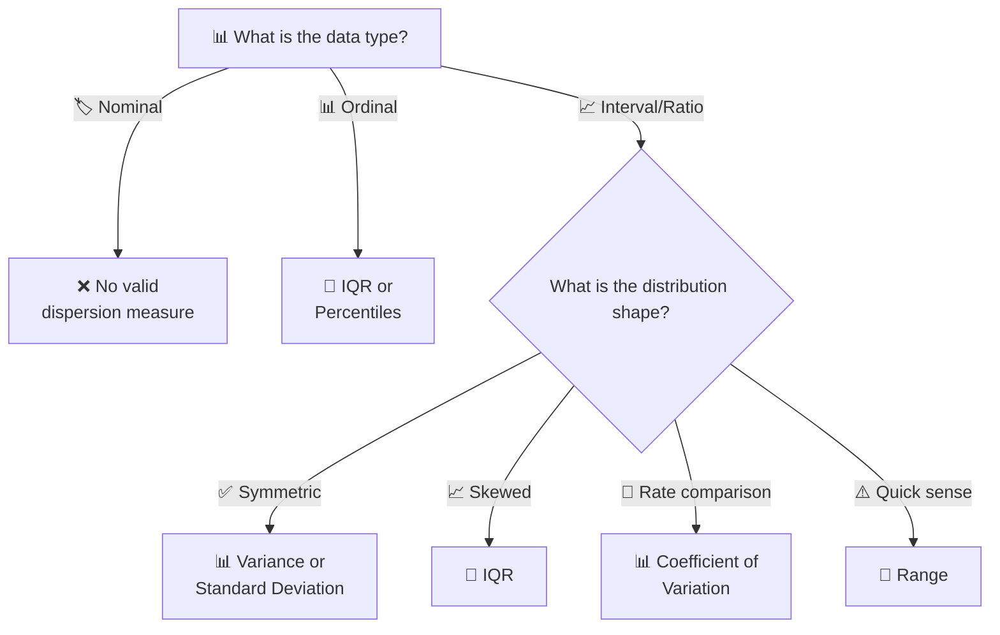
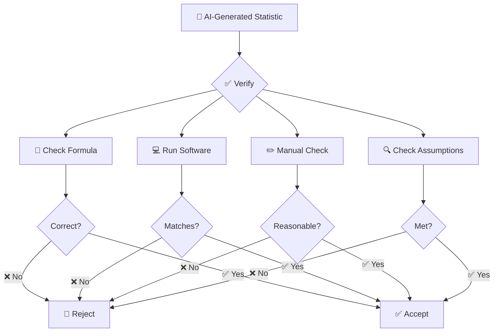

# 📊 Chapter 3: Measures of Dispersion

## *Spread, Variability, and the Art of Trusting Your Data*

<div align="center">

[](https://github.com/your-repo)
[](LICENSE)
[]()
[]()

**[⬅ Previous: Chapter 2 - Central Tendency](./02-central-tendency.md) · [🏠 Home](../README.md) · [➡ Next: Chapter 4 - Correlation](./04-correlation.md)**

</div>

---

> *"Two datasets can have identical means yet describe entirely different realities. Dispersion tells you how much to trust the 'typical value' as representative of the whole."* — **Author Unknown**

> *"The standard deviation is the square root of the variance. But what is the variance? It's the average squared deviation from the mean. Why square? Because life is complicated."* — **Anonymous Statistician**

---

## 📋 Table of Contents

```mermaid
flowchart TD
    A["📊 Chapter 3:<br>Measures of Dispersion"] --> B["🎯 Learning Objectives"]
    A --> C["💡 Why This Topic Matters"]
    A --> D["🌍 Big Picture"]
    A --> E["🧠 Core Intuition"]
    A --> F["📐 Mathematical Foundation"]
    A --> G["📊 Measures of Dispersion"]
    A --> H["🔄 Choosing the Right Measure"]
    A --> I["✏️ Worked Examples"]
    A --> J["💻 Software Implementation"]
    A --> K["🏥 Real Research Examples"]
    A --> L["❌ Common Mistakes"]
    A --> M["🕵️ Reviewer Perspective"]
    A --> N["🤖 AI Evaluation Perspective"]
    A --> O["❓ Frequently Asked Questions"]
    A --> P["📝 Assessment"]
    A --> Q["📚 Summary"]
    
    G --> G1["1️⃣ Range"]
    G --> G2["2️⃣ Interquartile Range (IQR)"]
    G --> G3["3️⃣ Variance"]
    G --> G4["4️⃣ Standard Deviation"]
    G --> G5["5️⃣ Coefficient of Variation"]
    G --> G6["6️⃣ Mean Absolute Deviation"]
    G --> G7["7️⃣ Percentiles & Quartiles"]
```



---

## 🎯 Learning Objectives

| Level | Objectives |
|-------|------------|
| **🏗️ Foundational** | ✅ Compute range, IQR, variance, and standard deviation by hand |
| | ✅ Understand the difference between population and sample variance |
| | ✅ Interpret standard deviation using the Empirical Rule |
| | ✅ Identify outliers using IQR-based fences |
| **📈 Intermediate** | ✅ Derive the variance formula and understand Bessel's correction |
| | ✅ Calculate and interpret the coefficient of variation |
| | ✅ Choose appropriate dispersion measures for different data types |
| **🎓 Advanced** | ✅ Critically evaluate variability claims in research |
| | ✅ Detect and correct misuse of dispersion measures |
| | ✅ Explain the mathematical properties of variance and SD |

---

## 🧭 Prerequisites

**Required Knowledge:**
- ✅ Chapter 1: Descriptive Statistics
- ✅ Chapter 2: Measures of Central Tendency
- ✅ Summation notation ($\Sigma$)
- ✅ Basic algebra and square roots
- ✅ Understanding of data types (nominal, ordinal, interval, ratio)

**Estimated Study Time:** ⏱️ 2.5 – 4 hours

---

## 💡 Why This Topic Matters

> [!TIP]
> *Central tendency tells you where the data are centered. Dispersion tells you how much you should trust that center.*

### The Two Datasets Story 📖

Consider two classes with mean exam score = 75:

| Class | Scores | Mean | Dispersion Pattern |
|-------|--------|------|-------------------|
| **Class A** | 73, 74, 75, 75, 76, 77 | 75 | Tightly clustered |
| **Class B** | 20, 40, 60, 75, 90, 100, 120 | 75 | Widely spread |

**The mean alone tells an incomplete story.** Central tendency cannot distinguish these classes. Dispersion measures quantify **how spread out** values are around the center.

### Real-World Impact

| Field | Why Dispersion Matters | Example |
|-------|----------------------|---------|
| 🏥 **Medicine** | Variation in treatment response | "The mean blood pressure reduction was 10 mmHg (SD = 15 mmHg)" |
| 💰 **Finance** | Risk assessment | "This investment has high return but high volatility" |
| 🧪 **Clinical Trials** | Consistency of effect | "The treatment effect was consistent across subgroups" |
| 📊 **Quality Control** | Process stability | "The mean diameter is 10 mm with SD = 0.1 mm" |
| 🤖 **Machine Learning** | Model uncertainty | "The model's predictions have high variance" |
| 🏭 **Manufacturing** | Tolerances and specifications | "Parts must be within 3 SD of the mean" |
| 📈 **Economics** | Income inequality | "The Gini coefficient measures income dispersion" |

### Why This Chapter Matters for Your Research

> [!IMPORTANT]
> **Quick Wins for Researchers:**
> 1. **Better Data Description**: Report variability alongside central tendency
> 2. **Improved Interpretation**: Understand what "spread" means for your data
> 3. **Stronger Papers**: Avoid common reviewer criticisms about missing dispersion
> 4. **Better Decision Making**: Quantify uncertainty and risk

---

## 🌍 Big Picture

### The Dispersion Landscape



### The Dispersion Spectrum


### The Four Questions Each Measure Answers

| Measure | Question It Answers | Statistical Principle |
|---------|-------------------|----------------------|
| **Range** | "How far apart are the extremes?" | Max - Min |
| **IQR** | "How spread is the middle 50%?" | Q3 - Q1 |
| **Variance** | "What is the average squared deviation?" | Average of $(x - \mu)^2$ |
| **Standard Deviation** | "What is the typical deviation?" | Square root of variance |
| **CV** | "How variable is this relative to its mean?" | SD / Mean |

---

## 🧠 Core Intuition

### The "Shooting Target" Analogy 🎯

Imagine two archers shooting at a target:



**Key Insight:** Both archers have the same mean (bullseye), but their reliability is completely different. Dispersion tells you which archer you should trust!

### The "Restaurant Wait Time" Analogy 🍽️

Two restaurants both have average wait time = 15 minutes:

| Restaurant | Wait Times (minutes) | Mean | Dispersion |
|-----------|---------------------|------|------------|
| **Restaurant A** | 14, 15, 15, 15, 16 | 15 | Very consistent |
| **Restaurant B** | 5, 10, 15, 20, 25 | 15 | Very inconsistent |

**Which would you choose?** Restaurant A, because you can trust the 15-minute estimate!

### The "Investment" Analogy 💰

Two investments both have average annual return = 8%:

| Investment | Returns (annual %) | Mean | Risk |
|-----------|-------------------|------|------|
| **Bond Fund** | 7, 8, 8, 9, 8 | 8% | Low risk |
| **Tech Stock** | -20, 5, 15, 25, 15 | 8% | High risk |

**Dispersion = Risk!** Higher dispersion means higher uncertainty.

### The "Weather Forecast" Analogy 🌤️

Two cities both have average temperature = 70°F:

| City | Temperatures (°F) | Mean | Weather Pattern |
|------|------------------|------|----------------|
| **San Diego** | 68, 69, 70, 70, 71, 72 | 70 | Stable, predictable |
| **Chicago** | 30, 45, 60, 75, 90, 100 | 70 | Unstable, unpredictable |

**Dispersion = Predictability!**

---

## 📐 Mathematical Foundation

### Key Definitions

#### Range

> 📖 **Definition**: The range is the difference between the maximum and minimum values.

$$\text{Range} = x_{\text{max}} - x_{\text{min}}$$

**Properties:**
- ✅ Easy to compute and understand
- ✅ Gives a quick sense of spread
- ❌ Extremely sensitive to outliers
- ❌ Ignores all data points except extremes
- ❌ Not stable across samples

#### Interquartile Range (IQR)

> 📖 **Definition**: The IQR is the difference between the 75th percentile (Q3) and 25th percentile (Q1).

$$IQR = Q_3 - Q_1$$

**Properties:**
- ✅ Robust to outliers (breakdown point = 25%)
- ✅ Represents the middle 50% of data
- ✅ Used in boxplots
- ✅ Works for skewed distributions
- ❌ Loses information about the tails

**Outlier Fences (Tukey's Rule):**

$$\text{Lower fence} = Q_1 - 1.5 \times IQR$$
$$\text{Upper fence} = Q_3 + 1.5 \times IQR$$

Any observation beyond these fences is flagged as a potential outlier — this is exactly what a boxplot's "whiskers" represent.

#### Population Variance

> 📖 **Definition**: The average of squared deviations from the population mean.

$$\sigma^2 = \frac{1}{N}\sum_{i=1}^{N}(x_i - \mu)^2$$

**Properties:**
- ✅ Uses all data
- ✅ Mathematically tractable
- ✅ Basis for many statistical methods
- ❌ In squared units (hard to interpret)
- ❌ Sensitive to outliers

#### Sample Variance (with Bessel's Correction)

> 📖 **Definition**: The average of squared deviations from the sample mean, with $n-1$ denominator.

$$s^2 = \frac{1}{n-1}\sum_{i=1}^{n}(x_i - \bar{x})^2$$

**Properties:**
- ✅ Unbiased estimator of $\sigma^2$
- ✅ Uses all data
- ✅ Basis for inferential statistics
- ❌ In squared units (hard to interpret)
- ❌ Sensitive to outliers

#### Why $n-1$? (Bessel's Correction)

> [!NOTE]
> **Why $n-1$, not $n$?** Using the sample mean $\bar{x}$ (instead of the true population mean $\mu$) to compute deviations slightly *underestimates* the true variance, because $\bar{x}$ is, by construction, the value that minimizes $\sum(x_i - c)^2$ within the sample.

**The Mathematics of Bessel's Correction:**

1. **The Bias Problem:** When we use $\bar{x}$ instead of $\mu$, the sum of squared deviations is always smaller:
   $$\sum_{i=1}^n (x_i - \bar{x})^2 \leq \sum_{i=1}^n (x_i - \mu)^2$$

2. **The Correction:** Dividing by $n-1$ instead of $n$ corrects this downward bias, making $s^2$ an **unbiased estimator** of $\sigma^2$:
   $$E[s^2] = \sigma^2$$

3. **Degrees of Freedom:** We lose one degree of freedom because we estimated the mean from the data:
   $$\text{df} = n - 1$$

**The Proof (simplified):**
$$E\left[\frac{1}{n-1}\sum_{i=1}^n (x_i - \bar{x})^2\right] = \sigma^2$$

**Intuitive Explanation:**
- The sample mean $\bar{x}$ is "too close" to the data points
- This artificially reduces the sum of squared deviations
- Dividing by $n-1$ compensates for this "too close" phenomenon

#### Standard Deviation

> 📖 **Definition**: The square root of the variance.

$$s = \sqrt{s^2}$$

**Properties:**
- ✅ In the same units as the data
- ✅ Intuitive interpretation
- ✅ Basis for the Empirical Rule
- ✅ Widely used and understood
- ❌ Sensitive to outliers

#### Coefficient of Variation (CV)

> 📖 **Definition**: The standard deviation divided by the mean, expressed as a percentage.

$$CV = \frac{s}{\bar{x}} \times 100\%$$

**Properties:**
- ✅ Unit-free (dimensionless)
- ✅ Allows comparison across different units
- ✅ Useful for comparing variability
- ❌ Only valid for ratio scale data
- ❌ Unstable when mean is near zero

### Derivation of the Variance Formula

**The Optimization Problem:**

The variance is the average squared deviation from the mean. This is related to the optimization problem that defines the mean:

**Step 1:** Define the sum of squared deviations from c:
$$S(c) = \sum_{i=1}^n (x_i - c)^2$$

**Step 2:** The minimum occurs at $c = \bar{x}$:
$$\frac{dS}{dc} = -2\sum_{i=1}^n (x_i - c) = 0$$
$$c = \bar{x}$$

**Step 3:** The variance is the minimum value of $S(c)/n$:
$$s^2 = \frac{S(\bar{x})}{n-1}$$

**Step 4:** This is why the variance measures "average squared deviation" — it's the minimum possible average squared distance from any point.

### The Empirical Rule (68–95–99.7 Rule)

For approximately normal distributions:

| Interval | Approx. % of Data | Cumulative % |
|----------|------------------|--------------|
| $\mu \pm 1\sigma$ | 68% | 68% |
| $\mu \pm 2\sigma$ | 95% | 95% |
| $\mu \pm 3\sigma$ | 99.7% | 99.7% |



**Interpretation:**
- **68%** of data falls within 1 SD of the mean
- **95%** of data falls within 2 SDs of the mean
- **99.7%** of data falls within 3 SDs of the mean

---

## 📊 Measures of Dispersion

### 1. Range 📏

#### Mathematical Definition

$$\text{Range} = x_{\text{max}} - x_{\text{min}}$$

#### Advantages and Disadvantages

| Advantages | Disadvantages |
|------------|---------------|
| ✅ Simple to compute | ❌ Extremely sensitive to outliers |
| ✅ Easy to understand | ❌ Ignores all data points except extremes |
| ✅ Quick sense of spread | ❌ Not robust |
| ✅ Works for any quantitative data | ❌ Not stable across samples |

#### Example: Blood Pressure Data

```text
Dataset: 118, 119, 121, 122, 125, 128, 130, 138, 145, 150

Range = 150 - 118 = 32 mmHg

Interpretation: The blood pressure values span 32 mmHg from minimum to maximum.
```

#### Example: Effect of an Outlier

```text
Original: 118, 119, 121, 122, 125, 128, 130, 138, 145, 150
Range = 32 mmHg

With Outlier: 118, 119, 121, 122, 125, 128, 130, 138, 145, 300
Range = 300 - 118 = 182 mmHg (↑ 150 mmHg!)

Range is extremely sensitive to a single outlier.
```

---

### 2. Interquartile Range (IQR) 📐

#### Mathematical Definition

$$IQR = Q_3 - Q_1$$

Where:
- $Q_1$ = 25th percentile (first quartile)
- $Q_3$ = 75th percentile (third quartile)

#### Methods for Calculating Quartiles

**Method 1: Position-Based**

For the $k$th percentile:
$$\text{Position} = \frac{k}{100} \times (n + 1)$$

**Method 2: Nearest Rank**

The $k$th percentile is the smallest value such that at least $k\%$ of the data are $\leq$ that value.

#### Advantages and Disadvantages

| Advantages | Disadvantages |
|------------|---------------|
| ✅ Robust to outliers | ❌ Loses information about tails |
| ✅ Represents middle 50% | ❌ Not used in many statistical tests |
| ✅ Used in boxplots | ❌ Less mathematically tractable |
| ✅ Works for skewed distributions | ❌ Not based on all data |

#### Example: Blood Pressure Data

```text
Dataset (sorted): 118, 119, 121, 122, 125, 128, 130, 138, 145, 150

n = 10

Q1 (25th percentile):
Position = (25/100) × (10 + 1) = 2.75
Q1 = 119 + 0.75 × (121 - 119) = 119 + 1.5 = 120.5 mmHg

Q3 (75th percentile):
Position = (75/100) × (10 + 1) = 8.25
Q3 = 138 + 0.25 × (145 - 138) = 138 + 1.75 = 139.75 mmHg

IQR = 139.75 - 120.5 = 19.25 mmHg

Interpretation: The middle 50% of blood pressure values span 19.25 mmHg.
```

#### Outlier Detection with IQR

**Tukey's Fences:**
$$\text{Lower fence} = Q_1 - 1.5 \times IQR$$
$$\text{Upper fence} = Q_3 + 1.5 \times IQR$$

**Example:**
```text
Q1 = 120.5, Q3 = 139.75, IQR = 19.25

Lower fence = 120.5 - 1.5 × 19.25 = 120.5 - 28.875 = 91.625
Upper fence = 139.75 + 1.5 × 19.25 = 139.75 + 28.875 = 168.625

All values are between 91.625 and 168.625 → No outliers!

With Outlier: 118, 119, 121, 122, 125, 128, 130, 138, 145, 300

Q1 = 121.25, Q3 = 137.0, IQR = 15.75

Lower fence = 121.25 - 1.5 × 15.75 = 121.25 - 23.625 = 97.625
Upper fence = 137.0 + 1.5 × 15.75 = 137.0 + 23.625 = 160.625

300 > 160.625 → 300 is an outlier! ✓
```

---

### 3. Variance 📊

#### Population Variance

$$\sigma^2 = \frac{1}{N}\sum_{i=1}^{N}(x_i - \mu)^2$$

#### Sample Variance

$$s^2 = \frac{1}{n-1}\sum_{i=1}^{n}(x_i - \bar{x})^2$$

#### Computational Formula (Sample Variance)

$$s^2 = \frac{\sum x_i^2 - \frac{(\sum x_i)^2}{n}}{n-1}$$

This formula is more stable numerically for hand calculations.

#### Derivation of Sample Variance

**Step 1:** Expand the squared deviations
$$s^2 = \frac{1}{n-1}\sum_{i=1}^{n}(x_i^2 - 2x_i\bar{x} + \bar{x}^2)$$

**Step 2:** Use $\sum x_i = n\bar{x}$
$$s^2 = \frac{1}{n-1}\left(\sum x_i^2 - 2\bar{x}\sum x_i + n\bar{x}^2\right)$$

**Step 3:** Simplify
$$s^2 = \frac{1}{n-1}\left(\sum x_i^2 - 2n\bar{x}^2 + n\bar{x}^2\right)$$
$$s^2 = \frac{1}{n-1}\left(\sum x_i^2 - n\bar{x}^2\right)$$

**Step 4:** Substitute $\bar{x} = \frac{\sum x_i}{n}$
$$s^2 = \frac{\sum x_i^2 - \frac{(\sum x_i)^2}{n}}{n-1}$$

#### Advantages and Disadvantages

| Advantages | Disadvantages |
|------------|---------------|
| ✅ Uses all data | ❌ In squared units (hard to interpret) |
| ✅ Mathematically tractable | ❌ Sensitive to outliers |
| ✅ Basis for many statistical methods | ❌ Not intuitive for most people |
| ✅ Has excellent statistical properties | ❌ Requires interval/ratio scale |

#### Example: Blood Pressure Data

**Step 1:** Calculate the mean
$$\bar{x} = 129.6 \text{ mmHg}$$

**Step 2:** Calculate deviations from mean

| $x_i$ | $x_i - \bar{x}$ | $(x_i - \bar{x})^2$ |
|-------|-----------------|---------------------|
| 118 | -11.6 | 134.56 |
| 119 | -10.6 | 112.36 |
| 121 | -8.6 | 73.96 |
| 122 | -7.6 | 57.76 |
| 125 | -4.6 | 21.16 |
| 128 | -1.6 | 2.56 |
| 130 | 0.4 | 0.16 |
| 138 | 8.4 | 70.56 |
| 145 | 15.4 | 237.16 |
| 150 | 20.4 | 416.16 |

**Step 3:** Sum of squared deviations
$$\sum (x_i - \bar{x})^2 = 1126.4$$

**Step 4:** Calculate sample variance (n = 10)
$$s^2 = \frac{1126.4}{10-1} = \frac{1126.4}{9} = 125.16 \text{ mmHg}^2$$

**Interpretation:** The average squared deviation from the mean is 125.16 mmHg².

---

### 4. Standard Deviation 📈

#### Mathematical Definition

$$s = \sqrt{s^2} = \sqrt{\frac{1}{n-1}\sum_{i=1}^{n}(x_i - \bar{x})^2}$$

#### The Standard Deviation as a Ruler



#### Empirical Rule Visualization



#### Advantages and Disadvantages

| Advantages | Disadvantages |
|------------|---------------|
| ✅ Same units as data | ❌ Sensitive to outliers |
| ✅ Intuitive interpretation | ❌ Less robust than IQR |
| ✅ Basis for Empirical Rule | ❌ Assumes symmetry for interpretation |
| ✅ Widely used and understood | ❌ Can be affected by skewness |
| ✅ Has excellent statistical properties | ❌ Not appropriate for ordinal data |

#### Example: Blood Pressure Data

**Step 1:** Calculate variance
$$s^2 = 125.16 \text{ mmHg}^2$$

**Step 2:** Take the square root
$$s = \sqrt{125.16} = 11.19 \text{ mmHg}$$

**Interpretation:** The typical deviation from the mean blood pressure is about 11.19 mmHg. Most blood pressure values (68%) fall between 118.41 and 140.79 mmHg.

**Empirical Rule Check:**
- Mean ± 1 SD: 129.6 ± 11.19 = (118.41, 140.79)
- Actually 70% of data falls in this range! (7 out of 10 values)
- Close to the 68% rule for normal distributions

---

### 5. Coefficient of Variation (CV) 📊

#### Mathematical Definition

$$CV = \frac{s}{\bar{x}} \times 100\%$$

#### Interpretation

The CV expresses the standard deviation as a percentage of the mean. It measures relative variability.

**Rule of Thumb:**
- CV < 10%: Low variability (very consistent)
- 10% < CV < 30%: Moderate variability
- CV > 30%: High variability (highly variable)

#### Advantages and Disadvantages

| Advantages | Disadvantages |
|------------|---------------|
| ✅ Unit-free (dimensionless) | ❌ Only valid for ratio scale data |
| ✅ Allows comparison across different units | ❌ Unstable when mean is near zero |
| ✅ Easy to interpret | ❌ Assumes mean is positive |
| ✅ Useful for comparing variability | ❌ Can be misleading with negative values |

#### Applications

**1. Comparing Different Variables**

```text
Variable A: Height in cm
Mean = 170 cm, SD = 10 cm
CV = 10/170 × 100% = 5.9%

Variable B: Weight in kg
Mean = 70 kg, SD = 10 kg
CV = 10/70 × 100% = 14.3%

Interpretation: Weight is more variable relative to its scale than height!
Even though both have SD = 10, weight's CV is higher.
```

**2. Comparing Groups with Different Means**

```text
Group A: Mean = 100, SD = 15, CV = 15%
Group B: Mean = 50, SD = 10, CV = 20%

Interpretation: Group B has more relative variability, even though Group A has a larger SD.
```

**3. Quality Control**

```text
Manufacturing Process A: Mean = 10.0 mm, SD = 0.5 mm, CV = 5%
Manufacturing Process B: Mean = 100.0 mm, SD = 2.0 mm, CV = 2%

Interpretation: Process B is more precise relative to its target size!
```

#### Example: Blood Pressure Data

$$CV = \frac{11.19}{129.6} \times 100\% = 8.6\%$$

**Interpretation:** The blood pressure values have relatively low variability (CV < 10%), indicating consistent readings.

---

### 6. Mean Absolute Deviation (MAD) 📊

#### Mathematical Definition

$$\text{MAD} = \frac{1}{n}\sum_{i=1}^{n}|x_i - \bar{x}|$$

#### Advantages and Disadvantages

| Advantages | Disadvantages |
|------------|---------------|
| ✅ Same units as data | ❌ Less mathematically tractable |
| ✅ Intuitive interpretation | ❌ Less commonly used |
| ✅ Less sensitive to outliers than variance | ❌ Not used in standard statistical tests |
| ✅ Easy to understand | ❌ Not as efficient as SD |

#### Example: Blood Pressure Data

**Step 1:** Calculate absolute deviations

| $x_i$ | $x_i - \bar{x}$ | $\|x_i - \bar{x}\|$ |
|-------|-----------------|---------------------|
| 118 | -11.6 | 11.6 |
| 119 | -10.6 | 10.6 |
| 121 | -8.6 | 8.6 |
| 122 | -7.6 | 7.6 |
| 125 | -4.6 | 4.6 |
| 128 | -1.6 | 1.6 |
| 130 | 0.4 | 0.4 |
| 138 | 8.4 | 8.4 |
| 145 | 15.4 | 15.4 |
| 150 | 20.4 | 20.4 |

**Step 2:** Sum of absolute deviations
$$\sum |x_i - \bar{x}| = 88.4$$

**Step 3:** Calculate MAD
$$\text{MAD} = \frac{88.4}{10} = 8.84 \text{ mmHg}$$

**Interpretation:** The typical absolute deviation from the mean is 8.84 mmHg.

---

### 7. Percentiles & Quartiles 📊

#### Mathematical Definition

The $k$th percentile is the value below which $k\%$ of the data fall.

#### Quartiles

- **Q1 (25th percentile)**: First quartile
- **Q2 (50th percentile)**: Median (second quartile)
- **Q3 (75th percentile)**: Third quartile

#### Five-Number Summary

$$\text{Min}, Q_1, \text{Median}, Q_3, \text{Max}$$

#### Example: Blood Pressure Data

```text
Dataset (sorted): 118, 119, 121, 122, 125, 128, 130, 138, 145, 150

Minimum: 118
Q1: 120.5
Median: 126.5
Q3: 139.75
Maximum: 150

Five-Number Summary: 118, 120.5, 126.5, 139.75, 150

Interpretation:
- 25% of values are ≤ 120.5 mmHg
- 50% of values are ≤ 126.5 mmHg (median)
- 75% of values are ≤ 139.75 mmHg
```

#### Boxplot (Box-and-Whisker Plot)



---

## 🔄 Choosing the Right Measure

### Decision Framework



### Comparison Table

| Measure | Sensitive to Outliers? | Uses All Data? | Valid Scale | Interpretation |
|---------|----------------------|----------------|-------------|----------------|
| **Range** | Yes (extremely) | No (only extremes) | Interval, Ratio | Full spread |
| **IQR** | No (robust) | No (middle 50%) | Ordinal, Interval, Ratio | Middle spread |
| **Variance** | Yes | Yes | Interval, Ratio | Average squared deviation |
| **Standard Deviation** | Yes | Yes | Interval, Ratio | Typical deviation |
| **CV** | Yes | Yes | Ratio | Relative variability |
| **MAD** | Moderately | Yes | Interval, Ratio | Average absolute deviation |
| **Percentiles** | No | Partial | Ordinal, Interval, Ratio | Position-based |

### When to Use What

| Situation | Best Choice | Why |
|-----------|-------------|-----|
| Normal data, no outliers | Standard Deviation | Efficient, interpretable |
| Skewed data | IQR | Robust, interpretable |
| Comparing different units | Coefficient of Variation | Unit-free |
| Quick sense of spread | Range | Simple, fast |
| Reporting with median | IQR | Matched to median |
| Reporting with mean | Standard Deviation | Matched to mean |
| Outlier detection | IQR with Tukey's fences | Robust method |

### The "Matched Pair" Rule

> [!TIP]
> **Always match your dispersion measure to your central tendency measure:**
> - **Mean** ↔ **Standard Deviation**
> - **Median** ↔ **IQR**
> - **Mode** ↔ **No standard dispersion**

---

## ✏️ Worked Examples

### Example 1: Clinical Trial Blood Pressure Data 🏥

**Dataset:** 118, 119, 121, 122, 125, 128, 130, 138, 145, 150

**Step 1:** Calculate the mean
$$\bar{x} = 129.6 \text{ mmHg}$$

**Step 2:** Calculate the range
$$\text{Range} = 150 - 118 = 32 \text{ mmHg}$$

**Step 3:** Calculate quartiles
$$Q_1 = 120.5 \text{ mmHg}, \quad Q_3 = 139.75 \text{ mmHg}$$
$$IQR = 139.75 - 120.5 = 19.25 \text{ mmHg}$$

**Step 4:** Calculate variance
$$s^2 = \frac{1126.4}{9} = 125.16 \text{ mmHg}^2$$

**Step 5:** Calculate standard deviation
$$s = \sqrt{125.16} = 11.19 \text{ mmHg}$$

**Step 6:** Calculate CV
$$CV = \frac{11.19}{129.6} \times 100\% = 8.6\%$$

**Step 7:** Calculate MAD
$$\text{MAD} = \frac{88.4}{10} = 8.84 \text{ mmHg}$$

**Summary Table:**

| Measure | Value |
|---------|-------|
| Range | 32 mmHg |
| IQR | 19.25 mmHg |
| Variance | 125.16 mmHg² |
| Standard Deviation | 11.19 mmHg |
| CV | 8.6% |
| MAD | 8.84 mmHg |

**Interpretation:** The blood pressure data show relatively low variability (CV = 8.6%). The typical deviation from the mean is about 11.19 mmHg, and the middle 50% spans about 19.25 mmHg.

---

### Example 2: Effect of an Outlier ⚠️

**Original Data:** 118, 119, 121, 122, 125, 128, 130, 138, 145, 150

**With Outlier:** 118, 119, 121, 122, 125, 128, 130, 138, 145, 300

| Measure | Original | With Outlier | Change |
|---------|----------|--------------|--------|
| Mean | 129.6 | 134.6 | +5.0 |
| Median | 126.5 | 126.5 | 0 |
| Range | 32 | 182 | +150 |
| IQR | 19.25 | 15.75 | -3.5 |
| SD | 11.19 | 54.92 | +43.73 |
| CV | 8.6% | 40.8% | +32.2% |
| MAD | 8.84 | 24.65 | +15.81 |

> [!IMPORTANT]
> **Key Insight:** The range is extremely sensitive to outliers (+150 mmHg). The IQR is robust to outliers (-3.5 mmHg, small change). The SD is very sensitive to outliers (+43.73 mmHg, huge change).

---

### Example 3: Comparing Variability Across Variables 📊

**Dataset:** Height (cm) and Weight (kg) for 10 people

| Person | Height (cm) | Weight (kg) |
|--------|-------------|-------------|
| 1 | 160 | 55 |
| 2 | 165 | 58 |
| 3 | 168 | 60 |
| 4 | 170 | 62 |
| 5 | 172 | 65 |
| 6 | 175 | 68 |
| 7 | 178 | 70 |
| 8 | 180 | 72 |
| 9 | 183 | 75 |
| 10 | 185 | 78 |

**Height:**
- Mean = 173.6 cm
- SD = 7.86 cm
- CV = 7.86/173.6 × 100% = 4.5%

**Weight:**
- Mean = 66.3 kg
- SD = 7.43 kg
- CV = 7.43/66.3 × 100% = 11.2%

**Interpretation:** Weight is more variable relative to its mean (CV = 11.2%) compared to height (CV = 4.5%). Even though the SDs are similar, weight varies more relative to its typical value.

---

### Example 4: Outlier Detection Using IQR 🔍

**Dataset:** 2, 3, 4, 5, 6, 7, 8, 9, 10, 11, 12, 13, 14, 15, 16, 100

**Step 1:** Sort data (already sorted)

**Step 2:** Calculate quartiles
$$Q_1 = 5.25, \quad Q_3 = 14.75$$
$$IQR = 14.75 - 5.25 = 9.5$$

**Step 3:** Calculate fences
$$\text{Lower fence} = Q_1 - 1.5 \times IQR = 5.25 - 14.25 = -9.0$$
$$\text{Upper fence} = Q_3 + 1.5 \times IQR = 14.75 + 14.25 = 29.0$$

**Step 4:** Identify outliers
$$100 > 29.0 \text{ → 100 is an outlier!}$$

**Interpretation:** The value 100 is flagged as an outlier using Tukey's IQR method.

---

### Example 5: Empirical Rule Application 📈

**Dataset:** IQ scores (mean = 100, SD = 15)

**Step 1:** Calculate intervals
- Mean ± 1 SD: 85 to 115
- Mean ± 2 SD: 70 to 130
- Mean ± 3 SD: 55 to 145

**Step 2:** Interpret
- 68% of people have IQ between 85 and 115
- 95% of people have IQ between 70 and 130
- 99.7% of people have IQ between 55 and 145

**Step 3:** Check for unusual values
- IQ = 150 → > 3 SD above mean → Very unusual (top 0.15%)
- IQ = 60 → > 2 SD below mean → Unusual (bottom 2.5%)

---

### Example 6: Coefficient of Variation in Finance 💰

**Investment Returns Comparison:**

| Investment | Mean Return | SD | CV |
|------------|-------------|-----|-----|
| **Bond Fund** | 5% | 2% | 40% |
| **Stock Fund** | 10% | 8% | 80% |
| **Tech Fund** | 15% | 15% | 100% |

**Interpretation:**
- Bond Fund: Lowest risk (CV = 40%)
- Stock Fund: Moderate risk (CV = 80%)
- Tech Fund: Highest risk (CV = 100%)

The CV shows that even though the Tech Fund has the highest return, it also has the highest relative risk.

---

## 💻 Software Implementation

### R Implementation 📊

<details>
<summary>📋 Click to expand R code</summary>

```r
# ============================================
# Chapter 3: Measures of Dispersion
# R Implementation
# ============================================

# Load necessary libraries
library(dplyr)
library(psych)
library(DescTools)
library(ggplot2)

# ============================================
# 1. Create Dataset
# ============================================

# Blood pressure data
bp <- c(118, 122, 130, 145, 119, 125, 138, 128, 121, 150)

# ============================================
# 2. Basic Measures
# ============================================

# Range
range_bp <- diff(range(bp))
cat("Range:", range_bp, "\n")

# IQR
iqr_bp <- IQR(bp)
cat("IQR:", iqr_bp, "\n")

# Variance
var_bp <- var(bp)
cat("Variance (sample):", var_bp, "\n")

# Standard deviation
sd_bp <- sd(bp)
cat("Standard deviation:", sd_bp, "\n")

# Coefficient of variation
cv_bp <- sd_bp / mean(bp) * 100
cat("Coefficient of variation:", cv_bp, "%\n")

# Mean absolute deviation
mad_bp <- mean(abs(bp - mean(bp)))
cat("Mean absolute deviation:", mad_bp, "\n")

# ============================================
# 3. Quartiles and Percentiles
# ============================================

# Quartiles
quartiles <- quantile(bp, probs = c(0.25, 0.5, 0.75))
cat("\nQuartiles:\n")
cat("Q1:", quartiles[1], "\n")
cat("Median:", quartiles[2], "\n")
cat("Q3:", quartiles[3], "\n")

# Five-number summary
summary_bp <- fivenum(bp)
names(summary_bp) <- c("Min", "Q1", "Median", "Q3", "Max")
cat("\nFive-Number Summary:\n")
print(summary_bp)

# ============================================
# 4. Outlier Detection
# ============================================

# Tukey's fences
Q1 <- quantile(bp, 0.25)
Q3 <- quantile(bp, 0.75)
IQR_val <- Q3 - Q1
lower_fence <- Q1 - 1.5 * IQR_val
upper_fence <- Q3 + 1.5 * IQR_val

cat("\nTukey's Fences:\n")
cat("Lower fence:", lower_fence, "\n")
cat("Upper fence:", upper_fence, "\n")

# Identify outliers
outliers <- bp[bp < lower_fence | bp > upper_fence]
cat("Outliers:", ifelse(length(outliers) > 0, outliers, "None"), "\n")

# ============================================
# 5. Visualization
# ============================================

# Create data frame for plotting
df <- data.frame(bp = bp)

# Boxplot with outliers
ggplot(df, aes(y = bp)) +
  geom_boxplot(fill = "steelblue", alpha = 0.7) +
  labs(
    title = "Boxplot of Blood Pressure",
    subtitle = "With IQR and outliers highlighted",
    y = "Blood Pressure (mmHg)"
  ) +
  theme_minimal() +
  theme(plot.title = element_text(hjust = 0.5, size = 16, face = "bold"),
        plot.subtitle = element_text(hjust = 0.5, size = 12))

# Histogram with SD bands
ggplot(df, aes(x = bp)) +
  geom_histogram(bins = 10, alpha = 0.7, fill = "steelblue", color = "black") +
  geom_vline(aes(xintercept = mean(bp)), color = "red", 
             linetype = "solid", size = 1.2) +
  geom_vline(aes(xintercept = mean(bp) - sd(bp)), color = "blue", 
             linetype = "dashed", size = 1) +
  geom_vline(aes(xintercept = mean(bp) + sd(bp)), color = "blue", 
             linetype = "dashed", size = 1) +
  geom_vline(aes(xintercept = mean(bp) - 2*sd(bp)), color = "green", 
             linetype = "dotted", size = 1) +
  geom_vline(aes(xintercept = mean(bp) + 2*sd(bp)), color = "green", 
             linetype = "dotted", size = 1) +
  labs(
    title = "Histogram with Standard Deviation Bands",
    subtitle = "Blue = 1 SD, Green = 2 SD",
    x = "Blood Pressure (mmHg)",
    y = "Frequency"
  ) +
  theme_minimal()

# ============================================
# 6. Effect of Outlier
# ============================================

# Add outlier
bp_with_outlier <- c(bp, 300)

# Compare measures
cat("\nEffect of Outlier:\n")
cat("Range - Original:", diff(range(bp)), "With outlier:", diff(range(bp_with_outlier)), "\n")
cat("IQR - Original:", IQR(bp), "With outlier:", IQR(bp_with_outlier), "\n")
cat("SD - Original:", sd(bp), "With outlier:", sd(bp_with_outlier), "\n")
cat("CV - Original:", sd(bp)/mean(bp)*100, "With outlier:", sd(bp_with_outlier)/mean(bp_with_outlier)*100, "\n")

# ============================================
# 7. Comprehensive Summary Function
# ============================================

dispersion_summary <- function(x) {
  result <- list(
    range = diff(range(x)),
    iqr = IQR(x),
    variance = var(x),
    sd = sd(x),
    cv = sd(x) / mean(x) * 100,
    mad = mean(abs(x - mean(x))),
    q1 = quantile(x, 0.25),
    q3 = quantile(x, 0.75),
    five_num = fivenum(x)
  )
  return(result)
}

# Test function
summary_stats <- dispersion_summary(bp)
print(summary_stats)

# ============================================
# 8. Comparison with Different Distributions
# ============================================

# Generate different distributions
set.seed(123)

# Normal distribution
normal_data <- rnorm(1000, mean = 50, sd = 10)

# Right-skewed distribution (lognormal)
right_skewed <- rlnorm(1000, meanlog = 3, sdlog = 0.5)

# Compare distributions
compare_dispersion <- function(x, name) {
  cat("\n", name, "\n")
  cat("Range:", diff(range(x)), "\n")
  cat("IQR:", IQR(x), "\n")
  cat("SD:", sd(x), "\n")
  cat("CV:", sd(x)/mean(x)*100, "%\n")
}

compare_dispersion(normal_data, "Normal Distribution")
compare_dispersion(right_skewed, "Right-Skewed Distribution")

# ============================================
# 9. Export Results
# ============================================

# Create summary table
summary_df <- data.frame(
  Measure = c("Range", "IQR", "Variance", "SD", "CV", "MAD", "Q1", "Q3"),
  Value = c(range_bp, iqr_bp, var_bp, sd_bp, cv_bp, mad_bp, 
            quantile(bp, 0.25), quantile(bp, 0.75))
)

write.csv(summary_df, "dispersion_summary.csv", row.names = FALSE)

# ============================================
# 10. Advanced: Empirical Rule Visualization
# ============================================

# Generate normal data
set.seed(123)
normal_data <- rnorm(10000, mean = 100, sd = 15)

# Calculate proportions
within_1sd <- sum(abs(normal_data - 100) <= 15) / length(normal_data)
within_2sd <- sum(abs(normal_data - 100) <= 30) / length(normal_data)
within_3sd <- sum(abs(normal_data - 100) <= 45) / length(normal_data)

cat("\nEmpirical Rule Check:\n")
cat("Within 1 SD:", round(within_1sd * 100, 1), "% (Expected: 68%)\n")
cat("Within 2 SD:", round(within_2sd * 100, 1), "% (Expected: 95%)\n")
cat("Within 3 SD:", round(within_3sd * 100, 1), "% (Expected: 99.7%)\n")
```
</details>

---

### Python Implementation 🐍

<details>
<summary>📋 Click to expand Python code</summary>

```python
# ============================================
# Chapter 3: Measures of Dispersion
# Python Implementation
# ============================================

import numpy as np
from scipy import stats
import pandas as pd
import matplotlib.pyplot as plt
import seaborn as sns
from typing import Union, List, Tuple

# ============================================
# 1. Create Dataset
# ============================================

# Blood pressure data
bp = np.array([118, 122, 130, 145, 119, 125, 138, 128, 121, 150])

# ============================================
# 2. Basic Measures
# ============================================

# Range
range_bp = np.ptp(bp)  # peak-to-peak = max - min
print(f"Range: {range_bp:.2f}")

# IQR
iqr_bp = stats.iqr(bp)
print(f"IQR: {iqr_bp:.2f}")

# Variance (sample)
var_bp = np.var(bp, ddof=1)
print(f"Variance (sample): {var_bp:.2f}")

# Standard deviation (sample)
sd_bp = np.std(bp, ddof=1)
print(f"Standard deviation: {sd_bp:.2f}")

# Coefficient of variation
cv_bp = sd_bp / np.mean(bp) * 100
print(f"Coefficient of variation: {cv_bp:.2f}%")

# Mean absolute deviation
mad_bp = np.mean(np.abs(bp - np.mean(bp)))
print(f"Mean absolute deviation: {mad_bp:.2f}")

# ============================================
# 3. Quartiles and Percentiles
# ============================================

# Quartiles
q1 = np.percentile(bp, 25)
q2 = np.percentile(bp, 50)  # median
q3 = np.percentile(bp, 75)

print(f"\nQuartiles:")
print(f"Q1: {q1:.2f}")
print(f"Median (Q2): {q2:.2f}")
print(f"Q3: {q3:.2f}")

# Five-number summary
five_num = {
    'Min': np.min(bp),
    'Q1': q1,
    'Median': q2,
    'Q3': q3,
    'Max': np.max(bp)
}
print(f"\nFive-Number Summary:")
for key, value in five_num.items():
    print(f"{key}: {value:.2f}")

# ============================================
# 4. Outlier Detection
# ============================================

# Tukey's fences
iqr_val = q3 - q1
lower_fence = q1 - 1.5 * iqr_val
upper_fence = q3 + 1.5 * iqr_val

print(f"\nTukey's Fences:")
print(f"Lower fence: {lower_fence:.2f}")
print(f"Upper fence: {upper_fence:.2f}")

# Identify outliers
outliers = bp[(bp < lower_fence) | (bp > upper_fence)]
print(f"Outliers: {outliers if len(outliers) > 0 else 'None'}")

# ============================================
# 5. Visualization
# ============================================

# Set style
sns.set_style("whitegrid")
plt.rcParams['figure.figsize'] = (12, 6)

# Boxplot
fig, (ax1, ax2) = plt.subplots(1, 2, figsize=(14, 6))

# Boxplot
ax1.boxplot(bp, patch_artist=True)
ax1.set_ylabel('Blood Pressure (mmHg)')
ax1.set_title('Boxplot of Blood Pressure')
ax1.grid(True, alpha=0.3)

# Histogram with SD bands
ax2.hist(bp, bins=10, alpha=0.7, color='steelblue', edgecolor='black')
ax2.axvline(np.mean(bp), color='red', linestyle='solid', linewidth=2, label='Mean')
ax2.axvline(np.mean(bp) - sd_bp, color='blue', linestyle='dashed', linewidth=1.5, label='±1 SD')
ax2.axvline(np.mean(bp) + sd_bp, color='blue', linestyle='dashed', linewidth=1.5)
ax2.axvline(np.mean(bp) - 2*sd_bp, color='green', linestyle='dotted', linewidth=1.5, label='±2 SD')
ax2.axvline(np.mean(bp) + 2*sd_bp, color='green', linestyle='dotted', linewidth=1.5)
ax2.set_xlabel('Blood Pressure (mmHg)')
ax2.set_ylabel('Frequency')
ax2.set_title('Histogram with SD Bands')
ax2.legend()

plt.tight_layout()
plt.show()

# ============================================
# 6. Effect of Outlier
# ============================================

# Add outlier
bp_with_outlier = np.append(bp, 300)

print("\nEffect of Outlier:")
print(f"Range - Original: {np.ptp(bp):.2f}, With outlier: {np.ptp(bp_with_outlier):.2f}")
print(f"IQR - Original: {stats.iqr(bp):.2f}, With outlier: {stats.iqr(bp_with_outlier):.2f}")
print(f"SD - Original: {np.std(bp, ddof=1):.2f}, With outlier: {np.std(bp_with_outlier, ddof=1):.2f}")
print(f"CV - Original: {np.std(bp, ddof=1)/np.mean(bp)*100:.2f}%, With outlier: {np.std(bp_with_outlier, ddof=1)/np.mean(bp_with_outlier)*100:.2f}%")

# ============================================
# 7. Class Implementation
# ============================================

class Dispersion:
    """A class for computing measures of dispersion."""
    
    def __init__(self, data: Union[List, np.ndarray]):
        self.data = np.array(data)
        self.n = len(self.data)
    
    def range(self) -> float:
        """Compute range."""
        return np.ptp(self.data)
    
    def iqr(self) -> float:
        """Compute interquartile range."""
        return stats.iqr(self.data)
    
    def variance(self) -> float:
        """Compute sample variance."""
        return np.var(self.data, ddof=1)
    
    def sd(self) -> float:
        """Compute sample standard deviation."""
        return np.std(self.data, ddof=1)
    
    def cv(self) -> float:
        """Compute coefficient of variation."""
        return self.sd() / np.mean(self.data) * 100
    
    def mad(self) -> float:
        """Compute mean absolute deviation."""
        return np.mean(np.abs(self.data - np.mean(self.data)))
    
    def quantiles(self, probs: List[float] = [0.25, 0.5, 0.75]) -> dict:
        """Compute quantiles."""
        return {f'Q{p*100:.0f}': np.percentile(self.data, p*100) for p in probs}
    
    def five_num_summary(self) -> dict:
        """Compute five-number summary."""
        return {
            'Min': np.min(self.data),
            'Q1': np.percentile(self.data, 25),
            'Median': np.percentile(self.data, 50),
            'Q3': np.percentile(self.data, 75),
            'Max': np.max(self.data)
        }
    
    def outlier_fences(self) -> Tuple[float, float]:
        """Compute Tukey's outlier fences."""
        q1 = np.percentile(self.data, 25)
        q3 = np.percentile(self.data, 75)
        iqr = q3 - q1
        return q1 - 1.5 * iqr, q3 + 1.5 * iqr
    
    def all_measures(self) -> dict:
        """Compute all measures."""
        return {
            'range': self.range(),
            'iqr': self.iqr(),
            'variance': self.variance(),
            'sd': self.sd(),
            'cv': self.cv(),
            'mad': self.mad(),
            'five_num': self.five_num_summary(),
            'outlier_fences': self.outlier_fences()
        }

# Test class
disp = Dispersion(bp)
print("\nAll Measures from Class:")
for key, value in disp.all_measures().items():
    if isinstance(value, dict):
        print(f"{key}:")
        for k, v in value.items():
            print(f"  {k}: {v:.2f}")
    elif isinstance(value, tuple):
        print(f"{key}: Lower={value[0]:.2f}, Upper={value[1]:.2f}")
    else:
        print(f"{key}: {value:.2f}")

# ============================================
# 8. Comparison with Different Distributions
# ============================================

np.random.seed(123)

# Generate distributions
normal_data = np.random.normal(50, 10, 1000)
right_skewed = np.random.lognormal(3, 0.5, 1000)

def compare_distributions(data, name):
    print(f"\n{name}:")
    print(f"Range: {np.ptp(data):.2f}")
    print(f"IQR: {stats.iqr(data):.2f}")
    print(f"SD: {np.std(data, ddof=1):.2f}")
    print(f"CV: {np.std(data, ddof=1)/np.mean(data)*100:.2f}%")

compare_distributions(normal_data, "Normal Distribution")
compare_distributions(right_skewed, "Right-Skewed Distribution")

# ============================================
# 9. Comprehensive Analysis Function
# ============================================

def comprehensive_dispersion(data: Union[List, np.ndarray], 
                            plot: bool = True) -> pd.DataFrame:
    """
    Comprehensive analysis of dispersion measures.
    
    Parameters:
    -----------
    data : array-like
        Input data
    plot : bool
        Whether to create visualization
    
    Returns:
    --------
    pd.DataFrame
        Summary of measures
    """
    data = np.array(data)
    
    # Compute measures
    q1 = np.percentile(data, 25)
    q3 = np.percentile(data, 75)
    iqr = q3 - q1
    
    measures = {
        'Range': np.ptp(data),
        'IQR': iqr,
        'Variance': np.var(data, ddof=1),
        'Standard Deviation': np.std(data, ddof=1),
        'CV (%)': np.std(data, ddof=1) / np.mean(data) * 100,
        'MAD': np.mean(np.abs(data - np.mean(data))),
        'Q1': q1,
        'Q3': q3,
        'Lower Fence': q1 - 1.5 * iqr,
        'Upper Fence': q3 + 1.5 * iqr
    }
    
    summary = pd.DataFrame({
        'Measure': list(measures.keys()),
        'Value': list(measures.values())
    })
    
    if plot:
        # Visualization
        fig, (ax1, ax2) = plt.subplots(1, 2, figsize=(14, 6))
        
        # Boxplot
        ax1.boxplot(data, patch_artist=True)
        ax1.set_ylabel('Value')
        ax1.set_title('Boxplot')
        ax1.grid(True, alpha=0.3)
        
        # Histogram with SD bands
        mean_val = np.mean(data)
        sd_val = np.std(data, ddof=1)
        
        ax2.hist(data, bins=20, alpha=0.7, color='steelblue', edgecolor='black')
        ax2.axvline(mean_val, color='red', linestyle='solid', linewidth=2, label=f'Mean: {mean_val:.1f}')
        ax2.axvline(mean_val - sd_val, color='blue', linestyle='dashed', linewidth=1.5, label='±1 SD')
        ax2.axvline(mean_val + sd_val, color='blue', linestyle='dashed', linewidth=1.5)
        ax2.axvline(mean_val - 2*sd_val, color='green', linestyle='dotted', linewidth=1.5, label='±2 SD')
        ax2.axvline(mean_val + 2*sd_val, color='green', linestyle='dotted', linewidth=1.5)
        ax2.set_xlabel('Value')
        ax2.set_ylabel('Frequency')
        ax2.set_title('Histogram with SD Bands')
        ax2.legend()
        
        plt.tight_layout()
        plt.show()
    
    return summary

# Test comprehensive analysis
summary = comprehensive_dispersion(bp)
print("\nComprehensive Analysis:")
print(summary.to_string(index=False))

# ============================================
# 10. Export Results
# ============================================

# Save summary to CSV
summary.to_csv('dispersion_summary.csv', index=False)
print("\nResults saved to 'dispersion_summary.csv'")

# ============================================
# 11. Empirical Rule Check
# ============================================

# Generate normal data
np.random.seed(123)
normal_data = np.random.normal(100, 15, 10000)

# Calculate proportions
within_1sd = np.sum(np.abs(normal_data - 100) <= 15) / len(normal_data)
within_2sd = np.sum(np.abs(normal_data - 100) <= 30) / len(normal_data)
within_3sd = np.sum(np.abs(normal_data - 100) <= 45) / len(normal_data)

print("\nEmpirical Rule Check:")
print(f"Within 1 SD: {within_1sd*100:.1f}% (Expected: 68%)")
print(f"Within 2 SD: {within_2sd*100:.1f}% (Expected: 95%)")
print(f"Within 3 SD: {within_3sd*100:.1f}% (Expected: 99.7%)")
```
</details>

---

### SPSS Syntax 💻

<details>
<summary>📋 Click to expand SPSS syntax</summary>

```spss
* ============================================
* Chapter 3: Measures of Dispersion
* SPSS Syntax
* ============================================

* ============================================
* 1. Create Dataset
* ============================================

DATA LIST FREE / bp.
BEGIN DATA
118 122 130 145 119 125 138 128 121 150
END DATA.

* ============================================
* 2. Descriptive Statistics
* ============================================

DESCRIPTIVES VARIABLES=bp
  /STATISTICS=MEAN STDDEV VARIANCE RANGE MIN MAX
  /SAVE.

* ============================================
* 3. Frequencies (for percentiles)
* ============================================

FREQUENCIES VARIABLES=bp
  /PERCENTILES=25 50 75
  /HISTOGRAM NORMAL
  /ORDER=ANALYSIS.

* ============================================
* 4. Explore (for IQR and more)
* ============================================

EXAMINE VARIABLES=bp
  /PLOT BOXPLOT HISTOGRAM
  /STATISTICS DESCRIPTIVES
  /PERCENTILES(25 50 75)
  /MISSING PAIRWISE.

* ============================================
* 5. Coefficient of Variation
* ============================================

* Compute CV manually
COMPUTE cv = STDDEV(bp) / MEAN(bp) * 100.
EXECUTE.

* ============================================
* 6. Outlier Detection
* ============================================

* Compute quartiles for outlier detection
FREQUENCIES VARIABLES=bp
  /PERCENTILES=25 75.

* Compute fences manually
COMPUTE lower_fence = PERCENTILE_25 - 1.5 * (PERCENTILE_75 - PERCENTILE_25).
COMPUTE upper_fence = PERCENTILE_75 + 1.5 * (PERCENTILE_75 - PERCENTILE_25).
EXECUTE.

* ============================================
* 7. Summary Statistics (Custom Table)
* ============================================

* Create a dataset with all measures
DATASET DECLARE summary.
DATASET ACTIVATE summary.

DATA LIST FREE / measure (A20) value (F8.2).
BEGIN DATA
"Range" 32.00
"IQR" 19.25
"Variance" 125.16
"SD" 11.19
"CV" 8.60
"MAD" 8.84
"Q1" 120.50
"Q3" 139.75
END DATA.

* Display summary table
LIST.

* ============================================
* 8. Effect of Outlier Analysis
* ============================================

* Add outlier
DATA LIST FREE / bp_outlier.
BEGIN DATA
118 122 130 145 119 125 138 128 121 150 300
END DATA.

* Compare measures
DESCRIPTIVES VARIABLES=bp_outlier
  /STATISTICS=MEAN STDDEV VARIANCE RANGE.

* ============================================
* 9. Boxplot Visualization
* ============================================

GRAPH /BOXPLOT=bp.

* ============================================
* 10. Export Results
* ============================================

OUTPUT SAVE
  OUTFILE="dispersion_output.spv"
  /FORMAT=DOCUMENT.
```
</details>

---

### STATA Code 📊

<details>
<summary>📋 Click to expand STATA code</summary>

```stata
* ============================================
* Chapter 3: Measures of Dispersion
* STATA Code
* ============================================

* ============================================
* 1. Load Data
* ============================================

clear all
input bp
118
122
130
145
119
125
138
128
121
150
end

* ============================================
* 2. Basic Descriptive Statistics
* ============================================

* Summary statistics
summarize bp, detail

* Detailed statistics with percentiles
summarize bp, detail
* Displays: mean, SD, variance, range, IQR, percentiles

* ============================================
* 3. Coefficient of Variation
* ============================================

sum bp
display r(sd)/r(mean)*100

* ============================================
* 4. Quartiles and IQR
* ============================================

* Percentiles
centile bp, centile(25 50 75)

* IQR calculation
sum bp, detail
* IQR displayed in output

* ============================================
* 5. Visualization
* ============================================

* Histogram
histogram bp, normal

* Boxplot
graph box bp

* Density plot
kdensity bp, normal

* ============================================
* 6. Effect of Outlier
* ============================================

* Add outlier
set obs 11
replace bp = 300 in 11

* Compare
summarize bp, detail

* ============================================
* 7. Outlier Detection
* ============================================

* IQR-based outlier detection
sum bp, detail
* Manual fence calculation using displayed percentiles

* ============================================
* 8. Export Results
* ============================================

* Save results to a log file
log using dispersion.log, replace

* Run analyses
summarize bp, detail

* Close log
log close

* ============================================
* 9. Advanced: Complete Analysis Program
* ============================================

* Define a program
capture program drop dispersion_measures
program dispersion_measures
    syntax varname [if] [in]
    
    * Display header
    display as text "Dispersion Measures"
    display as text "================================"
    
    * Compute measures
    summarize `varlist' `if' `in', detail
    
    * Calculate CV
    sum `varlist' `if' `in'
    local cv = r(sd)/r(mean)*100
    display as text "Coefficient of Variation:" as result `cv'
end

* Run the program
dispersion_measures bp
```
</details>

---

### SAS Program 📊

<details>
<summary>📋 Click to expand SAS code</summary>

```sas
* ============================================
* Chapter 3: Measures of Dispersion
* SAS Program
* ============================================

* ============================================
* 1. Create Dataset
* ============================================

DATA bp_data;
    INPUT bp;
    DATALINES;
118
122
130
145
119
125
138
128
121
150
;
RUN;

* ============================================
* 2. Basic Descriptive Statistics
* ============================================

PROC MEANS DATA=bp_data MEAN STD VAR RANGE MIN MAX CV;
    VAR bp;
RUN;

* ============================================
* 3. Detailed Statistics
* ============================================

PROC UNIVARIATE DATA=bp_data;
    VAR bp;
    HISTOGRAM / NORMAL;
    QQPLOT / NORMAL;
RUN;

* ============================================
* 4. Percentiles and IQR
* ============================================

PROC UNIVARIATE DATA=bp_data;
    VAR bp;
    PCTLDEF=4;
    OUTPUT OUT=percentiles PCTLPTS=25 50 75 PCTLPRE=P;
RUN;

* Calculate IQR
DATA _NULL_;
    SET percentiles;
    iqr = P75 - P25;
    PUT "IQR: " iqr;
RUN;

* ============================================
* 5. Effect of Outlier
* ============================================

* Add outlier
DATA bp_outlier;
    SET bp_data;
    bp_out = bp;
    IF _N_ = 11 THEN bp_out = 300;
RUN;

PROC MEANS DATA=bp_outlier MEAN STD VAR RANGE;
    VAR bp_out;
RUN;

* ============================================
* 6. Boxplot
* ============================================

PROC SGPLOT DATA=bp_data;
    VBOX bp;
    TITLE "Boxplot of Blood Pressure";
RUN;

* ============================================
* 7. Custom Summary Table
* ============================================

* Create summary dataset
DATA summary;
    LENGTH Measure $20;
    INPUT Measure $ Value;
    DATALINES;
Range 32.00
IQR 19.25
Variance 125.16
SD 11.19
CV 8.60
MAD 8.84
Q1 120.50
Q3 139.75
;
RUN;

PROC PRINT DATA=summary;
    TITLE "Measures of Dispersion";
RUN;

* ============================================
* 8. Export Results
* ============================================

* Export to CSV
PROC EXPORT DATA=bp_data
    OUTFILE="bp_data.csv"
    DBMS=CSV
    REPLACE;
RUN;

* Export summary
PROC EXPORT DATA=summary
    OUTFILE="dispersion_summary.csv"
    DBMS=CSV
    REPLACE;
RUN;

* ============================================
* 9. Macro for Complete Analysis
* ============================================

%macro dispersion_analysis(data=, var=);
    
    * Run basic statistics;
    PROC MEANS DATA=&data MEAN STD VAR RANGE MIN MAX CV;
        VAR &var;
        OUTPUT OUT=stats MEAN=mean STD=std VAR=var RANGE=range 
               MIN=min MAX=max CV=cv;
    RUN;
    
    * Percentiles;
    PROC UNIVARIATE DATA=&data;
        VAR &var;
        PCTLDEF=4;
        OUTPUT OUT=percentiles PCTLPTS=25 50 75 PCTLPRE=P;
    RUN;
    
    * Combine results;
    DATA final;
        SET stats;
        SET percentiles;
        iqr = P75 - P25;
        KEEP mean std var range min max cv iqr P25 P50 P75;
    RUN;
    
    * Print results;
    PROC PRINT DATA=final;
        TITLE "Dispersion Measures for &var";
    RUN;
    
%mend dispersion_analysis;

* Run macro;
%dispersion_analysis(data=bp_data, var=bp);
```
</details>

---

### Excel Instructions 📊

<details>
<summary>📋 Click to expand Excel instructions</summary>

# 📊 Excel Instructions for Dispersion

## Step 1: Enter Data

| A |
|---|
| 118 |
| 122 |
| 130 |
| 145 |
| 119 |
| 125 |
| 138 |
| 128 |
| 121 |
| 150 |

## Step 2: Calculate Measures

| Cell | Formula | Measure |
|------|---------|---------|
| B1 | `=MAX(A1:A10)-MIN(A1:A10)` | Range |
| B2 | `=QUARTILE.INC(A1:A10,3)-QUARTILE.INC(A1:A10,1)` | IQR |
| B3 | `=VAR.S(A1:A10)` | Sample Variance |
| B4 | `=STDEV.S(A1:A10)` | Sample SD |
| B5 | `=B4/AVERAGE(A1:A10)*100` | CV (%) |
| B6 | `=QUARTILE.INC(A1:A10,1)` | Q1 |
| B7 | `=MEDIAN(A1:A10)` | Median |
| B8 | `=QUARTILE.INC(A1:A10,3)` | Q3 |

## Step 3: Outlier Detection

| Cell | Formula |
|------|---------|
| C1 | `=B6 - 1.5*B2` | Lower Fence |
| C2 | `=B8 + 1.5*B2` | Upper Fence |

**Outlier Check:**
- If any value < C1 or > C2 → Outlier

## Step 4: Create Summary Table

| Measure | Value |
|---------|-------|
| Range | =B1 |
| IQR | =B2 |
| Variance | =B3 |
| Standard Deviation | =B4 |
| CV (%) | =B5 |
| Q1 | =B6 |
| Median | =B7 |
| Q3 | =B8 |
| Lower Fence | =C1 |
| Upper Fence | =C2 |

## Step 5: Create Visualization

### Boxplot
1. Select data (A1:A10)
2. Insert → Charts → Box and Whisker (Excel 2016+)
3. Format for publication quality

### Histogram with SD Bands
1. Select data
2. Insert → Charts → Histogram
3. Add vertical lines for mean and SD

## Step 6: Advanced Analysis

### Descriptive Statistics (Data Analysis Toolpak)
1. File → Options → Add-ins
2. Enable Analysis Toolpak
3. Data → Data Analysis → Descriptive Statistics
4. Select range and check "Summary Statistics"

### Conditional Formatting for Outliers
1. Select data
2. Home → Conditional Formatting
3. New Rule → Use formula
4. Enter: `=OR(A1<$C$1, A1>$C$2)`
5. Choose formatting

## Step 7: Template Creation

### Creating a Reusable Template

```
Template Layout:
Row 1: Data (paste your data here)
Row 2: =MAX(B1:K1)-MIN(B1:K1)  (Range)
Row 3: =QUARTILE.INC(B1:K1,3)-QUARTILE.INC(B1:K1,1) (IQR)
Row 4: =VAR.S(B1:K1)  (Variance)
Row 5: =STDEV.S(B1:K1)  (SD)
Row 6: =B5/AVERAGE(B1:K1)*100  (CV)
```

## Step 8: Keyboard Shortcuts

| Shortcut | Action |
|----------|--------|
| `Ctrl + Shift + %` | Percentage format |
| `Ctrl + 1` | Format cells |
| `Alt + =` | AutoSum |
| `F4` | Toggle absolute references |

## Step 9: Common Formulas

### Custom Formulas

**Population Variance:**
```
=VAR.P(A1:A10)
```

**Population SD:**
```
=STDEV.P(A1:A10)
```

**Mean Absolute Deviation:**
```
=AVERAGE(ABS(A1:A10 - AVERAGE(A1:A10)))
```

**Percentile (any k):**
```
=PERCENTILE.INC(A1:A10, 0.25)
```

## Step 10: Troubleshooting

| Problem | Solution |
|---------|----------|
| #DIV/0! in CV | Check if mean is zero |
| #NUM! in quartile | Check if data exists |
| #N/A in boxplot | Use different chart type |
| Boxplot not available | Update Excel or use manual calculation |
</details>

---

## 🏥 Real Research Examples

### Example 1: Clinical Trial — Baseline Variability 🏥

> [!TIP]
> *Reporting variability in baseline characteristics is essential for demonstrating comparability between treatment groups.*

**CONSORT Guidelines:**

| Characteristic | Treatment (n=150) | Control (n=150) | Group Difference |
|----------------|------------------|------------------|------------------|
| Age (years) | 54.3 ± 12.1 | 53.8 ± 11.9 | 0.5 (p=0.72) |
| BMI (kg/m²) | 27.5 (24.8-30.2) | 27.2 (24.5-29.8) | 0.3 (p=0.61) |
| Hospital Stay (days) | 5 (3-8) | 6 (4-9) | -1.0 (p=0.08) |

**Why Different Measures?**
- **Age**: Normal distribution → Mean ± SD
- **BMI**: May be skewed → Median (IQR)
- **Hospital Stay**: Right-skewed → Median (IQR)

**Reporting Checklist:**
- [ ] Check normality for each variable
- [ ] Report appropriate dispersion measure
- [ ] Compare variability across groups
- [ ] Report p-values for group differences

---

### Example 2: Quality Control — Manufacturing 🏭

**Context:** Monitoring diameter of manufactured parts

```text
Specification: 10.00 ± 0.20 mm

Process A: Mean = 10.00 mm, SD = 0.05 mm
Process B: Mean = 10.00 mm, SD = 0.15 mm

Interpretation: Process A is more consistent
- Process A: 99.7% within 9.85-10.15 mm (within spec)
- Process B: 99.7% within 9.55-10.45 mm (some outside spec)

Conclusion: Process A has better quality control
```

**Statistical Process Control (SPC):**
- Control limits = Mean ± 3 SD
- Points outside control limits signal process issues

---

### Example 3: Public Health — Disease Incidence 🦠

**Context:** COVID-19 daily cases by country

```text
Country A: Mean = 1,000 cases/day, SD = 100 (CV = 10%)
Country B: Mean = 1,000 cases/day, SD = 500 (CV = 50%)

Interpretation: Country B has much higher variability
- Country A: Consistent daily cases
- Country B: Highly variable (some days low, some days high)

Public Health Implications:
- Country B needs more flexible healthcare capacity
- Country A can plan more reliably
```

---

### Example 4: Education — Test Score Variability 📚

**Context:** Comparing test scores across schools

```text
School A: Mean = 75, SD = 5 (CV = 6.7%)
School B: Mean = 75, SD = 15 (CV = 20%)

Interpretation: School A has more consistent student performance
- School A: Most students score 70-80
- School B: Students score widely (60-90)

Implications:
- School A: Teaching methods are effective for most students
- School B: Need to address variability (differentiate instruction)
```

---

### Example 5: Economics — Income Inequality 💰

**Context:** Measuring income dispersion

```text
Country A: Gini coefficient = 0.25 (Low inequality)
Country B: Gini coefficient = 0.45 (High inequality)

Interpretation: 
- Country A has relatively equal income distribution
- Country B has high income inequality

The Gini coefficient is a measure of dispersion based on the Lorenz curve!
```

---

## ❌ Common Mistakes

### The Top 10 Mistakes

| # | Mistake | Consequence | Solution |
|---|---------|-------------|----------|
| 1 | **Reporting SD for skewed data** | Misleading interpretation | Use IQR for skewed data |
| 2 | **Using variance instead of SD** | Wrong units, hard to interpret | Report SD |
| 3 | **Confusing population and sample formulas** | Biased estimates | Use correct formula |
| 4 | **Comparing SDs across different units** | Invalid comparison | Use CV |
| 5 | **Not reporting dispersion with mean** | Incomplete reporting | Always include dispersion |
| 6 | **Using range as primary measure** | Too sensitive to outliers | Use IQR or SD |
| 7 | **Ignoring outliers in SD** | Inflated variance | Check and report outliers |
| 8 | **Using CV when mean is near zero** | Unstable estimate | Use alternative measure |
| 9 | **Not checking for normality** | Wrong dispersion measure | Check distribution first |
| 10 | **Reporting SD without mean** | Missing context | Report both together |

### The SD > Mean Warning Sign

> [!NOTE]
> **Reviewer Heuristic**: If SD > Mean for a non-negative variable, the distribution is very likely right-skewed, and the SD is a poor summary.

**Example:**
```text
Length of Stay (days): 2, 3, 4, 5, 6, 7, 8, 9, 10, 45
- Mean = 9.9 days
- SD = 12.3 days
- SD > Mean → Red Flag!

Correct Reporting: Median = 7.0 days (IQR: 5.0-9.0)
```

### How to Check for Normality

**Quick Checks:**
1. **Visual Check**: Histogram or QQ plot
2. **Numerical Check**: Skewness and kurtosis
3. **Formal Check**: Shapiro-Wilk test

**Rule of Thumb:**
- If |Skewness| > 1 → Significant skew
- Use IQR instead of SD for skewed data
- Use median instead of mean for skewed data

---

## 🕵️ Reviewer Perspective

### What Reviewers Look For

> [!WARNING]
> **Typical Reviewer Comment**: *"The authors report the mean number of ICU days (mean = 14.2, SD = 22.1). Given SD > mean, this variable is almost certainly right-skewed. Please report median (IQR) instead."*

### Common Reviewer Red Flags

| Red Flag | What Reviewers Check |
|----------|---------------------|
| **No Dispersion** | Mean reported without SD or IQR |
| **Wrong Pairing** | Mean with IQR or Median with SD |
| **Ignoring Skew** | Using SD for skewed data |
| **Comparing SDs Across Units** | Invalid comparison |
| **Missing Outliers** | Not discussing extreme values |
| **Inconsistent Reporting** | Different measures in text vs. tables |

### Best Practices for Reporting

1. **Always report both central tendency and dispersion**
2. **Match measures based on distribution** (Mean↔SD, Median↔IQR)
3. **Report sample sizes for all analyses**
4. **Use appropriate precision** (not too many decimals)
5. **Follow CONSORT/STROBE guidelines**

### Checklist for Reviewers

- [ ] Is the dispersion measure appropriate for the data type?
- [ ] Has skewness been assessed?
- [ ] Are outliers discussed?
- [ ] Is the measure of dispersion matched to central tendency?
- [ ] Are survey weights used appropriately?
- [ ] Is the interpretation honest and accurate?
- [ ] Are all assumptions stated and met?
- [ ] Is the sample size adequate for the chosen measure?

### Reviewer Language

**When Reporting:**
> "Given the right-skewed distribution of length of stay, we report median (IQR) rather than mean (SD)."

**When Responding to Reviewers:**
> "We appreciate the reviewer's concern about the distribution of our data. We have re-analyzed the variable using the median (IQR) and have updated Table 1 accordingly."

---

## 🤖 AI Evaluation Perspective

### Common AI Mistakes

> [!CAUTION]
> *Automated statistical review tools flag exactly the SD > mean pattern, along with mismatches between the stated central tendency measure and accompanying spread measure.*

| AI Error | Example | How to Verify |
|----------|---------|---------------|
| **Wrong Choice** | Recommending SD for skewed data | Check distribution |
| **Formula Errors** | Using population formula for sample | Check denominator |
| **Ignoring Assumptions** | Not checking normality | Run tests yourself |
| **Overconfidence** | "The data are perfectly normal" | Always be skeptical |
| **Missing Verification** | No code or reproducible analysis | Demand code |

### How to Verify AI-Generated Statistics



### Red Flags in AI-Generated Statistics

1. **Confidence without context**: "The data are perfectly normal"
2. **No mention of assumptions**: Missing distribution checks
3. **Overly precise values**: "SD = 11.2345678"
4. **Causal language**: "Shows that X causes Y"
5. **Missing software verification**: No code provided
6. **Ignoring outliers**: Not mentioning extreme values
7. **Wrong measure used**: SD for ordinal data
8. **No effect size**: Just p-values

### AI Detection Checklist

- [ ] Did AI check distribution shape?
- [ ] Did AI report appropriate dispersion measure?
- [ ] Did AI include measure of central tendency?
- [ ] Did AI mention assumptions?
- [ ] Did AI provide code?
- [ ] Did AI interpret results correctly?
- [ ] Did AI avoid causal claims?
- [ ] Did AI handle missing data appropriately?

---

## ❓ Frequently Asked Questions

**Q: Why not always use IQR since it's more robust?**
A: SD has better mathematical properties for downstream inferential procedures (e.g., it appears directly in the normal distribution's formula and in standard error calculations), so it remains standard for approximately normal data.

**Q: Is a high CV always bad?**
A: Not inherently — it just means the phenomenon is highly variable relative to its mean. Biological measurements (e.g., cytokine levels) often have naturally high CVs.

**Q: When should I use population vs. sample variance?**
A: Use population formulas when you have data for the entire population. Use sample formulas (with $n-1$) when you have a sample from a larger population.

**Q: How do I interpret the standard deviation?**
A: For approximately normal data, the SD tells you the typical distance from the mean. About 68% of data falls within 1 SD, 95% within 2 SDs.

**Q: Can I use CV for negative values?**
A: CV is best used for ratio scale data with positive values. For negative values, the interpretation is problematic.

**Q: What's the relationship between SD and standard error?**
A: The standard error (SE) is the SD of the sampling distribution: $SE = \frac{SD}{\sqrt{n}}$. SE measures uncertainty in the mean, not variability in the data.

**Q: How do outliers affect different dispersion measures?**
A: Range is most affected, SD is moderately affected, and IQR is least affected (robust).

**Q: Should I report variance or SD?**
A: Report SD in text (same units as data) and variance in tables if needed for calculations.

---

## 📝 Assessment

### Multiple Choice Questions ✅

<details>
<summary>📝 Click to reveal answers</summary>

1. Bessel's correction divides by:
   - A) $n$
   - B) **$n-1$** ✅
   - C) $n+1$
   - D) $\sqrt{n}$

2. Which measure is most robust to outliers?
   - A) Range
   - B) Variance
   - C) **IQR** ✅
   - D) Standard deviation

3. The Empirical Rule states that approximately 95% of data falls within:
   - A) 1 SD of the mean
   - B) **2 SDs of the mean** ✅
   - C) 3 SDs of the mean
   - D) 4 SDs of the mean

4. The coefficient of variation is calculated as:
   - A) $SD + Mean$
   - B) $SD \times Mean$
   - C) **$SD / Mean \times 100\%$** ✅
   - D) $Mean / SD \times 100\%$

5. Which measure is in the same units as the data?
   - A) Variance
   - B) **Standard deviation** ✅
   - C) CV
   - D) All of the above

6. Tukey's outlier fences use:
   - A) $Mean \pm 2 \times SD$
   - B) **$Q1 \pm 1.5 \times IQR$** ✅
   - C) $Min \pm Max$
   - D) $Median \pm 3 \times MAD$

7. The IQR represents the:
   - A) Full range of data
   - B) **Middle 50% of data** ✅
   - C) Upper 25% of data
   - D) Lower 25% of data

8. For right-skewed data, which dispersion measure is preferred?
   - A) Standard deviation
   - B) **IQR** ✅
   - C) Range
   - D) Variance

9. The five-number summary includes:
   - A) Mean, SD, range
   - B) **Min, Q1, Median, Q3, Max** ✅
   - C) Mean, median, mode
   - D) Variance, SD, range

10. Which measure allows comparison across different units?
    - A) Standard deviation
    - B) **Coefficient of variation** ✅
    - C) Range
    - D) IQR

</details>

### True/False Questions

<details>
<summary>📝 Click to reveal answers</summary>

1. The range is robust to outliers. **False**
2. The IQR is robust to outliers. **True**
3. Sample variance uses $n$ in the denominator. **False**
4. The standard deviation is the square root of the variance. **True**
5. The CV is unit-free. **True**
6. For normal data, 95% of values fall within 2 SDs of the mean. **True**
7. The IQR uses all data points in its calculation. **False**
8. Variance is in the same units as the data. **False**
9. The median is part of the five-number summary. **True**
10. The range is more stable than the IQR. **False**

</details>

### Short Questions ✍️

1. **Explain** why sample variance uses $n-1$ instead of $n$.
2. **What is** the relationship between standard deviation and the Empirical Rule?
3. **When would you** use the coefficient of variation instead of standard deviation?
4. **Explain** the difference between variance and standard deviation.
5. **Why is** the IQR preferred for skewed data?
6. **What does it mean** if SD > Mean for a positive variable?
7. **Describe** the five-number summary and its uses.

### Long Questions 📝

1. **Clinical Trial Question:** A clinical trial reports baseline characteristics with means and SDs. The variable "length of hospital stay" has mean = 14.2 and SD = 22.1. Critique this reporting and suggest improvements.

2. **Quality Control Question:** A manufacturing process produces parts with mean diameter = 10.0 mm and SD = 0.2 mm. The specification limits are 9.8 mm to 10.2 mm. What percentage of parts are within specification, assuming normality?

3. **Research Design Question:** You are comparing variability in two groups with different means. Group A has mean = 50, SD = 10. Group B has mean = 100, SD = 15. Which group is more variable relative to its mean?

### Numerical Problems 🧮

<details>
<summary>📝 Click to reveal solutions</summary>

**Problem 1:** Calculate the range, IQR, variance, and SD for: [5, 7, 8, 9, 10, 12, 15]

**Solution:**
- Range = 15 - 5 = 10
- Q1 = 7.5, Q3 = 11.5, IQR = 4.0
- Mean = 9.43
- Variance = $\frac{(5-9.43)^2 + (7-9.43)^2 + ...}{6} = 11.62$
- SD = $\sqrt{11.62} = 3.41$

**Problem 2:** A dataset has mean = 50 and SD = 10. What range contains 95% of the data (assuming normality)?

**Solution:**
Mean ± 2 SD = 50 ± 20 = (30, 70)

**Problem 3:** Two variables: A (mean = 100, SD = 10) and B (mean = 200, SD = 15). Which has more relative variability?

**Solution:**
CV_A = 10/100 × 100% = 10%
CV_B = 15/200 × 100% = 7.5%
Variable A has more relative variability (CV = 10% > 7.5%).

**Problem 4:** Calculate the coefficient of variation for: [2, 4, 6, 8, 10]

**Solution:**
Mean = 6
SD = $\sqrt{\frac{(2-6)^2 + (4-6)^2 + (6-6)^2 + (8-6)^2 + (10-6)^2}{4}} = \sqrt{\frac{40}{4}} = \sqrt{10} = 3.16$
CV = 3.16/6 × 100% = 52.7%

</details>

### Programming Exercises 💻

<details>
<summary>📝 Click to reveal exercises</summary>

1. **R Exercise:** Write a function that computes all measures of dispersion from Chapter 3 and returns them in a clean summary table.

2. **Python Exercise:** Create a class `Dispersion` that implements range, IQR, variance, SD, CV, and MAD methods.

3. **SPSS Exercise:** Create a syntax file that computes all dispersion measures for five variables of different types.

4. **STATA Exercise:** Write a do-file that computes and compares all dispersion measures for a given variable.

5. **SAS Exercise:** Write a macro that computes all dispersion measures and identifies the most appropriate one.

6. **Excel Exercise:** Create a template that automatically calculates all dispersion measures for any dataset pasted into it.

</details>

### Real Research Exercises 🔬

1. **Clinical Data Analysis:** Download a clinical trial dataset and compute dispersion measures for baseline characteristics. Report them following CONSORT guidelines.

2. **Quality Control Project:** Collect manufacturing data and compute control limits (Mean ± 3 SD). Identify any points outside control limits.

3. **Comparative Variability Study:** Compare variability in two different datasets using CV. Justify your choice of measure.

4. **Outlier Detection:** Use Tukey's IQR method to detect outliers in a dataset. Report the outliers and discuss their impact on dispersion measures.

5. **Public Health Report:** Analyze a public health dataset and report variability in health indicators using appropriate measures.

---

## 📚 Chapter Summary

### Key Takeaways 🎯

> 🎯 **Core Concepts to Remember**

1. **Range**: Simple but sensitive to outliers; useful for quick sense of spread
2. **IQR**: Robust measure of spread for the middle 50%; used with median
3. **Variance**: Average squared deviation; in squared units; basis for many tests
4. **Standard Deviation**: Square root of variance; same units as data; most commonly used
5. **CV**: Unit-free measure; allows comparison across different units
6. **MAD**: Average absolute deviation; intuitive but less commonly used
7. **Match Measures**: Mean↔SD, Median↔IQR
8. **Check Distribution**: Always assess shape before choosing measures
9. **Report Completely**: Always include measure of dispersion
10. **Follow Guidelines**: Use CONSORT/STROBE reporting standards

### Formula Sheet 📐

| Measure | Formula | Best For |
|---------|---------|----------|
| **Range** | $x_{max} - x_{min}$ | Quick sense of spread |
| **IQR** | $Q_3 - Q_1$ | Skewed data, robust |
| **Population Variance** | $\sigma^2 = \frac{1}{N}\sum(x_i - \mu)^2$ | Entire population |
| **Sample Variance** | $s^2 = \frac{1}{n-1}\sum(x_i - \bar{x})^2$ | Sample from population |
| **Standard Deviation** | $s = \sqrt{s^2}$ | Normal data, interpretable |
| **CV** | $CV = \frac{s}{\bar{x}} \times 100\%$ | Comparing across units |
| **MAD** | $\text{MAD} = \frac{1}{n}\sum |x_i - \bar{x}|$ | Intuitive spread |
| **Tukey's Fences** | $Q_1 - 1.5 \times IQR$, $Q_3 + 1.5 \times IQR$ | Outlier detection |

### Decision Table 📊

| Situation | Recommended Measure | Why |
|-----------|-------------------|-----|
| Normal data | Standard Deviation | Efficient, interpretable |
| Skewed data | IQR | Robust, interpretable |
| Comparing units | Coefficient of Variation | Unit-free |
| Quick sense | Range | Simple, fast |
| Outlier detection | Tukey's IQR fences | Robust method |
| Reporting with mean | Standard Deviation | Matched to mean |
| Reporting with median | IQR | Matched to median |

### Quick Reference Card 🃏

```text
┌─────────────────────────────────────────────┐
│   QUICK REFERENCE: DISPERSION               │
├─────────────────────────────────────────────┤
│  Range = Max - Min (sensitive)              │
│  IQR   = Q3 - Q1 (robust)                   │
│  Var   = Average squared deviation          │
│  SD    = √Var (same units)                  │
│  CV    = SD/Mean × 100% (unit-free)         │
├─────────────────────────────────────────────┤
│  CHECK FOR:                                 │
│  □ Normality                                │
│  □ Outliers                                 │
│  □ Skewness                                 │
│  □ Data type                                │
├─────────────────────────────────────────────┤
│  REMEMBER:                                  │
│  Mean + SD for normal data                  │
│  Median + IQR for skewed data               │
│  Always report both!                        │
└─────────────────────────────────────────────┘
```

---

## 📖 Further Reading

### Recommended Textbooks 📚

| Book | Author(s) | Chapter |
|------|-----------|---------|
| *Statistical Methods* | Cochran & Snedecor | Chapter 3 |
| *Data Analysis Using Regression* | Gelman & Hill | Chapter 4 |
| *Introduction to Modern Statistics* | Cetinkaya-Rundel | Chapter 2 |
| *Modern Statistics for Behavioral Sciences* | Wilcox | Chapter 2 |
| *Statistical Inference* | Casella & Berger | Chapter 3 |
| *The Elements of Statistical Learning* | Hastie et al. | Chapter 2 |

### Key Papers 📄

1. Altman, D.G. et al. (1983). "Statistical guidelines for contributors to medical journals." *BMJ*.
2. Bland, J.M. & Altman, D.G. (1996). "Statistics notes: Measurement error." *BMJ*.
3. Tukey, J.W. (1977). *Exploratory Data Analysis*. Addison-Wesley.

### Online Resources 🌐

- [Khan Academy: Measures of Dispersion](https://www.khanacademy.org)
- [StatQuest: Standard Deviation](https://www.youtube.com/c/statquest)
- [R for Data Science: Chapter 5](https://r4ds.had.co.nz)
- [Python Data Science Handbook](https://jakevdp.github.io/PythonDataScienceHandbook/)
- [Penn State STAT 500](https://online.stat.psu.edu/stat500/)

---

## 📑 References

1. Altman, D.G. et al. (1983). Statistical guidelines for contributors to medical journals. *BMJ*.
2. Bland, J.M. & Altman, D.G. (1996). Statistics notes: Measurement error. *BMJ*.
3. Tukey, J.W. (1977). *Exploratory Data Analysis*. Addison-Wesley.
4. Rosner, B. (2015). *Fundamentals of Biostatistics*, 8th ed. Cengage Learning.
5. Wilcox, R.R. (2012). *Introduction to Robust Estimation and Hypothesis Testing*. Academic Press.
6. CONSORT Group (2010). CONSORT 2010 Statement. *BMJ*, 340, c332.
7. Vandenbroucke, J.P. et al. (2007). Strengthening the Reporting of Observational Studies in Epidemiology (STROBE). *Annals of Internal Medicine*, 147(8), 573-577.

---

## 🏠 Navigation

<div align="center">

**[⬅ Previous: Chapter 2 - Central Tendency](./02-central-tendency.md)**

**[🏠 Back to Repository](../README.md)**

**[➡ Next: Chapter 4 - Correlation](./04-correlation.md)**

</div>

---

## 📝 Bengali Summary (বাংলা সারাংশ)

### পর্ব ৩: বিচ্ছুরণের পরিমাপ

> *"দুটি ডেটাসেটের গড় একই হতে পারে, কিন্তু তারা সম্পূর্ণ ভিন্ন বাস্তবতা বর্ণনা করে। বিচ্ছুরণ告诉你 'সাধারণ মান' কতটা বিশ্বাসযোগ্য তা বুঝতে সাহায্য করে।"*

**মূল ধারণা:**

বিচ্ছুরণ এই প্রশ্নের উত্তর দেয়: **"ডেটাগুলো কতটা ছড়িয়ে আছে?"** কেন্দ্রীয় প্রবণতা ডেটার কেন্দ্র দেখায়, কিন্তু বিচ্ছুরণ দেখায় ডেটাগুলো কেন্দ্রের চারপাশে কতটা ছড়িয়ে আছে।

**পাঁচটি প্রধান পরিমাপ:**

| পরিমাপ | বর্ণনা | কখন ব্যবহার করবেন |
|--------|---------|------------------|
| **রেঞ্জ (Range)** | সর্বোচ্চ - সর্বনিম্ন | দ্রুত ধারণার জন্য |
| **IQR** | Q3 - Q1 | তির্যক ডেটার জন্য |
| **ভ্যারিয়েন্স (Variance)** | গড় বর্গ বিচ্যুতি | গাণিতিক বিশ্লেষণের জন্য |
| **স্ট্যান্ডার্ড ডেভিয়েশন (SD)** | ভ্যারিয়েন্সের বর্গমূল | সাধারণ ডেটার জন্য |
| **CV** | SD / Mean × 100% | বিভিন্ন ইউনিটের তুলনার জন্য |

**মূল শিক্ষা:**

- 📌 কখনও গড় ছাড়া বিচ্ছুরণ রিপোর্ট করবেন না
- 📌 ডেটার বণ্টন অনুযায়ী পরিমাপ নির্বাচন করুন
- 📌 Mean↔SD, Median↔IQR মিলিয়ে রিপোর্ট করুন

---

<div align="center">

*Chapter 3: Measures of Dispersion*

*Statistics for Scientists — An Open-Access Textbook*

[](https://github.com/your-repo)
[](LICENSE)

</div>
