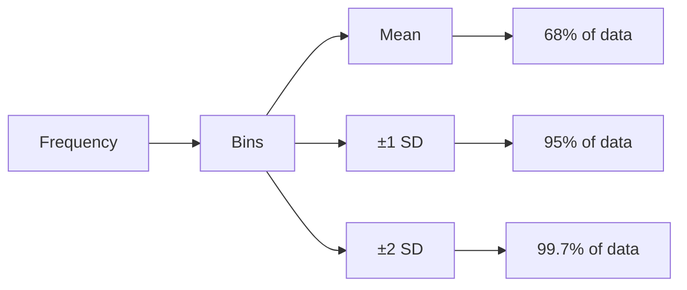
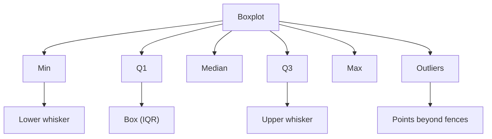
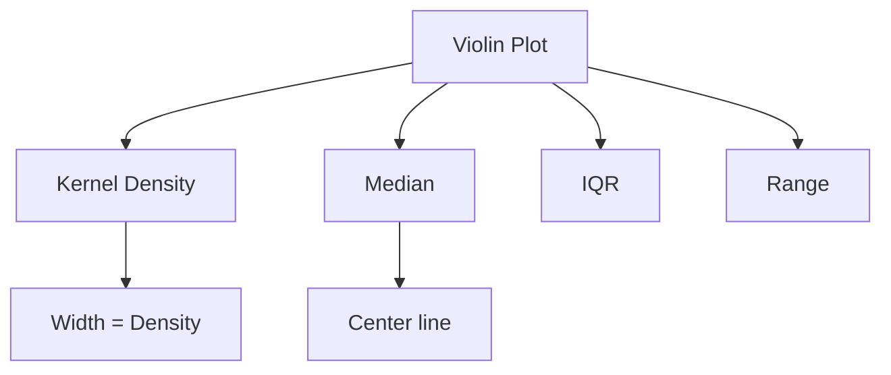
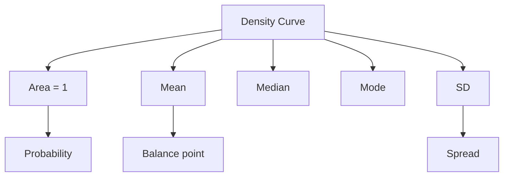

# 📊 Chapter 3: Measures of Dispersion

## *Spread, Variability, and the Art of Trusting Your Data*

<div align="center">

[](https://github.com/your-repo)
[](LICENSE)
[]()
[]()
[]()

**[⬅ Previous: Chapter 2 - Central Tendency](./02-central-tendency.md) · [🏠 Home](../README.md) · [➡ Next: Chapter 4 - Correlation](./04-correlation.md)**

</div>

---

> *"The mean is the center of the data, but the standard deviation is the radius of trust."* — **Anonymous Statistician**

> *"Two datasets can have identical means yet describe entirely different realities. Dispersion tells you how much to trust the 'typical value' as representative of the whole."* — **Author Unknown**

> *"Without a measure of dispersion, a mean is just a number looking for a story."* — **Modern Statistical Wisdom**

---

## 📋 Table of Contents

```mermaid
flowchart TD
    A["📊 Chapter 3:<br>Measures of Dispersion"] --> B["🎯 Learning Objectives"]
    A --> C["💡 Introduction"]
    A --> D["📜 History"]
    A --> E["📐 Mathematical Foundation"]
    A --> F["📊 Core Measures"]
    A --> G["🔄 Advanced Measures"]
    A --> H["🌍 Applications"]
    A --> I["✏️ Worked Examples"]
    A --> J["💻 Software Implementation"]
    A --> K["🏥 Real Research Examples"]
    A --> L["❌ Common Mistakes"]
    A --> M["🕵️ Reviewer Perspective"]
    A --> N["🤖 AI Evaluation Perspective"]
    A --> O["❓ FAQ"]
    A --> P["📝 Assessment"]
    A --> Q["📚 Summary"]
    
    F --> F1["1️⃣ Range"]
    F --> F2["2️⃣ IQR"]
    F --> F3["3️⃣ Quartile Deviation"]
    F --> F4["4️⃣ Mean Absolute Deviation"]
    F --> F5["5️⃣ Variance"]
    F --> F6["6️⃣ Standard Deviation"]
    F --> F7["7️⃣ Coefficient of Variation"]
    
    G --> G1["8️⃣ Relative Variability"]
    G --> G2["9️⃣ Standard Error"]
    G --> G3["🔟 Z-score"]
    G --> G4["11️⃣ Standardization"]
    
    H --> H1["🏥 Clinical Trials"]
    H --> H2["🌍 DHS/WHO"]
    H --> H3["🤖 AI/ML"]
    H --> H4["🧬 Biology/Medicine"]
```



---

## 🎯 Learning Objectives

| Level | Objectives |
|-------|------------|
| **🏗️ Foundational** | ✅ Compute range, IQR, quartile deviation, variance, and SD by hand |
| | ✅ Understand the difference between population and sample variance |
| | ✅ Interpret standard deviation using the Empirical Rule |
| | ✅ Identify outliers using IQR-based fences |
| | ✅ Calculate mean absolute deviation and coefficient of variation |
| **📈 Intermediate** | ✅ Derive the variance formula and understand Bessel's correction |
| | ✅ Calculate and interpret the coefficient of variation |
| | ✅ Understand standard error vs. standard deviation |
| | ✅ Compute and interpret Z-scores |
| **🎓 Advanced** | ✅ Critically evaluate variability claims in research |
| | ✅ Apply variability concepts to AI/ML contexts |
| | ✅ Explain the mathematical properties of variance and SD |
| | ✅ Use variability measures for hypothesis testing |

---

## 🧭 Prerequisites

**Required Knowledge:**
- ✅ Chapter 1: Descriptive Statistics
- ✅ Chapter 2: Measures of Central Tendency
- ✅ Summation notation ($\Sigma$)
- ✅ Basic algebra and square roots
- ✅ Understanding of data types (nominal, ordinal, interval, ratio)

**Estimated Study Time:** ⏱️ 3 – 5 hours

---

## 💡 Section 1: Introduction

### Why Dispersion Matters

> [!IMPORTANT]
> **The Central Question:** If central tendency tells you where the data are centered, dispersion tells you how much you should trust that center.

**The Two Classes Story:**

| Class | Scores | Mean | Dispersion Pattern |
|-------|--------|------|-------------------|
| **Class A** | 73, 74, 75, 75, 76, 77 | 75 | Tightly clustered, reliable |
| **Class B** | 20, 40, 60, 75, 90, 100, 120 | 75 | Widely spread, unreliable |

**Key Insight:** Both classes have the same mean (75), but they represent completely different realities. Dispersion measures quantify the difference.

**The Four Pillars of Data Description:**
1. **Central Tendency** (Where is the center?)
2. **Dispersion** (How spread out is the data?)
3. **Shape** (What is the distribution pattern?)
4. **Outliers** (Are there extreme values?)

**Dispersion Answers These Questions:**
- How consistent are the measurements?
- How much does the data vary?
- How reliable is the mean?
- How different are observations from each other?
- What is the range of typical values?

**Real-World Importance:**

| Domain | Why Dispersion Matters |
|--------|----------------------|
| **Medicine** | Variation in treatment response determines patient outcomes |
| **Finance** | Risk is measured by variability of returns |
| **Manufacturing** | Quality control requires monitoring variability |
| **Education** | Test score variability indicates teaching effectiveness |
| **Public Health** | Disease incidence variability guides resource allocation |
| **AI/ML** | Model uncertainty is captured by prediction variability |

---

## 📜 Section 2: History

### The Evolution of Dispersion Measures

**Ancient Roots (300 BCE - 1700s):**
- **Range** was used in ancient astronomy to describe star positions
- **Aristotle** discussed variability in biological measurements
- **Early astronomers** used maximum-minimum spread

**The 18th Century - Birth of Modern Statistics:**

| Year | Figure | Contribution |
|------|--------|--------------|
| **1749** | Thomas Simpson | First use of mean deviation |
| **1755** | Tobias Mayer | Used range in astronomical observations |
| **1777** | Daniel Bernoulli | Discussed variability in population studies |
| **1793** | Laplace | Developed the first formal measures of dispersion |

**The 19th Century - The Golden Age:**

| Year | Figure | Contribution |
|------|--------|--------------|
| **1815** | Gauss | Introduced standard deviation in astronomy |
| **1823** | Gauss | Developed the method of least squares |
| **1838** | Bessel | Proposed Bessel's correction ($n-1$) |
| **1877** | Galton | Used quartiles and percentiles |
| **1889** | Galton | Introduced the concept of "standard deviation" |
| **1893** | Pearson | Formalized the variance formula |
| **1894** | Pearson | Distinguished population vs. sample |

**The 20th Century - Modern Era:**

| Year | Figure | Contribution |
|------|--------|--------------|
| **1908** | Student (Gosset) | Developed t-distribution with SD |
| **1913** | Fisher | Advanced analysis of variance (ANOVA) |
| **1920s** | Fisher | Developed coefficient of variation |
| **1950s** | Tukey | Developed robust measures (IQR) |
| **1960s** | Tukey | Introduced exploratory data analysis |
| **1970s** | Box & Jenkins | Advanced time series variability |

**The 21st Century - Computational Era:**
- **Machine Learning**: Variability in predictions and feature importance
- **Big Data**: Scaling dispersion measures to large datasets
- **Deep Learning**: Understanding model uncertainty
- **Bayesian Methods**: Variability expressed as credible intervals

**Historical Significance:**
> "The history of dispersion measures is the history of understanding uncertainty itself. From ancient astronomy to modern machine learning, measuring variability has been essential to scientific progress."

---

## 📐 Section 3: Mathematical Foundation

### Core Definitions

#### Section 3.1: Basic Concepts

> 📖 **Definition - Variability**: The extent to which data points in a distribution differ from each other and from the central tendency.

> 📖 **Definition - Spread**: The degree of dispersion or scatter of observations around their central value.

> 📖 **Definition - Homogeneity**: When data points are similar and clustered closely together.

> 📖 **Definition - Heterogeneity**: When data points are dissimilar and spread widely apart.

#### Section 3.2: Mathematical Notation

**Summation Notation:**
$$\sum_{i=1}^{n} x_i = x_1 + x_2 + ... + x_n$$

**Mean:**
$$\bar{x} = \frac{1}{n}\sum_{i=1}^{n} x_i$$

**Deviations:**
$$d_i = x_i - \bar{x}$$

**Properties of Deviations:**
$$\sum_{i=1}^{n} (x_i - \bar{x}) = 0$$

**Squared Deviations:**
$$d_i^2 = (x_i - \bar{x})^2$$

**Absolute Deviations:**
$$|d_i| = |x_i - \bar{x}|$$

#### Section 3.3: Fundamental Theorems

**Theorem 1: The Minimum Property**
The sum of squared deviations is minimized when deviations are taken from the mean.

**Proof:**
Let $S(c) = \sum_{i=1}^{n} (x_i - c)^2$

To find the minimum:
$$\frac{dS}{dc} = -2\sum_{i=1}^{n} (x_i - c) = 0$$
$$\sum_{i=1}^{n} x_i - nc = 0$$
$$c = \frac{1}{n}\sum_{i=1}^{n} x_i = \bar{x}$$

**Theorem 2: The ANOVA Decomposition**
$$\sum_{i=1}^{n} (x_i - \bar{x})^2 = \sum_{i=1}^{n} x_i^2 - n\bar{x}^2$$

**Proof:**
$$\sum (x_i - \bar{x})^2 = \sum (x_i^2 - 2x_i\bar{x} + \bar{x}^2)$$
$$= \sum x_i^2 - 2\bar{x}\sum x_i + n\bar{x}^2$$
$$= \sum x_i^2 - 2n\bar{x}^2 + n\bar{x}^2$$
$$= \sum x_i^2 - n\bar{x}^2$$

#### Section 3.4: Degrees of Freedom

> 📖 **Definition - Degrees of Freedom**: The number of independent pieces of information available to estimate a parameter.

**Key Concept:**
- When estimating the mean, we use $n$ observations
- But when we estimate the mean, we "lose" one degree of freedom
- Reason: The deviations sum to zero, so one deviation is determined by the others

$$\text{df} = n - 1 \text{ for sample variance}$$

**Intuition:**
- With $n=1$ observation, we can estimate the mean (it's the observation itself)
- But we cannot estimate variance (no information about spread)
- With $n=2$ observations, we can estimate variance (the distance between them)
- But with $n=1$, variance is undefined

#### Section 3.5: Bessel's Correction

> 📖 **Definition - Bessel's Correction**: Using $n-1$ instead of $n$ in the denominator of the sample variance to make it an unbiased estimator.

**Why $n-1$?**

When using the sample mean $\bar{x}$ instead of the true population mean $\mu$:
- The sum of squared deviations is always smaller than it would be if we used $\mu$
- This causes a downward bias in the variance estimate
- Dividing by $n-1$ corrects this bias

**Proof of Unbiasedness:**
$$E[s^2] = E\left[\frac{1}{n-1}\sum_{i=1}^{n}(x_i - \bar{x})^2\right] = \sigma^2$$

**Intuitive Explanation:**
- The sample mean $\bar{x}$ is "too close" to the data points
- This artificially reduces the sum of squared deviations
- Dividing by $n-1$ compensates for this "too close" phenomenon

---

## 📊 Section 4: Importance

### Why Measure Variability?

#### Section 4.1: Scientific Importance

**1. Understanding Uncertainty**
- Every measurement has error
- Variability quantifies this uncertainty
- Without variability, we can't assess reliability

**2. Hypothesis Testing**
- Variability is essential for hypothesis testing
- Larger variability = less power to detect differences
- Smaller variability = more power to detect differences

**3. Quality Control**
- Manufacturing tolerances depend on variability
- Process control requires measuring variability
- Out-of-control processes show increased variability

**4. Risk Assessment**
- Financial risk is measured by variability
- Health risks depend on variability in exposure
- Engineering risks depend on variability in materials

#### Section 4.2: Practical Applications

**Medical Research:**
- Treatment response variability
- Disease progression variability
- Diagnostic test variability
- Genetic variability

**Public Health:**
- Disease incidence variability
- Health outcome variability
- Risk factor variability
- Healthcare access variability

**Business and Economics:**
- Sales variability
- Stock price variability
- Customer behavior variability
- Economic indicator variability

**Machine Learning:**
- Prediction variability
- Feature variability
- Model uncertainty
- Error variability

#### Section 4.3: Decision-Making

**When Variability Matters for Decisions:**

| Decision Type | Why Variability Matters |
|---------------|----------------------|
| **Clinical** | Treatment effectiveness varies by patient |
| **Financial** | Investment returns vary over time |
| **Policy** | Program impacts vary across populations |
| **Quality** | Product quality varies across batches |
| **Research** | Study results vary across samples |

---

## 📊 Section 5: Core Measures of Dispersion

### Section 5.1: Range

> 📖 **Definition - Range**: The difference between the maximum and minimum values in a dataset.

$$\text{Range} = x_{\text{max}} - x_{\text{min}}$$

**Properties:**
- ✅ Very simple to calculate and understand
- ✅ Provides a quick sense of spread
- ❌ Extremely sensitive to outliers
- ❌ Ignores all data points except extremes
- ❌ Not stable across samples

**Example:**
```text
Dataset: 118, 119, 121, 122, 125, 128, 130, 138, 145, 150
Range = 150 - 118 = 32 mmHg
```

**Interpretation:** The blood pressure values span 32 mmHg from minimum to maximum.

**Effect of Outlier:**
```text
With Outlier: 118, 119, 121, 122, 125, 128, 130, 138, 145, 300
Range = 300 - 118 = 182 mmHg (↑ 150 mmHg!)
```

> [!WARNING]
> **Caution:** The range is highly sensitive to outliers. A single extreme value can dramatically change the range, making it misleading for most datasets.

---

### Section 5.2: Interquartile Range (IQR)

> 📖 **Definition - Interquartile Range**: The difference between the third quartile (Q3) and first quartile (Q1).

$$IQR = Q_3 - Q_1$$

**Properties:**
- ✅ Robust to outliers (breakdown point = 25%)
- ✅ Represents the middle 50% of data
- ✅ Used in boxplots
- ✅ Works for skewed distributions
- ❌ Loses information about the tails

**Outlier Fences (Tukey's Rule):**
$$\text{Lower fence} = Q_1 - 1.5 \times IQR$$
$$\text{Upper fence} = Q_3 + 1.5 \times IQR$$

**Example:**
```text
Dataset: 118, 119, 121, 122, 125, 128, 130, 138, 145, 150

Q1 = 121.25 mmHg
Q3 = 137.0 mmHg
IQR = 137.0 - 121.25 = 15.75 mmHg

Interpretation: The middle 50% of blood pressure values span 15.75 mmHg.
```

**Outlier Detection:**
```text
Lower fence = 121.25 - 1.5 × 15.75 = 97.625
Upper fence = 137.0 + 1.5 × 15.75 = 160.625

All values are between fences → No outliers!

With Outlier: 118, 119, 121, 122, 125, 128, 130, 138, 145, 300
300 > 160.625 → 300 is an outlier! ✓
```

---

### Section 5.3: Quartile Deviation

> 📖 **Definition - Quartile Deviation**: Half the difference between the third and first quartiles.

$$QD = \frac{Q_3 - Q_1}{2} = \frac{IQR}{2}$$

**Properties:**
- ✅ Robust to outliers
- ✅ Easy to understand
- ✅ Represents the spread of the middle 50%
- ❌ Loses information about the tails
- ❌ Less commonly used than IQR

**Example:**
```text
Dataset: 118, 119, 121, 122, 125, 128, 130, 138, 145, 150

Q1 = 121.25 mmHg
Q3 = 137.0 mmHg
QD = (137.0 - 121.25) / 2 = 7.875 mmHg

Interpretation: Half the interquartile range is 7.875 mmHg.
```

**Comparison with Other Measures:**

| Measure | Value |
|---------|-------|
| Range | 32 mmHg |
| IQR | 15.75 mmHg |
| Quartile Deviation | 7.875 mmHg |
| SD | 11.19 mmHg |

---

### Section 5.4: Mean Absolute Deviation (MAD)

> 📖 **Definition - Mean Absolute Deviation**: The average of the absolute deviations from the mean.

$$MAD = \frac{1}{n}\sum_{i=1}^{n}|x_i - \bar{x}|$$

**Properties:**
- ✅ Same units as data
- ✅ Intuitive interpretation
- ✅ Less sensitive to outliers than variance
- ✅ Easy to understand
- ❌ Less mathematically tractable than variance
- ❌ Less commonly used in statistical tests

**Example - Blood Pressure Data:**

| $x_i$ | $x_i - \bar{x}$ | $\|x_i - \bar{x}\|$ |
|-------|-----------------|---------------------|
| 118 | -11.6 | 11.6 |
| 119 | -10.6 | 10.6 |
| 121 | -8.6 | 8.6 |
| 122 | -7.6 | 7.6 |
| 125 | -4.6 | 4.6 |
| 128 | -1.6 | 1.6 |
| 130 | 0.4 | 0.4 |
| 138 | 8.4 | 8.4 |
| 145 | 15.4 | 15.4 |
| 150 | 20.4 | 20.4 |

$$\sum |x_i - \bar{x}| = 88.4$$
$$MAD = \frac{88.4}{10} = 8.84 \text{ mmHg}$$

**Interpretation:** The typical absolute deviation from the mean is 8.84 mmHg.

**MAD vs. SD:**
- MAD = 8.84 mmHg
- SD = 11.19 mmHg
- SD > MAD because squaring gives more weight to large deviations

---

### Section 5.5: Variance

#### Population Variance

> 📖 **Definition - Population Variance**: The average of squared deviations from the population mean.

$$\sigma^2 = \frac{1}{N}\sum_{i=1}^{N}(x_i - \mu)^2$$

**Properties:**
- ✅ Uses all data
- ✅ Mathematically tractable
- ✅ Basis for many statistical methods
- ❌ In squared units (hard to interpret)
- ❌ Sensitive to outliers

#### Sample Variance

> 📖 **Definition - Sample Variance**: The average of squared deviations from the sample mean, with $n-1$ denominator.

$$s^2 = \frac{1}{n-1}\sum_{i=1}^{n}(x_i - \bar{x})^2$$

**Properties:**
- ✅ Unbiased estimator of $\sigma^2$
- ✅ Uses all data
- ✅ Basis for inferential statistics
- ❌ In squared units (hard to interpret)
- ❌ Sensitive to outliers

#### Computational Formula

$$s^2 = \frac{\sum x_i^2 - \frac{(\sum x_i)^2}{n}}{n-1}$$

#### Worked Example - Blood Pressure Data:

| $x_i$ | $x_i^2$ |
|-------|---------|
| 118 | 13,924 |
| 119 | 14,161 |
| 121 | 14,641 |
| 122 | 14,884 |
| 125 | 15,625 |
| 128 | 16,384 |
| 130 | 16,900 |
| 138 | 19,044 |
| 145 | 21,025 |
| 150 | 22,500 |

$$\sum x_i = 1296$$
$$\sum x_i^2 = 169,088$$
$$\bar{x} = 129.6$$

$$s^2 = \frac{169,088 - \frac{1296^2}{10}}{9}$$
$$s^2 = \frac{169,088 - \frac{1,679,616}{10}}{9}$$
$$s^2 = \frac{169,088 - 167,961.6}{9}$$
$$s^2 = \frac{1,126.4}{9} = 125.16 \text{ mmHg}^2$$

**Interpretation:** The average squared deviation from the mean is 125.16 mmHg².

---

### Section 5.6: Standard Deviation

> 📖 **Definition - Standard Deviation**: The square root of the variance.

$$s = \sqrt{s^2} = \sqrt{\frac{1}{n-1}\sum_{i=1}^{n}(x_i - \bar{x})^2}$$

**Properties:**
- ✅ In the same units as the data
- ✅ Intuitive interpretation
- ✅ Basis for the Empirical Rule
- ✅ Widely used and understood
- ❌ Sensitive to outliers

#### The Standard Deviation as a Ruler

The standard deviation acts as a "ruler" for measuring how far observations are from the mean.

**Empirical Rule (68-95-99.7 Rule):**

For approximately normal distributions:

| Interval | % of Data | Interpretation |
|----------|-----------|----------------|
| $\bar{x} \pm 1s$ | 68% | Most values are within 1 SD |
| $\bar{x} \pm 2s$ | 95% | Almost all values are within 2 SDs |
| $\bar{x} \pm 3s$ | 99.7% | Virtually all values are within 3 SDs |

**Example - Blood Pressure Data:**
$$s = \sqrt{125.16} = 11.19 \text{ mmHg}$$

**Interpretation:** The typical deviation from the mean blood pressure is about 11.19 mmHg.

**95% Range (Empirical Rule):**
$$\bar{x} \pm 2s = 129.6 \pm 2(11.19) = 129.6 \pm 22.38 = (107.22, 151.98)$$

**Actual Check:**
- 95% of data should be between 107.22 and 151.98 mmHg
- All 10 values are in this range (100%)
- Close to the expected 95%

---

### Section 5.7: Coefficient of Variation (CV)

> 📖 **Definition - Coefficient of Variation**: The standard deviation divided by the mean, expressed as a percentage.

$$CV = \frac{s}{\bar{x}} \times 100\%$$

**Properties:**
- ✅ Unit-free (dimensionless)
- ✅ Allows comparison across different units
- ✅ Useful for comparing variability
- ❌ Only valid for ratio scale data
- ❌ Unstable when mean is near zero

**Interpretation Guidelines:**

| CV Value | Interpretation |
|----------|----------------|
| < 10% | Low variability, very consistent |
| 10% - 30% | Moderate variability |
| > 30% | High variability, highly variable |

**Example - Blood Pressure Data:**
$$CV = \frac{11.19}{129.6} \times 100\% = 8.6\%$$

**Interpretation:** The blood pressure values have relatively low variability (CV < 10%).

**Comparison Example:**

| Variable | Mean | SD | CV |
|----------|------|-----|-----|
| Height (cm) | 170 | 10 | 5.9% |
| Weight (kg) | 70 | 10 | 14.3% |

**Interpretation:** Weight is more variable relative to its scale than height, even though both have SD = 10.

---

## 🔄 Section 6: Advanced Measures

### Section 6.1: Relative Variability

> 📖 **Definition - Relative Variability**: A measure of variability that accounts for the scale of measurement.

**Common Measures of Relative Variability:**
1. **Coefficient of Variation** ($CV = \frac{s}{\bar{x}} \times 100\%$)
2. **Relative Range** ($RR = \frac{\text{Range}}{\bar{x}} \times 100\%$)
3. **Relative IQR** ($RIQR = \frac{IQR}{\text{Median}} \times 100\%$)

**When to Use:**
- Comparing variability across different units
- Comparing variability across different scales
- Assessing consistency relative to the mean

**Example - Comparing Different Variables:**
```text
Variable A: Mean = 100, SD = 15, CV = 15%
Variable B: Mean = 50, SD = 10, CV = 20%

Interpretation: Variable B has more relative variability.
```

---

### Section 6.2: Standard Error (SE)

> 📖 **Definition - Standard Error**: The standard deviation of the sampling distribution of a statistic.

$$SE_{\bar{x}} = \frac{s}{\sqrt{n}}$$

**Key Distinction:**

| Aspect | Standard Deviation (SD) | Standard Error (SE) |
|--------|------------------------|---------------------|
| What it measures | Variability in the data | Variability in the estimate |
| Formula | $s = \sqrt{\frac{\sum(x_i - \bar{x})^2}{n-1}}$ | $SE = \frac{s}{\sqrt{n}}$ |
| Interpretation | Spread of individual values | Precision of the mean |
| Use | Describing data | Confidence intervals, testing |
| Changes with sample size | Stable | Decreases as n increases |

**Example:**
```text
Blood Pressure Data:
SD = 11.19 mmHg
n = 10
SE = 11.19 / √10 = 11.19 / 3.162 = 3.54 mmHg

Interpretation: The mean (129.6 mmHg) is estimated with a standard error of 3.54 mmHg.
```

**Confidence Interval Using SE:**
$$\bar{x} \pm t_{n-1, 0.975} \times SE$$

95% CI = 129.6 ± 2.262 × 3.54 = 129.6 ± 8.00 = (121.6, 137.6)

---

### Section 6.3: Z-Score

> 📖 **Definition - Z-Score**: The number of standard deviations an observation is from the mean.

$$Z = \frac{x - \bar{x}}{s}$$

**Properties:**
- ✅ Standardizes observations
- ✅ Allows comparison across different scales
- ✅ Identifies outliers
- ✅ Has a standard distribution (mean = 0, SD = 1)

**Interpretation Guidelines:**

| Z-Score | Interpretation |
|---------|----------------|
| 0 | Exactly at the mean |
| ±1 | Within 1 SD of mean (normal) |
| ±1.5 | Moderate deviation |
| ±2 | Unusual (95% of data within ±2) |
| ±3 | Very unusual (99.7% of data within ±3) |
| > ±3 | Potential outlier |

**Example - Blood Pressure Data:**

| $x_i$ | $Z = (x - 129.6) / 11.19$ |
|-------|---------------------------|
| 118 | -1.04 |
| 119 | -0.95 |
| 121 | -0.77 |
| 122 | -0.68 |
| 125 | -0.41 |
| 128 | -0.14 |
| 130 | 0.04 |
| 138 | 0.75 |
| 145 | 1.38 |
| 150 | 1.82 |

**Interpretation:** 
- 150 mmHg has Z = 1.82 (moderately high, but not an outlier)
- No Z-score > 3 or < -3 (no outliers)

---

### Section 6.4: Standardization

> 📖 **Definition - Standardization**: The process of transforming data to have a mean of 0 and standard deviation of 1.

$$z_i = \frac{x_i - \bar{x}}{s}$$

**Uses of Standardization:**
1. **Comparing variables**: Making variables comparable
2. **Machine learning**: Feature scaling for algorithms
3. **Outlier detection**: Identifying unusual observations
4. **Statistical testing**: Standardized test statistics

**Example - Comparing Two Variables:**

| Person | Height (cm) | Height Z-score | Weight (kg) | Weight Z-score |
|--------|-------------|----------------|-------------|----------------|
| 1 | 160 | -1.5 | 55 | -1.5 |
| 2 | 165 | -1.0 | 58 | -1.1 |
| 3 | 168 | -0.6 | 60 | -0.8 |
| 4 | 170 | -0.4 | 62 | -0.5 |
| 5 | 172 | -0.1 | 65 | -0.1 |
| 6 | 175 | 0.3 | 68 | 0.2 |
| 7 | 178 | 0.7 | 70 | 0.5 |
| 8 | 180 | 1.0 | 72 | 0.8 |
| 9 | 183 | 1.4 | 75 | 1.2 |
| 10 | 185 | 1.8 | 78 | 1.6 |

**Interpretation:** Z-scores allow direct comparison of height and weight even though they're in different units.

---

## 🌍 Section 7: Applications

### Section 7.1: Variability in Biology

**Biological Systems and Variability:**
- Genetic variability (differences in genes)
- Phenotypic variability (differences in traits)
- Environmental variability (differences in conditions)
- Measurement variability (differences in methods)

**Examples:**

| Biological Measure | Typical Variation | CV Range |
|-------------------|-------------------|----------|
| Heart rate | ±10 bpm | 10-15% |
| Blood pressure | ±20 mmHg | 8-15% |
| Height | ±15 cm | 4-6% |
| Weight | ±20 kg | 10-20% |
| Lab measurements | Variable | 5-25% |

**Importance in Biology:**
- Natural variation is essential for evolution
- Variation drives adaptation
- Variation indicates health or disease
- Variation guides treatment decisions

---

### Section 7.2: Variability in Medicine

**Clinical Variability:**
- Patient-to-patient variation
- Within-patient variation (over time)
- Measurement error variation
- Treatment response variation

**Common Clinical Applications:**

| Application | Variability Measure Used |
|-------------|------------------------|
| Reference ranges | Mean ± 2 SD |
| Treatment effects | Confidence intervals |
| Diagnostic tests | SD of test results |
| Quality metrics | IQR and outliers |

**Example - Blood Pressure Reference Ranges:**
```text
Population: Healthy adults
Mean SBP = 120 mmHg
SD = 15 mmHg

Normal Range: 120 ± 2(15) = 90 to 150 mmHg

Interpretation: 95% of healthy adults have SBP between 90 and 150 mmHg.
```

---

### Section 7.3: Variability in Public Health

**Public Health Applications:**

| Application | Variability Role |
|-------------|------------------|
| Disease surveillance | Monitoring incidence variability |
| Risk assessment | Assessing variability in risk factors |
| Resource allocation | Planning for variable demand |
| Health disparities | Measuring between-group variability |
| Program evaluation | Assessing impact variability |

**Example - Disease Incidence Variability:**
```text
COVID-19 Daily Cases:
Mean = 1,000 cases/day
SD = 500 cases/day
CV = 50%

Interpretation: High variability in daily cases
- Needs flexible healthcare capacity
- Planning must account for surges
- Resources should be allocated for worst-case scenarios
```

**Public Health Decision Framework:**
- Low variability → stable planning possible
- High variability → flexible planning needed
- Understanding variability guides resource allocation

---

### Section 7.4: Variability in AI and Machine Learning

**Why Variability Matters in AI/ML:**

| AI/ML Aspect | Role of Variability |
|--------------|--------------------|
| Feature scaling | Standardization uses SD |
| Model evaluation | Variability in predictions |
| Uncertainty estimation | Prediction intervals |
| Ensemble methods | Variability across models |
| Anomaly detection | Deviation from normal |

**Common AI/ML Applications:**

1. **Feature Scaling:**
```python
from sklearn.preprocessing import StandardScaler
scaler = StandardScaler()
X_scaled = scaler.fit_transform(X)  # Uses mean and SD
```

2. **Model Evaluation:**
```text
Model A: Mean accuracy = 85%, SD = 2%
Model B: Mean accuracy = 83%, SD = 5%

Interpretation: Model A is more consistent
Even though Model A has higher accuracy, its lower variability makes it more reliable.
```

3. **Uncertainty Quantification:**
```python
# Using Monte Carlo dropout
predictions = []
for i in range(100):
    predictions.append(model.predict(X))
mean_pred = np.mean(predictions)
sd_pred = np.std(predictions)  # Model uncertainty
```

4. **Outlier Detection:**
```python
# Using Z-score for anomaly detection
z_scores = (data - mean) / sd
outliers = data[np.abs(z_scores) > 3]
```

---

### Section 7.5: Variability in Economics and Finance

**Financial Applications:**

| Application | Variability Measure |
|-------------|--------------------|
| Risk assessment | SD of returns |
| Portfolio optimization | Variance-covariance matrix |
| Risk-adjusted returns | Sharpe ratio = (Return - RF)/SD |
| Volatility | Annualized SD |
| Value at Risk (VaR) | SD-based quantile estimates |

**Example - Investment Comparison:**

| Investment | Mean Return | SD | Sharpe Ratio |
|------------|-------------|-----|--------------|
| Bond Fund | 5% | 2% | 1.5 |
| Stock Fund | 10% | 8% | 0.875 |
| Tech Fund | 15% | 15% | 0.8 |

**Interpretation:**
- Bond Fund: Lowest risk (SD = 2%)
- Tech Fund: Highest risk (SD = 15%)
- Risk-adjusted performance: Bond Fund best (Sharpe = 1.5)

---

## ✏️ Section 8: Worked Examples

### Example 1: Clinical Trial Blood Pressure Data 🏥

**Dataset:** 118, 119, 121, 122, 125, 128, 130, 138, 145, 150

**Step 1:** Calculate mean
$$\bar{x} = 129.6 \text{ mmHg}$$

**Step 2:** Calculate range
$$\text{Range} = 150 - 118 = 32 \text{ mmHg}$$

**Step 3:** Calculate quartiles
$$Q_1 = 121.25, \quad Q_3 = 137.0$$
$$IQR = 137.0 - 121.25 = 15.75 \text{ mmHg}$$

**Step 4:** Calculate quartile deviation
$$QD = \frac{15.75}{2} = 7.875 \text{ mmHg}$$

**Step 5:** Calculate MAD
$$MAD = 8.84 \text{ mmHg}$$

**Step 6:** Calculate variance
$$s^2 = 125.16 \text{ mmHg}^2$$

**Step 7:** Calculate standard deviation
$$s = 11.19 \text{ mmHg}$$

**Step 8:** Calculate CV
$$CV = \frac{11.19}{129.6} \times 100\% = 8.6\%$$

**Step 9:** Calculate Z-scores
| $x_i$ | Z-score |
|-------|---------|
| 118 | -1.04 |
| 119 | -0.95 |
| 121 | -0.77 |
| 122 | -0.68 |
| 125 | -0.41 |
| 128 | -0.14 |
| 130 | 0.04 |
| 138 | 0.75 |
| 145 | 1.38 |
| 150 | 1.82 |

**Step 10:** Outlier detection (Tukey's fences)
$$\text{Lower fence} = 121.25 - 1.5(15.75) = 97.625$$
$$\text{Upper fence} = 137.0 + 1.5(15.75) = 160.625$$
No outliers detected.

**Summary Table:**

| Measure | Value |
|---------|-------|
| Range | 32 mmHg |
| IQR | 15.75 mmHg |
| Quartile Deviation | 7.875 mmHg |
| MAD | 8.84 mmHg |
| Variance | 125.16 mmHg² |
| SD | 11.19 mmHg |
| CV | 8.6% |
| Lower Fence | 97.625 mmHg |
| Upper Fence | 160.625 mmHg |

**Interpretation:** The blood pressure data show relatively low variability (CV = 8.6%). The typical deviation from the mean is about 11.19 mmHg. There are no outliers.

---

### Example 2: Effect of an Outlier ⚠️

**Original Data:** 118, 119, 121, 122, 125, 128, 130, 138, 145, 150
**With Outlier:** 118, 119, 121, 122, 125, 128, 130, 138, 145, 300

| Measure | Original | With Outlier | Change |
|---------|----------|--------------|--------|
| Mean | 129.6 | 134.6 | +5.0 |
| Median | 126.5 | 126.5 | 0 |
| Range | 32 | 182 | +150 |
| IQR | 15.75 | 15.75 | 0 |
| Quartile Deviation | 7.875 | 7.875 | 0 |
| MAD | 8.84 | 24.65 | +15.81 |
| Variance | 125.16 | 3,015.6 | +2,890.4 |
| SD | 11.19 | 54.92 | +43.73 |
| CV | 8.6% | 40.8% | +32.2% |

> [!IMPORTANT]
> **Key Insight:** 
> - **Range** is extremely sensitive (+150)
> - **IQR** is completely robust (0 change)
> - **Quartile Deviation** is completely robust (0 change)
> - **SD** is very sensitive (+43.73)
> - **CV** is very sensitive (+32.2%)

---

### Example 3: Comparing Variability Across Variables 📊

**Dataset:** Height (cm) and Weight (kg) for 10 people

| Person | Height (cm) | Weight (kg) |
|--------|-------------|-------------|
| 1 | 160 | 55 |
| 2 | 165 | 58 |
| 3 | 168 | 60 |
| 4 | 170 | 62 |
| 5 | 172 | 65 |
| 6 | 175 | 68 |
| 7 | 178 | 70 |
| 8 | 180 | 72 |
| 9 | 183 | 75 |
| 10 | 185 | 78 |

**Height:**
- Mean = 173.6 cm
- SD = 7.86 cm
- CV = 7.86/173.6 × 100% = 4.5%
- Range = 185 - 160 = 25 cm
- IQR = 7.875 cm

**Weight:**
- Mean = 66.3 kg
- SD = 7.43 kg
- CV = 7.43/66.3 × 100% = 11.2%
- Range = 78 - 55 = 23 kg
- IQR = 9.25 kg

**Comparison:**

| Measure | Height | Weight |
|---------|--------|--------|
| SD | 7.86 | 7.43 |
| CV | 4.5% | 11.2% |
| IQR | 7.875 | 9.25 |

**Interpretation:** 
- Weight has higher relative variability (CV = 11.2% vs 4.5%)
- Even though SDs are similar, weight varies more relative to its mean
- This is meaningful for understanding biological variation

---

### Example 4: Outlier Detection Using IQR 🔍

**Dataset:** 2, 3, 4, 5, 6, 7, 8, 9, 10, 11, 12, 13, 14, 15, 16, 100

**Step 1:** Sort data (already sorted)

**Step 2:** Calculate quartiles
$$Q_1 = 5.25, \quad Q_3 = 14.75$$
$$IQR = 14.75 - 5.25 = 9.5$$

**Step 3:** Calculate fences
$$\text{Lower fence} = 5.25 - 1.5(9.5) = -9.0$$
$$\text{Upper fence} = 14.75 + 1.5(9.5) = 29.0$$

**Step 4:** Identify outliers
$$100 > 29.0 \rightarrow 100 \text{ is an outlier!}$$

**Step 5:** Calculate Z-scores
Mean = 14.81, SD = 22.23

| Value | Z-score |
|-------|---------|
| 100 | 3.83 |
| 2 | -0.58 |
| 3 | -0.53 |

**Interpretation:** 
- 100 has Z-score = 3.83 (> 3) → outlier
- IQR method and Z-score method both identify the outlier

---

### Example 5: Empirical Rule Application 📈

**Dataset:** IQ scores (mean = 100, SD = 15)

**Step 1:** Calculate intervals
- Mean ± 1 SD: 85 to 115
- Mean ± 2 SD: 70 to 130
- Mean ± 3 SD: 55 to 145

**Step 2:** Calculate Z-scores for specific IQ values

| IQ | Z-score | Interpretation |
|----|---------|----------------|
| 70 | -2.0 | Very low, bottom 2.5% |
| 85 | -1.0 | Low normal, bottom 16% |
| 100 | 0 | Average |
| 115 | 1.0 | High normal, top 16% |
| 130 | 2.0 | Very high, top 2.5% |
| 145 | 3.0 | Extremely high, top 0.15% |

**Step 3:** Probability calculations
- P(IQ < 85) = P(Z < -1) = 0.1587 (15.87%)
- P(IQ > 115) = P(Z > 1) = 0.1587 (15.87%)
- P(85 < IQ < 115) = 0.6826 (68.26%)

---

### Example 6: Coefficient of Variation in Finance 💰

**Investment Comparison:**

| Investment | Mean Return | SD | CV |
|------------|-------------|-----|-----|
| Bond Fund | 5% | 2% | 40% |
| Stock Fund | 10% | 8% | 80% |
| Tech Fund | 15% | 15% | 100% |

**Interpretation:**
- Bond Fund: Lowest risk (CV = 40%)
- Stock Fund: Moderate risk (CV = 80%)
- Tech Fund: Highest risk (CV = 100%)

**Risk-Adjusted Analysis:**
- Tech Fund has highest return but highest risk
- Bond Fund has lowest return but lowest risk
- Investor choice depends on risk tolerance

**Sharpe Ratio (Risk-Adjusted Return):**
Assuming risk-free rate = 2%

| Investment | Sharpe Ratio | Interpretation |
|------------|--------------|----------------|
| Bond Fund | (5-2)/2 = 1.5 | Best risk-adjusted |
| Stock Fund | (10-2)/8 = 1.0 | Moderate |
| Tech Fund | (15-2)/15 = 0.87 | Worst risk-adjusted |

---

### Example 7: Standard Error and Confidence Intervals 📊

**Dataset:** Blood Pressure Data
- n = 10
- Mean = 129.6 mmHg
- SD = 11.19 mmHg

**Step 1:** Calculate standard error
$$SE = \frac{11.19}{\sqrt{10}} = 3.54 \text{ mmHg}$$

**Step 2:** Calculate 95% confidence interval (t-distribution, df=9)
$$t_{9, 0.975} = 2.262$$

95% CI = 129.6 ± 2.262 × 3.54
= 129.6 ± 8.01
= (121.59, 137.61)

**Interpretation:** We are 95% confident that the true population mean falls between 121.59 and 137.61 mmHg.

**Step 3:** Effect of sample size on SE

| n | SE | 95% CI Width |
|---|-----|--------------|
| 10 | 3.54 | 16.02 |
| 20 | 2.50 | 11.67 |
| 50 | 1.58 | 7.43 |
| 100 | 1.12 | 5.29 |

**Interpretation:** Larger sample sizes give narrower confidence intervals (more precise estimates).

---

### Example 8: Standardization in Machine Learning 🤖

**Dataset:** Features with different scales

| Feature | Mean | SD | Min | Max |
|---------|------|-----|-----|-----|
| Age | 45 | 15 | 18 | 80 |
| Income | 50,000 | 25,000 | 20,000 | 150,000 |
| Score | 75 | 10 | 50 | 100 |

**Step 1:** Standardize each feature
$$z_{age} = \frac{\text{Age} - 45}{15}$$
$$z_{income} = \frac{\text{Income} - 50,000}{25,000}$$
$$z_{score} = \frac{\text{Score} - 75}{10}$$

**Step 2:** Compare using Z-scores

| Person | Age (Z) | Income (Z) | Score (Z) |
|--------|---------|------------|-----------|
| A | 1.0 | 0.5 | -0.2 |
| B | -0.5 | 1.2 | 0.8 |
| C | 0.0 | -0.8 | 1.5 |

**Interpretation:** 
- Person A: Above average age, slightly above average income, below average score
- Person B: Below average age, well above average income, above average score
- Person C: Average age, below average income, well above average score

**Machine Learning Benefit:** Standardization prevents features with larger scales from dominating the model.

---

## 💻 Section 9: Software Implementation

### R Implementation 📊

<details>
<summary>📋 Click to expand R code (Full Implementation)</summary>

```r
# ============================================
# Chapter 3: Measures of Dispersion
# Comprehensive R Implementation
# ============================================

# Load necessary libraries
library(dplyr)
library(psych)
library(DescTools)
library(ggplot2)
library(gridExtra)

# ============================================
# 1. Create Dataset
# ============================================

# Blood pressure data
bp <- c(118, 122, 130, 145, 119, 125, 138, 128, 121, 150)

# ============================================
# 2. Basic Dispersion Measures
# ============================================

# Range
range_bp <- diff(range(bp))
cat("Range:", range_bp, "mmHg\n")

# Interquartile Range
iqr_bp <- IQR(bp)
cat("IQR:", iqr_bp, "mmHg\n")

# Quartile Deviation
qd_bp <- iqr_bp / 2
cat("Quartile Deviation:", qd_bp, "mmHg\n")

# Mean Absolute Deviation
mad_bp <- mean(abs(bp - mean(bp)))
cat("Mean Absolute Deviation:", mad_bp, "mmHg\n")

# Variance (sample)
var_bp <- var(bp)
cat("Variance:", var_bp, "mmHg^2\n")

# Standard Deviation (sample)
sd_bp <- sd(bp)
cat("Standard Deviation:", sd_bp, "mmHg\n")

# Coefficient of Variation
cv_bp <- sd_bp / mean(bp) * 100
cat("Coefficient of Variation:", cv_bp, "%\n")

# Standard Error
se_bp <- sd_bp / sqrt(length(bp))
cat("Standard Error:", se_bp, "mmHg\n")

# ============================================
# 3. Quartiles and Percentiles
# ============================================

# Quartiles
quartiles <- quantile(bp, probs = c(0.25, 0.5, 0.75))
cat("\nQuartiles:\n")
cat("Q1:", quartiles[1], "mmHg\n")
cat("Median:", quartiles[2], "mmHg\n")
cat("Q3:", quartiles[3], "mmHg\n")

# Five-number summary
summary_bp <- fivenum(bp)
names(summary_bp) <- c("Min", "Q1", "Median", "Q3", "Max")
cat("\nFive-Number Summary:\n")
print(summary_bp)

# ============================================
# 4. Outlier Detection
# ============================================

# Tukey's fences
Q1 <- quantile(bp, 0.25)
Q3 <- quantile(bp, 0.75)
IQR_val <- Q3 - Q1
lower_fence <- Q1 - 1.5 * IQR_val
upper_fence <- Q3 + 1.5 * IQR_val

cat("\nTukey's Fences:\n")
cat("Lower fence:", lower_fence, "mmHg\n")
cat("Upper fence:", upper_fence, "mmHg\n")

# Identify outliers
outliers <- bp[bp < lower_fence | bp > upper_fence]
cat("Outliers:", ifelse(length(outliers) > 0, outliers, "None"), "\n")

# ============================================
# 5. Z-scores
# ============================================

z_scores <- scale(bp)
cat("\nZ-scores:\n")
print(cbind(bp, z_scores))

# ============================================
# 6. Standard Error and Confidence Intervals
# ============================================

# 95% confidence interval for the mean
n <- length(bp)
mean_val <- mean(bp)
sd_val <- sd(bp)
se_val <- sd_val / sqrt(n)
t_val <- qt(0.975, df = n - 1)
ci_lower <- mean_val - t_val * se_val
ci_upper <- mean_val + t_val * se_val

cat("\n95% Confidence Interval:\n")
cat("Lower:", ci_lower, "mmHg\n")
cat("Upper:", ci_upper, "mmHg\n")

# ============================================
# 7. Comprehensive Dispersion Function
# ============================================

dispersion_summary <- function(x) {
  result <- list(
    n = length(x),
    mean = mean(x),
    median = median(x),
    range = diff(range(x)),
    iqr = IQR(x),
    quartile_deviation = IQR(x) / 2,
    mad = mean(abs(x - mean(x))),
    variance = var(x),
    sd = sd(x),
    cv = sd(x) / mean(x) * 100,
    se = sd(x) / sqrt(length(x)),
    q1 = quantile(x, 0.25),
    q3 = quantile(x, 0.75),
    five_num = fivenum(x),
    z_scores = scale(x),
    outlier_fences = c(Q1 - 1.5 * IQR(x), Q3 + 1.5 * IQR(x)),
    outliers = x[x < (quantile(x, 0.25) - 1.5 * IQR(x)) | 
                x > (quantile(x, 0.75) + 1.5 * IQR(x))]
  )
  return(result)
}

# Test function
summary_stats <- dispersion_summary(bp)
print(summary_stats)

# ============================================
# 8. Effect of Outlier
# ============================================

# Add outlier
bp_with_outlier <- c(bp, 300)

# Compare measures
cat("\nEffect of Outlier:\n")
cat("Range - Original:", diff(range(bp)), "With outlier:", diff(range(bp_with_outlier)), "\n")
cat("IQR - Original:", IQR(bp), "With outlier:", IQR(bp_with_outlier), "\n")
cat("SD - Original:", sd(bp), "With outlier:", sd(bp_with_outlier), "\n")
cat("CV - Original:", sd(bp)/mean(bp)*100, "With outlier:", 
    sd(bp_with_outlier)/mean(bp_with_outlier)*100, "\n")

# ============================================
# 9. Visualization
# ============================================

# Create data frames
df <- data.frame(bp = bp)
df_outlier <- data.frame(bp = bp_with_outlier)

# Histogram with SD bands
p1 <- ggplot(df, aes(x = bp)) +
  geom_histogram(bins = 10, alpha = 0.7, fill = "steelblue", color = "black") +
  geom_vline(aes(xintercept = mean(bp)), color = "red", linetype = "solid", size = 1.2) +
  geom_vline(aes(xintercept = mean(bp) - sd(bp)), color = "blue", linetype = "dashed", size = 1) +
  geom_vline(aes(xintercept = mean(bp) + sd(bp)), color = "blue", linetype = "dashed", size = 1) +
  labs(
    title = "Histogram with SD Bands",
    subtitle = "Red = Mean, Blue = ±1 SD",
    x = "Blood Pressure (mmHg)",
    y = "Frequency"
  ) +
  theme_minimal()

# Boxplot
p2 <- ggplot(df, aes(y = bp)) +
  geom_boxplot(fill = "steelblue", alpha = 0.7) +
  labs(
    title = "Boxplot with Outliers",
    y = "Blood Pressure (mmHg)"
  ) +
  theme_minimal()

# Density plot
p3 <- ggplot(df, aes(x = bp)) +
  geom_density(fill = "steelblue", alpha = 0.5) +
  geom_vline(aes(xintercept = mean(bp)), color = "red", linetype = "solid", size = 1.2) +
  geom_vline(aes(xintercept = median(bp)), color = "blue", linetype = "dashed", size = 1) +
  labs(
    title = "Density Plot",
    subtitle = "Red = Mean, Blue = Median",
    x = "Blood Pressure (mmHg)",
    y = "Density"
  ) +
  theme_minimal()

# Arrange plots
grid.arrange(p1, p2, p3, ncol = 3)

# ============================================
# 10. Comparison with Different Distributions
# ============================================

# Generate different distributions
set.seed(123)

# Normal distribution
normal_data <- rnorm(1000, mean = 50, sd = 10)

# Right-skewed distribution (lognormal)
right_skewed <- rlnorm(1000, meanlog = 3, sdlog = 0.5)

# Uniform distribution
uniform_data <- runif(1000, min = 0, max = 100)

# Compare distributions
compare_dispersion <- function(x, name) {
  cat("\n", name, "\n")
  cat("n:", length(x), "\n")
  cat("Mean:", mean(x), "\n")
  cat("Median:", median(x), "\n")
  cat("Range:", diff(range(x)), "\n")
  cat("IQR:", IQR(x), "\n")
  cat("SD:", sd(x), "\n")
  cat("CV:", sd(x)/mean(x)*100, "%\n")
  cat("Skewness:", psych::skew(x), "\n")
  cat("Kurtosis:", psych::kurtosi(x), "\n")
}

compare_dispersion(normal_data, "Normal Distribution")
compare_dispersion(right_skewed, "Right-Skewed Distribution")
compare_dispersion(uniform_data, "Uniform Distribution")

# ============================================
# 11. Export Results
# ============================================

# Create summary table
summary_df <- data.frame(
  Measure = c("n", "Mean", "Median", "Range", "IQR", "Quartile Deviation", 
              "MAD", "Variance", "SD", "CV", "SE", "Q1", "Q3", "Lower Fence", "Upper Fence"),
  Value = c(length(bp), mean(bp), median(bp), diff(range(bp)), IQR(bp), 
            IQR(bp)/2, mad_bp, var_bp, sd_bp, cv_bp, se_bp, 
            quantile(bp, 0.25), quantile(bp, 0.75), lower_fence, upper_fence)
)

write.csv(summary_df, "dispersion_summary.csv", row.names = FALSE)
cat("\nResults saved to 'dispersion_summary.csv'\n")

# ============================================
# 12. Empirical Rule Check
# ============================================

# Generate normal data
set.seed(123)
normal_data <- rnorm(10000, mean = 100, sd = 15)

# Calculate proportions
within_1sd <- sum(abs(normal_data - 100) <= 15) / length(normal_data)
within_2sd <- sum(abs(normal_data - 100) <= 30) / length(normal_data)
within_3sd <- sum(abs(normal_data - 100) <= 45) / length(normal_data)

cat("\nEmpirical Rule Check:\n")
cat("Within 1 SD:", round(within_1sd * 100, 1), "% (Expected: 68%)\n")
cat("Within 2 SD:", round(within_2sd * 100, 1), "% (Expected: 95%)\n")
cat("Within 3 SD:", round(within_3sd * 100, 1), "% (Expected: 99.7%)\n")
```
</details>

---

### Python Implementation 🐍

<details>
<summary>📋 Click to expand Python code (Full Implementation)</summary>

```python
# ============================================
# Chapter 3: Measures of Dispersion
# Comprehensive Python Implementation
# ============================================

import numpy as np
from scipy import stats
import pandas as pd
import matplotlib.pyplot as plt
import seaborn as sns
from typing import Union, List, Tuple, Dict
import warnings
warnings.filterwarnings('ignore')

# ============================================
# 1. Create Dataset
# ============================================

# Blood pressure data
bp = np.array([118, 122, 130, 145, 119, 125, 138, 128, 121, 150])

# ============================================
# 2. Basic Dispersion Measures
# ============================================

# Range
range_bp = np.ptp(bp)  # peak-to-peak = max - min
print(f"Range: {range_bp:.2f} mmHg")

# Interquartile Range
iqr_bp = stats.iqr(bp)
print(f"IQR: {iqr_bp:.2f} mmHg")

# Quartile Deviation
qd_bp = iqr_bp / 2
print(f"Quartile Deviation: {qd_bp:.2f} mmHg")

# Mean Absolute Deviation
mad_bp = np.mean(np.abs(bp - np.mean(bp)))
print(f"Mean Absolute Deviation: {mad_bp:.2f} mmHg")

# Variance (sample)
var_bp = np.var(bp, ddof=1)
print(f"Variance: {var_bp:.2f} mmHg²")

# Standard Deviation (sample)
sd_bp = np.std(bp, ddof=1)
print(f"Standard Deviation: {sd_bp:.2f} mmHg")

# Coefficient of Variation
cv_bp = sd_bp / np.mean(bp) * 100
print(f"Coefficient of Variation: {cv_bp:.2f}%")

# Standard Error
se_bp = sd_bp / np.sqrt(len(bp))
print(f"Standard Error: {se_bp:.2f} mmHg")

# ============================================
# 3. Quartiles and Percentiles
# ============================================

# Quartiles
q1 = np.percentile(bp, 25)
q2 = np.percentile(bp, 50)  # median
q3 = np.percentile(bp, 75)

print(f"\nQuartiles:")
print(f"Q1: {q1:.2f} mmHg")
print(f"Median (Q2): {q2:.2f} mmHg")
print(f"Q3: {q3:.2f} mmHg")

# Five-number summary
five_num = {
    'Min': np.min(bp),
    'Q1': q1,
    'Median': q2,
    'Q3': q3,
    'Max': np.max(bp)
}
print(f"\nFive-Number Summary:")
for key, value in five_num.items():
    print(f"{key}: {value:.2f} mmHg")

# ============================================
# 4. Outlier Detection
# ============================================

# Tukey's fences
iqr_val = q3 - q1
lower_fence = q1 - 1.5 * iqr_val
upper_fence = q3 + 1.5 * iqr_val

print(f"\nTukey's Fences:")
print(f"Lower fence: {lower_fence:.2f} mmHg")
print(f"Upper fence: {upper_fence:.2f} mmHg")

# Identify outliers
outliers = bp[(bp < lower_fence) | (bp > upper_fence)]
print(f"Outliers: {outliers if len(outliers) > 0 else 'None'}")

# ============================================
# 5. Z-scores
# ============================================

z_scores = (bp - np.mean(bp)) / np.std(bp, ddof=1)
print(f"\nZ-scores:")
for val, z in zip(bp, z_scores):
    print(f"{val}: {z:.2f}")

# ============================================
# 6. Standard Error and Confidence Intervals
# ============================================

# 95% confidence interval for the mean
n = len(bp)
mean_val = np.mean(bp)
sd_val = np.std(bp, ddof=1)
se_val = sd_val / np.sqrt(n)
t_val = stats.t.ppf(0.975, df=n-1)
ci_lower = mean_val - t_val * se_val
ci_upper = mean_val + t_val * se_val

print(f"\n95% Confidence Interval:")
print(f"Lower: {ci_lower:.2f} mmHg")
print(f"Upper: {ci_upper:.2f} mmHg")

# ============================================
# 7. Comprehensive Dispersion Class
# ============================================

class Dispersion:
    """A comprehensive class for computing measures of dispersion."""
    
    def __init__(self, data: Union[List, np.ndarray]):
        self.data = np.array(data)
        self.n = len(self.data)
        self.mean = np.mean(self.data)
        self.median = np.median(self.data)
    
    def range(self) -> float:
        """Compute range."""
        return np.ptp(self.data)
    
    def iqr(self) -> float:
        """Compute interquartile range."""
        return stats.iqr(self.data)
    
    def quartile_deviation(self) -> float:
        """Compute quartile deviation."""
        return self.iqr() / 2
    
    def mad(self) -> float:
        """Compute mean absolute deviation."""
        return np.mean(np.abs(self.data - self.mean))
    
    def variance(self) -> float:
        """Compute sample variance."""
        return np.var(self.data, ddof=1)
    
    def sd(self) -> float:
        """Compute sample standard deviation."""
        return np.std(self.data, ddof=1)
    
    def cv(self) -> float:
        """Compute coefficient of variation."""
        return self.sd() / self.mean * 100
    
    def se(self) -> float:
        """Compute standard error."""
        return self.sd() / np.sqrt(self.n)
    
    def quantiles(self, probs: List[float] = [0.25, 0.5, 0.75]) -> Dict:
        """Compute quantiles."""
        return {f'Q{p*100:.0f}': np.percentile(self.data, p*100) for p in probs}
    
    def five_num_summary(self) -> Dict:
        """Compute five-number summary."""
        return {
            'Min': np.min(self.data),
            'Q1': np.percentile(self.data, 25),
            'Median': np.percentile(self.data, 50),
            'Q3': np.percentile(self.data, 75),
            'Max': np.max(self.data)
        }
    
    def outlier_fences(self) -> Tuple[float, float]:
        """Compute Tukey's outlier fences."""
        q1 = np.percentile(self.data, 25)
        q3 = np.percentile(self.data, 75)
        iqr = q3 - q1
        return q1 - 1.5 * iqr, q3 + 1.5 * iqr
    
    def z_scores(self) -> np.ndarray:
        """Compute Z-scores."""
        return (self.data - self.mean) / self.sd()
    
    def confidence_interval(self, confidence: float = 0.95) -> Tuple[float, float]:
        """Compute confidence interval for the mean."""
        se = self.se()
        t_val = stats.t.ppf((1 + confidence) / 2, df=self.n-1)
        return self.mean - t_val * se, self.mean + t_val * se
    
    def all_measures(self) -> Dict:
        """Compute all measures."""
        q1 = np.percentile(self.data, 25)
        q3 = np.percentile(self.data, 75)
        iqr = q3 - q1
        
        return {
            'n': self.n,
            'mean': self.mean,
            'median': self.median,
            'range': self.range(),
            'iqr': iqr,
            'quartile_deviation': iqr / 2,
            'mad': self.mad(),
            'variance': self.variance(),
            'sd': self.sd(),
            'cv': self.cv(),
            'se': self.se(),
            'q1': q1,
            'q3': q3,
            'lower_fence': q1 - 1.5 * iqr,
            'upper_fence': q3 + 1.5 * iqr,
            'ci_95': self.confidence_interval(),
            'z_scores': self.z_scores(),
            'outliers': self.data[(self.data < q1 - 1.5 * iqr) | 
                                  (self.data > q3 + 1.5 * iqr)]
        }

# Test class
disp = Dispersion(bp)
print("\nAll Measures from Class:")
for key, value in disp.all_measures().items():
    if isinstance(value, np.ndarray):
        print(f"{key}: {value}")
    elif isinstance(value, tuple):
        print(f"{key}: {value[0]:.2f} - {value[1]:.2f}")
    else:
        print(f"{key}: {value:.2f}")

# ============================================
# 8. Effect of Outlier
# ============================================

# Add outlier
bp_with_outlier = np.append(bp, 300)

print("\nEffect of Outlier:")
print(f"Range - Original: {np.ptp(bp):.2f}, With outlier: {np.ptp(bp_with_outlier):.2f}")
print(f"IQR - Original: {stats.iqr(bp):.2f}, With outlier: {stats.iqr(bp_with_outlier):.2f}")
print(f"SD - Original: {np.std(bp, ddof=1):.2f}, With outlier: {np.std(bp_with_outlier, ddof=1):.2f}")
print(f"CV - Original: {np.std(bp, ddof=1)/np.mean(bp)*100:.2f}%, With outlier: {np.std(bp_with_outlier, ddof=1)/np.mean(bp_with_outlier)*100:.2f}%")

# ============================================
# 9. Visualization
# ============================================

# Set style
sns.set_style("whitegrid")
plt.rcParams['figure.figsize'] = (14, 6)

# Create visualizations
fig, axes = plt.subplots(2, 2, figsize=(14, 10))

# Histogram with SD bands
ax = axes[0, 0]
ax.hist(bp, bins=10, alpha=0.7, color='steelblue', edgecolor='black')
ax.axvline(mean_val, color='red', linestyle='solid', linewidth=2, label='Mean')
ax.axvline(mean_val - sd_val, color='blue', linestyle='dashed', linewidth=1.5, label='±1 SD')
ax.axvline(mean_val + sd_val, color='blue', linestyle='dashed', linewidth=1.5)
ax.axvline(mean_val - 2*sd_val, color='green', linestyle='dotted', linewidth=1.5, label='±2 SD')
ax.axvline(mean_val + 2*sd_val, color='green', linestyle='dotted', linewidth=1.5)
ax.set_xlabel('Blood Pressure (mmHg)')
ax.set_ylabel('Frequency')
ax.set_title('Histogram with SD Bands')
ax.legend()

# Boxplot
ax = axes[0, 1]
ax.boxplot(bp, patch_artist=True)
ax.set_ylabel('Blood Pressure (mmHg)')
ax.set_title('Boxplot with Outliers')
ax.grid(True, alpha=0.3)

# Density plot
ax = axes[1, 0]
sns.kdeplot(bp, fill=True, alpha=0.5, ax=ax)
ax.axvline(mean_val, color='red', linestyle='solid', linewidth=2, label='Mean')
ax.axvline(median_val := np.median(bp), color='blue', linestyle='dashed', linewidth=2, label='Median')
ax.set_xlabel('Blood Pressure (mmHg)')
ax.set_ylabel('Density')
ax.set_title('Density Plot')
ax.legend()

# QQ plot
ax = axes[1, 1]
stats.probplot(bp, dist="norm", plot=ax)
ax.set_title('QQ Plot (Normality Check)')

plt.tight_layout()
plt.show()

# ============================================
# 10. Comparison with Different Distributions
# ============================================

np.random.seed(123)

# Generate distributions
normal_data = np.random.normal(50, 10, 1000)
right_skewed = np.random.lognormal(3, 0.5, 1000)
uniform_data = np.random.uniform(0, 100, 1000)

def compare_distributions(data, name):
    print(f"\n{name}:")
    print(f"n: {len(data)}")
    print(f"Mean: {np.mean(data):.2f}")
    print(f"Median: {np.median(data):.2f}")
    print(f"Range: {np.ptp(data):.2f}")
    print(f"IQR: {stats.iqr(data):.2f}")
    print(f"SD: {np.std(data, ddof=1):.2f}")
    print(f"CV: {np.std(data, ddof=1)/np.mean(data)*100:.2f}%")
    print(f"Skewness: {stats.skew(data):.3f}")
    print(f"Kurtosis: {stats.kurtosis(data):.3f}")

compare_distributions(normal_data, "Normal Distribution")
compare_distributions(right_skewed, "Right-Skewed Distribution")
compare_distributions(uniform_data, "Uniform Distribution")

# ============================================
# 11. Comprehensive Analysis Function
# ============================================

def comprehensive_dispersion(data: Union[List, np.ndarray], 
                            plot: bool = True) -> pd.DataFrame:
    """
    Comprehensive analysis of dispersion measures.
    
    Parameters:
    -----------
    data : array-like
        Input data
    plot : bool
        Whether to create visualization
    
    Returns:
    --------
    pd.DataFrame
        Summary of measures
    """
    data = np.array(data)
    n = len(data)
    mean_val = np.mean(data)
    median_val = np.median(data)
    sd_val = np.std(data, ddof=1)
    
    # Compute quartiles
    q1 = np.percentile(data, 25)
    q3 = np.percentile(data, 75)
    iqr = q3 - q1
    
    # Compute measures
    measures = {
        'n': n,
        'Mean': mean_val,
        'Median': median_val,
        'Range': np.ptp(data),
        'IQR': iqr,
        'Quartile Deviation': iqr / 2,
        'MAD': np.mean(np.abs(data - mean_val)),
        'Variance': np.var(data, ddof=1),
        'Standard Deviation': sd_val,
        'CV (%)': sd_val / mean_val * 100,
        'SE': sd_val / np.sqrt(n),
        'Q1': q1,
        'Q3': q3,
        'Lower Fence': q1 - 1.5 * iqr,
        'Upper Fence': q3 + 1.5 * iqr,
        'Skewness': stats.skew(data),
        'Kurtosis': stats.kurtosis(data)
    }
    
    summary = pd.DataFrame({
        'Measure': list(measures.keys()),
        'Value': list(measures.values())
    })
    
    if plot:
        # Create visualization
        fig, axes = plt.subplots(2, 2, figsize=(14, 10))
        
        # Histogram
        ax = axes[0, 0]
        ax.hist(data, bins=20, alpha=0.7, color='steelblue', edgecolor='black')
        ax.axvline(mean_val, color='red', linestyle='solid', linewidth=2, label=f'Mean: {mean_val:.1f}')
        ax.axvline(mean_val - sd_val, color='blue', linestyle='dashed', linewidth=1.5, label='±1 SD')
        ax.axvline(mean_val + sd_val, color='blue', linestyle='dashed', linewidth=1.5)
        ax.set_xlabel('Value')
        ax.set_ylabel('Frequency')
        ax.set_title('Histogram with SD Bands')
        ax.legend()
        
        # Boxplot
        ax = axes[0, 1]
        ax.boxplot(data, patch_artist=True)
        ax.set_ylabel('Value')
        ax.set_title('Boxplot')
        ax.grid(True, alpha=0.3)
        
        # Density plot
        ax = axes[1, 0]
        sns.kdeplot(data, fill=True, alpha=0.5, ax=ax)
        ax.axvline(mean_val, color='red', linestyle='solid', linewidth=2, label='Mean')
        ax.axvline(median_val, color='blue', linestyle='dashed', linewidth=2, label='Median')
        ax.set_xlabel('Value')
        ax.set_ylabel('Density')
        ax.set_title('Density Plot')
        ax.legend()
        
        # QQ plot
        ax = axes[1, 1]
        stats.probplot(data, dist="norm", plot=ax)
        ax.set_title('QQ Plot (Normality Check)')
        
        plt.tight_layout()
        plt.show()
    
    return summary

# Test comprehensive analysis
summary = comprehensive_dispersion(bp)
print("\nComprehensive Analysis:")
print(summary.to_string(index=False))

# ============================================
# 12. Export Results
# ============================================

summary.to_csv('dispersion_summary.csv', index=False)
print("\nResults saved to 'dispersion_summary.csv'")

# ============================================
# 13. Empirical Rule Check
# ============================================

# Generate normal data
np.random.seed(123)
normal_data = np.random.normal(100, 15, 10000)

# Calculate proportions
within_1sd = np.sum(np.abs(normal_data - 100) <= 15) / len(normal_data)
within_2sd = np.sum(np.abs(normal_data - 100) <= 30) / len(normal_data)
within_3sd = np.sum(np.abs(normal_data - 100) <= 45) / len(normal_data)

print("\nEmpirical Rule Check:")
print(f"Within 1 SD: {within_1sd*100:.1f}% (Expected: 68%)")
print(f"Within 2 SD: {within_2sd*100:.1f}% (Expected: 95%)")
print(f"Within 3 SD: {within_3sd*100:.1f}% (Expected: 99.7%)")
```
</details>

---

### SPSS Syntax 💻

<details>
<summary>📋 Click to expand SPSS syntax</summary>

```spss
* ============================================
* Chapter 3: Measures of Dispersion
* SPSS Syntax
* ============================================

* ============================================
* 1. Create Dataset
* ============================================

DATA LIST FREE / bp.
BEGIN DATA
118 122 130 145 119 125 138 128 121 150
END DATA.

* ============================================
* 2. Basic Descriptive Statistics
* ============================================

DESCRIPTIVES VARIABLES=bp
  /STATISTICS=MEAN MEDIAN STDDEV VARIANCE RANGE MIN MAX
  /SAVE.

* ============================================
* 3. Frequencies (for percentiles)
* ============================================

FREQUENCIES VARIABLES=bp
  /PERCENTILES=25 50 75
  /HISTOGRAM NORMAL
  /ORDER=ANALYSIS.

* ============================================
* 4. Explore (for IQR and more)
* ============================================

EXAMINE VARIABLES=bp
  /PLOT BOXPLOT HISTOGRAM
  /STATISTICS DESCRIPTIVES
  /PERCENTILES(25 50 75)
  /MISSING PAIRWISE.

* ============================================
* 5. Coefficient of Variation
* ============================================

* Compute CV manually
COMPUTE cv = STDDEV(bp) / MEAN(bp) * 100.
EXECUTE.

* ============================================
* 6. Quartile Deviation
* ============================================

COMPUTE qd = (PERCENTILE.INC(bp,0.75) - PERCENTILE.INC(bp,0.25)) / 2.
EXECUTE.

* ============================================
* 7. Mean Absolute Deviation
* ============================================

COMPUTE mad = MEAN(ABS(bp - MEAN(bp))).
EXECUTE.

* ============================================
* 8. Standard Error
* ============================================

COMPUTE se = STDDEV(bp) / SQRT(COUNT(bp)).
EXECUTE.

* ============================================
* 9. Outlier Detection
* ============================================

* Compute quartiles for outlier detection
FREQUENCIES VARIABLES=bp
  /PERCENTILES=25 75.

* Compute fences manually
COMPUTE lower_fence = PERCENTILE_25 - 1.5 * (PERCENTILE_75 - PERCENTILE_25).
COMPUTE upper_fence = PERCENTILE_75 + 1.5 * (PERCENTILE_75 - PERCENTILE_25).
EXECUTE.

* ============================================
* 10. Z-scores
* ============================================

DESCRIPTIVES VARIABLES=bp
  /SAVE.
* Creates Z-scores automatically

* ============================================
* 11. Confidence Interval
* ============================================

* Compute confidence interval using Explore
EXAMINE VARIABLES=bp
  /PLOT NONE
  /STATISTICS DESCRIPTIVES
  /CINTERVAL 95.

* ============================================
* 12. Summary Statistics (Custom Table)
* ============================================

* Create a dataset with all measures
DATASET DECLARE summary.
DATASET ACTIVATE summary.

DATA LIST FREE / measure (A20) value (F8.2).
BEGIN DATA
"n" 10.00
"Mean" 129.60
"Median" 126.50
"Range" 32.00
"IQR" 15.75
"Quartile Deviation" 7.88
"MAD" 8.84
"Variance" 125.16
"SD" 11.19
"CV" 8.60
"SE" 3.54
"Q1" 121.25
"Q3" 137.00
"Lower Fence" 97.63
"Upper Fence" 160.63
END DATA.

* Display summary table
LIST.

* ============================================
* 13. Effect of Outlier Analysis
* ============================================

* Add outlier
DATA LIST FREE / bp_outlier.
BEGIN DATA
118 122 130 145 119 125 138 128 121 150 300
END DATA.

* Compare measures
DESCRIPTIVES VARIABLES=bp_outlier
  /STATISTICS=MEAN STDDEV VARIANCE RANGE.

FREQUENCIES VARIABLES=bp_outlier
  /PERCENTILES=25 50 75.

* ============================================
* 14. Visualization
* ============================================

* Boxplot
GRAPH /BOXPLOT=bp.

* Histogram
GRAPH /HISTOGRAM=bp.

* ============================================
* 15. Export Results
* ============================================

OUTPUT SAVE
  OUTFILE="dispersion_output.spv"
  /FORMAT=DOCUMENT.
```
</details>

---

### STATA Code 📊

<details>
<summary>📋 Click to expand STATA code</summary>

```stata
* ============================================
* Chapter 3: Measures of Dispersion
* STATA Code
* ============================================

* ============================================
* 1. Load Data
* ============================================

clear all
input bp
118
122
130
145
119
125
138
128
121
150
end

* ============================================
* 2. Basic Descriptive Statistics
* ============================================

* Summary statistics
summarize bp, detail

* Detailed statistics with percentiles
summarize bp, detail
* Displays: mean, SD, variance, range, IQR, percentiles

* ============================================
* 3. Coefficient of Variation
* ============================================

sum bp
display r(sd)/r(mean)*100

* ============================================
* 4. Quartiles and IQR
* ============================================

* Percentiles
centile bp, centile(25 50 75)

* IQR calculation
sum bp, detail
* IQR displayed in output

* Quartile Deviation
sum bp, detail
local iqr = r(p75) - r(p25)
display `iqr'/2

* ============================================
* 5. Mean Absolute Deviation
* ============================================

* Calculate MAD
egen mean_bp = mean(bp)
gen dev = abs(bp - mean_bp)
sum dev
local mad = r(mean)
display "MAD: " `mad'

* ============================================
* 6. Standard Error
* ============================================

sum bp
display r(sd)/sqrt(r(N))

* ============================================
* 7. Z-scores
* ============================================

* Standardize variables
summarize bp
egen z_bp = std(bp)
list bp z_bp

* ============================================
* 8. Outlier Detection
* ============================================

* IQR-based outlier detection
sum bp, detail
local q1 = r(p25)
local q3 = r(p75)
local iqr = r(p75) - r(p25)
local lower = `q1' - 1.5*`iqr'
local upper = `q3' + 1.5*`iqr'

display "Lower fence: " `lower'
display "Upper fence: " `upper'

* Identify outliers
gen outlier = (bp < `lower' | bp > `upper')
list if outlier == 1

* ============================================
* 9. Confidence Interval
* ============================================

* 95% CI for the mean
ci means bp

* ============================================
* 10. Visualization
* ============================================

* Histogram
histogram bp, normal

* Boxplot
graph box bp

* Density plot
kdensity bp, normal

* ============================================
* 11. Effect of Outlier
* ============================================

* Add outlier
set obs 11
replace bp = 300 in 11

* Compare
summarize bp, detail

* ============================================
* 12. Export Results
* ============================================

* Save results to a log file
log using dispersion.log, replace

* Run analyses
summarize bp, detail

* Close log
log close

* ============================================
* 13. Advanced: Complete Analysis Program
* ============================================

* Define a program
capture program drop dispersion_measures
program dispersion_measures
    syntax varname [if] [in]
    
    * Display header
    display as text "Dispersion Measures"
    display as text "================================"
    
    * Compute measures
    summarize `varlist' `if' `in', detail
    
    * Calculate CV
    sum `varlist' `if' `in'
    local cv = r(sd)/r(mean)*100
    display as text "Coefficient of Variation:" as result `cv'
    
    * Calculate MAD
    egen mean_var = mean(`varlist') `if' `in'
    gen dev = abs(`varlist' - mean_var) `if' `in'
    sum dev
    display as text "Mean Absolute Deviation:" as result r(mean)
    
    * Calculate Quartile Deviation
    sum `varlist' `if' `in', detail
    local iqr = r(p75) - r(p25)
    display as text "Quartile Deviation:" as result `iqr'/2
    
    * Calculate Standard Error
    sum `varlist' `if' `in'
    local se = r(sd)/sqrt(r(N))
    display as text "Standard Error:" as result `se'
end

* Run the program
dispersion_measures bp
```
</details>

---

### SAS Program 📊

<details>
<summary>📋 Click to expand SAS code</summary>

```sas
* ============================================
* Chapter 3: Measures of Dispersion
* SAS Program
* ============================================

* ============================================
* 1. Create Dataset
* ============================================

DATA bp_data;
    INPUT bp;
    DATALINES;
118
122
130
145
119
125
138
128
121
150
;
RUN;

* ============================================
* 2. Basic Descriptive Statistics
* ============================================

PROC MEANS DATA=bp_data MEAN MEDIAN STD VAR RANGE MIN MAX CV;
    VAR bp;
RUN;

* ============================================
* 3. Detailed Statistics
* ============================================

PROC UNIVARIATE DATA=bp_data;
    VAR bp;
    HISTOGRAM / NORMAL;
    QQPLOT / NORMAL;
RUN;

* ============================================
* 4. Percentiles and IQR
* ============================================

PROC UNIVARIATE DATA=bp_data;
    VAR bp;
    PCTLDEF=4;
    OUTPUT OUT=percentiles PCTLPTS=25 50 75 PCTLPRE=P;
RUN;

* Calculate IQR and Quartile Deviation
DATA _NULL_;
    SET percentiles;
    iqr = P75 - P25;
    qd = iqr / 2;
    PUT "IQR: " iqr;
    PUT "Quartile Deviation: " qd;
RUN;

* ============================================
* 5. Mean Absolute Deviation
* ============================================

PROC MEANS DATA=bp_data MEAN;
    VAR bp;
    OUTPUT OUT=mean_data MEAN=mean_bp;
RUN;

DATA bp_data2;
    SET bp_data;
    SET mean_data;
    abs_dev = ABS(bp - mean_bp);
RUN;

PROC MEANS DATA=bp_data2 MEAN;
    VAR abs_dev;
    OUTPUT OUT=mad_data MEAN=mad;
RUN;

DATA _NULL_;
    SET mad_data;
    PUT "Mean Absolute Deviation: " mad;
RUN;

* ============================================
* 6. Standard Error
* ============================================

PROC MEANS DATA=bp_data N MEAN STD;
    VAR bp;
    OUTPUT OUT=se_data N=n MEAN=mean STD=sd;
RUN;

DATA _NULL_;
    SET se_data;
    se = sd / SQRT(n);
    PUT "Standard Error: " se;
RUN;

* ============================================
* 7. Z-scores
* ============================================

PROC STANDARD DATA=bp_data MEAN=0 STD=1
    OUT=z_scores;
    VAR bp;
RUN;

PROC PRINT DATA=z_scores;
    TITLE "Z-scores";
RUN;

* ============================================
* 8. Outlier Detection
* ============================================

PROC UNIVARIATE DATA=bp_data;
    VAR bp;
    PCTLDEF=4;
    OUTPUT OUT=outlier_stats PCTLPTS=25 75 PCTLPRE=P;
RUN;

DATA outlier_fences;
    SET outlier_stats;
    iqr = P75 - P25;
    lower_fence = P25 - 1.5 * iqr;
    upper_fence = P75 + 1.5 * iqr;
    PUT "Lower Fence: " lower_fence;
    PUT "Upper Fence: " upper_fence;
RUN;

DATA bp_outliers;
    SET bp_data;
    IF bp < (SELECTED.lower_fence) OR bp > (SELECTED.upper_fence);
RUN;

* ============================================
* 9. Confidence Interval
* ============================================

PROC MEANS DATA=bp_data MEAN STD;
    VAR bp;
    OUTPUT OUT=ci_data MEAN=mean STD=sd;
RUN;

DATA _NULL_;
    SET ci_data;
    n = 10;
    se = sd / SQRT(n);
    t_val = TINV(0.975, n-1);
    ci_lower = mean - t_val * se;
    ci_upper = mean + t_val * se;
    PUT "95% CI: " ci_lower " - " ci_upper;
RUN;

* ============================================
* 10. Effect of Outlier
* ============================================

* Add outlier
DATA bp_outlier;
    SET bp_data;
    bp_out = bp;
    IF _N_ = 11 THEN bp_out = 300;
RUN;

PROC MEANS DATA=bp_outlier MEAN STD VAR RANGE;
    VAR bp_out;
RUN;

* ============================================
* 11. Boxplot
* ============================================

PROC SGPLOT DATA=bp_data;
    VBOX bp;
    TITLE "Boxplot of Blood Pressure";
RUN;

* ============================================
* 12. Custom Summary Table
* ============================================

* Create summary dataset
DATA summary;
    LENGTH Measure $25;
    INPUT Measure $ Value;
    DATALINES;
n 10.00
Mean 129.60
Median 126.50
Range 32.00
IQR 15.75
Quartile_Deviation 7.88
MAD 8.84
Variance 125.16
SD 11.19
CV 8.60
SE 3.54
Q1 121.25
Q3 137.00
Lower_Fence 97.63
Upper_Fence 160.63
;
RUN;

PROC PRINT DATA=summary;
    TITLE "Measures of Dispersion";
RUN;

* ============================================
* 13. Export Results
* ============================================

* Export to CSV
PROC EXPORT DATA=bp_data
    OUTFILE="bp_data.csv"
    DBMS=CSV
    REPLACE;
RUN;

* Export summary
PROC EXPORT DATA=summary
    OUTFILE="dispersion_summary.csv"
    DBMS=CSV
    REPLACE;
RUN;

* ============================================
* 14. Macro for Complete Analysis
* ============================================

%macro dispersion_analysis(data=, var=);
    
    * Run basic statistics;
    PROC MEANS DATA=&data MEAN STD VAR RANGE MIN MAX CV;
        VAR &var;
        OUTPUT OUT=stats MEAN=mean STD=std VAR=var RANGE=range 
               MIN=min MAX=max CV=cv;
    RUN;
    
    * Percentiles;
    PROC UNIVARIATE DATA=&data;
        VAR &var;
        PCTLDEF=4;
        OUTPUT OUT=percentiles PCTLPTS=25 50 75 PCTLPRE=P;
    RUN;
    
    * Combine results;
    DATA final;
        SET stats;
        SET percentiles;
        iqr = P75 - P25;
        qd = iqr / 2;
        se = std / SQRT(10);
        KEEP mean std var range min max cv iqr qd se P25 P50 P75;
    RUN;
    
    * Print results;
    PROC PRINT DATA=final;
        TITLE "Dispersion Measures for &var";
    RUN;
    
%mend dispersion_analysis;

* Run macro;
%dispersion_analysis(data=bp_data, var=bp);
```
</details>

---

### Excel Instructions 📊

<details>
<summary>📋 Click to expand Excel instructions</summary>

# 📊 Excel Instructions for Dispersion

## Step 1: Enter Data

| A |
|---|
| 118 |
| 122 |
| 130 |
| 145 |
| 119 |
| 125 |
| 138 |
| 128 |
| 121 |
| 150 |

## Step 2: Calculate Basic Measures

| Cell | Formula | Measure |
|------|---------|---------|
| B1 | `=MAX(A1:A10)-MIN(A1:A10)` | Range |
| B2 | `=QUARTILE.INC(A1:A10,3)-QUARTILE.INC(A1:A10,1)` | IQR |
| B3 | `=B2/2` | Quartile Deviation |
| B4 | `=VAR.S(A1:A10)` | Sample Variance |
| B5 | `=STDEV.S(A1:A10)` | Sample SD |
| B6 | `=B5/AVERAGE(A1:A10)*100` | CV (%) |
| B7 | `=B5/SQRT(COUNT(A1:A10))` | Standard Error |
| B8 | `=QUARTILE.INC(A1:A10,1)` | Q1 |
| B9 | `=MEDIAN(A1:A10)` | Median |
| B10 | `=QUARTILE.INC(A1:A10,3)` | Q3 |

## Step 3: Mean Absolute Deviation

| Cell | Formula |
|------|---------|
| C1 | `=ABS(A1-AVERAGE(A$1:A$10))` |
| C2 | `=ABS(A2-AVERAGE(A$1:A$10))` |
| ... | ... |
| C10 | `=ABS(A10-AVERAGE(A$1:A$10))` |
| C11 | `=AVERAGE(C1:C10)` | MAD |

## Step 4: Outlier Detection

| Cell | Formula |
|------|---------|
| D1 | `=B8 - 1.5*B2` | Lower Fence |
| D2 | `=B10 + 1.5*B2` | Upper Fence |

**Outlier Check:**
- Create column E: `=IF(OR(A1<$D$1, A1>$D$2), "Outlier", "")`

## Step 5: Z-scores

| Cell | Formula |
|------|---------|
| F1 | `=(A1-AVERAGE(A$1:A$10))/STDEV.S(A$1:A$10)` |
| F2 | `=(A2-AVERAGE(A$1:A$10))/STDEV.S(A$1:A$10)` |
| ... | ... |
| F10 | `=(A10-AVERAGE(A$1:A$10))/STDEV.S(A$1:A$10)` |

## Step 6: Confidence Interval

| Cell | Formula |
|------|---------|
| G1 | `=AVERAGE(A1:A10)` | Mean |
| G2 | `=STDEV.S(A1:A10)` | SD |
| G3 | `=COUNT(A1:A10)` | n |
| G4 | `=G2/SQRT(G3)` | SE |
| G5 | `=T.INV.2T(0.05, G3-1)` | t-value |
| G6 | `=G1 - G5*G4` | CI Lower |
| G7 | `=G1 + G5*G4` | CI Upper |

## Step 7: Create Summary Table

| Measure | Value |
|---------|-------|
| n | =COUNT(A1:A10) |
| Mean | =AVERAGE(A1:A10) |
| Median | =MEDIAN(A1:A10) |
| Range | =B1 |
| IQR | =B2 |
| Quartile Deviation | =B3 |
| MAD | =C11 |
| Variance | =B4 |
| Standard Deviation | =B5 |
| CV (%) | =B6 |
| SE | =B7 |
| Q1 | =B8 |
| Q3 | =B10 |
| Lower Fence | =D1 |
| Upper Fence | =D2 |
| 95% CI Lower | =G6 |
| 95% CI Upper | =G7 |

## Step 8: Create Visualization

### Boxplot
1. Select data (A1:A10)
2. Insert → Charts → Box and Whisker (Excel 2016+)
3. Format for publication quality

### Histogram with SD Bands
1. Select data (A1:A10)
2. Insert → Charts → Histogram
3. Add vertical lines:
   - Mean: `=AVERAGE(A1:A10)`
   - ±1 SD: `=AVERAGE(A1:A10) ± STDEV.S(A1:A10)`
   - ±2 SD: `=AVERAGE(A1:A10) ± 2*STDEV.S(A1:A10)`

### Conditional Formatting for Outliers
1. Select data (A1:A10)
2. Home → Conditional Formatting
3. New Rule → Use formula
4. Enter: `=OR(A1<$D$1, A1>$D$2)`
5. Choose formatting (e.g., red fill)

## Step 9: Template Creation

### Creating a Reusable Template

```
Template Layout:
Row 1: Data (paste your data here)
Row 2: =MAX(B1:K1)-MIN(B1:K1)  (Range)
Row 3: =QUARTILE.INC(B1:K1,3)-QUARTILE.INC(B1:K1,1) (IQR)
Row 4: =ROW_3/2  (Quartile Deviation)
Row 5: =AVERAGE(ABS(B1:K1 - AVERAGE(B1:K1)))  (MAD)
Row 6: =VAR.S(B1:K1)  (Variance)
Row 7: =STDEV.S(B1:K1)  (SD)
Row 8: =ROW_7/AVERAGE(B1:K1)*100  (CV)
Row 9: =ROW_7/SQRT(COUNT(B1:K1))  (SE)
```

## Step 10: Keyboard Shortcuts

| Shortcut | Action |
|----------|--------|
| `Ctrl + Shift + %` | Percentage format |
| `Ctrl + 1` | Format cells |
| `Alt + =` | AutoSum |
| `F4` | Toggle absolute references |
| `Ctrl + D` | Fill down |
| `Ctrl + R` | Fill right |

## Step 11: Common Formulas

### Custom Formulas

**Population Variance:**
```
=VAR.P(A1:A10)
```

**Population SD:**
```
=STDEV.P(A1:A10)
```

**Mean Absolute Deviation (Array Formula):**
```
{=AVERAGE(ABS(A1:A10 - AVERAGE(A1:A10)))}
```
*Note: Enter with Ctrl+Shift+Enter*

**Percentile (any k):**
```
=PERCENTILE.INC(A1:A10, 0.25)
```

**Quartile (alternative):**
```
=QUARTILE.EXC(A1:A10, 1)
```

**Coefficient of Variation:**
```
=STDEV.S(A1:A10)/AVERAGE(A1:A10)*100
```

**Standard Error:**
```
=STDEV.S(A1:A10)/SQRT(COUNT(A1:A10))
```

**Z-score:**
```
=(A1-AVERAGE(A$1:A$10))/STDEV.S(A$1:A$10)
```

**Confidence Interval:**
```
=AVERAGE(A1:A10) ± T.INV.2T(0.05, COUNT(A1:A10)-1)*STDEV.S(A1:A10)/SQRT(COUNT(A1:A10))
```

## Step 12: Troubleshooting

| Problem | Solution |
|---------|----------|
| #DIV/0! in CV | Check if mean is zero |
| #NUM! in quartile | Check if data exists |
| #N/A in boxplot | Use different chart type |
| Boxplot not available | Update Excel or use manual calculation |
| #VALUE! in array formula | Use Ctrl+Shift+Enter |
| #NAME? in function | Check function name (Excel version) |
</details>

---

## 🏥 Section 10: Real Research Examples

### Example 1: Clinical Trial Baseline Variability 🏥

> [!TIP]
> *Reporting variability in baseline characteristics is essential for demonstrating comparability between treatment groups.*

**CONSORT Guidelines - Baseline Characteristics Table:**

| Characteristic | Treatment (n=150) | Control (n=150) | Group Difference |
|----------------|------------------|------------------|------------------|
| Age (years) | 54.3 ± 12.1 | 53.8 ± 11.9 | 0.5 (p=0.72) |
| BMI (kg/m²) | 27.5 (24.8-30.2) | 27.2 (24.5-29.8) | 0.3 (p=0.61) |
| SBP (mmHg) | 142.3 ± 18.5 | 141.8 ± 19.2 | 0.5 (p=0.81) |
| Hospital Stay (days) | 5 (3-8) | 6 (4-9) | -1.0 (p=0.08) |

**Why Different Measures?**
- **Age**: Normal distribution → Mean ± SD
- **BMI**: May be skewed → Median (IQR)
- **SBP**: Normal distribution → Mean ± SD
- **Hospital Stay**: Right-skewed → Median (IQR)

**Reporting Checklist:**
- [ ] Check normality for each variable
- [ ] Report appropriate dispersion measure
- [ ] Compare variability across groups
- [ ] Report p-values for group differences
- [ ] Follow CONSORT guidelines

---

### Example 2: DHS Survey Data Analysis 🌍

**Context:** Demographic and Health Survey (DHS) data

**Variable:** Household wealth index

| Country | Mean | SD | CV | IQR | Gini |
|---------|------|-----|-----|-----|------|
| Country A | 50.2 | 15.3 | 30.5% | 20.1 | 0.35 |
| Country B | 45.8 | 22.7 | 49.6% | 35.2 | 0.45 |
| Country C | 55.1 | 12.4 | 22.5% | 15.8 | 0.28 |

**Interpretation:**
- Country A: Moderate inequality (Gini = 0.35)
- Country B: High inequality (Gini = 0.45)
- Country C: Low inequality (Gini = 0.28)

**Policy Implications:**
- Country B needs more redistributive policies
- Country C has relatively equal wealth distribution
- Country A is in the middle

---

### Example 3: WHO Health Indicators 🌍

**Context:** WHO Global Health Observatory data

**Variable:** Life expectancy at birth

| Region | Mean | SD | CV | Range |
|--------|------|-----|-----|-------|
| Africa | 61.2 | 8.5 | 13.9% | 28.3 |
| Americas | 74.5 | 5.2 | 7.0% | 15.5 |
| Europe | 76.8 | 4.1 | 5.3% | 12.8 |
| SE Asia | 69.4 | 6.8 | 9.8% | 20.5 |

**Interpretation:**
- Europe: Most consistent (CV = 5.3%)
- Africa: Most variable (CV = 13.9%)
- Global pattern: Higher income regions have lower variability

---

### Example 4: Cancer Dataset Analysis 🧬

**Context:** Cancer survival times

**Dataset:** Survival times (months) for cancer patients

| Cancer Type | Median Survival | IQR | 5-Year Survival |
|-------------|----------------|-----|----------------|
| Breast | 120 | 60-180 | 90% |
| Lung | 12 | 6-24 | 20% |
| Pancreatic | 6 | 3-12 | 5% |
| Prostate | 180 | 120-240 | 95% |

**Interpretation:**
- Breast and prostate: Favorable prognosis
- Lung: Poor prognosis
- Pancreatic: Very poor prognosis

**Clinical Implications:**
- Variability in survival times is clinically meaningful
- Different cancers have different variability patterns
- Treatment decisions depend on prognosis and variability

---

### Example 5: Diabetes Dataset 🩸

**Context:** Diabetes clinical trial

**Variable:** HbA1c reduction (%)

| Treatment Group | n | Mean Reduction | SD | CV |
|-----------------|---|----------------|-----|-----|
| Drug A | 100 | 1.2% | 0.4% | 33.3% |
| Drug B | 100 | 1.5% | 0.8% | 53.3% |
| Drug C | 100 | 1.0% | 0.3% | 30.0% |

**Interpretation:**
- Drug A: Moderate reduction, moderate consistency
- Drug B: Highest reduction, but most variable
- Drug C: Lowest reduction, most consistent

**Clinical Decision:**
- Drug A: Good balance of efficacy and consistency
- Drug B: May be best for patients needing maximum reduction- Drug C: Best for patients needing consistent, predictable response

---

### Example 6: Machine Learning Model Performance 🤖

**Context:** Model evaluation in AI

**Dataset:** 5-fold cross-validation results

| Model | Mean Accuracy | SD | CV | 95% CI |
|-------|--------------|-----|-----|--------|
| Logistic Regression | 85.2% | 1.8% | 2.1% | 83.4-87.0 |
| Random Forest | 87.5% | 3.2% | 3.7% | 84.3-90.7 |
| Neural Network | 88.1% | 5.5% | 6.2% | 82.6-93.6 |

**Interpretation:**
- Logistic Regression: Most consistent (CV = 2.1%)
- Random Forest: Good performance, moderate consistency
- Neural Network: Highest accuracy, but most variable

**Model Selection:**
- For production: Logistic Regression (stable)
- For maximum accuracy: Neural Network (but need to manage variability)
- Best compromise: Random Forest

---

## 📊 Section 11: Graphical Interpretation

### Section 11.1: Histograms

**Histogram with SD Bands:**



**Interpretation:**
- Histograms show the distribution shape
- SD bands show expected coverage
- Skewness visible from histogram shape

---

### Section 11.2: Boxplots

**Boxplot Components:**



**Interpretation:**
- Box shows middle 50% (IQR)
- Line inside box = Median
- Whiskers show range (1.5 × IQR)
- Points beyond whiskers = Outliers

---

### Section 11.3: Violin Plots

**Violin Plot Components:**



**Interpretation:**
- Width shows density of data
- Shape shows distribution
- Combines boxplot with density

---

### Section 11.4: Density Curves

**Density Curve Properties:**



**Interpretation:**
- Normal distribution: Bell-shaped
- Right-skewed: Tail on right
- Left-skewed: Tail on left
- Area under curve = 1

---

## 📚 Section 12: Summary

### Key Takeaways 🎯

> 🎯 **Core Concepts to Remember**

1. **Range**: Simple but sensitive to outliers; useful for quick sense of spread
2. **IQR**: Robust measure of spread for the middle 50%; used with median
3. **Quartile Deviation**: Half of IQR; robust measure of spread
4. **MAD**: Average absolute deviation; intuitive but less commonly used
5. **Variance**: Average squared deviation; in squared units; basis for many tests
6. **Standard Deviation**: Square root of variance; same units as data; most commonly used
7. **CV**: Unit-free measure; allows comparison across different units
8. **SE**: Variability of the mean; decreases with sample size
9. **Z-score**: Standardized deviation; identifies outliers
10. **Match Measures**: Mean↔SD, Median↔IQR

### Formula Sheet 📐

| Measure | Formula | Best For |
|---------|---------|----------|
| **Range** | $x_{max} - x_{min}$ | Quick sense of spread |
| **IQR** | $Q_3 - Q_1$ | Skewed data, robust |
| **Quartile Deviation** | $(Q_3 - Q_1)/2$ | Middle 50% spread |
| **MAD** | $\frac{1}{n}\sum |x_i - \bar{x}|$ | Intuitive spread |
| **Population Variance** | $\sigma^2 = \frac{1}{N}\sum(x_i - \mu)^2$ | Entire population |
| **Sample Variance** | $s^2 = \frac{1}{n-1}\sum(x_i - \bar{x})^2$ | Sample from population |
| **Standard Deviation** | $s = \sqrt{s^2}$ | Normal data, interpretable |
| **CV** | $CV = \frac{s}{\bar{x}} \times 100\%$ | Comparing across units |
| **SE** | $SE = \frac{s}{\sqrt{n}}$ | Precision of mean |
| **Z-score** | $Z = \frac{x - \bar{x}}{s}$ | Identifying outliers |
| **Tukey's Fences** | $Q_1 - 1.5 \times IQR$, $Q_3 + 1.5 \times IQR$ | Outlier detection |

### Decision Table 📊

| Situation | Recommended Measure | Why |
|-----------|-------------------|-----|
| Normal data | Standard Deviation | Efficient, interpretable |
| Skewed data | IQR | Robust, interpretable |
| Comparing units | Coefficient of Variation | Unit-free |
| Quick sense | Range | Simple, fast |
| Outlier detection | Tukey's IQR fences | Robust method |
| Reporting with mean | Standard Deviation | Matched to mean |
| Reporting with median | IQR | Matched to median |
| Precision of estimate | Standard Error | Sampling variability |
| Standardizing | Z-score | Standardized scale |

### Quick Reference Card 🃏

```text
┌─────────────────────────────────────────────────────────────┐
│   QUICK REFERENCE: DISPERSION MEASURES                      │
├─────────────────────────────────────────────────────────────┤
│  Range         = Max - Min (sensitive)                     │
│  IQR           = Q3 - Q1 (robust)                          │
│  Quartile Dev  = IQR / 2 (robust)                          │
│  MAD           = Mean |x - mean| (intuitive)               │
│  Variance      = Average (x - mean)² (squared units)       │
│  SD            = √Variance (same units)                    │
│  CV            = SD/Mean × 100% (unit-free)                │
│  SE            = SD/√n (precision)                         │
│  Z-score       = (x - mean)/SD (standardized)              │
├─────────────────────────────────────────────────────────────┤
│  CHECK FOR:                                                 │
│  □ Normality                                                │
│  □ Outliers                                                 │
│  □ Skewness                                                 │
│  □ Data type                                                │
│  □ Sample size                                              │
├─────────────────────────────────────────────────────────────┤
│  REMEMBER:                                                  │
│  Mean + SD for normal data                                  │
│  Median + IQR for skewed data                               │
│  Always report both central tendency and dispersion!        │
│  Check match: Mean↔SD, Median↔IQR                          │
└─────────────────────────────────────────────────────────────┘
```

---
---

# Chapter Review Questions: Dispersion

## Part A — Basic Conceptual Questions

### Q1.
What is meant by dispersion in statistics?

---

### Q2.
Why is it not sufficient to report only the mean of a dataset?

---

### Q3.
Can two datasets have the same arithmetic mean but different dispersions? Explain with an example.

---

### Q4.
Why is dispersion called a measure of variability?

---

### Q5.
What information does dispersion provide that central tendency cannot?

---

### Q6.
Why do researchers always report both the mean and the standard deviation?

---

### Q7.
Is a dataset with zero dispersion possible? Under what condition?

---

### Q8.
What does a larger standard deviation imply?

---

### Q9.
What does a smaller standard deviation imply?

---

### Q10.
Why is dispersion important in scientific research?

---

## Part B — Understanding the Measures

### Q11.
Why is the range considered the simplest measure of dispersion?

---

### Q12.
What is the biggest limitation of the range?

---

### Q13.
Why is the interquartile range (IQR) resistant to outliers?

---

### Q14.
When should the interquartile range be preferred over the standard deviation?

---

### Q15.
Why is variance measured in squared units?

---

### Q16.
Why do statisticians square deviations instead of taking absolute values?

---

### Q17.
Why is standard deviation easier to interpret than variance?

---

### Q18.
Can variance ever be negative? Explain mathematically.

---

### Q19.
Can standard deviation be zero? Explain.

---

### Q20.
Why is standard deviation the most widely reported measure of dispersion?

---

## Part C — Comparison Questions

### Q21.
Differentiate between range and interquartile range.

---

### Q22.
Differentiate between variance and standard deviation.

---

### Q23.
Differentiate between population variance and sample variance.

---

### Q24.
Differentiate between absolute and relative measures of dispersion.

---

### Q25.
Why is coefficient of variation useful when comparing two datasets measured in different units?

---

### Q26.
Why can't standard deviations measured in kilograms and centimeters be directly compared?

---

### Q27.
Which measure of dispersion is most robust against extreme observations?

---

### Q28.
Which measure of dispersion is most sensitive to outliers?

---

### Q29.
Which measure should be reported together with the median?

---

### Q30.
Which measure should be reported together with the arithmetic mean?

---

## Part D — Effects of Data Transformation

### Q31.
What happens to the standard deviation if every observation increases by 10?

---

### Q32.
What happens to the variance if every observation doubles?

---

### Q33.
What happens to the coefficient of variation if all observations increase by the same constant?

---

### Q34.
Why does adding a constant not change the standard deviation?

---

### Q35.
Why does multiplying every observation by 5 increase the standard deviation fivefold?

---

## Part E — Outlier-Based Questions

### Q36.
How does one extremely large observation affect the range?

---

### Q37.
How does an outlier influence the variance?

---

### Q38.
How does an outlier influence the standard deviation?

---

### Q39.
Which measure remains almost unchanged in the presence of outliers?

---

### Q40.
Why is IQR commonly used in boxplots?

---

## Part F — GRE / BCS / Bangladesh Bank Style

### Q41.
Two datasets have identical means. One has a larger standard deviation.

What can you conclude?

---

### Q42.
Which dataset is more consistent: one with SD = 2 or SD = 20?

Explain.

---

### Q43.
Can a dataset have a large mean but a small variance?

Explain.

---

### Q44.
Which measure of dispersion should be used for highly skewed income data?

Why?

---

### Q45.
Why is standard deviation inappropriate for ordinal data?

---

### Q46.
Why is coefficient of variation frequently used in finance?

---

### Q47.
Which measure of dispersion is unit-free?

---

### Q48.
Which measure is most appropriate for comparing exam scores from two different subjects?

---

### Q49.
A dataset has zero variance.

What does this imply about the observations?

---

### Q50.
Why is dispersion considered essential in evidence-based decision making?

---

## Part G — Research and Reviewer Perspective

### Q51.
Why would a journal reviewer question a paper that reports only the mean?

---

### Q52.
Why do clinical trials report both mean ± standard deviation?

---

### Q53.
Why is standard deviation preferred over range in scientific publications?

---

### Q54.
Why should dispersion always accompany measures of central tendency?

---

### Q55.
How does dispersion help evaluate the reliability of experimental results?

---

### Q56.
Why is low variability desirable in laboratory experiments?

---

### Q57.
Why is high variability problematic in medical research?

---

### Q58.
How can dispersion indicate measurement error?

---

### Q59.
Why is coefficient of variation widely used in analytical chemistry?

---

### Q60.
Explain why understanding dispersion is essential before performing hypothesis testing.

---
## 📖 Section 13: References and Further Reading

### Recommended Textbooks 📚

| Book | Author(s) | Chapter |
|------|-----------|---------|
| *Statistical Methods* | Cochran & Snedecor | Chapter 3 |
| *Data Analysis Using Regression* | Gelman & Hill | Chapter 4 |
| *Introduction to Modern Statistics* | Cetinkaya-Rundel | Chapter 2 |
| *Modern Statistics for Behavioral Sciences* | Wilcox | Chapter 2 |
| *Statistical Inference* | Casella & Berger | Chapter 3 |
| *The Elements of Statistical Learning* | Hastie et al. | Chapter 2 |
| *Fundamentals of Biostatistics* | Rosner | Chapter 2 |
| *Biostatistics: A Foundation for Analysis* | Daniel | Chapter 3 |

### Key Papers 📄

1. Altman, D.G. et al. (1983). "Statistical guidelines for contributors to medical journals." *BMJ*.
2. Bland, J.M. & Altman, D.G. (1996). "Statistics notes: Measurement error." *BMJ*.
3. Tukey, J.W. (1977). *Exploratory Data Analysis*. Addison-Wesley.
4. Bessel, F.W. (1838). Original correction referenced in modern statistical theory texts.
5. Pearson, K. (1894). "Contributions to the mathematical theory of evolution." *Philosophical Transactions*.
6. Student (Gosset, W.S.) (1908). "The probable error of a mean." *Biometrika*.
7. Fisher, R.A. (1925). *Statistical Methods for Research Workers*.
8. Galton, F. (1889). *Natural Inheritance*.

### Online Resources 🌐

- [Khan Academy: Measures of Dispersion](https://www.khanacademy.org)
- [StatQuest: Standard Deviation](https://www.youtube.com/c/statquest)
- [R for Data Science: Chapter 5](https://r4ds.had.co.nz)
- [Python Data Science Handbook](https://jakevdp.github.io/PythonDataScienceHandbook/)
- [Penn State STAT 500](https://online.stat.psu.edu/stat500/)
- [Brilliant: Statistics](https://brilliant.org/courses/statistics/)

### Software Documentation 📚

- [R Documentation](https://www.r-project.org)
- [Python Documentation](https://docs.python.org)
- [SPSS Documentation](https://www.ibm.com/docs/en/spss-statistics)
- [STATA Documentation](https://www.stata.com/manuals)
- [SAS Documentation](https://documentation.sas.com)
- [Excel Support](https://support.microsoft.com/excel)

---

## 📑 Section 14: References

1. Altman, D.G. et al. (1983). Statistical guidelines for contributors to medical journals. *BMJ*.
2. Bland, J.M. & Altman, D.G. (1996). Statistics notes: Measurement error. *BMJ*.
3. Tukey, J.W. (1977). *Exploratory Data Analysis*. Addison-Wesley.
4. Rosner, B. (2015). *Fundamentals of Biostatistics*, 8th ed. Cengage Learning.
5. Wilcox, R.R. (2012). *Introduction to Robust Estimation and Hypothesis Testing*. Academic Press.
6. CONSORT Group (2010). CONSORT 2010 Statement. *BMJ*, 340, c332.
7. Vandenbroucke, J.P. et al. (2007). Strengthening the Reporting of Observational Studies in Epidemiology (STROBE). *Annals of Internal Medicine*, 147(8), 573-577.
8. Bessel, F.W. (1838). Original correction referenced in modern statistical theory texts.
9. Pearson, K. (1894). Contributions to the mathematical theory of evolution. *Philosophical Transactions*.
10. Student (Gosset, W.S.) (1908). The probable error of a mean. *Biometrika*.
11. Fisher, R.A. (1925). *Statistical Methods for Research Workers*.
12. Galton, F. (1889). *Natural Inheritance*.

---

## 🏠 Section 15: Navigation

<div align="center">

**[⬅ Previous: Chapter 2 - Central Tendency](./02-central-tendency.md)**

**[🏠 Back to Repository](../README.md)**

**[➡ Next: Chapter 4 - Correlation](./04-correlation.md)**

</div>

---

## 📝 Section 16: Bengali Summary (বাংলা সারাংশ)

### পর্ব ৩: বিচ্ছুরণের পরিমাপ

> *"দুটি ডেটাসেটের গড় একই হতে পারে, কিন্তু তারা সম্পূর্ণ ভিন্ন বাস্তবতা বর্ণনা করে। বিচ্ছুরণ আপনাকে 'সাধারণ মান' কতটা বিশ্বাসযোগ্য তা বুঝতে সাহায্য করে।"*

**মূল ধারণা:**

বিচ্ছুরণ এই প্রশ্নের উত্তর দেয়: **"ডেটাগুলো কতটা ছড়িয়ে আছে?"** কেন্দ্রীয় প্রবণতা ডেটার কেন্দ্র দেখায়, কিন্তু বিচ্ছুরণ দেখায় ডেটাগুলো কেন্দ্রের চারপাশে কতটা ছড়িয়ে আছে।

**সাতটি প্রধান পরিমাপ:**

| পরিমাপ | বর্ণনা | কখন ব্যবহার করবেন |
|--------|---------|------------------|
| **রেঞ্জ (Range)** | সর্বোচ্চ - সর্বনিম্ন | দ্রুত ধারণার জন্য |
| **IQR** | Q3 - Q1 | তির্যক ডেটার জন্য |
| **কোয়ার্টাইল ডেভিয়েশন** | IQR / 2 | মধ্যম ৫০% বিস্তার |
| **MAD** | গড় পরম বিচ্যুতি | স্বজ্ঞাত বিস্তার |
| **ভ্যারিয়েন্স (Variance)** | গড় বর্গ বিচ্যুতি | গাণিতিক বিশ্লেষণের জন্য |
| **স্ট্যান্ডার্ড ডেভিয়েশন (SD)** | ভ্যারিয়েন্সের বর্গমূল | সাধারণ ডেটার জন্য |
| **CV** | SD / Mean × 100% | বিভিন্ন ইউনিটের তুলনার জন্য |

**মূল শিক্ষা:**

- 📌 কখনও গড় ছাড়া বিচ্ছুরণ রিপোর্ট করবেন না
- 📌 ডেটার বণ্টন অনুযায়ী পরিমাপ নির্বাচন করুন
- 📌 Mean↔SD, Median↔IQR মিলিয়ে রিপোর্ট করুন
- 📌 CV ব্যবহার করুন বিভিন্ন ইউনিটের তুলনার জন্য
- 📌 SE ব্যবহার করুন গড়ের নির্ভুলতা বোঝার জন্য

---

<div align="center">

*Chapter 3: Measures of Dispersion*

*Statistics for Scientists — An Open-Access Textbook*

[](https://github.com/your-repo)
[](LICENSE)

</div>
