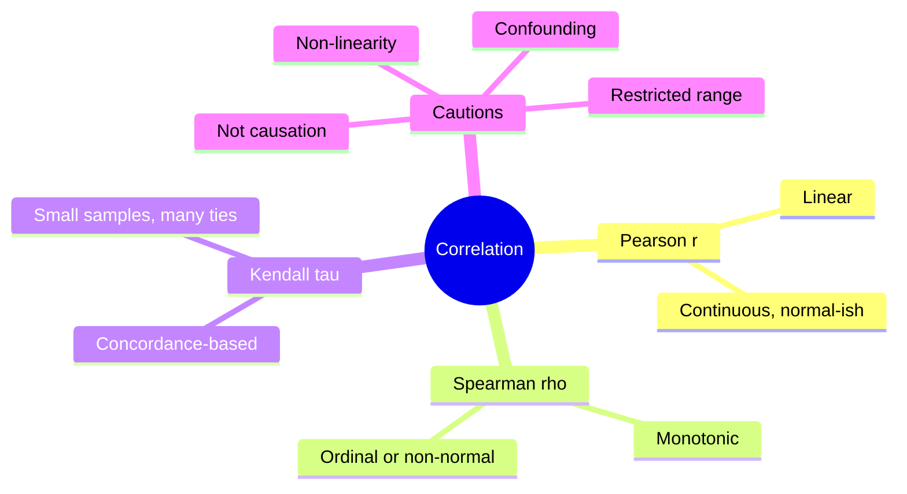
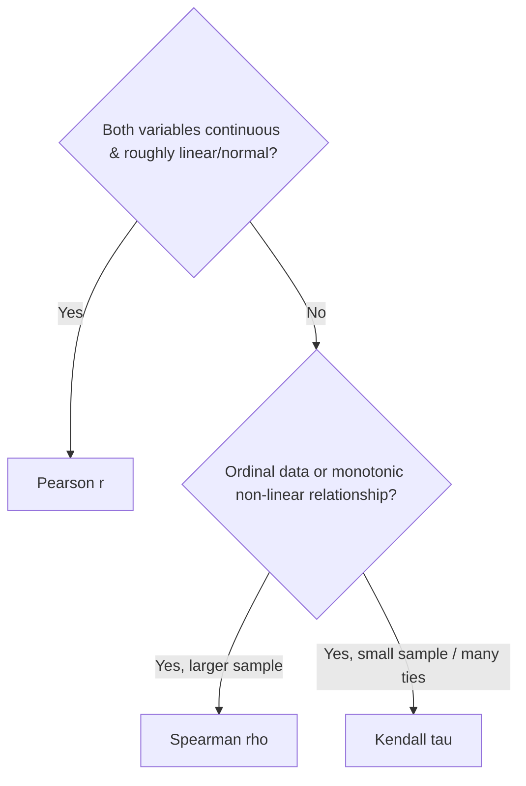

# Chapter 4: Correlation

[⬅ Previous: Dispersion](./03-dispersion.md) | [🏠 Home](../README.md) | [➡ Next: Regression](./05-regression.md)

---

## Learning Objectives

- [ ] Compute and interpret Pearson's, Spearman's, and Kendall's correlation coefficients
- [ ] Distinguish correlation from causation using concrete examples
- [ ] Recognize when correlation is inappropriate (non-linear relationships, restricted range)
- [ ] Construct and interpret a correlation matrix and heatmap
- [ ] Understand Simpson's Paradox and confounding in correlational data
- [ ] Test the significance of a correlation coefficient

## Prerequisites

- Chapter 2 (Central Tendency)
- Chapter 3 (Dispersion)

## Estimated Study Time

⏱️ 3 hours

---

## Why This Topic Matters

> [!WARNING]
> "Correlation is not causation" is the single most repeated — and most frequently ignored — warning in applied statistics. Understanding correlation deeply is a prerequisite for understanding why this warning exists.

## Big Picture



## Core Intuition

Correlation quantifies the **strength and direction** of association between two variables — how much knowing one tells you about the other. It does *not* tell you which variable, if either, causes the other.

## Mathematical Foundation

### Pearson Correlation Coefficient

$$r = \frac{\sum_{i=1}^n (x_i - \bar{x})(y_i - \bar{y})}{\sqrt{\sum_{i=1}^n (x_i-\bar{x})^2}\sqrt{\sum_{i=1}^n (y_i-\bar{y})^2}}$$

Equivalently, $r = \frac{\text{Cov}(X,Y)}{s_X s_Y}$, where covariance is:

$$\text{Cov}(X,Y) = \frac{1}{n-1}\sum_{i=1}^n (x_i - \bar{x})(y_i - \bar{y})$$

**Properties**: $-1 \le r \le 1$; measures only *linear* association; sensitive to outliers; assumes roughly continuous, bivariate-normal-ish data for valid significance testing.

### Spearman's Rank Correlation

$$\rho = 1 - \frac{6\sum d_i^2}{n(n^2-1)}$$

where $d_i$ is the difference between the ranks of paired observations. Captures **monotonic** (not necessarily linear) relationships and is robust to outliers since it operates on ranks.

### Kendall's Tau

$$\tau = \frac{(\text{concordant pairs}) - (\text{discordant pairs})}{\binom{n}{2}}$$

Preferred for small samples or data with many tied ranks.

## Interpreting Magnitude

| |r| | Strength |
|---|---|
| 0.00–0.10 | Negligible |
| 0.10–0.39 | Weak |
| 0.40–0.69 | Moderate |
| 0.70–0.89 | Strong |
| 0.90–1.00 | Very strong |

> [!WARNING]
> These thresholds are conventions, not universal laws. In genetics or physics, r = 0.3 may be enormous; in psychometrics, r = 0.9 may be suspiciously high (possible redundant items).

## Decision Tree



## Correlation ≠ Causation

Classic examples used in teaching:
- Ice cream sales correlate with drowning deaths (confounder: summer heat)
- Number of firefighters at a fire correlates with fire damage (confounder: fire size)
- Countries' chocolate consumption correlates with Nobel prizes per capita (confounder: wealth/development)


This diagram is a simple **DAG** (Directed Acyclic Graph) — a formal tool for reasoning about confounding, covered fully in Chapter 35.

## Simpson's Paradox

A correlation observed in aggregated data can **reverse direction** when the data are split by a subgroup (e.g., a lurking categorical variable). This is one of the most cited cautionary examples in applied statistics and is detailed with a full worked numerical example in Chapter 35.

## Worked Example

**Dataset**: Age (years) and systolic BP (mmHg) for 8 patients:

| Patient | Age (x) | SBP (y) |
|---|---|---|
| 1 | 25 | 118 |
| 2 | 32 | 122 |
| 3 | 40 | 128 |
| 4 | 45 | 130 |
| 5 | 50 | 138 |
| 6 | 55 | 140 |
| 7 | 60 | 145 |
| 8 | 65 | 150 |

$\bar{x} = 46.5$, $\bar{y} = 133.875$

Computing numerator and denominator terms (abbreviated):

$$\sum(x_i-\bar{x})(y_i-\bar{y}) \approx 1046.5 \qquad \sum(x_i-\bar{x})^2 \approx 1330 \qquad \sum(y_i-\bar{y})^2 \approx 897.9$$

$$r = \frac{1046.5}{\sqrt{1330}\sqrt{897.9}} = \frac{1046.5}{1092.5} \approx 0.958$$

**Interpretation**: A very strong positive linear relationship between age and systolic blood pressure in this small sample — consistent with well-established epidemiological findings on age-related arterial stiffening.

## Software Implementation

### R

```r
age <- c(25,32,40,45,50,55,60,65)
sbp <- c(118,122,128,130,138,140,145,150)

cor(age, sbp, method = "pearson")
cor(age, sbp, method = "spearman")
cor(age, sbp, method = "kendall")

cor.test(age, sbp, method = "pearson")   # includes p-value and CI

# Correlation matrix / heatmap for multiple variables
df <- data.frame(age, sbp, bmi = c(22,24,26,27,29,30,31,33))
cor_matrix <- cor(df)
library(corrplot)
corrplot(cor_matrix, method = "color", addCoef.col = "black")
```

### Python

```python
import numpy as np
import pandas as pd
from scipy import stats
import seaborn as sns
import matplotlib.pyplot as plt

age = np.array([25,32,40,45,50,55,60,65])
sbp = np.array([118,122,128,130,138,140,145,150])

r, p = stats.pearsonr(age, sbp)
rho, p_s = stats.spearmanr(age, sbp)
tau, p_k = stats.kendalltau(age, sbp)
print(f"Pearson r={r:.3f}, p={p:.4f}")
print(f"Spearman rho={rho:.3f}")
print(f"Kendall tau={tau:.3f}")

df = pd.DataFrame({"age": age, "sbp": sbp, "bmi": [22,24,26,27,29,30,31,33]})
corr_matrix = df.corr()
sns.heatmap(corr_matrix, annot=True, cmap="coolwarm")
plt.show()
```

### SPSS

```spss
CORRELATIONS
  /VARIABLES=age sbp
  /PRINT=TWOTAIL NOSIG
  /MISSING=PAIRWISE.

NONPAR CORR
  /VARIABLES=age sbp
  /PRINT=SPEARMAN TWOTAIL.
```

### STATA

```stata
pwcorr age sbp, sig
spearman age sbp
ktau age sbp
```

### SAS

```sas
PROC CORR DATA=work.patients PEARSON SPEARMAN KENDALL;
    VAR age sbp;
RUN;
```

## Real Research Example — Epidemiology

In observational epidemiology, strong correlations between an exposure and an outcome are often the *starting point* for a causal inference investigation (Chapter 34–37), not the ending point. A correlation must survive adjustment for known confounders, plausibility checks (Bradford Hill criteria), and — ideally — triangulation across study designs before being interpreted causally.

## Common Mistakes

| Mistake | Consequence |
|---|---|
| Using Pearson r on clearly non-linear data | Underestimates true association strength |
| Interpreting r as "% of variance explained" | That's $r^2$, not $r$ |
| Ignoring outliers' influence on r | Single point can drastically inflate/deflate r |
| Concluding causation from correlation alone | Classic confounding fallacy |
| Computing correlation on restricted-range subsamples | Artificially attenuates r |

## Reviewer Perspective

> [!NOTE]
> **Typical Reviewer Comment**: *"The authors report a correlation of r = 0.42 between biomarker X and outcome Y and describe this in the Discussion as evidence that X 'causes' Y. Please revise this causal language — a cross-sectional correlation cannot establish causality."*

## AI Evaluation Perspective

Automated manuscript screening tools increasingly flag causal verbs ("causes," "leads to," "results in") appearing near correlational statistics without a corresponding causal inference framework (DAG, instrumental variable, RCT design) being described elsewhere in the methods.

## Frequently Asked Questions

**Q: What does r² mean?**
A: The proportion of variance in one variable statistically "explained" by (linearly associated with) the other — covered in depth in Chapter 16 (Simple Linear Regression).

**Q: Can correlation be exactly 0 even with a strong relationship?**
A: Yes — Pearson r can be 0 for a perfect non-linear (e.g., U-shaped) relationship. Always plot your data first.

## Practice Problems

### MCQs
1. Pearson's r measures: (a) causation (b) **linear association** (c) any association (d) categorical association
2. Which coefficient is most robust to outliers? (a) Pearson (b) **Spearman** (c) Neither

### Short Questions
1. Give an original example (not from this chapter) of two variables that are correlated but not causally related.
2. Why might restricting a sample to only healthy volunteers artificially reduce an observed correlation?

### Programming Exercise
Generate 100 points from a U-shaped (quadratic) relationship in R or Python. Compute Pearson r. Then plot the data. Discuss the mismatch between the numeric result and the visual pattern.

## Chapter Summary

- Pearson r captures linear association; Spearman and Kendall capture monotonic/rank-based association.
- Correlation never establishes causation on its own — confounding and Simpson's Paradox are constant threats.
- Always visualize (scatterplot) before trusting a correlation coefficient.

## Key Takeaways

- 📌 Plot the data before computing r — numbers alone can mislead.
- 📌 r² (not r) is the "variance explained" statistic.
- 📌 A strong correlation is a hypothesis-generating signal, not a causal conclusion.

## Recommended Papers

- Altman, D.G. & Krzywinski, M. (2015). "Points of significance: Association, correlation and causation." *Nature Methods*.

## Further Reading

- Anscombe, F.J. (1973). "Graphs in Statistical Analysis." *The American Statistician* (introduces Anscombe's Quartet).

## References

1. Pearson, K. (1896). "Mathematical Contributions to the Theory of Evolution."
2. Simpson, E.H. (1951). "The Interpretation of Interaction in Contingency Tables." *JRSS-B*.

---

## Previous Chapter
[⬅ Chapter 3: Dispersion](./03-dispersion.md)

## Next Chapter
[➡ Chapter 5: Regression](./05-regression.md)
