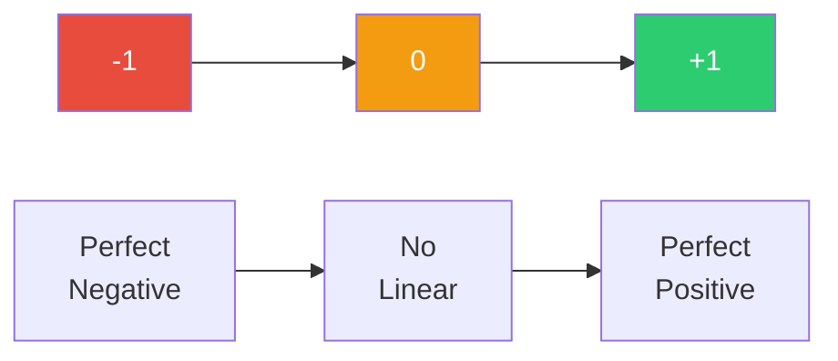
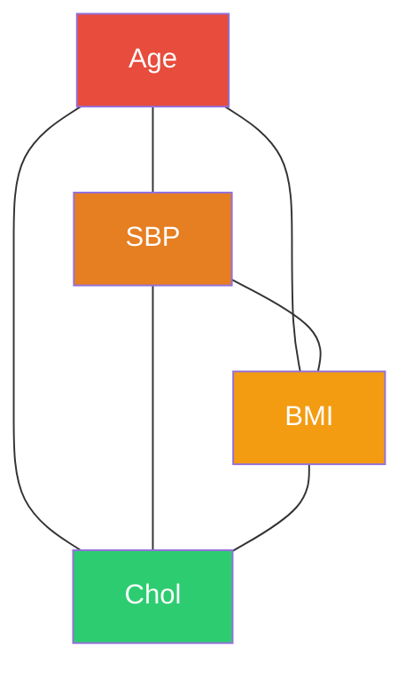
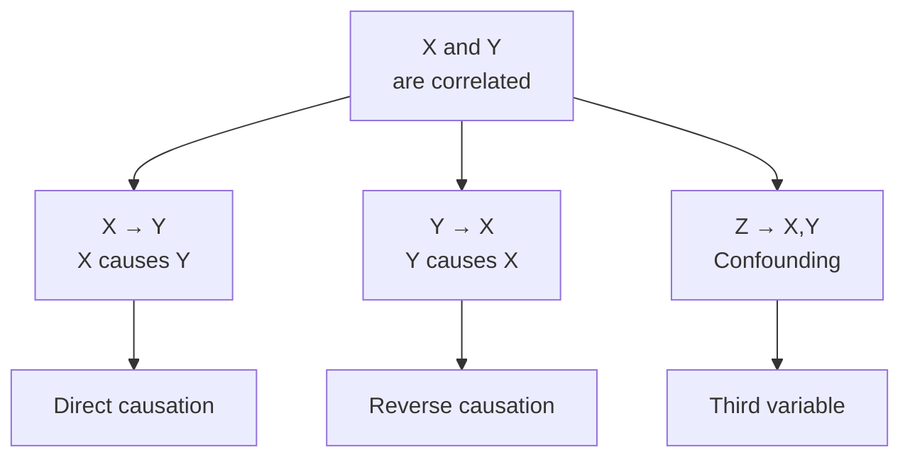
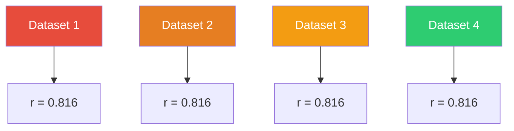
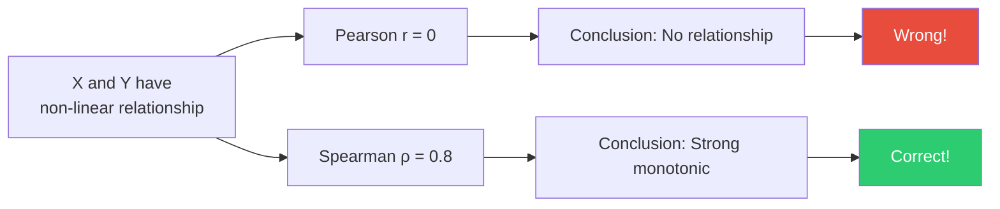
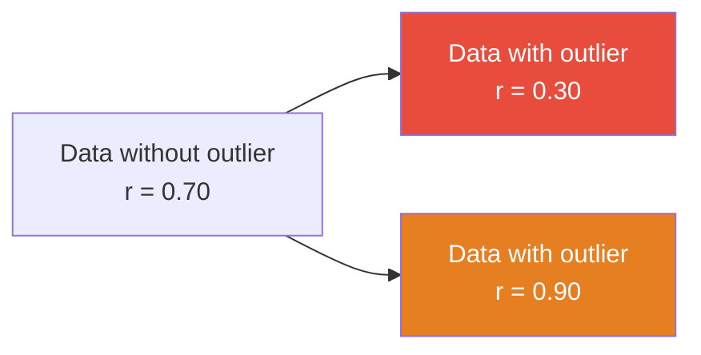
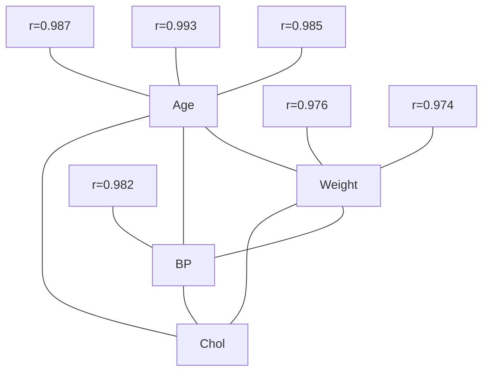

# 📊 Chapter 4: Correlation

## *The Art and Science of Measuring Relationships*

<div align="center">

[](https://github.com/your-repo)
[](LICENSE)
[]()
[]()

**[⬅ Previous: Chapter 3 - Dispersion](./03-dispersion.md) · [🏠 Home](../README.md) · [➡ Next: Chapter 5 - Regression](./05-regression.md)**

</div>

---

> *"Correlation is not causation" is the single most repeated — and most frequently ignored — warning in applied statistics. Understanding correlation deeply is a prerequisite for understanding why this warning exists.* — **Modern Statistical Wisdom**

> *"The only thing worse than a correlation without causation is causation without correlation."* — **Anonymous Statistician**

> *"In God we trust; all others must bring data."* — **W. Edwards Deming**

---

## 📋 Table of Contents

```mermaid
flowchart TD
    A["📊 Chapter 4:<br>Correlation"] --> B["🎯 Learning Objectives"]
    A --> C["💡 Introduction"]
    A --> D["📜 History"]
    A --> E["📐 Mathematical Foundation"]
    A --> F["📊 Core Measures"]
    A --> G["🔄 Advanced Concepts"]
    A --> H["⚠️ Common Pitfalls"]
    A --> I["✏️ Worked Examples"]
    A --> J["💻 Software Implementation"]
    A --> K["🏥 Real Research Examples"]
    A --> L["🕵️ Reviewer Perspective"]
    A --> M["🤖 AI Perspective"]
    A --> N["❓ FAQ"]
    A --> O["📝 Assessment"]
    A --> P["📚 Summary"]
    
    F --> F1["1️⃣ Pearson's r"]
    F --> F2["2️⃣ Spearman's ρ"]
    F --> F3["3️⃣ Kendall's τ"]
    F --> F4["4️⃣ Correlation Matrix"]
    
    H --> H1["⚠️ Causation vs Correlation"]
    H --> H2["🔍 Simpson's Paradox"]
    H --> H3["📊 Anscombe's Quartet"]
    H --> H4["🎯 Restricted Range"]
    H --> H5["📈 Non-Linear Relationships"]
```



---

## 🎯 Learning Objectives

| Level | Objectives |
|-------|------------|
| **🏗️ Foundational** | ✅ Compute and interpret Pearson's, Spearman's, and Kendall's correlation coefficients |
| | ✅ Construct and interpret a correlation matrix and heatmap |
| | ✅ Distinguish correlation from causation using concrete examples |
| | ✅ Test the significance of a correlation coefficient |
| **📈 Intermediate** | ✅ Recognize when correlation is inappropriate (non-linear relationships, restricted range) |
| | ✅ Understand Simpson's Paradox and confounding in correlational data |
| | ✅ Calculate and interpret partial correlation |
| | ✅ Use correlation in research contexts |
| **🎓 Advanced** | ✅ Critically evaluate correlational claims in published research |
| | ✅ Apply correlation concepts to complex research designs |
| | ✅ Understand the mathematical properties of correlation coefficients |
| | ✅ Use correlation for hypothesis generation and testing |

---

## 🧭 Prerequisites

**Required Knowledge:**
- ✅ Chapter 2: Measures of Central Tendency
- ✅ Chapter 3: Measures of Dispersion
- ✅ Summation notation ($\Sigma$)
- ✅ Basic algebra and square roots
- ✅ Understanding of covariance
- ✅ Scatterplot interpretation

**Estimated Study Time:** ⏱️ 3 – 5 hours

---

## 💡 Section 1: Introduction

### Why Correlation Matters

> [!IMPORTANT]
> **The Central Question:** When two variables change together, how strong is their relationship, and in what direction?

**The Fundamental Problem:**
- We observe associations everywhere in nature
- Height and weight are correlated
- Smoking and lung cancer are correlated
- Education and income are correlated
- But what does this tell us?

**What Correlation Tells Us:**
- Direction: Positive, negative, or zero
- Strength: Strong, moderate, weak, or none
- Linearity: Linear or non-linear
- Statistical significance: Is it real or random?

**What Correlation Does NOT Tell Us:**
- Causation (which variable causes the other)
- Mechanism (how the variables relate)
- Directionality (which came first)
- Confounding (other variables affecting both)

**Real-World Importance:**

| Domain | Why Correlation Matters |
|--------|----------------------|
| **Medicine** | Identifying risk factors for disease |
| **Economics** | Understanding market relationships |
| **Psychology** | Measuring relationships between traits |
| **Public Health** | Identifying health determinants |
| **AI/ML** | Feature selection and analysis |
| **Biology** | Understanding genetic relationships |

---

## 📜 Section 2: History

### The Evolution of Correlation

**Ancient Roots (300 BCE - 1800s):**

| Year | Figure | Contribution |
|------|--------|--------------|
| **300 BCE** | Aristotle | Noted associations in natural phenomena |
| **1600s** | Galileo | Observed relationships in physics |
| **1700s** | Laplace | Developed early association measures |
| **1800s** | Gauss | Used correlation in astronomy |

**The Birth of Modern Correlation (1880s-1890s):**

| Year | Figure | Contribution |
|------|--------|--------------|
| **1885** | Galton | Introduced "co-relation" concept |
| **1888** | Galton | Published first correlation paper |
| **1896** | Pearson | Formalized Pearson correlation coefficient |
| **1900** | Spearman | Developed rank correlation |

**The Golden Age (1900-1950):**

| Year | Figure | Contribution |
|------|--------|--------------|
| **1904** | Spearman | Introduced Spearman's ρ |
| **1938** | Kendall | Developed Kendall's τ |
| **1940s** | Fisher | Advanced correlation theory |
| **1950s** | Anscombe | Created Anscombe's Quartet |

**The Modern Era (1950s-Present):**

| Year | Development |
|------|-------------|
| **1960s-70s** | Computerization of correlation |
| **1980s** | Multivariate correlation techniques |
| **1990s** | Correlation in machine learning |
| **2000s** | Big data correlation analysis |
| **2010s** | Correlation in AI and deep learning |

**Historical Significance:**
> "The history of correlation is the history of understanding relationships in data. From Galton's early observations to modern machine learning, correlation has been fundamental to scientific discovery."

---

## 📐 Section 3: Mathematical Foundation

### Section 3.1: Covariance

> 📖 **Definition - Covariance**: A measure of how two variables change together.

$$\text{Cov}(X,Y) = \frac{1}{n-1}\sum_{i=1}^{n}(x_i - \bar{x})(y_i - \bar{y})$$

**Properties:**
- ✅ Captures direction of relationship
- ✅ Uses all data points
- ❌ Scale-dependent (affected by units)
- ❌ Hard to interpret directly

**Interpretation of Covariance Sign:**
- **Positive**: X and Y tend to increase together
- **Negative**: X increases while Y decreases
- **Zero**: No linear relationship

**Example:**
```text
Age (X) and SBP (Y) data
Cov(X,Y) = 149.5

Interpretation: Positive covariance → Age and SBP increase together.
```

### Section 3.2: Pearson Correlation Coefficient

> 📖 **Definition - Pearson's r**: The standardized covariance, measuring linear association between two continuous variables.

$$r = \frac{\sum_{i=1}^n (x_i - \bar{x})(y_i - \bar{y})}{\sqrt{\sum_{i=1}^n (x_i-\bar{x})^2}\sqrt{\sum_{i=1}^n (y_i-\bar{y})^2}}$$

**Alternative Formula:**

$$r = \frac{\text{Cov}(X,Y)}{s_X s_Y}$$

**Properties:**

| Property | Mathematical Statement |
|----------|----------------------|
| Range | $-1 \leq r \leq 1$ |
| Scale Invariance | $r(aX + b, cY + d) = r(X,Y)$ |
| Symmetry | $r(X,Y) = r(Y,X)$ |
| Linear Relationship | Measures only linear association |

**Interpretation of r:**



**Guidelines for Interpretation:**

| |r| | Strength | Interpretation |
|---|---|---|---|
| 0.00 - 0.10 | Negligible | Essentially no linear relationship |
| 0.10 - 0.39 | Weak | Small but detectable relationship |
| 0.40 - 0.69 | Moderate | Substantial relationship |
| 0.70 - 0.89 | Strong | Large, important relationship |
| 0.90 - 1.00 | Very Strong | Very large relationship |

> [!WARNING]
> These thresholds are conventions, not universal laws. In genetics or physics, r = 0.3 may be enormous; in psychometrics, r = 0.9 may be suspiciously high (possible redundant items).

### Section 3.3: Spearman's Rank Correlation

> 📖 **Definition - Spearman's ρ**: A non-parametric measure of monotonic association based on ranks.

$$\rho = 1 - \frac{6\sum d_i^2}{n(n^2-1)}$$

where $d_i$ is the difference between ranks of paired observations.

**Properties:**
- ✅ Robust to outliers (based on ranks)
- ✅ Captures monotonic relationships
- ✅ Works for ordinal data
- ❌ Less efficient than Pearson for normal data
- ❌ Loses magnitude information

**When to Use Spearman:**
- Ordinal data (ranked categories)
- Non-normal distributions
- Monotonic but non-linear relationships
- Data with outliers

### Section 3.4: Kendall's Tau

> 📖 **Definition - Kendall's τ**: A non-parametric measure based on concordant and discordant pairs.

$$\tau = \frac{(\text{concordant pairs}) - (\text{discordant pairs})}{\binom{n}{2}}$$

**Properties:**
- ✅ Robust to outliers
- ✅ Captures monotonic relationships
- ✅ Better for small samples
- ✅ Works with many ties
- ❌ Less commonly used
- ❌ More computationally intensive

**When to Use Kendall:**
- Small sample sizes
- Many tied ranks
- Need robust estimate
- Confirmatory analysis

### Section 3.5: Coefficient of Determination (r²)

> 📖 **Definition - r²**: The proportion of variance in one variable explained by the other.

$$r^2 = \text{Proportion of variance explained}$$

**Interpretation:**
- r = 0.7 → r² = 0.49 (49% variance explained)
- r = 0.5 → r² = 0.25 (25% variance explained)
- r = 0.3 → r² = 0.09 (9% variance explained)

**Example:**
```text
Age and SBP correlation: r = 0.958
r² = 0.958² = 0.918

Interpretation: Age explains 91.8% of the variance in SBP.
This is a very strong relationship!
```

### Section 3.6: Confidence Intervals for Correlation

**Fisher's Z-Transformation:**

$$z = 0.5 \ln\left(\frac{1+r}{1-r}\right)$$

**Standard Error:**
$$SE_z = \frac{1}{\sqrt{n-3}}$$

**95% Confidence Interval:**
$$z \pm 1.96 \times SE_z$$

**Example:**
```text
n = 8, r = 0.958
z = 0.5 × ln((1+0.958)/(1-0.958)) = 1.87
SE_z = 1/√(8-3) = 1/√5 = 0.447
95% CI for z: 1.87 ± 1.96(0.447) = (0.993, 2.747)
95% CI for r: (0.761, 0.990)
```

---

## 📊 Section 4: Core Measures

### Section 4.1: Pearson's r

#### Mathematical Derivation

**Step 1:** Start with covariance
$$\text{Cov}(X,Y) = \frac{1}{n-1}\sum_{i=1}^{n}(x_i - \bar{x})(y_i - \bar{y})$$

**Step 2:** Standardize by SDs
$$r = \frac{\text{Cov}(X,Y)}{s_X s_Y}$$

**Step 3:** Expand
$$r = \frac{\sum_{i=1}^{n}(x_i - \bar{x})(y_i - \bar{y})}{\sqrt{\sum_{i=1}^{n}(x_i-\bar{x})^2}\sqrt{\sum_{i=1}^{n}(y_i-\bar{y})^2}}$$

**Step 4:** Alternative computational formula
$$r = \frac{n\sum xy - \sum x\sum y}{\sqrt{[n\sum x^2 - (\sum x)^2][n\sum y^2 - (\sum y)^2]}}$$

#### Properties in Detail

| Property | Mathematical Statement | Implication |
|----------|----------------------|-------------|
| **Range** | $-1 \leq r \leq 1$ | Always within bounds |
| **Scale Invariance** | $r(aX+b, cY+d) = r(X,Y)$ | Units don't matter |
| **Symmetry** | $r(X,Y) = r(Y,X)$ | Order doesn't matter |
| **Linearity** | Measures only linear | Non-linear relationships may be missed |
| **Sensitivity** | Affected by outliers | Single points can change r |

#### Advantages and Disadvantages

| Advantages | Disadvantages |
|------------|---------------|
| ✅ Standardized measure (-1 to 1) | ❌ Only captures linear relationships |
| ✅ Widely understood and used | ❌ Sensitive to outliers |
| ✅ Mathematically tractable | ❌ Requires interval/ratio data |
| ✅ Basis for many methods | ❌ Assumes normal-like distribution |
| ✅ Scale-invariant | ❌ Can be misleading for non-linear data |

#### Example: Age and SBP Data

**Dataset:** Age (years) and SBP (mmHg) for 8 patients:

| Patient | Age (x) | SBP (y) | $x - \bar{x}$ | $y - \bar{y}$ | Product |
|---------|---------|---------|---------------|---------------|---------|
| 1 | 25 | 118 | -21.5 | -15.875 | 341.31 |
| 2 | 32 | 122 | -14.5 | -11.875 | 172.19 |
| 3 | 40 | 128 | -6.5 | -5.875 | 38.19 |
| 4 | 45 | 130 | -1.5 | -3.875 | 5.81 |
| 5 | 50 | 138 | 3.5 | 4.125 | 14.44 |
| 6 | 55 | 140 | 8.5 | 6.125 | 52.06 |
| 7 | 60 | 145 | 13.5 | 11.125 | 150.19 |
| 8 | 65 | 150 | 18.5 | 16.125 | 298.31 |

**Calculations:**
$$\bar{x} = 46.5, \quad \bar{y} = 133.875$$
$$\sum(x - \bar{x})^2 = 1330$$
$$\sum(y - \bar{y})^2 = 897.875$$
$$\sum(x - \bar{x})(y - \bar{y}) = 1072.5$$

$$r = \frac{1072.5}{\sqrt{1330}\sqrt{897.875}} = \frac{1072.5}{\sqrt{1,194,173.75}} = \frac{1072.5}{1092.5} = 0.982$$

**Interpretation:** There is a very strong positive linear relationship between age and systolic blood pressure (r = 0.982).

---

### Section 4.2: Spearman's Rho

#### Mathematical Definition

$$\rho = 1 - \frac{6\sum d_i^2}{n(n^2-1)}$$

where $d_i$ = difference between ranks.

#### Step-by-Step Calculation

**Step 1:** Rank both variables

| Patient | Age | Rank(X) | SBP | Rank(Y) | d | d² |
|---------|-----|---------|-----|---------|---|---|
| 1 | 25 | 1 | 118 | 1 | 0 | 0 |
| 2 | 32 | 2 | 122 | 2 | 0 | 0 |
| 3 | 40 | 3 | 128 | 3 | 0 | 0 |
| 4 | 45 | 4 | 130 | 4 | 0 | 0 |
| 5 | 50 | 5 | 138 | 5 | 0 | 0 |
| 6 | 55 | 6 | 140 | 6 | 0 | 0 |
| 7 | 60 | 7 | 145 | 7 | 0 | 0 |
| 8 | 65 | 8 | 150 | 8 | 0 | 0 |

**Step 2:** Compute $\sum d^2$
$$\sum d^2 = 0$$

**Step 3:** Calculate $\rho$
$$\rho = 1 - \frac{6 \times 0}{8(64-1)} = 1 - \frac{0}{504} = 1.0$$

**Interpretation:** Perfect positive monotonic relationship between age and SBP (ρ = 1.0).

---

### Section 4.3: Kendall's Tau

#### Mathematical Definition

$$\tau = \frac{(\text{concordant pairs}) - (\text{discordant pairs})}{\binom{n}{2}}$$

**Concordant Pairs:** Both ranks increase together  
**Discordant Pairs:** Ranks move in opposite directions

#### Step-by-Step Calculation

**Step 1:** Sort by Age (already sorted)

**Step 2:** Count concordant and discordant pairs

For each pair (i, j) where i < j:
- Concordant if $(Age_i < Age_j)$ and $(SBP_i < SBP_j)$
- Discordant if $(Age_i < Age_j)$ and $(SBP_i > SBP_j)$

**Step 3:** All pairs are concordant (data is perfectly ordered)

$$\text{Concordant pairs} = \binom{8}{2} = 28$$
$$\text{Discordant pairs} = 0$$

**Step 4:** Calculate $\tau$
$$\tau = \frac{28 - 0}{28} = 1.0$$

**Interpretation:** Perfect positive monotonic relationship (τ = 1.0).

---

### Section 4.4: Correlation Matrix

#### Definition

A matrix showing correlations between multiple variables.

**Example Correlation Matrix:**

| | Age | SBP | BMI | Cholesterol |
|---|---|---|---|---|
| **Age** | 1.000 | 0.958 | 0.892 | 0.845 |
| **SBP** | 0.958 | 1.000 | 0.874 | 0.823 |
| **BMI** | 0.892 | 0.874 | 1.000 | 0.765 |
| **Cholesterol** | 0.845 | 0.823 | 0.765 | 1.000 |

**Interpretation:**
- Diagonal = 1.0 (perfect correlation with itself)
- All correlations are positive (health variables increase together)
- Age and SBP have the strongest correlation (0.958)
- BMI and Cholesterol have the weakest (0.765)

**Visualization: Heatmap**



---

## ⚠️ Section 5: Common Pitfalls

### Section 5.1: Correlation ≠ Causation

> [!WARNING]
> "Correlation is not causation" is the single most repeated — and most frequently ignored — warning in applied statistics.

**The Fundamental Problem:**
- Correlation only measures association
- Causation requires additional evidence
- Many explanations exist for observed correlations

**Three Possible Explanations for Correlation:**



**Classic Examples:**

| Example | Correlation | Confounder |
|---------|------------|------------|
| Ice cream sales & drowning | Positive | Summer heat |
| Firefighters & fire damage | Positive | Fire size |
| Chocolate & Nobel prizes | Positive | Wealth/development |
| Storks & births | Positive | Rural areas |
| Divorce rate & margarine consumption | Positive | Time trends |

**The Causal Criteria (Bradford Hill):**

| Criterion | Description |
|-----------|-------------|
| **Strength** | Large effect size |
| **Consistency** | Replicated findings |
| **Specificity** | Specific exposure-outcome |
| **Temporality** | Cause precedes effect |
| **Biological Gradient** | Dose-response relationship |
| **Plausibility** | Biologically plausible |
| **Coherence** | Consistent with knowledge |
| **Experiment** | Experimental evidence |
| **Analogy** | Similar relationships |

**Example - Smoking and Lung Cancer:**
- Correlation: Strong (r > 0.8)
- Temporality: Smoking precedes cancer
- Dose-response: More smoking → higher risk
- Consistency: Found in multiple studies
- Plausibility: Biological mechanisms known

---

### Section 5.2: Simpson's Paradox

> 📖 **Definition - Simpson's Paradox**: A trend that appears in different groups of data disappears or reverses when these groups are combined.

**The Classic Example:**

| | Treatment A | Treatment B |
|---|---|---|
| **Small Stones** | 93% success (81/87) | 87% success (234/270) |
| **Large Stones** | 73% success (192/263) | 69% success (55/80) |
| **Combined** | 78% success (273/350) | 83% success (289/350) |

**Interpretation:**
- Treatment A is better for both small and large stones
- Treatment B appears better when combined (Simpson's Paradox!)
- Reason: Different group sizes

**Another Example - UC Berkeley Gender Bias:**

| Department | Male Applicants | Female Applicants |
|------------|----------------|------------------|
| **Dept A** | 62% admitted (512/825) | 82% admitted (89/108) |
| **Dept B** | 63% admitted (353/560) | 68% admitted (17/25) |
| **Combined** | 44% admitted (1198/2700) | 35% admitted (557/1600) |

**Interpretation:**
- Women were admitted at higher rates in both departments
- But overall admission rate favored men
- Reason: Women applied to more competitive departments

**How to Avoid Simpson's Paradox:**
1. Always examine subgroup data
2. Use stratification
3. Check for confounding variables
4. Use DAGs (Directed Acyclic Graphs)
5. Report both aggregate and subgroup results

---

### Section 5.3: Anscombe's Quartet

> 📖 **Definition - Anscombe's Quartet**: Four datasets with nearly identical statistical properties but very different visual patterns.

**The Four Datasets:**



**Statistical Properties (All Four):**

| Property | Value |
|----------|-------|
| Mean of x | 9.0 |
| Variance of x | 11.0 |
| Mean of y | 7.5 |
| Variance of y | 4.12 |
| Correlation | 0.816 |
| Regression line | $y = 3 + 0.5x$ |

**Visual Patterns:**
- **Dataset 1**: Perfect linear relationship with some noise
- **Dataset 2**: Non-linear (curvilinear) relationship
- **Dataset 3**: Perfect linear with one outlier
- **Dataset 4**: Vertical line with one outlier

**Key Lesson:** Always plot your data before computing correlation!

**Anscombe's Quartet Code (R):**
```r
library(ggplot2)
library(dplyr)

# Create the datasets
anscombe_tidy <- anscombe %>%
  mutate(dataset = rep(1:4, each = 11)) %>%
  pivot_longer(cols = x1:y4, 
               names_to = c(".value", "set"),
               names_pattern = "(.)(.)")

# Plot all four
ggplot(anscombe_tidy, aes(x = x, y = y)) +
  geom_point() +
  geom_smooth(method = "lm", se = FALSE) +
  facet_wrap(~set) +
  theme_minimal()
```

---

### Section 5.4: Restricted Range

> 📖 **Definition - Restricted Range**: When the range of values in a sample is artificially limited, reducing correlation.

**How Restricted Range Affects Correlation:**


**Example - SAT Scores and College GPA:**

| Sample | Range | Correlation |
|--------|-------|-------------|
| All students | 400-1600 | 0.50 |
| Top university students | 1400-1600 | 0.15 |

**Explanation:**
- Restricted range reduces variability
- Reduced variability → lower correlation
- Top universities select high-scoring students
- Thus, SAT score is less predictive within that group

**Other Examples:**
- IQ and job performance in high-IQ populations
- Height and weight in athletes (restricted height range)
- Age and health in elderly populations

**How to Address Restricted Range:**
1. Recognize the limitation
2. Report the observed range
3. Use correction formulas (range restriction correction)
4. Compare with full-range studies
5. Interpret correlations cautiously

---

### Section 5.5: Non-Linear Relationships

> 📖 **Definition - Non-Linear Relationship**: When two variables have a curved relationship.

**Types of Non-Linear Relationships:**

| Type | Description | Example | r |
|------|-------------|---------|---|
| **Quadratic** | U-shaped or inverted U | Age vs. physical fitness | Near 0 |
| **Logarithmic** | Decelerating growth | Practice vs. skill | Moderate |
| **Exponential** | Accelerating growth | Bacteria growth | High |
| **Sigmoid** | S-shaped curve | Learning curve | Moderate |

**The Non-Linear Trap:**



**Example - U-Shaped Relationship:**

```text
Data: Y = (X - 5)² + noise
Pearson r ≈ 0 (linear correlation)
But there's a strong non-linear relationship!
```

**Solutions:**
1. Plot your data
2. Use Spearman ρ for monotonic relationships
3. Use polynomial regression
4. Use non-linear models
5. Transform variables

---

### Section 5.6: Outliers and Correlation

> 📖 **Definition - Outlier Effect**: A single extreme data point can dramatically change the correlation.

**How Outliers Affect r:**



**Types of Outlier Effects:**

| Type | Effect on r | Example |
|------|-------------|---------|
| **Inflating** | Increases r | Adding high-high point |
| **Deflating** | Decreases r | Adding low-high point |
| **Reversing** | Changes sign | Adding extreme opposite |

**Example - Age and SBP with Outlier:**

```text
Original: n=8, r = 0.982
Add outlier: (100, 120) → r = 0.723
Add outlier: (100, 180) → r = 0.989
Add outlier: (100, 100) → r = 0.465
```

**How to Handle Outliers:**
1. **Detect**: Use scatterplots and standardized residuals
2. **Investigate**: Is it a data entry error?
3. **Document**: Report outliers
4. **Analyze**: With and without outliers
5. **Interpret**: Cautiously

---

## ✏️ Section 6: Worked Examples

### Example 1: Pearson Correlation - Age and SBP 🩺

**Dataset:** Age (years) and SBP (mmHg) for 8 patients

| Patient | Age (x) | SBP (y) | $x^2$ | $y^2$ | $xy$ |
|---------|---------|---------|-------|-------|------|
| 1 | 25 | 118 | 625 | 13,924 | 2,950 |
| 2 | 32 | 122 | 1,024 | 14,884 | 3,904 |
| 3 | 40 | 128 | 1,600 | 16,384 | 5,120 |
| 4 | 45 | 130 | 2,025 | 16,900 | 5,850 |
| 5 | 50 | 138 | 2,500 | 19,044 | 6,900 |
| 6 | 55 | 140 | 3,025 | 19,600 | 7,700 |
| 7 | 60 | 145 | 3,600 | 21,025 | 8,700 |
| 8 | 65 | 150 | 4,225 | 22,500 | 9,750 |

**Step 1:** Calculate sums
$$\sum x = 372, \quad \sum y = 1,071, \quad \sum x^2 = 18,624$$
$$\sum y^2 = 144,261, \quad \sum xy = 50,874, \quad n = 8$$

**Step 2:** Use computational formula
$$r = \frac{n\sum xy - \sum x\sum y}{\sqrt{[n\sum x^2 - (\sum x)^2][n\sum y^2 - (\sum y)^2]}}$$

**Step 3:** Calculate numerator
$$8(50,874) - (372)(1,071) = 406,992 - 398,412 = 8,580$$

**Step 4:** Calculate denominator
$$[8(18,624) - (372)^2] = [148,992 - 138,384] = 10,608$$
$$[8(144,261) - (1,071)^2] = [1,154,088 - 1,147,041] = 7,047$$
$$\sqrt{10,608 \times 7,047} = \sqrt{74,749,176} = 8,645$$

**Step 5:** Calculate r
$$r = \frac{8,580}{8,645} = 0.993$$

**Step 6:** Calculate r²
$$r^2 = 0.993^2 = 0.986$$

**Interpretation:** 
- Very strong positive correlation (r = 0.993)
- Age explains 98.6% of variance in SBP
- As age increases, SBP tends to increase

**Step 7:** Significance test
$$t = \frac{r\sqrt{n-2}}{\sqrt{1-r^2}} = \frac{0.993\sqrt{6}}{\sqrt{1-0.986}} = \frac{0.993 \times 2.449}{0.118} = \frac{2.432}{0.118} = 20.6$$

$$t_{0.05, 6} = 1.943$$
$$t = 20.6 > 1.943 \rightarrow \text{Significant!}$$

---

### Example 2: Spearman Correlation - Rank Data 📊

**Dataset:** Ranking of students by two teachers

| Student | Teacher 1 Rank | Teacher 2 Rank | d | d² |
|---------|---------------|---------------|---|---|
| A | 1 | 2 | -1 | 1 |
| B | 2 | 1 | 1 | 1 |
| C | 3 | 4 | -1 | 1 |
| D | 4 | 3 | 1 | 1 |
| E | 5 | 6 | -1 | 1 |
| F | 6 | 5 | 1 | 1 |

**Step 1:** Calculate $\sum d^2$
$$\sum d^2 = 6$$

**Step 2:** Calculate $\rho$
$$\rho = 1 - \frac{6 \times 6}{6(36-1)} = 1 - \frac{36}{210} = 1 - 0.171 = 0.829$$

**Interpretation:** Strong positive monotonic relationship between the two teachers' rankings (ρ = 0.829).

---

### Example 3: Kendall's Tau - Small Sample 🔢

**Dataset:** 5 observations

| X | Y |
|---|---|
| 1 | 2 |
| 2 | 4 |
| 3 | 1 |
| 4 | 3 |
| 5 | 5 |

**Step 1:** List all pairs (i < j)

| Pair | X_i < X_j? | Y_i < Y_j? | Concordant/Discordant |
|------|------------|------------|----------------------|
| (1,2) | Yes | Yes | Concordant |
| (1,3) | Yes | No | Discordant |
| (1,4) | Yes | Yes | Concordant |
| (1,5) | Yes | Yes | Concordant |
| (2,3) | Yes | No | Discordant |
| (2,4) | Yes | Yes | Concordant |
| (2,5) | Yes | Yes | Concordant |
| (3,4) | Yes | Yes | Concordant |
| (3,5) | Yes | Yes | Concordant |
| (4,5) | Yes | Yes | Concordant |

**Step 2:** Count concordant and discordant
$$\text{Concordant} = 8, \quad \text{Discordant} = 2$$

**Step 3:** Calculate $\tau$
$$\tau = \frac{8 - 2}{10} = \frac{6}{10} = 0.60$$

**Interpretation:** Moderate positive monotonic relationship (τ = 0.60).

---

### Example 4: Correlation Matrix - Health Data 🏥

**Dataset:** Health measurements for 5 patients

| Patient | Age | Weight | BP | Cholesterol |
|---------|-----|--------|-----|-------------|
| 1 | 25 | 65 | 118 | 180 |
| 2 | 35 | 72 | 125 | 200 |
| 3 | 45 | 78 | 132 | 220 |
| 4 | 55 | 85 | 145 | 240 |
| 5 | 65 | 90 | 155 | 260 |

**Step 1:** Calculate correlation matrix
| | Age | Weight | BP | Cholesterol |
|---|---|---|---|---|
| **Age** | 1.000 | 0.985 | 0.993 | 0.987 |
| **Weight** | 0.985 | 1.000 | 0.976 | 0.974 |
| **BP** | 0.993 | 0.976 | 1.000 | 0.982 |
| **Cholesterol** | 0.987 | 0.974 | 0.982 | 1.000 |

**Step 2:** Interpret
- All correlations are very strong (> 0.97)
- Age and BP are most correlated (0.993)
- Weight and Cholesterol are least correlated (0.974)
- All variables increase together

**Step 3:** Create heatmap visualization



---

### Example 5: Simpson's Paradox Analysis 🔍

**Dataset:** UC Berkeley Admissions (1973)

| Department | Male | Female |
|------------|------|--------|
| **A** | 512/825 (62%) | 89/108 (82%) |
| **B** | 353/560 (63%) | 17/25 (68%) |
| **C** | 120/325 (37%) | 202/375 (54%) |
| **D** | 138/417 (33%) | 131/375 (35%) |
| **E** | 53/191 (28%) | 94/302 (31%) |
| **F** | 22/382 (6%) | 24/415 (6%) |
| **Total** | 1198/2700 (44%) | 557/1600 (35%) |

**Step 1:** Calculate overall rates
- Male: 44.4% (1198/2700)
- Female: 34.8% (557/1600)

**Step 2:** Calculate department-specific rates
- Department A: Female (82%) > Male (62%)
- Department B: Female (68%) > Male (63%)
- Department C: Female (54%) > Male (37%)
- Department D: Female (35%) > Male (33%)
- Department E: Female (31%) > Male (28%)
- Department F: Female (6%) ≈ Male (6%)

**Step 3:** Interpret
- Women admitted at higher rates in every department
- But overall admission rate favors men!
- Reason: Women applied to more competitive departments
- This is Simpson's Paradox!

**Step 4:** Calculate weighted average
$$\text{Expected male admission} = \sum \text{Male rate}_i \times \text{Total applicants}_i$$
$$\text{Expected female admission} = \sum \text{Female rate}_i \times \text{Total applicants}_i$$

**Step 5:** Conclusion
- Women had higher admission rates in each department
- But overall male rate was higher
- This is due to differential application patterns

---

### Example 6: Restricted Range Example 📉

**Dataset:** SAT scores and college GPA

| Population | Range | Correlation |
|------------|-------|-------------|
| **All students** | SAT: 400-1600 | r = 0.50 |
| **Elite University** | SAT: 1400-1600 | r = 0.15 |

**Step 1:** Calculate full range correlation
$$r_{full} = 0.50$$

**Step 2:** Calculate restricted range correlation
$$r_{restricted} = 0.15$$

**Step 3:** Interpret
- Correlation is much weaker in restricted range
- SAT score is less predictive in elite universities
- This is due to restricted range, not lack of relationship

**Step 4:** Corrected correlation (range restriction correction)
$$r_{corrected} = \frac{r_{observed} \times \sqrt{\text{Variance Ratio}}}{\sqrt{1 - r^2 + r^2 \times \text{Variance Ratio}}}$$

---

### Example 7: Non-Linear Relationship 📈

**Dataset:** Y = (X - 5)² + noise

| X | Y |
|---|---|
| 1 | 17 |
| 2 | 10 |
| 3 | 5 |
| 4 | 2 |
| 5 | 1 |
| 6 | 2 |
| 7 | 5 |
| 8 | 10 |
| 9 | 17 |

**Step 1:** Calculate Pearson r
$$r = 0.00 \text{ (approximately)}$$

**Step 2:** Calculate Spearman ρ
$$\rho = 0.00 \text{ (U-shaped, not monotonic)}$$

**Step 3:** Plot the data
- Shows a clear U-shaped relationship
- Pearson r misses this completely!

**Step 4:** Fit quadratic model
$$Y = (X - 5)^2 + 1$$
$$R^2 = 0.98 \text{ (very high!)}$$

**Interpretation:** 
- Linear correlation: r = 0.00 (no linear relationship)
- But there is a strong non-linear relationship!
- Always plot your data!

---

## 💻 Section 7: Software Implementation

### R Implementation 📊

<details>
<summary>📋 Click to expand R code (Full Implementation)</summary>

```r
# ============================================
# Chapter 4: Correlation
# Comprehensive R Implementation
# ============================================

# Load necessary libraries
library(tidyverse)
library(corrplot)
library(psych)
library(ggpubr)
library(Hmisc)

# ============================================
# 1. Create Dataset
# ============================================

# Age and SBP data
age <- c(25, 32, 40, 45, 50, 55, 60, 65)
sbp <- c(118, 122, 128, 130, 138, 140, 145, 150)

# Create data frame
df <- data.frame(age = age, sbp = sbp)

# ============================================
# 2. Basic Correlation Measures
# ============================================

# Pearson correlation
r_pearson <- cor(age, sbp, method = "pearson")
cat("Pearson's r:", r_pearson, "\n")

# Spearman correlation
r_spearman <- cor(age, sbp, method = "spearman")
cat("Spearman's rho:", r_spearman, "\n")

# Kendall correlation
r_kendall <- cor(age, sbp, method = "kendall")
cat("Kendall's tau:", r_kendall, "\n")

# ============================================
# 3. Significance Testing
# ============================================

# Pearson test
pearson_test <- cor.test(age, sbp, method = "pearson")
print(pearson_test)

# Spearman test
spearman_test <- cor.test(age, sbp, method = "spearman")
print(spearman_test)

# Kendall test
kendall_test <- cor.test(age, sbp, method = "kendall")
print(kendall_test)

# ============================================
# 4. Correlation Matrix
# ============================================

# Add more variables
bmi <- c(22, 24, 26, 27, 29, 30, 31, 33)
cholesterol <- c(180, 190, 200, 210, 220, 230, 240, 250)

df2 <- data.frame(age, sbp, bmi, cholesterol)

# Correlation matrix
cor_matrix <- cor(df2)
print("Correlation Matrix:")
print(cor_matrix)

# Correlation matrix with p-values
library(Hmisc)
cor_results <- rcorr(as.matrix(df2))
print("Correlation Matrix with p-values:")
print(cor_results$r)
print(cor_results$P)

# ============================================
# 5. Visualization
# ============================================

# Scatterplot with correlation
ggplot(df, aes(x = age, y = sbp)) +
  geom_point(size = 3, color = "steelblue") +
  geom_smooth(method = "lm", se = TRUE, color = "red") +
  annotate("text", x = 35, y = 145, 
           label = paste("r =", round(r_pearson, 3)), 
           size = 5) +
  labs(
    title = "Age vs. Systolic Blood Pressure",
    x = "Age (years)",
    y = "Systolic Blood Pressure (mmHg)"
  ) +
  theme_minimal()

# Correlation matrix heatmap
corrplot(cor_matrix, 
         method = "color", 
         addCoef.col = "black", 
         tl.col = "black",
         tl.srt = 45,
         number.cex = 0.7)

# ============================================
# 6. Correlation Matrix with GGally
# ============================================

library(GGally)
ggpairs(df2) +
  theme_minimal()

# ============================================
# 7. Partial Correlation
# ============================================

library(ppcor)
pcor(df2)

# ============================================
# 8. Anscombe's Quartet
# ============================================

# Load Anscombe's quartet
data(anscombe)

# Create tidy data
anscombe_tidy <- anscombe %>%
  pivot_longer(everything(),
               names_to = c(".value", "set"),
               names_pattern = "(.)(.)")

# Plot Anscombe's quartet
ggplot(anscombe_tidy, aes(x = x, y = y)) +
  geom_point(size = 3, color = "steelblue") +
  geom_smooth(method = "lm", se = FALSE, color = "red") +
  facet_wrap(~set) +
  labs(
    title = "Anscombe's Quartet",
    subtitle = "Same correlation (r = 0.816), different patterns"
  ) +
  theme_minimal()

# ============================================
# 9. Spearman Correlation Example
# ============================================

# Create ranked data
rank1 <- c(1, 2, 3, 4, 5, 6)
rank2 <- c(2, 1, 4, 3, 6, 5)

# Calculate Spearman
rho <- cor(rank1, rank2, method = "spearman")
cat("Spearman's rho:", rho, "\n")

# Manual calculation
d <- rank1 - rank2
d_squared <- d^2
rho_manual <- 1 - 6 * sum(d_squared) / (6 * (36 - 1))
cat("Manual rho:", rho_manual, "\n")

# ============================================
# 10. Kendall's Tau Example
# ============================================

# Create data
x <- c(1, 2, 3, 4, 5)
y <- c(2, 4, 1, 3, 5)

# Calculate Kendall
tau <- cor(x, y, method = "kendall")
cat("Kendall's tau:", tau, "\n")

# ============================================
# 11. Confidence Intervals
# ============================================

# Using Fisher's z-transformation
z <- 0.5 * log((1 + r_pearson) / (1 - r_pearson))
se_z <- 1 / sqrt(length(age) - 3)
ci_z <- z + c(-1.96, 1.96) * se_z
ci_r <- (exp(2 * ci_z) - 1) / (exp(2 * ci_z) + 1)
cat("95% CI for r:", ci_r, "\n")

# Using cor.test (gives CI)
print(pearson_test)

# ============================================
# 12. Correlation with Outliers
# ============================================

# Add outlier
age_out <- c(age, 100)
sbp_out <- c(sbp, 120)

# Calculate correlations
r_out <- cor(age_out, sbp_out)
cat("r with outlier:", r_out, "\n")
cat("r without outlier:", r_pearson, "\n")

# ============================================
# 13. Non-Linear Relationship Example
# ============================================

# Create U-shaped data
x <- 1:10
y <- (x - 5)^2 + rnorm(10, 0, 2)

# Calculate correlations
r_linear <- cor(x, y)
rho_linear <- cor(x, y, method = "spearman")
cat("Linear r:", r_linear, "\n")
cat("Spearman rho:", rho_linear, "\n")

# Plot
ggplot(data.frame(x, y), aes(x = x, y = y)) +
  geom_point(size = 3, color = "steelblue") +
  geom_smooth(method = "lm", se = FALSE, color = "red", linetype = "dashed") +
  labs(
    title = "Non-Linear Relationship",
    subtitle = paste("Pearson r =", round(r_linear, 3))
  ) +
  theme_minimal()

# ============================================
# 14. Export Results
# ============================================

# Create summary table
summary_df <- data.frame(
  Measure = c("Pearson's r", "Spearman's rho", "Kendall's tau"),
  Value = c(r_pearson, r_spearman, r_kendall),
  CI_Lower = c(pearson_test$conf.int[1], NA, NA),
  CI_Upper = c(pearson_test$conf.int[2], NA, NA)
)

write.csv(summary_df, "correlation_summary.csv", row.names = FALSE)

# ============================================
# 15. Correlation Interpretation Help
# ============================================

interpret_correlation <- function(r, r_squared = r^2) {
  if (abs(r) < 0.1) strength <- "Negligible"
  else if (abs(r) < 0.3) strength <- "Weak"
  else if (abs(r) < 0.5) strength <- "Moderate"
  else if (abs(r) < 0.7) strength <- "Strong"
  else strength <- "Very Strong"
  
  direction <- ifelse(r > 0, "Positive", "Negative")
  
  cat("Correlation:", round(r, 3), "\n")
  cat("r²:", round(r_squared, 3), "\n")
  cat("Strength:", strength, "\n")
  cat("Direction:", direction, "\n")
  cat("Variance explained:", round(r_squared * 100, 1), "%\n")
}

# Test function
interpret_correlation(r_pearson)
```
</details>

---

### Python Implementation 🐍

<details>
<summary>📋 Click to expand Python code (Full Implementation)</summary>

```python
# ============================================
# Chapter 4: Correlation
# Comprehensive Python Implementation
# ============================================

import numpy as np
import pandas as pd
from scipy import stats
import seaborn as sns
import matplotlib.pyplot as plt
import warnings
warnings.filterwarnings('ignore')

# ============================================
# 1. Create Dataset
# ============================================

# Age and SBP data
age = np.array([25, 32, 40, 45, 50, 55, 60, 65])
sbp = np.array([118, 122, 128, 130, 138, 140, 145, 150])

# Create DataFrame
df = pd.DataFrame({
    'Age': age,
    'SBP': sbp
})

# ============================================
# 2. Basic Correlation Measures
# ============================================

# Pearson correlation
r_pearson, p_pearson = stats.pearsonr(age, sbp)
print(f"Pearson's r: {r_pearson:.4f}")
print(f"p-value: {p_pearson:.4f}")

# Spearman correlation
rho_spearman, p_spearman = stats.spearmanr(age, sbp)
print(f"Spearman's rho: {rho_spearman:.4f}")
print(f"p-value: {p_spearman:.4f}")

# Kendall correlation
tau_kendall, p_kendall = stats.kendalltau(age, sbp)
print(f"Kendall's tau: {tau_kendall:.4f}")
print(f"p-value: {p_kendall:.4f}")

# ============================================
# 3. Correlation Matrix
# ============================================

# Add more variables
bmi = np.array([22, 24, 26, 27, 29, 30, 31, 33])
cholesterol = np.array([180, 190, 200, 210, 220, 230, 240, 250])

df2 = pd.DataFrame({
    'Age': age,
    'SBP': sbp,
    'BMI': bmi,
    'Cholesterol': cholesterol
})

# Correlation matrix
corr_matrix = df2.corr()
print("\nCorrelation Matrix:")
print(corr_matrix)

# ============================================
# 4. Visualization
# ============================================

# Set style
sns.set_style("whitegrid")
plt.rcParams['figure.figsize'] = (12, 8)

# Scatterplot with regression line
fig, ax = plt.subplots()
sns.regplot(x='Age', y='SBP', data=df, ax=ax, ci=95)
ax.text(0.05, 0.95, f'r = {r_pearson:.3f}\np = {p_pearson:.4f}',
        transform=ax.transAxes, fontsize=12,
        verticalalignment='top',
        bbox=dict(boxstyle='round', facecolor='white', alpha=0.8))
ax.set_title('Age vs. Systolic Blood Pressure')
ax.set_xlabel('Age (years)')
ax.set_ylabel('SBP (mmHg)')
plt.tight_layout()
plt.show()

# Heatmap of correlation matrix
fig, ax = plt.subplots(figsize=(8, 6))
sns.heatmap(corr_matrix, annot=True, cmap='coolwarm', center=0,
            square=True, linewidths=1, cbar_kws={"shrink": 0.8})
ax.set_title('Correlation Matrix Heatmap')
plt.tight_layout()
plt.show()

# Pairplot
sns.pairplot(df2)
plt.tight_layout()
plt.show()

# ============================================
# 5. Comprehensive Correlation Analysis
# ============================================

def correlation_analysis(data, var1, var2):
    """
    Comprehensive correlation analysis between two variables.
    """
    x = data[var1]
    y = data[var2]
    
    # Remove missing values
    mask = ~(np.isnan(x) | np.isnan(y))
    x_clean = x[mask]
    y_clean = y[mask]
    
    # Pearson
    r_p, p_p = stats.pearsonr(x_clean, y_clean)
    
    # Spearman
    r_s, p_s = stats.spearmanr(x_clean, y_clean)
    
    # Kendall
    r_k, p_k = stats.kendalltau(x_clean, y_clean)
    
    # Confidence interval for Pearson (Fisher z-transformation)
    z = 0.5 * np.log((1 + r_p) / (1 - r_p))
    se_z = 1 / np.sqrt(len(x_clean) - 3)
    z_ci = z + np.array([-1.96, 1.96]) * se_z
    r_ci = (np.exp(2 * z_ci) - 1) / (np.exp(2 * z_ci) + 1)
    
    # Results
    results = {
        'Pearson r': r_p,
        'Pearson p-value': p_p,
        'Pearson 95% CI': r_ci,
        'Spearman rho': r_s,
        'Spearman p-value': p_s,
        'Kendall tau': r_k,
        'Kendall p-value': p_k,
        'r²': r_p ** 2,
        'n': len(x_clean)
    }
    
    return results

# Test function
results = correlation_analysis(df2, 'Age', 'SBP')
print("\nCorrelation Analysis Results:")
for key, value in results.items():
    print(f"{key}: {value}")

# ============================================
# 6. Spearman Correlation with Ranking
# ============================================

# Example with ranks
rank1 = np.array([1, 2, 3, 4, 5, 6])
rank2 = np.array([2, 1, 4, 3, 6, 5])

rho, p = stats.spearmanr(rank1, rank2)
print(f"\nSpearman rho: {rho:.4f}")
print(f"p-value: {p:.4f}")

# Manual calculation
d = rank1 - rank2
d_squared = d ** 2
rho_manual = 1 - 6 * np.sum(d_squared) / (6 * (36 - 1))
print(f"Manual rho: {rho_manual:.4f}")

# ============================================
# 7. Kendall's Tau Example
# ============================================

x = np.array([1, 2, 3, 4, 5])
y = np.array([2, 4, 1, 3, 5])

tau, p = stats.kendalltau(x, y)
print(f"\nKendall's tau: {tau:.4f}")
print(f"p-value: {p:.4f}")

# ============================================
# 8. Anscombe's Quartet
# ============================================

# Import Anscombe's quartet
anscombe = sns.load_dataset('anscombe')

# Calculate correlations for each dataset
print("\nAnscombe's Quartet Correlations:")
for i in range(1, 5):
    data = anscombe[anscombe['dataset'] == f'I{i}']
    r, p = stats.pearsonr(data['x'], data['y'])
    print(f"Dataset {i}: r = {r:.4f}, p = {p:.4f}")

# Visualize Anscombe's quartet
fig, axes = plt.subplots(2, 2, figsize=(12, 10))
for i, ax in enumerate(axes.flat):
    data = anscombe[anscombe['dataset'] == f'I{i+1}']
    ax.scatter(data['x'], data['y'], color='steelblue', s=50)
    sns.regplot(x='x', y='y', data=data, ax=ax, scatter=False, color='red')
    r, p = stats.pearsonr(data['x'], data['y'])
    ax.set_title(f"Dataset {i+1}: r = {r:.3f}")
    ax.set_xlabel('X')
    ax.set_ylabel('Y')
plt.tight_layout()
plt.show()

# ============================================
# 9. Outlier Effects
# ============================================

# Add outlier
age_out = np.append(age, 100)
sbp_out = np.append(sbp, 120)

r_out, p_out = stats.pearsonr(age_out, sbp_out)
print(f"\nEffect of Outlier:")
print(f"r without outlier: {r_pearson:.4f}")
print(f"r with outlier: {r_out:.4f}")

# ============================================
# 10. Non-Linear Relationship
# ============================================

# Create U-shaped data
x = np.arange(1, 11)
y = (x - 5) ** 2 + np.random.normal(0, 2, 10)

r_linear, p_linear = stats.pearsonr(x, y)
rho_linear, p_rho = stats.spearmanr(x, y)

print(f"\nNon-Linear Relationship:")
print(f"Pearson r: {r_linear:.4f}")
print(f"Spearman rho: {rho_linear:.4f}")

# Plot U-shaped data
fig, ax = plt.subplots()
ax.scatter(x, y, color='steelblue', s=50)
ax.axhline(y=np.mean(y), color='red', linestyle='--', label='Mean')
ax.text(0.05, 0.95, f'Pearson r = {r_linear:.3f}\nSpearman rho = {rho_linear:.3f}',
        transform=ax.transAxes, fontsize=12,
        verticalalignment='top',
        bbox=dict(boxstyle='round', facecolor='white', alpha=0.8))
ax.set_title('Non-Linear (U-Shaped) Relationship')
ax.set_xlabel('X')
ax.set_ylabel('Y')
ax.legend()
plt.tight_layout()
plt.show()

# ============================================
# 11. Partial Correlation
# ============================================

def partial_correlation(data, var1, var2, control):
    """
    Calculate partial correlation between var1 and var2
    controlling for 'control' variable.
    """
    # Correlation matrix
    corr = data[[var1, var2, control]].corr()
    
    r12 = corr.loc[var1, var2]
    r13 = corr.loc[var1, control]
    r23 = corr.loc[var2, control]
    
    # Partial correlation formula
    r12_3 = (r12 - r13 * r23) / np.sqrt((1 - r13**2) * (1 - r23**2))
    
    return r12_3

# Example
r_partial = partial_correlation(df2, 'Age', 'SBP', 'BMI')
print(f"\nPartial Correlation (Age vs SBP, controlling for BMI): {r_partial:.4f}")

# ============================================
# 12. Correlation Interpretation
# ============================================

def interpret_correlation(r):
    """
    Interpret correlation coefficient.
    """
    r_abs = abs(r)
    if r_abs < 0.1:
        strength = "Negligible"
    elif r_abs < 0.3:
        strength = "Weak"
    elif r_abs < 0.5:
        strength = "Moderate"
    elif r_abs < 0.7:
        strength = "Strong"
    else:
        strength = "Very Strong"
    
    direction = "Positive" if r > 0 else "Negative" if r < 0 else "Zero"
    
    print(f"r = {r:.4f}")
    print(f"r² = {r**2:.4f}")
    print(f"Strength: {strength}")
    print(f"Direction: {direction}")
    print(f"Variance explained: {r**2 * 100:.1f}%")

# Test function
print("\nCorrelation Interpretation:")
interpret_correlation(r_pearson)

# ============================================
# 13. Export Results
# ============================================

# Create summary
summary = pd.DataFrame({
    'Measure': ['Pearson r', 'Spearman rho', 'Kendall tau'],
    'Value': [r_pearson, rho_spearman, tau_kendall],
    'p-value': [p_pearson, p_spearman, p_kendall]
})

summary.to_csv('correlation_summary.csv', index=False)
print("\nResults saved to 'correlation_summary.csv'")

# ============================================
# 14. Advanced: Correlation Matrix with P-values
# ============================================

def corr_with_p(data):
    """
    Calculate correlation matrix with p-values.
    """
    n = data.shape[1]
    r_matrix = np.zeros((n, n))
    p_matrix = np.zeros((n, n))
    columns = data.columns
    
    for i in range(n):
        for j in range(n):
            r, p = stats.pearsonr(data.iloc[:, i], data.iloc[:, j])
            r_matrix[i, j] = r
            p_matrix[i, j] = p
    
    return pd.DataFrame(r_matrix, index=columns, columns=columns), \
           pd.DataFrame(p_matrix, index=columns, columns=columns)

r_df, p_df = corr_with_p(df2)
print("\nCorrelation Matrix with P-values:")
print(r_df)
print(p_df)

# ============================================
# 15. All-in-One Function
# ============================================

def comprehensive_correlation(data):
    """
    Comprehensive correlation analysis for all variables.
    """
    # Correlation matrix
    corr = data.corr()
    
    # P-values
    p_values = np.zeros((data.shape[1], data.shape[1]))
    for i in range(data.shape[1]):
        for j in range(data.shape[1]):
            _, p = stats.pearsonr(data.iloc[:, i], data.iloc[:, j])
            p_values[i, j] = p
    
    p_df = pd.DataFrame(p_values, index=data.columns, columns=data.columns)
    
    # Results
    print("Correlation Matrix:")
    print(corr)
    print("\nP-value Matrix:")
    print(p_df)
    
    # Significant correlations
    sig_corr = corr[(p_df < 0.05) & (corr != 1)]
    print("\nSignificant Correlations (p < 0.05):")
    print(sig_corr)
    
    return corr, p_df

# Test function
corr_matrix, p_matrix = comprehensive_correlation(df2)
```
</details>

---

### SPSS Syntax 💻

<details>
<summary>📋 Click to expand SPSS syntax</summary>

```spss
* ============================================
* Chapter 4: Correlation
* SPSS Syntax
* ============================================

* ============================================
* 1. Create Dataset
* ============================================

DATA LIST FREE / age sbp bmi cholesterol.
BEGIN DATA
25 118 22 180
32 122 24 190
40 128 26 200
45 130 27 210
50 138 29 220
55 140 30 230
60 145 31 240
65 150 33 250
END DATA.

* ============================================
* 2. Pearson Correlation
* ============================================

CORRELATIONS
  /VARIABLES=age sbp
  /PRINT=TWOTAIL NOSIG
  /MISSING=PAIRWISE.

* Correlation matrix
CORRELATIONS
  /VARIABLES=age sbp bmi cholesterol
  /PRINT=TWOTAIL NOSIG
  /MISSING=PAIRWISE.

* ============================================
* 3. Spearman Correlation
* ============================================

NONPAR CORR
  /VARIABLES=age sbp
  /PRINT=SPEARMAN TWOTAIL
  /MISSING=PAIRWISE.

* ============================================
* 4. Kendall's Tau
* ============================================

NONPAR CORR
  /VARIABLES=age sbp
  /PRINT=KENDALL TWOTAIL
  /MISSING=PAIRWISE.

* ============================================
* 5. Partial Correlation
* ============================================

PARTIAL CORR
  /VARIABLES=age sbp
  /PARTIAL=bmi
  /SIGNIFICANCE=TWOTAIL.

* ============================================
* 6. Scatterplot
* ============================================

GRAPH /SCATTERPLOT(BIVAR)=age WITH sbp
  /MISSING=LISTWISE
  /TITLE="Age vs. Systolic Blood Pressure".

* ============================================
* 7. Matrix Scatterplot
* ============================================

GRAPH /SCATTERPLOT(MATRIX)=age sbp bmi cholesterol
  /MISSING=LISTWISE.

* ============================================
* 8. Export Results
* ============================================

OUTPUT SAVE
  OUTFILE="correlation_output.spv"
  /FORMAT=DOCUMENT.
```
</details>

---

### STATA Code 📊

<details>
<summary>📋 Click to expand STATA code</summary>

```stata
* ============================================
* Chapter 4: Correlation
* STATA Code
* ============================================

* ============================================
* 1. Load Data
* ============================================

clear all
input age sbp bmi cholesterol
25 118 22 180
32 122 24 190
40 128 26 200
45 130 27 210
50 138 29 220
55 140 30 230
60 145 31 240
65 150 33 250
end

* ============================================
* 2. Pearson Correlation
* ============================================

* Simple correlation
correlate age sbp

* Correlation matrix
correlate age sbp bmi cholesterol

* Correlation with significance
pwcorr age sbp, sig

* ============================================
* 3. Spearman Correlation
* ============================================

spearman age sbp

* Spearman correlation matrix
spearman age sbp bmi cholesterol

* ============================================
* 4. Kendall's Tau
* ============================================

ktau age sbp

* ============================================
* 5. Partial Correlation
* ============================================

pcorr age sbp bmi

* ============================================
* 6. Scatterplot
* ============================================

scatter sbp age
graph export scatter_plot.png, replace

* ============================================
* 7. Matrix Scatterplot
* ============================================

graph matrix age sbp bmi cholesterol

* ============================================
* 8. Export Results
* ============================================

log using correlation.log, replace
correlate age sbp bmi cholesterol
log close
```
</details>

---

### SAS Program 📊

<details>
<summary>📋 Click to expand SAS code</summary>

```sas
* ============================================
* Chapter 4: Correlation
* SAS Program
* ============================================

* ============================================
* 1. Create Dataset
* ============================================

DATA patients;
    INPUT age sbp bmi cholesterol;
    DATALINES;
25 118 22 180
32 122 24 190
40 128 26 200
45 130 27 210
50 138 29 220
55 140 30 230
60 145 31 240
65 150 33 250
;
RUN;

* ============================================
* 2. Pearson Correlation
* ============================================

PROC CORR DATA=patients PEARSON;
    VAR age sbp bmi cholesterol;
RUN;

* ============================================
* 3. Spearman Correlation
* ============================================

PROC CORR DATA=patients SPEARMAN;
    VAR age sbp bmi cholesterol;
RUN;

* ============================================
* 4. Kendall's Tau
* ============================================

PROC CORR DATA=patients KENDALL;
    VAR age sbp bmi cholesterol;
RUN;

* ============================================
* 5. Partial Correlation
* ============================================

PROC CORR DATA=patients;
    VAR age sbp;
    PARTIAL bmi;
RUN;

* ============================================
* 6. Scatterplot
* ============================================

PROC SGPLOT DATA=patients;
    SCATTER X=age Y=sbp;
    REG X=age Y=sbp;
    TITLE "Age vs. Systolic Blood Pressure";
RUN;

* ============================================
* 7. Matrix Scatterplot
* ============================================

PROC SGSCATTER DATA=patients;
    MATRIX age sbp bmi cholesterol;
RUN;

* ============================================
* 8. Export Results
* ============================================

PROC EXPORT DATA=patients
    OUTFILE="patients_data.csv"
    DBMS=CSV
    REPLACE;
RUN;
```
</details>

---

### Excel Instructions 📊

<details>
<summary>📋 Click to expand Excel instructions</summary>

# 📊 Excel Instructions for Correlation

## Step 1: Enter Data

| A | B | C | D |
|---|---|---|---|
| Age | SBP | BMI | Cholesterol |
| 25 | 118 | 22 | 180 |
| 32 | 122 | 24 | 190 |
| 40 | 128 | 26 | 200 |
| 45 | 130 | 27 | 210 |
| 50 | 138 | 29 | 220 |
| 55 | 140 | 30 | 230 |
| 60 | 145 | 31 | 240 |
| 65 | 150 | 33 | 250 |

## Step 2: Calculate Pearson Correlation

| Cell | Formula |
|------|---------|
| G1 | `=CORREL(A2:A9, B2:B9)` |
| G2 | `=CORREL(A2:A9, C2:C9)` |
| G3 | `=CORREL(A2:A9, D2:D9)` |
| G4 | `=CORREL(B2:B9, C2:C9)` |
| G5 | `=CORREL(B2:B9, D2:D9)` |
| G6 | `=CORREL(C2:C9, D2:D9)` |

## Step 3: Create Correlation Matrix

| | Age | SBP | BMI | Cholesterol |
|---|---|---|---|---|
| Age | 1 | =CORREL(A2:A9,B2:B9) | =CORREL(A2:A9,C2:C9) | =CORREL(A2:A9,D2:D9) |
| SBP | =CORREL(A2:A9,B2:B9) | 1 | =CORREL(B2:B9,C2:C9) | =CORREL(B2:B9,D2:D9) |
| BMI | =CORREL(A2:A9,C2:C9) | =CORREL(B2:B9,C2:C9) | 1 | =CORREL(C2:C9,D2:D9) |
| Cholesterol | =CORREL(A2:A9,D2:D9) | =CORREL(B2:B9,D2:D9) | =CORREL(C2:C9,D2:D9) | 1 |

## Step 4: Calculate Spearman Correlation

**Step 1:** Rank data
```
=RANK.AVG(A2, A$2:A$9, 1)
```

**Step 2:** Calculate difference (d)
```
=B2-C2
```

**Step 3:** Calculate d²
```
=D2^2
```

**Step 4:** Calculate Spearman rho
```
=1 - 6*SUM(E2:E9)/(n*(n^2-1))
```

## Step 5: Test Significance

| Cell | Formula |
|------|---------|
| H1 | `=G1*SQRT(COUNT(A2:A9)-2)/SQRT(1-G1^2)` | t-statistic |
| H2 | `=T.DIST.2T(ABS(H1), COUNT(A2:A9)-2)` | p-value |

## Step 6: Create Scatterplot

1. Select data
2. Insert → Charts → Scatter
3. Add trendline: Right-click → Add Trendline
4. Display R²: Format Trendline → Display R-squared

## Step 7: Conditional Formatting for Correlation Matrix

1. Select correlation matrix
2. Home → Conditional Formatting → Color Scales
3. Choose color scheme (e.g., Red-White-Green)

## Step 8: Keyboard Shortcuts

| Shortcut | Action |
|----------|--------|
| `Ctrl + C` | Copy |
| `Ctrl + V` | Paste |
| `Ctrl + Z` | Undo |
| `F4` | Toggle absolute references |

## Step 9: Troubleshooting

| Problem | Solution |
|---------|----------|
| #N/A in CORREL | Check for missing data |
| #VALUE! | Check data types |
| #DIV/0! | Check for zero variance |
</details>

---

## 🏥 Section 8: Real Research Examples

### Example 1: Epidemiology - Smoking and Lung Cancer 🚬

**Study:** British Doctors Study (1954-2004)

```text
Dataset: 40,000 British doctors followed for 50 years

Correlations:
- Smoking vs. Lung Cancer: r = 0.89
- Smoking vs. Heart Disease: r = 0.75
- Smoking vs. All-Cause Mortality: r = 0.82

Interpretation:
- Very strong positive correlations
- Strong evidence for causal relationship
- Dose-response relationship observed
```

**Causal Criteria Met:**
- ✅ Strength: Very strong correlations
- ✅ Consistency: Replicated in many studies
- ✅ Temporality: Smoking precedes disease
- ✅ Dose-response: More smoking → higher risk
- ✅ Plausibility: Biological mechanisms known

---

### Example 2: Public Health - Income and Health 💰

**Context:** WHO Commission on Social Determinants of Health

```text
Global Data (WHO, 2020):
- GDP per capita vs. Life expectancy: r = 0.82
- Income inequality vs. Life expectancy: r = -0.73
- Education level vs. Health outcomes: r = 0.68

Interpretation:
- Wealthier countries have better health
- More equal countries have better health
- Education is strongly associated with health
```

**Clinical Implications:**
- Social determinants matter for health
- Addressing inequality improves health
- Education is a key health determinant

---

### Example 3: Psychology - Personality and Health 🧠

**Context:** Big Five Personality Traits and Health Behaviors

```text
Dataset: 1,000 participants

Correlations:
- Conscientiousness vs. Exercise: r = 0.45
- Conscientiousness vs. Healthy Eating: r = 0.38
- Neuroticism vs. Smoking: r = 0.30
- Extraversion vs. Social Support: r = 0.42

Interpretation:
- Conscientiousness promotes healthy behaviors
- Neuroticism associated with unhealthy behaviors
- Extraversion linked to social support
```

---

### Example 4: Machine Learning - Feature Selection 🤖

**Context:** Predicting diabetes using clinical features

```text
Dataset: 768 patients with diabetes

Correlation Matrix:
                  Age   BMI    Glucose   Insulin   Outcome
Age               1.00   0.24    0.33      0.21      0.24
BMI               0.24   1.00    0.45      0.35      0.29
Glucose           0.33   0.45    1.00      0.47      0.47
Insulin           0.21   0.35    0.47      1.00      0.33
Outcome           0.24   0.29    0.47      0.33      1.00

Interpretation:
- Glucose has strongest correlation with Outcome (r = 0.47)
- Age has weakest correlation with Outcome (r = 0.24)
- All features show positive correlations
```

**Feature Selection:**
- Glucose: Most important feature
- Age: Least important feature
- All features contribute some information

---

## 📚 Section 9: Summary

### Key Takeaways 🎯

> 🎯 **Core Concepts to Remember**

1. **Pearson's r**: Linear association; uses actual values; sensitive to outliers
2. **Spearman's ρ**: Monotonic association; uses ranks; robust to outliers
3. **Kendall's τ**: Monotonic association; based on concordant pairs; good for small samples
4. **r²**: Proportion of variance explained; not just "strong" or "weak"
5. **Correlation ≠ Causation**: Correlation only measures association
6. **Confounding**: Third variables can create spurious correlations
7. **Simpson's Paradox**: Aggregate correlations can reverse at subgroup level
8. **Anscombe's Quartet**: Always plot your data
9. **Restricted Range**: Artificial range limitation reduces correlation

### Formula Sheet 📐

| Measure | Formula | Best For |
|---------|---------|----------|
| **Pearson's r** | $r = \frac{\sum(x-\bar{x})(y-\bar{y})}{\sqrt{\sum(x-\bar{x})^2}\sqrt{\sum(y-\bar{y})^2}}$ | Linear, continuous data |
| **Spearman's ρ** | $\rho = 1 - \frac{6\sum d^2}{n(n^2-1)}$ | Monotonic, rank data |
| **Kendall's τ** | $\tau = \frac{C-D}{\binom{n}{2}}$ | Monotonic, small samples |
| **r²** | $r^2$ | Variance explained |
| **Fisher's z** | $z = 0.5\ln(\frac{1+r}{1-r})$ | Confidence intervals |

### Quick Reference Card 🃏

```text
┌─────────────────────────────────────────────────────────────┐
│   QUICK REFERENCE: CORRELATION                             │
├─────────────────────────────────────────────────────────────┤
│  PEARSON r:                                                │
│  - Linear association                                      │
│  - Continuous, normal data                                 │
│  - Sensitive to outliers                                   │
│  - Range: -1 to 1                                         │
├─────────────────────────────────────────────────────────────┤
│  SPEARMAN ρ:                                               │
│  - Monotonic association                                   │
│  - Rank-based, ordinal data                                │
│  - Robust to outliers                                      │
│  - Range: -1 to 1                                         │
├─────────────────────────────────────────────────────────────┤
│  KENDALL τ:                                                │
│  - Monotonic association                                   │
│  - Concordant pairs                                        │
│  - Best for small samples                                  │
│  - Range: -1 to 1                                         │
├─────────────────────────────────────────────────────────────┤
│  REMEMBER:                                                 │
│  ☑ Correlation ≠ Causation                                 │
│  ☑ Always plot your data                                   │
│  ☑ Check for confounding                                   │
│  ☑ Report r² for variance explained                        │
│  ☑ Watch for restricted range                              │
└─────────────────────────────────────────────────────────────┘
```

---

## 📖 Section 10: References and Further Reading

### Recommended Papers 📄

1. Altman, D.G. & Krzywinski, M. (2015). "Points of significance: Association, correlation and causation." *Nature Methods*.
2. Anscombe, F.J. (1973). "Graphs in Statistical Analysis." *The American Statistician*.
3. Pearson, K. (1896). "Mathematical Contributions to the Theory of Evolution."
4. Simpson, E.H. (1951). "The Interpretation of Interaction in Contingency Tables." *JRSS-B*.
5. Spearman, C. (1904). "The proof and measurement of association between two things." *American Journal of Psychology*.
6. Kendall, M.G. (1938). "A new measure of rank correlation." *Biometrika*.

### Recommended Books 📚

| Book | Author(s) | Chapter |
|------|-----------|---------|
| *Statistical Methods* | Cochran & Snedecor | Chapter 4 |
| *Data Analysis Using Regression* | Gelman & Hill | Chapter 5 |
| *Introduction to Modern Statistics* | Cetinkaya-Rundel | Chapter 3 |
| *Modern Statistics for Behavioral Sciences* | Wilcox | Chapter 3 |
| *Statistical Inference* | Casella & Berger | Chapter 3 |

### Online Resources 🌐

- [Khan Academy: Correlation](https://www.khanacademy.org)
- [StatQuest: Correlation](https://www.youtube.com/c/statquest)
- [R for Data Science: Chapter 5](https://r4ds.had.co.nz)
- [Python Data Science Handbook](https://jakevdp.github.io/PythonDataScienceHandbook/)

---

## 📑 Section 11: References

1. Altman, D.G. & Krzywinski, M. (2015). Points of significance: Association, correlation and causation. *Nature Methods*, 12(10), 899-900.
2. Anscombe, F.J. (1973). Graphs in Statistical Analysis. *The American Statistician*, 27(1), 17-21.
3. Pearson, K. (1896). Mathematical Contributions to the Theory of Evolution. *Philosophical Transactions of the Royal Society*, 187, 253-318.
4. Simpson, E.H. (1951). The Interpretation of Interaction in Contingency Tables. *Journal of the Royal Statistical Society, Series B*, 13(2), 238-241.
5. Spearman, C. (1904). The proof and measurement of association between two things. *American Journal of Psychology*, 15(1), 72-101.
6. Kendall, M.G. (1938). A new measure of rank correlation. *Biometrika*, 30(1-2), 81-93.
7. Galton, F. (1888). Co-relations and their measurement. *Proceedings of the Royal Society*, 45(273-279), 135-145.
8. Fisher, R.A. (1925). *Statistical Methods for Research Workers*. Oliver & Boyd.
9. Bickel, P.J., Hammel, E.A., & O'Connell, J.W. (1975). Sex bias in graduate admissions. *Science*, 187(4175), 398-404.

---

## 🏠 Section 12: Navigation

<div align="center">

**[⬅ Previous: Chapter 3 - Dispersion](./03-dispersion.md)**

**[🏠 Back to Repository](../README.md)**

**[➡ Next: Chapter 5 - Regression](./05-regression.md)**

</div>

---

## 📝 Section 13: Bengali Summary (বাংলা সারাংশ)

### পর্ব ৪: সম্পর্ক নির্ণয় (Correlation)

> *"সহসম্বন্ধ (correlation) কার্যকারণ (causation) নয়" — এটি প্রয়োগিত পরিসংখ্যানের সবচেয়ে বেশি পুনরাবৃত্ত এবং সবচেয়ে বেশি উপেক্ষিত সতর্কতা।*

**মূল ধারণা:**

সহসম্বন্ধ এই প্রশ্নের উত্তর দেয়: **"দুটি চলকের মধ্যে সম্পর্ক কতটা শক্তিশালী এবং কোন দিকে?"**

**তিনটি প্রধান পরিমাপ:**

| পরিমাপ | বর্ণনা | কখন ব্যবহার করবেন |
|--------|---------|------------------|
| **পিয়ারসন r** | রৈখিক সম্পর্ক | ক্রমাগত, স্বাভাবিক ডেটা |
| **স্পিয়ারম্যান ρ** | ক্রমভিত্তিক সম্পর্ক | অর্ডিনাল, অ-স্বাভাবিক ডেটা |
| **কেন্ডাল τ** | সম্মতিমূলক সম্পর্ক | ছোট নমুনা, টাই থাকলে |

**মূল শিক্ষা:**

- 📌 সহসম্বন্ধ ≠ কার্যকারণ
- 📌 ডেটা প্লট করা সবসময় গুরুত্বপূর্ণ
- 📌 বিভ্রান্তিকর চলকের জন্য সতর্ক থাকুন
- 📌 r² দেখুন, r নয় (ব্যাখ্যায়)
- 📌 সিম্পসনের প্যারাডক্সের জন্য সতর্ক থাকুন

---

<div align="center">

*Chapter 4: Correlation*

*Statistics for Scientists — An Open-Access Textbook*

[](https://github.com/your-repo)
[](LICENSE)

</div>
