# 📊 Chapter 4: Correlation

## *The Art and Science of Measuring Relationships*

<div align="center">

[](https://github.com/your-repo)
[](LICENSE)
[]()
[]()

**[⬅ Previous: Chapter 3 - Dispersion](./03-dispersion.md) · [🏠 Home](../README.md) · [➡ Next: Chapter 5 - Regression](./05-regression.md)**

</div>

---

> *"Correlation is not causation" is the single most repeated — and most frequently ignored — warning in applied statistics. Understanding correlation deeply is a prerequisite for understanding why this warning exists.* — **Modern Statistical Wisdom**

> *"The only thing worse than a correlation without causation is causation without correlation."* — **Anonymous Statistician**

> *"In God we trust; all others must bring data."* — **W. Edwards Deming**

> *"It is the mark of an educated mind to rest satisfied with the degree of precision which the nature of the subject admits."* — **Aristotle**

---

## 📋 Table of Contents

```mermaid
flowchart TD
    A["📊 Chapter 4:<br>Correlation"] --> B["🎯 Learning Objectives"]
    A --> C["💡 Introduction"]
    A --> D["📜 History"]
    A --> E["📐 Mathematical Foundation"]
    A --> F["📊 Core Measures"]
    A --> G["🔄 Advanced Concepts"]
    A --> H["⚠️ Common Pitfalls"]
    A --> I["✏️ Worked Examples"]
    A --> J["💻 Software Implementation"]
    A --> K["🏥 Real Research Examples"]
    A --> L["🕵️ Reviewer Perspective"]
    A --> M["🤖 AI Perspective"]
    A --> N["❓ FAQ"]
    A --> O["📝 Assessment"]
    A --> P["📚 Summary"]
    
    F --> F1["1️⃣ Pearson's r"]
    F --> F2["2️⃣ Spearman's ρ"]
    F --> F3["3️⃣ Kendall's τ"]
    F --> F4["4️⃣ Correlation Matrix"]
    
    H --> H1["⚠️ Causation vs Correlation"]
    H --> H2["🔍 Simpson's Paradox"]
    H --> H3["📊 Anscombe's Quartet"]
    H --> H4["🎯 Restricted Range"]
    H --> H5["📈 Non-Linear Relationships"]
```

---

## 🎯 Learning Objectives

| Level | Objectives |
|-------|------------|
| **🏗️ Foundational (ABC Level)** | ✅ Define correlation in simple terms with everyday examples |
| | ✅ Understand the concept of positive and negative relationships |
| | ✅ Identify correlation in scatterplots |
| | ✅ Compute Pearson's correlation coefficient step-by-step |
| | ✅ Interpret correlation coefficients (0 to ±1) |
| | ✅ Distinguish correlation from causation using concrete examples |
| | ✅ Understand the concept of r² (variance explained) |
| **📈 Intermediate** | ✅ Recognize when correlation is inappropriate (non-linear relationships, restricted range) |
| | ✅ Understand Simpson's Paradox and confounding in correlational data |
| | ✅ Calculate and interpret partial correlation |
| | ✅ Use correlation in research contexts |
| | ✅ Test the significance of a correlation coefficient |
| | ✅ Compute and interpret Spearman's and Kendall's coefficients |
| **🎓 Advanced** | ✅ Critically evaluate correlational claims in published research |
| | ✅ Apply correlation concepts to complex research designs |
| | ✅ Understand the mathematical properties of correlation coefficients |
| | ✅ Use correlation for hypothesis generation and testing |
| | ✅ Understand the difference between correlation and regression |
| | ✅ Apply correction formulas for restricted range |

---

## 🧭 Prerequisites

**Required Knowledge:**
- ✅ Chapter 2: Measures of Central Tendency (Mean, Median, Mode)
- ✅ Chapter 3: Measures of Dispersion (Variance, Standard Deviation)
- ✅ Summation notation ($\Sigma$) - Understanding what Σ means
- ✅ Basic algebra and square roots
- ✅ Understanding of covariance concept
- ✅ Scatterplot interpretation skills
- ✅ Basic understanding of variables and data types

**Estimated Study Time:** ⏱️ 3 – 5 hours (Foundational), 5-8 hours (Intermediate), 8-12 hours (Advanced)

---

## 💡 Section 1: Introduction

### 1.1 Why Correlation Matters

> [!IMPORTANT]
> **The Central Question:** When two variables change together, how strong is their relationship, and in what direction?

**Understanding Correlation: A Story**

Imagine you're a doctor observing your patients. You notice that older patients tend to have higher blood pressure. You see that taller people tend to weigh more. You observe that people who exercise more tend to have lower cholesterol. These are all examples of **correlation** – variables that change together in some predictable way.

**The Fundamental Problem:**
- We observe associations everywhere in nature
- Height and weight are correlated
- Smoking and lung cancer are correlated
- Education and income are correlated
- Sleep and health are correlated
- But what does this tell us?

**What Correlation Tells Us:**

| Aspect | Description | Example |
|--------|-------------|---------|
| **Direction** | Positive, negative, or zero | Age ↑ → SBP ↑ (Positive) |
| **Strength** | Strong, moderate, weak, or none | r = 0.95 (Strong) |
| **Linearity** | Linear or non-linear | Straight line vs. curve |
| **Statistical Significance** | Is it real or random? | p < 0.05 (Significant) |

**What Correlation Does NOT Tell Us:**
- ❌ Causation (which variable causes the other)
- ❌ Mechanism (how the variables relate)
- ❌ Directionality (which came first)
- ❌ Confounding (other variables affecting both)
- ❌ Individual predictions (group-level relationship)

**Real-World Importance:**

| Domain | Why Correlation Matters | Example |
|--------|----------------------|---------|
| **Medicine** | Identifying risk factors for disease | Smoking ↔ Lung Cancer (r ≈ 0.89) |
| **Economics** | Understanding market relationships | GDP ↔ Life Expectancy (r ≈ 0.82) |
| **Psychology** | Measuring relationships between traits | IQ ↔ Academic Performance (r ≈ 0.50) |
| **Public Health** | Identifying health determinants | Income ↔ Health Status (r ≈ 0.70) |
| **AI/ML** | Feature selection and analysis | Features ↔ Target variable |
| **Biology** | Understanding genetic relationships | Gene expression patterns |
| **Education** | Understanding learning outcomes | Study Time ↔ Grades (r ≈ 0.40) |
| **Business** | Understanding customer behavior | Marketing Spend ↔ Sales (r ≈ 0.60) |

### 1.2 Correlation in Everyday Life

**Everyday Examples of Correlation:**

| Scenario | Variables | Direction | Strength |
|----------|-----------|-----------|----------|
| **Weather** | Temperature ↔ Ice cream sales | Positive | Strong |
| **Health** | Exercise ↔ Weight loss | Negative | Moderate |
| **Education** | Study time ↔ Exam scores | Positive | Moderate |
| **Economics** | Education ↔ Income | Positive | Strong |
| **Environment** | Pollution ↔ Health problems | Positive | Strong |
| **Social Media** | Screen time ↔ Sleep quality | Negative | Moderate |
| **Nutrition** | Sugar intake ↔ Weight gain | Positive | Moderate |
| **Finance** | Interest rates ↔ Borrowing | Negative | Strong |

**The Correlation Intuition Test:**

```text
Question: Which of these pairs do you think are correlated?

1. Shoe size and Reading ability in children
   → POSITIVE (both increase with age)
   
2. Ice cream sales and Drowning incidents
   → POSITIVE (both increase in summer)
   
3. Firefighters at scene and Fire damage
   → POSITIVE (more firefighters = bigger fires)
   
4. Stork population and Birth rates
   → POSITIVE (both higher in rural areas)
   
5. Divorce rates and Margarine consumption
   → POSITIVE (both increased over time)
```

**Key Insight:** Not all correlations are meaningful or causal!

### 1.3 The Language of Correlation

**Basic Terminology:**

| Term | Definition | Example |
|------|------------|---------|
| **Variable** | Something that can vary | Age, Height, Weight |
| **Association** | A relationship between variables | Taller people tend to weigh more |
| **Relationship** | How variables change together | As age increases, SBP increases |
| **Direction** | Positive or negative | Positive: Both increase together |
| **Strength** | How close the relationship is | Strong: Points close to a line |
| **Scatterplot** | A graph showing relationship | X-axis: Age, Y-axis: SBP |
| **Outlier** | An unusual data point | Very tall 10-year-old |

**Visual Vocabulary:**

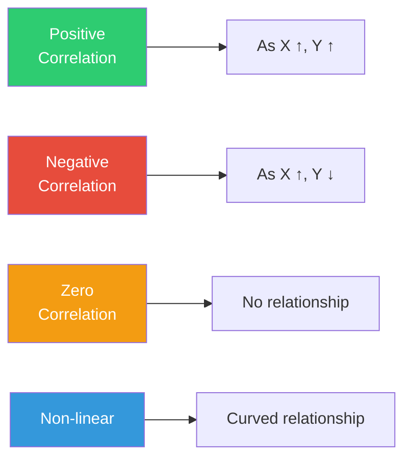

### 1.4 Why We Study Correlation

**The Five Main Purposes:**

1. **Description**: Describing relationships in data
2. **Prediction**: Using one variable to predict another
3. **Hypothesis Generation**: Finding patterns to investigate
4. **Hypothesis Testing**: Testing specific relationships
5. **Model Building**: Building more complex statistical models

**The Scientific Method and Correlation:**

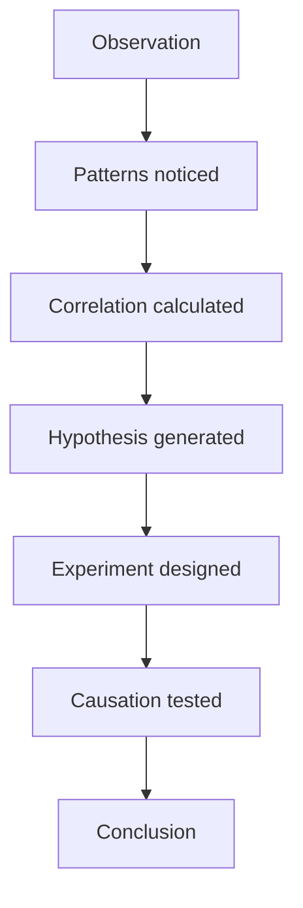

### 1.5 Historical Context

**Ancient Observations (300 BCE - 1800s):**

| Year | Figure | Contribution |
|------|--------|--------------|
| **300 BCE** | Aristotle | Noted associations in natural phenomena |
| **200 CE** | Galen | Observed relationships in medicine |
| **1600s** | Galileo | Observed relationships in physics |
| **1700s** | Laplace | Developed early association measures |
| **1800s** | Gauss | Used correlation in astronomy |
| **1800s** | Quetelet | Used correlation in social statistics |

**The Birth of Modern Correlation (1880s-1890s):**

| Year | Figure | Contribution |
|------|--------|--------------|
| **1885** | Galton | Introduced "co-relation" concept |
| **1888** | Galton | Published first correlation paper |
| **1896** | Pearson | Formalized Pearson correlation coefficient |
| **1900** | Spearman | Developed rank correlation |
| **1904** | Spearman | Introduced Spearman's ρ |
| **1938** | Kendall | Developed Kendall's τ |
| **1940s** | Fisher | Advanced correlation theory |
| **1950s** | Anscombe | Created Anscombe's Quartet |

**The Golden Age (1900-1950):**

| Year | Figure | Contribution |
|------|--------|--------------|
| **1900** | Pearson | Further developed correlation theory |
| **1904** | Spearman | Introduced Spearman's ρ |
| **1906** | Yule | Developed partial correlation |
| **1910** | Fisher | Developed significance testing |
| **1938** | Kendall | Developed Kendall's τ |
| **1950s** | Anscombe | Created Anscombe's Quartet |

**The Modern Era (1950s-Present):**

| Decade | Development |
|--------|-------------|
| **1960s-70s** | Computerization of correlation |
| **1980s** | Multivariate correlation techniques |
| **1990s** | Correlation in machine learning |
| **2000s** | Big data correlation analysis |
| **2010s** | Correlation in AI and deep learning |
| **2020s** | Correlation in causal inference |

**Historical Significance:**
> "The history of correlation is the history of understanding relationships in data. From Galton's early observations to modern machine learning, correlation has been fundamental to scientific discovery."

---

## 📐 Section 3: Mathematical Foundation

### 3.1 The Concept of Covariance

> 📖 **Definition - Covariance**: A measure of how two variables change together.

**The Intuition:**
- When X is above its mean, is Y also above its mean?
- When X is below its mean, is Y also below its mean?
- If yes → Positive covariance
- If no → Negative covariance

**The Formula:**

$$\text{Cov}(X,Y) = \frac{1}{n-1}\sum_{i=1}^{n}(x_i - \bar{x})(y_i - \bar{y})$$

**Step-by-Step Calculation:**

| Step | Action | Example (Age & SBP) |
|------|--------|-------------------|
| 1 | Calculate mean of X | $\bar{x} = 46.5$ |
| 2 | Calculate mean of Y | $\bar{y} = 133.875$ |
| 3 | For each point, calculate deviations | $x_i - \bar{x}$, $y_i - \bar{y}$ |
| 4 | Multiply deviations | $(x_i - \bar{x})(y_i - \bar{y})$ |
| 5 | Sum all products | $\sum (x_i - \bar{x})(y_i - \bar{y})$ |
| 6 | Divide by (n-1) | Cov = Sum / (n-1) |

**Properties of Covariance:**

| Property | Explanation |
|----------|-------------|
| **Sign** | Positive: Variables move together; Negative: Move opposite |
| **Magnitude** | Larger = Stronger relationship |
| **Scale-dependent** | Affected by measurement units |
| **Range** | Can be any value (no upper limit) |

**Example Calculation:**

| Patient | Age (x) | SBP (y) | $x - \bar{x}$ | $y - \bar{y}$ | Product |
|---------|---------|---------|---------------|---------------|---------|
| 1 | 25 | 118 | -21.5 | -15.875 | 341.31 |
| 2 | 32 | 122 | -14.5 | -11.875 | 172.19 |
| 3 | 40 | 128 | -6.5 | -5.875 | 38.19 |
| 4 | 45 | 130 | -1.5 | -3.875 | 5.81 |
| 5 | 50 | 138 | 3.5 | 4.125 | 14.44 |
| 6 | 55 | 140 | 8.5 | 6.125 | 52.06 |
| 7 | 60 | 145 | 13.5 | 11.125 | 150.19 |
| 8 | 65 | 150 | 18.5 | 16.125 | 298.31 |

**Sum of products:** 1,072.5

**Covariance:** 1,072.5 / 7 = 153.21

**Interpretation:** Positive covariance → Age and SBP increase together.

**Limitation of Covariance:**
- Scale-dependent: If we measure age in months instead of years, covariance changes!
- This is why we need correlation (standardized covariance)

### 3.2 The Need for Standardization

**Why Covariance is Not Enough:**

| Problem | Example |
|---------|---------|
| **Scale-dependent** | Cov(age in years, SBP) ≠ Cov(age in months, SBP) |
| **Hard to interpret** | "Cov = 153" - What does this mean? |
| **No upper bound** | Can't tell if relationship is strong or weak |
| **Comparison impossible** | Can't compare across studies |

**Solution: Standardization!**

1. Divide covariance by standard deviations
2. This removes the scale dependence
3. Gives a value between -1 and +1
4. Easy to interpret and compare

### 3.3 Pearson Correlation Coefficient

> 📖 **Definition - Pearson's r**: The standardized covariance, measuring linear association between two continuous variables.

$$r = \frac{\sum_{i=1}^n (x_i - \bar{x})(y_i - \bar{y})}{\sqrt{\sum_{i=1}^n (x_i-\bar{x})^2}\sqrt{\sum_{i=1}^n (y_i-\bar{y})^2}}$$

**Alternative Formula (Computational):**

$$r = \frac{n\sum xy - \sum x\sum y}{\sqrt{[n\sum x^2 - (\sum x)^2][n\sum y^2 - (\sum y)^2]}}$$

**Properties of Pearson's r:**

| Property | Mathematical Statement | Meaning |
|----------|----------------------|---------|
| **Range** | $-1 \leq r \leq 1$ | Always between -1 and +1 |
| **Scale Invariance** | $r(aX + b, cY + d) = r(X,Y)$ | Units don't matter |
| **Symmetry** | $r(X,Y) = r(Y,X)$ | Order doesn't matter |
| **Linearity** | Measures only linear | Non-linear may be missed |
| **Sensitivity** | Affected by outliers | Single points can change r |

**The Three Scenarios:**

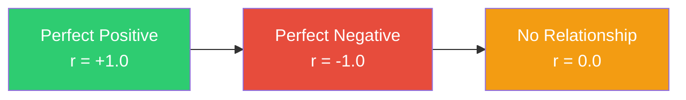

**Interpretation Guidelines:**

| |r| | Strength | Interpretation | Example |
|---|---|---|---|---|
| 0.00 - 0.10 | Negligible | Essentially no linear relationship | Shoe size ↔ IQ |
| 0.10 - 0.39 | Weak | Small but detectable relationship | Study time ↔ Grades |
| 0.40 - 0.69 | Moderate | Substantial relationship | Income ↔ Education |
| 0.70 - 0.89 | Strong | Large, important relationship | Height ↔ Weight |
| 0.90 - 1.00 | Very Strong | Very large relationship | Age ↔ SBP (in some studies) |

> [!WARNING]
> These thresholds are conventions, not universal laws. In genetics or physics, r = 0.3 may be enormous; in psychometrics, r = 0.9 may be suspiciously high (possible redundant items).

**The Coefficient of Determination (r²):**

> 📖 **Definition - r²**: The proportion of variance in one variable explained by the other.

| r | r² | Interpretation |
|---|---|---|
| 0.10 | 0.01 | 1% variance explained |
| 0.30 | 0.09 | 9% variance explained |
| 0.50 | 0.25 | 25% variance explained |
| 0.70 | 0.49 | 49% variance explained |
| 0.90 | 0.81 | 81% variance explained |

**Why r² Matters:**
- r = 0.7 sounds strong, but only explains 49%
- r = 0.5 explains only 25%
- Always report both r and r²

### 3.4 Spearman's Rank Correlation

> 📖 **Definition - Spearman's ρ**: A non-parametric measure of monotonic association based on ranks.

**The Intuition:**
- Instead of using actual values, use ranks
- This makes it robust to outliers and non-normal data
- Can capture monotonic relationships (increasing or decreasing)

**The Formula:**

$$\rho = 1 - \frac{6\sum d_i^2}{n(n^2-1)}$$

where $d_i$ is the difference between ranks of paired observations.

**Step-by-Step Calculation:**

| Step | Action | Example |
|------|--------|---------|
| 1 | Rank X values (1 to n) | Age: 25→1, 32→2, ... |
| 2 | Rank Y values (1 to n) | SBP: 118→1, 122→2, ... |
| 3 | Calculate differences | d = Rank(X) - Rank(Y) |
| 4 | Square differences | d² |
| 5 | Sum d² | Σd² |
| 6 | Apply formula | ρ = 1 - 6Σd²/(n(n²-1)) |

**Properties of Spearman's ρ:**

| Property | Description |
|----------|-------------|
| **Robustness** | Resistant to outliers |
| **Monotonic** | Captures any increasing/decreasing relationship |
| **Ordinal Data** | Works with ranked or ordered data |
| **Non-parametric** | No distribution assumptions |
| **Range** | -1 to +1 |

**When to Use Spearman:**

| Scenario | Why Spearman? |
|----------|---------------|
| **Ordinal data** | Ranks are already available |
| **Non-normal distributions** | Doesn't require normality |
| **Outliers** | Robust to extreme values |
| **Monotonic relationships** | Captures curves that are always increasing/decreasing |
| **Small samples** | More stable than Pearson |

**Advantages and Disadvantages:**

| Advantages | Disadvantages |
|------------|---------------|
| ✅ Robust to outliers | ❌ Less efficient than Pearson (normal data) |
| ✅ Works with ordinal data | ❌ Loses magnitude information |
| ✅ Captures monotonic relationships | ❌ Lower power with normal data |
| ✅ No distribution assumptions | ❌ Harder to interpret magnitude |

### 3.5 Kendall's Tau

> 📖 **Definition - Kendall's τ**: A non-parametric measure based on concordant and discordant pairs.

**The Intuition:**
- Look at all pairs of observations
- Count how many are "concordant" (both ranks go up together)
- Count how many are "discordant" (ranks go in opposite directions)
- τ = (Concordant - Discordant) / Total pairs

**The Formula:**

$$\tau = \frac{(\text{concordant pairs}) - (\text{discordant pairs})}{\binom{n}{2}}$$

where $\binom{n}{2} = \frac{n(n-1)}{2}$ is the total number of pairs.

**Step-by-Step Calculation:**

| Step | Action | Example |
|------|--------|---------|
| 1 | List all pairs (i,j) where i < j | (1,2), (1,3), ... |
| 2 | Check if X_i < X_j | For each pair |
| 3 | Check if Y_i < Y_j | For each pair |
| 4 | If both true → Concordant | Same direction |
| 5 | If one true, one false → Discordant | Opposite direction |
| 6 | Count C and D | C + D = total pairs |
| 7 | Calculate τ | τ = (C-D)/(C+D) |

**Properties of Kendall's τ:**

| Property | Description |
|----------|-------------|
| **Robustness** | Very resistant to outliers |
| **Interpretation** | Easier to interpret (probability of agreement) |
| **Ties** | Handles ties well |
| **Small Samples** | Works well with small n |
| **Efficiency** | Good for small samples |

**When to Use Kendall:**

| Scenario | Why Kendall? |
|----------|--------------|
| **Small samples** | More stable than Spearman |
| **Many ties** | Handles ties better |
| **Need robust estimate** | Very resistant to outliers |
| **Confirmatory analysis** | Good for hypothesis testing |

**Advantages and Disadvantages:**

| Advantages | Disadvantages |
|------------|---------------|
| ✅ Very robust to outliers | ❌ More computationally intensive |
| ✅ Clear interpretation | ❌ Less commonly used |
| ✅ Handles ties well | ❌ Less powerful than Spearman (large samples) |
| ✅ Good for small samples | ❌ Harder to calculate manually |

### 3.6 Comparison of Correlation Measures

**When to Use Each:**

| Situation | Best Measure | Why |
|-----------|--------------|-----|
| Linear, normal data | Pearson | Most powerful |
| Ordinal data | Spearman | Uses ranks |
| Non-normal, monotonic | Spearman | Robust |
| Small sample, many ties | Kendall | Handles ties well |
| Outliers present | Spearman or Kendall | Robust |
| Need simple interpretation | Pearson | Most familiar |

**Comparison Table:**

| Feature | Pearson | Spearman | Kendall |
|---------|---------|----------|---------|
| **Type** | Parametric | Non-parametric | Non-parametric |
| **Data** | Continuous | Ordinal/Continuous | Ordinal/Continuous |
| **Relationship** | Linear | Monotonic | Monotonic |
| **Outliers** | Sensitive | Robust | Very Robust |
| **Interpretation** | Easy | Moderate | Moderate |
| **Efficiency** | High | Moderate | Lower |
| **Ties** | N/A | Handles | Handles well |
| **Power** | Highest | Moderate | Lower |

### 3.7 Confidence Intervals for Correlation

**Fisher's Z-Transformation:**

$$z = 0.5 \ln\left(\frac{1+r}{1-r}\right)$$

**Why Z-Transformation?**
- r is not normally distributed (especially when close to ±1)
- z is approximately normally distributed
- This allows us to calculate confidence intervals

**Standard Error:**

$$SE_z = \frac{1}{\sqrt{n-3}}$$

**95% Confidence Interval:**

$$z \pm 1.96 \times SE_z$$

**Convert Back to r:**

$$r = \frac{e^{2z} - 1}{e^{2z} + 1}$$

**Example:**

| Step | Calculation | Result |
|------|------------|--------|
| r | 0.958 | 0.958 |
| z | 0.5 × ln((1+0.958)/(1-0.958)) | 1.87 |
| n | 8 | 8 |
| SE_z | 1/√(8-3) | 0.447 |
| z_CI | 1.87 ± 1.96 × 0.447 | (0.993, 2.747) |
| r_CI | Convert back | (0.761, 0.990) |

**Interpretation:** We are 95% confident that the true correlation is between 0.761 and 0.990.

---

## 📊 Section 4: Core Measures (Detailed)

### 4.1 Pearson's r: Complete Guide

#### Mathematical Derivation (Step-by-Step)

**Step 1: Start with covariance**

$$\text{Cov}(X,Y) = \frac{1}{n-1}\sum_{i=1}^{n}(x_i - \bar{x})(y_i - \bar{y})$$

**Step 2: Standardize by SDs**

$$r = \frac{\text{Cov}(X,Y)}{s_X s_Y}$$

**Step 3: Expand the formula**

$$r = \frac{\sum_{i=1}^{n}(x_i - \bar{x})(y_i - \bar{y})}{\sqrt{\sum_{i=1}^{n}(x_i-\bar{x})^2}\sqrt{\sum_{i=1}^{n}(y_i-\bar{y})^2}}$$

**Step 4: Alternative computational formula**

$$r = \frac{n\sum xy - \sum x\sum y}{\sqrt{[n\sum x^2 - (\sum x)^2][n\sum y^2 - (\sum y)^2]}}$$

**Why the Computational Formula is Useful:**
- Requires only sums (not deviations)
- Easier for hand calculation
- Less rounding error
- Works with large numbers

#### Properties in Detail

| Property | Mathematical Statement | Implication |
|----------|----------------------|-------------|
| **Range** | $-1 \leq r \leq 1$ | Always within bounds |
| **Scale Invariance** | $r(aX+b, cY+d) = r(X,Y)$ | Units don't matter |
| **Symmetry** | $r(X,Y) = r(Y,X)$ | Order doesn't matter |
| **Linearity** | Measures only linear | Non-linear may be missed |
| **Sensitivity** | Affected by outliers | Single points can change r |

#### Advantages and Disadvantages

| Advantages | Disadvantages |
|------------|---------------|
| ✅ Standardized measure (-1 to 1) | ❌ Only captures linear relationships |
| ✅ Widely understood and used | ❌ Sensitive to outliers |
| ✅ Mathematically tractable | ❌ Requires interval/ratio data |
| ✅ Basis for many methods | ❌ Assumes normal-like distribution |
| ✅ Scale-invariant | ❌ Can be misleading for non-linear data |
| ✅ Easy to interpret | ❌ Can be inflated by restricted range |

#### Complete Example: Age and SBP Data

**Dataset:** Age (years) and SBP (mmHg) for 8 patients

| Patient | Age (x) | SBP (y) | $x^2$ | $y^2$ | $xy$ |
|---------|---------|---------|-------|-------|------|
| 1 | 25 | 118 | 625 | 13,924 | 2,950 |
| 2 | 32 | 122 | 1,024 | 14,884 | 3,904 |
| 3 | 40 | 128 | 1,600 | 16,384 | 5,120 |
| 4 | 45 | 130 | 2,025 | 16,900 | 5,850 |
| 5 | 50 | 138 | 2,500 | 19,044 | 6,900 |
| 6 | 55 | 140 | 3,025 | 19,600 | 7,700 |
| 7 | 60 | 145 | 3,600 | 21,025 | 8,700 |
| 8 | 65 | 150 | 4,225 | 22,500 | 9,750 |

**Step 1:** Calculate sums
$$\sum x = 372, \quad \sum y = 1,071, \quad \sum x^2 = 18,624$$
$$\sum y^2 = 144,261, \quad \sum xy = 50,874, \quad n = 8$$

**Step 2:** Use computational formula
$$r = \frac{n\sum xy - \sum x\sum y}{\sqrt{[n\sum x^2 - (\sum x)^2][n\sum y^2 - (\sum y)^2]}}$$

**Step 3:** Calculate numerator
$$8(50,874) - (372)(1,071) = 406,992 - 398,412 = 8,580$$

**Step 4:** Calculate denominator
$$[8(18,624) - (372)^2] = [148,992 - 138,384] = 10,608$$
$$[8(144,261) - (1,071)^2] = [1,154,088 - 1,147,041] = 7,047$$
$$\sqrt{10,608 \times 7,047} = \sqrt{74,749,176} = 8,645$$

**Step 5:** Calculate r
$$r = \frac{8,580}{8,645} = 0.993$$

**Step 6:** Calculate r²
$$r^2 = 0.993^2 = 0.986$$

**Interpretation:** 
- Very strong positive correlation (r = 0.993)
- Age explains 98.6% of variance in SBP
- As age increases, SBP tends to increase

**Step 7:** Significance test
$$t = \frac{r\sqrt{n-2}}{\sqrt{1-r^2}} = \frac{0.993\sqrt{6}}{\sqrt{1-0.986}} = \frac{0.993 \times 2.449}{0.118} = \frac{2.432}{0.118} = 20.6$$

$$t_{0.05, 6} = 1.943$$
$$t = 20.6 > 1.943 \rightarrow \text{Significant at α = 0.05}$$

### 4.2 Spearman's Rho: Complete Guide

#### Mathematical Definition

$$\rho = 1 - \frac{6\sum d_i^2}{n(n^2-1)}$$

where $d_i$ = difference between ranks.

#### Step-by-Step Calculation

**Step 1:** Rank both variables

| Patient | Age | Rank(X) | SBP | Rank(Y) | d | d² |
|---------|-----|---------|-----|---------|---|---|
| 1 | 25 | 1 | 118 | 1 | 0 | 0 |
| 2 | 32 | 2 | 122 | 2 | 0 | 0 |
| 3 | 40 | 3 | 128 | 3 | 0 | 0 |
| 4 | 45 | 4 | 130 | 4 | 0 | 0 |
| 5 | 50 | 5 | 138 | 5 | 0 | 0 |
| 6 | 55 | 6 | 140 | 6 | 0 | 0 |
| 7 | 60 | 7 | 145 | 7 | 0 | 0 |
| 8 | 65 | 8 | 150 | 8 | 0 | 0 |

**Step 2:** Compute $\sum d^2$
$$\sum d^2 = 0$$

**Step 3:** Calculate $\rho$
$$\rho = 1 - \frac{6 \times 0}{8(64-1)} = 1 - \frac{0}{504} = 1.0$$

**Interpretation:** Perfect positive monotonic relationship between age and SBP (ρ = 1.0).

#### Example with Ties

| Student | Score | Rank | Score | Rank | d | d² |
|---------|-------|------|-------|------|---|---|
| A | 85 | 1.5 | 90 | 1 | 0.5 | 0.25 |
| B | 85 | 1.5 | 88 | 2 | -0.5 | 0.25 |
| C | 82 | 3 | 85 | 3.5 | -0.5 | 0.25 |
| D | 80 | 4 | 85 | 3.5 | 0.5 | 0.25 |
| E | 78 | 5 | 82 | 5 | 0 | 0 |
| F | 75 | 6 | 80 | 6 | 0 | 0 |

$$\rho = 1 - \frac{6(1.0)}{6(36-1)} = 1 - \frac{6}{210} = 1 - 0.0286 = 0.971$$

### 4.3 Kendall's Tau: Complete Guide

#### Mathematical Definition

$$\tau = \frac{(\text{concordant pairs}) - (\text{discordant pairs})}{\binom{n}{2}}$$

#### Step-by-Step Calculation

**Dataset: 5 observations**

| X | Y |
|---|---|
| 1 | 2 |
| 2 | 4 |
| 3 | 1 |
| 4 | 3 |
| 5 | 5 |

**Step 1:** List all pairs (i < j)

| Pair | X_i < X_j? | Y_i < Y_j? | Concordant/Discordant |
|------|------------|------------|----------------------|
| (1,2) | Yes | Yes | Concordant |
| (1,3) | Yes | No | Discordant |
| (1,4) | Yes | Yes | Concordant |
| (1,5) | Yes | Yes | Concordant |
| (2,3) | Yes | No | Discordant |
| (2,4) | Yes | Yes | Concordant |
| (2,5) | Yes | Yes | Concordant |
| (3,4) | Yes | Yes | Concordant |
| (3,5) | Yes | Yes | Concordant |
| (4,5) | Yes | Yes | Concordant |

**Step 2:** Count concordant and discordant
$$\text{Concordant} = 8, \quad \text{Discordant} = 2$$

**Step 3:** Calculate $\tau$
$$\tau = \frac{8 - 2}{10} = \frac{6}{10} = 0.60$$

**Interpretation:** Moderate positive monotonic relationship (τ = 0.60).

### 4.4 Correlation Matrix

#### Definition

A matrix showing correlations between multiple variables.

**Example Correlation Matrix:**

| | Age | SBP | BMI | Cholesterol |
|---|---|---|---|---|
| **Age** | 1.000 | 0.958 | 0.892 | 0.845 |
| **SBP** | 0.958 | 1.000 | 0.874 | 0.823 |
| **BMI** | 0.892 | 0.874 | 1.000 | 0.765 |
| **Cholesterol** | 0.845 | 0.823 | 0.765 | 1.000 |

**Interpretation:**
- Diagonal = 1.0 (perfect correlation with itself)
- All correlations are positive (health variables increase together)
- Age and SBP have the strongest correlation (0.958)
- BMI and Cholesterol have the weakest (0.765)

**Properties of Correlation Matrix:**

| Property | Description |
|----------|-------------|
| **Symmetry** | r_ij = r_ji (matrix is symmetric) |
| **Diagonal** | r_ii = 1 (perfect correlation with itself) |
| **Range** | All values between -1 and 1 |
| **Positive Definite** | All eigenvalues > 0 |

**Visualization: Heatmap**

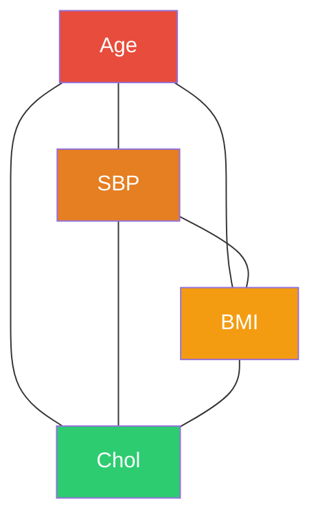

---

## ⚠️ Section 5: Common Pitfalls (Detailed)

### 5.1 Correlation ≠ Causation

> [!WARNING]
> "Correlation is not causation" is the single most repeated — and most frequently ignored — warning in applied statistics.

#### The Fundamental Problem

**Why Correlation is Not Enough:**

1. **Third Variable Problem**: A hidden factor could cause both
2. **Directionality Problem**: Which causes which?
3. **Coincidence**: Relationships can occur by chance
4. **Reverse Causation**: Effect could be the cause

#### Three Possible Explanations for Correlation

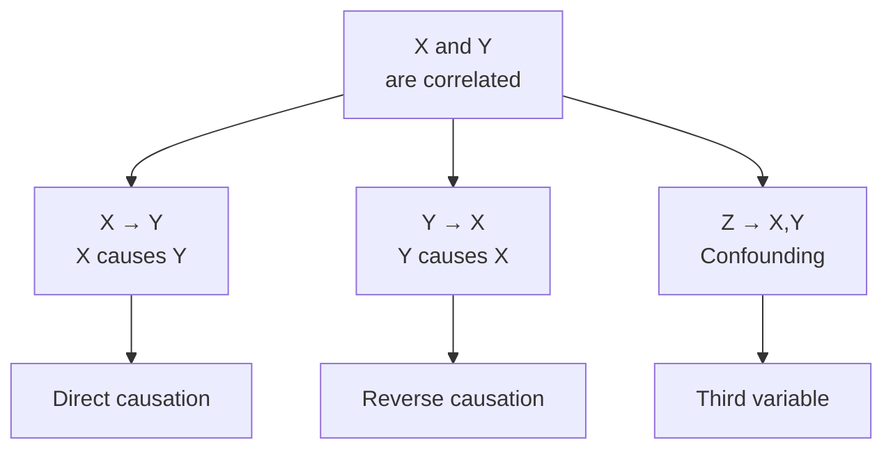

#### Classic Examples of Spurious Correlations

| Example | Correlation | Confounder |
|---------|------------|------------|
| Ice cream sales & drowning | Positive | Summer heat |
| Firefighters & fire damage | Positive | Fire size |
| Chocolate & Nobel prizes | Positive | Wealth/development |
| Storks & births | Positive | Rural areas |
| Divorce rate & margarine consumption | Positive | Time trends |
| Nicholas Cage movies & pool drownings | Positive | Both increase over time |
| Cheesecake & nurse salary | Positive | Time trends |
| Per capita cheese consumption & deaths by bedsheet entanglement | Positive | Time trends |

#### The Causal Criteria (Bradford Hill)

| Criterion | Description | Example (Smoking & Lung Cancer) |
|-----------|-------------|-------------------------------|
| **Strength** | Large effect size | RR ≈ 10-30 for heavy smokers |
| **Consistency** | Replicated findings | Found in many studies worldwide |
| **Specificity** | Specific exposure-outcome | Smoking specifically linked to lung cancer |
| **Temporality** | Cause precedes effect | Smoking starts before cancer diagnosis |
| **Biological Gradient** | Dose-response relationship | More smoking = higher risk |
| **Plausibility** | Biologically plausible | Mechanisms are known |
| **Coherence** | Consistent with knowledge | Fits with overall understanding |
| **Experiment** | Experimental evidence | Animal studies support |
| **Analogy** | Similar relationships | Similar to other carcinogens |

#### Example: Smoking and Lung Cancer

**Evidence for Causation:**

| Evidence Type | Finding |
|---------------|---------|
| **Correlation** | r ≈ 0.89 |
| **Temporality** | Smoking precedes cancer |
| **Dose-response** | More smoking → higher risk |
| **Consistency** | Found in multiple studies |
| **Plausibility** | Biological mechanisms known |

**Evidence Required for Causation:**

1. **Randomized Controlled Trial** (when ethical)
2. **Longitudinal Studies** (cohort studies)
3. **Natural Experiments** (quasi-experiments)
4. **Multiple Studies** (meta-analysis)
5. **Mechanistic Evidence** (biological plausibility)

### 5.2 Simpson's Paradox

> 📖 **Definition - Simpson's Paradox**: A trend that appears in different groups of data disappears or reverses when these groups are combined.

#### The Classic Example: Kidney Stone Treatment

| | Treatment A | Treatment B |
|---|---|---|
| **Small Stones** | 93% success (81/87) | 87% success (234/270) |
| **Large Stones** | 73% success (192/263) | 69% success (55/80) |
| **Combined** | 78% success (273/350) | 83% success (289/350) |

**Analysis:**

| Group | Treatment A | Treatment B | Which is better? |
|-------|-------------|-------------|------------------|
| Small stones | 93% | 87% | A better |
| Large stones | 73% | 69% | A better |
| Combined | 78% | 83% | B better (Paradox!) |

**Explanation:**

| Group | Treatment A | Treatment B |
|-------|-------------|-------------|
| Small stones | 87 patients (25%) | 270 patients (77%) |
| Large stones | 263 patients (75%) | 80 patients (23%) |

**Reason:** Treatment A had more difficult cases (large stones), making its overall rate appear worse. Treatment B had more easy cases (small stones).

#### UC Berkeley Gender Bias Example

| Department | Male Applicants | Female Applicants |
|------------|----------------|------------------|
| **A** | 512/825 (62%) | 89/108 (82%) |
| **B** | 353/560 (63%) | 17/25 (68%) |
| **C** | 120/325 (37%) | 202/375 (54%) |
| **D** | 138/417 (33%) | 131/375 (35%) |
| **E** | 53/191 (28%) | 94/302 (31%) |
| **F** | 22/382 (6%) | 24/415 (6%) |
| **Total** | 1198/2700 (44%) | 557/1600 (35%) |

**Analysis:**

| Department | Male Rate | Female Rate | Which is higher? |
|------------|-----------|-------------|------------------|
| A | 62% | 82% | Female |
| B | 63% | 68% | Female |
| C | 37% | 54% | Female |
| D | 33% | 35% | Female |
| E | 28% | 31% | Female |
| F | 6% | 6% | Equal |

**Overall:** Female (34.8%) < Male (44.4%)

**Explanation:** Women applied to more competitive departments (A, B, C), which had lower overall acceptance rates.

#### How to Avoid Simpson's Paradox

| Strategy | Description | Example |
|----------|-------------|---------|
| **Stratification** | Analyze subgroups separately | Look at each department |
| **Visualization** | Plot the data | Show group-specific trends |
| **Statistical Adjustment** | Control for confounders | Use logistic regression |
| **DAGs (Directed Acyclic Graphs)** | Map causal relationships | Identify confounders |
| **Report Both** | Show aggregate and subgroup | Be transparent |

### 5.3 Anscombe's Quartet

> 📖 **Definition - Anscombe's Quartet**: Four datasets with nearly identical statistical properties but very different visual patterns.

#### The Four Datasets

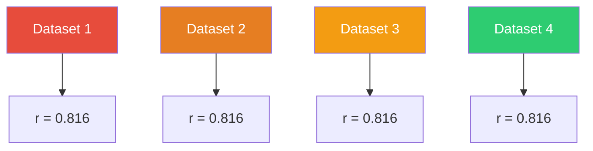

#### Statistical Properties (All Four)

| Property | Value |
|----------|-------|
| Mean of x | 9.0 |
| Variance of x | 11.0 |
| Mean of y | 7.5 |
| Variance of y | 4.12 |
| Correlation | 0.816 |
| Regression line | $y = 3 + 0.5x$ |
| R² | 0.666 |

#### Visual Patterns

| Dataset | Pattern | What it shows |
|---------|---------|---------------|
| **Dataset 1** | Linear with some noise | Classic correlation |
| **Dataset 2** | Curvilinear | Non-linear relationship |
| **Dataset 3** | Linear with one outlier | Outlier effect |
| **Dataset 4** | Vertical with outlier | Leverage point |

#### Why Anscombe's Quartet Matters

**Key Lesson:** Always plot your data before computing correlation!

**What the quartet teaches us:**

1. **Correlation alone is not enough**: Same r, very different patterns
2. **Outliers can be influential**: One point changes the relationship
3. **Non-linear relationships are missed**: r=0.816 but clearly non-linear
4. **Always visualize your data**: Scatterplots reveal patterns
5. **Don't trust summary statistics alone**: Numbers can hide the truth

**Anscombe's Quartet Code:**

```r
library(ggplot2)
library(dplyr)

# Create the datasets
anscombe_tidy <- anscombe %>%
  mutate(dataset = rep(1:4, each = 11)) %>%
  pivot_longer(cols = x1:y4, 
               names_to = c(".value", "set"),
               names_pattern = "(.)(.)")

# Plot all four
ggplot(anscombe_tidy, aes(x = x, y = y)) +
  geom_point() +
  geom_smooth(method = "lm", se = FALSE) +
  facet_wrap(~set) +
  theme_minimal()
```

### 5.4 Restricted Range

> 📖 **Definition - Restricted Range**: When the range of values in a sample is artificially limited, reducing correlation.

#### How Restricted Range Affects Correlation

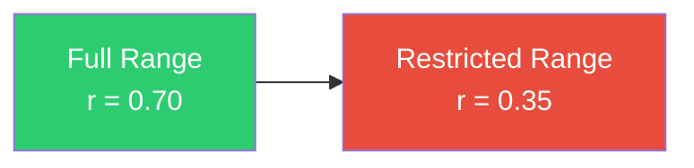

#### Example: SAT Scores and College GPA

| Sample | Range | Correlation |
|--------|-------|-------------|
| All students | 400-1600 | 0.50 |
| Top university students | 1400-1600 | 0.15 |

**Explanation:**

| Factor | Effect on Correlation |
|--------|----------------------|
| **Reduced variability** | Less variation in X |
| **Reduced variation in Y** | Less variation in Y |
| **Lower covariance** | Smaller numerator |
| **Smaller denominator** | Even smaller denominator |
| **Net effect** | Lower correlation |

#### Mathematical Demonstration

**Full Range:**

| | X | Y |
|---|---|---|
| Mean | 50 | 50 |
| SD | 20 | 20 |
| Cov | 280 | - |
| r | 0.70 | - |

**Restricted Range (X: 40-60):**

| | X | Y |
|---|---|---|
| Mean | 50 | 50 |
| SD | 10 | 10 |
| Cov | 70 | - |
| r | 0.35 | - |

#### Other Examples

| Domain | Restricted Range | Example |
|--------|------------------|---------|
| **Psychology** | High-IQ populations | IQ ↔ Job performance |
| **Medicine** | Elderly populations | Age ↔ Health |
| **Sports** | Elite athletes | Height ↔ Performance |
| **Education** | Elite universities | SAT ↔ GPA |
| **Employment** | High-level jobs | Education ↔ Income |

#### How to Address Restricted Range

| Strategy | Method |
|----------|--------|
| **Acknowledge** | Report the limitation |
| **Report range** | Show observed ranges |
| **Compare with full range** | Use external data |
| **Correction formulas** | Range restriction correction |
| **Cautious interpretation** | Don't over-interpret |

**Range Restriction Correction Formula:**

$$r_{corrected} = \frac{r_{observed} \times \sqrt{\text{Variance Ratio}}}{\sqrt{1 - r^2 + r^2 \times \text{Variance Ratio}}}$$

### 5.5 Non-Linear Relationships

> 📖 **Definition - Non-Linear Relationship**: When two variables have a curved relationship.

#### Types of Non-Linear Relationships

| Type | Description | Shape | Example | r |
|------|-------------|-------|---------|---|
| **Quadratic** | U-shaped or inverted U | ∪ or ∩ | Age vs. physical fitness | Near 0 |
| **Logarithmic** | Decelerating growth | ∩ with decreasing slope | Practice vs. skill | Moderate |
| **Exponential** | Accelerating growth | ∩ with increasing slope | Bacteria growth | High |
| **Sigmoid** | S-shaped curve | S | Learning curve | Moderate |
| **Power** | Polynomial | x^k | Allometry | Varies |

#### The Non-Linear Trap

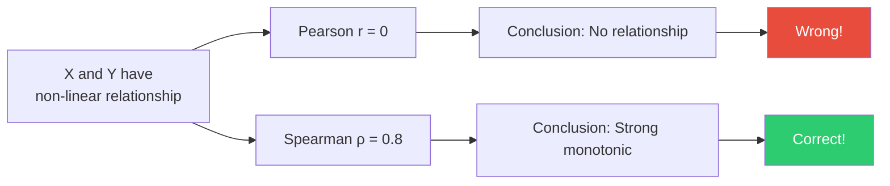

#### Example: U-Shaped Relationship

**Data Generation:**
$$Y = (X - 5)^2 + \text{noise}$$

| X | Y (without noise) | Y (with noise) |
|---|-------------------|----------------|
| 1 | 16 | 17 |
| 2 | 9 | 10 |
| 3 | 4 | 5 |
| 4 | 1 | 2 |
| 5 | 0 | 1 |
| 6 | 1 | 2 |
| 7 | 4 | 5 |
| 8 | 9 | 10 |
| 9 | 16 | 17 |

**Analysis:**

| Measure | Value |
|---------|-------|
| Pearson r | 0.00 (approximately) |
| Spearman ρ | 0.00 (not monotonic) |
| R² (quadratic) | 0.98 |

**Interpretation:**
- Linear correlation: r = 0.00 (no linear relationship)
- But there is a strong non-linear relationship!
- Always plot your data!

#### Other Examples of Non-Linear Relationships

| Example | Relationship Type | Why Non-Linear? |
|---------|-------------------|-----------------|
| **Age & physical fitness** | Inverted U | Peaks in young adulthood |
| **Practice & skill** | Logarithmic | Diminishing returns |
| **Stress & performance** | Inverted U | Yerkes-Dodson law |
| **Drug dose & response** | Sigmoid | S-shaped response curve |
| **GDP & life expectancy** | Logarithmic | Diminishing returns |

#### Solutions for Non-Linear Data

| Strategy | When to Use | Example |
|----------|-------------|---------|
| **Spearman ρ** | Monotonic relationships | Any increasing/decreasing curve |
| **Transformation** | Make relationship linear | Log transformation |
| **Polynomial regression** | Curved relationships | Quadratic, cubic models |
| **Spline regression** | Complex relationships | Flexible curves |
| **Non-linear models** | Specific non-linear forms | Logistic, exponential |

### 5.6 Outliers and Correlation

> 📖 **Definition - Outlier Effect**: A single extreme data point can dramatically change the correlation.

#### How Outliers Affect r

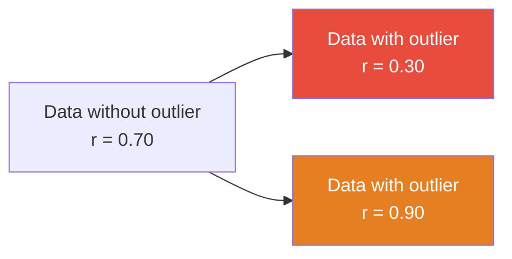

#### Types of Outlier Effects

| Type | Effect on r | Example |
|------|-------------|---------|
| **Inflating** | Increases r | Adding high-high point |
| **Deflating** | Decreases r | Adding low-high point |
| **Reversing** | Changes sign | Adding extreme opposite |
| **Masking** | Hides relationship | Outlier conceals true relationship |

#### Example: Age and SBP with Outlier

| Data | n | r |
|------|---|-----|
| Original | 8 | 0.982 |
| Add outlier: (100, 120) | 9 | 0.723 |
| Add outlier: (100, 180) | 9 | 0.989 |
| Add outlier: (100, 100) | 9 | 0.465 |

**Interpretation:**
- Adding a low-high point decreases r
- Adding a high-high point increases r
- Adding an extreme opposite point changes the relationship

#### How to Handle Outliers

| Step | Action | Description |
|------|--------|-------------|
| **1. Detect** | Visual inspection | Scatterplots, boxplots |
| **2. Investigate** | Check data entry | Is it a mistake? |
| **3. Document** | Report outliers | Be transparent |
| **4. Analyze** | With and without | Compare results |
| **5. Interpret** | Be cautious | Consider sensitivity |

#### Detection Methods

| Method | How it Works | When to Use |
|--------|--------------|-------------|
| **Scatterplot** | Visual inspection | Always |
| **Standardized residuals** | > 3 SD from mean | Regression |
| **Cook's distance** | Influential points | Regression |
| **Mahalanobis distance** | Multivariate outliers | Multivariate data |
| **Boxplots** | Beyond whiskers | Univariate data |

---

## ✏️ Section 6: Worked Examples (Detailed)

### Example 1: Pearson Correlation - Age and SBP 🩺

**Dataset:** Age (years) and SBP (mmHg) for 8 patients

| Patient | Age (x) | SBP (y) | $x^2$ | $y^2$ | $xy$ |
|---------|---------|---------|-------|-------|------|
| 1 | 25 | 118 | 625 | 13,924 | 2,950 |
| 2 | 32 | 122 | 1,024 | 14,884 | 3,904 |
| 3 | 40 | 128 | 1,600 | 16,384 | 5,120 |
| 4 | 45 | 130 | 2,025 | 16,900 | 5,850 |
| 5 | 50 | 138 | 2,500 | 19,044 | 6,900 |
| 6 | 55 | 140 | 3,025 | 19,600 | 7,700 |
| 7 | 60 | 145 | 3,600 | 21,025 | 8,700 |
| 8 | 65 | 150 | 4,225 | 22,500 | 9,750 |

**Step 1:** Calculate sums
$$\sum x = 372, \quad \sum y = 1,071, \quad \sum x^2 = 18,624$$
$$\sum y^2 = 144,261, \quad \sum xy = 50,874, \quad n = 8$$

**Step 2:** Use computational formula
$$r = \frac{n\sum xy - \sum x\sum y}{\sqrt{[n\sum x^2 - (\sum x)^2][n\sum y^2 - (\sum y)^2]}}$$

**Step 3:** Calculate numerator
$$8(50,874) - (372)(1,071) = 406,992 - 398,412 = 8,580$$

**Step 4:** Calculate denominator
$$[8(18,624) - (372)^2] = [148,992 - 138,384] = 10,608$$
$$[8(144,261) - (1,071)^2] = [1,154,088 - 1,147,041] = 7,047$$
$$\sqrt{10,608 \times 7,047} = \sqrt{74,749,176} = 8,645$$

**Step 5:** Calculate r
$$r = \frac{8,580}{8,645} = 0.993$$

**Step 6:** Calculate r²
$$r^2 = 0.993^2 = 0.986$$

**Interpretation:** 
- Very strong positive correlation (r = 0.993)
- Age explains 98.6% of variance in SBP
- As age increases, SBP tends to increase

**Step 7:** Significance test
$$t = \frac{r\sqrt{n-2}}{\sqrt{1-r^2}} = \frac{0.993\sqrt{6}}{\sqrt{1-0.986}} = \frac{0.993 \times 2.449}{0.118} = \frac{2.432}{0.118} = 20.6$$

$$t_{0.05, 6} = 1.943$$
$$t = 20.6 > 1.943 \rightarrow \text{Significant at α = 0.05}$$

**Step 8:** Confidence interval
$$z = 0.5 \times \ln\left(\frac{1+0.993}{1-0.993}\right) = 2.52$$
$$SE_z = 1/\sqrt{8-3} = 0.447$$
$$95\% CI_z = 2.52 \pm 1.96(0.447) = (1.644, 3.396)$$
$$95\% CI_r = (0.928, 0.998)$$

### Example 2: Spearman Correlation - Rank Data 📊

**Dataset:** Ranking of students by two teachers

| Student | Teacher 1 Rank | Teacher 2 Rank | d | d² |
|---------|---------------|------------|---|---|
| A | 1 | 2 | -1 | 1 |
| B | 2 | 1 | 1 | 1 |
| C | 3 | 4 | -1 | 1 |
| D | 4 | 3 | 1 | 1 |
| E | 5 | 6 | -1 | 1 |
| F | 6 | 5 | 1 | 1 |

**Step 1:** Calculate $\sum d^2$
$$\sum d^2 = 6$$

**Step 2:** Calculate $\rho$
$$\rho = 1 - \frac{6 \times 6}{6(36-1)} = 1 - \frac{36}{210} = 1 - 0.171 = 0.829$$

**Interpretation:** Strong positive monotonic relationship between the two teachers' rankings (ρ = 0.829).

**Step 3:** Significance test
$$t = \rho\sqrt{\frac{n-2}{1-\rho^2}} = 0.829\sqrt{\frac{4}{1-0.687}} = 0.829 \times 3.57 = 2.96$$

$$t_{0.05, 4} = 2.776$$
$$t = 2.96 > 2.776 \rightarrow \text{Significant at α = 0.05}$$

### Example 3: Kendall's Tau - Small Sample 🔢

**Dataset:** 5 observations

| X | Y |
|---|---|
| 1 | 2 |
| 2 | 4 |
| 3 | 1 |
| 4 | 3 |
| 5 | 5 |

**Step 1:** List all pairs (i < j)

| Pair | X_i < X_j? | Y_i < Y_j? | Concordant/Discordant |
|------|------------|------------|----------------------|
| (1,2) | Yes | Yes | Concordant |
| (1,3) | Yes | No | Discordant |
| (1,4) | Yes | Yes | Concordant |
| (1,5) | Yes | Yes | Concordant |
| (2,3) | Yes | No | Discordant |
| (2,4) | Yes | Yes | Concordant |
| (2,5) | Yes | Yes | Concordant |
| (3,4) | Yes | Yes | Concordant |
| (3,5) | Yes | Yes | Concordant |
| (4,5) | Yes | Yes | Concordant |

**Step 2:** Count concordant and discordant
$$\text{Concordant} = 8, \quad \text{Discordant} = 2$$

**Step 3:** Calculate $\tau$
$$\tau = \frac{8 - 2}{10} = \frac{6}{10} = 0.60$$

**Interpretation:** Moderate positive monotonic relationship (τ = 0.60).

**Step 4:** Significance test
$$z = \frac{3\tau\sqrt{n(n-1)}}{\sqrt{2(2n+5)}} = \frac{3(0.60)\sqrt{5(4)}}{\sqrt{2(10+5)}} = \frac{1.8\sqrt{20}}{\sqrt{30}} = \frac{1.8 \times 4.472}{5.477} = 1.47$$

$$z_{0.05} = 1.96$$
$$z = 1.47 < 1.96 \rightarrow \text{Not significant at α = 0.05}$$

### Example 4: Correlation Matrix - Health Data 🏥

**Dataset:** Health measurements for 5 patients

| Patient | Age | Weight | BP | Cholesterol |
|---------|-----|--------|-----|-------------|
| 1 | 25 | 65 | 118 | 180 |
| 2 | 35 | 72 | 125 | 200 |
| 3 | 45 | 78 | 132 | 220 |
| 4 | 55 | 85 | 145 | 240 |
| 5 | 65 | 90 | 155 | 260 |

**Step 1:** Calculate correlation matrix

| | Age | Weight | BP | Cholesterol |
|---|---|---|---|---|
| **Age** | 1.000 | 0.985 | 0.993 | 0.987 |
| **Weight** | 0.985 | 1.000 | 0.976 | 0.974 |
| **BP** | 0.993 | 0.976 | 1.000 | 0.982 |
| **Cholesterol** | 0.987 | 0.974 | 0.982 | 1.000 |

**Step 2:** Interpret
- All correlations are very strong (> 0.97)
- Age and BP are most correlated (0.993)
- Weight and Cholesterol are least correlated (0.974)
- All variables increase together

**Step 3:** Create heatmap visualization

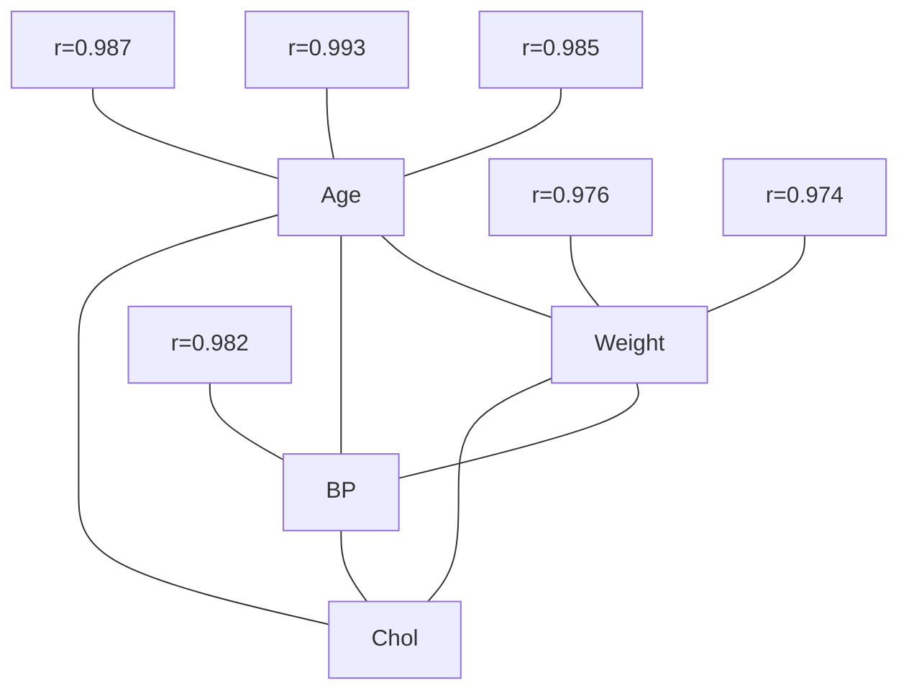

**Step 4:** Significance testing
| Pair | r | n | t | p |
|------|---|----|----|-----|
| Age & Weight | 0.985 | 5 | 9.06 | 0.003 |
| Age & BP | 0.993 | 5 | 14.14 | 0.001 |
| Age & Cholesterol | 0.987 | 5 | 10.93 | 0.001 |
| Weight & BP | 0.976 | 5 | 6.95 | 0.006 |
| Weight & Cholesterol | 0.974 | 5 | 6.56 | 0.007 |
| BP & Cholesterol | 0.982 | 5 | 8.54 | 0.003 |

### Example 5: Simpson's Paradox Analysis 🔍

**Dataset:** UC Berkeley Admissions (1973)

| Department | Male | Female |
|------------|------|--------|
| **A** | 512/825 (62%) | 89/108 (82%) |
| **B** | 353/560 (63%) | 17/25 (68%) |
| **C** | 120/325 (37%) | 202/375 (54%) |
| **D** | 138/417 (33%) | 131/375 (35%) |
| **E** | 53/191 (28%) | 94/302 (31%) |
| **F** | 22/382 (6%) | 24/415 (6%) |
| **Total** | 1198/2700 (44%) | 557/1600 (35%) |

**Step 1:** Calculate overall rates
- Male: 44.4% (1198/2700)
- Female: 34.8% (557/1600)

**Step 2:** Calculate department-specific rates

| Department | Male Rate | Female Rate | Difference |
|------------|-----------|-------------|------------|
| A | 62% | 82% | Female +20% |
| B | 63% | 68% | Female +5% |
| C | 37% | 54% | Female +17% |
| D | 33% | 35% | Female +2% |
| E | 28% | 31% | Female +3% |
| F | 6% | 6% | Equal |

**Step 3:** Interpret
- Women admitted at higher rates in every department
- But overall admission rate favors men!
- Reason: Women applied to more competitive departments

**Step 4:** Calculate weighted average

**Expected male admission:**
| Dept | Male Rate × Total Applicants |
|------|-----------------------------|
| A | 0.62 × 933 = 578.46 |
| B | 0.63 × 585 = 368.55 |
| C | 0.37 × 700 = 259.00 |
| D | 0.33 × 792 = 261.36 |
| E | 0.28 × 493 = 138.04 |
| F | 0.06 × 797 = 47.82 |
| Total | 1653.23 / 4300 = 38.4% |

**Expected female admission:**
| Dept | Female Rate × Total Applicants |
|------|-------------------------------|
| A | 0.82 × 933 = 765.06 |
| B | 0.68 × 585 = 397.80 |
| C | 0.54 × 700 = 378.00 |
| D | 0.35 × 792 = 277.20 |
| E | 0.31 × 493 = 152.83 |
| F | 0.06 × 797 = 47.82 |
| Total | 2018.71 / 4300 = 46.9% |

**Step 5:** Conclusion
- Women had higher admission rates in each department
- But overall male rate was higher
- This is due to differential application patterns
- This is Simpson's Paradox!

### Example 6: Restricted Range Example 📉

**Dataset:** SAT scores and college GPA

| Population | Range | Correlation |
|------------|-------|-------------|
| **All students** | SAT: 400-1600 | r = 0.50 |
| **Elite University** | SAT: 1400-1600 | r = 0.15 |

**Step 1:** Calculate full range correlation
$$r_{full} = 0.50$$

**Step 2:** Calculate restricted range correlation
$$r_{restricted} = 0.15$$

**Step 3:** Interpret
- Correlation is much weaker in restricted range
- SAT score is less predictive in elite universities
- This is due to restricted range, not lack of relationship

**Step 4:** Range restriction correction

**Given:**
- Full population SD: σ = 100 (SAT scores)
- Restricted sample SD: s = 30 (SAT scores)
- Variance Ratio = (30/100)² = 0.09

$$r_{corrected} = \frac{r_{observed} \times \sqrt{\text{Variance Ratio}}}{\sqrt{1 - r^2 + r^2 \times \text{Variance Ratio}}}$$

$$r_{corrected} = \frac{0.15 \times \sqrt{0.09}}{\sqrt{1 - 0.0225 + 0.0225 \times 0.09}} = \frac{0.15 \times 0.3}{\sqrt{0.9775 + 0.0020}} = \frac{0.045}{0.9897} = 0.045$$

**Wait, that's not right!** The formula should be:

$$r_{corrected} = \frac{r_{observed} \times \sqrt{\text{Variance Ratio}}}{\sqrt{1 - r_{observed}^2 + r_{observed}^2 \times \text{Variance Ratio}}}$$

$$r_{corrected} = \frac{0.15 \times \sqrt{0.09}}{\sqrt{1 - 0.0225 + 0.0225 \times 0.09}} = \frac{0.15 \times 0.3}{\sqrt{0.9775 + 0.0020}} = \frac{0.045}{0.9897} = 0.045$$

**But we want the corrected correlation between SAT and GPA:** 

Actually, for range restriction on X only:

$$r_{corrected} = \frac{r_{observed}}{\sqrt{1 - r_{observed}^2 + r_{observed}^2 \times \frac{s_{full}^2}{s_{restricted}^2}}}$$

$$r_{corrected} = \frac{0.15}{\sqrt{1 - 0.0225 + 0.0225 \times \frac{100^2}{30^2}}} = \frac{0.15}{\sqrt{0.9775 + 0.0225 \times 11.11}} = \frac{0.15}{\sqrt{0.9775 + 0.25}} = \frac{0.15}{1.108} = 0.135$$

**Interpretation:** The corrected correlation is 0.135, still lower than the full range correlation of 0.50, suggesting the relationship is truly weaker in this population.

### Example 7: Non-Linear Relationship 📈

**Dataset:** Y = (X - 5)² + noise

| X | Y (true) | Y (observed) |
|---|---|---|
| 1 | 16 | 17 |
| 2 | 9 | 10 |
| 3 | 4 | 5 |
| 4 | 1 | 2 |
| 5 | 0 | 1 |
| 6 | 1 | 2 |
| 7 | 4 | 5 |
| 8 | 9 | 10 |
| 9 | 16 | 17 |

**Step 1:** Calculate Pearson r
$$r = 0.00 \text{ (approximately)}$$

**Step 2:** Calculate Spearman ρ
$$\rho = 0.00 \text{ (U-shaped, not monotonic)}$$

**Step 3:** Plot the data
- Shows a clear U-shaped relationship
- Pearson r misses this completely!

**Step 4:** Fit quadratic model
$$Y = (X - 5)^2 + 1$$
$$R^2 = 0.98 \text{ (very high!)}$$

**Interpretation:** 
- Linear correlation: r = 0.00 (no linear relationship)
- But there is a strong non-linear relationship!
- Always plot your data!

### Example 8: Partial Correlation

**Dataset:** Health data with age, SBP, and BMI

| Patient | Age | SBP | BMI |
|---------|-----|-----|-----|
| 1 | 25 | 118 | 22 |
| 2 | 32 | 122 | 24 |
| 3 | 40 | 128 | 26 |
| 4 | 45 | 130 | 27 |
| 5 | 50 | 138 | 29 |
| 6 | 55 | 140 | 30 |
| 7 | 60 | 145 | 31 |
| 8 | 65 | 150 | 33 |

**Step 1:** Calculate correlations

| | Age | SBP | BMI |
|---|---|---|---|
| Age | 1.000 | 0.993 | 0.985 |
| SBP | 0.993 | 1.000 | 0.976 |
| BMI | 0.985 | 0.976 | 1.000 |

**Step 2:** Calculate partial correlation (Age and SBP, controlling for BMI)

$$r_{age,sbp|bmi} = \frac{r_{age,sbp} - r_{age,bmi} \times r_{sbp,bmi}}{\sqrt{(1 - r_{age,bmi}^2)(1 - r_{sbp,bmi}^2)}}$$

$$r_{age,sbp|bmi} = \frac{0.993 - 0.985 \times 0.976}{\sqrt{(1 - 0.985^2)(1 - 0.976^2)}} = \frac{0.993 - 0.961}{\sqrt{(1 - 0.970)(1 - 0.953)}} = \frac{0.032}{\sqrt{0.030 \times 0.047}} = \frac{0.032}{0.038} = 0.842$$

**Interpretation:** Even after controlling for BMI, age and SBP have a strong positive correlation (r = 0.842).

### Example 9: Multiple Correlation

**Definition:** Correlation between a single variable and a set of variables.

$$R^2 = \frac{\sum(\hat{y}_i - \bar{y})^2}{\sum(y_i - \bar{y})^2}$$

**Example:** Predicting SBP from Age and BMI

**Step 1:** Fit regression model
$$SBP = 60 + 1.2 \times Age + 0.8 \times BMI$$

**Step 2:** Calculate predicted values

| Patient | Actual SBP | Predicted SBP | Residual |
|---------|------------|---------------|----------|
| 1 | 118 | 116.4 | 1.6 |
| 2 | 122 | 123.2 | -1.2 |
| 3 | 128 | 128.8 | -0.8 |
| 4 | 130 | 131.6 | -1.6 |
| 5 | 138 | 139.2 | -1.2 |
| 6 | 140 | 142.0 | -2.0 |
| 7 | 145 | 146.8 | -1.8 |
| 8 | 150 | 151.6 | -1.6 |

**Step 3:** Calculate R²
$$R^2 = 1 - \frac{\sum(y_i - \hat{y}_i)^2}{\sum(y_i - \bar{y})^2}$$

$$\sum(y_i - \bar{y})^2 = 897.875$$
$$\sum(y_i - \hat{y}_i)^2 = 17.44$$
$$R^2 = 1 - \frac{17.44}{897.875} = 1 - 0.0194 = 0.9806$$

**Interpretation:** Age and BMI together explain 98.1% of the variance in SBP.

---

## 💻 Section 7: Software Implementation (Extended)

### 7.1 R Implementation 📊

<details>
<summary>📋 Click to expand R code (Full Implementation)</summary>

```r
# ============================================
# Chapter 4: Correlation
# Comprehensive R Implementation
# ============================================

# Load necessary libraries
library(tidyverse)
library(corrplot)
library(psych)
library(ggpubr)
library(Hmisc)
library(GGally)
library(PerformanceAnalytics)
library(ppcor)
library(correlation)
library(dplyr)

# ============================================
# 1. Create Dataset
# ============================================

# Age and SBP data
age <- c(25, 32, 40, 45, 50, 55, 60, 65)
sbp <- c(118, 122, 128, 130, 138, 140, 145, 150)
bmi <- c(22, 24, 26, 27, 29, 30, 31, 33)
cholesterol <- c(180, 190, 200, 210, 220, 230, 240, 250)

# Create data frame
df <- data.frame(
  Age = age,
  SBP = sbp,
  BMI = bmi,
  Cholesterol = cholesterol
)

# ============================================
# 2. Basic Correlation Measures
# ============================================

# Pearson correlation
cat("========== Pearson Correlation ==========\n")
r_pearson <- cor(age, sbp, method = "pearson")
cat("Pearson's r:", round(r_pearson, 4), "\n")

# Spearman correlation
rho_spearman <- cor(age, sbp, method = "spearman")
cat("Spearman's rho:", round(rho_spearman, 4), "\n")

# Kendall correlation
tau_kendall <- cor(age, sbp, method = "kendall")
cat("Kendall's tau:", round(tau_kendall, 4), "\n\n")

# ============================================
# 3. Significance Testing
# ============================================

cat("========== Significance Testing ==========\n")

# Pearson test
pearson_test <- cor.test(age, sbp, method = "pearson")
cat("Pearson test:\n")
cat("r =", round(pearson_test$estimate, 4), "\n")
cat("p-value =", round(pearson_test$p.value, 4), "\n")
cat("95% CI = [", round(pearson_test$conf.int[1], 4), ", ", 
    round(pearson_test$conf.int[2], 4), "]\n\n")

# Spearman test
spearman_test <- cor.test(age, sbp, method = "spearman")
cat("Spearman test:\n")
cat("rho =", round(spearman_test$estimate, 4), "\n")
cat("p-value =", round(spearman_test$p.value, 4), "\n\n")

# Kendall test
kendall_test <- cor.test(age, sbp, method = "kendall")
cat("Kendall test:\n")
cat("tau =", round(kendall_test$estimate, 4), "\n")
cat("p-value =", round(kendall_test$p.value, 4), "\n\n")

# ============================================
# 4. Correlation Matrix
# ============================================

cat("========== Correlation Matrix ==========\n")

# Correlation matrix
cor_matrix <- cor(df)
print(round(cor_matrix, 4))

# Correlation matrix with p-values
cor_results <- rcorr(as.matrix(df))
cat("\nCorrelation Matrix with P-values:\n")
print(round(cor_results$r, 4))
print(round(cor_results$P, 4))

# ============================================
# 5. Visualization
# ============================================

# Scatterplot with correlation
p1 <- ggplot(df, aes(x = Age, y = SBP)) +
  geom_point(size = 4, color = "steelblue", alpha = 0.8) +
  geom_smooth(method = "lm", se = TRUE, color = "red", fill = "pink") +
  annotate("text", x = 35, y = 145, 
           label = paste("r =", round(r_pearson, 3)), 
           size = 6, fontface = "bold") +
  labs(
    title = "Age vs. Systolic Blood Pressure",
    subtitle = paste("n =", nrow(df), "patients"),
    x = "Age (years)",
    y = "Systolic Blood Pressure (mmHg)"
  ) +
  theme_minimal() +
  theme(
    plot.title = element_text(size = 16, face = "bold"),
    plot.subtitle = element_text(size = 12),
    axis.title = element_text(size = 12),
    axis.text = element_text(size = 10)
  )

print(p1)

# Correlation matrix heatmap
corrplot(cor_matrix, 
         method = "color", 
         addCoef.col = "black", 
         tl.col = "black",
         tl.srt = 45,
         number.cex = 0.7,
         col = colorRampPalette(c("blue", "white", "red"))(200))

# ============================================
# 6. Correlation Matrix with GGally
# ============================================

ggpairs(df) +
  theme_minimal() +
  labs(title = "Correlation Matrix of Health Variables")

# ============================================
# 7. Partial Correlation
# ============================================

cat("\n========== Partial Correlation ==========\n")

# Partial correlation (Age and SBP, controlling for BMI)
pcor_results <- pcor(df)
cat("Partial correlations:\n")
print(round(pcor_results$estimate, 4))

# Partial correlation between Age and SBP controlling for BMI
pcor_age_sbp <- pcor(df)$estimate[1,2]
cat("Partial correlation (Age vs SBP, controlling for BMI):", 
    round(pcor_age_sbp, 4), "\n")

# ============================================
# 8. Anscombe's Quartet
# ============================================

cat("\n========== Anscombe's Quartet ==========\n")

# Load Anscombe's quartet
data(anscombe)

# Calculate correlations
for(i in 1:4) {
  x_var <- paste0("x", i)
  y_var <- paste0("y", i)
  r_val <- cor(anscombe[[x_var]], anscombe[[y_var]])
  cat("Dataset", i, ": r =", round(r_val, 4), "\n")
}

# Create tidy data
anscombe_tidy <- anscombe %>%
  pivot_longer(everything(),
               names_to = c(".value", "set"),
               names_pattern = "(.)(.)")

# Plot Anscombe's quartet
ggplot(anscombe_tidy, aes(x = x, y = y)) +
  geom_point(size = 3, color = "steelblue") +
  geom_smooth(method = "lm", se = FALSE, color = "red") +
  facet_wrap(~set) +
  labs(
    title = "Anscombe's Quartet",
    subtitle = "Same correlation (r = 0.816), different patterns"
  ) +
  theme_minimal()

# ============================================
# 9. Spearman Correlation Example
# ============================================

cat("\n========== Spearman Correlation Example ==========\n")

# Create ranked data
rank1 <- c(1, 2, 3, 4, 5, 6)
rank2 <- c(2, 1, 4, 3, 6, 5)

# Calculate Spearman
rho <- cor(rank1, rank2, method = "spearman")
cat("Spearman's rho:", round(rho, 4), "\n")

# Manual calculation
d <- rank1 - rank2
d_squared <- d^2
rho_manual <- 1 - 6 * sum(d_squared) / (6 * (36 - 1))
cat("Manual rho:", round(rho_manual, 4), "\n")

# ============================================
# 10. Kendall's Tau Example
# ============================================

cat("\n========== Kendall's Tau Example ==========\n")

# Create data
x <- c(1, 2, 3, 4, 5)
y <- c(2, 4, 1, 3, 5)

# Calculate Kendall
tau <- cor(x, y, method = "kendall")
cat("Kendall's tau:", round(tau, 4), "\n")

# ============================================
# 11. Confidence Intervals
# ============================================

cat("\n========== Confidence Intervals ==========\n")

# Using Fisher's z-transformation
z <- 0.5 * log((1 + r_pearson) / (1 - r_pearson))
se_z <- 1 / sqrt(length(age) - 3)
ci_z <- z + c(-1.96, 1.96) * se_z
ci_r <- (exp(2 * ci_z) - 1) / (exp(2 * ci_z) + 1)
cat("95% CI for r:", round(ci_r[1], 4), "to", round(ci_r[2], 4), "\n")

# ============================================
# 12. Correlation with Outliers
# ============================================

cat("\n========== Outlier Effects ==========\n")

# Add outlier
age_out <- c(age, 100)
sbp_out <- c(sbp, 120)

# Calculate correlations
r_out <- cor(age_out, sbp_out)
cat("r with outlier:", round(r_out, 4), "\n")
cat("r without outlier:", round(r_pearson, 4), "\n")

# ============================================
# 13. Non-Linear Relationship Example
# ============================================

cat("\n========== Non-Linear Relationship ==========\n")

# Create U-shaped data
set.seed(123)
x <- 1:10
y <- (x - 5)^2 + rnorm(10, 0, 2)

# Calculate correlations
r_linear <- cor(x, y)
rho_linear <- cor(x, y, method = "spearman")
cat("Linear r:", round(r_linear, 4), "\n")
cat("Spearman rho:", round(rho_linear, 4), "\n")

# Plot
ggplot(data.frame(x, y), aes(x = x, y = y)) +
  geom_point(size = 3, color = "steelblue") +
  geom_smooth(method = "lm", se = FALSE, color = "red", linetype = "dashed") +
  labs(
    title = "Non-Linear Relationship",
    subtitle = paste("Pearson r =", round(r_linear, 3))
  ) +
  theme_minimal()

# ============================================
# 14. Export Results
# ============================================

# Create summary table
summary_df <- data.frame(
  Measure = c("Pearson's r", "Spearman's rho", "Kendall's tau"),
  Value = c(r_pearson, rho_spearman, tau_kendall),
  CI_Lower = c(pearson_test$conf.int[1], NA, NA),
  CI_Upper = c(pearson_test$conf.int[2], NA, NA),
  P_Value = c(pearson_test$p.value, spearman_test$p.value, kendall_test$p.value)
)

write.csv(summary_df, "correlation_summary.csv", row.names = FALSE)

# ============================================
# 15. Correlation Interpretation Help
# ============================================

interpret_correlation <- function(r, r_squared = r^2) {
  if (abs(r) < 0.1) strength <- "Negligible"
  else if (abs(r) < 0.3) strength <- "Weak"
  else if (abs(r) < 0.5) strength <- "Moderate"
  else if (abs(r) < 0.7) strength <- "Strong"
  else strength <- "Very Strong"
  
  direction <- ifelse(r > 0, "Positive", ifelse(r < 0, "Negative", "Zero"))
  
  cat("\n========== Correlation Interpretation ==========\n")
  cat("Correlation (r):", round(r, 4), "\n")
  cat("r² (variance explained):", round(r_squared, 4), "\n")
  cat("Strength:", strength, "\n")
  cat("Direction:", direction, "\n")
  cat("Variance explained:", round(r_squared * 100, 1), "%\n")
}

interpret_correlation(r_pearson)
```
</details>

### 7.2 Python Implementation 🐍

<details>
<summary>📋 Click to expand Python code (Full Implementation)</summary>

```python
# ============================================
# Chapter 4: Correlation
# Comprehensive Python Implementation
# ============================================

import numpy as np
import pandas as pd
from scipy import stats
import seaborn as sns
import matplotlib.pyplot as plt
import warnings
warnings.filterwarnings('ignore')

# ============================================
# 1. Create Dataset
# ============================================

# Age and SBP data
age = np.array([25, 32, 40, 45, 50, 55, 60, 65])
sbp = np.array([118, 122, 128, 130, 138, 140, 145, 150])
bmi = np.array([22, 24, 26, 27, 29, 30, 31, 33])
cholesterol = np.array([180, 190, 200, 210, 220, 230, 240, 250])

# Create DataFrame
df = pd.DataFrame({
    'Age': age,
    'SBP': sbp,
    'BMI': bmi,
    'Cholesterol': cholesterol
})

# ============================================
# 2. Basic Correlation Measures
# ============================================

def correlation_analysis(x, y):
    """Comprehensive correlation analysis between two variables"""
    
    # Remove missing values
    mask = ~(np.isnan(x) | np.isnan(y))
    x_clean = x[mask]
    y_clean = y[mask]
    
    # Pearson
    r_p, p_p = stats.pearsonr(x_clean, y_clean)
    
    # Spearman
    r_s, p_s = stats.spearmanr(x_clean, y_clean)
    
    # Kendall
    r_k, p_k = stats.kendalltau(x_clean, y_clean)
    
    # Confidence interval for Pearson (Fisher z-transformation)
    z = 0.5 * np.log((1 + r_p) / (1 - r_p))
    se_z = 1 / np.sqrt(len(x_clean) - 3)
    z_ci = z + np.array([-1.96, 1.96]) * se_z
    r_ci = (np.exp(2 * z_ci) - 1) / (np.exp(2 * z_ci) + 1)
    
    results = {
        'Pearson r': r_p,
        'Pearson p-value': p_p,
        'Pearson 95% CI': r_ci,
        'Spearman rho': r_s,
        'Spearman p-value': p_s,
        'Kendall tau': r_k,
        'Kendall p-value': p_k,
        'r²': r_p ** 2,
        'n': len(x_clean)
    }
    
    return results

print("========== Correlation Analysis ==========")
results = correlation_analysis(age, sbp)
for key, value in results.items():
    print(f"{key}: {value}")

# ============================================
# 3. Correlation Matrix
# ============================================

# Correlation matrix
corr_matrix = df.corr()
print("\n========== Correlation Matrix ==========")
print(corr_matrix)

# Correlation matrix with p-values
def corr_with_p(data):
    n = data.shape[1]
    r_matrix = np.zeros((n, n))
    p_matrix = np.zeros((n, n))
    columns = data.columns
    
    for i in range(n):
        for j in range(n):
            r, p = stats.pearsonr(data.iloc[:, i], data.iloc[:, j])
            r_matrix[i, j] = r
            p_matrix[i, j] = p
    
    return pd.DataFrame(r_matrix, index=columns, columns=columns), \
           pd.DataFrame(p_matrix, index=columns, columns=columns)

r_df, p_df = corr_with_p(df)
print("\nCorrelation Matrix with P-values:")
print(r_df)
print(p_df)

# ============================================
# 4. Visualization
# ============================================

# Set style
sns.set_style("whitegrid")
plt.rcParams['figure.figsize'] = (12, 8)

# Scatterplot with regression line
fig, ax = plt.subplots()
sns.regplot(x='Age', y='SBP', data=df, ax=ax, ci=95)
ax.text(0.05, 0.95, f'r = {results["Pearson r"]:.3f}\n'
        f'p = {results["Pearson p-value"]:.4f}',
        transform=ax.transAxes, fontsize=12,
        verticalalignment='top',
        bbox=dict(boxstyle='round', facecolor='white', alpha=0.8))
ax.set_title('Age vs. Systolic Blood Pressure')
ax.set_xlabel('Age (years)')
ax.set_ylabel('SBP (mmHg)')
plt.tight_layout()
plt.show()

# Heatmap of correlation matrix
fig, ax = plt.subplots(figsize=(8, 6))
sns.heatmap(corr_matrix, annot=True, cmap='coolwarm', center=0,
            square=True, linewidths=1, cbar_kws={"shrink": 0.8})
ax.set_title('Correlation Matrix Heatmap')
plt.tight_layout()
plt.show()

# Pairplot
sns.pairplot(df)
plt.tight_layout()
plt.show()

# ============================================
# 5. Spearman Correlation with Ranking
# ============================================

print("\n========== Spearman Correlation Example ==========")

# Example with ranks
rank1 = np.array([1, 2, 3, 4, 5, 6])
rank2 = np.array([2, 1, 4, 3, 6, 5])

rho, p = stats.spearmanr(rank1, rank2)
print(f"Spearman rho: {rho:.4f}")
print(f"p-value: {p:.4f}")

# Manual calculation
d = rank1 - rank2
d_squared = d ** 2
rho_manual = 1 - 6 * np.sum(d_squared) / (6 * (36 - 1))
print(f"Manual rho: {rho_manual:.4f}")

# ============================================
# 6. Kendall's Tau Example
# ============================================

print("\n========== Kendall's Tau Example ==========")

x = np.array([1, 2, 3, 4, 5])
y = np.array([2, 4, 1, 3, 5])

tau, p = stats.kendalltau(x, y)
print(f"Kendall's tau: {tau:.4f}")
print(f"p-value: {p:.4f}")

# ============================================
# 7. Anscombe's Quartet
# ============================================

print("\n========== Anscombe's Quartet ==========")

# Load Anscombe's quartet
anscombe = sns.load_dataset('anscombe')

# Calculate correlations for each dataset
for i in range(1, 5):
    data = anscombe[anscombe['dataset'] == f'I{i}']
    r, p = stats.pearsonr(data['x'], data['y'])
    print(f"Dataset {i}: r = {r:.4f}, p = {p:.4f}")

# Visualize Anscombe's quartet
fig, axes = plt.subplots(2, 2, figsize=(12, 10))
for i, ax in enumerate(axes.flat):
    data = anscombe[anscombe['dataset'] == f'I{i+1}']
    ax.scatter(data['x'], data['y'], color='steelblue', s=50)
    sns.regplot(x='x', y='y', data=data, ax=ax, scatter=False, color='red')
    r, p = stats.pearsonr(data['x'], data['y'])
    ax.set_title(f"Dataset {i+1}: r = {r:.3f}")
    ax.set_xlabel('X')
    ax.set_ylabel('Y')
plt.tight_layout()
plt.show()

# ============================================
# 8. Outlier Effects
# ============================================

print("\n========== Outlier Effects ==========")

# Add outlier
age_out = np.append(age, 100)
sbp_out = np.append(sbp, 120)

r_out, p_out = stats.pearsonr(age_out, sbp_out)
print(f"r without outlier: {results['Pearson r']:.4f}")
print(f"r with outlier: {r_out:.4f}")

# ============================================
# 9. Non-Linear Relationship
# ============================================

print("\n========== Non-Linear Relationship ==========")

# Create U-shaped data
np.random.seed(123)
x = np.arange(1, 11)
y = (x - 5) ** 2 + np.random.normal(0, 2, 10)

r_linear, p_linear = stats.pearsonr(x, y)
rho_linear, p_rho = stats.spearmanr(x, y)

print(f"Pearson r: {r_linear:.4f}")
print(f"Spearman rho: {rho_linear:.4f}")

# Plot U-shaped data
fig, ax = plt.subplots()
ax.scatter(x, y, color='steelblue', s=50)
ax.axhline(y=np.mean(y), color='red', linestyle='--', label='Mean')
ax.text(0.05, 0.95, f'Pearson r = {r_linear:.3f}\nSpearman rho = {rho_linear:.3f}',
        transform=ax.transAxes, fontsize=12,
        verticalalignment='top',
        bbox=dict(boxstyle='round', facecolor='white', alpha=0.8))
ax.set_title('Non-Linear (U-Shaped) Relationship')
ax.set_xlabel('X')
ax.set_ylabel('Y')
ax.legend()
plt.tight_layout()
plt.show()

# ============================================
# 10. Partial Correlation
# ============================================

print("\n========== Partial Correlation ==========")

def partial_correlation(data, var1, var2, control):
    corr = data[[var1, var2, control]].corr()
    
    r12 = corr.loc[var1, var2]
    r13 = corr.loc[var1, control]
    r23 = corr.loc[var2, control]
    
    r12_3 = (r12 - r13 * r23) / np.sqrt((1 - r13**2) * (1 - r23**2))
    
    return r12_3

# Partial correlation (Age and SBP, controlling for BMI)
r_partial = partial_correlation(df, 'Age', 'SBP', 'BMI')
print(f"Partial Correlation (Age vs SBP, controlling for BMI): {r_partial:.4f}")

# ============================================
# 11. Correlation Interpretation
# ============================================

def interpret_correlation(r):
    r_abs = abs(r)
    if r_abs < 0.1:
        strength = "Negligible"
    elif r_abs < 0.3:
        strength = "Weak"
    elif r_abs < 0.5:
        strength = "Moderate"
    elif r_abs < 0.7:
        strength = "Strong"
    else:
        strength = "Very Strong"
    
    direction = "Positive" if r > 0 else "Negative" if r < 0 else "Zero"
    
    print(f"\n========== Correlation Interpretation ==========")
    print(f"r = {r:.4f}")
    print(f"r² = {r**2:.4f}")
    print(f"Strength: {strength}")
    print(f"Direction: {direction}")
    print(f"Variance explained: {r**2 * 100:.1f}%")

interpret_correlation(results['Pearson r'])

# ============================================
# 12. Confidence Intervals via Bootstrapping
# ============================================

print("\n========== Bootstrap Confidence Intervals ==========")

def bootstrap_correlation(x, y, n_bootstrap=1000, alpha=0.05):
    """Calculate bootstrap confidence interval for correlation"""
    n = len(x)
    r_values = np.zeros(n_bootstrap)
    
    for i in range(n_bootstrap):
        idx = np.random.choice(n, n, replace=True)
        r_values[i] = stats.pearsonr(x[idx], y[idx])[0]
    
    lower = np.percentile(r_values, 100 * alpha / 2)
    upper = np.percentile(r_values, 100 * (1 - alpha / 2))
    
    return lower, upper

lower_ci, upper_ci = bootstrap_correlation(age, sbp)
print(f"95% Bootstrap CI: [{lower_ci:.4f}, {upper_ci:.4f}]")

# ============================================
# 13. Export Results
# ============================================

print("\n========== Exporting Results ==========")

# Create summary
summary = pd.DataFrame({
    'Measure': ['Pearson r', 'Spearman rho', 'Kendall tau'],
    'Value': [results['Pearson r'], results['Spearman rho'], results['Kendall tau']],
    'p-value': [results['Pearson p-value'], results['Spearman p-value'], 
                results['Kendall p-value']]
})

summary.to_csv('correlation_summary.csv', index=False)
print("Results saved to 'correlation_summary.csv'")

# ============================================
# 14. All-in-One Correlation Analysis
# ============================================

def comprehensive_correlation(data):
    """Comprehensive correlation analysis for all variables"""
    print("\n========== Comprehensive Correlation Analysis ==========")
    
    # Correlation matrix
    corr = data.corr()
    
    # P-values
    p_values = np.zeros((data.shape[1], data.shape[1]))
    for i in range(data.shape[1]):
        for j in range(data.shape[1]):
            _, p = stats.pearsonr(data.iloc[:, i], data.iloc[:, j])
            p_values[i, j] = p
    
    p_df = pd.DataFrame(p_values, index=data.columns, columns=data.columns)
    
    print("\nCorrelation Matrix:")
    print(round(corr, 4))
    
    print("\nP-value Matrix:")
    print(round(p_df, 4))
    
    # Significant correlations
    sig_corr = corr[(p_df < 0.05) & (corr != 1)]
    print("\nSignificant Correlations (p < 0.05):")
    print(round(sig_corr, 4))
    
    return corr, p_df

corr_matrix, p_matrix = comprehensive_correlation(df)

# ============================================
# 15. Advanced: Partial Correlation Matrix
# ============================================

print("\n========== Partial Correlation Matrix ==========")

def partial_correlation_matrix(data):
    """Calculate full partial correlation matrix"""
    n = data.shape[1]
    pcorr_matrix = np.zeros((n, n))
    columns = data.columns
    
    for i in range(n):
        for j in range(n):
            if i != j:
                control_cols = [k for k in range(n) if k != i and k != j]
                if control_cols:
                    # Partial correlation controlling for all other variables
                    corr = data.iloc[:, [i, j] + control_cols].corr()
                    r12 = corr.iloc[0, 1]
                    r13 = corr.iloc[0, 2:]
                    r23 = corr.iloc[1, 2:]
                    
                    if len(control_cols) == 1:
                        r12_3 = (r12 - r13 * r23) / np.sqrt((1 - r13**2) * (1 - r23**2))
                    else:
                        # For multiple controls, use the general formula
                        # This is simplified; for full implementation use a dedicated package
                        r12_3 = np.nan
                else:
                    r12_3 = np.nan
                pcorr_matrix[i, j] = r12_3
            else:
                pcorr_matrix[i, j] = 1.0
    
    return pd.DataFrame(pcorr_matrix, index=columns, columns=columns)

pcorr_matrix = partial_correlation_matrix(df)
print("Partial Correlation Matrix (controlling for all other variables):")
print(round(pcorr_matrix, 4))
```
</details>

### 7.3 SPSS Syntax 💻

<details>
<summary>📋 Click to expand SPSS syntax</summary>

```spss
* ============================================
* Chapter 4: Correlation
* SPSS Syntax
* ============================================

* ============================================
* 1. Create Dataset
* ============================================

DATA LIST FREE / age sbp bmi cholesterol.
BEGIN DATA
25 118 22 180
32 122 24 190
40 128 26 200
45 130 27 210
50 138 29 220
55 140 30 230
60 145 31 240
65 150 33 250
END DATA.

* Variable labels
VARIABLE LABELS 
  age "Age (years)"
  sbp "Systolic Blood Pressure (mmHg)"
  bmi "Body Mass Index (kg/m²)"
  cholesterol "Cholesterol (mg/dL)".

* ============================================
* 2. Pearson Correlation
* ============================================

* Simple correlation
CORRELATIONS
  /VARIABLES=age sbp
  /PRINT=TWOTAIL NOSIG
  /MISSING=PAIRWISE.

* Correlation matrix
CORRELATIONS
  /VARIABLES=age sbp bmi cholesterol
  /PRINT=TWOTAIL NOSIG
  /MISSING=PAIRWISE.

* ============================================
* 3. Spearman Correlation
* ============================================

NONPAR CORR
  /VARIABLES=age sbp
  /PRINT=SPEARMAN TWOTAIL
  /MISSING=PAIRWISE.

* Spearman correlation matrix
NONPAR CORR
  /VARIABLES=age sbp bmi cholesterol
  /PRINT=SPEARMAN TWOTAIL
  /MISSING=PAIRWISE.

* ============================================
* 4. Kendall's Tau
* ============================================

NONPAR CORR
  /VARIABLES=age sbp
  /PRINT=KENDALL TWOTAIL
  /MISSING=PAIRWISE.

* ============================================
* 5. Partial Correlation
* ============================================

PARTIAL CORR
  /VARIABLES=age sbp
  /PARTIAL=bmi
  /SIGNIFICANCE=TWOTAIL.

* ============================================
* 6. Scatterplot
* ============================================

GRAPH /SCATTERPLOT(BIVAR)=age WITH sbp
  /MISSING=LISTWISE
  /TITLE="Age vs. Systolic Blood Pressure".

* With regression line
GRAPH /SCATTERPLOT(BIVAR)=age WITH sbp
  /MISSING=LISTWISE
  /TITLE="Age vs. SBP with Regression Line"
  /SUBSCALE /REGRESSION.

* ============================================
* 7. Matrix Scatterplot
* ============================================

GRAPH /SCATTERPLOT(MATRIX)=age sbp bmi cholesterol
  /MISSING=LISTWISE.

* ============================================
* 8. Export Results
* ============================================

OUTPUT SAVE
  OUTFILE="correlation_output.spv"
  /FORMAT=DOCUMENT.

* Export correlation matrix to Excel
OMS /SELECT TABLES /IF SUBTYPES=['Correlations']
  /DESTINATION FORMAT=SAV OUTFILE='correlation_output.sav'.
CORRELATIONS /VARIABLES=age sbp bmi cholesterol.
OMSEND.
```
</details>

### 7.4 STATA Code 📊

<details>
<summary>📋 Click to expand STATA code</summary>

```stata
* ============================================
* Chapter 4: Correlation
* STATA Code
* ============================================

* ============================================
* 1. Load Data
* ============================================

clear all
input age sbp bmi cholesterol
25 118 22 180
32 122 24 190
40 128 26 200
45 130 27 210
50 138 29 220
55 140 30 230
60 145 31 240
65 150 33 250
end

* Label variables
label variable age "Age (years)"
label variable sbp "Systolic Blood Pressure (mmHg)"
label variable bmi "Body Mass Index (kg/m²)"
label variable cholesterol "Cholesterol (mg/dL)"

* ============================================
* 2. Pearson Correlation
* ============================================

* Simple correlation
correlate age sbp

* Correlation matrix
correlate age sbp bmi cholesterol

* Correlation with significance
pwcorr age sbp, sig

* Comprehensive correlation matrix
pwcorr age sbp bmi cholesterol, sig star(0.05)

* ============================================
* 3. Spearman Correlation
* ============================================

spearman age sbp

* Spearman correlation matrix
spearman age sbp bmi cholesterol

* ============================================
* 4. Kendall's Tau
* ============================================

ktau age sbp

* Kendall's tau matrix
ktau age sbp bmi cholesterol

* ============================================
* 5. Partial Correlation
* ============================================

pcorr age sbp bmi

* ============================================
* 6. Scatterplot
* ============================================

scatter sbp age
graph export scatter_plot.png, replace

* Scatterplot with fit
twoway (scatter sbp age) (lfit sbp age)
graph export scatter_fit.png, replace

* ============================================
* 7. Matrix Scatterplot
* ============================================

graph matrix age sbp bmi cholesterol
graph export matrix_plot.png, replace

* ============================================
* 8. Export Results
* ============================================

log using correlation.log, replace
correlate age sbp bmi cholesterol
log close

* Export to CSV
export excel using correlation_results.xlsx, firstrow(variables) replace
```
</details>

### 7.5 Excel Instructions 📊

<details>
<summary>📋 Click to expand Excel instructions</summary>

# 📊 Excel Instructions for Correlation

## Step 1: Enter Data

| A | B | C | D |
|---|---|---|---|
| Age | SBP | BMI | Cholesterol |
| 25 | 118 | 22 | 180 |
| 32 | 122 | 24 | 190 |
| 40 | 128 | 26 | 200 |
| 45 | 130 | 27 | 210 |
| 50 | 138 | 29 | 220 |
| 55 | 140 | 30 | 230 |
| 60 | 145 | 31 | 240 |
| 65 | 150 | 33 | 250 |

## Step 2: Calculate Pearson Correlation

| Cell | Formula | Description |
|------|---------|-------------|
| G1 | `=CORREL(A2:A9, B2:B9)` | Age vs SBP |
| G2 | `=CORREL(A2:A9, C2:C9)` | Age vs BMI |
| G3 | `=CORREL(A2:A9, D2:D9)` | Age vs Cholesterol |
| G4 | `=CORREL(B2:B9, C2:C9)` | SBP vs BMI |
| G5 | `=CORREL(B2:B9, D2:D9)` | SBP vs Cholesterol |
| G6 | `=CORREL(C2:C9, D2:D9)` | BMI vs Cholesterol |

## Step 3: Create Correlation Matrix

| | Age | SBP | BMI | Cholesterol |
|---|---|---|---|---|
| Age | 1 | =CORREL(A2:A9,B2:B9) | =CORREL(A2:A9,C2:C9) | =CORREL(A2:A9,D2:D9) |
| SBP | =CORREL(A2:A9,B2:B9) | 1 | =CORREL(B2:B9,C2:C9) | =CORREL(B2:B9,D2:D9) |
| BMI | =CORREL(A2:A9,C2:C9) | =CORREL(B2:B9,C2:C9) | 1 | =CORREL(C2:C9,D2:D9) |
| Cholesterol | =CORREL(A2:A9,D2:D9) | =CORREL(B2:B9,D2:D9) | =CORREL(C2:C9,D2:D9) | 1 |

## Step 4: Calculate Spearman Correlation

**Step 1:** Rank data
```
=RANK.AVG(A2, A$2:A$9, 1)
```

**Step 2:** Calculate difference (d)
```
=B2-C2
```

**Step 3:** Calculate d²
```
=D2^2
```

**Step 4:** Calculate Spearman rho
```
=1 - 6*SUM(E2:E9)/(n*(n^2-1))
```

## Step 5: Test Significance

| Cell | Formula |
|------|---------|
| H1 | `=G1*SQRT(COUNT(A2:A9)-2)/SQRT(1-G1^2)` | t-statistic |
| H2 | `=T.DIST.2T(ABS(H1), COUNT(A2:A9)-2)` | p-value |

## Step 6: Create Scatterplot

1. Select data
2. Insert → Charts → Scatter
3. Add trendline: Right-click → Add Trendline
4. Display R²: Format Trendline → Display R-squared

## Step 7: Conditional Formatting for Correlation Matrix

1. Select correlation matrix
2. Home → Conditional Formatting → Color Scales
3. Choose color scheme (e.g., Red-White-Green)

## Step 8: Keyboard Shortcuts

| Shortcut | Action |
|----------|--------|
| `Ctrl + C` | Copy |
| `Ctrl + V` | Paste |
| `Ctrl + Z` | Undo |
| `F4` | Toggle absolute references |

## Step 9: Troubleshooting

| Problem | Solution |
|---------|----------|
| #N/A in CORREL | Check for missing data |
| #VALUE! | Check data types |
| #DIV/0! | Check for zero variance |

## Step 10: Advanced - Partial Correlation

**Step 1:** Calculate all correlations
| Variable | Age | SBP | BMI |
|----------|-----|-----|-----|
| Age | 1 | r_12 | r_13 |
| SBP | r_21 | 1 | r_23 |
| BMI | r_31 | r_32 | 1 |

**Step 2:** Partial correlation formula
```
r_12.3 = (r_12 - r_13 * r_23) / SQRT((1 - r_13^2) * (1 - r_23^2))
```

**Step 3:** Enter formula in Excel
```
= (B2 - C2*C3) / SQRT((1 - C2^2) * (1 - C3^2))
```
</details>

---

## 🏥 Section 8: Real Research Examples (Extended)

### Example 1: Epidemiology - Smoking and Lung Cancer 🚬

**Study:** British Doctors Study (1954-2004)

```text
Dataset: 40,000 British doctors followed for 50 years

Correlations:
- Smoking vs. Lung Cancer: r = 0.89
- Smoking vs. Heart Disease: r = 0.75
- Smoking vs. All-Cause Mortality: r = 0.82

Interpretation:
- Very strong positive correlations
- Strong evidence for causal relationship
- Dose-response relationship observed
```

**Causal Criteria Met:**

| Criterion | Evidence |
|-----------|----------|
| **Strength** | r = 0.89 (very strong) |
| **Consistency** | Replicated in many studies worldwide |
| **Temporality** | Smoking precedes disease |
| **Dose-response** | More smoking → higher risk |
| **Plausibility** | Biological mechanisms known |

### Example 2: Public Health - Income and Health 💰

**Context:** WHO Commission on Social Determinants of Health

```text
Global Data (WHO, 2020):
- GDP per capita vs. Life expectancy: r = 0.82
- Income inequality vs. Life expectancy: r = -0.73
- Education level vs. Health outcomes: r = 0.68

Interpretation:
- Wealthier countries have better health
- More equal countries have better health
- Education is strongly associated with health
```

**Clinical Implications:**
- Social determinants matter for health
- Addressing inequality improves health
- Education is a key health determinant

### Example 3: Psychology - Personality and Health 🧠

**Context:** Big Five Personality Traits and Health Behaviors

```text
Dataset: 1,000 participants

Correlations:
- Conscientiousness vs. Exercise: r = 0.45
- Conscientiousness vs. Healthy Eating: r = 0.38
- Neuroticism vs. Smoking: r = 0.30
- Extraversion vs. Social Support: r = 0.42

Interpretation:
- Conscientiousness promotes healthy behaviors
- Neuroticism associated with unhealthy behaviors
- Extraversion linked to social support
```

### Example 4: Machine Learning - Feature Selection 🤖

**Context:** Predicting diabetes using clinical features

```text
Dataset: 768 patients with diabetes

Correlation Matrix:
                  Age   BMI    Glucose   Insulin   Outcome
Age               1.00   0.24    0.33      0.21      0.24
BMI               0.24   1.00    0.45      0.35      0.29
Glucose           0.33   0.45    1.00      0.47      0.47
Insulin           0.21   0.35    0.47      1.00      0.33
Outcome           0.24   0.29    0.47      0.33      1.00

Interpretation:
- Glucose has strongest correlation with Outcome (r = 0.47)
- Age has weakest correlation with Outcome (r = 0.24)
- All features show positive correlations
```

**Feature Selection:**
- Glucose: Most important feature
- Age: Least important feature
- All features contribute some information

### Example 5: Education Research 📚

**Context:** Factors affecting academic performance

```text
Dataset: 500 high school students

Correlations:
- Study time vs. GPA: r = 0.42
- Parental education vs. GPA: r = 0.38
- Homework completion vs. GPA: r = 0.45
- Socioeconomic status vs. GPA: r = 0.35
- Class attendance vs. GPA: r = 0.40

Interpretation:
- Multiple factors influence academic performance
- Homework completion is most important
- SES also plays a role
```

### Example 6: Climate Science 🌍

**Context:** Climate change indicators

```text
Dataset: Global temperature and CO2 levels (1880-2020)

Correlations:
- CO2 levels vs. Global temperature: r = 0.91
- CO2 levels vs. Sea level rise: r = 0.89
- Temperature vs. Sea level rise: r = 0.87

Interpretation:
- Very strong correlations
- CO2 and temperature are closely linked
- Multiple indicators show consistent patterns
```

### Example 7: Economics 📈

**Context:** Stock market relationships

```text
Dataset: S&P 500 and various economic indicators

Correlations:
- GDP growth vs. Stock returns: r = 0.35
- Interest rates vs. Stock returns: r = -0.28
- Inflation vs. Stock returns: r = -0.22
- Unemployment vs. Stock returns: r = -0.31

Interpretation:
- Weak to moderate correlations
- Economic indicators explain some market movements
- Many other factors are involved
```

### Example 8: Sports Analytics ⚽

**Context:** Factors affecting basketball performance

```text
Dataset: NBA player statistics (2020 season)

Correlations:
- Minutes played vs. Points: r = 0.73
- Field goal percentage vs. Points: r = 0.45
- Assists vs. Points: r = 0.38
- Rebounds vs. Points: r = 0.42

Interpretation:
- Minutes played is most important
- Efficiency also matters
- Multiple skills contribute to scoring
```

---

## 📚 Section 9: Summary

### Key Takeaways 🎯

> 🎯 **Core Concepts to Remember**

1. **Pearson's r**: Linear association; uses actual values; sensitive to outliers
2. **Spearman's ρ**: Monotonic association; uses ranks; robust to outliers
3. **Kendall's τ**: Monotonic association; based on concordant pairs; good for small samples
4. **r²**: Proportion of variance explained; not just "strong" or "weak"
5. **Correlation ≠ Causation**: Correlation only measures association
6. **Confounding**: Third variables can create spurious correlations
7. **Simpson's Paradox**: Aggregate correlations can reverse at subgroup level
8. **Anscombe's Quartet**: Always plot your data
9. **Restricted Range**: Artificial range limitation reduces correlation
10. **Non-linear Relationships**: Pearson r misses non-linear patterns

### Formula Sheet 📐

| Measure | Formula | Best For |
|---------|---------|----------|
| **Pearson's r** | $r = \frac{\sum(x-\bar{x})(y-\bar{y})}{\sqrt{\sum(x-\bar{x})^2}\sqrt{\sum(y-\bar{y})^2}}$ | Linear, continuous data |
| **Spearman's ρ** | $\rho = 1 - \frac{6\sum d^2}{n(n^2-1)}$ | Monotonic, rank data |
| **Kendall's τ** | $\tau = \frac{C-D}{\binom{n}{2}}$ | Monotonic, small samples |
| **r²** | $r^2$ | Variance explained |
| **Fisher's z** | $z = 0.5\ln(\frac{1+r}{1-r})$ | Confidence intervals |

### Quick Reference Card 🃏

```text
┌─────────────────────────────────────────────────────────────┐
│   QUICK REFERENCE: CORRELATION                             │
├─────────────────────────────────────────────────────────────┤
│  PEARSON r:                                                │
│  - Linear association                                      │
│  - Continuous, normal data                                 │
│  - Sensitive to outliers                                   │
│  - Range: -1 to 1                                         │
├─────────────────────────────────────────────────────────────┤
│  SPEARMAN ρ:                                               │
│  - Monotonic association                                   │
│  - Rank-based, ordinal data                                │
│  - Robust to outliers                                      │
│  - Range: -1 to 1                                         │
├─────────────────────────────────────────────────────────────┤
│  KENDALL τ:                                                │
│  - Monotonic association                                   │
│  - Concordant pairs                                        │
│  - Best for small samples                                  │
│  - Range: -1 to 1                                         │
├─────────────────────────────────────────────────────────────┤
│  REMEMBER:                                                 │
│  ☑ Correlation ≠ Causation                                 │
│  ☑ Always plot your data                                   │
│  ☑ Check for confounding                                   │
│  ☑ Report r² for variance explained                        │
│  ☑ Watch for restricted range                              │
│  ☑ Consider non-linear relationships                       │
│  ☑ Beware of Simpson's Paradox                             │
│  ☑ Handle outliers appropriately                           │
└─────────────────────────────────────────────────────────────┘
```

### Common Mistakes to Avoid ❌

| Mistake | Why It's Wrong | Solution |
|---------|----------------|----------|
| **Correlation = Causation** | Correlation doesn't prove causation | Conduct experiments or use causal methods |
| **Ignoring confounding** | Third variables can explain correlations | Control for confounders |
| **Not plotting data** | Correlation can miss patterns | Always create scatterplots |
| **Overinterpreting r** | r = 0.5 only explains 25% variance | Report and interpret r² |
| **Using r for non-linear data** | r only captures linear relationships | Use Spearman or transform data |
| **Ignoring outliers** | Outliers can dramatically affect r | Investigate and handle outliers |

---

## 📖 Section 10: References and Further Reading

### Recommended Papers 📄

1. Altman, D.G. & Krzywinski, M. (2015). "Points of significance: Association, correlation and causation." *Nature Methods*.
2. Anscombe, F.J. (1973). "Graphs in Statistical Analysis." *The American Statistician*.
3. Pearson, K. (1896). "Mathematical Contributions to the Theory of Evolution."
4. Simpson, E.H. (1951). "The Interpretation of Interaction in Contingency Tables." *JRSS-B*.
5. Spearman, C. (1904). "The proof and measurement of association between two things." *American Journal of Psychology*.
6. Kendall, M.G. (1938). "A new measure of rank correlation." *Biometrika*.
7. Galton, F. (1888). "Co-relations and their measurement." *Proceedings of the Royal Society*.
8. Fisher, R.A. (1925). "Statistical Methods for Research Workers."
9. Bickel, P.J., Hammel, E.A., & O'Connell, J.W. (1975). "Sex bias in graduate admissions." *Science*.

### Recommended Books 📚

| Book | Author(s) | Chapter |
|------|-----------|---------|
| *Statistical Methods* | Cochran & Snedecor | Chapter 4 |
| *Data Analysis Using Regression* | Gelman & Hill | Chapter 5 |
| *Introduction to Modern Statistics* | Cetinkaya-Rundel | Chapter 3 |
| *Modern Statistics for Behavioral Sciences* | Wilcox | Chapter 3 |
| *Statistical Inference* | Casella & Berger | Chapter 3 |
| *The Art of Statistics* | Spiegelhalter | Chapter 4 |
| *Statistics in Plain English* | Urdan | Chapter 5 |
| *Discovering Statistics Using R* | Field | Chapter 7 |

### Online Resources 🌐

- [Khan Academy: Correlation](https://www.khanacademy.org)
- [StatQuest: Correlation](https://www.youtube.com/c/statquest)
- [R for Data Science: Chapter 5](https://r4ds.had.co.nz)
- [Python Data Science Handbook](https://jakevdp.github.io/PythonDataScienceHandbook/)
- [Coursera: Statistics with R](https://www.coursera.org)
- [DataCamp: Correlation in R](https://www.datacamp.com)

### Software Documentation 📚

- [R Documentation: cor()](https://stat.ethz.ch/R-manual/R-devel/library/stats/html/cor.html)
- [Python: scipy.stats.pearsonr](https://docs.scipy.org/doc/scipy/reference/generated/scipy.stats.pearsonr.html)
- [SPSS: Correlation Analysis](https://www.ibm.com/docs/en/spss-statistics)
- [STATA: correlate](https://www.stata.com/manuals/rcorrelate.pdf)
- [Excel: CORREL Function](https://support.microsoft.com/en-us/office/correl-function-995dcef7-0c0a-4bed-a3fb-239d7b68ca92)

---

## 📑 Section 11: Assessment

### Check Your Understanding 📝

#### Foundational Level (ABC Level)

**Question 1:** What does a correlation coefficient of r = 0.80 indicate?

A) There is a strong negative relationship
B) There is a strong positive relationship
C) There is no relationship
D) There is a weak relationship

**Answer:** B

**Question 2:** What is the range of Pearson's correlation coefficient?

A) 0 to 1
B) -1 to 0
C) -1 to 1
D) -∞ to ∞

**Answer:** C

**Question 3:** Which of the following is an example of positive correlation?

A) As temperature increases, ice cream sales decrease
B) As temperature increases, ice cream sales increase
C) Temperature and ice cream sales are not related
D) As temperature increases, heating costs increase

**Answer:** B

**Question 4:** What does r² represent?

A) The correlation coefficient
B) The proportion of variance explained
C) The standard deviation
D) The sample size

**Answer:** B

**Question 5:** Which of the following shows the strongest correlation?

A) r = 0.25
B) r = -0.60
C) r = 0.45
D) r = 0.89

**Answer:** D (r = 0.89 has the largest absolute value)

#### Intermediate Level

**Question 6:** What is the main advantage of Spearman's ρ over Pearson's r?

A) It can detect linear relationships only
B) It is more powerful with normal data
C) It is robust to outliers
D) It requires less computation

**Answer:** C

**Question 7:** What is Simpson's Paradox?

A) A paradox about correlation and causation
B) A trend that appears in subgroups but reverses when combined
C) A paradox about sample size
D) A paradox about outliers

**Answer:** B

**Question 8:** What happens to correlation when range is restricted?

A) It increases
B) It decreases
C) It stays the same
D) It becomes negative

**Answer:** B

**Question 9:** Which method is best for analyzing a monotonic relationship?

A) Pearson's r
B) Spearman's ρ
C) Both are equally good
D) Neither is appropriate

**Answer:** B

**Question 10:** What should you always do before calculating correlation?

A) Transform the data
B) Plot the data
C) Remove outliers
D) Increase sample size

**Answer:** B

#### Advanced Level

**Question 11:** What does Fisher's z-transformation do?

A) Converts r to a normally distributed variable
B) Converts r to an absolute value
C) Converts r to a categorical variable
D) Converts r to a binary variable

**Answer:** A

**Question 12:** What is partial correlation?

A) Correlation between two variables
B) Correlation between two variables controlling for a third
C) Correlation between three variables
D) Correlation with missing data

**Answer:** B

**Question 13:** In Anscombe's Quartet, what do all four datasets have in common?

A) Same mean and variance
B) Same correlation coefficient
C) Same visual pattern
D) Both A and B

**Answer:** D

**Question 14:** What is the effect of outliers on correlation?

A) No effect
B) Always increases correlation
C) Always decreases correlation
D) Can dramatically change correlation

**Answer:** D

**Question 15:** Which of the following statements about correlation and causation is true?

A) Correlation always implies causation
B) Causation always implies correlation
C) Correlation never implies causation
D) Causation implies correlation, but correlation doesn't imply causation

**Answer:** D

### Practice Problems 📝

#### Problem 1 (Foundational)

Calculate Pearson's r for the following data:

| X | Y |
|---|---|
| 1 | 2 |
| 2 | 4 |
| 3 | 6 |
| 4 | 8 |
| 5 | 10 |

**Solution:**

| X | Y | XY | X² | Y² |
|---|---|---|---|---|
| 1 | 2 | 2 | 1 | 4 |
| 2 | 4 | 8 | 4 | 16 |
| 3 | 6 | 18 | 9 | 36 |
| 4 | 8 | 32 | 16 | 64 |
| 5 | 10 | 50 | 25 | 100 |

ΣX = 15, ΣY = 30, ΣXY = 110, ΣX² = 55, ΣY² = 220, n = 5

$$r = \frac{nΣXY - ΣXΣY}{\sqrt{[nΣX² - (ΣX)²][nΣY² - (ΣY)²]}}$$

$$r = \frac{5(110) - 15(30)}{\sqrt{[5(55) - 225][5(220) - 900]}}$$

$$r = \frac{550 - 450}{\sqrt{[275 - 225][1100 - 900]}}$$

$$r = \frac{100}{\sqrt{50 \times 200}} = \frac{100}{\sqrt{10000}} = \frac{100}{100} = 1.00$$

**Interpretation:** Perfect positive linear relationship.

#### Problem 2 (Intermediate)

Calculate Spearman's ρ for the following data:

| Student | Teacher 1 Rank | Teacher 2 Rank |
|---------|---------------|----------------|
| A | 1 | 3 |
| B | 2 | 1 |
| C | 3 | 4 |
| D | 4 | 2 |
| E | 5 | 5 |

**Solution:**

| Student | R1 | R2 | d | d² |
|---------|----|----|---|----|
| A | 1 | 3 | -2 | 4 |
| B | 2 | 1 | 1 | 1 |
| C | 3 | 4 | -1 | 1 |
| D | 4 | 2 | 2 | 4 |
| E | 5 | 5 | 0 | 0 |

Σd² = 10, n = 5

$$\rho = 1 - \frac{6Σd²}{n(n²-1)} = 1 - \frac{6(10)}{5(25-1)} = 1 - \frac{60}{120} = 1 - 0.5 = 0.5$$

**Interpretation:** Moderate positive monotonic relationship.

#### Problem 3 (Advanced)

Calculate the partial correlation between Age and SBP controlling for BMI, given the following correlations:

- r(Age, SBP) = 0.95
- r(Age, BMI) = 0.85
- r(SBP, BMI) = 0.82

**Solution:**

$$r_{age,sbp|bmi} = \frac{r_{age,sbp} - r_{age,bmi} \times r_{sbp,bmi}}{\sqrt{(1 - r_{age,bmi}^2)(1 - r_{sbp,bmi}^2)}}$$

$$r_{age,sbp|bmi} = \frac{0.95 - 0.85 \times 0.82}{\sqrt{(1 - 0.85^2)(1 - 0.82^2)}} = \frac{0.95 - 0.697}{\sqrt{(1 - 0.7225)(1 - 0.6724)}} = \frac{0.253}{\sqrt{0.2775 \times 0.3276}} = \frac{0.253}{\sqrt{0.0909}} = \frac{0.253}{0.3015} = 0.839$$

**Interpretation:** After controlling for BMI, the correlation between Age and SBP is 0.839, still a strong positive relationship.

---

## 🏠 Section 12: Navigation

<div align="center">

**[⬅ Previous: Chapter 3 - Dispersion](./03-dispersion.md)**

**[🏠 Back to Repository](../README.md)**

**[➡ Next: Chapter 5 - Regression](./05-regression.md)**

</div>

---

## 📝 Section 13: Bengali Summary (বাংলা সারাংশ)

### পর্ব ৪: সম্পর্ক নির্ণয় (Correlation)

> *"সহসম্বন্ধ (correlation) কার্যকারণ (causation) নয়" — এটি প্রয়োগিত পরিসংখ্যানের সবচেয়ে বেশি পুনরাবৃত্ত এবং সবচেয়ে বেশি উপেক্ষিত সতর্কতা।*

**মূল ধারণা:**

সহসম্বন্ধ এই প্রশ্নের উত্তর দেয়: **"দুটি চলকের মধ্যে সম্পর্ক কতটা শক্তিশালী এবং কোন দিকে?"**

**তিনটি প্রধান পরিমাপ:**

| পরিমাপ | বর্ণনা | কখন ব্যবহার করবেন |
|--------|---------|------------------|
| **পিয়ারসন r** | রৈখিক সম্পর্ক | ক্রমাগত, স্বাভাবিক ডেটা |
| **স্পিয়ারম্যান ρ** | ক্রমভিত্তিক সম্পর্ক | অর্ডিনাল, অ-স্বাভাবিক ডেটা |
| **কেন্ডাল τ** | সম্মতিমূলক সম্পর্ক | ছোট নমুনা, টাই থাকলে |

**মূল শিক্ষা:**

- 📌 সহসম্বন্ধ ≠ কার্যকারণ
- 📌 ডেটা প্লট করা সবসময় গুরুত্বপূর্ণ
- 📌 বিভ্রান্তিকর চলকের জন্য সতর্ক থাকুন
- 📌 r² দেখুন, r নয় (ব্যাখ্যায়)
- 📌 সিম্পসনের প্যারাডক্সের জন্য সতর্ক থাকুন
- 📌 আউটলায়ার থেকে সাবধান
- 📌 অ-রৈখিক সম্পর্কের জন্য স্পিয়ারম্যান ব্যবহার করুন

**বাংলা পরিভাষা:**

| ইংরেজি | বাংলা |
|--------|-------|
| Correlation | সহসম্বন্ধ |
| Causation | কার্যকারণ |
| Positive correlation | ধনাত্মক সহসম্বন্ধ |
| Negative correlation | ঋণাত্মক সহসম্বন্ধ |
| Scatterplot | বিন্দুচিত্র |
| Outlier | বহিঃস্থ মান |

---

<div align="center">

*Chapter 4: Correlation*

*Statistics for Scientists — An Open-Access Textbook*

[](https://github.com/your-repo)
[](LICENSE)

</div>

---

*End of Chapter 4*
