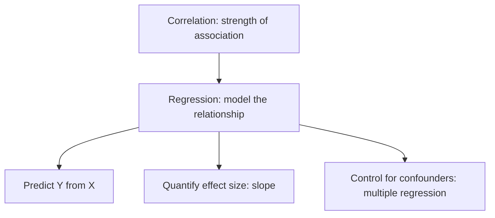
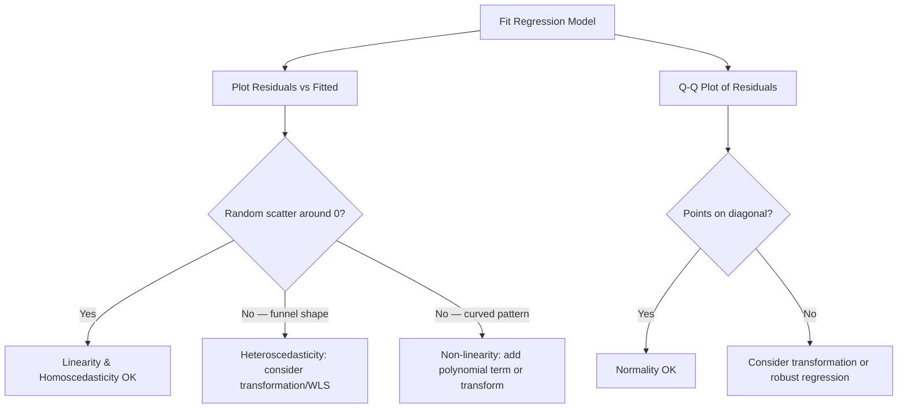

# Chapter 5: Linear Regression

[⬅ Previous: Correlation](./04-correlation.md) | [🏠 Home](../README.md) | [➡ Next: Probability Distributions](./06-probability-distributions.md)

---

## Learning Objectives

- [ ] Derive the ordinary least squares (OLS) estimators by hand
- [ ] Interpret regression coefficients, intercept, R², and residual standard error
- [ ] Check the four key assumptions of linear regression (LINE)
- [ ] Extend simple to multiple linear regression and interpret adjusted coefficients
- [ ] Diagnose violations using residual plots
- [ ] Implement regression in R, Python, SPSS, STATA, and SAS

## Prerequisites

- Chapter 4 (Correlation)
- Basic matrix algebra (helpful, not required)

## Estimated Study Time

⏱️ 4–5 hours

---

## Why This Topic Matters

> [!TIP]
> Linear regression is the single most widely used statistical model in applied science. Nearly every advanced method in this textbook — logistic regression, GLMs, mixed models, causal inference — is a direct extension of the ideas in this chapter.

## Big Picture



## Core Intuition

Regression fits a line (or hyperplane) through data to describe how the **expected value** of an outcome $Y$ changes as a predictor $X$ changes. Unlike correlation (symmetric between X and Y), regression is **directional**: $Y$ is explicitly modeled as a function of $X$.

## Mathematical Foundation

### Simple Linear Regression Model

$$Y_i = \beta_0 + \beta_1 X_i + \varepsilon_i, \qquad \varepsilon_i \sim N(0, \sigma^2)$$

- $\beta_0$: intercept (expected Y when X = 0)
- $\beta_1$: slope (expected change in Y per one-unit increase in X)
- $\varepsilon_i$: random error term

### Ordinary Least Squares (OLS) Derivation

OLS chooses $\hat\beta_0, \hat\beta_1$ to minimize the sum of squared residuals:

$$SSE = \sum_{i=1}^n (y_i - \hat\beta_0 - \hat\beta_1 x_i)^2$$

Taking partial derivatives and setting to zero (the "normal equations"):

$$\frac{\partial SSE}{\partial \hat\beta_0} = -2\sum(y_i - \hat\beta_0 - \hat\beta_1 x_i) = 0$$
$$\frac{\partial SSE}{\partial \hat\beta_1} = -2\sum x_i(y_i - \hat\beta_0 - \hat\beta_1 x_i) = 0$$

Solving simultaneously gives the closed-form OLS estimators:

$$\hat\beta_1 = \frac{\sum(x_i-\bar{x})(y_i-\bar{y})}{\sum(x_i-\bar{x})^2} = \frac{\text{Cov}(X,Y)}{\text{Var}(X)}$$

$$\hat\beta_0 = \bar{y} - \hat\beta_1 \bar{x}$$

**Note the connection to Chapter 4**: $\hat\beta_1 = r \times \frac{s_y}{s_x}$ — the regression slope is the correlation coefficient rescaled by the ratio of standard deviations.

### Coefficient of Determination (R²)

$$R^2 = 1 - \frac{SSE}{SST} = 1 - \frac{\sum(y_i-\hat y_i)^2}{\sum(y_i - \bar y)^2}$$

For simple linear regression, $R^2 = r^2$ — the square of Pearson's correlation coefficient.

## Assumptions ("LINE")

| Letter | Assumption | How to Check |
|---|---|---|
| **L** | **L**inearity | Residual vs. fitted plot (should show no pattern) |
| **I** | **I**ndependence of errors | Study design; Durbin-Watson test for time series |
| **N** | **N**ormality of residuals | Q-Q plot; Shapiro-Wilk test |
| **E** | **E**qual variance (homoscedasticity) | Residual vs. fitted plot (constant spread) |



## Multiple Linear Regression

$$Y_i = \beta_0 + \beta_1 X_{1i} + \beta_2 X_{2i} + \cdots + \beta_k X_{ki} + \varepsilon_i$$

Each $\beta_j$ is now interpreted as the effect of $X_j$ **holding all other predictors constant** — this is what allows regression to "control for confounders," a concept central to Chapter 34 (Causation vs. Prediction).

**Adjusted R²** penalizes for the number of predictors, preventing the misleading inflation of R² that occurs simply from adding more variables:

$$R^2_{adj} = 1 - (1-R^2)\frac{n-1}{n-k-1}$$

## Worked Example

Continuing the age/SBP dataset from Chapter 4:

| Age (x) | SBP (y) |
|---|---|
| 25 | 118 |
| 32 | 122 |
| 40 | 128 |
| 45 | 130 |
| 50 | 138 |
| 55 | 140 |
| 60 | 145 |
| 65 | 150 |

From Chapter 4: $r \approx 0.958$, $s_x \approx 13.79$, $s_y \approx 11.33$

**Slope**:
$$\hat\beta_1 = r \times \frac{s_y}{s_x} = 0.958 \times \frac{11.33}{13.79} \approx 0.787$$

**Intercept**:
$$\hat\beta_0 = 133.875 - (0.787)(46.5) \approx 97.29$$

**Fitted equation**:
$$\widehat{SBP} = 97.29 + 0.787 \times \text{Age}$$

**Interpretation**: Each additional year of age is associated with a **0.787 mmHg** increase in expected systolic blood pressure, in this sample.

**R²** = $r^2 = 0.958^2 \approx 0.918$ → approximately 91.8% of the variability in SBP is statistically explained by age in this small dataset.

## Software Implementation

### R

```r
age <- c(25,32,40,45,50,55,60,65)
sbp <- c(118,122,128,130,138,140,145,150)

model <- lm(sbp ~ age)
summary(model)

# Diagnostics
par(mfrow = c(2,2))
plot(model)             # Residuals vs Fitted, Q-Q, Scale-Location, Leverage

# Multiple regression example
bmi <- c(22,24,26,27,29,30,31,33)
model2 <- lm(sbp ~ age + bmi)
summary(model2)
```

### Python

```python
import statsmodels.api as sm
import numpy as np

age = np.array([25,32,40,45,50,55,60,65])
sbp = np.array([118,122,128,130,138,140,145,150])

X = sm.add_constant(age)
model = sm.OLS(sbp, X).fit()
print(model.summary())

# Diagnostics
import matplotlib.pyplot as plt
residuals = model.resid
fitted = model.fittedvalues
plt.scatter(fitted, residuals)
plt.axhline(0, color="red")
plt.xlabel("Fitted values"); plt.ylabel("Residuals")
plt.show()

sm.qqplot(residuals, line="45")
plt.show()
```

### SPSS

```spss
REGRESSION
  /DEPENDENT sbp
  /METHOD=ENTER age
  /SCATTERPLOT=(*ZRESID ,*ZPRED)
  /RESIDUALS HISTOGRAM(ZRESID) NORMPROB(ZRESID).
```

### STATA

```stata
regress sbp age
predict resid, residuals
predict fitted, xb
scatter resid fitted, yline(0)
qnorm resid

* Multiple regression
regress sbp age bmi
```

### SAS

```sas
PROC REG DATA=work.patients;
    MODEL sbp = age / CLB;
    OUTPUT OUT=diagnostics R=residual P=predicted;
RUN;

PROC SGPLOT DATA=diagnostics;
    SCATTER X=predicted Y=residual;
    REFLINE 0 / AXIS=Y;
RUN;
```

## Real Research Example — Clinical Research

In clinical research, multiple linear regression is the standard tool for adjusting a treatment effect for baseline confounders (e.g., adjusting the effect of a drug on blood pressure for age, baseline BP, and BMI). The reported "adjusted effect size" in most clinical papers comes directly from a regression coefficient, not from a raw group difference.

## Common Mistakes

| Mistake | Consequence |
|---|---|
| Extrapolating beyond the observed X range | Predictions outside the data become unreliable |
| Ignoring residual diagnostics entirely | Invalid inference (CIs, p-values wrong) if assumptions violated |
| Interpreting β as causal without a causal design | Confounding still possible even after "adjustment" |
| Adding many predictors to inflate R² | Overfitting; use adjusted R² and cross-validation (Chapter 22) |
| Ignoring multicollinearity among predictors | Unstable, uninterpretable coefficients |

## Reviewer Perspective

> [!NOTE]
> **Typical Reviewer Comment**: *"The regression model includes 15 predictors with only 40 observations. Please justify variable selection and report a check for multicollinearity (VIF) and overfitting (e.g., via cross-validation)."*

## AI Evaluation Perspective

Automated model-checking tools flag regressions where the ratio of predictors to sample size exceeds common rules of thumb (e.g., fewer than 10–20 observations per predictor), and check whether residual diagnostics are reported alongside coefficient tables.

## Frequently Asked Questions

**Q: Does a significant regression coefficient imply a causal effect?**
A: No — it implies a statistical association after adjusting for the other variables in the model. Causal claims require a causal inference framework (Chapters 34–37).

**Q: What's the difference between R² and adjusted R²?**
A: R² always increases (or stays the same) as you add predictors, even irrelevant ones. Adjusted R² penalizes for additional predictors, giving a fairer comparison across models with different numbers of variables.

## Practice Problems

### MCQs
1. OLS minimizes: (a) sum of residuals (b) **sum of squared residuals** (c) sum of absolute residuals (d) R²
2. For simple linear regression, R² equals: (a) $r$ (b) **$r^2$** (c) $1/r$ (d) $\beta_1$

### Short Questions
1. Explain, in plain language, what the slope coefficient $\beta_1$ represents.
2. Why does adjusted R² sometimes decrease when a new predictor is added, while R² never does?

### Programming Exercise
Using the multiple regression model (sbp ~ age + bmi) above, compute the Variance Inflation Factor (VIF) for each predictor in R (`car::vif()`) or Python (`statsmodels`) and interpret whether multicollinearity is a concern.

## Chapter Summary

- OLS regression finds the line minimizing squared residuals; the slope directly connects to Pearson's r.
- Assumptions (LINE: Linearity, Independence, Normality, Equal variance) must be checked via residual diagnostics.
- Multiple regression allows "adjustment" for confounders but does not by itself establish causation.
- R² measures explained variance; adjusted R² corrects for the number of predictors.

## Key Takeaways

- 📌 Always plot residuals — never trust a regression output without diagnostics.
- 📌 A regression coefficient is a conditional association, not automatically a causal effect.
- 📌 More predictors is not always better — watch for overfitting and multicollinearity.

## Recommended Papers

- Kutner, M.H. et al. (2004). *Applied Linear Statistical Models*, 5th ed.

## Further Reading

- Gelman, A. & Hill, J. (2006). *Data Analysis Using Regression and Multilevel/Hierarchical Models*.

## References

1. Legendre, A.M. (1805). Original least squares method, *Nouvelles méthodes pour la détermination des orbites des comètes*.
2. Galton, F. (1886). "Regression Towards Mediocrity in Hereditary Stature." *JAI*.

---

## Previous Chapter
[⬅ Chapter 4: Correlation](./04-correlation.md)

## Next Chapter
[➡ Chapter 6: Probability Distributions](./06-probability-distributions.md)
