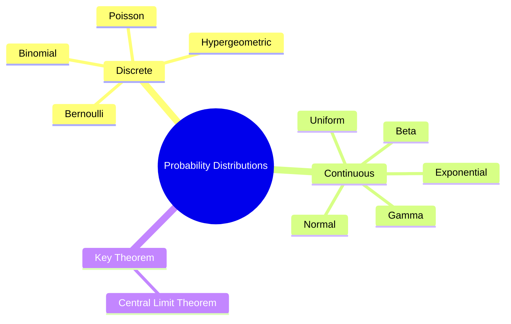
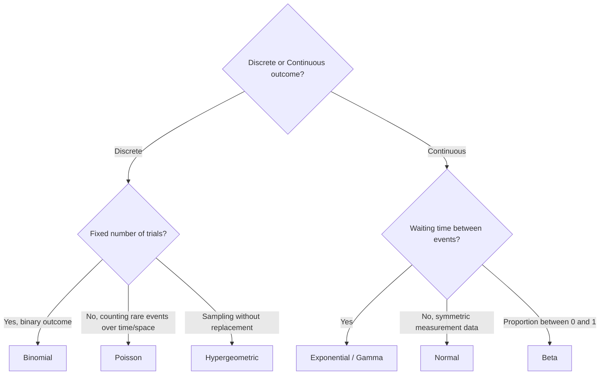
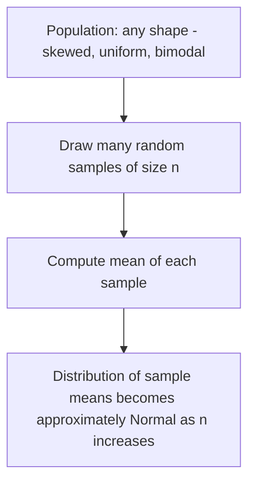

# Chapter 6: Probability Distributions

[⬅ Previous: Regression](./05-regression.md) | [🏠 Home](../README.md) | [➡ Next: Hypothesis Testing](./07-hypothesis-testing.md)

---

## Learning Objectives

- [ ] Distinguish discrete vs. continuous probability distributions
- [ ] Compute probabilities using Binomial, Poisson, and Normal distributions
- [ ] Understand PMF, PDF, and CDF and how they relate
- [ ] Apply the Central Limit Theorem and explain why it matters for inference
- [ ] Choose the correct distribution for a given real-world data-generating process
- [ ] Simulate distributions and verify theoretical properties computationally

## Prerequisites

- Chapter 1–3 (Descriptive Statistics, Central Tendency, Dispersion)
- Basic algebra; factorials and exponents

## Estimated Study Time

⏱️ 4–5 hours

---

## Why This Topic Matters

> [!TIP]
> Every hypothesis test, confidence interval, and p-value in the rest of this textbook rests on an assumed probability distribution. Understanding *why* a particular distribution is used for a particular kind of data is what separates mechanical statistics from genuine statistical reasoning.

## Big Picture



## Core Intuition

A probability distribution is a mathematical description of **which values a random variable can take, and how likely each is**. Discrete distributions describe countable outcomes (number of successes, number of events); continuous distributions describe measurements on a continuum (height, time, concentration).

## Discrete Distributions

### Bernoulli Distribution

Models a single trial with two outcomes (success/failure):

$$P(X=x) = p^x(1-p)^{1-x}, \quad x \in \{0,1\}$$

$$E[X] = p \qquad \text{Var}(X) = p(1-p)$$

### Binomial Distribution

Models the number of successes in $n$ independent Bernoulli trials with success probability $p$:

$$P(X=k) = \binom{n}{k}p^k(1-p)^{n-k}, \quad k = 0,1,\dots,n$$

$$E[X] = np \qquad \text{Var}(X) = np(1-p)$$

**Example use case**: Number of patients responding to treatment out of 50 enrolled, assuming a constant, independent response probability.

### Poisson Distribution

Models the number of events occurring in a fixed interval of time or space, given a constant average rate $\lambda$:

$$P(X=k) = \frac{e^{-\lambda}\lambda^k}{k!}, \quad k = 0,1,2,\dots$$

$$E[X] = \lambda \qquad \text{Var}(X) = \lambda$$

**Example use case**: Number of hospital admissions per day, number of disease cases per district per month (used extensively in epidemiological surveillance).

**Poisson as a limit of Binomial**: When $n$ is large, $p$ is small, and $np = \lambda$ is moderate, the Binomial distribution converges to the Poisson — this is why Poisson models "rare events."

### Hypergeometric Distribution

Models sampling **without replacement** from a finite population with two categories (unlike Binomial, which assumes independence/replacement):

$$P(X=k) = \frac{\binom{K}{k}\binom{N-K}{n-k}}{\binom{N}{n}}$$

Used, for example, in exact tests for small clinical trial contingency tables (Fisher's Exact Test, Chapter 14).

## Continuous Distributions

### Uniform Distribution

All values in $[a,b]$ equally likely:

$$f(x) = \frac{1}{b-a}, \quad a \le x \le b$$

### Normal (Gaussian) Distribution

The single most important distribution in statistics:

$$f(x) = \frac{1}{\sigma\sqrt{2\pi}} e^{-\frac{(x-\mu)^2}{2\sigma^2}}$$

Fully characterized by two parameters: mean $\mu$ and standard deviation $\sigma$. Symmetric, bell-shaped, and the limiting distribution of sums/averages of many independent random variables (see Central Limit Theorem below).

### Exponential Distribution

Models waiting time between events in a Poisson process:

$$f(x) = \lambda e^{-\lambda x}, \quad x \ge 0 \qquad E[X] = \frac{1}{\lambda}$$

**Memoryless property**: $P(X > s+t \mid X > s) = P(X > t)$ — the time already waited doesn't affect future waiting time. Used in survival analysis (Chapter 39) as a baseline hazard assumption.

### Gamma and Beta Distributions

- **Gamma**: generalizes the exponential to model the waiting time until the $k$-th event; also used as a conjugate prior in Bayesian inference for rate parameters (Chapter 8).
- **Beta**: defined on $[0,1]$, ideal for modeling proportions and probabilities themselves; the standard conjugate prior for the Binomial parameter $p$ in Bayesian analysis.

## PMF vs. PDF vs. CDF

| Concept | Discrete | Continuous |
|---|---|---|
| Describes likelihood of exact value | Probability Mass Function (PMF): $P(X=x)$ | Probability Density Function (PDF): $f(x)$ — note $P(X=x)=0$ for any single point |
| Cumulative probability | $F(x) = P(X \le x) = \sum_{t \le x} P(X=t)$ | $F(x) = P(X \le x) = \int_{-\infty}^x f(t)\,dt$ |


## Choosing a Distribution



## The Central Limit Theorem (CLT)

> [!NOTE]
> **Central Limit Theorem**: For a random sample of size $n$ drawn from *any* population with finite mean $\mu$ and finite variance $\sigma^2$, the sampling distribution of the sample mean $\bar{X}$ approaches a Normal distribution as $n$ increases, regardless of the shape of the original population distribution:
> $$\bar{X} \xrightarrow{d} N\left(\mu, \frac{\sigma^2}{n}\right) \text{ as } n \to \infty$$

This is the theoretical bedrock that justifies using normal-theory-based confidence intervals and hypothesis tests (t-tests, z-tests) even when the underlying raw data are not normally distributed — as long as the sample size is reasonably large (commonly cited rule of thumb: $n \geq 30$, though this depends on how skewed the original distribution is).



## Worked Example

**Binomial**: In a clinical trial, a drug has a true response rate of $p = 0.3$. Out of $n = 10$ patients, what is the probability that exactly 4 respond?

$$P(X=4) = \binom{10}{4}(0.3)^4(0.7)^6 = 210 \times 0.0081 \times 0.117649 \approx 0.200$$

**Poisson**: A district records an average of $\lambda = 3$ malaria cases per week. What is the probability of observing exactly 5 cases next week?

$$P(X=5) = \frac{e^{-3} \times 3^5}{5!} = \frac{0.0498 \times 243}{120} \approx 0.101$$

**Normal**: Adult male heights are approximately $N(\mu = 175\text{cm}, \sigma = 7\text{cm})$. What proportion of men are taller than 189 cm?

$$z = \frac{189 - 175}{7} = 2.0 \implies P(Z > 2.0) \approx 0.0228 \;(\text{about } 2.3\%)$$

## Software Implementation

### R

```r
# Binomial
dbinom(4, size = 10, prob = 0.3)          # P(X = 4)
pbinom(4, size = 10, prob = 0.3)          # P(X <= 4)

# Poisson
dpois(5, lambda = 3)                       # P(X = 5)

# Normal
pnorm(189, mean = 175, sd = 7, lower.tail = FALSE)  # P(X > 189)

# Simulating the CLT
set.seed(1)
pop <- rexp(100000, rate = 1)              # highly skewed population
sample_means <- replicate(1000, mean(sample(pop, 30)))
hist(sample_means, main = "Sampling Distribution of the Mean (n=30)")
```

### Python

```python
from scipy import stats
import numpy as np
import matplotlib.pyplot as plt

# Binomial
print(stats.binom.pmf(4, n=10, p=0.3))
print(stats.binom.cdf(4, n=10, p=0.3))

# Poisson
print(stats.poisson.pmf(5, mu=3))

# Normal
print(1 - stats.norm.cdf(189, loc=175, scale=7))

# CLT simulation
np.random.seed(1)
pop = np.random.exponential(scale=1, size=100000)
sample_means = [np.mean(np.random.choice(pop, 30)) for _ in range(1000)]
plt.hist(sample_means, bins=30)
plt.title("Sampling Distribution of the Mean (n=30)")
plt.show()
```

### SPSS

```spss
COMPUTE p_binom = PDF.BINOM(4, 10, 0.3).
COMPUTE p_pois  = PDF.POISSON(5, 3).
COMPUTE p_norm  = 1 - CDF.NORMAL(189, 175, 7).
EXECUTE.
```

### STATA

```stata
display binomialp(10, 4, 0.3)
display poissonp(3, 5)
display 1 - normal((189-175)/7)
```

### SAS

```sas
DATA _NULL_;
    p_binom = PDF('BINOMIAL', 4, 0.3, 10);
    p_pois  = PDF('POISSON', 5, 3);
    p_norm  = 1 - CDF('NORMAL', 189, 175, 7);
    PUT p_binom= p_pois= p_norm=;
RUN;
```

## Real Research Example — Epidemiological Surveillance

Disease surveillance systems routinely model weekly case counts as Poisson-distributed to construct control charts and outbreak-detection algorithms (e.g., the CDC's CUSUM and Farrington algorithms). A sudden count that falls far outside the expected Poisson range triggers an outbreak alert — this is a direct, practical application of the theory in this chapter.

## Common Mistakes

| Mistake | Consequence |
|---|---|
| Using Binomial when sampling without replacement from a small population | Should use Hypergeometric instead |
| Assuming normality without checking (e.g., via Q-Q plot) | Invalid downstream inference |
| Confusing PDF value with probability (continuous case) | $f(x)$ is a density, not $P(X=x)$, which is 0 for continuous variables |
| Applying CLT-based methods to very small, heavily skewed samples | CLT approximation may be poor for small $n$ |
| Ignoring overdispersion in Poisson count data | Underestimates variance; consider Negative Binomial (Chapter 20) |

## Reviewer Perspective

> [!NOTE]
> **Typical Reviewer Comment**: *"The authors model hospital admission counts using a standard Poisson regression, but the variance of the counts is substantially larger than the mean (overdispersion). Please consider a Negative Binomial model instead, as discussed in Chapter 20."*

## AI Evaluation Perspective

Automated statistical-check tools often verify whether the reported variance-to-mean ratio for count data is close to 1 (consistent with Poisson) or considerably greater (suggesting overdispersion and the need for an alternative model).

## Frequently Asked Questions

**Q: Why is the Normal distribution so central to statistics if real data are rarely perfectly normal?**
A: Because of the Central Limit Theorem — even when raw data are non-normal, *sample means* (and many other summary statistics) tend toward normality, which is what most classical inferential procedures actually rely on.

**Q: How large does $n$ need to be for the CLT to "kick in"?**
A: It depends on the skewness of the underlying population; $n \geq 30$ is a common rule of thumb, but heavily skewed distributions may require much larger $n$ for a good normal approximation.

## Practice Problems

### MCQs
1. Which distribution models the number of rare events in a fixed interval? (a) Binomial (b) **Poisson** (c) Normal (d) Uniform
2. The CLT states that the sampling distribution of the mean approaches: (a) the population distribution (b) **a Normal distribution** (c) a Uniform distribution (d) a Poisson distribution

### Short Questions
1. Explain why $P(X = x) = 0$ for any specific value $x$ under a continuous distribution.
2. Give a real-world example each for Binomial, Poisson, and Exponential distributions from your own field of research.

### Programming Exercise
Simulate 1,000 samples of size $n=5$, $n=30$, and $n=100$ from a strongly right-skewed population (e.g., exponential) in R or Python. Plot histograms of the resulting sample means for each $n$ and visually assess how quickly the CLT approximation improves.

## Chapter Summary

- Discrete distributions (Bernoulli, Binomial, Poisson, Hypergeometric) model countable outcomes; continuous distributions (Uniform, Normal, Exponential, Gamma, Beta) model measurements.
- PMF/PDF describe likelihood at a point; CDF describes cumulative probability.
- The Central Limit Theorem justifies the widespread use of normal-theory methods even for non-normal raw data.
- Choosing the correct distribution requires understanding the underlying data-generating process, not just the shape of a histogram.

## Key Takeaways

- 📌 Match the distribution to the *data-generating mechanism*, not just superficial data appearance.
- 📌 The CLT is why so much of classical statistics works even when raw data are skewed.
- 📌 Overdispersion in count data is a common real-world violation of the Poisson assumption.

## Recommended Papers

- Casella, G. & Berger, R.L. (2002). *Statistical Inference*, 2nd ed. — Chapters 2–5.

## Further Reading

- Ross, S.M. (2014). *Introduction to Probability and Statistics for Engineers and Scientists*.

## References

1. de Moivre, A. (1733). Early derivation of the normal approximation to the binomial.
2. Poisson, S.D. (1837). *Recherches sur la probabilité des jugements*.

---

## Previous Chapter
[⬅ Chapter 5: Regression](./05-regression.md)

## Next Chapter
[➡ Chapter 7: Hypothesis Testing](./07-hypothesis-testing.md)
