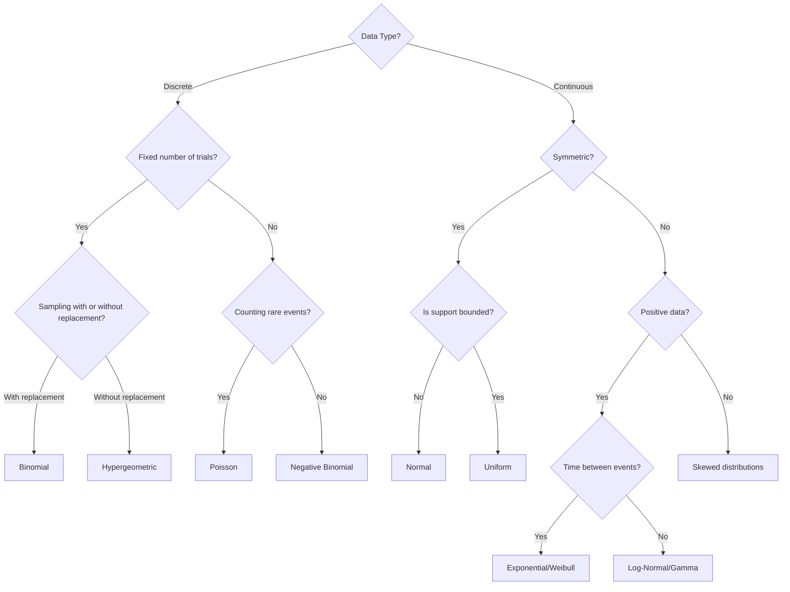
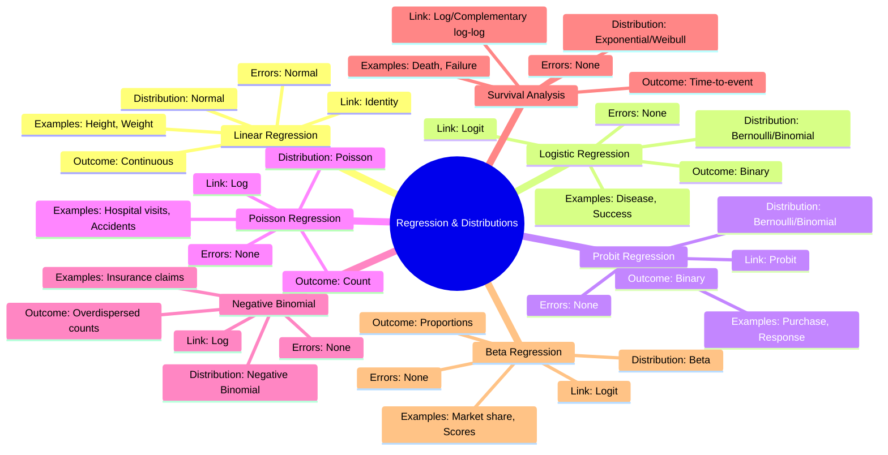

# Chapter 6: Probability Distributions - The Complete Encyclopedia

[⬅ Previous: Regression](./05-regression.md) | [🏠 Home](../README.md) | [➡ Next: Hypothesis Testing](./07-hypothesis-testing.md)

---

## Table of Contents

1. [Learning Objectives](#learning-objectives)
2. [Prerequisites](#prerequisites)
3. [Why This Topic Matters](#why-this-topic-matters)
4. [Big Picture](#big-picture)
5. [Core Intuition](#core-intuition-সহজ-ভাষায়)
6. [Fundamental Concepts](#fundamental-concepts)
7. [Discrete Distributions](#discrete-distributions-বিচ্ছিন্ন-বণ্টন)
8. [Continuous Distributions](#continuous-distributions-অবিচ্ছিন্ন-বণ্টন)
9. [Distribution Properties](#distribution-properties)
10. [PMF vs PDF vs CDF](#pmf-vs-pdf-vs-cdf-সহজ-ভাষায়)
11. [Choosing the Right Distribution](#choosing-the-right-distribution-সঠিক-বণ্টন-নির্বাচন)
12. [Central Limit Theorem](#central-limit-theorem-clt-কেন্দ্রীয়-সীমা-উপপাদ্য)
13. [Regression and Distributions](#regression-and-distributions-রিগ্রেশন-ও-বণ্টন)
14. [Software Implementation](#software-implementation-সফটওয়্যার-ইমপ্লিমেন্টেশন)
15. [Worked Examples](#worked-examples-সবিস্তার-উদাহরণ)
16. [Advanced Topics](#advanced-topics)
17. [Real Research Examples](#real-research-examples-বাস্তব-গবেষণা-উদাহরণ)
18. [Common Mistakes](#common-mistakes-সাধারণ-ভুল)
19. [Practice Problems](#practice-problems-অনুশীলন-সমস্যা)
20. [Key Takeaways](#key-takeaways-মূল-শিক্ষা)
21. [Recommended Papers](#recommended-papers)
22. [Further Reading](#further-reading)
23. [References](#references)
24. [Appendix](#appendix-complete-distribution-summary-table)

---

## Learning Objectives

- [ ] Distinguish discrete vs. continuous probability distributions
- [ ] Compute probabilities using Binomial, Poisson, and Normal distributions
- [ ] Understand PMF, PDF, and CDF and how they relate
- [ ] Apply the Central Limit Theorem and explain why it matters for inference
- [ ] Choose the correct distribution for a given real-world data-generating process
- [ ] Simulate distributions and verify theoretical properties computationally
- [ ] Connect probability distributions to regression models
- [ ] Understand moment generating functions and their applications
- [ ] Master transformation techniques for random variables
- [ ] Apply distribution theory to real-world problems

## Prerequisites

- Chapter 1–3 (Descriptive Statistics, Central Tendency, Dispersion)
- Basic algebra; factorials and exponents
- Calculus basics (integration, differentiation)
- Basic probability theory

## Estimated Study Time

⏱️ 8–10 hours

---

## Why This Topic Matters

> [!TIP]
> Every hypothesis test, confidence interval, and p-value in the rest of this textbook rests on an assumed probability distribution. Understanding *why* a particular distribution is used for a particular kind of data is what separates mechanical statistics from genuine statistical reasoning.

**The Foundation of All Statistical Inference**:
Probability distributions are the building blocks of all statistical methods. Without understanding distributions, you cannot:
- Choose appropriate statistical tests
- Interpret confidence intervals correctly
- Build valid regression models
- Understand machine learning algorithms
- Make probabilistic predictions

**Real-World Impact**:
- Public health officials use Poisson distributions to detect disease outbreaks
- Engineers use Weibull distributions to predict equipment failure
- Economists use log-normal distributions to model income inequality
- Biologists use binomial distributions to analyze genetic inheritance
- Pharmaceutical companies use normal distributions to analyze clinical trial data

---

## Big Picture

```mermaid
mindmap
  root((Probability Distributions))
    Discrete
      Bernoulli
        Single trial
        Binary outcome
      Binomial
        n trials
        Success count
      Poisson
        Rare events
        Count data
      Hypergeometric
        Without replacement
        Finite population
      Geometric
        First success
        Waiting time
      Negative Binomial
        r successes
        Overdispersion
    Continuous
      Uniform
        Equal probability
        [a,b] interval
      Normal
        Bell curve
        Most common
      Exponential
        Time between events
        Memoryless
      Gamma
        k-th event
        Sum of exponentials
      Beta
        Proportions
        [0,1] interval
      Weibull
        Reliability
        Survival analysis
      Log-Normal
        Positive data
        Right skewed
      Cauchy
        Heavy tails
        No mean
      Pareto
        Power law
        Income distribution
      Chi-Square
        Sum of normals
        Variance testing
      t-Distribution
        Small samples
        Unknown variance
      F-Distribution
        Ratio of variances
        ANOVA
    Key Theorems
      Central Limit Theorem
        Sample means → Normal
        n ≥ 30 rule
        Works for any distribution
      Law of Large Numbers
        Sample mean → population mean
        Convergence
      Transformation Theorems
        Change of variables
        CDF method
        MGF method
    Connection to Regression
      Linear Regression
        Normal errors
        Continuous outcome
      Logistic Regression
        Bernoulli/Binomial
        Binary outcome
      Poisson Regression
        Poisson distribution
        Count outcome
      Survival Analysis
        Exponential/Weibull
        Time-to-event
      Beta Regression
        Beta distribution
        Proportion outcome
      Negative Binomial
        Overdispersion
        Count data
```

---

## Core Intuition (সহজ ভাষায়)

A probability distribution is a mathematical description of **which values a random variable can take, and how likely each is**. Think of it as a recipe that tells you:
1. What values are possible
2. How likely each value is
3. What the average will be
4. How spread out the values are

**Simple Analogy**:
Imagine you're throwing darts at a dartboard. The distribution tells you:
- Where the darts can land (support)
- How likely each area is (probability)
- Where most darts will cluster (mean)
- How spread out they'll be (variance)

**Discrete vs. Continuous**:
- **Discrete**: Like counting coins in your pocket (0, 1, 2, 3, ...)
- **Continuous**: Like measuring your height (170.1 cm, 170.2 cm, ...)

**বাংলায় সহজ অর্থ**: 
সম্ভাবনা বণ্টন হল একটি গাণিতিক পদ্ধতি যা বলে দেয় যে একটি এলোমেলো চলক (random variable) কোন কোন মান নিতে পারে এবং প্রতিটি মান কতটা সম্ভাব্য। Discrete বণ্টন গণনাযোগ্য ফলাফল বোঝায় (যেমন সাফল্যের সংখ্যা), আর continuous বণ্টন পরিমাপযোগ্য ফলাফল বোঝায় (যেমন উচ্চতা, সময়)।

---

## Fundamental Concepts

### Random Variables (এলোমেলো চলক)

A random variable is a function that assigns a numerical value to each outcome of a random experiment.

**Types**:
1. **Discrete Random Variable**: Takes countable values
   - Example: Number of heads in 10 coin flips
2. **Continuous Random Variable**: Takes any value in an interval
   - Example: Height of a randomly selected person

### Probability Functions

**Discrete**: Probability Mass Function (PMF)
- Gives P(X = x) for each possible value x
- Sum over all x equals 1

**Continuous**: Probability Density Function (PDF)
- Gives relative likelihood at each point
- Area under curve equals 1
- P(X = x) = 0 for any specific x

### Cumulative Distribution Function (CDF)

For any random variable:
$$F(x) = P(X \leq x)$$

**Properties**:
- Non-decreasing
- Ranges from 0 to 1
- Right-continuous

### Moments of Distributions

**First Moment (Mean)**:
$$\mu = E[X] = \int_{-\infty}^{\infty} x f(x) dx$$

**Second Moment**:
$$E[X^2] = \int_{-\infty}^{\infty} x^2 f(x) dx$$

**Variance**:
$$\sigma^2 = E[(X-\mu)^2] = E[X^2] - \mu^2$$

**Skewness**: Measures asymmetry
$$\gamma_1 = E[(X-\mu)^3]/\sigma^3$$

**Kurtosis**: Measures tail heaviness
$$\gamma_2 = E[(X-\mu)^4]/\sigma^4 - 3$$

### Moment Generating Functions (MGF)

$$M_X(t) = E[e^{tX}]$$

**Properties**:
- Uniquely determines distribution
- Easily finds moments: $E[X^k] = M^{(k)}(0)$
- Useful for sums of independent variables

---

## Discrete Distributions (বিচ্ছিন্ন বণ্টন)

### 1. Bernoulli Distribution (বার্নোলি বণ্টন)

**Simple Explanation**: Models a single trial with two outcomes - success (1) or failure (0).

**সহজ ব্যাখ্যা**: একটি মাত্র পরীক্ষার ফলাফল - সফল নাকি ব্যর্থ।

**Probability Mass Function**:
$$P(X=x) = p^x(1-p)^{1-x}, \quad x \in \{0,1\}$$

**Parameters**: p ∈ [0,1] (probability of success)

**Moments**:
- Mean: E[X] = p
- Variance: Var(X) = p(1-p)
- MGF: M_X(t) = (1-p) + pe^t

**Examples**:
- Coin flip (p = 0.5)
- Patient responds to treatment (p = 0.3)
- Email is spam (p = 0.8)

**Python Implementation**:
```python
from scipy import stats
# P(X = 1) for p = 0.3
stats.bernoulli.pmf(1, 0.3)  # 0.3
# P(X = 0) for p = 0.3
stats.bernoulli.pmf(0, 0.3)  # 0.7
```

**R Implementation**:
```r
# P(X = 1) for p = 0.3
dbinom(1, 1, 0.3)  # 0.3
# P(X = 0) for p = 0.3
dbinom(0, 1, 0.3)  # 0.7
```

---

### 2. Binomial Distribution (দ্বিপদী বণ্টন)

**Simple Explanation**: Number of successes in n independent Bernoulli trials.

**সহজ ব্যাখ্যা**: n সংখ্যক স্বাধীন পরীক্ষায় সাফল্যের সংখ্যা।

**Probability Mass Function**:
$$P(X=k) = \binom{n}{k}p^k(1-p)^{n-k}, \quad k = 0,1,\dots,n$$

**Parameters**:
- n ∈ {1,2,3,...} (number of trials)
- p ∈ [0,1] (probability of success)

**Moments**:
- Mean: E[X] = np
- Variance: Var(X) = np(1-p)
- MGF: M_X(t) = [(1-p) + pe^t]^n

**Properties**:
- Sum of n independent Bernoulli(p) variables
- Shape depends on p:
  - p = 0.5: Symmetric
  - p < 0.5: Right-skewed
  - p > 0.5: Left-skewed

**Examples**:
- Number of patients responding to treatment out of 50
- Number of defective items in a batch of 100
- Number of successful surgeries out of 20

**Detailed Example**:
A pharmaceutical company tests a new drug on 100 patients. If the true response rate is 70%, what's the probability that exactly 75 respond?

**Solution**:
$$P(X=75) = \binom{100}{75}(0.7)^{75}(0.3)^{25} \approx 0.045$$

**Python Implementation**:
```python
from scipy import stats
import numpy as np

# P(X = 75) with n=100, p=0.7
stats.binom.pmf(75, 100, 0.7)

# P(X <= 75) with n=100, p=0.7
stats.binom.cdf(75, 100, 0.7)

# Generate random binomial data
np.random.binomial(100, 0.7, 1000)
```

**R Implementation**:
```r
# P(X = 75) with n=100, p=0.7
dbinom(75, 100, 0.7)

# P(X <= 75) with n=100, p=0.7
pbinom(75, 100, 0.7)

# Generate random binomial data
rbinom(1000, 100, 0.7)
```

**SPSS Implementation**:
```spss
COMPUTE p_binom = PDF.BINOM(75, 100, 0.7).
COMPUTE c_binom = CDF.BINOM(75, 100, 0.7).
EXECUTE.
```

**Visualization**:
```python
import matplotlib.pyplot as plt
import seaborn as sns

n = 20
p = 0.3
x = np.arange(0, n+1)
pmf = stats.binom.pmf(x, n, p)

plt.figure(figsize=(10, 6))
plt.bar(x, pmf, alpha=0.7, color='blue')
plt.title(f'Binomial Distribution (n={n}, p={p})')
plt.xlabel('Number of Successes')
plt.ylabel('Probability')
plt.show()
```

**Connection to Regression**: Binomial distribution is the basis for:
- Logistic regression (binary outcomes)
- Probit regression (binary outcomes)
- Binomial regression (proportion outcomes)

---

### 3. Poisson Distribution (পয়সন বণ্টন)

**Simple Explanation**: Models the number of rare events occurring in a fixed interval of time or space.

**সহজ ব্যাখ্যা**: নির্দিষ্ট সময় বা স্থানে বিরল ঘটনার সংখ্যা।

**Probability Mass Function**:
$$P(X=k) = \frac{e^{-\lambda}\lambda^k}{k!}, \quad k = 0,1,2,\dots$$

**Parameters**:
- λ > 0 (rate parameter: average number of events per interval)

**Moments**:
- Mean: E[X] = λ
- Variance: Var(X) = λ
- MGF: M_X(t) = exp(λ(e^t - 1))

**Properties**:
- Mean equals variance (equidispersion)
- Additive property: Sum of independent Poissons is Poisson
- Poisson is the limit of Binomial when n → ∞, p → 0, np = λ

**Examples**:
- Number of malaria cases per week in a district (λ = 3)
- Number of customer arrivals per hour (λ = 10)
- Number of defects per 100 meters of fabric (λ = 2)

**Detailed Example**:
A hospital emergency room averages 4 arrivals per hour. What's the probability of exactly 6 arrivals in a given hour?

**Solution**:
$$P(X=6) = \frac{e^{-4} \times 4^6}{6!} = \frac{0.0183 \times 4096}{720} \approx 0.104$$

**Python Implementation**:
```python
from scipy import stats
import numpy as np

# P(X = 6) with λ = 4
stats.poisson.pmf(6, 4)

# P(X <= 6) with λ = 4
stats.poisson.cdf(6, 4)

# Generate random Poisson data
np.random.poisson(4, 1000)
```

**R Implementation**:
```r
# P(X = 6) with λ = 4
dpois(6, 4)

# P(X <= 6) with λ = 4
ppois(6, 4)

# Generate random Poisson data
rpois(1000, 4)
```

**Visualization**:
```python
lambda_values = [1, 4, 10]
x = np.arange(0, 25)

plt.figure(figsize=(12, 8))
for lam in lambda_values:
    pmf = stats.poisson.pmf(x, lam)
    plt.plot(x, pmf, 'o-', label=f'λ = {lam}')

plt.title('Poisson Distribution for Different λ Values')
plt.xlabel('Number of Events')
plt.ylabel('Probability')
plt.legend()
plt.grid(True, alpha=0.3)
plt.show()
```

**Connection to Regression**: Poisson distribution is the basis for:
- Poisson regression (count outcomes)
- Negative binomial regression (overdispersed counts)
- Log-linear models (contingency tables)

---

### 4. Hypergeometric Distribution (হাইপারজিওমেট্রিক বণ্টন)

**Simple Explanation**: Models sampling without replacement from a finite population with two categories.

**সহজ ব্যাখ্যা**: প্রতিস্থাপন ছাড়া নমুনা নেওয়া।

**Probability Mass Function**:
$$P(X=k) = \frac{\binom{K}{k}\binom{N-K}{n-k}}{\binom{N}{n}}$$

**Parameters**:
- N: Population size
- K: Number of success items in population
- n: Sample size

**Moments**:
- Mean: E[X] = n(K/N)
- Variance: Var(X) = n(K/N)(1-K/N)[(N-n)/(N-1)]

**Examples**:
- Quality control sampling without replacement
- Card drawing (without replacement)
- Ecological sampling of rare species

**Detailed Example**:
A batch of 100 items contains 5 defective items. If we sample 10 items without replacement, what's the probability of finding exactly 2 defective items?

$$P(X=2) = \frac{\binom{5}{2}\binom{95}{8}}{\binom{100}{10}} \approx 0.070$$

**Python Implementation**:
```python
from scipy import stats

# P(X = 2) with N=100, K=5, n=10
stats.hypergeom.pmf(2, 100, 5, 10)
```

**Connection to Binomial**: Hypergeometric converges to Binomial when N is large relative to n (sampling with replacement approximation).

---

### 5. Geometric Distribution (জ্যামিতিক বণ্টন)

**Simple Explanation**: Number of trials needed to get the first success.

**সহজ ব্যাখ্যা**: প্রথম সাফল্য পেতে কতটি পরীক্ষা লাগে।

**Probability Mass Function**:
$$P(X=k) = (1-p)^{k-1}p, \quad k = 1,2,3,\dots$$

**Parameters**:
- p ∈ (0,1): Probability of success

**Moments**:
- Mean: E[X] = 1/p
- Variance: Var(X) = (1-p)/p²

**Memoryless Property**:
$$P(X > s+t | X > s) = P(X > t)$$

**Examples**:
- Number of coin flips until first heads
- Number of patients until first treatment response
- Number of calls until first answered

**Detailed Example**:
If the probability of making a sale on each call is 0.1, what's the probability that the first sale occurs on the 5th call?

$$P(X=5) = (0.9)^4(0.1) \approx 0.0656$$

---

### 6. Negative Binomial Distribution (নেগেটিভ দ্বিপদী বণ্টন)

**Simple Explanation**: Number of trials needed to get r successes.

**সহজ ব্যাখ্যা**: r সংখ্যক সাফল্য পেতে কতটি পরীক্ষা লাগে।

**Probability Mass Function**:
$$P(X=k) = \binom{k-1}{r-1}p^r(1-p)^{k-r}, \quad k = r, r+1, r+2,\dots$$

**Parameters**:
- r ≥ 1: Number of successes needed
- p ∈ (0,1): Probability of success

**Moments**:
- Mean: E[X] = r/p
- Variance: Var(X) = r(1-p)/p²

**Overdispersion**: Variance > Mean (when r > 1)

**Examples**:
- Number of patients until 5 respond to treatment
- Number of attempts until 3 successful surgeries
- Modeling overdispersed count data

**Connection to Poisson**: Negative Binomial is a mixture of Poissons where λ ~ Gamma.

---

## Continuous Distributions (অবিচ্ছিন্ন বণ্টন)

### 1. Uniform Distribution (সমবণ্টন)

**Simple Explanation**: All values in interval [a,b] are equally likely.

**সহজ ব্যাখ্যা**: [a,b] ব্যবধানের সব মান সমান সম্ভাব্য।

**Probability Density Function**:
$$f(x) = \frac{1}{b-a}, \quad a \le x \le b$$

**Cumulative Distribution Function**:
$$F(x) = \frac{x-a}{b-a}, \quad a \le x \le b$$

**Parameters**:
- a: Lower bound
- b: Upper bound

**Moments**:
- Mean: E[X] = (a+b)/2
- Variance: Var(X) = (b-a)²/12
- MGF: M_X(t) = (e^{bt} - e^{at})/[t(b-a)]

**Examples**:
- Random number generation
- Random selection from an interval
- Prior distribution in Bayesian analysis

**Standard Uniform**: U(0,1) with a=0, b=1

**Python Implementation**:
```python
from scipy import stats
import numpy as np

# P(X < 0.5) for U(0,1)
stats.uniform.cdf(0.5, 0, 1)

# Generate random uniform data
np.random.uniform(0, 1, 1000)
```

---

### 2. Normal (Gaussian) Distribution (স্বাভাবিক বণ্টন)

**Simple Explanation**: The bell-shaped curve - the most important distribution in statistics.

**সহজ ব্যাখ্যা**: ঘণ্টার মতো আকৃতি - সবচেয়ে গুরুত্বপূর্ণ বণ্টন।

**Probability Density Function**:
$$f(x) = \frac{1}{\sigma\sqrt{2\pi}} \exp\left(-\frac{(x-\mu)^2}{2\sigma^2}\right)$$

**Parameters**:
- μ ∈ ℝ: Mean (center)
- σ > 0: Standard deviation (spread)

**Cumulative Distribution Function**:
$$F(x) = \frac{1}{2}\left[1 + \text{erf}\left(\frac{x-\mu}{\sigma\sqrt{2}}\right)\right]$$

**Moments**:
- Mean: E[X] = μ
- Variance: Var(X) = σ²
- Skewness: 0
- Kurtosis: 0
- MGF: M_X(t) = exp(μt + σ²t²/2)

**Properties**:
- Symmetric around mean
- 68% within μ ± σ
- 95% within μ ± 2σ
- 99.7% within μ ± 3σ
- Sum of normals is normal
- Linear transformations preserve normality

**Standard Normal**: Z ~ N(0,1)

**Examples**:
- Human heights
- Measurement errors
- IQ scores
- Test scores
- Blood pressure (often approximately)

**Detailed Example**:
Adult male heights are approximately N(175cm, 7cm). What proportion are between 168cm and 182cm?

**Step 1**: Standardize
- z₁ = (168-175)/7 = -1.0
- z₂ = (182-175)/7 = 1.0

**Step 2**: Find probabilities
- P(Z < 1.0) = 0.8413
- P(Z < -1.0) = 0.1587

**Step 3**: Calculate
- P(-1 < Z < 1) = 0.8413 - 0.1587 = 0.6826 (68.26%)

**Python Implementation**:
```python
from scipy import stats
import numpy as np

# P(X < 182) with μ=175, σ=7
stats.norm.cdf(182, 175, 7)

# P(168 < X < 182)
stats.norm.cdf(182, 175, 7) - stats.norm.cdf(168, 175, 7)

# Generate random normal data
np.random.normal(175, 7, 1000)

# Critical values
stats.norm.ppf(0.975)  # 1.96
stats.norm.ppf(0.995)  # 2.576
```

**R Implementation**:
```r
# P(X < 182) with μ=175, σ=7
pnorm(182, 175, 7)

# P(168 < X < 182)
pnorm(182, 175, 7) - pnorm(168, 175, 7)

# Generate random normal data
rnorm(1000, 175, 7)

# Critical values
qnorm(0.975)  # 1.96
qnorm(0.995)  # 2.576
```

**Visualization**:
```python
import matplotlib.pyplot as plt
import seaborn as sns

x = np.linspace(-4, 4, 1000)
mu = 0
sigma = 1
pdf = stats.norm.pdf(x, mu, sigma)

plt.figure(figsize=(12, 8))
plt.plot(x, pdf, linewidth=2)
plt.axvline(0, color='red', linestyle='--', label='Mean')
plt.axvline(-1, color='green', linestyle='--', alpha=0.5)
plt.axvline(1, color='green', linestyle='--', alpha=0.5)
plt.axvline(-2, color='orange', linestyle='--', alpha=0.5)
plt.axvline(2, color='orange', linestyle='--', alpha=0.5)
plt.fill_between(x, 0, pdf, where=(x > -1) & (x < 1), alpha=0.3, label='68%')
plt.fill_between(x, 0, pdf, where=(x > -2) & (x < 2), alpha=0.2, label='95%')
plt.title('Standard Normal Distribution')
plt.xlabel('z')
plt.ylabel('Density')
plt.legend()
plt.grid(True, alpha=0.3)
plt.show()
```

**Connection to Regression**: Normal distribution is the basis for:
- Linear regression (normally distributed errors)
- ANOVA
- t-tests
- Z-tests
- Confidence intervals

---

### 3. Exponential Distribution (সূচকীয় বণ্টন)

**Simple Explanation**: Models the time between events in a Poisson process.

**সহজ ব্যাখ্যা**: ঘটনাগুলোর মধ্যে সময়।

**Probability Density Function**:
$$f(x) = \lambda e^{-\lambda x}, \quad x \ge 0$$

**Cumulative Distribution Function**:
$$F(x) = 1 - e^{-\lambda x}, \quad x \ge 0$$

**Parameters**:
- λ > 0: Rate parameter

**Survival Function**:
$$S(x) = P(X > x) = e^{-\lambda x}$$

**Hazard Function**:
$$h(x) = \frac{f(x)}{S(x)} = \lambda$$

**Moments**:
- Mean: E[X] = 1/λ
- Variance: Var(X) = 1/λ²
- MGF: M_X(t) = λ/(λ - t)

**Memoryless Property**:
$$P(X > s+t | X > s) = P(X > t)$$

This property is unique to the exponential distribution.

**Examples**:
- Time between hospital admissions
- Lifetime of electronic components (if no aging)
- Time until radioactive decay
- Inter-arrival times in queueing theory

**Detailed Example**:
If the average time between machine failures is 100 hours (λ = 0.01), what's the probability that the machine runs for more than 150 hours without failure?

$$P(X > 150) = e^{-0.01 \times 150} = e^{-1.5} \approx 0.223$$

**Python Implementation**:
```python
from scipy import stats
import numpy as np

# P(X > 150) with λ = 0.01
1 - stats.expon.cdf(150, scale=100)

# Alternative
stats.expon.sf(150, scale=100)

# Generate random exponential data
np.random.exponential(100, 1000)
```

**R Implementation**:
```r
# P(X > 150) with λ = 0.01
1 - pexp(150, rate=0.01)

# Alternative
pexp(150, rate=0.01, lower.tail=FALSE)

# Generate random exponential data
rexp(1000, rate=0.01)
```

**Visualization**:
```python
lambda_values = [0.5, 1, 2]
x = np.linspace(0, 5, 1000)

plt.figure(figsize=(12, 8))
for lam in lambda_values:
    pdf = stats.expon.pdf(x, scale=1/lam)
    plt.plot(x, pdf, label=f'λ = {lam}')

plt.title('Exponential Distributions for Different λ Values')
plt.xlabel('x')
plt.ylabel('Density')
plt.legend()
plt.grid(True, alpha=0.3)
plt.show()
```

**Connection to Regression**: Exponential distribution is used in:
- Survival analysis (baseline hazard)
- Reliability engineering
- Queueing theory
- Poisson regression (waiting times)

---

### 4. Gamma Distribution (গামা বণ্টন)

**Simple Explanation**: Models the waiting time until the k-th event in a Poisson process.

**সহজ ব্যাখ্যা**: k-তম ঘটনা পর্যন্ত অপেক্ষার সময়।

**Probability Density Function**:
$$f(x) = \frac{\lambda^k x^{k-1} e^{-\lambda x}}{\Gamma(k)}, \quad x \ge 0$$

**Parameters**:
- k > 0: Shape parameter
- λ > 0: Rate parameter

**Moments**:
- Mean: E[X] = k/λ
- Variance: Var(X) = k/λ²
- MGF: M_X(t) = (1 - t/λ)^(-k)

**Special Cases**:
- k = 1: Exponential distribution
- k = n/2, λ = 1/2: Chi-square with n degrees of freedom

**Examples**:
- Time until k-th machine failure
- Sum of k exponential waiting times
- Annual rainfall amounts

**Detailed Example**:
If customers arrive at a rate of λ = 2 per hour, what's the distribution of time until 5 customers arrive?

This follows Gamma(k=5, λ=2).

**Python Implementation**:
```python
from scipy import stats

# P(X < 3) for Gamma(k=5, λ=2)
stats.gamma.cdf(3, a=5, scale=1/2)
```

---

### 5. Beta Distribution (বেটা বণ্টন)

**Simple Explanation**: Models probabilities and proportions on [0,1].

**সহজ ব্যাখ্যা**: সম্ভাবনা এবং অনুপাতের জন্য।

**Probability Density Function**:
$$f(x) = \frac{x^{\alpha-1}(1-x)^{\beta-1}}{B(\alpha,\beta)}, \quad 0 \le x \le 1$$

**Parameters**:
- α > 0: Shape parameter 1
- β > 0: Shape parameter 2

**Beta Function**:
$$B(\alpha,\beta) = \frac{\Gamma(\alpha)\Gamma(\beta)}{\Gamma(\alpha+\beta)}$$

**Moments**:
- Mean: E[X] = α/(α+β)
- Variance: Var(X) = αβ/[(α+β)²(α+β+1)]
- Mode: (α-1)/(α+β-2) for α>1, β>1

**Special Cases**:
- α = β = 1: Uniform(0,1)
- α < 1, β < 1: U-shaped
- α > 1, β > 1: Bell-shaped

**Examples**:
- Prior for binomial proportion in Bayesian analysis
- Fraction of defective items
- Proportion of time spent on a task
- Market share

**Detailed Example**:
A new drug has a response rate between 0.2 and 0.8. We use Beta(3,3) as prior. What's the probability that response rate exceeds 0.6?

**Python Implementation**:
```python
from scipy import stats

# P(X > 0.6) for Beta(3,3)
1 - stats.beta.cdf(0.6, 3, 3)
```

**Visualization**:
```python
alpha_beta_pairs = [(0.5, 0.5), (1, 1), (2, 5), (5, 2), (10, 10)]
x = np.linspace(0, 1, 1000)

plt.figure(figsize=(12, 8))
for alpha, beta in alpha_beta_pairs:
    pdf = stats.beta.pdf(x, alpha, beta)
    plt.plot(x, pdf, label=f'α={alpha}, β={beta}')

plt.title('Beta Distributions for Different Parameters')
plt.xlabel('x')
plt.ylabel('Density')
plt.legend()
plt.grid(True, alpha=0.3)
plt.show()
```

**Connection to Regression**: Beta distribution is the basis for:
- Beta regression (proportion outcomes)
- Bayesian analysis (conjugate prior for binomial)
- Fractional response models

---

### 6. Weibull Distribution (ওয়েবুল বণ্টন)

**Simple Explanation**: Models time-to-failure in reliability analysis, allows for increasing/decreasing hazard.

**সহজ ব্যাখ্যা**: নির্ভরযোগ্যতা বিশ্লেষণে ব্যর্থতার সময় মডেল করে, ক্রমবর্ধমান/হ্রাসমান ঝুঁকি অনুমোদন করে।

**Probability Density Function**:
$$f(x) = \frac{k}{\lambda}\left(\frac{x}{\lambda}\right)^{k-1} \exp\left[-\left(\frac{x}{\lambda}\right)^k\right], \quad x \ge 0$$

**Parameters**:
- k > 0: Shape parameter
- λ > 0: Scale parameter

**Survival Function**:
$$S(x) = \exp\left[-\left(\frac{x}{\lambda}\right)^k\right]$$

**Hazard Function**:
$$h(x) = \frac{k}{\lambda}\left(\frac{x}{\lambda}\right)^{k-1}$$

**Special Cases**:
- k = 1: Exponential distribution
- k = 2: Rayleigh distribution

**Moments**:
- Mean: E[X] = λΓ(1 + 1/k)
- Variance: Var(X) = λ²[Γ(1 + 2/k) - Γ²(1 + 1/k)]

**Examples**:
- Time until mechanical failure
- Survival times in medical studies
- Wind speeds
- Product lifetimes

**Detailed Example**:
A machine's lifetime follows Weibull(k=2, λ=1000 hours). What's the probability it lasts longer than 1500 hours?

$$P(X > 1500) = \exp\left[-\left(\frac{1500}{1000}\right)^2\right] = e^{-2.25} \approx 0.105$$

---

### 7. Log-Normal Distribution (লগ-স্বাভাবিক বণ্টন)

**Simple Explanation**: If Y ~ N(μ, σ²), then X = e^Y follows a log-normal distribution.

**সহজ ব্যাখ্যা**: যদি Y ~ N(μ, σ²), তাহলে X = e^Y লগ-স্বাভাবিক বণ্টন অনুসরণ করে।

**Probability Density Function**:
$$f(x) = \frac{1}{x\sigma\sqrt{2\pi}} \exp\left(-\frac{(\ln x - \mu)^2}{2\sigma^2}\right), \quad x > 0$$

**Parameters**:
- μ ∈ ℝ: Mean of log(X)
- σ > 0: SD of log(X)

**Moments**:
- Mean: E[X] = exp(μ + σ²/2)
- Variance: Var(X) = exp(2μ + σ²)[exp(σ²) - 1]

**Properties**:
- Positive only
- Right-skewed
- Often used for multiplicative processes

**Examples**:
- Income distribution
- Stock prices
- Biological measurements (blood pressure, cholesterol)
- Insurance claim amounts

**Detailed Example**:
Stock returns follow a log-normal distribution with μ = 0.1 and σ = 0.2. What's the probability that the stock price increases by more than 50%?

$$P(X > 1.5) = P(\ln X > \ln 1.5) = P(Z > (\ln 1.5 - 0.1)/0.2)$$

---

### 8. Chi-Square Distribution (কাই-বর্গ বণ্টন)

**Simple Explanation**: Sum of squares of independent standard normal variables.

**সহজ ব্যাখ্যা**: স্বাধীন মানক স্বাভাবিক চলকের বর্গের যোগফল।

**Probability Density Function**:
$$f(x) = \frac{x^{k/2-1} e^{-x/2}}{2^{k/2}\Gamma(k/2)}, \quad x \ge 0$$

**Parameters**:
- k > 0: Degrees of freedom

**Moments**:
- Mean: E[X] = k
- Variance: Var(X) = 2k
- MGF: M_X(t) = (1 - 2t)^(-k/2)

**Examples**:
- Variance estimation
- Goodness-of-fit tests
- Contingency table analysis

**Connection to Normal**: If Z₁,...,Z_k ~ N(0,1) independent, then ΣZᵢ² ~ χ²(k)

---

### 9. t-Distribution (টি-বণ্টন)

**Simple Explanation**: Used for inference when population variance is unknown, especially with small samples.

**সহজ ব্যাখ্যা**: যখন জনসংখ্যার প্রকরণ অজানা, বিশেষ করে ছোট নমুনার ক্ষেত্রে ব্যবহৃত হয়।

**Probability Density Function**:
$$f(x) = \frac{\Gamma((k+1)/2)}{\sqrt{k\pi}\Gamma(k/2)} \left(1 + \frac{x^2}{k}\right)^{-(k+1)/2}$$

**Parameters**:
- k > 0: Degrees of freedom

**Moments**:
- Mean: E[X] = 0 (for k > 1)
- Variance: Var(X) = k/(k-2) (for k > 2)

**Properties**:
- Symmetric, bell-shaped
- Heavier tails than normal
- Approaches normal as k → ∞

**Examples**:
- Small sample inference
- Confidence intervals for means
- Comparing two means

---

### 10. F-Distribution (এফ-বণ্টন)

**Simple Explanation**: Ratio of two independent chi-square variables divided by their degrees of freedom.

**সহজ ব্যাখ্যা**: দুটি স্বাধীন কাই-বর্গ চলকের অনুপাত তাদের ডিগ্রি অফ ফ্রিডম দ্বারা ভাগ করে।

**Probability Density Function**:
$$f(x) = \frac{\Gamma((d₁+d₂)/2)}{\Gamma(d₁/2)\Gamma(d₂/2)} \left(\frac{d₁}{d₂}\right)^{d₁/2} x^{d₁/2-1} \left(1 + \frac{d₁x}{d₂}\right)^{-(d₁+d₂)/2}$$

**Parameters**:
- d₁ > 0: Numerator degrees of freedom
- d₂ > 0: Denominator degrees of freedom

**Moments**:
- Mean: E[X] = d₂/(d₂-2) (for d₂ > 2)

**Examples**:
- ANOVA
- Comparing variances
- Multiple regression

---

## Distribution Properties

### Symmetry and Shape

**Symmetric Distributions**:
- Normal
- t (symmetric)
- Uniform
- Cauchy

**Skewed Distributions**:
- Exponential (right-skewed)
- Gamma (right-skewed)
- Log-normal (right-skewed)
- Weibull (shape-dependent)

### Support (Possible Values)

**Finite Support**:
- Bernoulli: {0,1}
- Binomial: {0,1,...,n}
- Uniform: [a,b]
- Beta: [0,1]

**Infinite Support**:
- Normal: (-∞, ∞)
- Poisson: {0,1,2,...}
- Exponential: [0, ∞)

### Maximum Likelihood Estimation (MLE)

**Normal Distribution**:
- μ̂ = \bar{X}
- σ̂² = Σ(Xᵢ - \bar{X})²/n

**Binomial Distribution**:
- p̂ = X/n

**Poisson Distribution**:
- λ̂ = \bar{X}

**Exponential Distribution**:
- λ̂ = 1/\bar{X}

---

## PMF vs PDF vs CDF (সহজ ভাষায়)

| Concept | Discrete (বিচ্ছিন্ন) | Continuous (অবিচ্ছিন্ন) |
|---|---|---|
| Exact value probability | PMF: P(X=x) | PDF: f(x) - Note P(X=x)=0 |
| Cumulative probability | F(x) = P(X ≤ x) = Σ P(X=t) | F(x) = P(X ≤ x) = ∫ f(t)dt |
| Total probability | Σ P(X=x) = 1 | ∫ f(x)dx = 1 |
| Probability calculation | Sum probabilities | Integrate density |

**বাংলায় সহজ**: PMF বা PDF বলে দেয় প্রতিটি মানের সম্ভাবনা কত। CDF বলে দেয় x পর্যন্ত মোট সম্ভাবনা কত।


---

## Choosing the Right Distribution (সঠিক বণ্টন নির্বাচন)



**Quick Guide (দ্রুত নির্দেশিকা)**:
- Coin flips → Bernoulli/Binomial
- Rare events → Poisson
- Waiting time → Exponential/Weibull
- Symmetric measurements → Normal
- Proportions → Beta
- Survival time → Weibull/Exponential
- Counts with overdispersion → Negative Binomial
- Small sample inference → t-distribution
- Variance testing → F/Chi-square
- Income data → Log-normal/Pareto

**Decision Tree**:

1. **Is the variable discrete or continuous?**
   - **Discrete**: Countable outcomes
     - Fixed number of trials? → Binomial
     - Sampling without replacement? → Hypergeometric
     - Rare events over time/space? → Poisson
     - Overdispersed counts? → Negative Binomial
   - **Continuous**: Measurable outcomes
     - Symmetric and unbounded? → Normal
     - Symmetric and bounded? → Uniform
     - Positive and time-to-event? → Exponential/Weibull
     - Positive and skewed? → Log-normal/Gamma
     - Proportions on [0,1]? → Beta

2. **What's the data generating process?**
   - Sum of independent variables → Normal (CLT)
   - Minimum of variables → Weibull
   - Maximum of variables → Extreme value
   - Product of variables → Log-normal

3. **What are the constraints?**
   - Values only positive → Use positive distributions
   - Values bounded → Use bounded distributions
   - Heavy tails → Use heavy-tailed distributions

---

## Central Limit Theorem (CLT) (কেন্দ্রীয় সীমা উপপাদ্য)

> [!NOTE]
> **Central Limit Theorem**: For any population with mean μ and variance σ², the sampling distribution of the sample mean approaches Normal as n increases:
> $$\bar{X} \xrightarrow{d} N\left(\mu, \frac{\sigma^2}{n}\right) \text{ as } n \to \infty$$

**সহজ ভাষায়**: যেকোনো বণ্টন থেকে নেওয়া নমুনার গড়ের বণ্টন স্বাভাবিক বণ্টনের দিকে যায় যখন নমুনার আকার বড় হয়।

### Why CLT Matters

1. **Justifies Normal Theory**: We can use normal-based methods even when raw data aren't normal
2. **Enables Statistical Inference**: Confidence intervals and hypothesis tests become valid
3. **Simplifies Analysis**: Normal distribution is well-understood and easy to work with
4. **Practical Applicability**: Works in real-world situations with finite samples

### Conditions for CLT

1. **Independence**: Observations must be independent
2. **Identical Distribution**: Observations come from same distribution
3. **Finite Variance**: Population variance must be finite
4. **Sample Size**: n sufficiently large (rule of thumb: n ≥ 30)

### How Large is "Large Enough"?

| Population Distribution | Minimum n |
|---|---|
| Normal | n ≥ 1 |
| Symmetric, light-tailed | n ≥ 10 |
| Moderately skewed | n ≥ 30 |
| Highly skewed | n ≥ 50 |
| Extreme skewness | n ≥ 100 |

### CLT in Action

**Simulation Example**:
```python
import numpy as np
import matplotlib.pyplot as plt
from scipy import stats

np.random.seed(42)

# Highly skewed population (exponential)
population = np.random.exponential(scale=1, size=100000)

# Sample sizes to test
n_values = [1, 5, 10, 30, 50, 100]

fig, axes = plt.subplots(2, 3, figsize=(15, 10))

for idx, n in enumerate(n_values):
    row = idx // 3
    col = idx % 3
    
    # Generate 1000 sample means
    sample_means = [np.mean(np.random.choice(population, n)) for _ in range(1000)]
    
    # Plot histogram
    axes[row, col].hist(sample_means, bins=30, density=True, alpha=0.7)
    
    # Overlay normal distribution
    mu = np.mean(sample_means)
    sigma = np.std(sample_means)
    x = np.linspace(mu - 4*sigma, mu + 4*sigma, 100)
    axes[row, col].plot(x, stats.norm.pdf(x, mu, sigma), 'r-', linewidth=2)
    
    axes[row, col].set_title(f'n = {n}')
    axes[row, col].set_xlabel('Sample Mean')
    axes[row, col].set_ylabel('Density')

plt.tight_layout()
plt.show()
```

**Interpretation**: As n increases, the distribution of sample means becomes more normal, even though the population is highly skewed.

### CLT vs. LLN

**Law of Large Numbers (LLN)**:
$$\bar{X}_n \xrightarrow{p} \mu \text{ as } n \to \infty$$
- Tells us WHERE the sample mean converges

**Central Limit Theorem (CLT)**:
$$\sqrt{n}(\bar{X}_n - \mu) \xrightarrow{d} N(0, \sigma^2) \text{ as } n \to \infty$$
- Tells us HOW the sample mean converges

---

## Regression and Distributions (রিগ্রেশন ও বণ্টন)

### Complete Regression-Distribution Map



### Linear Regression (লিনিয়ার রিগ্রেশন)

**Distribution**: Normal (Gaussian)

**Model**:
$$Y = \beta_0 + \beta_1X + \varepsilon, \quad \varepsilon \sim N(0, \sigma^2)$$

**Why Normal**:
- Assumes errors are normally distributed
- CLT justifies for large n
- Maximum likelihood = least squares

**Assumptions**:
1. Linear relationship
2. Independence of errors
3. Homoscedasticity (constant variance)
4. Normality of errors

**বাংলায়**: ধরে নেয় ত্রুটি স্বাভাবিকভাবে বণ্টিত।

### Logistic Regression (লজিস্টিক রিগ্রেশন)

**Distribution**: Bernoulli/Binomial

**Model**:
$$P(Y=1|X) = \frac{1}{1 + e^{-(\beta_0 + \beta_1X)}}$$

**Link Function**: Logit: log(p/(1-p))

**Why Bernoulli**:
- Binary outcome (success/failure)
- Each observation is independent Bernoulli trial
- Probability parameter depends on X

**বাংলায়**: দ্বিমুখী ফলাফল মডেল করে (সফল/ব্যর্থ)।

### Poisson Regression (পয়সন রিগ্রেশন)

**Distribution**: Poisson

**Model**:
$$\log(\lambda) = \beta_0 + \beta_1X$$

**Link Function**: Log

**Why Poisson**:
- Count data (non-negative integers)
- Events occur at constant rate
- Mean equals variance (equidispersion)

**বাংলায়**: গণনার তথ্যের জন্য (ঘটনার সংখ্যা)।

### Survival Analysis (সারভাইভাল বিশ্লেষণ)

**Distribution**: Exponential/Weibull/Gamma

**Model**:
$$S(t) = P(T > t) = e^{-\lambda t}$$

**Why Exponential/Weibull**:
- Time-to-event data
- Non-negative values
- Hazard can be constant (exponential) or changing (Weibull)

**বাংলায়**: ঘটনা পর্যন্ত সময়ের তথ্যের জন্য।

### Beta Regression (বেটা রিগ্রেশন)

**Distribution**: Beta

**Model**:
$$\text{logit}(\mu) = \beta_0 + \beta_1X$$

**Why Beta**:
- Proportions on [0,1]
- Flexible shapes (U-shaped, J-shaped, bell-shaped)
- Two parameters for mean and precision

**বাংলায়**: অনুপাত এবং সম্ভাবনার জন্য।

### Negative Binomial Regression (নেগেটিভ দ্বিপদী রিগ্রেশন)

**Distribution**: Negative Binomial

**Model**:
$$\log(\mu) = \beta_0 + \beta_1X$$

**Why Negative Binomial**:
- Overdispersed count data (variance > mean)
- Poisson model with gamma mixture
- Handles excess zeros

**বাংলায়**: অতিবিক্ষিপ্ত গণনার তথ্যের জন্য。

### Generalized Linear Models Framework

All these regressions fit into the GLM framework:

**Three Components**:
1. **Random Component**: Distribution of Y
2. **Systematic Component**: Linear predictor η = Xβ
3. **Link Function**: Relates η to E[Y]

| Model | Distribution | Link Function | Outcome |
|---|---|---|---|
| Linear | Normal | Identity | Continuous |
| Logistic | Bernoulli/Binomial | Logit | Binary/Proportion |
| Poisson | Poisson | Log | Count |
| Negative Binomial | Negative Binomial | Log | Overdispersed Count |
| Survival | Exponential/Weibull | Log/Complementary log-log | Time-to-event |
| Beta | Beta | Logit | Proportion |

---

## Software Implementation (সফটওয়্যার ইমপ্লিমেন্টেশন)

### R

**Discrete Distributions**:
```r
# Bernoulli
dbinom(1, 1, 0.3)  # P(X = 1)
rbinom(100, 1, 0.3)  # Generate 100 samples

# Binomial
dbinom(4, 10, 0.3)  # P(X = 4)
pbinom(4, 10, 0.3)  # P(X <= 4)
qbinom(0.5, 10, 0.3)  # Median
rbinom(100, 10, 0.3)  # Generate 100 samples

# Poisson
dpois(5, 3)  # P(X = 5)
ppois(5, 3)  # P(X <= 5)
qpois(0.5, 3)  # Median
rpois(100, 3)  # Generate 100 samples

# Geometric
dgeom(4, 0.3)  # P(X = 4)
pgeom(4, 0.3)  # P(X <= 4)

# Negative Binomial
dnbinom(5, 3, 0.4)  # P(X = 5)
pnbinom(5, 3, 0.4)  # P(X <= 5)
```

**Continuous Distributions**:
```r
# Normal
dnorm(0, 0, 1)  # Density at 0
pnorm(1.96, 0, 1)  # P(X < 1.96)
qnorm(0.975, 0, 1)  # 97.5% quantile
rnorm(100, 175, 7)  # Generate 100 samples

# Uniform
dunif(0.5, 0, 1)  # Density at 0.5
punif(0.5, 0, 1)  # P(X < 0.5)
qunif(0.5, 0, 1)  # Median
runif(100, 0, 1)  # Generate 100 samples

# Exponential
dexp(1, 0.5)  # Density at 1
pexp(2, 0.5)  # P(X < 2)
qexp(0.5, 0.5)  # Median
rexp(100, 0.5)  # Generate 100 samples

# Gamma
dgamma(2, shape=2, rate=1)  # Density
pgamma(2, shape=2, rate=1)  # CDF
qgamma(0.5, shape=2, rate=1)  # Quantile
rgamma(100, shape=2, rate=1)  # Generate

# Beta
dbeta(0.5, 2, 3)  # Density
pbeta(0.5, 2, 3)  # CDF
qbeta(0.5, 2, 3)  # Quantile
rbeta(100, 2, 3)  # Generate

# Weibull
dweibull(1, shape=2, scale=1)  # Density
pweibull(1, shape=2, scale=1)  # CDF
qweibull(0.5, shape=2, scale=1)  # Quantile
rweibull(100, shape=2, scale=1)  # Generate

# t-distribution
dt(2, df=10)  # Density
pt(2, df=10)  # CDF
qt(0.975, df=10)  # Quantile
rt(100, df=10)  # Generate

# F-distribution
df(2, df1=5, df2=10)  # Density
pf(2, df1=5, df2=10)  # CDF
qf(0.95, df1=5, df2=10)  # Quantile
rf(100, df1=5, df2=10)  # Generate
```

**Regression Fitting**:
```r
# Linear regression with normal errors
fit_linear <- lm(y ~ x, data = data)

# Logistic regression with binomial errors
fit_logistic <- glm(y ~ x, data = data, family = binomial)

# Poisson regression with Poisson errors
fit_poisson <- glm(y ~ x, data = data, family = poisson)

# Negative binomial regression
fit_nb <- glm.nb(y ~ x, data = data)
```

### Python

**Discrete Distributions**:
```python
from scipy import stats
import numpy as np

# Bernoulli
stats.bernoulli.pmf(1, 0.3)  # P(X = 1)
stats.bernoulli.rvs(0.3, size=100)  # Generate 100 samples

# Binomial
stats.binom.pmf(4, 10, 0.3)  # P(X = 4)
stats.binom.cdf(4, 10, 0.3)  # P(X <= 4)
stats.binom.ppf(0.5, 10, 0.3)  # Median
stats.binom.rvs(10, 0.3, size=100)  # Generate 100 samples

# Poisson
stats.poisson.pmf(5, 3)  # P(X = 5)
stats.poisson.cdf(5, 3)  # P(X <= 5)
stats.poisson.ppf(0.5, 3)  # Median
stats.poisson.rvs(3, size=100)  # Generate 100 samples

# Geometric
stats.geom.pmf(4, 0.3)  # P(X = 4)
stats.geom.cdf(4, 0.3)  # P(X <= 4)

# Negative Binomial
stats.nbinom.pmf(5, 3, 0.4)  # P(X = 5)
stats.nbinom.cdf(5, 3, 0.4)  # P(X <= 5)
```

**Continuous Distributions**:
```python
from scipy import stats
import numpy as np

# Normal
stats.norm.pdf(0, 0, 1)  # Density at 0
stats.norm.cdf(1.96, 0, 1)  # P(X < 1.96)
stats.norm.ppf(0.975, 0, 1)  # 97.5% quantile
stats.norm.rvs(175, 7, size=100)  # Generate 100 samples

# Uniform
stats.uniform.pdf(0.5, 0, 1)  # Density at 0.5
stats.uniform.cdf(0.5, 0, 1)  # P(X < 0.5)
stats.uniform.ppf(0.5, 0, 1)  # Median
stats.uniform.rvs(0, 1, size=100)  # Generate 100 samples

# Exponential
stats.expon.pdf(1, scale=2)  # Density at 1
stats.expon.cdf(2, scale=2)  # P(X < 2)
stats.expon.ppf(0.5, scale=2)  # Median
stats.expon.rvs(scale=2, size=100)  # Generate

# Gamma
stats.gamma.pdf(2, a=2, scale=1)  # Density
stats.gamma.cdf(2, a=2, scale=1)  # CDF
stats.gamma.ppf(0.5, a=2, scale=1)  # Quantile
stats.gamma.rvs(a=2, scale=1, size=100)  # Generate

# Beta
stats.beta.pdf(0.5, 2, 3)  # Density
stats.beta.cdf(0.5, 2, 3)  # CDF
stats.beta.ppf(0.5, 2, 3)  # Quantile
stats.beta.rvs(2, 3, size=100)  # Generate

# Weibull
stats.weibull_min.pdf(1, c=2, scale=1)  # Density
stats.weibull_min.cdf(1, c=2, scale=1)  # CDF
stats.weibull_min.ppf(0.5, c=2, scale=1)  # Quantile
stats.weibull_min.rvs(c=2, scale=1, size=100)  # Generate

# t-distribution
stats.t.pdf(2, df=10)  # Density
stats.t.cdf(2, df=10)  # CDF
stats.t.ppf(0.975, df=10)  # Quantile
stats.t.rvs(df=10, size=100)  # Generate

# F-distribution
stats.f.pdf(2, 5, 10)  # Density
stats.f.cdf(2, 5, 10)  # CDF
stats.f.ppf(0.95, 5, 10)  # Quantile
stats.f.rvs(5, 10, size=100)  # Generate
```

**Regression Fitting**:
```python
import statsmodels.api as sm
from sklearn.linear_model import LinearRegression, LogisticRegression
from sklearn.preprocessing import PolynomialFeatures

# Linear regression
X = sm.add_constant(X)
model_linear = sm.OLS(y, X).fit()

# Logistic regression
model_logistic = sm.Logit(y, X).fit()
# or
from sklearn.linear_model import LogisticRegression
model_logistic_sk = LogisticRegression().fit(X, y)

# Poisson regression
model_poisson = sm.GLM(y, X, family=sm.families.Poisson()).fit()

# Negative binomial
model_nb = sm.GLM(y, X, family=sm.families.NegativeBinomial()).fit()
```

**Visualization**:
```python
import matplotlib.pyplot as plt
import seaborn as sns

# Histogram with density overlay
plt.figure(figsize=(12, 8))
data = np.random.normal(175, 7, 1000)
sns.histplot(data, kde=True, stat='density')
x = np.linspace(150, 200, 100)
plt.plot(x, stats.norm.pdf(x, 175, 7), 'r-', linewidth=2)
plt.show()

# Q-Q plot
from scipy import stats
import matplotlib.pyplot as plt

fig = plt.figure(figsize=(12, 8))
stats.probplot(data, dist="norm", plot=plt)
plt.show()

# Multiple distributions comparison
x = np.linspace(-4, 4, 1000)
plt.figure(figsize=(12, 8))
plt.plot(x, stats.norm.pdf(x), label='Normal')
plt.plot(x, stats.t.pdf(x, df=5), label='t (df=5)')
plt.plot(x, stats.t.pdf(x, df=2), label='t (df=2)')
plt.plot(x, stats.laplace.pdf(x), label='Laplace')
plt.legend()
plt.title('Comparison of Symmetric Distributions')
plt.show()
```

### SPSS

**Computing Probabilities**:
```spss
COMPUTE p_binom = PDF.BINOM(4, 10, 0.3).
COMPUTE c_binom = CDF.BINOM(4, 10, 0.3).
COMPUTE p_pois = PDF.POISSON(5, 3).
COMPUTE c_pois = CDF.POISSON(5, 3).
COMPUTE p_norm = PDF.NORMAL(0, 0, 1).
COMPUTE c_norm = CDF.NORMAL(1.96, 0, 1).
COMPUTE p_exp = PDF.EXP(1, 0.5).
COMPUTE c_exp = CDF.EXP(2, 0.5).
EXECUTE.
```

**Generating Random Variables**:
```spss
COMPUTE norm_var = RV.NORMAL(0, 1).
COMPUTE unif_var = RV.UNIFORM(0, 1).
COMPUTE binom_var = RV.BINOM(10, 0.3).
COMPUTE pois_var = RV.POISSON(3).
EXECUTE.
```

### STATA

**Computing Probabilities**:
```stata
display binomialp(10, 4, 0.3)
display binomialtail(10, 4, 0.3)  // P(X >= 4)
display poisson(3, 5)  // P(X = 5)
display poissontail(3, 5)  // P(X >= 5)
display normal(1.96)
display normalden(0)
display chi2(10, 15.0)  // P(X <= 15)
```

**Generating Random Variables**:
```stata
set obs 1000
generate norm = rnormal(0, 1)
generate unif = runiform(0, 1)
generate binom = rbinomial(10, 0.3)
generate pois = rpoisson(3)
```

### SAS

**Computing Probabilities**:
```sas
DATA _NULL_;
    p_binom = PDF('BINOMIAL', 4, 0.3, 10);
    c_binom = CDF('BINOMIAL', 4, 0.3, 10);
    p_pois = PDF('POISSON', 5, 3);
    c_pois = CDF('POISSON', 5, 3);
    p_norm = PDF('NORMAL', 0, 0, 1);
    c_norm = CDF('NORMAL', 1.96, 0, 1);
    p_exp = PDF('EXPONENTIAL', 1, 0.5);
    c_exp = CDF('EXPONENTIAL', 2, 0.5);
    PUT p_binom= c_binom= p_pois= c_pois= p_norm= c_norm= p_exp= c_exp=;
RUN;
```

**Generating Random Variables**:
```sas
DATA random_data;
    DO i = 1 TO 1000;
        norm_var = RAND('NORMAL', 0, 1);
        unif_var = RAND('UNIFORM', 0, 1);
        binom_var = RAND('BINOMIAL', 0.3, 10);
        pois_var = RAND('POISSON', 3);
        OUTPUT;
    END;
RUN;
```

---

## Worked Examples (সবিস্তার উদাহরণ)

### Example 1: Binomial Distribution - Clinical Trial

**Problem**: A pharmaceutical company is testing a new drug for hypertension. Historical data shows that the standard treatment has a 40% success rate. The new drug is tested on 20 patients. What is the probability that:
- a) Exactly 8 patients respond?
- b) At least 10 patients respond?
- c) Between 6 and 12 patients respond?

**বাংলা**: একটি ফার্মাসিউটিক্যাল কোম্পানি উচ্চ রক্তচাপের জন্য একটি নতুন ঔষধ পরীক্ষা করছে। ঐতিহাসিক তথ্য দেখায় যে মানক চিকিৎসার সাফল্যের হার ৪০%। নতুন ঔষধটি ২০ রোগীর উপর পরীক্ষা করা হয়। সম্ভাবনা কত:
- ক) ঠিক ৮ জন রোগী সাড়া দেবে?
- খ) কমপক্ষে ১০ জন রোগী সাড়া দেবে?
- গ) ৬ থেকে ১২ জন রোগী সাড়া দেবে?

**Solution**:

a) Exactly 8 responses:
$$P(X=8) = \binom{20}{8}(0.4)^8(0.6)^{12}$$

Using R:
```r
dbinom(8, 20, 0.4)  # 0.1797
```

b) At least 10 responses:
$$P(X \ge 10) = 1 - P(X \le 9)$$

```r
1 - pbinom(9, 20, 0.4)  # 0.2447
```

c) Between 6 and 12:
$$P(6 \le X \le 12) = P(X \le 12) - P(X \le 5)$$

```r
pbinom(12, 20, 0.4) - pbinom(5, 20, 0.4)  # 0.9234
```

### Example 2: Poisson Distribution - Hospital Admissions

**Problem**: A hospital emergency department averages 5.5 admissions per hour during peak hours. What is the probability that:
- a) Exactly 4 admissions occur in a given hour?
- b) More than 8 admissions occur?
- c) At least 2 but no more than 6 admissions occur?

**বাংলা**: একটি হাসপাতালের জরুরি বিভাগে পিক আওয়ারে প্রতি ঘন্টায় গড়ে ৫.৫ জন রোগী ভর্তি হয়। সম্ভাবনা কত:
- ক) একটি নির্দিষ্ট ঘন্টায় ঠিক ৪ জন রোগী ভর্তি হবে?
- খ) ৮ জনের বেশি রোগী ভর্তি হবে?
- গ) কমপক্ষে ২ কিন্তু ৬ জনের বেশি নয়?

**Solution**:

a) Exactly 4 admissions:
$$P(X=4) = \frac{e^{-5.5} \times 5.5^4}{4!}$$

Using R:
```r
dpois(4, 5.5)  # 0.1556
```

b) More than 8:
$$P(X > 8) = 1 - P(X \le 8)$$

```r
1 - ppois(8, 5.5)  # 0.1088
```

c) At least 2, no more than 6:
$$P(2 \le X \le 6) = P(X \le 6) - P(X \le 1)$$

```r
ppois(6, 5.5) - ppois(1, 5.5)  # 0.6882
```

### Example 3: Normal Distribution - Quality Control

**Problem**: A manufacturing process produces bolts with diameters that are normally distributed with mean 10mm and standard deviation 0.2mm. The specifications require diameters between 9.5mm and 10.5mm.
- a) What proportion of bolts are within specifications?
- b) What diameter is exceeded by only 5% of bolts?
- c) If 10 bolts are sampled, what's the probability that the average diameter is less than 9.9mm?

**বাংলা**: একটি উৎপাদন প্রক্রিয়া বোল্ট তৈরি করে যার ব্যাস স্বাভাবিকভাবে বণ্টিত যার গড় ১০মিমি এবং SD ০.২মিমি। স্পেসিফিকেশন অনুযায়ী ব্যাস ৯.৫মিমি থেকে ১০.৫মিমি এর মধ্যে হতে হবে।
- ক) কত শতাংশ বোল্ট স্পেসিফিকেশনের মধ্যে আছে?
- খ) কোন ব্যাস শুধু ৫% বোল্ট অতিক্রম করে?
- গ) যদি ১০টি বোল্ট নমুনা নেওয়া হয়, তাহলে গড় ব্যাস ৯.৯মিমি এর কম হওয়ার সম্ভাবনা কত?

**Solution**:

a) Proportion within specifications:
$$P(9.5 < X < 10.5) = P\left(\frac{9.5-10}{0.2} < Z < \frac{10.5-10}{0.2}\right)$$
$$= P(-2.5 < Z < 2.5) = 0.9938 - 0.0062 = 0.9876$$

```r
pnorm(10.5, 10, 0.2) - pnorm(9.5, 10, 0.2)  # 0.9876
```

b) 95th percentile:
$$x_{0.95} = \mu + z_{0.95}\sigma = 10 + 1.645(0.2) = 10.329\text{mm}$$

```r
qnorm(0.95, 10, 0.2)  # 10.329
```

c) Sampling distribution of mean:
$$\bar{X} \sim N(10, 0.2^2/10) = N(10, 0.0004)$$
$$P(\bar{X} < 9.9) = P\left(Z < \frac{9.9-10}{0.2/\sqrt{10}}\right) = P(Z < -1.581) = 0.0569$$

```r
pnorm(9.9, 10, 0.2/sqrt(10))  # 0.0569
```

### Example 4: Exponential Distribution - Machine Reliability

**Problem**: A machine has a constant failure rate of 0.01 failures per hour (λ = 0.01).
- a) What's the probability that the machine operates for at least 100 hours without failure?
- b) What's the expected lifetime?
- c) After operating for 50 hours, what's the probability it will last another 50 hours?

**বাংলা**: একটি মেশিনের প্রতি ঘন্টায় ০.০১ বার ব্যর্থ হওয়ার হার (λ = ০.০১)।
- ক) মেশিনটি কমপক্ষে ১০০ ঘন্টা ব্যর্থ না হয়ে চলার সম্ভাবনা কত?
- খ) প্রত্যাশিত আয়ুষ্কাল কত?
- গ) ৫০ ঘন্টা চলার পর, আরও ৫০ ঘন্টা চলার সম্ভাবনা কত?

**Solution**:

a) P(X > 100):
$$P(X > 100) = e^{-0.01 \times 100} = e^{-1} = 0.3679$$

```r
pexp(100, 0.01, lower.tail=FALSE)  # 0.3679
```

b) Expected lifetime:
$$E[X] = 1/λ = 100 \text{ hours}$$

c) Memoryless property:
$$P(X > 100 | X > 50) = P(X > 50) = e^{-0.01 \times 50} = 0.6065$$

```r
pexp(50, 0.01, lower.tail=FALSE)  # 0.6065
```

### Example 5: Beta Distribution - Bayesian Analysis

**Problem**: A researcher has prior belief that a drug's success rate follows Beta(2, 8). After observing 15 successes out of 50 patients, what is the posterior distribution and the posterior mean?

**বাংলা**: একজন গবেষকের পূর্ব বিশ্বাস যে একটি ঔষধের সাফল্যের হার Beta(2, 8) অনুসরণ করে। ৫০ রোগীর মধ্যে ১৫টি সাফল্য পর্যবেক্ষণ করার পর, পশ্চাৎ বণ্টন এবং পশ্চাৎ গড় কত?

**Solution**:

Prior: Beta(α=2, β=8)

Likelihood: Binomial(n=50, x=15)

Posterior: Beta(α_new = α + x, β_new = β + n - x)
       = Beta(2 + 15, 8 + 50 - 15)
       = Beta(17, 43)

Posterior mean = α/(α+β) = 17/60 = 0.2833

```python
from scipy import stats

# Prior
prior = stats.beta(2, 8)

# Posterior
posterior = stats.beta(17, 43)

# Posterior mean
posterior.mean()  # 0.2833

# Probability that success rate > 0.3
1 - posterior.cdf(0.3)  # 0.4213
```

---

## Advanced Topics

### 1. Mixture Distributions

A mixture distribution combines multiple distributions:

$$f(x) = \sum_{i=1}^k \pi_i f_i(x), \quad \sum_{i=1}^k \pi_i = 1$$

**Examples**:
- Gaussian mixture models
- Zero-inflated Poisson
- Negative binomial as gamma-Poisson mixture

### 2. Transformations of Random Variables

**CDF Method**:
If Y = g(X) is monotonic:
$$F_Y(y) = P(Y \le y) = P(X \le g^{-1}(y)) = F_X(g^{-1}(y))$$

**MGF Method**:
If Y = aX + b:
$$M_Y(t) = e^{bt}M_X(at)$$

**Examples**:
- Standardization: Z = (X - μ)/σ
- Log transformation: Y = log(X)
- Power transformation: Y = X^k

### 3. Copulas

Copulas model dependence structure separately from marginal distributions.

**Sklar's Theorem**: Any multivariate distribution can be written as:
$$F(x_1, ..., x_d) = C(F_1(x_1), ..., F_d(x_d))$$

**Common Copulas**:
- Gaussian (normal)
- t-copula
- Clayton
- Gumbel
- Frank

### 4. Extreme Value Theory

**Types**:
- Type I (Gumbel): Light-tailed
- Type II (Fréchet): Heavy-tailed
- Type III (Weibull): Bounded

**Applications**:
- Flood heights
- Insurance losses
- Stock market crashes

---

## Real Research Examples (বাস্তব গবেষণা উদাহরণ)

### 1. Epidemiological Surveillance (মহামারী সংক্রান্ত পর্যবেক্ষণ)

**Distribution**: Poisson

**Application**: CDC's CUSUM algorithm for outbreak detection.

**Background**: Public health surveillance systems monitor disease case counts weekly. Under normal conditions, counts follow a Poisson distribution with a seasonal baseline.

**Method**:
1. Calculate expected count (λ) from historical data
2. Compare observed count to Poisson distribution
3. Flag when P(X ≥ observed) < threshold

**Example**: Weekly malaria cases in a district average 5.2 (λ = 5.2). If 15 cases are reported, is this an outbreak?

```r
# P(X >= 15) for Poisson(λ=5.2)
1 - ppois(14, 5.2)  # 0.0004
```

**বাংলা**: সাপ্তাহিক কেস গণনা পয়সন হিসেবে মডেল করা হয়। প্রত্যাশিত সীমার বাইরে গেলে সতর্কতা।

### 2. Clinical Trials (ক্লিনিকাল ট্রায়াল)

**Distribution**: Binomial

**Application**: Response rates in drug trials.

**Background**: Phase II clinical trials often use Simon's two-stage design based on binomial distribution.

**Method**:
1. Stage 1: Treat n₁ patients
2. If ≤ r₁ responses, stop
3. Otherwise, treat n₂ more patients
4. If total ≤ r₂ responses, drug is ineffective

**Example**: n₁ = 20, r₁ = 5; n₂ = 20, r₂ = 15

**বাংলা**: ১০০ রোগীর মধ্যে ৪০ জন চিকিৎসায় সাড়া দেয়।

### 3. Survival Analysis (বেঁচে থাকার বিশ্লেষণ)

**Distribution**: Exponential/Weibull

**Application**: Time until cancer recurrence.

**Background**: Kaplan-Meier curves and Cox proportional hazards model are based on survival distributions.

**Example**:
```r
library(survival)
fit <- survfit(Surv(time, status) ~ group, data = lung)
plot(fit, col = c("red", "blue"))
```

**বাংলা**: ক্যান্সার পুনরাবৃত্তি পর্যন্ত সময়।

### 4. Insurance (বীমা)

**Distribution**: Log-Normal

**Application**: Claim amounts.

**Background**: Insurance claim amounts are often log-normally distributed because:
- They are strictly positive
- Right-skewed
- Multiplicative factors affect claim size

**Model**:
$$\log(\text{Claim}) = \mu + \sigma Z, \quad Z \sim N(0,1)$$

**বাংলা**: বীমা দাবির পরিমাণ প্রায়ই লগ-স্বাভাবিকভাবে বণ্টিত।

### 5. Environmental Monitoring (পরিবেশ পর্যবেক্ষণ)

**Distribution**: Extreme Value (Gumbel)

**Application**: Flood levels and extreme weather events.

**Background**: Environmental extremes (maximum rainfall, highest temperature) follow extreme value distributions.

**Example**: Annual maximum flood levels follow Gumbel distribution.

```python
from scipy import stats

# Fit Gumbel to annual maxima
params = stats.gumbel_r.fit(flood_data)

# 100-year flood level
q = stats.gumbel_r.ppf(0.99, *params)
```

### 6. Genetics (জিনতত্ত্ব)

**Distribution**: Binomial/Hypergeometric

**Application**: Hardy-Weinberg equilibrium, linkage analysis.

**Example**: Testing for Hardy-Weinberg equilibrium uses Chi-square test based on binomial proportions.

---

## Common Mistakes (সাধারণ ভুল)

| Mistake | Consequence | Correction |
|---|---|---|
| Using Binomial without replacement | Wrong probabilities | Use Hypergeometric |
| Assuming normality without checking | Invalid inference | Check Q-Q plot |
| Confusing PDF with probability (continuous) | P(X=x) ≠ f(x) | P(X=x) = 0 for continuous |
| CLT for very small n (n<30) | Poor approximation | Check skewness; bootstrap |
| Ignoring overdispersion in Poisson | Underestimates variance | Use Negative Binomial |
| Using Poisson when events aren't independent | Invalid inference | Check independence assumption |
| Using normal when data is heavily skewed | Biased estimates | Transform or use GLM |
| Ignoring sampling fraction in Hypergeometric | Wrong probabilities | Use Hypergeometric for N small |

**বাংলায়**: 
- Binomial ব্যবহার করলে যখন প্রতিস্থাপন ছাড়া → Hypergeometric ব্যবহার করুন
- Normality চেক না করে ধরে নিলে → Q-Q plot দেখুন
- Continuous-এ PDF আর probability এক নয় → continuous-এ P(X=x)=0

---

## Practice Problems (অনুশীলন সমস্যা)

### MCQs

1. Which distribution models the number of rare events in a fixed interval?
   - (a) Binomial (b) **Poisson** (c) Normal (d) Uniform

2. The CLT states that the sampling distribution of the mean approaches:
   - (a) population distribution (b) **Normal** (c) Uniform (d) Poisson

3. Time between events in a Poisson process is modeled by:
   - (a) Normal (b) **Exponential** (c) Binomial (d) Poisson

4. For binary outcomes in regression, we use:
   - (a) Linear (b) **Logistic** (c) Poisson (d) Beta

5. Proportions on [0,1] are modeled by:
   - (a) Normal (b) Exponential (c) Uniform (d) **Beta**

6. The distribution that has mean = variance is:
   - (a) Normal (b) Binomial (c) **Poisson** (d) Uniform

7. Overdispersed count data is modeled by:
   - (a) Poisson (b) **Negative Binomial** (c) Normal (d) Beta

8. Sampling without replacement uses:
   - (a) Binomial (b) **Hypergeometric** (c) Poisson (d) Normal

9. The distribution that has heavier tails than normal is:
   - (a) Uniform (b) Normal (c) **t** (d) Exponential

10. The distribution that has no memory is:
    - (a) Normal (b) Binomial (c) **Exponential** (d) Uniform

### Short Questions

1. Explain why P(X=x)=0 for continuous distributions.

**Answer**: For continuous variables, probability is measured as area under the PDF curve. A single point has zero width, so the area is zero. Probability is only meaningful for intervals.

**বাংলা**: Continuous চলকের জন্য সম্ভাবনা PDF বক্ররেখার নিচের ক্ষেত্রফল। একটি বিন্দুর প্রস্থ শূন্য, তাই সম্ভাবনা শূন্য।

2. Give real-world examples for Binomial, Poisson, Exponential from your field.

**বাংলা**: নিজের ক্ষেত্র থেকে Binomial, Poisson, Exponential এর বাস্তব উদাহরণ দিন।

3. What is the Central Limit Theorem and why is it important?

**Answer**: CLT states that the sampling distribution of the sample mean approaches normal regardless of the population distribution. It's important because it justifies using normal-based methods (confidence intervals, hypothesis tests) even when data isn't normal.

**বাংলা**: CLT বলে যে নমুনার গড়ের বণ্টন স্বাভাবিক বণ্টনের দিকে যায় জনসংখ্যার বণ্টন নির্বিশেষে। এটি গুরুত্বপূর্ণ কারণ এটি স্বাভাবিক-ভিত্তিক পদ্ধতি ব্যবহারের ন্যায্যতা দেয়।

4. When would you use Negative Binomial instead of Poisson?

**Answer**: Use Negative Binomial when count data has variance greater than mean (overdispersion). This often occurs when there's heterogeneity in the population or clustering of events.

**বাংলা**: যখন গণনা তথ্যের প্রকরণ গড়ের চেয়ে বেশি (overdispersion), তখন Negative Binomial ব্যবহার করুন।

5. What is the memoryless property and which distribution has it?

**Answer**: The memoryless property states that P(X > s+t | X > s) = P(X > t). The exponential distribution has this property, making it useful for modeling waiting times.

**বাংলা**: Memoryless property বলে যে P(X > s+t | X > s) = P(X > t)। Exponential বণ্টনের এই বৈশিষ্ট্য আছে।

### Programming Exercises

1. **CLT Simulation**:
   Simulate 1000 samples of size n=5, 30, 100 from exponential population. Plot histograms of sample means and observe CLT.

2. **MLE Implementation**:
   Write functions to compute MLE for normal, binomial, and Poisson distributions. Test on simulated data.

3. **Goodness of Fit**:
   Generate data from various distributions and test goodness of fit using Q-Q plots and Kolmogorov-Smirnov tests.

4. **Regression Fitting**:
   Fit linear, logistic, and Poisson regressions to appropriate data. Compare results and interpret coefficients.

5. **Mixture Model**:
   Generate data from a mixture of two normal distributions and fit a mixture model.

**Python Template**:
```python
import numpy as np
import matplotlib.pyplot as plt
from scipy import stats

# Exercise 1: CLT Simulation
np.random.seed(42)
population = np.random.exponential(scale=1, size=100000)

n_values = [5, 30, 100]
fig, axes = plt.subplots(1, 3, figsize=(15, 5))

for idx, n in enumerate(n_values):
    sample_means = [np.mean(np.random.choice(population, n)) for _ in range(1000)]
    axes[idx].hist(sample_means, bins=30, density=True, alpha=0.7)
    x = np.linspace(0.5, 1.5, 100)
    mu = np.mean(sample_means)
    sigma = np.std(sample_means)
    axes[idx].plot(x, stats.norm.pdf(x, mu, sigma), 'r-', linewidth=2)
    axes[idx].set_title(f'n = {n}')
    axes[idx].set_xlabel('Sample Mean')
    axes[idx].set_ylabel('Density')

plt.tight_layout()
plt.show()

# Exercise 2: MLE Implementation
def mle_normal(data):
    mu_hat = np.mean(data)
    sigma_hat = np.std(data, ddof=0)
    return mu_hat, sigma_hat

def mle_binomial(data, n):
    p_hat = np.mean(data) / n
    return p_hat

def mle_poisson(data):
    lambda_hat = np.mean(data)
    return lambda_hat

# Test
data = np.random.normal(10, 2, 100)
print(f"Normal MLE: {mle_normal(data)}")

data = np.random.binomial(20, 0.3, 100)
print(f"Binomial MLE: {mle_binomial(data, 20)}")

data = np.random.poisson(5, 100)
print(f"Poisson MLE: {mle_poisson(data)}")
```

---

## Key Takeaways (মূল শিক্ষা)

- 📌 Match distribution to **data-generating mechanism**, not just data appearance
- 📌 CLT is why classical statistics works even with skewed data
- 📌 Regression models are built on specific probability distributions
- 📌 Overdispersion in count data needs Negative Binomial
- 📌 Survival analysis uses Exponential/Weibull
- 📌 Proportions need Beta distribution
- 📌 The exponential distribution is the only continuous distribution with memoryless property
- 📌 Normal distribution is the limiting distribution for many statistics
- 📌 Each GLM corresponds to a specific distribution from the exponential family
- 📌 Distribution selection is crucial for valid statistical inference

**বাংলায়**:
- 📌 বণ্টন মেলান **তথ্য তৈরির প্রক্রিয়ার** সাথে, শুধু তথ্যের চেহারা দেখে নয়
- 📌 CLT কারণেই ক্লাসিক্যাল স্ট্যাটিস্টিক্স তির্যক তথ্য নিয়েও কাজ করে
- 📌 রিগ্রেশন মডেল নির্দিষ্ট সম্ভাবনা বণ্টনের উপর নির্মিত
- 📌 গণনা তথ্যে overdispersion থাকলে Negative Binomial ব্যবহার করুন
- 📌 Survival বিশ্লেষণে Exponential/Weibull ব্যবহার হয়
- 📌 অনুপাতের জন্য Beta বণ্টন ব্যবহার হয়

---

## Recommended Papers

1. Casella, G. & Berger, R.L. (2002). *Statistical Inference*, 2nd ed. — Chapters 2-5.

2. McCullagh, P. & Nelder, J.A. (1989). *Generalized Linear Models* — Chapter on distributions.

3. Agresti, A. (2015). *Foundations of Linear and Generalized Linear Models*.

4. Hogg, R.V., McKean, J.W., & Craig, A.T. (2019). *Introduction to Mathematical Statistics*.

5. Lehmann, E.L. & Casella, G. (1998). *Theory of Point Estimation*.

6. Efron, B. & Hastie, T. (2016). *Computer Age Statistical Inference*.

7. Gelman, A. et al. (2013). *Bayesian Data Analysis*.

8. Hosmer, D.W., Lemeshow, S., & Sturdivant, R.X. (2013). *Applied Logistic Regression*.

---

## Further Reading

### Books
1. Ross, S.M. (2014). *Introduction to Probability and Statistics for Engineers and Scientists*.
2. Dobson, A.J. & Barnett, A.G. (2008). *An Introduction to Generalized Linear Models*.
3. Hosmer, D.W. et al. (2013). *Applied Logistic Regression*.
4. Kleinbaum, D.G. & Klein, M. (2012). *Survival Analysis*.
5. Fahrmeir, L. et al. (2013). *Regression: Models, Methods and Applications*.
6. Wasserman, L. (2004). *All of Statistics*.
7. Rice, J.A. (2007). *Mathematical Statistics and Data Analysis*.
8. DeGroot, M.H. & Schervish, M.J. (2012). *Probability and Statistics*.

### Online Resources
1. **Stat Trek**: Probability distributions tutorials
2. **Khan Academy**: Statistics and probability
3. **Coursera**: Statistical Inference by Johns Hopkins
4. **edX**: Statistics by MIT
5. **YouTube**: 3Blue1Brown's probability videos

### Software Documentation
1. **R**: `?Distributions`, `?glm`
2. **Python**: SciPy stats documentation
3. **SPSS**: Distributions and regression
4. **STATA**: Distribution functions
5. **SAS**: PROC GLM, PROC GENMOD

---

## References

1. Bernoulli, J. (1713). *Ars Conjectandi*.
2. de Moivre, A. (1733). Early derivation of normal approximation to binomial.
3. Laplace, P.S. (1812). *Théorie Analytique des Probabilités*.
4. Gauss, C.F. (1809). *Theoria motus corporum coelestium*.
5. Poisson, S.D. (1837). *Recherches sur la probabilité des jugements*.
6. Galton, F. (1889). *Natural Inheritance*.
7. Pearson, K. (1900). On the criterion that a given system of deviations from the probable in the case of a correlated system of variables is such that it can be reasonably supposed to have arisen from random sampling. *Philosophical Magazine*.
8. Fisher, R.A. (1922). On the mathematical foundations of theoretical statistics. *Philosophical Transactions of the Royal Society*.
9. Neyman, J. & Pearson, E.S. (1933). On the problem of the most efficient tests of statistical hypotheses. *Philosophical Transactions of the Royal Society*.
10. Rao, C.R. (1973). *Linear Statistical Inference and Its Applications*.
11. Nelder, J.A. & Wedderburn, R.W.M. (1972). Generalized Linear Models. *Journal of the Royal Statistical Society*.
12. Efron, B. (1975). The efficiency of logistic regression compared to normal discriminant analysis. *Journal of the American Statistical Association*.

---

## Appendix: Complete Distribution Summary Table

| Distribution | Type | Support | Parameters | Mean | Variance | MGF | Use Case | Regression Link |
|---|---|---|---|---|---|---|---|---|
| Bernoulli | Discrete | {0,1} | p | p | p(1-p) | (1-p)+pe^t | Single trial | Logistic |
| Binomial | Discrete | {0,...,n} | n, p | np | np(1-p) | [(1-p)+pe^t]^n | n trials | Logistic |
| Poisson | Discrete | {0,1,2,...} | λ | λ | λ | exp(λ(e^t-1)) | Rare events | Poisson |
| Negative Binomial | Discrete | {r,r+1,...} | r, p | r/p | r(1-p)/p² | [p/(1-(1-p)e^t)]^r | Overdispersed counts | Negative Binomial |
| Hypergeometric | Discrete | {0,...,n} | N, K, n | nK/N | n(K/N)(1-K/N)(N-n)/(N-1) | - | Sampling without replacement | - |
| Geometric | Discrete | {1,2,3,...} | p | 1/p | (1-p)/p² | pe^t/(1-(1-p)e^t) | First success | Survival |
| Normal | Continuous | (-∞,∞) | μ, σ² | μ | σ² | exp(μt+σ²t²/2) | Measurements | Linear |
| Uniform | Continuous | [a,b] | a, b | (a+b)/2 | (b-a)²/12 | (e^{bt}-e^{at})/[t(b-a)] | Equal likelihood | - |
| Exponential | Continuous | [0,∞) | λ | 1/λ | 1/λ² | λ/(λ-t) | Time between events | Survival |
| Gamma | Continuous | [0,∞) | k, λ | k/λ | k/λ² | (1-t/λ)^(-k) | k-th event | GLM |
| Beta | Continuous | [0,1] | α, β | α/(α+β) | αβ/[(α+β)²(α+β+1)] | - | Proportions | Beta |
| Weibull | Continuous | [0,∞) | k, λ | λΓ(1+1/k) | λ²[Γ(1+2/k)-Γ²(1+1/k)] | - | Survival analysis | Survival |
| Log-Normal | Continuous | (0,∞) | μ, σ | exp(μ+σ²/2) | exp(2μ+σ²)(exp(σ²)-1) | - | Positive skewed data | Linear (log) |
| Chi-Square | Continuous | [0,∞) | k | k | 2k | (1-2t)^(-k/2) | Variance testing | GLM |
| t | Continuous | (-∞,∞) | df | 0 (df>1) | df/(df-2) (df>2) | - | Small sample inference | - |
| F | Continuous | [0,∞) | d₁, d₂ | d₂/(d₂-2) (d₂>2) | 2d₂²(d₁+d₂-2)/[d₁(d₂-2)²(d₂-4)] | - | Variance ratio | ANOVA |

---

## Previous Chapter
[⬅ Chapter 5: Regression](./05-regression.md)

## Next Chapter
[➡ Chapter 7: Hypothesis Testing](./07-hypothesis-testing.md)
