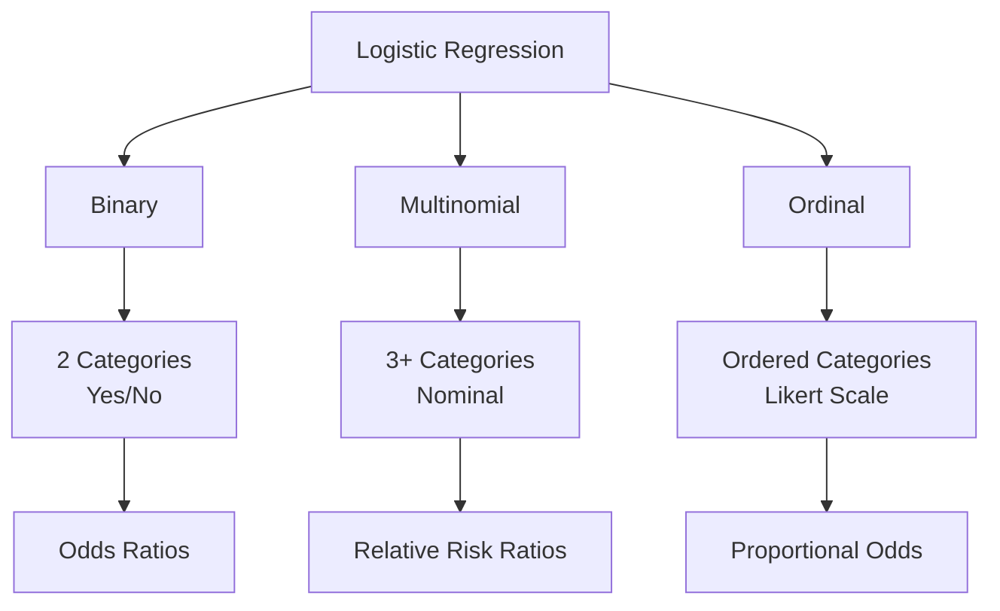
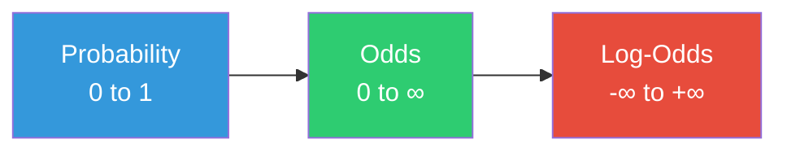

# 📊 Chapter 6: Logistic Regression in Public Health Research Part 01

## *A Comprehensive Guide with Practical Applications*

<div align="center">

[](https://github.com/muhammadsalek)
[](LICENSE)
[]()
[]()

**[⬅ Previous: Chapter 5 - Regression Analysis](./05-regression.md) · [🏠 Home](../README.md) · [➡ Next: Chapter 7 - Advanced Regression Models](./07-advanced-regression.md)**

</div>

---

> *"Logistic regression is the workhorse of modern epidemiology and public health research — when used correctly, it illuminates relationships; when used carelessly, it obscures them."* — **David G. Kleinbaum**

> *"All models are wrong, but some are useful. Logistic regression, properly applied, is among the most useful."* — **George E.P. Box** (paraphrased)

---

## 📋 Table of Contents

1. [🎯 Learning Objectives](#-learning-objectives)
2. [🌍 Big Picture](#-big-picture)
3. [🧠 Core Intuition](#-core-intuition)
4. [📐 Mathematical Foundation](#-mathematical-foundation)
5. [📊 Types of Logistic Regression](#-types-of-logistic-regression)
6. [🔧 Model Diagnostics](#-model-diagnostics)
7. [⚠️ Hidden Traps & Solutions](#️-hidden-traps--solutions)
8. [💻 Software Implementation](#-software-implementation)
9. [🏥 Real Research Examples](#-real-research-examples)
10. [❌ Common Mistakes](#-common-mistakes)
11. [📝 Assessment](#-assessment)
12. [📚 Further Reading](#-further-reading)

---

## 🎯 Learning Objectives

| Level | Objectives |
|-------|------------|
| **🏗️ Foundational** | ✅ Understand when and why to use logistic regression |
| | ✅ Interpret odds ratios and confidence intervals |
| | ✅ Distinguish between binary, multinomial, and ordinal logistic regression |
| **📈 Intermediate** | ✅ Fit logistic regression models in multiple software packages |
| | ✅ Perform and interpret key diagnostic tests (VIF, Cook's Distance, Hosmer-Lemeshow) |
| | ✅ Calculate and interpret AUC-ROC |
| **🎓 Advanced** | ✅ Detect and resolve perfect separation |
| | ✅ Handle low events-per-variable (EPV) scenarios |
| | ✅ Critically evaluate logistic regression in published research |

---

## 🌍 Big Picture

### The Logistic Regression Landscape



### Why Logistic Regression?

| Feature | Linear Regression | Logistic Regression |
|---------|-------------------|---------------------|
| **Outcome Type** | Continuous | Categorical |
| **Prediction** | Continuous value | Probability |
| **Range** | -∞ to +∞ | 0 to 1 |
| **Assumptions** | Normality, homoscedasticity | Less restrictive |
| **Interpretation** | Change in Y | Change in odds |

---

## 🧠 Core Intuition

### The Fundamental Problem

Linear regression assumes: $Y = \beta_0 + \beta_1X$

**Problem:** $Y$ can take any value from $-\infty$ to $+\infty$

**But:** We want probabilities between 0 and 1!

**Solution:** Transform probabilities into log-odds (which can range from $-\infty$ to $+\infty$)

### The Three-Step Transformation



### The Logistic Function (Sigmoid)

The logistic function maps any real-valued input to a probability between 0 and 1:

$$P(Y=1) = \frac{1}{1 + e^{-(\beta_0 + \beta_1X)}}$$

This creates the characteristic **S-curve**:

- $X \to -\infty$: $P \to 0$
- $X \to +\infty$: $P \to 1$
- $X = 0$: $P = 0.5$

### The Logit Transformation

The inverse of the logistic function:

$$\text{logit}(p) = \ln\left(\frac{p}{1-p}\right) = \beta_0 + \beta_1X$$

**Interpretation:** The logit is the **log odds** of the event occurring.

---

## 📐 Mathematical Foundation

### 1. The Logistic Regression Model

#### Probability of Event

$$P(Y=1|X) = \frac{1}{1 + e^{-(\beta_0 + \beta_1X_1 + \beta_2X_2 + \cdots + \beta_kX_k)}}$$

#### Logit Form

$$\log\left(\frac{P(Y=1)}{1-P(Y=1)}\right) = \beta_0 + \beta_1X_1 + \beta_2X_2 + \cdots + \beta_kX_k$$

### 2. Odds and Odds Ratios

#### Odds

$$\text{Odds} = \frac{P(Y=1)}{P(Y=0)} = \frac{p}{1-p}$$

#### Odds Ratio

$$\text{OR} = \frac{\text{Odds in group 1}}{\text{Odds in group 2}} = \frac{p_1/(1-p_1)}{p_2/(1-p_2)}$$

#### Interpretation

| OR Value | Interpretation |
|----------|----------------|
| OR = 1 | No association |
| OR > 1 | Increased odds (risk factor) |
| OR < 1 | Decreased odds (protective factor) |

### 3. Maximum Likelihood Estimation (MLE)

Logistic regression uses **Maximum Likelihood Estimation** instead of Ordinary Least Squares.

#### Likelihood Function

$$\mathcal{L}(\boldsymbol{\beta}) = \prod_{i=1}^{n} P_i^{y_i}(1-P_i)^{1-y_i}$$

#### Log-Likelihood

$$\ell(\boldsymbol{\beta}) = \sum_{i=1}^{n} [y_i\log(P_i) + (1-y_i)\log(1-P_i)]$$

#### Iterative Algorithm

Unlike linear regression, there is no closed-form solution. We use iterative algorithms:

1. Start with initial $\beta$ values
2. Calculate likelihood
3. Update $\beta$ using Newton-Raphson or other optimization
4. Repeat until convergence

### 4. Model Fit Assessment

#### Likelihood Ratio Test

$$G = -2[\ell(\text{null}) - \ell(\text{full})]$$

- $G \sim \chi^2$ with $k$ degrees of freedom
- Significant $p$-value: Model fits better than null model

#### Hosmer-Lemeshow Test

$$\hat{C} = \sum_{g=1}^{G} \frac{(O_g - E_g)^2}{E_g(1 - E_g/n_g)}$$

- $H_0$: Model fits well
- $p > 0.05$: Good fit (no evidence of lack of fit)

#### Pseudo R²

| Measure | Formula | Interpretation |
|---------|---------|----------------|
| **McFadden** | $1 - \frac{\ell(\text{full})}{\ell(\text{null})}$ | 0.2-0.4 = good fit |
| **Cox-Snell** | $1 - [\frac{L(0)}{L(\beta)}]^{2/n}$ | ≤ 1, cannot reach 1 |
| **Nagelkerke** | $\frac{\text{Cox-Snell}}{1 - L(0)^{2/n}}$ | Adjusted to reach 1 |

---

## 📊 Types of Logistic Regression

### 1. Binary Logistic Regression

#### Definition

The outcome variable has exactly **two categories** (e.g., Yes/No, Case/Control, Event/No Event).

#### Model

$$\log\left(\frac{P(Y=1)}{1-P(Y=1)}\right) = \beta_0 + \beta_1X_1 + \cdots + \beta_kX_k$$

#### Example

Predicting ECE participation (Yes/No) based on WASH, Wealth, Maternal Education, etc.

#### When to Use
- Dichotomous outcome
- Want to understand risk factors
- Need probabilities

### 2. Multinomial Logistic Regression

#### Definition

The outcome variable has **three or more nominal categories**.

#### Model (J categories, choose reference category J)

$$P(Y=j|X) = \frac{e^{\beta_j X}}{1 + \sum_{l=1}^{J-1} e^{\beta_l X}}$$

#### Reference Category

$$P(Y=J|X) = \frac{1}{1 + \sum_{l=1}^{J-1} e^{\beta_l X}}$$

#### Relative Risk Ratio (RRR)

$$\text{RRR}_{jk} = e^{\beta_{jk}}$$

- RRR > 1: More likely in category j vs reference
- RRR < 1: Less likely in category j vs reference

#### Example

Predicting depression severity: None, Mild, Moderate, Severe

#### When to Use
- Outcome has 3+ nominal categories
- No natural ordering
- Want to compare each category to reference

### 3. Ordinal Logistic Regression

#### Definition

The outcome variable has **three or more ordered categories**.

#### Proportional Odds Model

$$P(Y \leq j|X) = \frac{1}{1 + e^{-(\alpha_j - \beta X)}}$$

Where $j = 1, 2, \dots, J-1$

#### Key Features

- $\alpha_j$: Thresholds (cut points)
- $\beta$: Common effect across all categories
- **Proportional Odds Assumption**: Effect is constant across categories

#### Brant Test

Tests the proportional odds assumption:
- $H_0$: Proportional odds holds
- $p > 0.05$: Assumption met

#### Example

Predicting disease severity: Mild, Moderate, Severe

#### When to Use
- Outcome has 3+ ordered categories
- Categories have natural ordering
- Proportional odds assumption holds

---

### Comparison Table

| Feature | Binary | Multinomial | Ordinal |
|---------|--------|-------------|---------|
| **Categories** | 2 | 3+ (nominal) | 3+ (ordered) |
| **Coefficients** | 1 set | J-1 sets | 1 set + thresholds |
| **Interpretation** | Odds Ratio | Relative Risk Ratio | Proportional Odds |
| **Assumption** | Less restrictive | Less restrictive | Proportional odds |
| **Common Use** | Disease/no disease | Race/ethnicity | Severity levels |

---

## 🔧 Model Diagnostics

### TIER 1: Standard Checks

#### 1. Linearity in the Logit

**Check:** Relationship between continuous predictors and log-odds should be linear.

**How to Check:**
- Plot log-odds vs predictor (using splines)
- Look for bends or nonlinear patterns

**Solution:**
- Polynomial terms
- Spline functions
- Categorization (with caution)

#### 2. Multicollinearity

**Variance Inflation Factor (VIF):**

$$\text{VIF}_j = \frac{1}{1 - R_j^2}$$

| VIF | Status | Action |
|-----|--------|--------|
| 1-5 | Acceptable | No action |
| 5-10 | Warning | Consider combining |
| >10 | Critical | Remove variable |

#### 3. Independence

**This is a design issue, not a statistical test!**

**When it's violated:**
- Clustered data (e.g., schools, households)
- Longitudinal data
- Repeated measures

**Solutions:**
- Mixed-effects logistic regression
- GEE (Generalized Estimating Equations)
- Clustered standard errors

#### 4. Influential Outliers

**Cook's Distance:**

$$D_i = \frac{\sum_{j=1}^{n} (\hat{y}_j - \hat{y}_{j(i)})^2}{p \cdot \text{MSE}}$$

| D Value | Interpretation |
|---------|----------------|
| D < 0.5 | Acceptable |
| 0.5-1 | Moderate concern |
| D > 1 | Critical |

### TIER 2: Hidden Traps

#### 1. Perfect Separation

**What is it?**
- A predictor perfectly separates outcomes
- No overlap between groups

**Signs:**
- OR in hundreds or thousands
- Huge confidence intervals
- Model fails to converge
- "NA" or huge standard errors

**Example:**
```
Group A: 20 events, 0 non-events
Group B: 5 events, 25 non-events
```

**Solutions:**
1. **Firth's Penalized Likelihood**

$$\beta_{\text{Firth}} = \arg\max_{\beta} [\ell(\beta) + 0.5\log|I(\beta)|]$$

2. **Collapse categories**
3. **Collect more data**
4. **Bayesian methods**

#### 2. Too Few Events (Low EPV)

**Events Per Variable (EPV):**

$$\text{EPV} = \frac{\text{Number of events}}{\text{Number of predictors}}$$

| EPV | Recommendation |
|-----|----------------|
| < 5 | Too low |
| 5-10 | Marginal |
| ≥ 10 | Adequate |

**Consequences:**
- Overfitting
- Unstable coefficients
- Wide confidence intervals
- Unreliable predictions

**Solutions:**
1. Simplify model
2. Use penalized regression
3. Collect more data
4. Use Firth's method

#### 3. "One in the Box"

**What is it?**
- Categories with low counts
- No mix of outcomes in some categories

**Example:**
```
Category A: 100 observations, all event=0
Category B: 100 observations, all event=1
```

**Solution:**
- Collapse categories
- Collect more data
- Use penalized methods

### TIER 3: The Architect's Mindset

#### 1. Diagnose the Dominant Trap

Which issue is most likely to break your model?
- Perfect separation?
- Too few events?
- Multicollinearity?
- Missing data?

#### 2. Check Model Fit

**Don't just look at coefficients!**

- Likelihood Ratio Test
- Hosmer-Lemeshow Test
- AIC/BIC
- Calibration plots

#### 3. Remember the Business Cost

A model can pass all statistical tests and still be:
- **Operationally wrong**
- **Unusable in practice**

#### 4. Key Questions

1. Does it solve the problem?
2. Can it be implemented?
3. What are the costs of errors?
4. Is it interpretable?

### Summary: Key Diagnostic Tests

| Test | Purpose | Threshold |
|------|---------|-----------|
| VIF | Multicollinearity | >5 Warning, >10 Critical |
| Cook's Distance | Influential outliers | D > 1 |
| Hosmer-Lemeshow | Calibration | p > 0.05 |
| AUC-ROC | Discrimination | 0.7-0.8 Acceptable |
| Likelihood Ratio | Overall fit | p < 0.05 |
| EPV | Sample adequacy | >10 |
| Brant Test | Proportional odds | p > 0.05 |

---

## ⚠️ Hidden Traps & Solutions

### The Perfect Separation Trap

**Scenario:**
```
Variable: Maternal Education (yes/no)
Outcome: ECE participation

Education Yes: 50 children, all in ECE
Education No: 50 children, none in ECE

OR = (50/0)/(0/50) = ∞
```

**Detection:**
- Coefficients are extremely large (>5)
- Standard errors are huge
- Model warning messages

**Solution: Firth's Method**

```r
library(logistf)
model_firth <- logistf(y ~ x1 + x2, data = df)
```

### The Low EPV Trap

**Scenario:**
```
50 events
10 predictors
EPV = 50/10 = 5 (Too Low!)
```

**Consequences:**
- Overfitting
- Unstable estimates
- Unreliable p-values

**Solutions:**
1. **Simplify the model:** Remove predictors
2. **Penalized regression:** Ridge, Lasso, Elastic Net
3. **Collect more data:** Increase sample size
4. **Use Firth's method:** For small sample bias

### The "One in the Box" Trap

**Scenario:**
```
Region North: 200 children, 100 in ECE
Region South: 200 children, 0 in ECE
Region East: 200 children, 200 in ECE
```

**Problem:**
- No variability in South and East
- Unstable estimates

**Solution:**
- Collapse regions
- Use penalized methods
- Collect more data

### The Multicollinearity Trap

**Scenario:**
```
VIF for Wealth = 12 (Critical!)
VIF for Education = 9 (Warning!)
```

**Detection:**
- VIF > 5: Warning
- VIF > 10: Critical
- High correlation between predictors

**Solutions:**
1. **Remove variables:** Keep only one
2. **Combine variables:** Create index
3. **Principal components:** PCA
4. **Ridge regression:** Handles collinearity

### The Missing Data Trap

**Problem:**
- 30% missing in one predictor
- Complete case analysis loses power
- Bias if missing not at random

**Solutions:**
1. **Multiple Imputation** (preferred)
2. **Complete case analysis** (if <5% missing)
3. **Missing indicator** (careful)
4. **Mean/median imputation** (warning!)

---

## 💻 Software Implementation

### Python Implementation

```python
# ============================================
# Logistic Regression in Python
# ============================================

import pandas as pd
import numpy as np
from sklearn.linear_model import LogisticRegression
from sklearn.metrics import roc_auc_score, roc_curve
from sklearn.model_selection import train_test_split
import statsmodels.api as sm
from statsmodels.stats.outliers_influence import variance_inflation_factor

# ============================================
# 1. Binary Logistic Regression
# ============================================

# Prepare data
X = df[['maternal_edu', 'wealth', 'urban', 'media', 'child_age']]
y = df['ece_participation']

# Add constant for statsmodels
X_const = sm.add_constant(X)

# Fit model
model = sm.Logit(y, X_const).fit()
print(model.summary())

# Odds Ratios
odds_ratios = np.exp(model.params)
print("\nOdds Ratios:")
print(odds_ratios)

# Confidence Intervals
conf_intervals = np.exp(model.conf_int())
print("\n95% Confidence Intervals:")
print(conf_intervals)

# AUC
y_pred = model.predict(X_const)
auc = roc_auc_score(y, y_pred)
print(f"\nAUC: {auc:.4f}")

# VIF
vif_data = pd.DataFrame()
vif_data['Variable'] = X.columns
vif_data['VIF'] = [variance_inflation_factor(X.values, i) 
                    for i in range(X.shape[1])]
print("\nVIF:")
print(vif_data)

# ============================================
# 2. Multinomial Logistic Regression
# ============================================

from sklearn.linear_model import LogisticRegression

# Multinomial model
model_multi = LogisticRegression(multi_class='multinomial', 
                                  solver='lbfgs', 
                                  max_iter=1000)
model_multi.fit(X, y_depression)

# Predictions
y_pred_multi = model_multi.predict(X)
y_proba_multi = model_multi.predict_proba(X)

# ============================================
# 3. Ordinal Logistic Regression
# ============================================

# Using mord library
from mord import LogisticAT

model_ord = LogisticAT(alpha=0)  # alpha=0 for no regularization
model_ord.fit(X, y_severity)
```

### R Implementation

```r
# ============================================
# Logistic Regression in R
# ============================================

library(tidyverse)
library(car)
library(pROC)
library(ResourceSelection)
library(logistf)
library(nnet)
library(MASS)

# ============================================
# 1. Binary Logistic Regression
# ============================================

# Fit model
model <- glm(ece ~ maternal_edu + wealth + urban + media + child_age,
             data = df,
             family = binomial())

# Summary
summary(model)

# Odds Ratios with CI
or_ci <- exp(cbind(OR = coef(model), 
                   confint(model)))
print(or_ci)

# VIF
vif(model)

# Hosmer-Lemeshow Test
hl_test <- hoslem.test(df$ece, fitted(model), g = 10)
print(hl_test)

# AUC
roc_obj <- roc(df$ece, fitted(model))
auc(roc_obj)

# ROC Plot
plot(roc_obj, main = "ROC Curve")

# ============================================
# 2. Multinomial Logistic Regression
# ============================================

library(nnet)

model_multi <- multinom(depression_severity ~ age + female + income + urban + autonomy,
                        data = df)

summary(model_multi)

# Odds Ratios
exp(coef(model_multi))

# ============================================
# 3. Ordinal Logistic Regression
# ============================================

library(MASS)

model_ord <- polr(severity ~ age + bmi + treatment,
                  data = df,
                  method = "logistic")

summary(model_ord)

# Proportional odds test
library(ordinal)
model_ord_test <- clm(severity ~ age + bmi + treatment,
                      data = df)
nominal_test(model_ord_test)  # Brant test

# ============================================
# 4. Firth's Method (for perfect separation)
# ============================================

library(logistf)

model_firth <- logistf(ece ~ maternal_edu + wealth + urban,
                       data = df)
summary(model_firth)

# ============================================
# 5. Stepwise Selection
# ============================================

# Backward selection
model_backward <- step(model, direction = "backward")

# Forward selection
model_forward <- step(model, direction = "forward")

# ============================================
# 6. Model Diagnostics
# ============================================

# Cook's Distance
cooks <- cooks.distance(model)
plot(cooks, type = "h")
abline(h = 1, col = "red")

# Influence plot
influencePlot(model)

# dfbetas
dfbetas_vals <- dfbetas(model)
```

### SPSS Syntax

```spss
* ============================================
* Logistic Regression in SPSS
* ============================================

* ============================================
* 1. Binary Logistic Regression
* ============================================

LOGISTIC REGRESSION VARIABLES ece
  /METHOD = ENTER maternal_edu wealth urban media child_age
  /CONTRAST (maternal_edu) = Indicator
  /CONTRAST (wealth) = Indicator
  /PRINT = CI(95)
  /CRITERIA = PIN(.05) POUT(.10) ITERATE(20) CUT(.5).

* ============================================
* 2. With Interaction Term
* ============================================

LOGISTIC REGRESSION VARIABLES ece
  /METHOD = ENTER maternal_edu wealth urban media child_age 
             wealth*urban
  /PRINT = CI(95).

* ============================================
* 3. Hosmer-Lemeshow Test
* ============================================

* After running logistic regression:
* Save predicted probabilities
* Then run crosstabs

COMPUTE pred_prob = PRE_1.
CROSSTABS
  /TABLES = ece BY pred_prob_group
  /STATISTICS = CHISQ.

* ============================================
* 4. Multinomial Logistic Regression
* ============================================

NOMREG depression_severity (BASE = FIRST ORDER = DESCENDING)
  /CRITERIA = CIN(95) DELTA(0) MXITER(100) MXSTEP(5) CHKSEP(20) 
    LCONVERGE(0) PCONVERGE(0.000001) SINGULAR(0.00000001)
  /MODEL = age female income urban autonomy
  /INTERCEPT = INCLUDE
  /PRINT = PARAMETER SUMMARY LRT CPS STEP MFI.

* ============================================
* 5. Ordinal Logistic Regression
* ============================================

PLUM severity BY treatment WITH age bmi
  /CRITERIA = CIN(95) DELTA(0) MXITER(100) MXSTEP(5) 
    CHKSEP(20) LCONVERGE(0) PCONVERGE(0.000001) 
    SINGULAR(0.00000001)
  /LINK = LOGIT
  /PRINT = PARAMETER SUMMARY TPARALLEL.

* ============================================
* 6. Variable Selection
* ============================================

LOGISTIC REGRESSION VARIABLES ece
  /METHOD = FORWARD LR maternal_edu wealth urban media child_age
  /PRINT = CI(95).

LOGISTIC REGRESSION VARIABLES ece
  /METHOD = BACKWARD LR maternal_edu wealth urban media child_age
  /PRINT = CI(95).
```

### STATA Code

```stata
* ============================================
* Logistic Regression in STATA
* ============================================

* ============================================
* 1. Binary Logistic Regression
* ============================================

* Logit model
logit ece maternal_edu wealth urban media child_age

* Odds ratios
logit ece maternal_edu wealth urban media child_age, or

* With confidence intervals
logit ece maternal_edu wealth urban media child_age, or level(95)

* ============================================
* 2. Model Diagnostics
* ============================================

* Hosmer-Lemeshow Test
estat gof, group(10)

* Classification table
estat classification

* Cook's Distance
predict cooksd, cooksd
list if cooksd > 1

* VIF (after linear regression for assessment)
regress ece maternal_edu wealth urban media
vif

* ============================================
* 3. Interactions
* ============================================

logit ece maternal_edu wealth urban media child_age c.wealth#c.urban

* ============================================
* 4. Multinomial Logistic Regression
* ============================================

mlogit depression_severity age female income urban autonomy, 
    rrr base(1)

* ============================================
* 5. Ordinal Logistic Regression
* ============================================

ologit severity age bmi i.treatment

* Brant test
brant

* ============================================
* 6. Firth's Method (for perfect separation)
* ============================================

ssc install firthlogit
firthlogit ece maternal_edu wealth urban

* ============================================
* 7. Stepwise Selection
* ============================================

stepwise, pr(.1): logit ece maternal_edu wealth urban media child_age

* ============================================
* 8. ROC Analysis
* ============================================

predict pred_prob
roctab ece pred_prob
```

### SAS Program

```sas
* ============================================
* Logistic Regression in SAS
* ============================================

* ============================================
* 1. Binary Logistic Regression
* ============================================

PROC LOGISTIC DATA=work.df DESCENDING;
    CLASS maternal_edu wealth urban media / PARAM=REF;
    MODEL ece = maternal_edu wealth urban media child_age
        / SELECTION=NONE
        CLODDS=PL
        CTABLE
        LACKFIT;
    OUTPUT OUT=pred_data
        PREDICTED=pred_prob
        LOWER=lcl
        UPPER=ucl;
RUN;

* ============================================
* 2. Stepwise Selection
* ============================================

PROC LOGISTIC DATA=work.df DESCENDING;
    CLASS maternal_edu wealth urban media / PARAM=REF;
    MODEL ece = maternal_edu wealth urban media child_age
        / SELECTION=STEPWISE
        SLENTRY=0.10
        SLSTAY=0.10
        CLODDS=PL;
RUN;

* ============================================
* 3. Multinomial Logistic Regression
* ============================================

PROC LOGISTIC DATA=work.df;
    CLASS age female income urban autonomy / PARAM=REF;
    MODEL depression_severity(REF='None') = age female income urban autonomy
        / LINK=GLOGIT
        CLODDS=PL;
RUN;

* ============================================
* 4. Ordinal Logistic Regression
* ============================================

PROC LOGISTIC DATA=work.df;
    CLASS treatment / PARAM=REF;
    MODEL severity = age bmi treatment
        / LINK=LOGIT
        CLODDS=PL;
    TEST treatment = 0;
    TEST age = 0;
RUN;

* ============================================
* 5. Firth's Method
* ============================================

PROC LOGISTIC DATA=work.df DESCENDING FIRTH;
    CLASS maternal_edu wealth urban / PARAM=REF;
    MODEL ece = maternal_edu wealth urban;
RUN;

* ============================================
* 6. ROC Analysis
* ============================================

PROC LOGISTIC DATA=work.df DESCENDING;
    MODEL ece = maternal_edu wealth urban media child_age;
    ROC;
    EFFECTPLOT;
RUN;
```

---

## 🏥 Real Research Examples

### Example 1: Early Childhood Education (ECE)

**Context:** What factors predict Early Childhood Education (ECE) participation in Bangladesh?

**Variables:**
- Outcome: ECE participation (Yes/No)
- Predictors: WASH Index, Wealth, Maternal Education, Urban, Media Access, Child Age

**Model:**
$$\log\left(\frac{P(\text{ECE}=1)}{1-P(\text{ECE}=1)}\right) = \beta_0 + \beta_1(\text{WASH}) + \beta_2(\text{Wealth}) + \beta_3(\text{Maternal Education}) + \beta_4(\text{Urban}) + \beta_5(\text{Media Access}) + \beta_6(\text{Child Age})$$

**Results:**

| Predictor | AOR | 95% CI | p-value |
|-----------|-----|--------|---------|
| WASH Index | 1.45 | (1.21, 1.74) | <0.001 |
| Wealth (Middle) | 1.82 | (1.45, 2.28) | <0.001 |
| Wealth (Highest) | 2.94 | (2.31, 3.74) | <0.001 |
| Maternal Education | 1.12 | (1.08, 1.16) | <0.001 |
| Urban Residence | 1.38 | (1.12, 1.70) | 0.002 |
| Media Access | 1.25 | (1.04, 1.50) | 0.018 |
| Child Age | 1.03 | (1.02, 1.04) | <0.001 |

**Model Fit:**
- H-L $\chi^2 = 8.42$, df=8, p=0.393
- AUC = 0.742

**Interpretation:**
- Children in highest wealth quintile have 2.94 times higher odds of ECE participation
- Urban children have 1.38 times higher odds
- Each year of maternal education increases odds by 12%

---

### Example 2: Depression Severity

**Context:** What factors predict depression severity levels? (None, Mild, Moderate, Severe)

**Variables:**
- Outcome: Depression severity (4 categories)
- Predictors: Age, Female, Low Income, Urban, Decision Autonomy

**Results:**

| Predictor | Mild vs None | Moderate vs None | Severe vs None |
|-----------|--------------|------------------|----------------|
| Age | 1.02 (0.98,1.06) | 1.04* (1.00,1.08) | 1.06** (1.02,1.10) |
| Female | 1.32** (1.12,1.56) | 1.58*** (1.28,1.95) | 1.89*** (1.45,2.46) |
| Low Income | 1.45*** (1.22,1.72) | 1.82*** (1.47,2.25) | 2.34*** (1.78,3.08) |
| Urban | 0.88 (0.74,1.05) | 0.82* (0.67,1.00) | 0.74** (0.58,0.94) |
| Decision Autonomy | 0.76*** (0.66,0.88) | 0.65*** (0.54,0.78) | 0.52*** (0.41,0.66) |

**Model Fit:**
- $\chi^2 = 284.5$, df=15, p < 0.001
- McFadden $R^2 = 0.124$

**Interpretation:**
- Low income individuals have 1.45 times higher odds of mild depression and 2.34 times higher odds of severe depression
- Higher decision autonomy is protective across all severity levels
- Urban residence is protective for moderate and severe depression

---

## ❌ Common Mistakes

### The Top 10 Mistakes

| # | Mistake | Consequence | Solution |
|---|---------|-------------|----------|
| 1 | **Ignoring perfect separation** | Model fails to converge | Use Firth's method |
| 2 | **Low EPV** | Overfitting, unstable estimates | Simplify or collect more data |
| 3 | **Ignoring multicollinearity** | Unstable coefficients | Check VIF |
| 4 | **Using stepwise blindly** | Overfitting, inflated significance | Use theory-based selection |
| 5 | **Not checking linearity** | Incorrect estimates | Plot log-odds vs predictor |
| 6 | **Ignoring interactions** | Missing important effects | Test biologically plausible interactions |
| 7 | **Not checking fit** | Poor prediction | Hosmer-Lemeshow, AUC |
| 8 | **Misinterpreting OR** | Incorrect conclusions | OR ≠ Risk Ratio |
| 9 | **Complete case analysis** | Bias, lost power | Multiple imputation |
| 10 | **Not validating model** | Overoptimistic results | Cross-validation, bootstrap |

### Common Reviewer Comments

> **"The authors report adjusted odds ratios but do not assess model fit. Please include Hosmer-Lemeshow test and AUC."**

> **"Events per variable (EPV = 5) is below the recommended minimum of 10. Consider simplifying the model."**

> **"VIF values of 12 and 9 suggest multicollinearity. Please address this."**

### How to Avoid These

1. **Always check diagnostics** before interpreting results
2. **Think carefully** about variable selection
3. **Validate your model** (cross-validation, bootstrap)
4. **Report all assumptions** and how they were checked
5. **Be honest about limitations**

---

## 📝 Assessment

### Multiple Choice Questions

1. What is the range of the logistic function?
   - A) 0 to ∞
   - B) -∞ to ∞
   - C) 0 to 1
   - D) -1 to 1

2. Which measure of model fit uses the log-likelihood?
   - A) Hosmer-Lemeshow
   - B) AUC-ROC
   - C) Likelihood Ratio Test
   - D) VIF

3. What does EPV stand for?
   - A) Events Per Variable
   - B) Expected Probability Value
   - C) Estimated Parameter Variance
   - D) Effect Predictor Value

4. Which test checks the proportional odds assumption?
   - A) Hosmer-Lemeshow
   - B) Brant Test
   - C) Wald Test
   - D) Likelihood Ratio Test

5. What is the recommended minimum EPV?
   - A) 5
   - B) 10
   - C) 15
   - D) 20

6. What does VIF measure?
   - A) Model fit
   - B) Multicollinearity
   - C) Outlier influence
   - D) Separation

7. What is the logit transformation?
   - A) ln(p)
   - B) ln(p/(1-p))
   - C) p/(1-p)
   - D) 1/(1+e^-x)

8. Which method handles perfect separation?
   - A) Stepwise
   - B) Firth's Method
   - C) VIF
   - D) AUC

9. What is the range of AUC?
   - A) 0 to 1
   - B) -1 to 1
   - C) 0 to ∞
   - D) -∞ to ∞

10. Which type of logistic regression is used for 3+ ordered categories?
    - A) Binary
    - B) Multinomial
    - C) Ordinal
    - D) Conditional

### True/False Questions

1. Logistic regression assumes normally distributed errors. **False**
2. An OR > 1 indicates a protective effect. **False**
3. The logit transformation maps probabilities to (-∞, ∞). **True**
4. VIF > 10 indicates serious multicollinearity. **True**
5. Hosmer-Lemeshow p < 0.05 indicates good fit. **False**
6. Ordinal logistic regression uses the proportional odds assumption. **True**
7. Perfect separation leads to infinite odds ratios. **True**
8. Stepwise selection is always the best method. **False**
9. AUC = 0.5 indicates perfect discrimination. **False**
10. Multinomial logistic regression requires a reference category. **True**

### Short Questions

1. Explain the difference between Odds Ratio and Risk Ratio.
2. Describe the proportional odds assumption.
3. What is perfect separation and how do you detect it?
4. Explain the importance of EPV.
5. How do you interpret an AUC of 0.742?

### Long Questions

1. **Study Design Question:** You are planning a study to identify risk factors for hypertension. The study will have 200 cases and 400 controls with 15 predictors. What is the EPV and is it adequate? What would you recommend?

2. **Critical Review:** A published study reports "The adjusted odds ratio for smoking and lung cancer was 15.6 (95% CI: 2.5-97.3)". What concerns do you have about this estimate?

3. **Model Building:** You have 500 observations with 80 events and 20 potential predictors. Describe your approach to building a parsimonious model that is clinically useful.

### Programming Exercises

1. **R Exercise:** Fit a binary logistic regression model to predict disease status. Calculate and interpret all diagnostic measures.

2. **Python Exercise:** Build a logistic regression pipeline with preprocessing, model selection, and evaluation. Include cross-validation.

3. **SPSS Exercise:** Create a syntax file that performs variable selection and reports all diagnostics.

4. **STATA Exercise:** Write a do-file that compares binary, multinomial, and ordinal logistic regression on the same dataset.

---

## 📚 Further Reading

### Recommended Textbooks

| Book | Author(s) | Key Chapter |
|------|-----------|-------------|
| **Applied Logistic Regression** | Hosmer, Lemeshow & Sturdivant | All chapters |
| **Categorical Data Analysis** | Agresti | Chapters 5-8 |
| **Regression Modeling Strategies** | Harrell | Chapters 10-11 |
| **Data Analysis Using Regression** | Gelman & Hill | Chapters 5-6 |
| **Modern Epidemiology** | Rothman et al. | Chapters 15-16 |

### Key Papers

1. Hosmer, D.W. & Lemeshow, S. (2000). *Applied Logistic Regression*. Wiley.
2. Peduzzi, P. et al. (1996). *A simulation study of the number of events per variable in logistic regression analysis*. J Clin Epidemiol.
3. Vittinghoff, E. & McCulloch, C.E. (2007). *Relaxing the rule of ten events per variable in logistic and Cox regression*. Am J Epidemiol.
4. Steyerberg, E.W. et al. (2001). *Prognostic modeling with logistic regression analysis*. Med Decis Making.
5. Harrell, F.E. (2015). *Regression Modeling Strategies*. Springer.

---

## 📑 References

1. Hosmer, D.W., Lemeshow, S., & Sturdivant, R.X. (2013). *Applied Logistic Regression* (3rd ed.). Wiley.
2. Agresti, A. (2002). *Categorical Data Analysis* (2nd ed.). Wiley.
3. Harrell, F.E. (2015). *Regression Modeling Strategies* (2nd ed.). Springer.
4. Gelman, A. & Hill, J. (2007). *Data Analysis Using Regression and Multilevel/Hierarchical Models*. Cambridge.
5. Peduzzi, P., Concato, J., Kemper, E., Holford, T.R., & Feinstein, A.R. (1996). A simulation study of the number of events per variable in logistic regression analysis. *J Clin Epidemiol*, 49(12), 1373-1379.
6. Vittinghoff, E. & McCulloch, C.E. (2007). Relaxing the rule of ten events per variable in logistic and Cox regression. *Am J Epidemiol*, 165(6), 710-718.
7. Steyerberg, E.W. et al. (2001). Prognostic modeling with logistic regression analysis. *Med Decis Making*, 21(1), 45-56.

---

## 🏠 Navigation

<div align="center">

**[⬅ Previous: Chapter 5 - Regression Analysis](./05-regression.md)**

**[🏠 Back to Repository](../README.md)**

**[➡ Next: Chapter 7 - Advanced Regression Models](./07-advanced-regression.md)**

</div>

---

## 📊 Summary Table

| Feature | Binary | Multinomial | Ordinal |
|---------|--------|-------------|---------|
| **Categories** | 2 | 3+ (nominal) | 3+ (ordered) |
| **Key Interpretation** | Odds Ratio | Relative Risk Ratio | Proportional Odds |
| **Key Assumption** | - | - | Proportional odds |
| **Common Test** | H-L Goodness-of-Fit | Likelihood Ratio | Brant Test |
| **Software** | All packages | All packages | All packages |

---

## 📝 Bengali Summary (বাংলা সারাংশ)

### লজিস্টিক রিগ্রেশন বিশ্লেষণ

> *"লজিস্টিক রিগ্রেশন আধুনিক মহামারীবিদ্যা এবং জনস্বাস্থ্য গবেষণার কর্মঘোড়া — সঠিকভাবে ব্যবহার করলে এটি সম্পর্ক উন্মোচিত করে; অসাবধানে ব্যবহার করলে এটি আড়াল করে।"*

**মূল ধারণা:**

লজিস্টিক রিগ্রেশন একটি **দ্বিচার (Binary)** বা **বহুশ্রেণী (Multinomial)** ফলাফলকে পূর্বাভাস দেয়। এটি **সম্ভাবনা (Probability)** এবং **অডস (Odds)** এর মাধ্যমে ব্যাখ্যা করা হয়।

**তিনটি প্রধান ধরন:**

| ধরন | বর্ণনা | উদাহরণ |
|------|---------|---------|
| **দ্বিচার (Binary)** | ২টি শ্রেণী | হ্যাঁ/না, রোগী/সুস্থ |
| **বহুশ্রেণী (Multinomial)** | ৩+ অ-ক্রমিক শ্রেণী | জাতি, ধর্ম |
| **ক্রমিক (Ordinal)** | ৩+ ক্রমিক শ্রেণী | তীব্রতা, গুরুতরতা |

**মূল সূত্র:**

$$\log\left(\frac{p}{1-p}\right) = \beta_0 + \beta_1X_1 + \cdots + \beta_kX_k$$

**মূল শিক্ষা:**

- 📌 Odds Ratio > 1: ঝুঁকি বাড়ায়
- 📌 Odds Ratio < 1: ঝুঁকি কমায়
- 📌 EPV ≥ 10: ন্যূনতম প্রয়োজন
- 📌 AUC: মডেলের পার্থক্য করার ক্ষমতা

---

<div align="center">

*Chapter 6: Logistic Regression Analysis*

*Statistics for Scientists — An Open-Access Textbook*

[](https://github.com/muhammadsalek)
[](LICENSE)

</div>