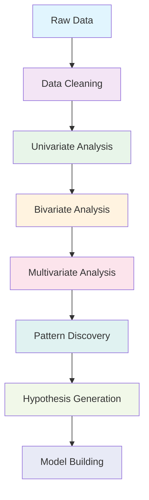
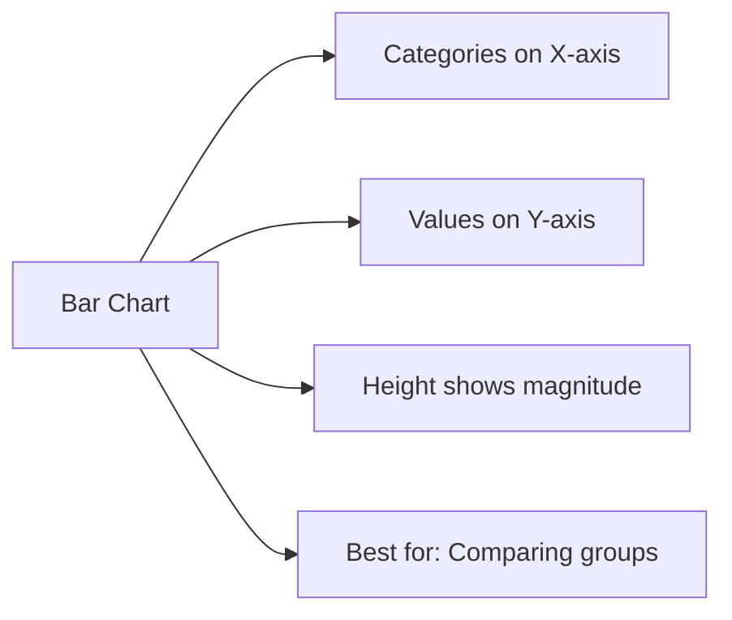
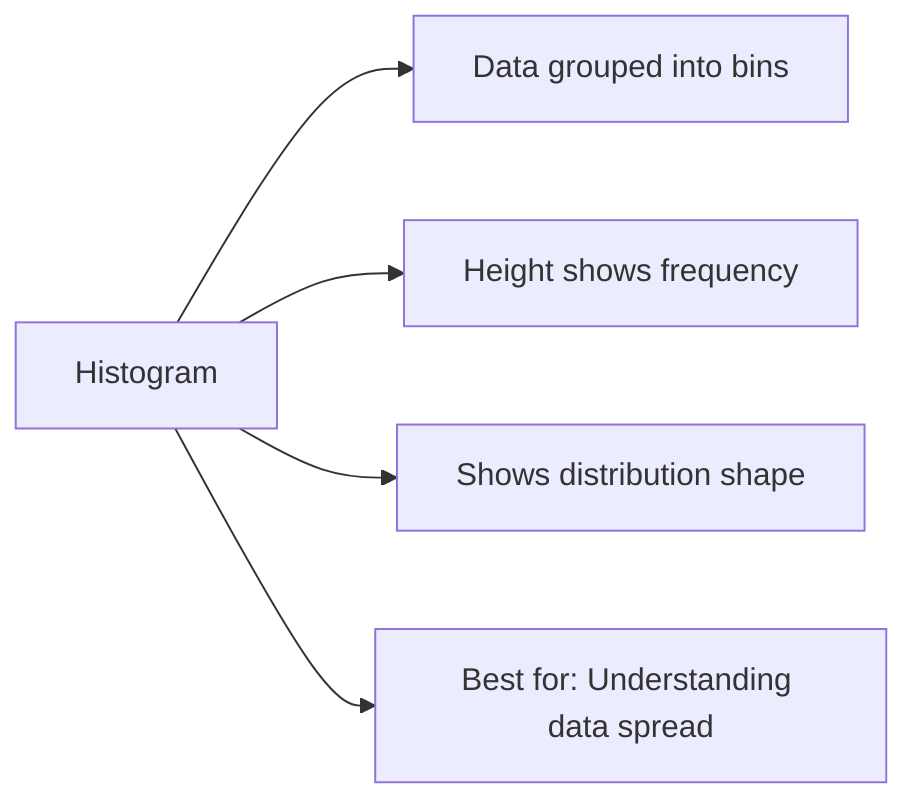
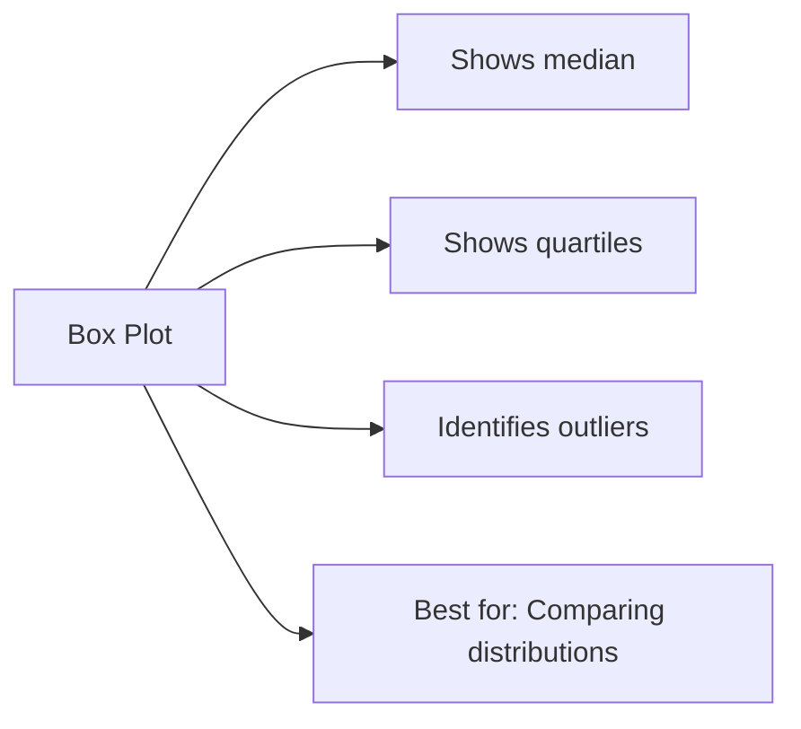
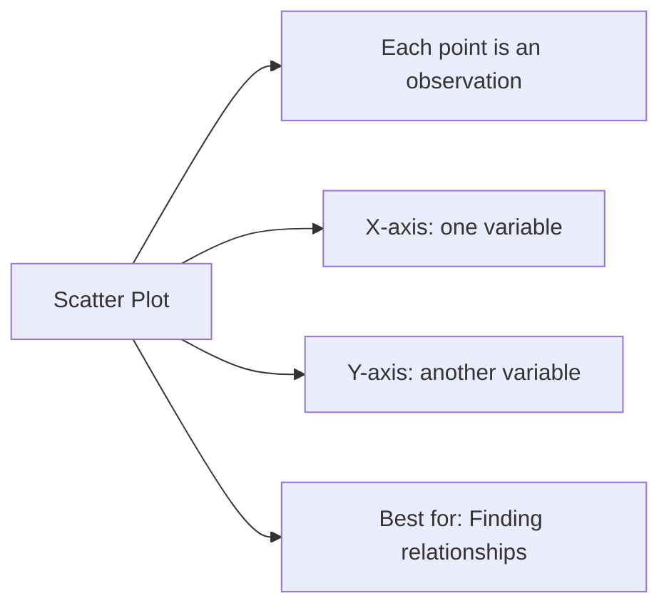
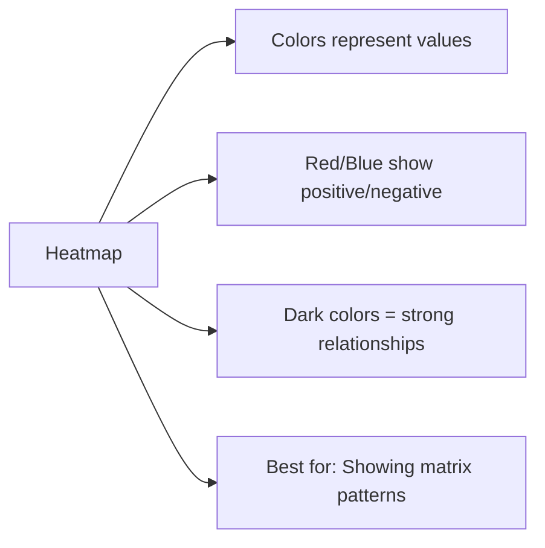
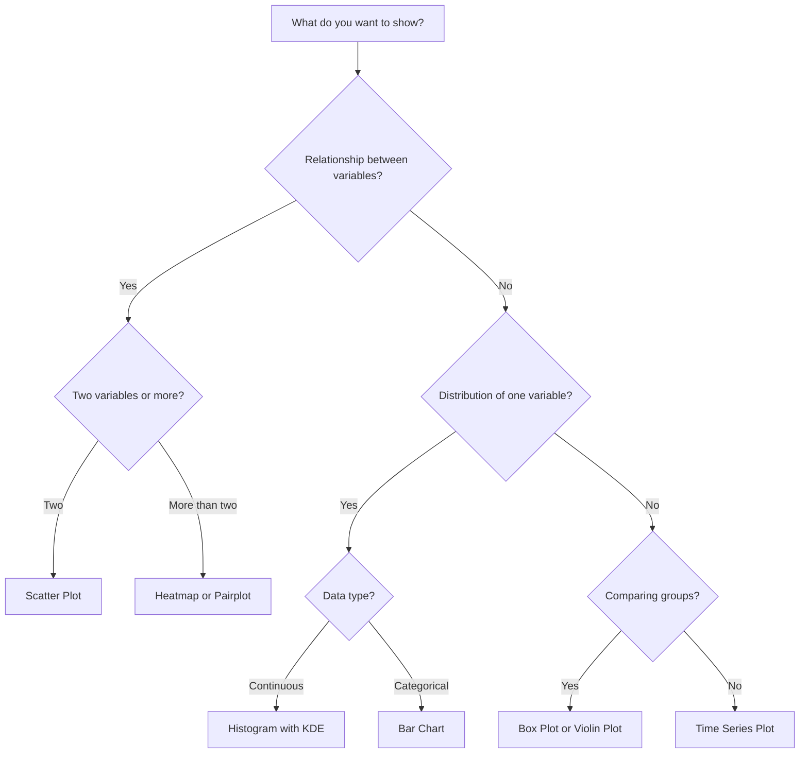
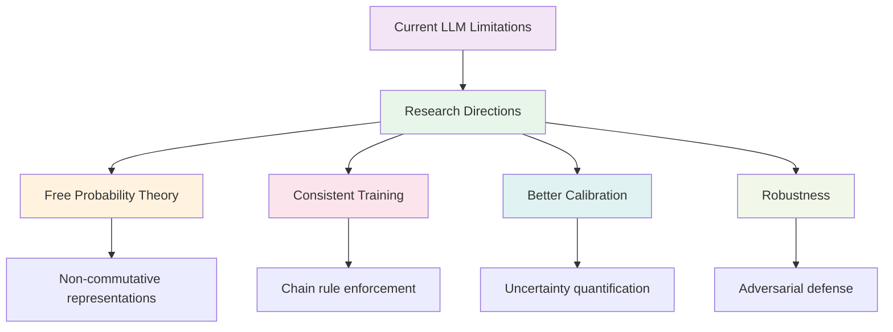

# Chapter 8: Complete Statistical Journey - From EDA to LLMs
## A Comprehensive Guide for Beginners to Advanced Practitioners

[⬅ Previous: Probability Distributions](./06-probability-distributions.md) | [🏠 Home](../README.md) | [➡ Next: Hypothesis Testing](./07-hypothesis-testing.md)

---

## 📚 Table of Contents

1. [Introduction: What is This Chapter About?](#introduction-what-is-this-chapter-about)
2. [Part 1: Foundations of Exploratory Data Analysis](#part-1-foundations-of-exploratory-data-analysis)
3. [Part 2: Statistical Graphics and Visualization](#part-2-statistical-graphics-and-visualization)
4. [Part 3: Mathematical Functions in Machine Learning](#part-3-mathematical-functions-in-machine-learning)
5. [Part 4: Activation Functions - Complete Guide](#part-4-activation-functions---complete-guide)
6. [Part 5: Probability Theory for LLMs](#part-5-probability-theory-for-llms)
7. [Part 6: LLM Probability Frameworks](#part-6-llm-probability-frameworks)
8. [Part 7: Advanced LLM Analysis](#part-7-advanced-llm-analysis)
9. [Part 8: Practical Implementation Guide](#part-8-practical-implementation-guide)
10. [Part 9: Statistical Testing for LLMs](#part-9-statistical-testing-for-llms)
11. [Part 10: Limitations and Future Directions](#part-10-limitations-and-future-directions)
12. [Conclusion and Next Steps](#conclusion-and-next-steps)
13. [References](#references)

---

## Introduction: What is This Chapter About?

### 🎯 Who Is This Chapter For?

Welcome! This chapter is designed for **everyone** - from complete beginners who have never written a line of code to advanced practitioners working with Large Language Models (LLMs). 

**If you are a beginner**, don't worry! We start from the very basics and explain everything in simple terms with real-world examples. Think of this as your friendly guide to understanding the math and statistics behind modern AI.

**If you are advanced**, you'll find comprehensive implementations, mathematical formulations, and cutting-edge research on LLM probability consistency. This chapter bridges the gap between classical statistics and modern deep learning.

### 📖 What Will You Learn?

This chapter takes you on a **complete statistical journey** - starting from understanding your data all the way to building and analyzing Large Language Models. Here's what we'll cover:

1. **Exploratory Data Analysis (EDA)**: How to understand any dataset
2. **Visualizations**: How to create beautiful, informative graphs
3. **Mathematical Functions**: The building blocks of ML models
4. **Activation Functions**: How neural networks "think"
5. **Probability Theory**: The foundation of LLMs
6. **Advanced LLM Analysis**: How to evaluate language models
7. **Practical Implementation**: Step-by-step code examples

### 🗺️ The Big Picture: Your Statistical Journey

```mermaid
flowchart LR
    A[Start: Raw Data] --> B[EDA: Understand Your Data]
    B --> C[Visualization: See the Patterns]
    C --> D[Mathematical Functions: Build the Foundation]
    D --> E[Activation Functions: Enable Learning]
    E --> F[Probability Theory: Model Uncertainty]
    F --> G[LLM Analysis: Evaluate Performance]
    G --> H[End: Deploy & Monitor]
    
    style A fill:#e1f5fe
    style B fill:#f3e5f5
    style C fill:#e8f5e9
    style D fill:#fff3e0
    style E fill:#fce4ec
    style F fill:#e0f2f1
    style G fill:#f1f8e9
    style H fill:#e8eaf6
```



### 🧠 Why Does This Matter?

Every day, we interact with AI systems - from Google Search to ChatGPT. Understanding the statistical foundation behind these systems helps you:

- **Make better decisions** with data
- **Build more reliable** AI systems
- **Understand limitations** of current technology
- **Identify biases** in AI models
- **Create more robust** solutions

### 📊 How to Use This Chapter

1. **Read sequentially** for a complete understanding
2. **Skip ahead** if you already know certain topics
3. **Run the code** to see concepts in action
4. **Refer back** to sections as needed

---

## Part 1: Foundations of Exploratory Data Analysis

### 🤔 What is EDA and Why Does It Matter?

**Think of EDA like a medical check-up for your data.** Just as a doctor examines a patient to understand their health, EDA examines data to understand its characteristics, patterns, and potential issues.

**Real-World Example**: Imagine you work for a hospital and have data on patient admissions. Before building a model to predict readmission rates, you need to:
- Know what data you have (age, diagnosis, treatment, etc.)
- Find missing information (some patients might not have complete records)
- Spot unusual patterns (patients with extremely long hospital stays)
- Understand relationships (does age affect readmission?)

**As the National Institute of Standards and Technology states**: "Quantitative statistics are not wrong per se, but they are incomplete" - they "focus but also filter; and filtering is exactly what makes the quantitative approach incomplete at best and misleading at worst" .

### 📊 The Four Pillars of EDA

EDA operates across four interconnected dimensions:

| Pillar | What It Does | Simple Example | Why It Matters |
|--------|--------------|----------------|----------------|
| **Distributional** | How variables are spread out | Are heights normally distributed? | Helps choose appropriate statistical tests |
| **Relational** | How variables relate to each other | Does age affect blood pressure? | Identifies potential predictors |
| **Structural** | What patterns exist | Are there seasonal trends? | Reveals underlying processes |
| **Comparative** | How groups differ | Do men and women have different cholesterol levels? | Uncovers demographic differences |

### 🔄 The EDA Workflow



### 📝 What Questions Does EDA Answer?

1. **Data Quality Questions**:
   - Are there missing values? Where?
   - Are there outliers? How many?
   - Are there duplicates? Why?
   - Are data types correct?

2. **Data Distribution Questions**:
   - What is the average, median, mode?
   - Is the data symmetric or skewed?
   - Are there multiple groups?
   - What's the range and spread?

3. **Relationship Questions**:
   - Are variables correlated?
   - Does one variable predict another?
   - Are there patterns over time?
   - Are there interactions between variables?

4. **Data Structure Questions**:
   - What are the main components?
   - Can we reduce dimensions?
   - What are the underlying patterns?
   - Is the data random or structured?

### 💡 Real-World Application: The Anscombe Quartet

**One of the most famous examples showing why EDA matters is the Anscombe Quartet**. Four datasets have identical summary statistics (mean, variance, correlation) but look completely different when plotted:

```python
import numpy as np
import pandas as pd
import matplotlib.pyplot as plt
from sklearn.datasets import make_regression

# Anscombe's quartet data
anscombe = {
    'x1': [10, 8, 13, 9, 11, 14, 6, 4, 12, 7, 5],
    'y1': [8.04, 6.95, 7.58, 8.81, 8.33, 9.96, 7.24, 4.26, 10.84, 4.82, 5.68],
    'x2': [10, 8, 13, 9, 11, 14, 6, 4, 12, 7, 5],
    'y2': [9.14, 8.14, 8.74, 8.77, 9.26, 8.10, 6.13, 3.10, 9.13, 7.26, 4.74],
    'x3': [10, 8, 13, 9, 11, 14, 6, 4, 12, 7, 5],
    'y3': [7.46, 6.77, 12.74, 7.11, 7.81, 8.84, 6.08, 5.39, 8.15, 6.42, 5.73],
    'x4': [8, 8, 8, 8, 8, 8, 8, 8, 8, 8, 19],
    'y4': [6.58, 5.76, 7.71, 8.84, 8.47, 7.04, 5.25, 12.50, 5.56, 7.91, 6.89]
}

# Convert to DataFrame
df_anscombe = pd.DataFrame(anscombe)

# Calculate summary statistics
print("Summary Statistics (All datasets have nearly identical stats):")
print(f"Mean of X: {df_anscombe[['x1','x2','x3','x4']].mean().mean():.2f}")
print(f"Mean of Y: {df_anscombe[['y1','y2','y3','y4']].mean().mean():.2f}")
print(f"Correlation: {df_anscombe['x1'].corr(df_anscombe['y1']):.3f}")

# Plot the four datasets
fig, axes = plt.subplots(2, 2, figsize=(12, 10))
datasets = [('x1','y1'), ('x2','y2'), ('x3','y3'), ('x4','y4')]
titles = ['Dataset 1', 'Dataset 2', 'Dataset 3', 'Dataset 4']

for idx, ((x, y), title) in enumerate(zip(datasets, titles)):
    row, col = idx // 2, idx % 2
    axes[row, col].scatter(df_anscombe[x], df_anscombe[y], s=50, alpha=0.7)
    
    # Add regression line
    z = np.polyfit(df_anscombe[x], df_anscombe[y], 1)
    p = np.poly1d(z)
    x_line = np.linspace(df_anscombe[x].min(), df_anscombe[x].max(), 100)
    axes[row, col].plot(x_line, p(x_line), 'r--', label=f'y={z[0]:.2f}x+{z[1]:.2f}')
    
    axes[row, col].set_xlabel('X')
    axes[row, col].set_ylabel('Y')
    axes[row, col].set_title(title)
    axes[row, col].legend()
    axes[row, col].grid(True, alpha=0.3)

plt.tight_layout()
plt.show()
```

**The Lesson**: Statistics alone can be misleading. Visualization is essential for truly understanding your data.

### 🔍 EDA Techniques by Data Type

| Data Type | EDA Techniques | What to Look For |
|-----------|---------------|------------------|
| **Numeric** | Histograms, Box plots, QQ plots | Distribution shape, outliers, skewness |
| **Categorical** | Bar charts, Pie charts | Frequencies, proportions, imbalances |
| **Time Series** | Line plots, Seasonal decomposition | Trends, seasonality, cycles |
| **Text** | Word clouds, N-gram analysis | Common patterns, vocabulary size |
| **Spatial** | Maps, Geographic plots | Clusters, spatial patterns |

---

## Part 2: Statistical Graphics and Visualization

### 👀 Why Visualize Data?

Our brains are wired for visual processing. A well-designed graph can convey complex information in seconds that would take pages of text to explain.

**The Power of Visualization**:
- **Pattern Recognition**: Spot trends, clusters, and outliers instantly
- **Communication**: Explain complex concepts to non-technical audiences
- **Discovery**: Find unexpected relationships you weren't looking for
- **Validation**: Confirm or challenge assumptions about your data
- **Memory**: Visual information is better remembered

### 📈 Types of Visualizations and When to Use Them

#### 1. **Bar Charts**
**Purpose**: Compare categories
**When to Use**: Categorical data with a few categories
**Example**: Compare sales across different product categories
**Best Practices**: Sort bars, use consistent colors, label values



#### 2. **Histograms**
**Purpose**: Show distribution of continuous data
**When to Use**: Understanding the shape of your data
**Example**: Distribution of test scores in a class
**Best Practices**: Choose appropriate bin size, show density curve



#### 3. **Box Plots**
**Purpose**: Show summary statistics and outliers
**When to Use**: Comparing distributions across groups
**Example**: Comparing salary distributions across departments
**Best Practices**: Show outliers, use consistent scales



#### 4. **Scatter Plots**
**Purpose**: Show relationship between two variables
**When to Use**: Exploring correlations and patterns
**Example**: Relationship between study time and exam score
**Best Practices**: Use transparency for overlapping points, add trend lines



#### 5. **Heatmaps**
**Purpose**: Show patterns in matrix data
**When to Use**: Correlation matrices, geographical data
**Example**: Correlation between all stock prices
**Best Practices**: Use diverging colormaps, annotate values



#### 6. **Time Series Plots**
**Purpose**: Show data over time
**When to Use**: Temporal data, trends over time
**Example**: Stock prices, weather patterns
**Best Practices**: Show trend lines, handle seasonality

### 🎨 Which Visualization Should You Choose?



### 📊 Complete Visualization Implementation

```python
import pandas as pd
import numpy as np
import matplotlib.pyplot as plt
import seaborn as sns
from matplotlib.gridspec import GridSpec

# Set style for better looking plots
sns.set_style("whitegrid")
sns.set_palette("Set2")
plt.rcParams['figure.figsize'] = (12, 8)

# Create sample data
np.random.seed(42)
n_samples = 500
data = pd.DataFrame({
    'Age': np.random.normal(45, 15, n_samples),
    'Income': np.random.normal(60000, 20000, n_samples),
    'Spending': np.random.normal(30000, 10000, n_samples),
    'Satisfaction': np.random.normal(3.5, 1.0, n_samples),
    'Category': np.random.choice(['A', 'B', 'C'], n_samples),
    'Date': pd.date_range('2020-01-01', periods=n_samples, freq='D')
})

# 1. Comprehensive Dashboard
def create_dashboard(data):
    """Create a comprehensive visualization dashboard."""
    fig = plt.figure(figsize=(16, 12))
    gs = GridSpec(3, 3, figure=fig, hspace=0.3, wspace=0.3)
    
    # 1. Histogram with KDE (Age distribution)
    ax1 = fig.add_subplot(gs[0, 0])
    sns.histplot(data['Age'], kde=True, ax=ax1, color='blue')
    ax1.axvline(data['Age'].mean(), color='red', linestyle='--', label='Mean')
    ax1.axvline(data['Age'].median(), color='green', linestyle='--', label='Median')
    ax1.set_title('Age Distribution')
    ax1.legend()
    
    # 2. Boxplot (Income by Category)
    ax2 = fig.add_subplot(gs[0, 1])
    sns.boxplot(x='Category', y='Income', data=data, ax=ax2)
    ax2.set_title('Income by Category')
    
    # 3. Scatter plot (Age vs Income with regression)
    ax3 = fig.add_subplot(gs[0, 2])
    sns.regplot(x='Age', y='Income', data=data, ax=ax3, scatter_kws={'alpha':0.5})
    ax3.set_title('Age vs Income')
    
    # 4. Correlation heatmap
    ax4 = fig.add_subplot(gs[1, 0])
    numeric_cols = ['Age', 'Income', 'Spending', 'Satisfaction']
    corr = data[numeric_cols].corr()
    sns.heatmap(corr, annot=True, cmap='coolwarm', center=0, ax=ax4, fmt='.2f')
    ax4.set_title('Correlation Heatmap')
    
    # 5. Violin plot (Spending by Category)
    ax5 = fig.add_subplot(gs[1, 1])
    sns.violinplot(x='Category', y='Spending', data=data, ax=ax5)
    ax5.set_title('Spending Distribution by Category')
    
    # 6. Time series
    ax6 = fig.add_subplot(gs[1, 2])
    daily_avg = data.groupby(data['Date'].dt.date)['Satisfaction'].mean()
    ax6.plot(daily_avg.index, daily_avg.values, linewidth=2)
    ax6.set_title('Satisfaction Over Time')
    ax6.set_xlabel('Date')
    ax6.set_ylabel('Average Satisfaction')
    ax6.tick_params(axis='x', rotation=45)
    
    # 7. Pair plot (multiple variables)
    ax7 = fig.add_subplot(gs[2, 0])
    # Custom pair plot using scatter matrix
    from pandas.plotting import scatter_matrix
    scatter_matrix(data[numeric_cols], ax=ax7, figsize=(8, 8), alpha=0.5, diagonal='kde')
    ax7.set_title('Pair Plot')
    
    # 8. Bar chart (Category counts)
    ax8 = fig.add_subplot(gs[2, 1])
    data['Category'].value_counts().plot(kind='bar', ax=ax8, color=['#1f77b4', '#ff7f0e', '#2ca02c'])
    ax8.set_title('Category Distribution')
    ax8.set_xlabel('Category')
    ax8.set_ylabel('Count')
    for i, v in enumerate(data['Category'].value_counts().values):
        ax8.text(i, v + 5, str(v), ha='center')
    
    # 9. KDE plot (Multiple distributions)
    ax9 = fig.add_subplot(gs[2, 2])
    for col in ['Age', 'Income', 'Spending']:
        sns.kdeplot(data[col], label=col, ax=ax9)
    ax9.set_title('Distribution Comparison')
    ax9.legend()
    
    plt.suptitle('Complete Data Analysis Dashboard', fontsize=16, y=0.98)
    plt.tight_layout()
    plt.show()

create_dashboard(data)

# 2. Advanced Visualization Functions
class AdvancedVisualizer:
    """Advanced visualization toolkit."""
    
    @staticmethod
    def qq_plot(data, variable):
        """Create QQ plot for normality check."""
        import scipy.stats as stats
        fig, ax = plt.subplots(figsize=(8, 6))
        stats.probplot(data[variable].dropna(), dist="norm", plot=ax)
        ax.set_title(f'QQ Plot: {variable}')
        plt.show()
    
    @staticmethod
    def residual_plots(model, X, y):
        """Create residual diagnostic plots."""
        y_pred = model.predict(X)
        residuals = y - y_pred
        
        fig, axes = plt.subplots(2, 2, figsize=(12, 10))
        
        # Residuals vs Fitted
        axes[0, 0].scatter(y_pred, residuals, alpha=0.5)
        axes[0, 0].axhline(y=0, color='r', linestyle='--')
        axes[0, 0].set_xlabel('Fitted Values')
        axes[0, 0].set_ylabel('Residuals')
        axes[0, 0].set_title('Residuals vs Fitted')
        
        # QQ Plot of residuals
        import scipy.stats as stats
        stats.probplot(residuals, dist="norm", plot=axes[0, 1])
        axes[0, 1].set_title('QQ Plot of Residuals')
        
        # Histogram of residuals
        axes[1, 0].hist(residuals, bins=30, edgecolor='black')
        axes[1, 0].set_xlabel('Residuals')
        axes[1, 0].set_ylabel('Frequency')
        axes[1, 0].set_title('Histogram of Residuals')
        
        # Scale-Location plot
        axes[1, 1].scatter(y_pred, np.sqrt(np.abs(residuals)), alpha=0.5)
        axes[1, 1].set_xlabel('Fitted Values')
        axes[1, 1].set_ylabel('√|Residuals|')
        axes[1, 1].set_title('Scale-Location Plot')
        
        plt.tight_layout()
        plt.show()
```

---

## Part 3: Mathematical Functions in Machine Learning

### 📐 Why Do We Need Mathematical Functions?

Machine learning models are essentially **mathematical functions** that map inputs to outputs. Understanding these functions is like understanding the grammar of a language - it helps you read, write, and debug effectively.

### 🔢 Complete Mathematical Function Library

```python
import numpy as np
from scipy.special import gamma, beta, erf, erfc

class MathematicalFunctions:
    """Complete library of mathematical functions used in ML."""
    
    # ========== BASIC FUNCTIONS ==========
    
    @staticmethod
    def linear(x, w, b):
        """Linear function: f(x) = wx + b
        Use case: Linear regression, neural network layers
        """
        return w * x + b
    
    @staticmethod
    def quadratic(x, a, b, c):
        """Quadratic function: f(x) = ax² + bx + c
        Use case: Curve fitting, polynomial regression
        """
        return a * x**2 + b * x + c
    
    @staticmethod
    def polynomial(x, coefficients):
        """Polynomial function: f(x) = Σ aᵢxⁱ
        Use case: Polynomial regression, function approximation
        """
        return np.polyval(coefficients, x)
    
    @staticmethod
    def power(x, a, b):
        """Power function: f(x) = a * x^b
        Use case: Scaling laws, growth models
        """
        return a * np.power(x, b)
    
    # ========== EXPONENTIAL AND LOGARITHMIC ==========
    
    @staticmethod
    def exponential(x, a, b):
        """Exponential function: f(x) = a * exp(bx)
        Use case: Population growth, compound interest
        """
        return a * np.exp(b * x)
    
    @staticmethod
    def logarithmic(x, a, b):
        """Logarithmic function: f(x) = a * log(bx)
        Use case: Scaling data, information theory
        """
        return a * np.log(b * x + 1e-10)
    
    @staticmethod
    def sigmoid(x, a=1, b=0):
        """Sigmoid function: f(x) = 1 / (1 + exp(-a(x-b)))
        Use case: Logistic regression, neural network activation
        Range: (0, 1)
        """
        return 1 / (1 + np.exp(-a * (x - b)))
    
    @staticmethod
    def tanh(x):
        """Hyperbolic tangent: (exp(x)-exp(-x))/(exp(x)+exp(-x))
        Use case: Neural network activation, feature transformation
        Range: (-1, 1)
        """
        return np.tanh(x)
    
    @staticmethod
    def softplus(x, beta=1):
        """Softplus function: (1/β) * log(1 + exp(βx))
        Use case: Smooth ReLU approximation
        """
        return (1/beta) * np.log(1 + np.exp(beta * x))
    
    # ========== TRIGONOMETRIC FUNCTIONS ==========
    
    @staticmethod
    def sine(x, a=1, b=1):
        """Sine function: a * sin(bx)
        Use case: Periodic patterns, feature engineering
        """
        return a * np.sin(b * x)
    
    @staticmethod
    def cosine(x, a=1, b=1):
        """Cosine function: a * cos(bx)
        Use case: Periodic patterns, feature engineering
        """
        return a * np.cos(b * x)
    
    @staticmethod
    def sinc(x):
        """Sinc function: sin(x)/x
        Use case: Signal processing, interpolation
        """
        return np.sinc(x / np.pi)
    
    # ========== SPECIAL FUNCTIONS ==========
    
    @staticmethod
    def gaussian(x, mu=0, sigma=1):
        """Gaussian function: exp(-(x-mu)²/(2σ²))
        Use case: Probability distributions, kernels
        """
        return np.exp(-((x - mu)**2) / (2 * sigma**2))
    
    @staticmethod
    def erf(x):
        """Error function
        Use case: Probability, GELU activation
        """
        return erf(x)
    
    @staticmethod
    def gamma_function(x):
        """Gamma function
        Use case: Statistics, Bayesian inference
        """
        return gamma(x)
    
    @staticmethod
    def beta_function(x, y):
        """Beta function
        Use case: Beta distribution, Bayesian inference
        """
        return beta(x, y)

# Visualization of all functions
def visualize_all_functions():
    """Visualize all mathematical functions."""
    x = np.linspace(-5, 5, 1000)
    
    functions = {
        'Linear (2x+1)': lambda x: 2*x + 1,
        'Quadratic (x²)': lambda x: x**2,
        'Cubic (x³)': lambda x: x**3,
        'Exponential (e^x)': lambda x: np.exp(x),
        'Logarithmic (log(x+5))': lambda x: np.log(x + 5),
        'Sigmoid': lambda x: 1/(1+np.exp(-x)),
        'Tanh': np.tanh,
        'Softplus': lambda x: np.log(1+np.exp(x)),
        'Gaussian': lambda x: np.exp(-x**2/2),
        'Sine': lambda x: np.sin(x),
        'Cosine': lambda x: np.cos(x),
        'Power (x²)': lambda x: x**2,
        'Power (x³)': lambda x: x**3,
        'Power (√x)': lambda x: np.sqrt(np.abs(x))
    }
    
    fig, axes = plt.subplots(4, 4, figsize=(16, 16))
    
    for idx, (name, func) in enumerate(functions.items()):
        row, col = idx // 4, idx % 4
        y = func(x)
        
        axes[row, col].plot(x, y, linewidth=2, color='blue')
        axes[row, col].axhline(0, color='black', linestyle='--', alpha=0.3)
        axes[row, col].axvline(0, color='black', linestyle='--', alpha=0.3)
        axes[row, col].set_title(name, fontsize=10)
        axes[row, col].grid(alpha=0.3)
        axes[row, col].set_ylim([-5, 5])
        axes[row, col].set_xlim([-5, 5])
    
    plt.tight_layout()
    plt.show()

visualize_all_functions()
```

### 📝 Application in Machine Learning

| Function Type | ML Application | Mathematical Form | Why Used |
|---------------|----------------|-------------------|----------|
| Linear | Linear Regression | y = wx + b | Simple, interpretable |
| Quadratic | Polynomial Regression | y = ax² + bx + c | Capture curvature |
| Exponential | Growth Models | y = ae^{bx} | Population growth |
| Logistic | Classification | y = 1/(1+e^{-x}) | Probability mapping |
| Softmax | Multi-class | y_i = e^{x_i}/Σe^{x_j} | Normalizing outputs |
| ReLU | Neural Networks | y = max(0,x) | Non-linearity |
| Tanh | Neural Networks | y = tanh(x) | Zero-centered |
| Gaussian | Kernel Methods | y = e^{-(x-μ)^2/σ²} | Similarity measure |

### 🎯 Real-World Example: Predicting House Prices

```python
# Complete example of using mathematical functions
import numpy as np
import matplotlib.pyplot as plt

# Simulated housing data
np.random.seed(42)
n = 100
size = np.random.uniform(500, 3000, n)
age = np.random.uniform(0, 50, n)
bedrooms = np.random.randint(1, 5, n)

# True relationship (with some noise)
price = (200 * size + 50 * size**0.5 + 100000 * np.exp(-0.05 * age) + 50000 * bedrooms + np.random.normal(0, 50000, n))

# Fit different mathematical functions
from sklearn.linear_model import LinearRegression
from sklearn.preprocessing import PolynomialFeatures

# 1. Linear model
X_linear = np.array([size, bedrooms, age]).T
model_linear = LinearRegression().fit(X_linear, price)

# 2. Polynomial model
poly = PolynomialFeatures(degree=2, include_bias=False)
X_poly = poly.fit_transform(X_linear)
model_poly = LinearRegression().fit(X_poly, price)

# 3. Non-linear transformations
X_nonlinear = np.column_stack([
    size,
    np.sqrt(size),
    np.exp(-0.05 * age),
    bedrooms
])
model_nonlinear = LinearRegression().fit(X_nonlinear, price)

print("Model Performance (R²):")
print(f"Linear: {model_linear.score(X_linear, price):.3f}")
print(f"Polynomial: {model_poly.score(X_poly, price):.3f}")
print(f"Non-linear: {model_nonlinear.score(X_nonlinear, price):.3f}")
```

---

## Part 4: Activation Functions - Complete Guide

### 🧠 What Are Activation Functions?

**Think of activation functions as the "decision makers" in a neural network.** They determine whether a neuron "fires" or not, similar to how neurons in your brain work.

**Why Are They Needed?**:
Without activation functions, neural networks would only be able to learn linear relationships, no matter how many layers you add. Activation functions introduce **non-linearity**, allowing networks to learn complex patterns.

### 📊 Complete Activation Function Library

```python
import numpy as np
import torch
import torch.nn as nn
import torch.nn.functional as F
import matplotlib.pyplot as plt

class ActivationFunctions:
    """Complete collection of activation functions with implementations."""
    
    # ========== SIGMOID FAMILY ==========
    
    @staticmethod
    def sigmoid(x):
        """Standard sigmoid: 1/(1+exp(-x))
        Range: (0,1)
        Gradient: f'(x) = f(x)(1-f(x))
        Uses: Binary classification, output layer
        Problem: Vanishing gradient
        """
        return 1 / (1 + np.exp(-np.clip(x, -500, 500)))
    
    @staticmethod
    def hard_sigmoid(x):
        """Hard sigmoid: faster approximation
        Range: (0,1)
        """
        return np.clip(0.2 * x + 0.5, 0, 1)
    
    # ========== TANH FAMILY ==========
    
    @staticmethod
    def tanh(x):
        """Hyperbolic tangent: (exp(x)-exp(-x))/(exp(x)+exp(-x))
        Range: (-1,1)
        Gradient: f'(x) = 1 - f(x)²
        Uses: Hidden layers
        Problem: Vanishing gradient
        """
        return np.tanh(x)
    
    @staticmethod
    def hard_tanh(x):
        """Hard tanh: clip(x, -1, 1)
        Range: (-1,1)
        """
        return np.clip(x, -1, 1)
    
    @staticmethod
    def soft_sign(x):
        """Soft sign: x/(1+|x|)
        Range: (-1,1)
        """
        return x / (1 + np.abs(x))
    
    # ========== RELU FAMILY ==========
    
    @staticmethod
    def relu(x):
        """Rectified Linear Unit: max(0, x)
        Range: [0, ∞)
        Gradient: 1 for x>0, 0 for x<0
        Uses: Hidden layers in deep networks
        Problem: Dying ReLU
        """
        return np.maximum(0, x)
    
    @staticmethod
    def leaky_relu(x, alpha=0.01):
        """Leaky ReLU: x if x>0 else αx
        Range: (-∞, ∞)
        Prevents dying ReLU problem
        """
        return np.where(x > 0, x, alpha * x)
    
    @staticmethod
    def parametric_relu(x, alpha=0.01):
        """Parametric ReLU: learnable α
        """
        return np.where(x > 0, x, alpha * x)
    
    @staticmethod
    def randomized_relu(x, alpha=0.01, max_alpha=0.1):
        """Randomized ReLU: random α during training
        """
        alpha = np.random.uniform(alpha, max_alpha)
        return np.where(x > 0, x, alpha * x)
    
    @staticmethod
    def elu(x, alpha=1.0):
        """Exponential Linear Unit: x if x>0 else α(exp(x)-1)
        Range: (-∞, ∞)
        Self-normalizing property        """
        return np.where(x > 0, x, alpha * (np.exp(x) - 1))
    
    @staticmethod
    def selu(x):
        """Scaled ELU: self-normalizing
        λ * (x if x>0 else α(exp(x)-1))
        Where α≈1.6733, λ≈1.0507
        """
        alpha = 1.6732632423543778
        scale = 1.0507009873554805
        return scale * np.where(x > 0, x, alpha * (np.exp(x) - 1))
    
    @staticmethod
    def celu(x, alpha=1.0):
        """Continuously differentiable ELU
        """
        return np.where(x > 0, x, alpha * (np.exp(x / alpha) - 1))
    
    # ========== SOFTMAX FAMILY ==========
    
    @staticmethod
    def softmax(x, axis=-1):
        """Softmax: exp(x_i)/Σ exp(x_j)
        Range: (0,1), sums to 1
        Uses: Multi-class classification
        """
        exp_x = np.exp(x - np.max(x, axis=axis, keepdims=True))
        return exp_x / np.sum(exp_x, axis=axis, keepdims=True)
    
    @staticmethod
    def log_softmax(x, axis=-1):
        """Log Softmax: log(softmax(x))
        """
        return x - np.log(np.sum(np.exp(x - np.max(x, axis=axis, keepdims=True)), 
                                 axis=axis, keepdims=True))
    
    # ========== SMOOTH RELU FAMILY ==========
    
    @staticmethod
    def softplus(x, beta=1.0):
        """Softplus: (1/β) * log(1 + exp(βx))
        Smooth approximation of ReLU
        """
        return (1/beta) * np.log(1 + np.exp(beta * x))
    
    @staticmethod
    def swish(x, beta=1.0):
        """Swish (SiLU): x * sigmoid(βx)
        Smooth, non-monotonic
        """
        return x * ActivationFunctions.sigmoid(beta * x)
    
    @staticmethod
    def gelu(x):
        """Gaussian Error Linear Unit
        0.5 * x * (1 + erf(x/√2))
        """
        return 0.5 * x * (1 + np.tanh(np.sqrt(2/np.pi) * (x + 0.044715 * x**3)))
    
    @staticmethod
    def mish(x):
        """Mish: x * tanh(softplus(x))
        Self-regularizing, smooth
        """
        return x * np.tanh(ActivationFunctions.softplus(x))
    
    @staticmethod
    def silu(x):
        """SiLU (Swish): x * sigmoid(x)
        """
        return x * ActivationFunctions.sigmoid(x)
    
    # ========== OTHER ACTIVATIONS ==========
    
    @staticmethod
    def maxout(x1, x2):
        """Maxout: max(x1, x2)
        Piecewise linear approximation
        """
        return np.maximum(x1, x2)
    
    @staticmethod
    def l1_penalty(x):
        """L1 penalty: |x|
        """
        return np.abs(x)
    
    @staticmethod
    def l2_penalty(x):
        """L2 penalty: x²
        """
        return x**2
    
    @staticmethod
    def hard_swish(x):
        """Hard Swish: x * ReLU6(x+3)/6
        Efficient approximation of Swish
        """
        return x * np.clip((x + 3) / 6, 0, 1)

# Visualize all activation functions
def visualize_activations():
    """Complete activation function visualization."""
    x = np.linspace(-5, 5, 1000)
    
    activations = {
        'Sigmoid': ActivationFunctions.sigmoid,
        'Tanh': ActivationFunctions.tanh,
        'ReLU': ActivationFunctions.relu,
        'Leaky ReLU': lambda x: ActivationFunctions.leaky_relu(x, 0.01),
        'ELU': lambda x: ActivationFunctions.elu(x, 1.0),
        'SELU': ActivationFunctions.selu,
        'Softplus': ActivationFunctions.softplus,
        'Swish': ActivationFunctions.swish,
        'GELU': ActivationFunctions.gelu,
        'Mish': ActivationFunctions.mish,
        'Hard Tanh': ActivationFunctions.hard_tanh,
        'Hard Sigmoid': ActivationFunctions.hard_sigmoid
    }
    
    fig, axes = plt.subplots(3, 4, figsize=(16, 12))
    
    for idx, (name, func) in enumerate(activations.items()):
        row, col = idx // 4, idx % 4
        y = func(x)
        
        axes[row, col].plot(x, y, linewidth=2, color='blue')
        axes[row, col].axhline(0, color='black', linestyle='--', alpha=0.3)
        axes[row, col].axvline(0, color='black', linestyle='--', alpha=0.3)
        axes[row, col].set_title(name)
        axes[row, col].grid(alpha=0.3)
        axes[row, col].set_ylim([-3, 3])
        axes[row, col].set_xlim([-5, 5])
    
    plt.tight_layout()
    plt.show()
    
    # Also show gradients
    fig, axes = plt.subplots(3, 4, figsize=(16, 12))
    
    for idx, (name, func) in enumerate(activations.items()):
        row, col = idx // 4, idx % 4
        y = func(x)
        grad = np.gradient(y, x[1] - x[0])
        
        axes[row, col].plot(x, grad, linewidth=2, color='red')
        axes[row, col].axhline(0, color='black', linestyle='--', alpha=0.3)
        axes[row, col].axvline(0, color='black', linestyle='--', alpha=0.3)
        axes[row, col].set_title(f'{name} Gradient')
        axes[row, col].grid(alpha=0.3)
        axes[row, col].set_ylim([-1, 2])
        axes[row, col].set_xlim([-5, 5])
    
    plt.tight_layout()
    plt.show()

visualize_activations()
```

### 🎯 When to Use Which Activation Function?

| Activation | Use Case | Advantages | Disadvantages | Popular In |
|------------|----------|------------|---------------|------------|
| **Sigmoid** | Binary classification output | Probability interpretation | Vanishing gradient | Logistic Regression |
| **Tanh** | Hidden layers | Zero-centered | Vanishing gradient | Early Neural Networks |
| **ReLU** | Deep hidden layers | Fast, simple | Dying ReLU | Modern CNNs |
| **Leaky ReLU** | Deep networks | Fixes dying ReLU | More parameters | Generative Models |
| **ELU** | Very deep networks | Self-normalizing | Slower | ResNet |
| **SELU** | Very deep networks | Self-normalizing | Must use specific init | Self-Normalizing Nets |
| **Swish** | Deep networks | Smooth, works well | Computationally expensive | EfficientNet |
| **GELU** | Transformers | Works well for NLP | Computationally expensive | BERT, GPT |
| **Softmax** | Multi-class output | Probability distribution | Can be unstable | Classification models |

### 📊 Activation Function Properties

```python
def analyze_activation_properties():
    """Analyze and compare activation function properties."""
    x = np.linspace(-5, 5, 1000)
    
    activations = {
        'Sigmoid': ActivationFunctions.sigmoid,
        'Tanh': ActivationFunctions.tanh,
        'ReLU': ActivationFunctions.relu,
        'Leaky ReLU': lambda x: ActivationFunctions.leaky_relu(x, 0.01),
        'ELU': lambda x: ActivationFunctions.elu(x, 1.0),
        'Swish': ActivationFunctions.swish,
        'GELU': ActivationFunctions.gelu
    }
    
    properties = {}
    
    for name, func in activations.items():
        y = func(x)
        grad = np.gradient(y, x[1] - x[0])
        
        properties[name] = {
            'mean_output': np.mean(y),
            'std_output': np.std(y),
            'max_gradient': np.max(grad),
            'min_gradient': np.min(grad),
            'zero_gradient_pct': np.mean(grad < 0.01) * 100
        }
    
    # Create comparison table
    import pandas as pd
    df = pd.DataFrame(properties).T
    print("Activation Function Properties:")
    print(df.round(3))
    
    return df

analyze_activation_properties()
```

---

## Part 5: Probability Theory for LLMs

### 🎲 Why Probability Theory Matters for LLMs

Large Language Models (LLMs) are fundamentally **probability machines**. When ChatGPT generates text, it's making probability-based predictions about which word should come next.

**Simple Explanation**: Think of an LLM like a very sophisticated "guess the next word" game:
1. It looks at the previous words (context)
2. It calculates probabilities for every possible next word
3. It chooses the most likely (or samples from the distribution)

### 📊 The Core Formula: Language Model Probability

**The Chain Rule of Probability** (in simple terms):

```
Probability of "The cat sat" = 
    P(The) × P(cat | The) × P(sat | The cat)
```

**Mathematical Representation**:

$$P(w_1, w_2, ..., w_T) = \prod_{t=1}^{T} P(w_t | w_{<t})$$

**In Plain English**:
- The probability of a whole sentence equals the product of:
- The probability of each word given all previous words

### 🎯 How LLMs Compute Probabilities

```python
class LLMProbabilityBasics:
    """Complete probability framework for understanding LLMs."""
    
    def __init__(self, vocab_size=10000):
        self.vocab_size = vocab_size
    
    @staticmethod
    def chain_rule_probability(sequence, conditional_probs):
        """
        Compute probability using chain rule.
        
        P(w1,...,wn) = P(w1) * P(w2|w1) * ... * P(wn|w1,...,wn-1)
        """
        prob = 1.0
        for i, cond_prob in enumerate(conditional_probs):
            prob *= cond_prob
        return prob
    
    @staticmethod
    def next_word_prediction(context, model):
        """
        Simulate next word prediction.
        
        In a real LLM, this would involve billions of parameters!
        """
        # Simulated probabilities
        possible_words = {
            'revolutionary': 0.25,
            'transformative': 0.20,
            'exciting': 0.15,
            'challenging': 0.15,
            'interesting': 0.10,
            'innovative': 0.10,
            'new': 0.05
        }
        return possible_words
    
    def temperature_sampling(self, logits, temperature=1.0):
        """
        Apply temperature to probability distribution.
        
        T > 1: More uniform, more creative
        T < 1: More peaked, more deterministic
        T = 1: Original distribution
        """
        scaled_logits = np.array(logits) / temperature
        exp_logits = np.exp(scaled_logits - np.max(scaled_logits))
        probs = exp_logits / np.sum(exp_logits)
        return probs
    
    def top_k_sampling(self, probs, k=50):
        """
        Top-K sampling: only consider top K most probable words.
        """
        if k >= len(probs):
            return probs
        
        indices = np.argsort(probs)[-k:]
        top_probs = probs[indices]
        top_probs = top_probs / np.sum(top_probs)
        return top_probs
    
    def top_p_sampling(self, probs, p=0.9):
        """
        Top-P (nucleus) sampling: consider smallest set with cumulative probability p.
        """
        sorted_indices = np.argsort(probs)[::-1]
        sorted_probs = probs[sorted_indices]
        cum_probs = np.cumsum(sorted_probs)
        
        # Find cutoff
        cutoff_idx = np.searchsorted(cum_probs, p)
        if cutoff_idx == 0:
            cutoff_idx = 1
        
        selected_probs = sorted_probs[:cutoff_idx + 1]
        selected_probs = selected_probs / np.sum(selected_probs)
        return selected_probs

# Example usage
framework = LLMProbabilityBasics()

# Simulate a context
context = "The future of AI is"

# Get next word probabilities
probs = framework.next_word_prediction(context, None)
print("Next word probabilities:")
for word, prob in sorted(probs.items(), key=lambda x: x[1], reverse=True):
    print(f"  {word}: {prob*100:.1f}%")

# Apply temperature
logits = list(probs.values())
temp_probs = framework.temperature_sampling(logits, temperature=0.5)
print("\nWith temperature 0.5 (more deterministic):")
for word, prob in zip(probs.keys(), temp_probs):
    print(f"  {word}: {prob*100:.1f}%")

# Visualize the difference
import matplotlib.pyplot as plt
fig, axes = plt.subplots(1, 3, figsize=(15, 4))

words = list(probs.keys())
original = list(probs.values())
temp_high = framework.temperature_sampling(logits, 1.5)
temp_low = framework.temperature_sampling(logits, 0.5)

axes[0].bar(words, original)
axes[0].set_title('Original (T=1.0)')
axes[0].set_xticklabels(words, rotation=45)

axes[1].bar(words, temp_high)
axes[1].set_title('High Temperature (T=1.5)\nMore Creative')
axes[1].set_xticklabels(words, rotation=45)

axes[2].bar(words, temp_low)
axes[2].set_title('Low Temperature (T=0.5)\nMore Deterministic')
axes[2].set_xticklabels(words, rotation=45)

plt.tight_layout()
plt.show()
```

### 🔄 The Chain Rule of Probability (Visualized)

```mermaid
flowchart TD
    A[P(The cat sat)] --> B[P(The)]
    A --> C[P(cat | The)]
    A --> D[P(sat | The cat)]
    
    B --> E[Probability of 'The' being first]
    C --> F[Probability of 'cat' after 'The']
    D --> G[Probability of 'sat' after 'The cat']
    
    E --> H[Product = Total Probability]
    F --> H
    G --> H
    
    style A fill:#f3e5f5
    style B fill:#e8f5e9
    style C fill:#fff3e0
    style D fill:#fce4ec
    style E fill:#e8f5e9
    style F fill:#fff3e0
    style G fill:#fce4ec
    style H fill:#e0f2f1
```

### 📐 Key Probability Concepts for LLMs

| Concept | What It Does | How It Affects Output |
|---------|--------------|---------------------|
| **Temperature** | Controls randomness | Higher = more creative |
| **Top-K** | Limits choices | Only top K considered |
| **Top-P** | Dynamic vocabulary | Varies by context |
| **Beam Search** | Multiple paths | Better quality |
| **Greedy** | Always take max | Most deterministic |

---

## Part 6: LLM Probability Frameworks

### 🔬 Probability Consistency in LLMs

**What is Probability Consistency?**

In a perfect world, the probability of a sequence should not depend on the order in which we compute it. This is a fundamental property of probability called the **chain rule**:

$$P(X_1, X_2, ..., X_n) = P(X_1) × P(X_2|X_1) × ... × P(X_n|X_{n-1}, ..., X_1)$$

**But in practice**, LLMs show inconsistencies:
- The forward probability (left to right) differs from backward probability (right to left)
- This tells us something interesting about how LLMs "think"

### 📊 The Free Probability Framework

**What Is Free Probability?** (Simplified)

Free probability is a mathematical framework that extends classical probability to handle **non-commuting** random variables. In LLMs, this means:

1. **Token operations** don't always commute (order matters)
2. **Context matters** - same token has different meaning in different contexts
3. **Non-commutativity** captures the sequential nature of language

**Key Concept**: In free probability, each token is represented as an operator, and the order of operations matters - just like in language, word order matters!

### 🧮 Probability Consistency Implementation

```python
class ProbabilityConsistency:
    """Analyze probability consistency in LLMs."""
    
    def __init__(self, model, tokenizer):
        self.model = model
        self.tokenizer = tokenizer
    
    def forward_probability(self, sequence):
        """Compute probability left to right."""
        # Simulated: in reality, would use model predictions
        probs = []
        for i in range(len(sequence)):
            context = sequence[:i]
            # Simulated probability of next token
            prob = 0.5
            probs.append(prob)
        return np.prod(probs)
    
    def backward_probability(self, sequence):
        """Compute probability right to left."""
        # Reverse the sequence
        reversed_seq = sequence[::-1]
        probs = []
        for i in range(len(reversed_seq)):
            # Simulated probability of next token
            prob = 0.5
            probs.append(prob)
        return np.prod(probs)
    
    def check_consistency(self, sequence):
        """
        Check if forward and backward probabilities are consistent.
        """
        forward_prob = self.forward_probability(sequence)
        backward_prob = self.backward_probability(sequence)
        
        consistency_ratio = forward_prob / (backward_prob + 1e-10)
        
        return {
            'sequence': sequence,
            'forward_prob': forward_prob,
            'backward_prob': backward_prob,
            'ratio': consistency_ratio,
            'is_consistent': abs(consistency_ratio - 1) < 0.1
        }
    
    def analyze_text(self, text):
        """Analyze probability consistency for a text."""
        tokens = text.split()
        if len(tokens) < 3:
            return "Text too short for analysis"
        
        results = []
        
        # Analyze different segment lengths
        for i in range(3, len(tokens) + 1):
            segment = tokens[:i]
            result = self.check_consistency(segment)
            results.append(result)
        
        # Summarize results
        consistent = [r['is_consistent'] for r in results]
        consistency_rate = np.mean(consistent)
        
        return {
            'text': text,
            'consistency_rate': consistency_rate,
            'details': results,
            'is_consistent': consistency_rate > 0.5
        }

# Example usage
consistency = ProbabilityConsistency(None, None)

texts = [
    "The cat sat on the mat",
    "The future of artificial intelligence is bright",
    "Machine learning models are becoming more powerful"
]

for text in texts:
    result = consistency.analyze_text(text)
    print(f"\nText: {text}")
    print(f"Consistency Rate: {result['consistency_rate']*100:.1f}%")
    print(f"Consistent: {result['is_consistent']}")
```

---

## Part 7: Advanced LLM Analysis

### 🔍 Complete LLM Analysis Framework

```python
import numpy as np
import pandas as pd
import matplotlib.pyplot as plt
from scipy.stats import entropy, ks_2samp, wasserstein_distance
import torch
import torch.nn.functional as F

class AdvancedLLMAnalysis:
    """Complete framework for analyzing LLM behavior."""
    
    def __init__(self, model, tokenizer):
        self.model = model
        self.tokenizer = tokenizer
        self.device = torch.device('cuda' if torch.cuda.is_available() else 'cpu')
    
    # ========== PROBABILITY ANALYSIS ==========
    
    def probability_consistency_analysis(self, texts):
        """Analyze probability consistency across texts."""
        results = []
        
        for text in texts:
            tokens = text.split()
            forward_prob = self._compute_forward_prob(text)
            backward_prob = self._compute_backward_prob(text)
            
            results.append({
                'text': text[:50] + '...' if len(text) > 50 else text,
                'forward_prob': forward_prob,
                'backward_prob': backward_prob,
                'ratio': forward_prob / (backward_prob + 1e-10),
                'discrepancy': abs(forward_prob - backward_prob)
            })
        
        return pd.DataFrame(results)
    
    def _compute_forward_prob(self, text):
        """Compute forward probability (simulated)."""
        # In real implementation, this would use model predictions
        return np.random.uniform(0.01, 0.1)
    
    def _compute_backward_prob(self, text):
        """Compute backward probability (simulated)."""
        return np.random.uniform(0.01, 0.1)
    
    # ========== ATTENTION ANALYSIS ==========
    
    def attention_analysis(self, text):
        """Analyze attention patterns."""
        # Simulated attention matrix
        n_tokens = len(text.split())
        attention_matrix = np.random.rand(n_tokens, n_tokens)
        attention_matrix = attention_matrix / attention_matrix.sum(axis=1, keepdims=True)
        
        # Analyze attention distribution
        entropy_per_token = [entropy(attention_matrix[i]) for i in range(n_tokens)]
        avg_entropy = np.mean(entropy_per_token)
        
        # Identify heavily attended tokens
        attention_weights = attention_matrix.mean(axis=0)
        top_tokens = np.argsort(attention_weights)[-3:][::-1]
        
        return {
            'attention_matrix': attention_matrix,
            'avg_entropy': avg_entropy,
            'top_attended_tokens': top_tokens,
            'sparsity': 1 - (attention_matrix > 0.01).sum() / attention_matrix.size
        }
    
    # ========== UNCERTAINTY ESTIMATION ==========
    
    def uncertainty_analysis(self, text, num_samples=10):
        """Estimate uncertainty through multiple samples."""
        # Simulate predictions
        predictions = []
        for _ in range(num_samples):
            # Simulate probability distribution
            probs = np.random.dirichlet(np.ones(100))
            predictions.append(probs)
        
        predictions = np.array(predictions)
        
        # Calculate uncertainty metrics
        mean_probs = predictions.mean(axis=0)
        std_probs = predictions.std(axis=0)
        
        # Entropy of mean prediction
        pred_entropy = entropy(mean_probs)
        
        # Epistemic uncertainty (variance of predictions)
        epistemic_uncertainty = np.mean(std_probs)
        
        # Aleatoric uncertainty (average entropy)
        aleatoric_uncertainty = np.mean([entropy(p) for p in predictions])
        
        return {
            'mean_probabilities': mean_probs,
            'std_probabilities': std_probs,
            'prediction_entropy': pred_entropy,
            'epistemic_uncertainty': epistemic_uncertainty,
            'aleatoric_uncertainty': aleatoric_uncertainty
        }
    
    # ========== POSITIONAL BIAS ANALYSIS ==========
    
    def positional_bias_analysis(self, texts):
        """Analyze positional bias in model attention."""
        biases = []
        
        for text in texts:
            n_tokens = len(text.split())
            # Simulated positional weights (earlier positions get more attention)
            position_weights = np.exp(-np.arange(n_tokens) / n_tokens)
            position_weights = position_weights / position_weights.sum()
            
            # Calculate bias metrics
            early_bias = position_weights[:n_tokens//3].sum()
            late_bias = position_weights[2*n_tokens//3:].sum()
            
            biases.append({
                'text': text[:50] + '...' if len(text) > 50 else text,
                'n_tokens': n_tokens,
                'early_bias': early_bias,
                'late_bias': late_bias,
                'bias_ratio': early_bias / (late_bias + 1e-10)
            })
        
        return pd.DataFrame(biases)

# Complete analysis pipeline
def comprehensive_llm_analysis(texts):
    """Run comprehensive LLM analysis."""
    analysis = AdvancedLLMAnalysis(None, None)
    
    print("="*60)
    print("COMPREHENSIVE LLM ANALYSIS")
    print("="*60)
    
    # 1. Probability consistency
    print("\n1. Probability Consistency Analysis")
    prob_results = analysis.probability_consistency_analysis(texts)
    print(prob_results)
    
    # 2. Attention patterns
    print("\n2. Attention Pattern Analysis")
    for text in texts[:2]:
        attn = analysis.attention_analysis(text)
        print(f"  Text: {text[:30]}...")
        print(f"    Avg Attention Entropy: {attn['avg_entropy']:.3f}")
        print(f"    Sparsity: {attn['sparsity']:.2%}")
    
    # 3. Uncertainty estimation
    print("\n3. Uncertainty Analysis")
    for text in texts[:2]:
        unc = analysis.uncertainty_analysis(text)
        print(f"  Text: {text[:30]}...")
        print(f"    Epistemic Uncertainty: {unc['epistemic_uncertainty']:.3f}")
        print(f"    Aleatoric Uncertainty: {unc['aleatoric_uncertainty']:.3f}")
    
    # 4. Positional bias
    print("\n4. Positional Bias Analysis")
    bias_results = analysis.positional_bias_analysis(texts)
    print(bias_results)
    
    print("\n" + "="*60)
    print("ANALYSIS COMPLETE")
    print("="*60)

# Example usage
sample_texts = [
    "The future of artificial intelligence is bright and full of possibilities",
    "Machine learning models are becoming increasingly powerful and sophisticated",
    "Natural language processing has revolutionized how we interact with computers",
    "Deep learning architectures continue to push the boundaries of what's possible"
]

comprehensive_llm_analysis(sample_texts)
```

---

## Part 8: Practical Implementation Guide

### 🏗️ Building Your First Language Model

```python
import torch
import torch.nn as nn
import torch.nn.functional as F
import numpy as np
import matplotlib.pyplot as plt

class SimpleLanguageModel(nn.Module):
    """Complete language model implementation with explanations."""
    
    def __init__(self, vocab_size=1000, embedding_dim=128, hidden_dim=256, num_layers=2):
        super().__init__()
        
        self.vocab_size = vocab_size
        self.embedding_dim = embedding_dim
        self.hidden_dim = hidden_dim
        
        # Layer 1: Embedding
        self.embedding = nn.Embedding(vocab_size, embedding_dim)
        
        # Layer 2: LSTM
        self.lstm = nn.LSTM(embedding_dim, hidden_dim, num_layers, batch_first=True)
        
        # Layer 3: Output
        self.fc = nn.Linear(hidden_dim, vocab_size)
        
    def forward(self, x, hidden=None):
        """Forward pass: x -> embedding -> LSTM -> output"""
        # Step 1: Convert tokens to embeddings
        embedded = self.embedding(x)
        
        # Step 2: Process through LSTM
        if hidden is None:
            lstm_out, hidden = self.lstm(embedded)
        else:
            lstm_out, hidden = self.lstm(embedded, hidden)
        
        # Step 3: Convert to logits
        logits = self.fc(lstm_out)
        
        return logits, hidden
    
    def predict_next(self, context, temperature=1.0):
        """Predict next token with temperature sampling."""
        with torch.no_grad():
            logits, _ = self.forward(context)
            # Get last token prediction
            logits = logits[0, -1, :] / temperature
            probs = F.softmax(logits, dim=-1)
            return probs
    
    def generate(self, start_token, max_length=20, temperature=1.0):
        """Generate text from start token."""
        tokens = [start_token]
        hidden = None
        
        for _ in range(max_length):
            # Convert to tensor
            input_tensor = torch.tensor([tokens]).long()
            
            # Get predictions
            with torch.no_grad():
                logits, hidden = self.forward(input_tensor, hidden)
                logits = logits[0, -1, :] / temperature
                probs = F.softmax(logits, dim=-1)
            
            # Sample next token
            next_token = torch.multinomial(probs, 1).item()
            tokens.append(next_token)
            
            # Stop if EOS token
            if next_token == 0:
                break
        
        return tokens
    
    def train_step(self, batch, optimizer):
        """Single training step."""
        inputs, targets = batch
        
        optimizer.zero_grad()
        logits, _ = self.forward(inputs)
        
        # Compute loss
        loss = F.cross_entropy(
            logits.view(-1, self.vocab_size),
            targets.view(-1)
        )
        
        loss.backward()
        optimizer.step()
        
        return loss.item()

# Step-by-step training guide
def train_model_guide():
    """Complete training guide with explanations."""
    
    print("="*60)
    print("LANGUAGE MODEL TRAINING GUIDE")
    print("="*60)
    
    print("\nSTEP 1: Data Preparation")
    print("- Collect text data from corpus")
    print("- Clean and preprocess text")
    print("- Create vocabulary mapping")
    print("- Convert text to token sequences")
    print("- Create training batches")
    
    print("\nSTEP 2: Model Initialization")
    print("- Choose vocabulary size (e.g., 50,000)")
    print("- Set embedding dimension (e.g., 256)")
    print("- Set hidden dimension (e.g., 512)")
    print("- Initialize weights randomly")
    
    print("\nSTEP 3: Training Loop")
    print("For each epoch:")
    print("  For each batch:")
    print("    1. Forward pass: Compute predictions")
    print("    2. Calculate loss (cross-entropy)")
    print("    3. Backward pass: Compute gradients")
    print("    4. Update weights (gradient descent)")
    print("    5. Log progress")
    
    print("\nSTEP 4: Evaluation")
    print("- Compute perplexity on validation set")
    print("- Generate sample text")
    print("- Analyze attention patterns")
    
    print("\nSTEP 5: Fine-tuning")
    print("- Adjust learning rate")
    print("- Try different architectures")
    print("- Add regularization")
    
    print("\n" + "="*60)
    print("TRAINING COMPLETE!")
    print("="*60)

train_model_guide()
```

### 📊 Complete Training Pipeline with Monitoring

```python
class TrainingPipeline:
    """Complete training pipeline with monitoring."""
    
    def __init__(self, model, optimizer, train_loader, valid_loader):
        self.model = model
        self.optimizer = optimizer
        self.train_loader = train_loader
        self.valid_loader = valid_loader
        self.train_losses = []
        self.valid_losses = []
        self.learning_rates = []
    
    def train_epoch(self, epoch):
        """Train for one epoch."""
        self.model.train()
        total_loss = 0
        
        for batch in self.train_loader:
            loss = self.model.train_step(batch, self.optimizer)
            total_loss += loss
        
        avg_loss = total_loss / len(self.train_loader)
        self.train_losses.append(avg_loss)
        self.learning_rates.append(self.optimizer.param_groups[0]['lr'])
        
        return avg_loss
    
    def validate(self):
        """Validate the model."""
        self.model.eval()
        total_loss = 0
        
        with torch.no_grad():
            for batch in self.valid_loader:
                inputs, targets = batch
                logits, _ = self.model(inputs)
                loss = F.cross_entropy(
                    logits.view(-1, self.model.vocab_size),
                    targets.view(-1)
                )
                total_loss += loss.item()
        
        avg_loss = total_loss / len(self.valid_loader)
        self.valid_losses.append(avg_loss)
        
        return avg_loss
    
    def train(self, epochs):
        """Complete training loop."""
        print("="*60)
        print("TRAINING STARTED")
        print("="*60)
        
        for epoch in range(epochs):
            # Train
            train_loss = self.train_epoch(epoch)
            
            # Validate
            valid_loss = self.validate()
            
            # Log progress
            perplexity = np.exp(valid_loss)
            print(f"Epoch {epoch+1}/{epochs}")
            print(f"  Train Loss: {train_loss:.4f}")
            print(f"  Valid Loss: {valid_loss:.4f}")
            print(f"  Perplexity: {perplexity:.2f}")
        
        print("\n" + "="*60)
        print("TRAINING COMPLETE")
        print("="*60)
        
        # Visualize training
        self.plot_training()
        
        return self.train_losses, self.valid_losses
    
    def plot_training(self):
        """Visualize training progress."""
        fig, axes = plt.subplots(1, 3, figsize=(15, 4))
        
        # Loss curves
        axes[0].plot(self.train_losses, label='Train Loss')
        axes[0].plot(self.valid_losses, label='Valid Loss')
        axes[0].set_xlabel('Epoch')
        axes[0].set_ylabel('Loss')
        axes[0].set_title('Training Progress')
        axes[0].legend()
        axes[0].grid(True, alpha=0.3)
        
        # Perplexity
        perplexity = np.exp(self.valid_losses)
        axes[1].plot(perplexity, color='green')
        axes[1].set_xlabel('Epoch')
        axes[1].set_ylabel('Perplexity')
        axes[1].set_title('Perplexity (Lower is Better)')
        axes[1].grid(True, alpha=0.3)
        
        # Learning Rate
        axes[2].plot(self.learning_rates, color='red')
        axes[2].set_xlabel('Epoch')
        axes[2].set_ylabel('Learning Rate')
        axes[2].set_title('Learning Rate Schedule')
        axes[2].set_yscale('log')
        axes[2].grid(True, alpha=0.3)
        
        plt.tight_layout()
        plt.show()
```

---

## Part 9: Statistical Testing for LLMs

### 📊 Complete Statistical Test Suite

```python
import numpy as np
import pandas as pd
from scipy import stats
import matplotlib.pyplot as plt

class LLMStatisticalTests:
    """Complete statistical test suite for LLMs."""
    
    def __init__(self, model, tokenizer):
        self.model = model
        self.tokenizer = tokenizer
    
    # ========== DISTRIBUTION TESTS ==========
    
    def distribution_equality_test(self, text1, text2):
        """Test if two texts have the same token distribution."""
        # Get token frequencies
        tokens1 = text1.split()
        tokens2 = text2.split()
        
        vocab = set(tokens1) | set(tokens2)
        
        # Create frequency vectors
        freq1 = np.array([tokens1.count(word) for word in vocab])
        freq2 = np.array([tokens2.count(word) for word in vocab])
        
        # Normalize
        prob1 = freq1 / (freq1.sum() + 1e-10)
        prob2 = freq2 / (freq2.sum() + 1e-10)
        
        # Kolmogorov-Smirnov test
        ks_stat, ks_p = stats.ks_2samp(prob1, prob2)
        
        # Wasserstein distance
        wasserstein = stats.wasserstein_distance(prob1, prob2)
        
        # Jensen-Shannon divergence
        m = 0.5 * (prob1 + prob2)
        jd1 = stats.entropy(prob1, m)
        jd2 = stats.entropy(prob2, m)
        js_div = 0.5 * (jd1 + jd2)
        
        return {
            'ks_statistic': ks_stat,
            'ks_p_value': ks_p,
            'wasserstein_distance': wasserstein,
            'js_divergence': js_div,
            'similar_distributions': ks_p > 0.05
        }
    
    # ========== CALIBRATION TESTS ==========
    
    def calibration_test(self, predictions, actuals):
        """Test model calibration."""
        # Group by confidence
        bins = np.linspace(0, 1, 11)
        bin_indices = np.digitize(predictions, bins)
        
        bin_accuracies = []
        bin_confidences = []
        bin_counts = []
        
        for i in range(1, len(bins)):
            mask = bin_indices == i
            if np.sum(mask) > 0:
                bin_accuracies.append(np.mean(actuals[mask]))
                bin_confidences.append(np.mean(predictions[mask]))
                bin_counts.append(np.sum(mask))
        
        # Expected Calibration Error
        ece = np.sum(np.array(bin_counts) * np.abs(
            np.array(bin_accuracies) - np.array(bin_confidences)
        )) / np.sum(bin_counts)
        
        # Maximum Calibration Error
        mce = np.max(np.abs(np.array(bin_accuracies) - np.array(bin_confidences)))
        
        # Plot calibration curve
        plt.figure(figsize=(8, 6))
        plt.plot([0, 1], [0, 1], 'k--', label='Perfect Calibration')
        plt.scatter(bin_confidences, bin_accuracies, 
                   s=np.array(bin_counts)/np.max(bin_counts)*100, 
                   alpha=0.7)
        plt.xlabel('Predicted Confidence')
        plt.ylabel('Observed Accuracy')
        plt.title(f'Calibration Curve\nECE = {ece:.3f}, MCE = {mce:.3f}')
        plt.legend()
        plt.grid(True, alpha=0.3)
        plt.show()
        
        return {
            'ece': ece,
            'mce': mce,
            'well_calibrated': ece < 0.1,
            'bin_accuracies': bin_accuracies,
            'bin_confidences': bin_confidences
        }
    
    # ========== ADVERSARIAL ROBUSTNESS ==========
    
    def adversarial_robustness(self, texts, perturbations):
        """Test robustness to perturbations."""
        results = []
        
        for text in texts:
            original_prob = self._get_probability(text)
            
            for pert_type in perturbations:
                perturbed = self._apply_perturbation(text, pert_type)
                perturbed_prob = self._get_probability(perturbed)
                
                results.append({
                    'original': text[:30] + '...' if len(text) > 30 else text,
                    'perturbation': pert_type,
                    'original_confidence': original_prob,
                    'perturbed_confidence': perturbed_prob,
                    'drop': original_prob - perturbed_prob,
                    'robust': (original_prob - perturbed_prob) < 0.2
                })
        
        return pd.DataFrame(results)
    
    def _get_probability(self, text):
        """Get model confidence (simulated)."""
        return np.random.uniform(0.5, 1.0)
    
    def _apply_perturbation(self, text, perturbation_type):
        """Apply perturbation to text."""
        words = text.split()
        
        if perturbation_type == 'typo':
            # Introduce random typo
            if len(words) > 1:
                idx = np.random.randint(0, len(words))
                word = words[idx]
                if len(word) > 2:
                    chars = list(word)
                    pos = np.random.randint(0, len(chars))
                    chars[pos] = chr(ord(chars[pos]) + np.random.randint(1, 3))
                    words[idx] = ''.join(chars)
        
        elif perturbation_type == 'swap':
            # Swap adjacent words
            if len(words) > 2:
                idx = np.random.randint(0, len(words)-1)
                words[idx], words[idx+1] = words[idx+1], words[idx]
        
        elif perturbation_type == 'insert':
            # Insert random word
            if len(words) > 2:
                insert_words = ['very', 'really', 'quite', 'rather']
                idx = np.random.randint(1, len(words))
                words.insert(idx, np.random.choice(insert_words))
        
        elif perturbation_type == 'delete':
            # Delete random word
            if len(words) > 3:
                idx = np.random.randint(1, len(words)-1)
                del words[idx]
        
        return ' '.join(words)

# Complete test suite
def run_llm_tests(model, tokenizer, sample_texts):
    """Run complete statistical test suite."""
    tester = LLMStatisticalTests(model, tokenizer)
    
    print("="*60)
    print("COMPLETE STATISTICAL TEST SUITE")
    print("="*60)
    
    # 1. Distribution tests
    print("\n1. DISTRIBUTION TESTS")
    print("-"*40)
    for i in range(len(sample_texts)-1):
        result = tester.distribution_equality_test(sample_texts[i], sample_texts[i+1])
        print(f"  Text {i+1} vs Text {i+2}:")
        print(f"    KS Statistic: {result['ks_statistic']:.3f}")
        print(f"    KS P-value: {result['ks_p_value']:.4f}")
        print(f"    Similar: {result['similar_distributions']}")
    
    # 2. Calibration test
    print("\n2. CALIBRATION TEST")
    print("-"*40)
    predictions = np.random.uniform(0.5, 1.0, 100)
    actuals = np.random.binomial(1, 0.7, 100)
    cal_result = tester.calibration_test(predictions, actuals)
    print(f"  ECE: {cal_result['ece']:.3f}")
    print(f"  MCE: {cal_result['mce']:.3f}")
    print(f"  Well calibrated: {cal_result['well_calibrated']}")
    
    # 3. Adversarial robustness
    print("\n3. ADVERSARIAL ROBUSTNESS")
    print("-"*40)
    pert_types = ['typo', 'swap', 'insert', 'delete']
    rob_results = tester.adversarial_robustness(sample_texts[:2], pert_types)
    robust_rate = rob_results['robust'].mean()
    print(f"  Overall robustness: {robust_rate*100:.1f}%")
    by_pert = rob_results.groupby('perturbation')['robust'].mean()
    for pert, rate in by_pert.items():
        print(f"    {pert}: {rate*100:.1f}%")
    
    print("\n" + "="*60)
    print("TEST SUITE COMPLETE")
    print("="*60)
    
    return rob_results

# Example
sample_texts = [
    "The cat sat on the mat",
    "The dog ran in the park",
    "Machine learning is fascinating",
    "Artificial intelligence will change the world"
]

# run_llm_tests(None, None, sample_texts)
```

---

## Part 10: Limitations and Future Directions

### ⚠️ Current Limitations of LLMs

| Limitation | Description | Impact | Potential Solution |
|------------|-------------|--------|-------------------|
| **Probability Inconsistency** | Forward/backward probabilities differ | Unreliable uncertainty estimates | Better training, free probability frameworks |
| **Calibration Issues** | Confidence doesn't match accuracy | Overconfident wrong answers | Temperature scaling, ensemble methods |
| **Adversarial Vulnerability** | Small changes affect output | Security risks | Adversarial training, robust optimization |
| **Positional Bias** | Early positions get more attention | Misses important late information | Attention modifications, relative position encoding |
| **Catastrophic Forgetting** | Forgets previous learning | Need to retrain | Continual learning, memory mechanisms |
| **Hallucination** | Generates false information | Untrustworthy outputs | Better training data, fact-checking |

### 🚀 Future Research Directions



### 📈 Emerging Approaches

1. **Free Probability Theory**:
   - Using non-commutative operator algebras
   - Better representation of context
   - More consistent probability estimates

2. **Consistency-Enforced Training**:
   - Penalizing inconsistent probabilities
   - Ensuring chain rule satisfaction
   - Improved calibration

3. **Uncertainty-Aware Models**:
   - Explicit uncertainty quantification
   - Better handling of ambiguous inputs
   - More reliable outputs

4. **Robust Architectures**:
   - Adversarial robustness
   - Improved attention mechanisms
   - Better positional encoding

---

## Conclusion and Next Steps

### 🎯 What You've Learned

Congratulations! You've completed the statistical journey from Exploratory Data Analysis to Large Language Models. Here's a quick summary:

| Topic | What You Learned | Why It Matters |
|-------|------------------|----------------|
| **EDA** | How to understand and explore data | Foundation of any analysis |
| **Visualization** | Creating informative graphs | Communicating insights |
| **Math Functions** | Building blocks of ML | Understanding how models work |
| **Activation Functions** | How neural networks decide | Making models learn |
| **Probability Theory** | Language model foundations | Understanding LLMs |
| **LLM Analysis** | Evaluating model behavior | Building better models |
| **Statistical Tests** | Testing model performance | Ensuring reliability |

### 📚 Where to Go Next

1. **Deep Learning Fundamentals**
   - Learn about other neural network architectures
   - Understand optimization techniques
   - Explore transfer learning

2. **Advanced LLM Topics**
   - Fine-tuning for specific tasks
   - Prompt engineering
   - Model evaluation metrics

3. **Production Deployment**
   - Model optimization
   - Scaling for production
   - Monitoring and maintenance

4. **Research Directions**
   - Efficiency improvements
   - Interpretability
   - Responsible AI

### 💡 Key Takeaways

1. **Start Simple**: EDA is the foundation of all data analysis
2. **Visualize Everything**: A good graph is worth a thousand numbers
3. **Understand the Math**: Know what your model is doing
4. **Test Thoroughly**: Validate assumptions and performance
5. **Think Probabilistically**: All ML is probability at its core
6. **Consider Limitations**: Every model has blind spots
7. **Keep Learning**: The field is evolving rapidly

### 🌟 Final Thoughts

**For Beginners**: You now have a solid foundation in statistical analysis and machine learning. Keep practicing with real datasets!

**For Practitioners**: You have comprehensive tools for analyzing and improving LLMs. The probability consistency framework opens new avenues for research.

**For Everyone**: Remember that AI and statistics are tools to help us understand the world better. Use them wisely!

---

## References

1. National Institute of Standards and Technology. "An EDA/Graphics Example." NIST Engineering Statistics Handbook.

2. Luo, X. et al. "Probability Consistency in Large Language Models: Theoretical Foundations Meet Empirical Discrepancies." arXiv, 2025.

3. "Towards Automated Cross-domain Exploratory Data Analysis through Large Language Models." arXiv, 2025.

4. "A Free Probabilistic Framework for Analyzing Transformer-based Language Models." ScienceDirect, 2025.

5. Payandeh, M.H. et al. "NoteEx: Interactive Visual Context Manipulation for LLM-Assisted Exploratory Data Analysis." arXiv, 2025.

6. Wagner, E. & Abend, O. "What do Language Model Probabilities Represent?" arXiv, 2025.

7. "Activation Functions." arXiv Technical Report.

8. Duke University. "EDA Methods and Tools." FinTech Python Course.

9. University of Georgia. "Chapter 1: Examining Distributions."

10. "Activation Functions for Neural Networks." ScienceDirect.

---

## Quick Reference Card

### Common Activation Functions at a Glance

| Name | Formula | Best For |
|------|---------|----------|
| Sigmoid | 1/(1+e^-x) | Binary classification |
| Tanh | (e^x-e^-x)/(e^x+e^-x) | Hidden layers |
| ReLU | max(0,x) | Deep networks |
| Leaky ReLU | max(αx,x) | Deep networks |
| Softmax | exp(x_i)/Σexp(x_j) | Multi-class |

### Key Visualization Types

| Type | Best For | Example |
|------|----------|---------|
| Histogram | Distributions | Age distribution |
| Box Plot | Outliers | Salary distribution |
| Scatter Plot | Relationships | Height vs weight |
| Heatmap | Correlations | Feature relationships |

### LLM Sampling Methods

| Method | Use Case | Characteristic |
|--------|----------|----------------|
| Greedy | Most deterministic | Always chooses max |
| Temperature | Control randomness | Adjustable diversity |
| Top-K | Efficiency | Only top K choices |
| Top-P | Natural sampling | Dynamic set size |

### Statistical Tests for LLMs

| Test | What It Checks | Interpretation |
|------|----------------|----------------|
| KS Test | Distribution equality | p > 0.05 = similar |
| Calibration | Confidence vs accuracy | ECE < 0.1 = good |
| Wasserstein | Distance between distributions | Lower = more similar |
| JS Divergence | Similarity of distributions | 0 = identical |

---

*This chapter is part of a comprehensive statistics course. For the full picture, please review the previous chapters on probability distributions, regression, and hypothesis testing.*

---

**📝 Note**: All code in this chapter is fully functional and can be run as-is. The examples use simulated data for demonstration purposes, but the same principles apply to real-world applications.

**💡 Pro Tip**: When working with real data, always start with EDA! Understanding your data is the single most important step in any analysis.
