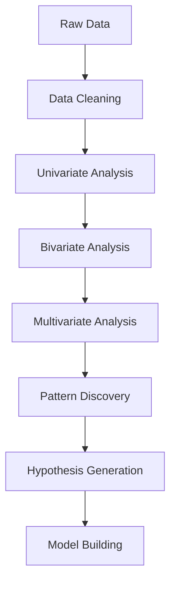

# Chapter 7: Complete Statistical Journey - From EDA to LLMs

[⬅ Previous: Probability Distributions](./06-probability-distributions.md) | [🏠 Home](../README.md) | [➡ Next: Hypothesis Testing](./07-hypothesis-testing.md)

---

## Table of Contents

1. [Foundations of Exploratory Data Analysis](#foundations-of-exploratory-data-analysis)
2. [Statistical Graphics and Visualization](#statistical-graphics-and-visualization)
3. [Mathematical Functions in Machine Learning](#mathematical-functions-in-machine-learning)
4. [Activation Functions: Complete Guide](#activation-functions-complete-guide)
5. [Probability Theory for LLMs](#probability-theory-for-llms)
6. [LLM Probability Frameworks](#llm-probability-frameworks)
7. [Advanced LLM Analysis Functions](#advanced-llm-analysis-functions)
8. [Practical Implementation](#practical-implementation)
9. [Statistical Testing for LLMs](#statistical-testing-for-llms)
10. [References](#references)

---

## Foundations of Exploratory Data Analysis

### What is EDA and Why Does It Matter?

Exploratory Data Analysis (EDA) is not merely a preliminary step but a fundamental approach to understanding data. As emphasized by the National Institute of Standards and Technology, EDA is crucial because "quantitative statistics are not wrong per se, but they are incomplete" - they "focus but also filter; and filtering is exactly what makes the quantitative approach incomplete at best and misleading at worst" .

### The Four Pillars of EDA

EDA operates across four interconnected dimensions :

1. **Distributional Analysis**: Understanding how variables are distributed
2. **Relational Analysis**: Exploring relationships between variables  
3. **Structural Analysis**: Understanding data patterns and missingness
4. **Comparative Analysis**: Comparing across groups or time periods

### The EDA Workflow



### Complete EDA Implementation

```python
import pandas as pd
import numpy as np
import matplotlib.pyplot as plt
import seaborn as sns
from scipy import stats
from sklearn.preprocessing import StandardScaler
from sklearn.decomposition import PCA
import missingno as msno
import warnings
warnings.filterwarnings('ignore')

class ComprehensiveEDA:
    """Complete EDA framework with all essential methods."""
    
    def __init__(self, data, target=None):
        self.data = data
        self.target = target
        self.numeric_cols = data.select_dtypes(include=[np.number]).columns
        self.categorical_cols = data.select_dtypes(include=['object', 'category']).columns
        
    def run_full_eda(self):
        """Execute complete EDA pipeline."""
        print("=" * 60)
        print("COMPREHENSIVE EDA REPORT")
        print("=" * 60)
        
        self.data_overview()
        self.missing_data_analysis()
        self.univariate_analysis()
        self.bivariate_analysis()
        self.multivariate_analysis()
        self.outlier_analysis()
        self.correlation_analysis()
        self.distribution_analysis()
        
    def data_overview(self):
        """Dataset overview and basic statistics."""
        print("\n" + "="*40)
        print("1. DATA OVERVIEW")
        print("="*40)
        
        # Shape and size
        print(f"Dataset Shape: {self.data.shape}")
        print(f"Number of Rows: {self.data.shape[0]}")
        print(f"Number of Columns: {self.data.shape[1]}")
        
        # Column types
        print("\nColumn Types:")
        for dtype in self.data.dtypes.unique():
            cols = self.data.dtypes[self.data.dtypes == dtype].index
            print(f"  {dtype}: {len(cols)} columns")
        
        # Memory usage
        print(f"\nMemory Usage: {self.data.memory_usage(deep=True).sum() / 1024**2:.2f} MB")
        
        # Sample of data
        print("\nFirst 5 rows:")
        print(self.data.head())
        
        # Summary statistics
        print("\nSummary Statistics:")
        print(self.data.describe(include='all'))
        
    def missing_data_analysis(self):
        """Analyze missing data patterns."""
        print("\n" + "="*40)
        print("2. MISSING DATA ANALYSIS")
        print("="*40)
        
        # Missing value counts
        missing = self.data.isnull().sum()
        missing_pct = (missing / len(self.data)) * 100
        
        missing_df = pd.DataFrame({
            'Missing Count': missing,
            'Missing %': missing_pct
        }).sort_values('Missing %', ascending=False)
        
        print(missing_df[missing_df['Missing Count'] > 0])
        
        # Missing data visualization
        fig, axes = plt.subplots(1, 3, figsize=(15, 5))
        
        # Missing matrix
        msno.matrix(self.data, ax=axes[0])
        axes[0].set_title('Missing Data Matrix')
        
        # Missing bar chart
        msno.bar(self.data, ax=axes[1])
        axes[1].set_title('Missing Values Bar Chart')
        
        # Missing heatmap
        msno.heatmap(self.data, ax=axes[2])
        axes[2].set_title('Missing Correlation Heatmap')
        
        plt.tight_layout()
        plt.show()
        
        # Missing data patterns
        missing_patterns = self.data.isnull().sum(axis=1)
        print("\nMissing Value Patterns:")
        print(missing_patterns.value_counts().sort_index())
        
    def univariate_analysis(self):
        """Univariate analysis for all variables."""
        print("\n" + "="*40)
        print("3. UNIVARIATE ANALYSIS")
        print("="*40)
        
        # Numeric variables
        if len(self.numeric_cols) > 0:
            print("\nNumeric Variables:")
            fig, axes = plt.subplots(
                len(self.numeric_cols), 2,
                figsize=(12, 4 * len(self.numeric_cols))
            )
            
            if len(self.numeric_cols) == 1:
                axes = np.array([axes])
            
            for i, col in enumerate(self.numeric_cols):
                # Histogram with KDE
                axes[i, 0].hist(self.data[col].dropna(), bins=30, edgecolor='black', alpha=0.7)
                axes[i, 0].axvline(self.data[col].mean(), color='red', linestyle='--', label='Mean')
                axes[i, 0].axvline(self.data[col].median(), color='green', linestyle='--', label='Median')
                axes[i, 0].set_title(f'Histogram: {col}')
                axes[i, 0].legend()
                
                # Boxplot
                self.data.boxplot(column=col, ax=axes[i, 1])
                axes[i, 1].set_title(f'Boxplot: {col}')
            
            plt.tight_layout()
            plt.show()
            
            # Statistical summaries
            stats_df = self.data[self.numeric_cols].describe()
            stats_df.loc['skew'] = self.data[self.numeric_cols].skew()
            stats_df.loc['kurtosis'] = self.data[self.numeric_cols].kurtosis()
            print(stats_df)
        
        # Categorical variables
        if len(self.categorical_cols) > 0:
            print("\nCategorical Variables:")
            fig, axes = plt.subplots(
                len(self.categorical_cols), 1,
                figsize=(10, 5 * len(self.categorical_cols))
            )
            
            if len(self.categorical_cols) == 1:
                axes = [axes]
            
            for i, col in enumerate(self.categorical_cols):
                self.data[col].value_counts().plot(kind='bar', ax=axes[i])
                axes[i].set_title(f'Bar Chart: {col}')
                axes[i].set_xlabel(col)
                axes[i].set_ylabel('Count')
                
                # Add percentage labels
                for j, (idx, val) in enumerate(self.data[col].value_counts().items()):
                    axes[i].text(j, val + 0.5, f'{val/len(self.data)*100:.1f}%', 
                               ha='center', va='bottom')
            
            plt.tight_layout()
            plt.show()
            
            # Frequency tables
            for col in self.categorical_cols:
                print(f"\n{col}:")
                print(self.data[col].value_counts())
                print(f"Unique values: {self.data[col].nunique()}")
                print(f"Mode: {self.data[col].mode().values}")
    
    def bivariate_analysis(self):
        """Bivariate analysis between variables."""
        print("\n" + "="*40)
        print("4. BIVARIATE ANALYSIS")
        print("="*40)
        
        # Numeric vs Numeric
        if len(self.numeric_cols) > 1:
            n_cols = min(len(self.numeric_cols), 5)  # Limit to avoid too many plots
            
            fig, axes = plt.subplots(n_cols-1, n_cols-1, figsize=(15, 15))
            
            for i in range(1, n_cols):
                for j in range(i):
                    x_col = self.numeric_cols[i]
                    y_col = self.numeric_cols[j]
                    
                    ax = axes[i-1, j]
                    ax.scatter(self.data[x_col], self.data[y_col], alpha=0.5)
                    ax.set_xlabel(x_col)
                    ax.set_ylabel(y_col)
                    
                    # Add regression line
                    z = np.polyfit(self.data[x_col].dropna(), 
                                  self.data[y_col].dropna(), 1)
                    p = np.poly1d(z)
                    x_range = np.linspace(self.data[x_col].min(), self.data[x_col].max(), 100)
                    ax.plot(x_range, p(x_range), "r--", alpha=0.8)
                    
                    # Correlation
                    corr = self.data[x_col].corr(self.data[y_col])
                    ax.set_title(f'Corr: {corr:.2f}')
            
            plt.tight_layout()
            plt.show()
        
        # Categorical vs Numeric
        if len(self.categorical_cols) > 0 and len(self.numeric_cols) > 0:
            fig, axes = plt.subplots(
                min(len(self.categorical_cols), 3), 
                min(len(self.numeric_cols), 3),
                figsize=(15, 15)
            )
            
            if len(self.categorical_cols) == 1 and len(self.numeric_cols) == 1:
                axes = np.array([[axes]])
            
            for i in range(min(len(self.categorical_cols), 3)):
                for j in range(min(len(self.numeric_cols), 3)):
                    if len(self.categorical_cols) > 1 and len(self.numeric_cols) > 1:
                        ax = axes[i, j]
                    elif len(self.categorical_cols) == 1 and len(self.numeric_cols) > 1:
                        ax = axes[j]
                    elif len(self.categorical_cols) > 1 and len(self.numeric_cols) == 1:
                        ax = axes[i]
                    else:
                        ax = axes
                    
                    cat_col = self.categorical_cols[i]
                    num_col = self.numeric_cols[j]
                    
                    # Boxplot
                    self.data.boxplot(column=num_col, by=cat_col, ax=ax)
                    ax.set_title(f'{num_col} by {cat_col}')
                    ax.set_xlabel(cat_col)
                    ax.set_ylabel(num_col)
            
            plt.tight_layout()
            plt.show()
            
            # ANOVA for categorical vs numeric
            for cat_col in self.categorical_cols[:3]:
                for num_col in self.numeric_cols[:3]:
                    groups = [group.dropna() for name, group in 
                             self.data.groupby(cat_col)[num_col]]
                    if len(groups) > 1:
                        f_stat, p_val = stats.f_oneway(*groups)
                        print(f"ANOVA: {num_col} by {cat_col}: F={f_stat:.3f}, p={p_val:.4f}")
    
    def multivariate_analysis(self):
        """Multivariate analysis and dimensionality reduction."""
        print("\n" + "="*40)
        print("5. MULTIVARIATE ANALYSIS")
        print("="*40)
        
        if len(self.numeric_cols) > 1:
            # Pairplot
            if len(self.numeric_cols) <= 5:
                sns.pairplot(self.data[self.numeric_cols].dropna())
                plt.show()
            
            # PCA
            scaled_data = StandardScaler().fit_transform(
                self.data[self.numeric_cols].dropna()
            )
            pca = PCA()
            pca_result = pca.fit_transform(scaled_data)
            
            # Explained variance
            explained_var = pca.explained_variance_ratio_
            cum_var = np.cumsum(explained_var)
            
            fig, axes = plt.subplots(1, 2, figsize=(12, 5))
            
            axes[0].bar(range(len(explained_var)), explained_var)
            axes[0].set_xlabel('Principal Component')
            axes[0].set_ylabel('Explained Variance Ratio')
            axes[0].set_title('Individual Explained Variance')
            
            axes[1].plot(range(len(cum_var)), cum_var, 'bo-')
            axes[1].axhline(y=0.95, color='r', linestyle='--', label='95%')
            axes[1].set_xlabel('Number of Components')
            axes[1].set_ylabel('Cumulative Explained Variance')
            axes[1].set_title('Cumulative Explained Variance')
            axes[1].legend()
            
            plt.tight_layout()
            plt.show()
            
            print(f"Number of components for 95% variance: {np.argmax(cum_var >= 0.95) + 1}")
    
    def outlier_analysis(self):
        """Outlier detection and analysis."""
        print("\n" + "="*40)
        print("6. OUTLIER ANALYSIS")
        print("="*40)
        
        outlier_counts = {}
        
        for col in self.numeric_cols:
            # IQR method
            Q1 = self.data[col].quantile(0.25)
            Q3 = self.data[col].quantile(0.75)
            IQR = Q3 - Q1
            
            lower_bound = Q1 - 1.5 * IQR
            upper_bound = Q3 + 1.5 * IQR
            
            outliers = self.data[
                (self.data[col] < lower_bound) | 
                (self.data[col] > upper_bound)
            ]
            
            outlier_counts[col] = len(outliers)
            
            print(f"{col}:")
            print(f"  Q1: {Q1:.2f}, Q3: {Q3:.2f}, IQR: {IQR:.2f}")
            print(f"  Bounds: [{lower_bound:.2f}, {upper_bound:.2f}]")
            print(f"  Outliers: {len(outliers)} ({len(outliers)/len(self.data)*100:.1f}%)")
            
            # Z-score method
            z_scores = np.abs(stats.zscore(self.data[col].dropna()))
            z_outliers = np.sum(z_scores > 3)
            print(f"  Z-score outliers (>3): {z_outliers} ({z_outliers/len(self.data)*100:.1f}%)")
        
        # Visualize outliers
        if len(self.numeric_cols) > 0:
            fig, axes = plt.subplots(
                min(len(self.numeric_cols), 4), 1,
                figsize=(10, 5 * min(len(self.numeric_cols), 4))
            )
            
            if len(self.numeric_cols) == 1:
                axes = [axes]
            
            for i, col in enumerate(self.numeric_cols[:4]):
                self.data.boxplot(column=col, ax=axes[i])
                axes[i].set_title(f'Boxplot: {col}')
                axes[i].set_ylabel(col)
            
            plt.tight_layout()
            plt.show()
    
    def correlation_analysis(self):
        """Comprehensive correlation analysis."""
        print("\n" + "="*40)
        print("7. CORRELATION ANALYSIS")
        print("="*40)
        
        if len(self.numeric_cols) > 1:
            # Pearson correlation
            pearson_corr = self.data[self.numeric_cols].corr()
            
            # Spearman correlation
            spearman_corr = self.data[self.numeric_cols].corr(method='spearman')
            
            fig, axes = plt.subplots(1, 2, figsize=(15, 6))
            
            # Pearson heatmap
            sns.heatmap(pearson_corr, annot=True, cmap='coolwarm', center=0, 
                       ax=axes[0], fmt='.2f')
            axes[0].set_title('Pearson Correlation')
            
            # Spearman heatmap
            sns.heatmap(spearman_corr, annot=True, cmap='coolwarm', center=0, 
                       ax=axes[1], fmt='.2f')
            axes[1].set_title('Spearman Correlation')
            
            plt.tight_layout()
            plt.show()
            
            # Correlation with target
            if self.target and self.target in self.numeric_cols:
                print(f"\nCorrelation with Target ({self.target}):")
                correlations = pearson_corr[self.target].sort_values(ascending=False)
                print(correlations)
                
                # Top correlated features
                top_features = correlations[1:6].index
                print(f"\nTop 5 correlated features: {top_features.tolist()}")
            
            # Correlation matrix statistics
            print("\nCorrelation Statistics:")
            print(f"Mean correlation: {pearson_corr.values[np.triu_indices_from(pearson_corr, k=1)].mean():.3f}")
            print(f"Max correlation: {pearson_corr.values[np.triu_indices_from(pearson_corr, k=1)].max():.3f}")
            print(f"Min correlation: {pearson_corr.values[np.triu_indices_from(pearson_corr, k=1)].min():.3f}")
            
            # Highly correlated pairs
            high_corr = pearson_corr.values[np.triu_indices_from(pearson_corr, k=1)]
            high_corr_pairs = []
            
            for i in range(len(pearson_corr)):
                for j in range(i+1, len(pearson_corr)):
                    if abs(pearson_corr.iloc[i, j]) > 0.8:
                        high_corr_pairs.append((pearson_corr.index[i], 
                                               pearson_corr.columns[j], 
                                               pearson_corr.iloc[i, j]))
            
            if high_corr_pairs:
                print("\nHigh Correlation Pairs (>0.8):")
                for pair in high_corr_pairs:
                    print(f"  {pair[0]} - {pair[1]}: {pair[2]:.3f}")
    
    def distribution_analysis(self):
        """Distribution analysis and normality tests."""
        print("\n" + "="*40)
        print("8. DISTRIBUTION ANALYSIS")
        print("="*40)
        
        for col in self.numeric_cols:
            data = self.data[col].dropna()
            
            print(f"\n{col}:")
            
            # Normality tests
            # Shapiro-Wilk
            if len(data) < 5000:
                shapiro_stat, shapiro_p = stats.shapiro(data)
                print(f"  Shapiro-Wilk: stat={shapiro_stat:.4f}, p={shapiro_p:.4f}")
            
            # D'Agostino-Pearson
            dp_stat, dp_p = stats.normaltest(data)
            print(f"  D'Agostino-Pearson: stat={dp_stat:.4f}, p={dp_p:.4f}")
            
            # Skewness and Kurtosis
            skew = stats.skew(data)
            kurtosis = stats.kurtosis(data)
            print(f"  Skewness: {skew:.4f}")
            print(f"  Kurtosis: {kurtosis:.4f}")
            
            # Q-Q plot
            fig, axes = plt.subplots(1, 2, figsize=(12, 5))
            
            # Histogram with normal curve
            axes[0].hist(data, bins=30, density=True, alpha=0.7)
            x = np.linspace(data.min(), data.max(), 100)
            axes[0].plot(x, stats.norm.pdf(x, data.mean(), data.std()), 'r-')
            axes[0].set_title(f'Histogram: {col}')
            axes[0].set_xlabel(col)
            axes[0].set_ylabel('Density')
            
            # Q-Q plot
            stats.probplot(data, dist="norm", plot=axes[1])
            axes[1].set_title(f'Q-Q Plot: {col}')
            
            plt.tight_layout()
            plt.show()
            
            # Anderson-Darling test
            anderson_result = stats.anderson(data, dist='norm')
            print(f"  Anderson-Darling: stat={anderson_result.statistic:.4f}")
            print(f"  Critical values: {anderson_result.critical_values}")
            print(f"  Significance levels: {anderson_result.significance_level}")

# Usage
# eda = ComprehensiveEDA(df, target='target_column')
# eda.run_full_eda()
```

---

## Statistical Graphics and Visualization

### Complete Visualization Toolkit

```python
import matplotlib.pyplot as plt
import seaborn as sns
import plotly.express as px
import plotly.graph_objects as go
from plotly.subplots import make_subplots
import numpy as np
import pandas as pd

class AdvancedVisualizer:
    """Advanced visualization toolkit for all types of data."""
    
    def __init__(self, data):
        self.data = data
        self.numeric_cols = data.select_dtypes(include=[np.number]).columns
        self.categorical_cols = data.select_dtypes(include=['object', 'category']).columns
        
    def create_dashboard(self):
        """Create comprehensive dashboard with multiple views."""
        fig = make_subplots(
            rows=3, cols=3,
            subplot_titles=('Histogram', 'Boxplot', 'Violin Plot', 
                          'Scatter Matrix', 'Correlation Heatmap', 'Parallel Coordinates',
                          '3D Scatter', 'Bubble Plot', 'Time Series'),
            specs=[[{'type': 'histogram'}, {'type': 'box'}, {'type': 'violin'}],
                   [{'type': 'scattermatrix'}, {'type': 'heatmap'}, {'type': 'scatter'}],
                   [{'type': 'scatter3d'}, {'type': 'scatter'}, {'type': 'scatter'}]]
        )
        
        # Add traces
        # 1. Histogram
        for col in self.numeric_cols[:3]:
            fig.add_trace(go.Histogram(x=self.data[col], name=col), row=1, col=1)
        
        # 2. Boxplot
        for col in self.numeric_cols[:3]:
            fig.add_trace(go.Box(y=self.data[col], name=col), row=1, col=2)
        
        # 3. Violin Plot
        for col in self.numeric_cols[:3]:
            fig.add_trace(go.Violin(y=self.data[col], name=col), row=1, col=3)
        
        fig.update_layout(height=1200, showlegend=True)
        fig.show()
    
    def interactive_plots(self):
        """Create interactive plots using Plotly."""
        
        # 1. Interactive scatter plot with hover info
        if len(self.numeric_cols) >= 2:
            fig = px.scatter(
                self.data,
                x=self.numeric_cols[0],
                y=self.numeric_cols[1],
                color=self.categorical_cols[0] if len(self.categorical_cols) > 0 else None,
                size=self.numeric_cols[2] if len(self.numeric_cols) > 2 else None,
                hover_data=self.numeric_cols,
                title='Interactive Scatter Plot'
            )
            fig.show()
        
        # 2. Interactive 3D scatter
        if len(self.numeric_cols) >= 3:
            fig = px.scatter_3d(
                self.data,
                x=self.numeric_cols[0],
                y=self.numeric_cols[1],
                z=self.numeric_cols[2],
                color=self.categorical_cols[0] if len(self.categorical_cols) > 0 else None,
                title='3D Scatter Plot'
            )
            fig.show()
        
        # 3. Interactive heatmap
        corr = self.data[self.numeric_cols].corr()
        fig = px.imshow(corr, text_auto=True, aspect="auto",
                        title='Interactive Correlation Heatmap')
        fig.show()
    
    def static_plots(self):
        """Create publication-ready static plots using Matplotlib/Seaborn."""
        
        # 1. Distribution comparison
        if len(self.numeric_cols) > 1:
            fig, axes = plt.subplots(2, 3, figsize=(15, 10))
            
            # Histograms with KDE
            for i, col in enumerate(self.numeric_cols[:6]):
                row, col_idx = i // 3, i % 3
                sns.histplot(self.data[col], kde=True, ax=axes[row, col_idx])
                axes[row, col_idx].set_title(f'Distribution of {col}')
            
            plt.tight_layout()
            plt.show()
        
        # 2. Box plots by category
        if len(self.categorical_cols) > 0 and len(self.numeric_cols) > 0:
            fig, axes = plt.subplots(
                len(self.categorical_cols), 1,
                figsize=(12, 6 * len(self.categorical_cols))
            )
            
            if len(self.categorical_cols) == 1:
                axes = [axes]
            
            for i, cat_col in enumerate(self.categorical_cols[:3]):
                for num_col in self.numeric_cols[:2]:
                    sns.boxplot(x=cat_col, y=num_col, data=self.data, ax=axes[i])
                    axes[i].set_title(f'{num_col} by {cat_col}')
            
            plt.tight_layout()
            plt.show()
        
        # 3. Regression plots
        if len(self.numeric_cols) > 1:
            fig, axes = plt.subplots(2, 2, figsize=(12, 10))
            
            for i in range(min(4, len(self.numeric_cols)-1)):
                row, col = i // 2, i % 2
                sns.regplot(x=self.numeric_cols[i], y=self.numeric_cols[i+1], 
                           data=self.data, ax=axes[row, col])
                axes[row, col].set_title(f'{self.numeric_cols[i]} vs {self.numeric_cols[i+1]}')
            
            plt.tight_layout()
            plt.show()
        
        # 4. Pair plot (for smaller datasets)
        if len(self.numeric_cols) <= 5:
            sns.pairplot(self.data[self.numeric_cols], diag_kind='kde')
            plt.show()
```

### Advanced Statistical Visualizations

```python
def create_statistical_dashboard(data):
    """Create statistical dashboard with multiple plots."""
    
    fig = plt.figure(figsize=(20, 15))
    gs = fig.add_gridspec(3, 3, hspace=0.3, wspace=0.3)
    
    # 1. QQ plots for normality checking
    numeric_cols = data.select_dtypes(include=[np.number]).columns
    for i, col in enumerate(numeric_cols[:3]):
        ax = fig.add_subplot(gs[0, i])
        stats.probplot(data[col].dropna(), dist="norm", plot=ax)
        ax.set_title(f'Q-Q Plot: {col}')
        ax.set_xlabel('Theoretical Quantiles')
        ax.set_ylabel('Sample Quantiles')
    
    # 2. Residual analysis plots
    if len(numeric_cols) > 1:
        # Assume first column is response
        X = data[numeric_cols[1:]].values
        y = data[numeric_cols[0]].values
        
        from sklearn.linear_model import LinearRegression
        model = LinearRegression().fit(X, y)
        residuals = y - model.predict(X)
        
        ax = fig.add_subplot(gs[1, 0])
        ax.scatter(model.predict(X), residuals)
        ax.axhline(y=0, color='r', linestyle='--')
        ax.set_xlabel('Fitted Values')
        ax.set_ylabel('Residuals')
        ax.set_title('Residuals vs Fitted')
        
        ax = fig.add_subplot(gs[1, 1])
        stats.probplot(residuals, dist="norm", plot=ax)
        ax.set_title('Q-Q Plot of Residuals')
        
        ax = fig.add_subplot(gs[1, 2])
        ax.hist(residuals, bins=30, edgecolor='black')
        ax.set_xlabel('Residuals')
        ax.set_ylabel('Frequency')
        ax.set_title('Histogram of Residuals')
    
    # 3. Box-Cox transformation visualization
    from scipy import stats
    for i, col in enumerate(numeric_cols[:3]):
        ax = fig.add_subplot(gs[2, i])
        transformed_data, lambda_val = stats.boxcox(data[col].dropna() + 1e-10)
        ax.hist(transformed_data, bins=30, edgecolor='black')
        ax.set_title(f'Box-Cox Transformed: {col}\nλ = {lambda_val:.3f}')
        ax.set_xlabel(f'Transformed {col}')
        ax.set_ylabel('Frequency')
    
    plt.tight_layout()
    plt.show()
```

---

## Mathematical Functions in Machine Learning

### Complete Mathematical Function Library

```python
import numpy as np
from scipy.special import gamma, beta, erf, erfc

class MathematicalFunctions:
    """Complete library of mathematical functions used in ML."""
    
    @staticmethod
    def linear(x, w, b):
        """Linear function: f(x) = wx + b"""
        return w * x + b
    
    @staticmethod
    def quadratic(x, a, b, c):
        """Quadratic function: f(x) = ax² + bx + c"""
        return a * x**2 + b * x + c
    
    @staticmethod
    def polynomial(x, coefficients):
        """Polynomial function: f(x) = Σ aᵢxⁱ"""
        return np.polyval(coefficients, x)
    
    @staticmethod
    def exponential(x, a, b):
        """Exponential function: f(x) = a * exp(bx)"""
        return a * np.exp(b * x)
    
    @staticmethod
    def logarithmic(x, a, b):
        """Logarithmic function: f(x) = a * log(bx)"""
        return a * np.log(b * x + 1e-10)
    
    @staticmethod
    def power(x, a, b):
        """Power function: f(x) = a * x^b"""
        return a * np.power(x, b)
    
    @staticmethod
    def sigmoid(x, a=1, b=0):
        """Sigmoid function: f(x) = 1 / (1 + exp(-a(x-b)))"""
        return 1 / (1 + np.exp(-a * (x - b)))
    
    @staticmethod
    def gaussian(x, mu=0, sigma=1):
        """Gaussian function: f(x) = exp(-(x-mu)²/(2σ²))"""
        return np.exp(-((x - mu)**2) / (2 * sigma**2))
    
    @staticmethod
    def softplus(x, beta=1):
        """Softplus function: f(x) = (1/β) * log(1 + exp(βx))"""
        return (1/beta) * np.log(1 + np.exp(beta * x))
    
    @staticmethod
    def swish(x, beta=1):
        """Swish function: f(x) = x * sigmoid(βx)"""
        return x * MathematicalFunctions.sigmoid(beta * x)
    
    @staticmethod
    def gelu(x):
        """GELU function: f(x) = 0.5 * x * (1 + erf(x/√2))"""
        return 0.5 * x * (1 + erf(x / np.sqrt(2)))
    
    @staticmethod
    def mish(x):
        """Mish function: f(x) = x * tanh(softplus(x))"""
        return x * np.tanh(MathematicalFunctions.softplus(x))
    
    @staticmethod
    def silu(x):
        """SiLU (Swish) function: f(x) = x * sigmoid(x)"""
        return x * MathematicalFunctions.sigmoid(x)
    
    @staticmethod
    def relu(x):
        """ReLU function: f(x) = max(0, x)"""
        return np.maximum(0, x)
    
    @staticmethod
    def leaky_relu(x, alpha=0.01):
        """Leaky ReLU: f(x) = max(αx, x)"""
        return np.where(x > 0, x, alpha * x)
    
    @staticmethod
    def elu(x, alpha=1.0):
        """ELU function: f(x) = x if x > 0 else α(exp(x)-1)"""
        return np.where(x > 0, x, alpha * (np.exp(x) - 1))
    
    @staticmethod
    def softmax(x):
        """Softmax function: f_i(x) = exp(x_i) / Σ exp(x_j)"""
        exp_x = np.exp(x - np.max(x))
        return exp_x / exp_x.sum(axis=-1, keepdims=True)
    
    @staticmethod
    def log_softmax(x):
        """Log-Softmax: log(softmax(x))"""
        return x - np.log(np.sum(np.exp(x - np.max(x)), axis=-1, keepdims=True))
    
    @staticmethod
    def tanh(x):
        """Hyperbolic tangent: tanh(x)"""
        return np.tanh(x)
    
    @staticmethod
    def arctan(x):
        """Arctangent: arctan(x)"""
        return np.arctan(x)
    
    @staticmethod
    def sine(x, a=1, b=1):
        """Sine function: a * sin(bx)"""
        return a * np.sin(b * x)
    
    @staticmethod
    def cosine(x, a=1, b=1):
        """Cosine function: a * cos(bx)"""
        return a * np.cos(b * x)
    
    @staticmethod
    def sinc(x):
        """Sinc function: sin(x)/x"""
        return np.sinc(x / np.pi)

# Visualization of all functions
def visualize_math_functions():
    """Visualize all mathematical functions."""
    x = np.linspace(-5, 5, 1000)
    functions = {
        'Linear': lambda x: 2*x + 1,
        'Quadratic': lambda x: x**2 - 2*x + 1,
        'Cubic': lambda x: x**3 - 3*x,
        'Exponential': lambda x: np.exp(x),
        'Logarithmic': lambda x: np.log(x + 6),
        'Sigmoid': lambda x: 1/(1+np.exp(-x)),
        'Gaussian': lambda x: np.exp(-x**2/2),
        'Tanh': np.tanh,
        'ReLU': lambda x: np.maximum(0, x),
        'Softplus': lambda x: np.log(1+np.exp(x)),
        'Swish': lambda x: x/(1+np.exp(-x)),
        'GELU': MathematicalFunctions.gelu,
        'Mish': MathematicalFunctions.mish
    }
    
    fig, axes = plt.subplots(4, 4, figsize=(16, 16))
    
    for idx, (name, func) in enumerate(functions.items()):
        row, col = idx // 4, idx % 4
        y = func(x)
        
        axes[row, col].plot(x, y, linewidth=2)
        axes[row, col].axhline(0, color='black', linestyle='--', alpha=0.3)
        axes[row, col].axvline(0, color='black', linestyle='--', alpha=0.3)
        axes[row, col].set_title(name)
        axes[row, col].grid(alpha=0.3)
        axes[row, col].set_ylim([-3, 3])
    
    plt.tight_layout()
    plt.show()
```

---

## Activation Functions: Complete Guide

### Comprehensive Activation Function Library

```python
import torch
import torch.nn as nn
import torch.nn.functional as F
import numpy as np

class ActivationFunctions:
    """Complete collection of activation functions with implementations."""
    
    # ========== SIGMOID FAMILY ==========
    
    @staticmethod
    def sigmoid(x):
        """Standard sigmoid: 1/(1+exp(-x))
        Range: (0,1)
        Gradient: f'(x) = f(x)(1-f(x))
        """
        return 1 / (1 + np.exp(-np.clip(x, -500, 500)))
    
    @staticmethod
    def sigmoid_torch(x):
        """PyTorch implementation"""
        return torch.sigmoid(x)
    
    @staticmethod
    def hard_sigmoid(x):
        """Hard sigmoid: faster approximation
        Range: (0,1)
        """
        return np.clip(0.2 * x + 0.5, 0, 1)
    
    # ========== TANH FAMILY ==========
    
    @staticmethod
    def tanh(x):
        """Hyperbolic tangent: (exp(x)-exp(-x))/(exp(x)+exp(-x))
        Range: (-1,1)
        Gradient: f'(x) = 1 - f(x)²
        """
        return np.tanh(x)
    
    @staticmethod
    def tanh_shrink(x):
        """Tanh shrink: x - tanh(x)"""
        return x - np.tanh(x)
    
    @staticmethod
    def hard_tanh(x):
        """Hard tanh: clip(x, -1, 1)"""
        return np.clip(x, -1, 1)
    
    @staticmethod
    def soft_sign(x):
        """Soft sign: x/(1+|x|)
        Range: (-1,1)
        """
        return x / (1 + np.abs(x))
    
    # ========== RELU FAMILY ==========
    
    @staticmethod
    def relu(x):
        """Rectified Linear Unit: max(0, x)
        Range: [0, ∞)
        Gradient: 1 for x>0, 0 for x<0
        """
        return np.maximum(0, x)
    
    @staticmethod
    def relu_torch(x):
        """PyTorch ReLU"""
        return F.relu(x)
    
    @staticmethod
    def leaky_relu(x, alpha=0.01):
        """Leaky ReLU: x if x>0 else αx
        Range: (-∞, ∞)
        Prevents dying ReLU problem
        """
        return np.where(x > 0, x, alpha * x)
    
    @staticmethod
    def parametric_relu(x, alpha=0.01):
        """Parametric ReLU: learnable α"""
        return np.where(x > 0, x, alpha * x)
    
    @staticmethod
    def randomized_relu(x, alpha=0.01, max_alpha=0.1):
        """Randomized ReLU: random α during training"""
        alpha = np.random.uniform(alpha, max_alpha)
        return np.where(x > 0, x, alpha * x)
    
    @staticmethod
    def elu(x, alpha=1.0):
        """Exponential Linear Unit: x if x>0 else α(exp(x)-1)
        Range: (-∞, ∞)
        Self-normalizing property
        """
        return np.where(x > 0, x, alpha * (np.exp(x) - 1))
    
    @staticmethod
    def selu(x):
        """Scaled ELU: self-normalizing
        λ * (x if x>0 else α(exp(x)-1))
        Where α≈1.6733, λ≈1.0507
        """
        alpha = 1.6732632423543778
        scale = 1.0507009873554805
        return scale * np.where(x > 0, x, alpha * (np.exp(x) - 1))
    
    @staticmethod
    def celu(x, alpha=1.0):
        """Continuously differentiable ELU"""
        return np.where(x > 0, x, alpha * (np.exp(x / alpha) - 1))
    
    # ========== SOFTMAX FAMILY ==========
    
    @staticmethod
    def softmax(x, axis=-1):
        """Softmax: exp(x_i)/Σ exp(x_j)
        Range: (0,1), sums to 1
        Used for multi-class classification
        """
        exp_x = np.exp(x - np.max(x, axis=axis, keepdims=True))
        return exp_x / np.sum(exp_x, axis=axis, keepdims=True)
    
    @staticmethod
    def log_softmax(x, axis=-1):
        """Log Softmax: log(softmax(x))"""
        return x - np.log(np.sum(np.exp(x - np.max(x, axis=axis, keepdims=True)), 
                                 axis=axis, keepdims=True))
    
    @staticmethod
    def softmax_2d(x):
        """Softmax for 2D inputs"""
        exp_x = np.exp(x - np.max(x))
        return exp_x / np.sum(exp_x)
    
    # ========== SMOOTH RELU FAMILY ==========
    
    @staticmethod
    def softplus(x, beta=1.0):
        """Softplus: (1/β) * log(1 + exp(βx))
        Smooth approximation of ReLU
        """
        return (1/beta) * np.log(1 + np.exp(beta * x))
    
    @staticmethod
    def swish(x, beta=1.0):
        """Swish (SiLU): x * sigmoid(βx)
        Smooth, non-monotonic
        """
        return x * ActivationFunctions.sigmoid(beta * x)
    
    @staticmethod
    def gelu(x):
        """Gaussian Error Linear Unit
        0.5 * x * (1 + erf(x/√2))
        """
        return 0.5 * x * (1 + erf(x / np.sqrt(2)))
    
    @staticmethod
    def gelu_approx(x):
        """Approximate GELU: 0.5x(1+tanh(√(2/π)(x+0.044715x³)))"""
        return 0.5 * x * (1 + np.tanh(np.sqrt(2/np.pi) * (x + 0.044715 * x**3)))
    
    @staticmethod
    def mish(x):
        """Mish: x * tanh(softplus(x))
        Self-regularizing, smooth
        """
        return x * np.tanh(ActivationFunctions.softplus(x))
    
    @staticmethod
    def silu(x):
        """SiLU (Swish): x * sigmoid(x)"""
        return x * ActivationFunctions.sigmoid(x)
    
    # ========== OTHER ACTIVATIONS ==========
    
    @staticmethod
    def maxout(x1, x2):
        """Maxout: max(x1, x2)
        Piecewise linear approximation
        """
        return np.maximum(x1, x2)
    
    @staticmethod
    def maxpool(x, kernel_size=2):
        """Max pooling"""
        from scipy.ndimage import maximum_filter
        return maximum_filter(x, size=kernel_size)
    
    @staticmethod
    def minpool(x, kernel_size=2):
        """Min pooling"""
        from scipy.ndimage import minimum_filter
        return minimum_filter(x, size=kernel_size)
    
    @staticmethod
    def l1_penalty(x):
        """L1 penalty: |x|"""
        return np.abs(x)
    
    @staticmethod
    def l2_penalty(x):
        """L2 penalty: x²"""
        return x**2
    
    @staticmethod
    def elish(x):
        """ELiSH: x if x>0 else (exp(x)-1)/(1+exp(-x))
        Combination of ReLU and sigmoid
        """
        return np.where(x > 0, x, (np.exp(x) - 1) / (1 + np.exp(-x)))
    
    @staticmethod
    def hard_swish(x):
        """Hard Swish: x * ReLU6(x+3)/6
        Efficient approximation of Swish
        """
        return x * np.clip((x + 3) / 6, 0, 1)

class PyTorchActivationWrapper:
    """PyTorch wrapper for custom activation functions."""
    
    @staticmethod
    def custom_sigmoid():
        return nn.Sigmoid()
    
    @staticmethod
    def custom_relu():
        return nn.ReLU()
    
    @staticmethod
    def custom_leaky_relu(alpha=0.01):
        return nn.LeakyReLU(alpha)
    
    @staticmethod
    def custom_elu(alpha=1.0):
        return nn.ELU(alpha)
    
    @staticmethod
    def custom_selu():
        return nn.SELU()
    
    @staticmethod
    def custom_softplus(beta=1.0):
        return nn.Softplus(beta=beta)
    
    @staticmethod
    def custom_swish():
        class Swish(nn.Module):
            def forward(self, x):
                return x * torch.sigmoid(x)
        return Swish()
    
    @staticmethod
    def custom_gelu():
        return nn.GELU()
    
    @staticmethod
    def custom_mish():
        class Mish(nn.Module):
            def forward(self, x):
                return x * torch.tanh(F.softplus(x))
        return Mish()

def compare_activations():
    """Compare all activation functions visually."""
    x = np.linspace(-5, 5, 1000)
    
    activations = {
        'Sigmoid': ActivationFunctions.sigmoid,
        'Tanh': ActivationFunctions.tanh,
        'ReLU': ActivationFunctions.relu,
        'Leaky ReLU': lambda x: ActivationFunctions.leaky_relu(x, 0.01),
        'ELU': lambda x: ActivationFunctions.elu(x, 1.0),
        'SELU': ActivationFunctions.selu,
        'Softplus': ActivationFunctions.softplus,
        'Swish': ActivationFunctions.swish,
        'GELU': ActivationFunctions.gelu,
        'Mish': ActivationFunctions.mish,
        'Hard Tanh': ActivationFunctions.hard_tanh,
        'Hard Sigmoid': ActivationFunctions.hard_sigmoid
    }
    
    fig, axes = plt.subplots(3, 4, figsize=(16, 12))
    
    for idx, (name, func) in enumerate(activations.items()):
        row, col = idx // 4, idx % 4
        y = func(x)
        
        axes[row, col].plot(x, y, linewidth=2)
        axes[row, col].axhline(0, color='black', linestyle='--', alpha=0.3)
        axes[row, col].axvline(0, color='black', linestyle='--', alpha=0.3)
        axes[row, col].set_title(name)
        axes[row, col].grid(alpha=0.3)
        axes[row, col].set_ylim([-3, 3])
        axes[row, col].set_xlim([-5, 5])
    
    plt.tight_layout()
    plt.show()
    
    # Compare gradients
    fig, axes = plt.subplots(3, 4, figsize=(16, 12))
    
    for idx, (name, func) in enumerate(activations.items()):
        row, col = idx // 4, idx % 4
        y = func(x)
        grad = np.gradient(y, x[1] - x[0])
        
        axes[row, col].plot(x, grad, linewidth=2)
        axes[row, col].axhline(0, color='black', linestyle='--', alpha=0.3)
        axes[row, col].set_title(f'{name} Gradient')
        axes[row, col].grid(alpha=0.3)
        axes[row, col].set_ylim([-1, 2])
        axes[row, col].set_xlim([-5, 5])
    
    plt.tight_layout()
    plt.show()
```

---

## Probability Theory for LLMs

### Complete Probability Framework

```python
import numpy as np
from scipy.special import softmax, logsumexp
from scipy.stats import entropy, ks_2samp, wasserstein_distance
import torch
import torch.nn.functional as F

class LLMProbabilityFramework:
    """Complete probability framework for large language models."""
    
    def __init__(self, vocab_size):
        self.vocab_size = vocab_size
        
    # ========== CORE PROBABILITY FUNCTIONS ==========
    
    def token_probability(self, logits, token_id, temperature=1.0):
        """Compute probability of a specific token.
        
        P(token_i) = softmax(logits/temperature)[i]
        """
        scaled_logits = logits / temperature
        probs = softmax(scaled_logits)
        return probs[token_id]
    
    def sequence_probability(self, logits_sequence):
        """Compute probability of a sequence.
        
        P(w₁,...,wₙ) = ∏_{t=1}ⁿ P(w_t | w_{<t})
        """
        probs = []
        for t, logits in enumerate(logits_sequence):
            prob = softmax(logits)[t]  # token at position t
            probs.append(prob)
        return np.prod(probs)
    
    def sequence_log_probability(self, logits_sequence):
        """Compute log probability of a sequence.
        
        log P(w₁,...,wₙ) = Σ log P(w_t | w_{<t})
        """
        log_probs = []
        for t, logits in enumerate(logits_sequence):
            log_prob = log_softmax(logits)[t]
            log_probs.append(log_prob)
        return sum(log_probs)
    
    def perplexity(self, logits_sequence):
        """Compute perplexity of a sequence.
        
        Perplexity = exp(-(1/N) * Σ log P(w_t | w_{<t}))
        """
        log_probs = self.sequence_log_probability(logits_sequence)
        N = len(logits_sequence)
        return np.exp(-log_probs / N)
    
    def cross_entropy(self, logits, targets):
        """Compute cross entropy loss.
        
        H(p,q) = -Σ p(x) log q(x)
        """
        log_probs = F.log_softmax(torch.tensor(logits), dim=-1)
        target_probs = F.one_hot(torch.tensor(targets), num_classes=self.vocab_size)
        return -torch.sum(target_probs * log_probs) / len(targets)
    
    # ========== PROBABILITY CONSISTENCY ==========
    
    def check_consistency(self, logits_forward, logits_backward):
        """Check if probabilities are consistent across factorizations.
        
        The chain rule of probability requires:
        P(X₁,...,Xₙ) = P(X₁) * P(X₂|X₁) * ... * P(Xₙ|X₁,...,Xₙ₋₁)
        = P(Xₙ) * P(Xₙ₋₁|Xₙ) * ... * P(X₁|X₂,...,Xₙ)
        """
        # Forward factorization
        P_forward = np.prod([softmax(logits)[i] for i, logits in enumerate(logits_forward)])
        
        # Backward factorization (reverse order)
        P_backward = np.prod([softmax(logits)[i] for i, logits in enumerate(logits_backward[::-1])])
        
        consistency_ratio = P_forward / (P_backward + 1e-10)
        return {
            'P_forward': P_forward,
            'P_backward': P_backward,
            'consistency_ratio': consistency_ratio,
            'log_diff': np.log(P_forward) - np.log(P_backward)
        }
    
    def compute_probability_discrepancy(self, model, text, tokenizer):
        """Compute discrepancy between forward and backward probabilities."""
        # Forward
        tokens = tokenizer.encode(text, return_tensors='pt')
        with torch.no_grad():
            outputs = model(tokens)
            logits = outputs.logits
            log_probs_forward = F.log_softmax(logits[0], dim=-1)
            forward_prob = torch.exp(log_probs_forward[tokens[0]]).mean().item()
        
        # Backward
        reversed_tokens = torch.flip(tokens, dims=[1])
        with torch.no_grad():
            outputs = model(reversed_tokens)
            logits = outputs.logits
            log_probs_backward = F.log_softmax(logits[0], dim=-1)
            backward_prob = torch.exp(log_probs_backward[reversed_tokens[0]]).mean().item()
        
        return {
            'forward_prob': forward_prob,
            'backward_prob': backward_prob,
            'discrepancy': abs(forward_prob - backward_prob),
            'ratio': forward_prob / (backward_prob + 1e-10)
        }
    
    # ========== DISTRIBUTION ESTIMATION ==========
    
    def estimate_source_distribution(self, samples):
        """Estimate source distribution from samples.
        
        Using empirical distribution:
        P̂(x) = (1/N) * Σ I(x_i = x)
        """
        counts = np.bincount(samples, minlength=self.vocab_size)
        return counts / len(samples)
    
    def estimate_target_distribution(self, samples, smoothing=0.01):
        """Estimate target distribution with Laplace smoothing.
        
        P̂(x) = (count(x) + α) / (N + α*V)
        """
        counts = np.bincount(samples, minlength=self.vocab_size)
        smoothed = (counts + smoothing) / (len(samples) + smoothing * self.vocab_size)
        return smoothed
    
    def kl_divergence(self, p, q):
        """KL divergence: D_KL(P||Q) = Σ p(x) log(p(x)/q(x))"""
        p = np.array(p) + 1e-10
        q = np.array(q) + 1e-10
        return np.sum(p * np.log(p / q))
    
    def js_divergence(self, p, q):
        """Jensen-Shannon divergence.
        
        D_JS(P||Q) = 0.5 * D_KL(P||M) + 0.5 * D_KL(Q||M)
        where M = 0.5 * (P + Q)
        """
        p = np.array(p) + 1e-10
        q = np.array(q) + 1e-10
        m = 0.5 * (p + q)
        return 0.5 * self.kl_divergence(p, m) + 0.5 * self.kl_divergence(q, m)
    
    def wasserstein_distance(self, p, q):
        """Wasserstein distance between distributions."""
        return wasserstein_distance(p, q)
    
    def kolmogorov_smirnov(self, sample1, sample2):
        """Kolmogorov-Smirnov test for distribution equality."""
        return ks_2samp(sample1, sample2)
    
    # ========== TRANSFORMER ATTENTION AS PROBABILITY ==========
    
    def attention_probabilities(self, query, key, value, temperature=1.0):
        """Compute attention probabilities.
        
        Attention(Q,K,V) = softmax(QK^T / √d) V
        """
        d_k = query.shape[-1]
        scores = np.dot(query, key.T) / np.sqrt(d_k)
        scores = scores / temperature
        attention_weights = softmax(scores, axis=-1)
        output = np.dot(attention_weights, value)
        return attention_weights, output
    
    def attention_entropy(self, attention_weights):
        """Compute entropy of attention weights.
        
        H(A) = -Σ A_i log A_i
        Higher entropy = more diffuse attention
        """
        return entropy(attention_weights.flatten(), base=2)
    
    def attention_concentration(self, attention_weights):
        """Compute concentration of attention weights.
        
        Higher concentration = more focused attention
        """
        max_weight = np.max(attention_weights)
        min_weight = np.min(attention_weights)
        return max_weight - min_weight
    
    # ========== FREE PROBABILITY THEORY ==========
    
    def free_convolution(self, mu_x, mu_y):
        """Free additive convolution of two distributions."""
        # Simplified approximation for demonstration
        # In practice, this requires computing R-transforms
        return np.convolve(mu_x, mu_y, mode='full')
    
    def r_transform(self, distribution):
        """Compute R-transform (simplified)."""
        # R-transform is the inverse of the Cauchy transform
        # Simplified version for demonstration
        return np.fft.fft(distribution)
    
    def cauchy_transform(self, distribution, z):
        """Compute Cauchy transform.
        
        G(z) = ∫ (1/(z-x)) dμ(x)
        """
        return np.mean(1 / (z - distribution))
    
    def free_probability_consistency(self, token_operators):
        """Check consistency in free probability framework.
        
        In free probability, token representations should be
        freely independent for consistent probability estimates.
        """
        n_tokens = len(token_operators)
        consistencies = []
        
        for i in range(n_tokens):
            for j in range(i+1, n_tokens):
                # Check if operators are freely independent
                # Simplified: check if traces factorize
                trace_ij = np.trace(token_operators[i] @ token_operators[j])
                trace_i = np.trace(token_operators[i])
                trace_j = np.trace(token_operators[j])
                
                # Free independence implies: tr(XY) = tr(X)tr(Y) for centered variables
                center_i = token_operators[i] - trace_i * np.eye(len(token_operators[i])) / len(token_operators[i])
                center_j = token_operators[j] - trace_j * np.eye(len(token_operators[j])) / len(token_operators[j])
                
                consistency = np.trace(center_i @ center_j) / (len(token_operators[i]) * len(token_operators[j]))
                consistencies.append(consistency)
        
        return consistencies
    
    # ========== SAMPLING STRATEGIES ==========
    
    def greedy_sampling(self, logits):
        """Greedy sampling: choose token with highest probability."""
        return np.argmax(logits)
    
    def temperature_sampling(self, logits, temperature=1.0):
        """Temperature sampling: adjust probability distribution.
        
        Higher temperature → more uniform (more diverse)
        Lower temperature → more peaked (more deterministic)
        """
        scaled_logits = logits / temperature
        probs = softmax(scaled_logits)
        return np.random.choice(len(probs), p=probs)
    
    def top_k_sampling(self, logits, k=50):
        """Top-k sampling: sample only from top k tokens."""
        indices = np.argsort(logits)[-k:]
        top_k_logits = logits[indices]
        probs = softmax(top_k_logits)
        selected_idx = np.random.choice(len(probs), p=probs)
        return indices[selected_idx]
    
    def top_p_sampling(self, logits, p=0.9):
        """Top-p (nucleus) sampling: sample from smallest set with cumulative p."""
        sorted_indices = np.argsort(logits)[::-1]
        sorted_logits = logits[sorted_indices]
        probs = softmax(sorted_logits)
        cum_probs = np.cumsum(probs)
        
        # Find cutoff where cumulative probability exceeds p
        cutoff_idx = np.searchsorted(cum_probs, p)
        if cutoff_idx == 0:
            cutoff_idx = 1
        
        selected_indices = sorted_indices[:cutoff_idx + 1]
        selected_probs = probs[:cutoff_idx + 1]
        selected_probs = selected_probs / np.sum(selected_probs)
        
        selected_idx = np.random.choice(len(selected_probs), p=selected_probs)
        return selected_indices[selected_idx]
    
    def beam_search(self, logits_sequence, beam_width=5, max_length=50):
        """Beam search for text generation."""
        # Initialize beams
        beams = [([], 0.0)]
        
        for _ in range(max_length):
            new_beams = []
            for tokens, score in beams:
                if len(tokens) > 0:
                    logits = logits_sequence[len(tokens) - 1]
                else:
                    logits = logits_sequence[0]
                
                probs = softmax(logits)
                top_indices = np.argsort(probs)[-beam_width:]
                
                for idx in top_indices:
                    new_score = score + np.log(probs[idx] + 1e-10)
                    new_beams.append((tokens + [idx], new_score))
            
            # Keep top beam_width beams
            beams = sorted(new_beams, key=lambda x: x[1], reverse=True)[:beam_width]
        
        return beams[0][0]  # Return best sequence
```

---

## Advanced LLM Analysis Functions

```python
class AdvancedLLMAnalysis:
    """Advanced analysis functions for large language models."""
    
    def __init__(self, model, tokenizer):
        self.model = model
        self.tokenizer = tokenizer
        self.device = torch.device('cuda' if torch.cuda.is_available() else 'cpu')
        
    def probability_consistency_analysis(self, texts):
        """Comprehensive probability consistency analysis."""
        results = []
        
        for text in texts:
            # Tokenize
            tokens = self.tokenizer.encode(text, return_tensors='pt').to(self.device)
            
            # Forward pass
            with torch.no_grad():
                outputs = self.model(tokens)
                logits = outputs.logits
                
                # Forward probabilities
                log_probs_forward = F.log_softmax(logits[0], dim=-1)
                forward_prob = torch.exp(log_probs_forward[tokens[0]]).mean().item()
                
                # Get attention patterns
                outputs_attn = self.model(tokens, output_attentions=True)
                attention = outputs_attn.attentions[-1]  # Last layer
            
            # Backward pass (reverse tokens)
            reversed_tokens = torch.flip(tokens, dims=[1])
            with torch.no_grad():
                outputs_rev = self.model(reversed_tokens)
                logits_rev = outputs_rev.logits
                log_probs_backward = F.log_softmax(logits_rev[0], dim=-1)
                backward_prob = torch.exp(log_probs_backward[reversed_tokens[0]]).mean().item()
            
            # Compute metrics
            results.append({
                'text': text[:100] + '...' if len(text) > 100 else text,
                'forward_prob': forward_prob,
                'backward_prob': backward_prob,
                'probability_ratio': forward_prob / (backward_prob + 1e-10),
                'log_difference': np.log(forward_prob + 1e-10) - np.log(backward_prob + 1e-10),
                'attention_entropy': self.compute_attention_entropy(attention),
                'attention_concentration': self.compute_attention_concentration(attention)
            })
        
        return pd.DataFrame(results)
    
    def compute_attention_entropy(self, attention_tensor):
        """Compute entropy of attention distribution."""
        attention_np = attention_tensor.cpu().numpy()
        attention_flat = attention_np.flatten()
        attention_flat = attention_flat / (np.sum(attention_flat) + 1e-10)
        return entropy(attention_flat, base=2)
    
    def compute_attention_concentration(self, attention_tensor):
        """Compute concentration of attention."""
        attention_np = attention_tensor.cpu().numpy()
        return np.std(attention_np) / np.mean(attention_np + 1e-10)
    
    def positional_bias_analysis(self, tokens):
        """Analyze positional bias in attention."""
        with torch.no_grad():
            outputs = self.model(tokens, output_attentions=True)
            attention = outputs.attentions[-1].cpu().numpy()
            
            # Average over batches and heads
            avg_attention = attention.mean(axis=(0, 1))
            
            # Positional bias: average attention to each position
            position_bias = avg_attention.mean(axis=0)
            position_bias = position_bias / (position_bias.sum() + 1e-10)
            
            # Check if early positions get more attention
            early_bias = position_bias[:len(position_bias)//3].sum()
            late_bias = position_bias[2*len(position_bias)//3:].sum()
            
            return {
                'position_bias': position_bias,
                'early_bias': early_bias,
                'late_bias': late_bias,
                'bias_ratio': early_bias / (late_bias + 1e-10)
            }
    
    def attention_head_analysis(self, tokens):
        """Analyze individual attention heads."""
        with torch.no_grad():
            outputs = self.model(tokens, output_attentions=True)
            attention = outputs.attentions[-1].cpu().numpy()
            
            results = []
            for head in range(attention.shape[1]):
                head_attention = attention[0, head, :, :]
                
                # Entropy of this head
                head_entropy = entropy(head_attention.flatten(), base=2)
                
                # Maximum attention
                max_attn = np.max(head_attention)
                
                # Sparsity
                sparsity = 1 - (np.sum(head_attention > 0.01) / head_attention.size)
                
                results.append({
                    'head': head,
                    'entropy': head_entropy,
                    'max_attention': max_attn,
                    'sparsity': sparsity
                })
            
            return pd.DataFrame(results)
    
    def uncertainty_estimation(self, text, num_samples=10):
        """Estimate uncertainty in model predictions."""
        tokens = self.tokenizer.encode(text, return_tensors='pt').to(self.device)
        
        # Dropout-based uncertainty (MC Dropout)
        self.model.train()  # Enable dropout
        predictions = []
        
        for _ in range(num_samples):
            with torch.no_grad():
                outputs = self.model(tokens)
                logits = outputs.logits
                probs = F.softmax(logits[0, -1, :], dim=-1)
                predictions.append(probs.cpu().numpy())
        
        self.model.eval()  # Disable dropout
        
        # Compute uncertainty metrics
        pred_array = np.array(predictions)
        mean_probs = pred_array.mean(axis=0)
        std_probs = pred_array.std(axis=0)
        
        # Entropy of mean prediction
        pred_entropy = entropy(mean_probs, base=2)
        
        # Mutual information (Epistemic uncertainty)
        mi = pred_entropy - np.mean([entropy(p, base=2) for p in predictions])
        
        return {
            'mean_probabilities': mean_probs,
            'std_probabilities': std_probs,
            'prediction_entropy': pred_entropy,
            'mutual_information': mi,
            'aleatoric_uncertainty': np.mean([entropy(p, base=2) for p in predictions]),
            'epistemic_uncertainty': mi
        }
    
    def gradient_analysis(self, text):
        """Analyze gradients for interpretability."""
        tokens = self.tokenizer.encode(text, return_tensors='pt').to(self.device)
        
        # Enable gradients
        tokens.requires_grad_(True)
        
        # Forward pass
        outputs = self.model(tokens)
        loss = outputs.loss
        
        # Backward pass
        loss.backward()
        
        # Get gradients
        grad = tokens.grad.cpu().numpy()
        
        return {
            'gradients': grad,
            'gradient_norm': np.linalg.norm(grad),
            'gradient_mean': np.mean(grad),
            'gradient_std': np.std(grad)
        }
    
    def embedding_analysis(self, tokens):
        """Analyze token embeddings."""
        with torch.no_grad():
            # Get embeddings
            embeddings = self.model.get_input_embeddings()
            token_embeddings = embeddings(tokens)
            
            # Compute metrics
            embeddings_np = token_embeddings.cpu().numpy()
            
            # Pairwise similarity
            from sklearn.metrics.pairwise import cosine_similarity
            similarities = cosine_similarity(embeddings_np[0])
            
            # Average similarity to nearby tokens
            avg_sim = np.mean(similarities[np.triu_indices_from(similarities, k=1)])
            
            return {
                'embedding_dim': embeddings_np.shape,
                'avg_similarity': avg_sim,
                'similarity_std': np.std(similarities[np.triu_indices_from(similarities, k=1)]),
                'embedding_norm': np.linalg.norm(embeddings_np, axis=-1).mean()
            }
```

---

## Practical Implementation: Complete Pipeline

```python
class CompleteLLMPipeline:
    """Complete pipeline from EDA to LLM training and analysis."""
    
    def __init__(self, data_path=None, model_name='gpt2'):
        self.data_path = data_path
        self.model_name = model_name
        self.data = None
        self.model = None
        self.tokenizer = None
        self.eda = None
        self.llm_analysis = None
        
    def load_data(self):
        """Load and prepare data."""
        if self.data_path:
            self.data = pd.read_csv(self.data_path)
        else:
            # Generate sample data for demonstration
            self.data = self._generate_sample_data()
        
        self.eda = ComprehensiveEDA(self.data)
        return self.data
    
    def _generate_sample_data(self):
        """Generate sample dataset for demonstration."""
        np.random.seed(42)
        n = 1000
        
        data = pd.DataFrame({
            'text': [f'Sample text {i}' for i in range(n)],
            'numeric_1': np.random.normal(10, 2, n),
            'numeric_2': np.random.normal(5, 1, n),
            'numeric_3': np.random.exponential(2, n),
            'category_1': np.random.choice(['A', 'B', 'C'], n),
            'category_2': np.random.choice(['X', 'Y', 'Z'], n),
            'target': np.random.binomial(1, 0.3, n)
        })
        
        return data
    
    def run_eda(self):
        """Run comprehensive EDA."""
        if self.eda:
            self.eda.run_full_eda()
    
    def load_llm(self):
        """Load pretrained LLM."""
        from transformers import AutoModelForCausalLM, AutoTokenizer
        
        self.tokenizer = AutoTokenizer.from_pretrained(self.model_name)
        self.model = AutoModelForCausalLM.from_pretrained(self.model_name)
        
        if self.tokenizer.pad_token is None:
            self.tokenizer.pad_token = self.tokenizer.eos_token
            
        self.llm_analysis = AdvancedLLMAnalysis(self.model, self.tokenizer)
        
        return self.model, self.tokenizer
    
    def train_llm(self, text_column, epochs=5):
        """Fine-tune LLM on custom data."""
        # Prepare data
        texts = self.data[text_column].tolist()
        tokens = self.tokenizer(
            texts,
            padding=True,
            truncation=True,
            return_tensors='pt'
        )
        
        # Create dataset
        class TextDataset(torch.utils.data.Dataset):
            def __init__(self, input_ids):
                self.input_ids = input_ids
                
            def __len__(self):
                return len(self.input_ids)
                
            def __getitem__(self, idx):
                return self.input_ids[idx]
        
        dataset = TextDataset(tokens['input_ids'])
        dataloader = torch.utils.data.DataLoader(dataset, batch_size=8, shuffle=True)
        
        # Training setup
        optimizer = torch.optim.Adam(self.model.parameters(), lr=1e-5)
        self.model.train()
        
        losses = []
        for epoch in range(epochs):
            epoch_loss = 0
            for batch in dataloader:
                optimizer.zero_grad()
                
                outputs = self.model(batch, labels=batch)
                loss = outputs.loss
                loss.backward()
                optimizer.step()
                
                epoch_loss += loss.item()
            
            avg_loss = epoch_loss / len(dataloader)
            losses.append(avg_loss)
            print(f"Epoch {epoch+1}: Loss = {avg_loss:.4f}")
        
        return losses
    
    def analyze_llm(self, texts):
        """Analyze LLM behavior on given texts."""
        results = self.llm_analysis.probability_consistency_analysis(texts)
        return results
    
    def generate_text(self, prompt, max_length=50, temperature=0.8):
        """Generate text from the model."""
        input_ids = self.tokenizer.encode(prompt, return_tensors='pt')
        
        with torch.no_grad():
            output_ids = self.model.generate(
                input_ids,
                max_length=max_length,
                temperature=temperature,
                do_sample=True,
                top_p=0.9
            )
        
        generated_text = self.tokenizer.decode(output_ids[0], skip_special_tokens=True)
        return generated_text
    
    def run_complete_pipeline(self):
        """Run complete pipeline from EDA to LLM analysis."""
        # Step 1: Load and explore data
        print("="*60)
        print("STEP 1: LOADING AND EXPLORING DATA")
        print("="*60)
        self.load_data()
        self.run_eda()
        
        # Step 2: Load LLM
        print("\n" + "="*60)
        print("STEP 2: LOADING LANGUAGE MODEL")
        print("="*60)
        self.load_llm()
        
        # Step 3: Fine-tune LLM
        print("\n" + "="*60)
        print("STEP 3: FINE-TUNING LANGUAGE MODEL")
        print("="*60)
        if 'text' in self.data.columns:
            self.train_llm('text', epochs=3)
        
        # Step 4: Analyze LLM
        print("\n" + "="*60)
        print("STEP 4: ANALYZING LANGUAGE MODEL")
        print("="*60)
        sample_texts = self.data['text'].head(10).tolist() if 'text' in self.data.columns else ["Sample text for analysis"]
        analysis_results = self.analyze_llm(sample_texts)
        print(analysis_results)
        
        # Step 5: Generate text
        print("\n" + "="*60)
        print("STEP 5: GENERATING TEXT")
        print("="*60)
        prompt = "The future of artificial intelligence is"
        generated = self.generate_text(prompt)
        print(f"Prompt: {prompt}")
        print(f"Generated: {generated}")
        
        return analysis_results

# Usage
# pipeline = CompleteLLMPipeline('data.csv')
# results = pipeline.run_complete_pipeline()
```

---

## Statistical Testing for LLMs

```python
class LLMStatisticalTests:
    """Statistical tests for evaluating LLM behavior."""
    
    def __init__(self, model, tokenizer):
        self.model = model
        self.tokenizer = tokenizer
        
    def distribution_equality_test(self, text1, text2):
        """Test if two text distributions are equal."""
        # Get token distributions
        tokens1 = self.tokenizer.encode(text1, return_tensors='pt')
        tokens2 = self.tokenizer.encode(text2, return_tensors='pt')
        
        with torch.no_grad():
            logits1 = self.model(tokens1).logits
            logits2 = self.model(tokens2).logits
            
            probs1 = F.softmax(logits1[0], dim=-1).cpu().numpy()
            probs2 = F.softmax(logits2[0], dim=-1).cpu().numpy()
        
        # Kolmogorov-Smirnov test
        ks_stat, ks_p = ks_2samp(probs1.flatten(), probs2.flatten())
        
        # Wasserstein distance
        wasserstein_dist = wasserstein_distance(probs1.flatten(), probs2.flatten())
        
        return {
            'ks_statistic': ks_stat,
            'ks_p_value': ks_p,
            'wasserstein_distance': wasserstein_dist,
            'equal_distributions': ks_p > 0.05
        }
    
    def calibration_test(self, texts, predictions):
        """Test calibration of model predictions.
        
        A calibrated model has P(prediction) = confidence.
        """
        # Group predictions by confidence bin
        bins = np.linspace(0, 1, 11)
        bin_indices = np.digitize(predictions['confidences'], bins)
        
        bin_accuracies = []
        bin_confidences = []
        
        for i in range(1, len(bins)):
            mask = bin_indices == i
            if np.sum(mask) > 0:
                bin_accuracies.append(np.mean(predictions['correct'][mask]))
                bin_confidences.append(np.mean(predictions['confidences'][mask]))
        
        # Expected calibration error
        ece = np.mean(np.abs(np.array(bin_accuracies) - np.array(bin_confidences)))
        
        return {
            'ece': ece,
            'bin_accuracies': bin_accuracies,
            'bin_confidences': bin_confidences,
            'well_calibrated': ece < 0.1
        }
    
    def adversarial_robustness_test(self, texts, perturbations):
        """Test robustness to adversarial perturbations."""
        results = []
        
        for text in texts:
            original_prob = self._get_output_probability(text)
            
            for perturbation in perturbations:
                perturbed_text = self._apply_perturbation(text, perturbation)
                perturbed_prob = self._get_output_probability(perturbed_text)
                
                results.append({
                    'original_text': text,
                    'perturbation': perturbation,
                    'original_prob': original_prob,
                    'perturbed_prob': perturbed_prob,
                    'drop': original_prob - perturbed_prob,
                    'robust': (original_prob - perturbed_prob) < 0.1
                })
        
        return pd.DataFrame(results)
    
    def _get_output_probability(self, text):
        """Get probability of output."""
        tokens = self.tokenizer.encode(text, return_tensors='pt')
        with torch.no_grad():
            logits = self.model(tokens).logits
            probs = F.softmax(logits[0, -1, :], dim=-1)
            return probs.max().item()
    
    def _apply_perturbation(self, text, perturbation_type):
        """Apply perturbation to text."""
        if perturbation_type == 'typo':
            # Introduce typos
            words = text.split()
            if len(words) > 1:
                idx = np.random.randint(0, len(words))
                word = words[idx]
                if len(word) > 2:
                    chars = list(word)
                    pos = np.random.randint(0, len(chars))
                    chars[pos] = chr(ord(chars[pos]) + np.random.randint(1, 5))
                    words[idx] = ''.join(chars)
            return ' '.join(words)
        
        elif perturbation_type == 'swap':
            # Swap adjacent words
            words = text.split()
            if len(words) > 2:
                idx = np.random.randint(0, len(words)-1)
                words[idx], words[idx+1] = words[idx+1], words[idx]
            return ' '.join(words)
        
        else:
            return text
```

---

## References

1. National Institute of Standards and Technology. "An EDA/Graphics Example." NIST Engineering Statistics Handbook.

2. Luo, X. et al. "Probability Consistency in Large Language Models: Theoretical Foundations Meet Empirical Discrepancies." arXiv, 2025.

3. "Towards Automated Cross-domain Exploratory Data Analysis through Large Language Models." arXiv, 2025.

4. "A Free Probabilistic Framework for Analyzing Transformer-based Language Models." ScienceDirect, 2025.

5. Payandeh, M.H. et al. "NoteEx: Interactive Visual Context Manipulation for LLM-Assisted Exploratory Data Analysis." arXiv, 2025.

6. Wagner, E. & Abend, O. "What do Language Model Probabilities Represent?" arXiv, 2025.

7. "Activation Functions." arXiv Technical Report.

8. Duke University. "EDA Methods and Tools." FinTech Python Course.

9. University of Georgia. "Chapter 1: Examining Distributions."

10. "Activation Functions for Neural Networks." ScienceDirect.

---

## Previous Chapter
[⬅ Chapter 6: Probability Distributions](./06-probability-distributions.md)

## Next Chapter
[➡ Chapter 7: Hypothesis Testing](./07-hypothesis-testing.md)