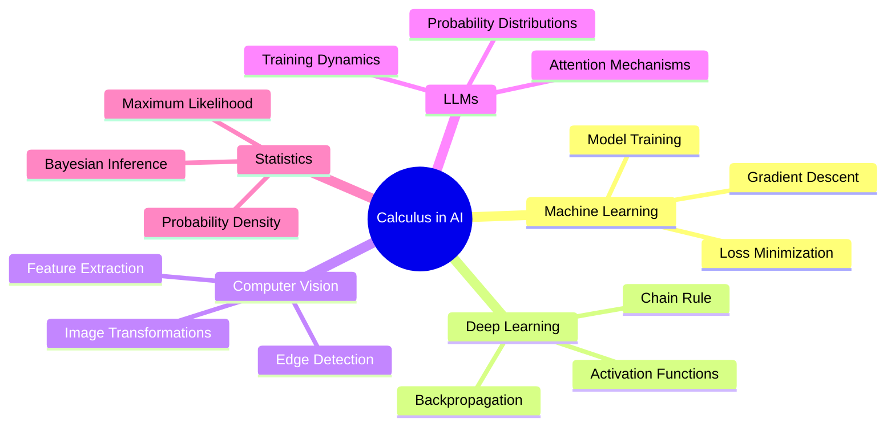

# Chapter 9: Advanced Calculus for AI/ML - Complete Guide
## From Basics to Advanced Concepts with Practical Examples

[⬅ Previous: Complete Statistical Journey](./08-complete-statistical-journey-eda-to-llms.md) | [🏠 Home](../README.md) | [➡ Next: Advanced Topics](./10-advanced-topics.md)

---

## 📚 Table of Contents

1. [Introduction: Why Calculus Matters in AI](#introduction-why-calculus-matters-in-ai)
2. [Part 1: Foundation - Limits and Continuity](#part-1-foundation---limits-and-continuity)
3. [Part 2: Derivatives - The Engine of Learning](#part-2-derivatives---the-engine-of-learning)
4. [Part 3: Partial Derivatives and Gradients](#part-3-partial-derivatives-and-gradients)
5. [Part 4: Chain Rule - The Backpropagation Hero](#part-4-chain-rule---the-backpropagation-hero)
6. [Part 5: Integrals and Probability](#part-5-integrals-and-probability)
7. [Part 6: Vector Calculus and Matrix Derivatives](#part-6-vector-calculus-and-matrix-derivatives)
8. [Part 7: Optimization - Finding the Best](#part-7-optimization---finding-the-best)
9. [Part 8: Advanced Topics](#part-8-advanced-topics)
10. [Part 9: Applications in AI/ML/DL/CV](#part-9-applications-in-aimldlcv)
11. [Part 10: Practice Problems](#part-10-practice-problems)
12. [References](#references)

---

## Introduction: Why Calculus Matters in AI

### 🎯 The Big Picture

Calculus is the **mathematical engine** behind all of artificial intelligence. Every time a neural network learns, it's using calculus. Every time an optimization algorithm finds the best parameters, it's using calculus.

**Simple Analogy**: Think of calculus as the steering wheel of AI - it guides the learning process toward better performance.

### 📊 Calculus in Different AI Domains



### 🧮 Why Different Domains Need Calculus

| Domain | Calculus Concepts | Application |
|--------|------------------|-------------|
| **ML** | Derivatives, Gradients | Training models |
| **DL** | Chain Rule, Partial Derivatives | Backpropagation |
| **CV** | Image Gradients, Transforms | Edge detection, filters |
| **LLMs** | Attention, Softmax gradients | Text generation |
| **Statistics** | Integrals, PDFs | Probability distributions |

---

## Part 1: Foundation - Limits and Continuity

### 📐 Understanding Limits

**Simple Explanation**: A limit tells us what happens to a function as we get closer and closer to a value, without necessarily reaching it.

**Real-World Example**: Imagine driving toward a wall. As you get closer (x approaches 0), your distance to the wall approaches 0. That's a limit!

**Mathematical Definition**:
$$\lim_{x \to a} f(x) = L$$

**In Words**: As x gets arbitrarily close to a, f(x) gets arbitrarily close to L.

### 🎯 Limits in AI

```python
import numpy as np
import matplotlib.pyplot as plt

# Visualizing limits
def demonstrate_limits():
    """Show how limits work with visual examples."""
    
    # Function: f(x) = sin(x)/x (famous limit)
    x = np.linspace(-10, 10, 1000)
    y = np.sin(x) / x
    
    plt.figure(figsize=(12, 6))
    plt.plot(x, y, linewidth=2)
    plt.axhline(1, color='red', linestyle='--', label='Limit at x=0 is 1')
    plt.axvline(0, color='green', linestyle='--', alpha=0.5)
    plt.xlabel('x')
    plt.ylabel('sin(x)/x')
    plt.title('The Limit of sin(x)/x as x → 0')
    plt.legend()
    plt.grid(True, alpha=0.3)
    plt.show()

demonstrate_limits()
```

### 🔄 Continuity

**Simple Definition**: A function is continuous if you can draw it without lifting your pen.

**Why It Matters in AI**:
- **Loss functions** must be continuous for gradient-based optimization
- **Activation functions** should be continuous for stable learning
- **Probability distributions** need continuity for integration

```python
def check_continuity():
    """Visualize continuity vs discontinuity."""
    x = np.linspace(-3, 3, 1000)
    
    # Continuous function
    y_continuous = x**2
    
    # Discontinuous function (step function)
    y_discontinuous = np.heaviside(x, 0.5)
    
    fig, axes = plt.subplots(1, 2, figsize=(12, 5))
    
    axes[0].plot(x, y_continuous, linewidth=2)
    axes[0].set_title('Continuous Function: x²')
    axes[0].grid(True, alpha=0.3)
    
    axes[1].plot(x, y_discontinuous, linewidth=2)
    axes[1].set_title('Discontinuous Function: Step')
    axes[1].grid(True, alpha=0.3)
    
    plt.tight_layout()
    plt.show()

check_continuity()
```

---

## Part 2: Derivatives - The Engine of Learning

### 📐 What is a Derivative?

**Simple Explanation**: A derivative tells us the rate of change of a function at any point. In AI, derivatives tell us how changing a parameter affects the output.

**Real-World Analogy**: 
- Driving: Speed is the derivative of distance
- Stock trading: Rate of price change
- Neural networks: How weights affect loss

**Mathematical Definition**:
$$f'(x) = \lim_{h \to 0} \frac{f(x+h) - f(x)}{h}$$

### 🎯 Derivatives in Machine Learning

```python
class DerivativeExamples:
    """Complete derivative examples for ML."""
    
    @staticmethod
    def derivative_visualization():
        """Visualize derivatives of common functions."""
        x = np.linspace(-3, 3, 100)
        
        functions = {
            'Linear (x)': (lambda x: x, lambda x: np.ones_like(x)),
            'Quadratic (x²)': (lambda x: x**2, lambda x: 2*x),
            'Cubic (x³)': (lambda x: x**3, lambda x: 3*x**2),
            'Sigmoid': (lambda x: 1/(1+np.exp(-x)), lambda x: np.exp(-x)/(1+np.exp(-x))**2),
            'Tanh': (np.tanh, lambda x: 1 - np.tanh(x)**2),
            'ReLU': (lambda x: np.maximum(0,x), lambda x: np.where(x>0, 1, 0))
        }
        
        fig, axes = plt.subplots(3, 2, figsize=(12, 12))
        axes = axes.flatten()
        
        for idx, (name, (func, grad)) in enumerate(functions.items()):
            y = func(x)
            y_grad = grad(x)
            
            axes[idx].plot(x, y, linewidth=2, label='Function')
            axes[idx].plot(x, y_grad, linewidth=2, linestyle='--', label='Derivative')
            axes[idx].axhline(0, color='black', linestyle='-', alpha=0.3)
            axes[idx].axvline(0, color='black', linestyle='-', alpha=0.3)
            axes[idx].set_title(f'{name} and its Derivative')
            axes[idx].legend()
            axes[idx].grid(True, alpha=0.3)
            axes[idx].set_ylim([-3, 3])
        
        plt.tight_layout()
        plt.show()
    
    @staticmethod
    def derivative_application():
        """Practical derivative application in ML."""
        # Simulate a loss function
        def loss_function(w):
            return (w - 2)**2 + 1
        
        # Derivative of loss
        def loss_derivative(w):
            return 2*(w - 2)
        
        w_values = np.linspace(-1, 5, 100)
        loss_values = loss_function(w_values)
        
        # Find minimum using derivative
        w_min = 2  # derivative = 0
        loss_min = loss_function(w_min)
        
        plt.figure(figsize=(10, 6))
        plt.plot(w_values, loss_values, linewidth=2, label='Loss Function')
        plt.scatter(w_min, loss_min, color='red', s=100, label='Minimum')
        plt.axvline(w_min, color='red', linestyle='--', alpha=0.5)
        plt.xlabel('Weight (w)')
        plt.ylabel('Loss')
        plt.title('Finding Minimum Using Derivatives')
        plt.legend()
        plt.grid(True, alpha=0.3)
        plt.show()
        
        print(f"Minimum at w = {w_min}")
        print(f"Minimum loss = {loss_min}")

# Run examples
DerivativeExamples.derivative_visualization()
DerivativeExamples.derivative_application()
```

### 📊 Common Derivatives in AI/ML

| Function | Derivative | Where Used |
|----------|------------|------------|
| **Linear: wx + b** | w | Linear layers |
| **Quadratic: x²** | 2x | Loss functions |
| **Sigmoid: σ(x)** | σ(x)(1-σ(x)) | Binary classification |
| **Tanh** | 1 - tanh²(x) | Hidden layers |
| **ReLU** | 1 if x>0, 0 otherwise | Deep networks |
| **Softmax** | δᵢⱼsᵢ - sᵢsⱼ | Multi-class |
| **Cross-Entropy** | p - y | Classification losses |
| **MSE** | 2(ŷ - y) | Regression losses |

### 🎮 The Gradient Descent Algorithm

```python
class GradientDescent:
    """Complete gradient descent implementation."""
    
    @staticmethod
    def gradient_descent(f, f_prime, start=0, lr=0.1, epochs=100):
        """Basic gradient descent algorithm."""
        w = start
        history = [w]
        
        for _ in range(epochs):
            grad = f_prime(w)
            w = w - lr * grad
            history.append(w)
        
        return w, history
    
    @staticmethod
    def momentum_gd(f, f_prime, start=0, lr=0.1, momentum=0.9, epochs=100):
        """Gradient descent with momentum."""
        w = start
        v = 0
        history = [w]
        
        for _ in range(epochs):
            grad = f_prime(w)
            v = momentum * v - lr * grad
            w = w + v
            history.append(w)
        
        return w, history
    
    @staticmethod
    def adam_gd(f, f_prime, start=0, lr=0.1, beta1=0.9, beta2=0.999, eps=1e-8, epochs=100):
        """Adam optimization algorithm."""
        w = start
        m = 0  # First moment
        v = 0  # Second moment
        history = [w]
        
        for t in range(1, epochs+1):
            grad = f_prime(w)
            m = beta1 * m + (1 - beta1) * grad
            v = beta2 * v + (1 - beta2) * grad**2
            m_hat = m / (1 - beta1**t)
            v_hat = v / (1 - beta2**t)
            w = w - lr * m_hat / (np.sqrt(v_hat) + eps)
            history.append(w)
        
        return w, history
    
    @staticmethod
    def compare_methods():
        """Compare different optimization methods."""
        # Define a simple loss function
        def f(w):
            return w**2 + 2*w + 1
        
        def f_prime(w):
            return 2*w + 2
        
        start = 5
        epochs = 50
        
        # Run different optimizers
        w_gd, hist_gd = GradientDescent.gradient_descent(f, f_prime, start, 0.1, epochs)
        w_mom, hist_mom = GradientDescent.momentum_gd(f, f_prime, start, 0.1, 0.9, epochs)
        w_adam, hist_adam = GradientDescent.adam_gd(f, f_prime, start, 0.1, epochs=epochs)
        
        # Plot results
        plt.figure(figsize=(12, 8))
        w_range = np.linspace(-2, 6, 100)
        plt.plot(w_range, f(w_range), 'k--', label='Loss Function')
        
        plt.plot(hist_gd, [f(w) for w in hist_gd], 'o-', label='GD')
        plt.plot(hist_mom, [f(w) for w in hist_mom], 's-', label='Momentum')
        plt.plot(hist_adam, [f(w) for w in hist_adam], '^-', label='Adam')
        
        plt.xlabel('Weight')
        plt.ylabel('Loss')
        plt.title('Optimization Method Comparison')
        plt.legend()
        plt.grid(True, alpha=0.3)
        plt.show()
        
        print(f"GD final: w={w_gd:.4f}, loss={f(w_gd):.4f}")
        print(f"Momentum final: w={w_mom:.4f}, loss={f(w_mom):.4f}")
        print(f"Adam final: w={w_adam:.4f}, loss={f(w_adam):.4f}")

# Run comparison
GradientDescent.compare_methods()
```

---

## Part 3: Partial Derivatives and Gradients

### 📐 Understanding Partial Derivatives

**Simple Explanation**: When a function has multiple variables, a partial derivative tells us how the function changes when we change just one variable, keeping others fixed.

**Real-World Analogy**: 
- A house price depends on size AND location
- Partial derivative with respect to size = How price changes with size, keeping location fixed
- Partial derivative with respect to location = How price changes with location, keeping size fixed

**Mathematical Definition**:
$$\frac{\partial f}{\partial x_i} = \lim_{h \to 0} \frac{f(x_1, ..., x_i+h, ..., x_n) - f(x_1, ..., x_n)}{h}$$

### 🎯 Gradients in Machine Learning

```python
class GradientExamples:
    """Complete gradient examples for ML."""
    
    @staticmethod
    def visualize_gradient():
        """Visualize gradients on a 2D surface."""
        # Create a 2D function
        x = np.linspace(-3, 3, 30)
        y = np.linspace(-3, 3, 30)
        X, Y = np.meshgrid(x, y)
        Z = X**2 + Y**2 + X*Y
        
        # Calculate gradient
        dZ_dX = 2*X + Y
        dZ_dY = 2*Y + X
        
        fig, axes = plt.subplots(1, 2, figsize=(14, 6))
        
        # Surface plot
        ax = axes[0]
        surf = ax.contourf(X, Y, Z, levels=20)
        plt.colorbar(surf, ax=ax)
        ax.set_title('Contour Plot of f(x,y) = x² + y² + xy')
        ax.set_xlabel('x')
        ax.set_ylabel('y')
        
        # Gradient field
        ax = axes[1]
        ax.quiver(X, Y, -dZ_dX, -dZ_dY, Z, alpha=0.8)
        ax.set_title('Gradient Field (Negative Gradient Points to Minimum)')
        ax.set_xlabel('x')
        ax.set_ylabel('y')
        
        plt.tight_layout()
        plt.show()
    
    @staticmethod
    def gradient_descent_2d():
        """2D gradient descent visualization."""
        def f(x, y):
            return x**2 + y**2 + x*y
        
        def grad_f(x, y):
            return np.array([2*x + y, 2*y + x])
        
        # Starting point
        pos = np.array([2.5, 2.0])
        lr = 0.1
        history = [pos.copy()]
        
        # Perform gradient descent
        for _ in range(30):
            grad = grad_f(pos[0], pos[1])
            pos = pos - lr * grad
            history.append(pos.copy())
        
        history = np.array(history)
        
        # Plot
        x = np.linspace(-3, 3, 50)
        y = np.linspace(-3, 3, 50)
        X, Y = np.meshgrid(x, y)
        Z = f(X, Y)
        
        plt.figure(figsize=(10, 8))
        plt.contour(X, Y, Z, levels=20)
        plt.plot(history[:,0], history[:,1], 'ro-', linewidth=2, markersize=8)
        plt.xlabel('x')
        plt.ylabel('y')
        plt.title('Gradient Descent Path on 2D Surface')
        plt.colorbar()
        plt.grid(True, alpha=0.3)
        plt.show()

# Run examples
GradientExamples.visualize_gradient()
GradientExamples.gradient_descent_2d()
```

### 📊 Gradients in Neural Networks

**The Gradient of a Neural Network**:

A neural network is a composition of many functions. The gradient tells us how each weight affects the final output.

```python
def neural_network_gradient_demo():
    """Demonstrate gradients in a simple neural network."""
    
    # Simple network with one hidden layer
    class SimpleNetwork:
        def __init__(self, input_size, hidden_size, output_size):
            self.W1 = np.random.randn(input_size, hidden_size) * 0.1
            self.b1 = np.zeros(hidden_size)
            self.W2 = np.random.randn(hidden_size, output_size) * 0.1
            self.b2 = np.zeros(output_size)
        
        def forward(self, x):
            # Hidden layer
            self.z1 = x @ self.W1 + self.b1
            self.a1 = np.maximum(0, self.z1)  # ReLU
            # Output layer
            self.z2 = self.a1 @ self.W2 + self.b2
            self.a2 = 1 / (1 + np.exp(-self.z2))  # Sigmoid
            return self.a2
        
        def backward(self, x, y, output):
            # Calculate gradients (simplified)
            m = x.shape[0]
            dZ2 = output - y
            dW2 = (self.a1.T @ dZ2) / m
            db2 = np.sum(dZ2, axis=0) / m
            
            dA1 = dZ2 @ self.W2.T
            dZ1 = dA1 * (self.z1 > 0)
            dW1 = (x.T @ dZ1) / m
            db1 = np.sum(dZ1, axis=0) / m
            
            return {'dW1': dW1, 'db1': db1, 'dW2': dW2, 'db2': db2}
    
    # Create network
    net = SimpleNetwork(2, 4, 1)
    
    # Sample data
    x = np.random.randn(10, 2)
    y = (np.sum(x, axis=1) > 0).reshape(-1, 1).astype(float)
    
    # Forward pass
    output = net.forward(x)
    
    # Backward pass
    gradients = net.backward(x, y, output)
    
    print("Gradient magnitudes:")
    for name, grad in gradients.items():
        print(f"  {name}: {np.mean(np.abs(grad)):.6f}")

neural_network_gradient_demo()
```

---

## Part 4: Chain Rule - The Backpropagation Hero

### 📐 Understanding the Chain Rule

**Simple Explanation**: The chain rule tells us how to compute the derivative of composite functions. In AI, it's the mathematical basis of backpropagation.

**Real-World Analogy**: 
- To find the total cost, you might multiply: (cost per item) × (number of items)
- The chain rule helps us understand how changes in one part affect the whole

**Mathematical Definition**:
$$\frac{d}{dx} f(g(x)) = f'(g(x)) \cdot g'(x)$$

### 🎯 Chain Rule in Backpropagation

```python
class ChainRuleExamples:
    """Complete chain rule examples for AI."""
    
    @staticmethod
    def chain_rule_visualization():
        """Visualize the chain rule."""
        def f(x):
            return x**2
        
        def g(x):
            return np.sin(x)
        
        def h(x):
            return f(g(x))  # f(g(x)) = sin²(x)
        
        x = np.linspace(-2*np.pi, 2*np.pi, 100)
        
        # Compute derivatives
        f_prime = lambda x: 2*x
        g_prime = lambda x: np.cos(x)
        h_prime = lambda x: f_prime(g(x)) * g_prime(x)  # Chain rule!
        
        plt.figure(figsize=(12, 6))
        plt.plot(x, h(x), linewidth=2, label='h(x) = sin²(x)')
        plt.plot(x, h_prime(x), linewidth=2, linestyle='--', label="h'(x) (Chain Rule)")
        plt.axhline(0, color='black', alpha=0.3)
        plt.axvline(0, color='black', alpha=0.3)
        plt.xlabel('x')
        plt.ylabel('Value')
        plt.title('Chain Rule Demonstration: h(x) = sin²(x)')
        plt.legend()
        plt.grid(True, alpha=0.3)
        plt.show()
    
    @staticmethod
    def backpropagation_demo():
        """Demonstrate backpropagation with chain rule."""
        # Forward pass
        def forward(x, w1, w2):
            h = x * w1
            y = h * w2
            return y, h
        
        # Backward pass using chain rule
        def backward(x, w1, w2, target):
            # Forward pass
            y, h = forward(x, w1, w2)
            
            # Loss: MSE
            loss = (y - target)**2 / 2
            
            # Gradients (using chain rule!)
            dloss_dy = y - target
            dy_dw2 = h
            dloss_dw2 = dloss_dy * dy_dw2
            
            dy_dh = w2
            dh_dw1 = x
            dloss_dw1 = dloss_dy * dy_dh * dh_dw1
            
            return {
                'loss': loss,
                'dloss_dw1': dloss_dw1,
                'dloss_dw2': dloss_dw2
            }
        
        # Example
        x = 2.0
        w1 = 0.5
        w2 = 1.5
        target = 3.0
        
        result = backward(x, w1, w2, target)
        
        print(f"Input: x={x}, w1={w1}, w2={w2}, target={target}")
        print(f"Loss: {result['loss']:.4f}")
        print(f"Gradient w1: {result['dloss_dw1']:.4f}")
        print(f"Gradient w2: {result['dloss_dw2']:.4f}")
        
        # Visualize the computation graph
        fig, ax = plt.subplots(figsize=(10, 6))
        
        # Draw computation graph
        positions = {
            'x': (0, 1),
            'w1': (0, 0),
            'w2': (2, 0),
            'h': (1, 1),
            'y': (2, 1),
            'loss': (3, 1)
        }
        
        for name, pos in positions.items():
            ax.scatter(*pos, s=2000, alpha=0.7)
            ax.text(pos[0], pos[1], name, ha='center', va='center', fontsize=12)
        
        # Add edges
        edges = [('x', 'h'), ('w1', 'h'), ('h', 'y'), ('w2', 'y'), ('y', 'loss')]
        for start, end in edges:
            ax.plot([positions[start][0], positions[end][0]], 
                   [positions[start][1], positions[end][1]], 
                   'k-', linewidth=2)
        
        ax.set_xlim([-1, 4])
        ax.set_ylim([-0.5, 2])
        ax.set_title('Computation Graph for Forward Pass')
        ax.set_aspect('equal')
        ax.axis('off')
        plt.show()

# Run examples
ChainRuleExamples.chain_rule_visualization()
ChainRuleExamples.backpropagation_demo()
```

### 🧠 Backpropagation in Neural Networks

```python
class Backpropagation:
    """Complete backpropagation implementation."""
    
    @staticmethod
    def simple_network_backprop():
        """End-to-end backpropagation example."""
        
        # Network parameters
        np.random.seed(42)
        input_size = 2
        hidden_size = 3
        output_size = 1
        
        # Initialize weights
        W1 = np.random.randn(input_size, hidden_size) * 0.5
        b1 = np.zeros(hidden_size)
        W2 = np.random.randn(hidden_size, output_size) * 0.5
        b2 = np.zeros(output_size)
        
        # Sample data
        X = np.array([[0, 0], [0, 1], [1, 0], [1, 1]])
        Y = np.array([[0], [1], [1], [0]])  # XOR problem
        
        # Training loop
        learning_rate = 0.1
        epochs = 1000
        
        losses = []
        
        for epoch in range(epochs):
            total_loss = 0
            
            for i in range(len(X)):
                x = X[i:i+1]
                y = Y[i:i+1]
                
                # Forward pass
                # Layer 1
                z1 = x @ W1 + b1
                a1 = np.maximum(0, z1)  # ReLU
                
                # Layer 2
                z2 = a1 @ W2 + b2
                a2 = 1 / (1 + np.exp(-z2))  # Sigmoid
                
                # Loss
                loss = (a2 - y)**2 / 2
                total_loss += loss[0,0]
                
                # Backward pass
                # Output layer gradients
                dloss_da2 = a2 - y
                da2_dz2 = a2 * (1 - a2)
                dloss_dz2 = dloss_da2 * da2_dz2
                
                # Hidden layer gradients
                dloss_da1 = dloss_dz2 @ W2.T
                da1_dz1 = (z1 > 0).astype(float)
                dloss_dz1 = dloss_da1 * da1_dz1
                
                # Weight gradients
                dloss_dW2 = a1.T @ dloss_dz2
                dloss_db2 = dloss_dz2
                dloss_dW1 = x.T @ dloss_dz1
                dloss_db1 = dloss_dz1
                
                # Update weights
                W2 = W2 - learning_rate * dloss_dW2
                b2 = b2 - learning_rate * dloss_db2.flatten()
                W1 = W1 - learning_rate * dloss_dW1
                b1 = b1 - learning_rate * dloss_db1.flatten()
            
            losses.append(total_loss / len(X))
            
            if epoch % 100 == 0:
                print(f"Epoch {epoch}, Loss: {losses[-1]:.4f}")
        
        # Plot loss
        plt.figure(figsize=(10, 6))
        plt.plot(losses, linewidth=2)
        plt.xlabel('Epoch')
        plt.ylabel('Loss')
        plt.title('Training Loss Over Time')
        plt.grid(True, alpha=0.3)
        plt.show()
        
        # Test the network
        print("\nTesting trained network:")
        for x in X:
            z1 = x.reshape(1, -1) @ W1 + b1
            a1 = np.maximum(0, z1)
            z2 = a1 @ W2 + b2
            a2 = 1 / (1 + np.exp(-z2))
            print(f"Input: {x}, Output: {a2[0,0]:.4f}")

# Run backpropagation
Backpropagation.simple_network_backprop()
```

---

## Part 5: Integrals and Probability

### 📐 Understanding Integrals

**Simple Explanation**: While derivatives tell us about change, integrals tell us about accumulation. In AI, integrals are essential for probability and statistics.

**Real-World Analogy**: 
- Derivatives = Speed at a moment
- Integrals = Total distance traveled
- In AI: Integrals = Total probability

**Mathematical Definition**:
$$\int_a^b f(x) dx = \text{Area under the curve from a to b}$$

### 🎯 Integrals in Probability

```python
class IntegralExamples:
    """Complete integral examples for AI/ML."""
    
    @staticmethod
    def probability_integration():
        """Show how integrals compute probabilities."""
        
        # Normal distribution
        def normal_pdf(x, mu=0, sigma=1):
            return (1/(sigma * np.sqrt(2*np.pi))) * np.exp(-(x-mu)**2 / (2*sigma**2))
        
        x = np.linspace(-4, 4, 1000)
        y = normal_pdf(x)
        
        # Approximate integral (probability) using numerical integration
        def approximate_integral(x, y, a, b):
            """Approximate area under curve between a and b."""
            mask = (x >= a) & (x <= b)
            return np.trapz(y[mask], x[mask])
        
        plt.figure(figsize=(12, 6))
        plt.plot(x, y, linewidth=2, label='Normal Distribution')
        
        # Shade area for P(-1 < X < 1)
        mask = (x >= -1) & (x <= 1)
        plt.fill_between(x[mask], 0, y[mask], alpha=0.3, label='P(-1 < X < 1)')
        
        prob = approximate_integral(x, y, -1, 1)
        plt.text(0, 0.2, f'Probability = {prob:.4f}', ha='center')
        
        plt.xlabel('x')
        plt.ylabel('Density')
        plt.title('Probability as Area Under Curve')
        plt.legend()
        plt.grid(True, alpha=0.3)
        plt.show()
        
        print(f"P(-1 < X < 1) = {prob:.4f}")
        print(f"Theoretical: 0.6827")
    
    @staticmethod
    def expected_value_computation():
        """Compute expected value using integrals."""
        
        # Simple probability density function
        def pdf(x):
            return 2*x if 0 <= x <= 1 else 0
        
        # Expected value: E[X] = ∫ x * f(x) dx
        x = np.linspace(0, 1, 1000)
        integrand = x * pdf(x)
        expected_value = np.trapz(integrand, x)
        
        print(f"Expected value: {expected_value:.4f}")
        
        # Visualize
        plt.figure(figsize=(10, 6))
        plt.plot(x, pdf(x), linewidth=2, label='PDF')
        plt.plot(x, integrand, linewidth=2, linestyle='--', label='x * f(x)')
        plt.axvline(expected_value, color='red', linestyle=':', label='Expected Value')
        plt.fill_between(x, 0, integrand, alpha=0.3)
        plt.xlabel('x')
        plt.ylabel('Value')
        plt.title('Expected Value Computation')
        plt.legend()
        plt.grid(True, alpha=0.3)
        plt.show()

# Run examples
IntegralExamples.probability_integration()
IntegralExamples.expected_value_computation()
```

### 📊 Probability Density Functions

```python
class PDFExamples:
    """Complete PDF examples for AI/ML."""
    
    @staticmethod
    def common_pdfs():
        """Visualize common probability density functions."""
        
        x = np.linspace(-5, 5, 1000)
        
        pdfs = {
            'Normal (μ=0, σ=1)': lambda x: (1/np.sqrt(2*np.pi)) * np.exp(-x**2/2),
            'Uniform (-2, 2)': lambda x: 1/4 * np.where((x >= -2) & (x <= 2), 1, 0),
            'Exponential (λ=1)': lambda x: np.where(x >= 0, np.exp(-x), 0),
            'Laplace (μ=0, b=1)': lambda x: 0.5 * np.exp(-np.abs(x)),
            'Cauchy (γ=1)': lambda x: 1/(np.pi * (1 + x**2))
        }
        
        fig, axes = plt.subplots(2, 3, figsize=(15, 10))
        axes = axes.flatten()
        
        for idx, (name, pdf_func) in enumerate(pdfs.items()):
            y = pdf_func(x)
            axes[idx].plot(x, y, linewidth=2)
            axes[idx].fill_between(x, 0, y, alpha=0.2)
            axes[idx].set_title(name)
            axes[idx].set_xlabel('x')
            axes[idx].set_ylabel('f(x)')
            axes[idx].grid(True, alpha=0.3)
            
            # Mark area under curve = 1
            area = np.trapz(y, x)
            axes[idx].text(0.5, 0.5, f'Area = {area:.3f}', transform=axes[idx].transAxes)
        
        plt.tight_layout()
        plt.show()
    
    @staticmethod
    def monte_carlo_integration():
        """Monte Carlo integration demonstration."""
        
        def f(x):
            return np.sin(x) * np.exp(-x/2)
        
        # Analytical integral from 0 to π
        # We'll approximate using Monte Carlo
        n_samples = 10000
        x_samples = np.random.uniform(0, np.pi, n_samples)
        y_samples = f(x_samples)
        
        # Monte Carlo estimate
        integral_estimate = np.pi * np.mean(y_samples)
        
        # True integral (computed numerically)
        x_true = np.linspace(0, np.pi, 1000)
        integral_true = np.trapz(f(x_true), x_true)
        
        print(f"Monte Carlo Estimate: {integral_estimate:.4f}")
        print(f"True Integral: {integral_true:.4f}")
        print(f"Error: {abs(integral_estimate - integral_true):.4f}")
        
        # Visualize
        plt.figure(figsize=(10, 6))
        x = np.linspace(0, np.pi, 1000)
        plt.plot(x, f(x), linewidth=2, label='f(x) = sin(x)e^(-x/2)')
        plt.scatter(x_samples[:500], y_samples[:500], alpha=0.3, s=10)
        plt.axhline(np.mean(y_samples), color='red', linestyle='--', 
                   label=f'Mean = {np.mean(y_samples):.3f}')
        plt.xlabel('x')
        plt.ylabel('f(x)')
        plt.title('Monte Carlo Integration')
        plt.legend()
        plt.grid(True, alpha=0.3)
        plt.show()

# Run examples
PDFExamples.common_pdfs()
PDFExamples.monte_carlo_integration()
```

---

## Part 6: Vector Calculus and Matrix Derivatives

### 📐 Understanding Vector Calculus

**Simple Explanation**: When we have multiple variables, we work with vectors and matrices. Vector calculus extends our tools to handle these multi-dimensional spaces.

**Real-World Analogy**: 
- 1D: Moving along a line
- 2D: Moving on a plane (derivatives become gradients)
- ND: Moving in high-dimensional space (neural networks)

### 🎯 Matrix Derivatives in Deep Learning

```python
class MatrixDerivatives:
    """Complete matrix derivative examples."""
    
    @staticmethod
    def basic_matrix_derivatives():
        """Demonstrate basic matrix derivatives."""
        
        # Create a simple matrix function
        X = np.array([[1, 2], [3, 4]])
        W = np.array([[0.5, 0.2], [0.3, 0.1]])
        
        # f(X, W) = X @ W (matrix multiplication)
        # ∂f/∂W = X^T
        
        print("Matrix Derivatives Example:")
        print(f"X = \n{X}")
        print(f"W = \n{W}")
        print(f"X @ W = \n{X @ W}")
        print(f"∂(XW)/∂W = X^T = \n{X.T}")
        
        # Derivative of quadratic form
        a = np.array([1, 2])
        A = np.array([[2, 1], [1, 3]])
        
        # f(a) = a^T A a (quadratic form)
        # ∂f/∂a = 2Aa
        
        print(f"\nQuadratic Form Example:")
        print(f"a = {a}")
        print(f"A = \n{A}")
        print(f"a^T A a = {a @ A @ a}")
        print(f"∂/∂a = 2Aa = {2 * A @ a}")
    
    @staticmethod
    def neural_network_matrix_gradients():
        """Compute matrix gradients in neural networks."""
        
        # Define a simple layer
        class SimpleLayer:
            def __init__(self, input_dim, output_dim):
                self.W = np.random.randn(input_dim, output_dim) * 0.1
                self.b = np.zeros(output_dim)
            
            def forward(self, x):
                self.x = x
                self.z = x @ self.W + self.b
                self.a = np.maximum(0, self.z)  # ReLU
                return self.a
            
            def backward(self, grad_output):
                # Gradient w.r.t z
                grad_z = grad_output * (self.z > 0)
                
                # Gradient w.r.t W
                grad_W = self.x.T @ grad_z
                
                # Gradient w.r.t b
                grad_b = np.sum(grad_z, axis=0, keepdims=True)
                
                # Gradient w.r.t x (for previous layer)
                grad_x = grad_z @ self.W.T
                
                return grad_W, grad_b, grad_x
        
        # Create a network with two layers
        layer1 = SimpleLayer(3, 4)
        layer2 = SimpleLayer(4, 2)
        
        # Sample input
        x = np.random.randn(2, 3)
        
        # Forward pass
        a1 = layer1.forward(x)
        a2 = layer2.forward(a1)
        
        print("Forward pass complete!")
        print(f"Input shape: {x.shape}")
        print(f"Layer1 output shape: {a1.shape}")
        print(f"Layer2 output shape: {a2.shape}")
        
        # Backward pass (simulated)
        grad_loss = np.random.randn(2, 2)
        grad_W2, grad_b2, grad_a1 = layer2.backward(grad_loss)
        grad_W1, grad_b1, grad_x = layer1.backward(grad_a1)
        
        print("\nGradients computed:")
        print(f"dL/dW2 shape: {grad_W2.shape}")
        print(f"dL/dW1 shape: {grad_W1.shape}")
        print(f"dL/dx shape: {grad_x.shape}")

# Run examples
MatrixDerivatives.basic_matrix_derivatives()
MatrixDerivatives.neural_network_matrix_gradients()
```

### 📊 Jacobian and Hessian Matrices

```python
class JacobianHessian:
    """Jacobian and Hessian examples."""
    
    @staticmethod
    def compute_jacobian():
        """Compute Jacobian matrix for vector-valued functions."""
        
        # Function: f(x,y) = [x² + y, x + y²]
        def f(x, y):
            return np.array([x**2 + y, x + y**2])
        
        # Jacobian: [[∂f1/∂x, ∂f1/∂y], [∂f2/∂x, ∂f2/∂y]]
        def jacobian(x, y):
            return np.array([
                [2*x, 1],
                [1, 2*y]
            ])
        
        point = np.array([1, 2])
        J = jacobian(point[0], point[1])
        
        print("Jacobian Example:")
        print(f"Point: x={point[0]}, y={point[1]}")
        print(f"Jacobian:\n{J}")
        
        # Visualize Jacobian as transformation
        plt.figure(figsize=(10, 8))
        
        # Create grid
        X, Y = np.meshgrid(np.linspace(-2, 2, 10), np.linspace(-2, 2, 10))
        points = np.stack([X.flatten(), Y.flatten()]).T
        
        # Transform points through Jacobian at origin
        J_at_zero = jacobian(0, 0)
        transformed = points @ J_at_zero.T
        
        # Plot original and transformed points
        plt.scatter(points[:, 0], points[:, 1], alpha=0.5, label='Original')
        plt.scatter(transformed[:, 0], transformed[:, 1], alpha=0.5, label='Transformed')
        plt.xlabel('x')
        plt.ylabel('y')
        plt.title('Jacobian Transformation at (0,0)')
        plt.legend()
        plt.grid(True, alpha=0.3)
        plt.axis('equal')
        plt.show()
    
    @staticmethod
    def compute_hessian():
        """Compute Hessian matrix for scalar-valued functions."""
        
        # Function: f(x,y) = x² + 3xy + y²
        def f(x, y):
            return x**2 + 3*x*y + y**2
        
        # Hessian: [[∂²f/∂x², ∂²f/∂x∂y], [∂²f/∂y∂x, ∂²f/∂y²]]
        def hessian(x, y):
            return np.array([
                [2, 3],
                [3, 2]
            ])
        
        point = np.array([1, 1])
        H = hessian(point[0], point[1])
        
        print("Hessian Example:")
        print(f"Point: x={point[0]}, y={point[1]}")
        print(f"Hessian:\n{H}")
        
        # Check if positive definite (for convexity)
        eigenvalues = np.linalg.eigvals(H)
        print(f"Eigenvalues: {eigenvalues}")
        print(f"Positive definite: {np.all(eigenvalues > 0)}")
        
        # Visualize the function and its curvature
        X, Y = np.meshgrid(np.linspace(-3, 3, 50), np.linspace(-3, 3, 50))
        Z = f(X, Y)
        
        fig = plt.figure(figsize=(12, 5))
        
        # Contour plot
        ax1 = fig.add_subplot(121)
        ax1.contour(X, Y, Z, levels=20)
        ax1.plot(point[0], point[1], 'ro', markersize=10)
        ax1.set_xlabel('x')
        ax1.set_ylabel('y')
        ax1.set_title('Contour Plot')
        ax1.grid(True, alpha=0.3)
        
        # Surface plot
        ax2 = fig.add_subplot(122, projection='3d')
        surf = ax2.plot_surface(X, Y, Z, cmap='viridis', alpha=0.8)
        ax2.scatter(point[0], point[1], f(point[0], point[1]), color='red', s=100)
        ax2.set_xlabel('x')
        ax2.set_ylabel('y')
        ax2.set_zlabel('f(x,y)')
        ax2.set_title('Surface Plot')
        
        plt.tight_layout()
        plt.show()

# Run examples
JacobianHessian.compute_jacobian()
JacobianHessian.compute_hessian()
```

---

## Part 7: Optimization - Finding the Best

### 📐 Understanding Optimization

**Simple Explanation**: Optimization is about finding the best values for parameters. In AI, we optimize to minimize error or maximize performance.

**Real-World Analogy**: Finding the lowest point in a valley (minimization) or the highest peak (maximization).

### 🎯 Optimization Algorithms

```python
class OptimizationAlgorithms:
    """Complete optimization algorithms for AI."""
    
    @staticmethod
    def gradient_descent_variants():
        """Compare different gradient descent variants."""
        
        # Loss function: f(x) = x² + 2x + 1
        def f(x):
            return x**2 + 2*x + 1
        
        def f_prime(x):
            return 2*x + 2
        
        # Starting point
        start = 5
        epochs = 30
        
        # Batch GD
        w_batch = start
        hist_batch = [w_batch]
        for _ in range(epochs):
            grad = f_prime(w_batch)
            w_batch = w_batch - 0.1 * grad
            hist_batch.append(w_batch)
        
        # SGD (with noise)
        w_sgd = start
        hist_sgd = [w_sgd]
        for _ in range(epochs):
            grad = f_prime(w_sgd) + np.random.normal(0, 0.5)
            w_sgd = w_sgd - 0.1 * grad
            hist_sgd.append(w_sgd)
        
        # Mini-batch (with smaller noise)
        w_mini = start
        hist_mini = [w_mini]
        for _ in range(epochs):
            grad = f_prime(w_mini) + np.random.normal(0, 0.2)
            w_mini = w_mini - 0.1 * grad
            hist_mini.append(w_mini)
        
        # Plot
        plt.figure(figsize=(12, 6))
        w_range = np.linspace(-3, 6, 100)
        plt.plot(w_range, f(w_range), 'k--', label='Loss Function')
        
        plt.plot(hist_batch, [f(w) for w in hist_batch], 'o-', label='Batch GD')
        plt.plot(hist_sgd, [f(w) for w in hist_sgd], 's-', label='SGD')
        plt.plot(hist_mini, [f(w) for w in hist_mini], '^-', label='Mini-batch')
        
        plt.xlabel('Weight')
        plt.ylabel('Loss')
        plt.title('Gradient Descent Variants')
        plt.legend()
        plt.grid(True, alpha=0.3)
        plt.show()
    
    @staticmethod
    def advanced_optimizers():
        """Implement advanced optimization algorithms."""
        
        # Define loss function
        def f(x):
            return x**2 + 2*x + 1
        
        def f_prime(x):
            return 2*x + 2
        
        start = 5
        epochs = 50
        
        # Adam parameters
        beta1, beta2 = 0.9, 0.999
        eps = 1e-8
        
        # Run different optimizers
        optimizers = {
            'SGD': lambda w, lr, m, v, t: (w - lr * f_prime(w), 0, 0),
            'Momentum': lambda w, lr, m, v, t: (
                w - lr * (0.9*m + 0.1*f_prime(w)),
                0.9*m + 0.1*f_prime(w),
                0
            ),
            'RMSprop': lambda w, lr, m, v, t: (
                w - lr * f_prime(w) / (np.sqrt(v + eps)),
                0,
                0.9*v + 0.1*f_prime(w)**2
            ),
            'Adam': lambda w, lr, m, v, t: (
                w - lr * (m/(1-beta1**t)) / (np.sqrt(v/(1-beta2**t)) + eps),
                beta1*m + (1-beta1)*f_prime(w),
                beta2*v + (1-beta2)*f_prime(w)**2
            )
        }
        
        results = {}
        for name, opt_func in optimizers.items():
            w = start
            m, v = 0, 0
            history = [w]
            
            for t in range(1, epochs+1):
                lr = 0.1 / (1 + 0.01*t)  # Learning rate decay
                w, m, v = opt_func(w, lr, m, v, t)
                history.append(w)
            
            results[name] = history
        
        # Plot results
        plt.figure(figsize=(12, 8))
        w_range = np.linspace(-3, 6, 100)
        plt.plot(w_range, f(w_range), 'k--', label='Loss Function')
        
        for name, history in results.items():
            losses = [f(w) for w in history]
            plt.plot(history, losses, 'o-', label=name, linewidth=2)
        
        plt.xlabel('Weight')
        plt.ylabel('Loss')
        plt.title('Optimizer Comparison')
        plt.legend()
        plt.grid(True, alpha=0.3)
        plt.show()
        
        # Print final values
        print("Final results:")
        for name, history in results.items():
            print(f"  {name}: w={history[-1]:.4f}, loss={f(history[-1]):.4f}")

# Run examples
OptimizationAlgorithms.gradient_descent_variants()
OptimizationAlgorithms.advanced_optimizers()
```

### 📊 Convex vs Non-Convex Optimization

```python
class ConvexityExamples:
    """Convex vs non-convex optimization examples."""
    
    @staticmethod
    def visualize_convexity():
        """Visualize convex vs non-convex functions."""
        
        x = np.linspace(-3, 3, 100)
        
        # Convex functions
        convex = {
            'Quadratic (x²)': lambda x: x**2,
            'Quadratic (x²+2x+1)': lambda x: x**2 + 2*x + 1,
            'Exponential (e^x)': lambda x: np.exp(x)
        }
        
        # Non-convex functions
        non_convex = {
            'Cubic (x³)': lambda x: x**3,
            'Sin(x)': lambda x: np.sin(x),
            'Rastrigin (simplified)': lambda x: x**2 - 10*np.cos(2*np.pi*x)
        }
        
        fig, axes = plt.subplots(2, 3, figsize=(15, 10))
        
        for idx, (name, func) in enumerate(convex.items()):
            axes[0, idx].plot(x, func(x), linewidth=2)
            axes[0, idx].set_title(f'Convex: {name}')
            axes[0, idx].grid(True, alpha=0.3)
            axes[0, idx].set_ylim([-2, 10])
        
        for idx, (name, func) in enumerate(non_convex.items()):
            axes[1, idx].plot(x, func(x), linewidth=2)
            axes[1, idx].set_title(f'Non-Convex: {name}')
            axes[1, idx].grid(True, alpha=0.3)
            axes[1, idx].set_ylim([-5, 10])
        
        plt.tight_layout()
        plt.show()
    
    @staticmethod
    def local_minima_vs_global_minima():
        """Demonstrate local vs global minima."""
        
        # Non-convex function with multiple minima
        def f(x):
            return x**2 + 0.5*x**3 - 2*x**2 - 2*x + 3
        
        x = np.linspace(-3, 4, 1000)
        y = f(x)
        
        # Find minima
        from scipy.optimize import minimize_scalar
        
        # Global minimum (approximate)
        result = minimize_scalar(f, bounds=(-3, 4), method='bounded')
        global_min = result.x
        
        # Local minimum (starting from different point)
        result_local = minimize_scalar(f, bounds=(-3, -1), method='bounded')
        local_min = result_local.x
        
        plt.figure(figsize=(12, 6))
        plt.plot(x, y, linewidth=2, label='f(x)')
        plt.plot(global_min, f(global_min), 'go', markersize=15, label='Global Minimum')
        plt.plot(local_min, f(local_min), 'ro', markersize=15, label='Local Minimum')
        plt.xlabel('x')
        plt.ylabel('f(x)')
        plt.title('Local vs Global Minima')
        plt.legend()
        plt.grid(True, alpha=0.3)
        plt.show()
        
        print(f"Global minimum at x={global_min:.4f}, f={f(global_min):.4f}")
        print(f"Local minimum at x={local_min:.4f}, f={f(local_min):.4f}")

# Run examples
ConvexityExamples.visualize_convexity()
ConvexityExamples.local_minima_vs_global_minima()
```

---

## Part 8: Advanced Topics

### 🎯 Taylor Series Expansion

```python
class TaylorSeries:
    """Taylor series examples for approximation."""
    
    @staticmethod
    def visualize_taylor_series():
        """Visualize Taylor series approximations."""
        
        def f(x):
            return np.exp(x)
        
        # Taylor coefficients at 0
        def taylor_approx(x, n):
            approx = 0
            for k in range(n):
                approx += x**k / np.math.factorial(k)
            return approx
        
        x = np.linspace(-2, 2, 100)
        
        plt.figure(figsize=(12, 8))
        plt.plot(x, f(x), 'k-', linewidth=3, label='True Function e^x')
        
        for n in [1, 2, 3, 5, 10]:
            y_approx = [taylor_approx(xi, n) for xi in x]
            plt.plot(x, y_approx, label=f'Order {n}', linewidth=2)
        
        plt.xlabel('x')
        plt.ylabel('f(x)')
        plt.title('Taylor Series Approximation of e^x')
        plt.legend()
        plt.grid(True, alpha=0.3)
        plt.show()
    
    @staticmethod
    def taylor_in_ml():
        """Show how Taylor series is used in ML."""
        
        # Loss function approximation
        def loss(x):
            return x**2 + 2*x + 1
        
        # Taylor expansion around x=0
        # f(x) ≈ f(0) + f'(0)x + f''(0)x²/2
        def taylor_loss(x):
            return 1 + 2*x + x**2  # f(0)=1, f'(0)=2, f''(0)=2
        
        x = np.linspace(-0.5, 0.5, 100)
        
        plt.figure(figsize=(10, 6))
        plt.plot(x, loss(x), linewidth=2, label='True Loss')
        plt.plot(x, taylor_loss(x), linestyle='--', linewidth=2, label='Taylor Approximation')
        plt.xlabel('Parameter')
        plt.ylabel('Loss')
        plt.title('Taylor Approximation in ML: Loss Function')
        plt.legend()
        plt.grid(True, alpha=0.3)
        plt.show()

# Run examples
TaylorSeries.visualize_taylor_series()
TaylorSeries.taylor_in_ml()
```

### 🧠 Calculus of Variations

```python
class CalculusOfVariations:
    """Calculus of variations examples."""
    
    @staticmethod
    def simple_variation():
        """Demonstrate Euler-Lagrange equation."""
        
        # We want to find function y(x) that minimizes
        # Integral of (y'^2 - y) dx
        
        # The Euler-Lagrange equation for this problem is:
        # d/dx(∂L/∂y') = ∂L/∂y
        # Where L = y'^2 - y
        # ∂L/∂y' = 2y'
        # d/dx(2y') = 2y''
        # ∂L/∂y = -1
        
        # So: 2y'' = -1 => y'' = -1/2
        # Solution: y(x) = -x²/4 + Cx + D
        
        def solution(x, C=0, D=0):
            return -x**2/4 + C*x + D
        
        x = np.linspace(0, 1, 100)
        
        plt.figure(figsize=(10, 6))
        
        for C in [-0.5, 0, 0.5]:
            for D in [-0.5, 0, 0.5]:
                y = solution(x, C, D)
                plt.plot(x, y, label=f'C={C}, D={D}')
        
        plt.xlabel('x')
        plt.ylabel('y(x)')
        plt.title('Solutions to a Simple Euler-Lagrange Problem')
        plt.legend()
        plt.grid(True, alpha=0.3)
        plt.show()
```

---

## Part 9: Applications in AI/ML/DL/CV

### 🤖 Machine Learning Applications

```python
class MLApplications:
    """Calculus applications in machine learning."""
    
    @staticmethod
    def logistic_regression():
        """Demonstrate calculus in logistic regression."""
        
        # Generate data
        np.random.seed(42)
        X = np.random.randn(100, 2)
        y = (X[:, 0] + 2*X[:, 1] > 0).astype(float)
        
        # Logistic regression training
        def sigmoid(z):
            return 1 / (1 + np.exp(-z))
        
        def train_logistic(X, y, lr=0.1, epochs=1000):
            W = np.random.randn(X.shape[1])
            b = 0
            losses = []
            
            for epoch in range(epochs):
                # Forward pass
                z = X @ W + b
                y_pred = sigmoid(z)
                
                # Loss (binary cross-entropy)
                loss = -np.mean(y * np.log(y_pred + 1e-8) + (1-y) * np.log(1-y_pred + 1e-8))
                losses.append(loss)
                
                # Gradients (calculus!)
                dz = y_pred - y
                dW = X.T @ dz / len(X)
                db = np.mean(dz)
                
                # Update
                W = W - lr * dW
                b = b - lr * db
            
            return W, b, losses
        
        # Train model
        W, b, losses = train_logistic(X, y)
        
        # Plot training progress
        plt.figure(figsize=(12, 5))
        
        plt.subplot(1, 2, 1)
        plt.plot(losses, linewidth=2)
        plt.xlabel('Epoch')
        plt.ylabel('Loss')
        plt.title('Training Loss')
        plt.grid(True, alpha=0.3)
        
        # Decision boundary
        plt.subplot(1, 2, 2)
        plt.scatter(X[y==0, 0], X[y==0, 1], alpha=0.5, label='Class 0')
        plt.scatter(X[y==1, 0], X[y==1, 1], alpha=0.5, label='Class 1')
        
        # Decision boundary: W[0]*x + W[1]*y + b = 0
        x_boundary = np.linspace(-3, 3, 100)
        y_boundary = -(W[0]*x_boundary + b) / W[1]
        plt.plot(x_boundary, y_boundary, 'r-', label='Decision Boundary')
        
        plt.xlabel('Feature 1')
        plt.ylabel('Feature 2')
        plt.legend()
        plt.grid(True, alpha=0.3)
        
        plt.tight_layout()
        plt.show()
        
        print(f"Weights: W={W}, b={b}")

# Run example
MLApplications.logistic_regression()
```

### 🧠 Deep Learning Applications

```python
class DLApplications:
    """Calculus applications in deep learning."""
    
    @staticmethod
    def backpropagation_demo():
        """Detailed backpropagation demonstration."""
        
        # Create a simple neural network
        class SimpleNN:
            def __init__(self, input_size, hidden_size, output_size):
                self.W1 = np.random.randn(input_size, hidden_size) * 0.1
                self.b1 = np.zeros(hidden_size)
                self.W2 = np.random.randn(hidden_size, output_size) * 0.1
                self.b2 = np.zeros(output_size)
            
            def forward(self, x):
                self.x = x
                # Hidden layer
                self.z1 = x @ self.W1 + self.b1
                self.a1 = np.maximum(0, self.z1)  # ReLU
                # Output layer
                self.z2 = self.a1 @ self.W2 + self.b2
                self.a2 = 1 / (1 + np.exp(-self.z2))  # Sigmoid
                return self.a2
            
            def loss(self, y):
                return -np.mean(y * np.log(self.a2 + 1e-8) + (1-y) * np.log(1-self.a2 + 1e-8))
            
            def backward(self, y, lr=0.1):
                # Calculate gradients using chain rule
                m = len(y)
                
                # Output layer gradients
                dloss_da2 = self.a2 - y
                da2_dz2 = self.a2 * (1 - self.a2)
                dloss_dz2 = dloss_da2 * da2_dz2
                
                # Hidden layer gradients
                dloss_da1 = dloss_dz2 @ self.W2.T
                da1_dz1 = (self.z1 > 0).astype(float)
                dloss_dz1 = dloss_da1 * da1_dz1
                
                # Weight gradients
                dloss_dW2 = self.a1.T @ dloss_dz2 / m
                dloss_db2 = np.mean(dloss_dz2, axis=0)
                dloss_dW1 = self.x.T @ dloss_dz1 / m
                dloss_db1 = np.mean(dloss_dz1, axis=0)
                
                # Update weights
                self.W2 = self.W2 - lr * dloss_dW2
                self.b2 = self.b2 - lr * dloss_db2
                self.W1 = self.W1 - lr * dloss_dW1
                self.b1 = self.b1 - lr * dloss_db1
                
                return {
                    'dW1': dloss_dW1,
                    'db1': dloss_db1,
                    'dW2': dloss_dW2,
                    'db2': dloss_db2
                }
        
        # Train on XOR problem
        X = np.array([[0,0], [0,1], [1,0], [1,1]])
        y = np.array([[0], [1], [1], [0]])
        
        nn = SimpleNN(2, 4, 1)
        
        # Training loop
        epochs = 1000
        losses = []
        
        for epoch in range(epochs):
            # Forward pass
            output = nn.forward(X)
            
            # Compute loss
            loss = nn.loss(y)
            losses.append(loss)
            
            # Backward pass
            nn.backward(y, lr=0.5)
            
            if epoch % 100 == 0:
                print(f"Epoch {epoch}, Loss: {loss:.4f}")
        
        # Plot training
        plt.figure(figsize=(12, 5))
        
        plt.subplot(1, 2, 1)
        plt.plot(losses, linewidth=2)
        plt.xlabel('Epoch')
        plt.ylabel('Loss')
        plt.title('Training Loss')
        plt.grid(True, alpha=0.3)
        
        # Test network
        plt.subplot(1, 2, 2)
        for x, label in zip(X, y):
            pred = nn.forward(x.reshape(1, -1))
            plt.bar(x[0] + 0.1*x[1], pred.flatten(), label=f'{x}→{label[0]}')
        
        plt.xlabel('Input pattern')
        plt.ylabel('Prediction')
        plt.title('XOR Problem Results')
        plt.legend()
        plt.grid(True, alpha=0.3)
        
        plt.tight_layout()
        plt.show()

# Run example
DLApplications.backpropagation_demo()
```

### 🖼️ Computer Vision Applications

```python
class CVApplications:
    """Calculus applications in computer vision."""
    
    @staticmethod
    def image_gradients():
        """Demonstrate gradients for edge detection."""
        
        # Create a simple image
        img_size = 100
        img = np.zeros((img_size, img_size))
        
        # Add a square
        img[30:70, 30:70] = 1.0
        
        # Add some noise
        img += np.random.randn(img_size, img_size) * 0.1
        img = np.clip(img, 0, 1)
        
        # Compute gradients (numerical derivatives)
        # ∂I/∂x (horizontal gradient)
        grad_x = np.zeros_like(img)
        grad_x[:, 1:-1] = img[:, 2:] - img[:, :-2]
        grad_x[:, 0] = grad_x[:, 1]
        grad_x[:, -1] = grad_x[:, -2]
        
        # ∂I/∂y (vertical gradient)
        grad_y = np.zeros_like(img)
        grad_y[1:-1, :] = img[2:, :] - img[:-2, :]
        grad_y[0, :] = grad_y[1, :]
        grad_y[-1, :] = grad_y[-2, :]
        
        # Magnitude of gradient
        grad_mag = np.sqrt(grad_x**2 + grad_y**2)
        
        # Visualize
        fig, axes = plt.subplots(2, 2, figsize=(10, 10))
        
        axes[0, 0].imshow(img, cmap='gray')
        axes[0, 0].set_title('Original Image')
        axes[0, 0].axis('off')
        
        axes[0, 1].imshow(grad_x, cmap='gray')
        axes[0, 1].set_title('Horizontal Gradient\n(∂I/∂x)')
        axes[0, 1].axis('off')
        
        axes[1, 0].imshow(grad_y, cmap='gray')
        axes[1, 0].set_title('Vertical Gradient\n(∂I/∂y)')
        axes[1, 0].axis('off')
        
        axes[1, 1].imshow(grad_mag, cmap='gray')
        axes[1, 1].set_title('Gradient Magnitude\nEdge Detection')
        axes[1, 1].axis('off')
        
        plt.tight_layout()
        plt.show()
    
    @staticmethod
    def image_convolution():
        """Demonstrate convolution as integration."""
        
        # Create image
        img = np.zeros((64, 64))
        img[24:40, 24:40] = 1.0
        
        # Create Gaussian kernel
        def gaussian_kernel(size, sigma=1.0):
            kernel = np.fromfunction(
                lambda x, y: np.exp(-((x-size//2)**2 + (y-size//2)**2) / (2*sigma**2)),
                (size, size)
            )
            return kernel / kernel.sum()
        
        # Apply convolution (integration-like operation)
        def convolve2d(image, kernel):
            h, w = image.shape
            kh, kw = kernel.shape
            output = np.zeros((h - kh + 1, w - kw + 1))
            
            for i in range(output.shape[0]):
                for j in range(output.shape[1]):
                    output[i, j] = np.sum(
                        image[i:i+kh, j:j+kw] * kernel
                    )
            
            return output
        
        kernel = gaussian_kernel(5, sigma=1)
        filtered = convolve2d(img, kernel)
        
        # Visualize
        fig, axes = plt.subplots(1, 3, figsize=(15, 5))
        
        axes[0].imshow(img, cmap='gray')
        axes[0].set_title('Original Image')
        axes[0].axis('off')
        
        axes[1].imshow(kernel, cmap='gray')
        axes[1].set_title('Gaussian Kernel\n(Integration Weight)')
        axes[1].axis('off')
        
        axes[2].imshow(filtered, cmap='gray')
        axes[2].set_title('Filtered Image\n(Convolution/Integration)')
        axes[2].axis('off')
        
        plt.tight_layout()
        plt.show()

# Run examples
CVApplications.image_gradients()
CVApplications.image_convolution()
```

---

## Part 10: Practice Problems

### 📝 Problem Set

```python
class PracticeProblems:
    """Practice problems with solutions."""
    
    @staticmethod
    def problem_1():
        """Derivative practice."""
        print("="*60)
        print("PROBLEM 1: Derivatives")
        print("="*60)
        
        # Find derivative of f(x) = 3x² + 2x + 1
        def f(x):
            return 3*x**2 + 2*x + 1
        
        def f_prime(x):
            return 6*x + 2
        
        x = 2
        print(f"f(x) = {f(x)}")
        print(f"f'(x) = {f_prime(x)}")
        print(f"At x={x}, f'({x}) = {f_prime(x)}")
    
    @staticmethod
    def problem_2():
        """Gradient descent practice."""
        print("\n" + "="*60)
        print("PROBLEM 2: Gradient Descent")
        print("="*60)
        
        # Find minimum of f(x) = x² - 4x + 3
        def f(x):
            return x**2 - 4*x + 3
        
        def f_prime(x):
            return 2*x - 4
        
        # Analytical solution: x = 2
        x = 0
        lr = 0.1
        
        for i in range(20):
            x = x - lr * f_prime(x)
            print(f"Iteration {i+1}: x={x:.4f}, f(x)={f(x):.4f}")
        
        print(f"Analytical solution: x=2, f(2)={f(2)}")
    
    @staticmethod
    def problem_3():
        """Chain rule practice."""
        print("\n" + "="*60)
        print("PROBLEM 3: Chain Rule")
        print("="*60)
        
        # f(x) = (2x + 1)²
        # Using chain rule: f'(x) = 2(2x+1) * 2 = 4(2x+1)
        def f(x):
            return (2*x + 1)**2
        
        def f_prime(x):
            return 4*(2*x + 1)
        
        x = 2
        print(f"f({x}) = {f(x)}")
        print(f"f'({x}) = {f_prime(x)}")
        print(f"Numerical derivative: {(f(x+0.001)-f(x))/0.001:.4f}")
    
    @staticmethod
    def problem_4():
        """Partial derivative practice."""
        print("\n" + "="*60)
        print("PROBLEM 4: Partial Derivatives")
        print("="*60)
        
        # f(x,y) = x²y + 3xy²
        # ∂f/∂x = 2xy + 3y²
        # ∂f/∂y = x² + 6xy
        
        def f(x, y):
            return x**2 * y + 3 * x * y**2
        
        def df_dx(x, y):
            return 2*x*y + 3*y**2
        
        def df_dy(x, y):
            return x**2 + 6*x*y
        
        x, y = 2, 3
        print(f"f({x},{y}) = {f(x,y)}")
        print(f"∂f/∂x = {df_dx(x,y)}")
        print(f"∂f/∂y = {df_dy(x,y)}")
    
    @staticmethod
    def problem_5():
        """Integration practice."""
        print("\n" + "="*60)
        print("PROBLEM 5: Integration")
        print("="*60)
        
        # ∫₀¹ (x² + 2x + 1) dx = [x³/3 + x² + x]₀¹
        def integrand(x):
            return x**2 + 2*x + 1
        
        # Analytical solution
        x = np.linspace(0, 1, 1000)
        numerical = np.trapz(integrand(x), x)
        analytical = 1/3 + 1 + 1
        
        print(f"Analytical: {analytical}")
        print(f"Numerical: {numerical:.4f}")
        print(f"Error: {abs(analytical - numerical):.4f}")

# Run problems
PracticeProblems.problem_1()
PracticeProblems.problem_2()
PracticeProblems.problem_3()
PracticeProblems.problem_4()
PracticeProblems.problem_5()
```

---

## References

1. Bishop, C.M. (2006). *Pattern Recognition and Machine Learning*.
2. Goodfellow, I., Bengio, Y., & Courville, A. (2016). *Deep Learning*.
3. Strang, G. (2019). *Linear Algebra and Learning from Data*.
4. Hastie, T., Tibshirani, R., & Friedman, J. (2009). *The Elements of Statistical Learning*.
5. Ruder, S. (2016). "An overview of gradient descent optimization algorithms."
6. LeCun, Y., Bottou, L., Bengio, Y., & Haffner, P. (1998). "Gradient-based learning applied to document recognition."
7. Kingma, D.P., & Ba, J. (2015). "Adam: A Method for Stochastic Optimization."
8. Nesterov, Y. (1983). "A method for solving the convex programming problem with convergence rate O(1/k²)."

---

## Quick Reference Card

### Key Calculus Concepts for AI/ML

| Concept | Formula | Use in AI |
|---------|---------|-----------|
| **Derivative** | f'(x) = lim[h→0] (f(x+h)-f(x))/h | Gradient descent, optimization |
| **Partial Derivative** | ∂f/∂xᵢ | Multi-variable optimization |
| **Gradient** | ∇f = (∂f/∂x₁, ..., ∂f/∂xₙ) | Neural network training |
| **Chain Rule** | (f∘g)' = f'(g)·g' | Backpropagation |
| **Integral** | ∫f(x)dx | Probability, loss functions |
| **Taylor Series** | f(x) = Σ f⁽ⁿ⁾(a)(x-a)ⁿ/n! | Approximations |
| **Hessian** | H = [∂²f/∂xᵢ∂xⱼ] | Second-order optimization |

### Common Derivatives in AI

| Function | Derivative |
|----------|------------|
| **σ(x)** | σ(x)(1-σ(x)) |
| **tanh(x)** | 1-tanh²(x) |
| **ReLU** | 1 if x>0, 0 otherwise |
| **x²** | 2x |
| **log(x)** | 1/x |
| **eˣ** | eˣ |
| **softmax** | δᵢⱼsᵢ - sᵢsⱼ |

### Optimization Algorithms

| Algorithm | Update Rule | Characteristics |
|-----------|-------------|-----------------|
| **GD** | θ = θ - α∇L(θ) | Simple, reliable |
| **SGD** | θ = θ - α∇L(θ;xᵢ) | Fast, noisy |
| **Momentum** | v = βv + α∇L; θ = θ - v | Faster convergence |
| **RMSprop** | v = βv + (1-β)∇L²; θ = θ - α∇L/√v | Adaptive learning |
| **Adam** | m = β₁m + (1-β₁)∇L; v = β₂v + (1-β₂)∇L²; θ = θ - αm/(√v+ε) | Best of both |

---

*This chapter is part of a comprehensive AI/ML curriculum. Mastery of calculus is essential for understanding modern AI systems.*