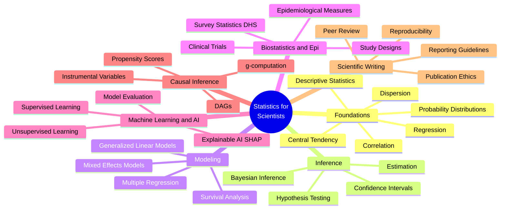
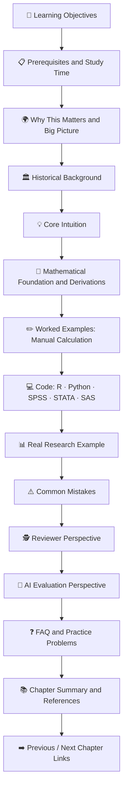
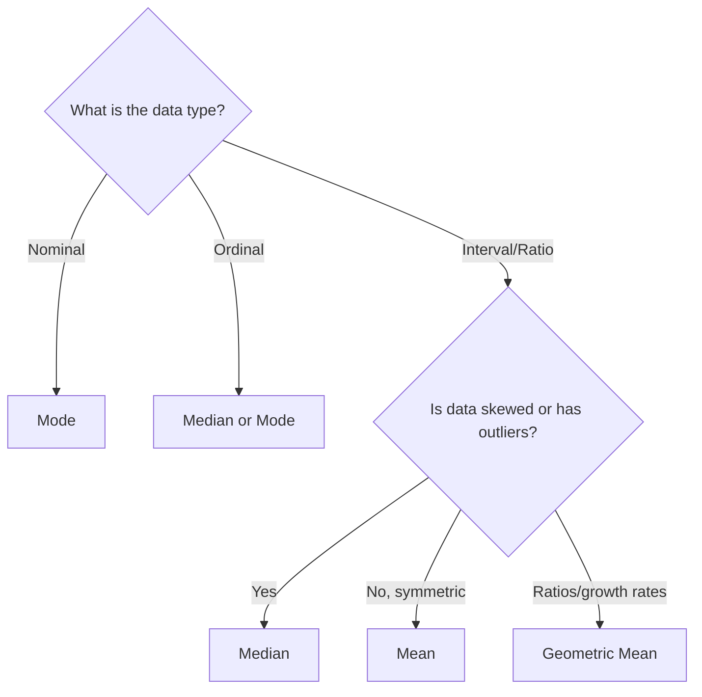
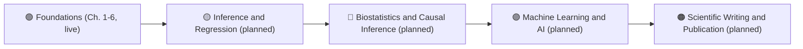

<div align="center">

# 📊 Statistics for Scientists

### *A Complete Open-Access Textbook for Statistics, Biostatistics, Epidemiology, Machine Learning, Artificial Intelligence, Data Science, and Scientific Research*

**From First Principles to Scientific Discovery.**

[]()
[](./LICENSE)
[]()
[]()
[]()

[]()
[]()
[]()
[]()
[]()
[]()
[]()

**[📖 Start Reading](#-chapters) · [🗺️ Curriculum Map](#-complete-curriculum-overview) · [🤝 Contribute](#-contributing-guidelines) · [❓ FAQ](#-frequently-asked-questions)**

</div>

---

> *"Statistics is the grammar of science."* — **Karl Pearson**

This repository exists because the world's best statistical education is often locked behind paywalls, scattered across incompatible formats, or written in a style that treats students as passive note-takers rather than future scientists. **Statistics for Scientists** brings graduate-level rigor, research-grade reproducibility, and publication-quality visual design into a single, freely accessible, GitHub-native textbook — built for the way scientists actually learn: by seeing, coding, deriving, questioning, and applying.

> [!NOTE]
> **This repository is under active construction.** Six foundational chapters are published today (listed below). The full curriculum map further down this page describes the ~40+ chapters planned across foundations, inference, regression, biostatistics, causal inference, machine learning, and scientific writing. Sections describing unpublished chapters are marked 🟡 **Planned** or ⚪ **Not started** throughout this README so the roadmap stays honest.

---

## 📌 Table of Contents

<details>
<summary><strong>Click to expand full navigation</strong></summary>

- [📖 Chapters](#-chapters)
- [Why This Repository Exists](#-why-this-repository-exists)
- [Who This Repository Is For](#-who-this-repository-is-for)
- [Learning Outcomes](#-learning-outcomes)
- [Complete Curriculum Overview](#-complete-curriculum-overview)
  - [Undergraduate Roadmap](#-undergraduate-roadmap)
  - [Graduate Roadmap](#-graduate-roadmap)
  - [Research Roadmap](#-research-roadmap)
  - [AI & Machine Learning Roadmap](#-ai--machine-learning-roadmap)
- [Repository Structure](#-repository-structure)
- [Chapter Organization](#-chapter-organization)
- [Example Chapter Walkthrough](#-example-chapter-walkthrough)
- [Features](#-features)
- [Technologies & Software Covered](#-technologies--software-covered)
- [Real Datasets Covered](#-real-datasets-covered-planned)
- [Visualization Gallery](#-visualization-gallery-planned)
- [Types of Diagrams Used](#-types-of-diagrams-used)
- [Mathematical Notation & Rendering](#-mathematical-notation--rendering)
- [Mermaid Diagram Support](#-mermaid-diagram-support)
- [Learning Workflow](#-learning-workflow)
- [Suggested Reading Paths](#-suggested-reading-paths)
- [Scientific Reviewer Perspective](#-scientific-reviewer-perspective)
- [AI Evaluation Perspective](#-ai-evaluation-perspective)
- [Contributing Guidelines](#-contributing-guidelines)
- [Citation Information](#-citation-information)
- [License](#-license)
- [Acknowledgements](#-acknowledgements)
- [Future Roadmap](#-future-roadmap)
- [Frequently Asked Questions](#-frequently-asked-questions)

</details>

---

## 📖 Chapters

> [!TIP]
> Start here. This is the live, accurate list of what exists in the repository right now — everything else in this README is the roadmap for where it's headed.

| # | Chapter | Status |
|---|---|---|
| 01 | [Descriptive Statistics](./01-descriptive-statistics.md) | ✅ Published |
| 02 | [Central Tendency](./02-central-tendency.md) | ✅ Published |
| 03 | [Dispersion](./03-dispersion.md) | ✅ Published |
| 04 | [Correlation](./04-correlation.md) | ✅ Published |
| 05 | [Regression](./05-regression.md) | ✅ Published |
| 06 | [Probability Distributions](./06-probability-distributions.md) | ✅ Published |
| 07 | Hypothesis Testing | 🟡 Planned |
| 08 | Confidence Intervals | 🟡 Planned |
| 09+ | See full [curriculum overview](#-complete-curriculum-overview) below | ⚪ Not started |

Each published chapter follows the same structure end-to-end: learning objectives → intuition → mathematical derivation → worked example → implementation in R, Python, SPSS, STATA, and SAS → real-research application → reviewer perspective → AI-evaluation perspective → practice problems. See [Chapter Organization](#-chapter-organization) for the full template.

---

## 🌍 Why This Repository Exists

Most statistics education suffers from one of three problems:

| Problem | Consequence |
|---|---|
| 📚 **Textbooks are static and expensive** | Students memorize formulas without ever running real code on real data |
| 🧩 **Courses are fragmented across software** | R users, Python users, and SPSS users rarely learn to translate between tools |
| 🔬 **Theory is disconnected from publication practice** | Students graduate without knowing what a Q1 journal reviewer actually checks |

> [!IMPORTANT]
> **Statistics for Scientists** was built to close all three gaps simultaneously — combining mathematical rigor, multi-software implementation, real research datasets, and a reviewer's-eye view of how statistics is actually judged in scientific publishing.

This repository treats every learner as a **future researcher**, not just a student passing an exam.

---

## 🎯 Who This Repository Is For

| Audience | How This Repository Helps |
|---|---|
| 🎓 **Undergraduate students** | Builds foundational intuition with visual-first explanations before formal notation |
| 🧑‍🔬 **MSc students** | Bridges coursework and thesis-level statistical modeling |
| 🎓 **PhD candidates** | Provides advanced inference, causal methods, and survey statistics for dissertations |
| 🧪 **Researchers & academics** | Serves as a fast, reliable reference for method selection and reporting standards |
| 👩‍🏫 **Professors & instructors** | Offers ready-to-use, richly illustrated teaching material |
| 📝 **Journal reviewers & editors** | Clarifies which statistical mistakes commonly trigger rejection |
| 💻 **Data scientists & ML engineers** | Connects classical statistics to modern machine learning practice |
| 🏥 **Medical & public health researchers** | Centers biostatistics, epidemiology, and DHS-style survey analysis |
| 🤖 **AI researchers** | Includes explicit sections on evaluating AI-generated statistical reasoning |

---

## 🧭 Learning Outcomes

By working through this repository, learners will be able to:

- ✅ Derive core statistical formulas from first principles, not just apply them
- ✅ Select the correct statistical test or model using structured decision frameworks
- ✅ Implement every method in **R, Python, SPSS, STATA, and SAS**
- ✅ Interpret output like a trained statistician, not a black-box user
- ✅ Diagnose violated assumptions and apply appropriate corrections
- 🟡 Build publication-quality figures and tables (APA / journal style) — *expanding as more chapters are added*
- 🟡 Apply reporting guidelines (CONSORT, STROBE, PRISMA, TRIPOD, RECORD, STARD, CARE, ARRIVE) — *planned for the scientific-writing chapters*
- 🟡 Critically evaluate AI-generated statistical explanations for hallucinations — *AI Evaluation sections already present in each published chapter*
- ✅ Translate statistical findings into scientifically defensible conclusions
- 🟡 Design studies (clinical trials, surveys, cohort/case-control) with valid inferential structure — *planned for the biostatistics chapters*

---

## 🗺️ Complete Curriculum Overview



> [!NOTE]
> Only the **Foundations** branch (6 chapters) is published today. Everything else on this map is the intended structure for future chapters and is not yet written — see the [Future Roadmap](#-future-roadmap) table for current status per section.

### 🔰 Undergraduate Roadmap

| Stage | Topics | Outcome | Status |
|---|---|---|---|
| **1. Foundations** | Data types, descriptive statistics, central tendency, dispersion, visualization | Summarize data correctly and honestly | ✅ Published (Ch. 1–3) |
| **2. Relationships** | Correlation, simple & multiple linear regression | Model relationships between variables | ✅ Published (Ch. 4–5) |
| **3. Probability** | Probability axioms, distributions, expectation | Reason quantitatively about uncertainty | ✅ Published (Ch. 6) |
| **4. Sampling** | Sampling distributions, Central Limit Theorem | Understand why inference works at all | 🟡 Planned |
| **5. Inference I** | Estimation, confidence intervals, hypothesis testing | Perform and interpret a basic test correctly | 🟡 Planned |
| **6. Categorical Data** | Chi-square, logistic regression basics | Model a binary outcome | ⚪ Not started |

### 🎓 Graduate Roadmap

| Stage | Topics | Outcome | Status |
|---|---|---|---|
| **7. Advanced Inference** | Likelihood theory, asymptotics, bootstrap | Justify inference beyond textbook formulas | ⚪ Not started |
| **8. Generalized Linear Models** | Poisson, negative binomial, ordinal models | Model counts, rates, and ordered outcomes | ⚪ Not started |
| **9. Mixed & Multilevel Models** | Random effects, hierarchical data | Analyze clustered / longitudinal data | ⚪ Not started |
| **10. Survival Analysis** | Kaplan-Meier, Cox regression, competing risks | Analyze time-to-event outcomes | ⚪ Not started |
| **11. Multivariate Statistics** | PCA, factor analysis, cluster analysis | Reduce and structure high-dimensional data | ⚪ Not started |
| **12. Bayesian Statistics** | Priors, posteriors, MCMC | Perform full probabilistic inference | ⚪ Not started |

### 🔬 Research Roadmap

| Stage | Topics | Outcome | Status |
|---|---|---|---|
| **13. Study Design** | RCTs, cohort, case-control, cross-sectional | Choose a design that supports valid causal claims | ⚪ Not started |
| **14. Epidemiological Measures** | Risk ratios, odds ratios, incidence, prevalence | Quantify disease burden and association | ⚪ Not started |
| **15. Survey Statistics** | Complex survey design, weighting (e.g., DHS) | Correctly analyze nationally representative data | ⚪ Not started |
| **16. Causal Inference** | DAGs, confounding, propensity scores, g-computation | Distinguish association from causation | ⚪ Not started |
| **17. Reporting & Reviewing** | CONSORT, STROBE, PRISMA, TRIPOD | Publish and review research to Q1 standards | ⚪ Not started |

### 🤖 AI & Machine Learning Roadmap

| Stage | Topics | Outcome | Status |
|---|---|---|---|
| **18. ML Foundations** | Bias-variance tradeoff, cross-validation | Avoid overfitting and data leakage | ⚪ Not started |
| **19. Supervised Learning** | Trees, random forests, gradient boosting, SVM | Build predictive models with proper validation | ⚪ Not started |
| **20. Model Evaluation** | ROC/AUC, calibration, precision-recall | Judge models the way a reviewer would | ⚪ Not started |
| **21. Explainable AI** | SHAP, feature importance, partial dependence | Explain "black-box" predictions transparently | ⚪ Not started |
| **22. Deep Learning Basics** | Neural network architecture and training | Understand the statistical basis of deep learning | ⚪ Not started |
| **23. AI in Research** | Using and auditing AI-generated statistical text | Detect hallucinated statistics and false reasoning | ⚪ Not started |

---

## 📁 Repository Structure

> [!IMPORTANT]
> The structure below reflects **what actually exists in this repository today** — a flat list of chapter files at the root. As the chapter count grows, these will be reorganized into the nested `part-folders` shown in the "planned structure" underneath. Contributors should keep new chapters as root-level flat files for now unless a maintainer has started the migration.

**Current structure:**

```text
statistics-for-scientists/
│
├── 01-descriptive-statistics.md
├── 02-central-tendency.md
├── 03-dispersion.md
├── 04-correlation.md
├── 05-regression.md
├── 06-probability-distributions.md
├── LICENSE
└── README.md
```

<details>
<summary><strong>📦 Planned structure once the chapter count grows (click to expand)</strong></summary>

```text
statistics-for-scientists/
│
├── 📘 00-front-matter/
│   ├── preface.md
│   ├── how-to-use-this-book.md
│   └── notation-glossary.md
│
├── 📗 01-foundations/
│   ├── 01-descriptive-statistics.md
│   ├── 02-central-tendency.md
│   ├── 03-dispersion.md
│   ├── 04-correlation.md
│   ├── 05-regression.md
│   └── 06-probability-distributions.md
│
├── 📙 02-inference/
│   ├── 07-hypothesis-testing.md
│   ├── 08-confidence-intervals.md
│   ├── 09-estimation-theory.md
│   └── 10-bayesian-inference.md
│
├── 📕 03-regression-modeling/
│   ├── 11-multiple-regression.md
│   ├── 12-generalized-linear-models.md
│   └── 13-mixed-effects-models.md
│
├── 📔 04-biostatistics-epidemiology/
│   ├── 14-study-designs.md
│   ├── 15-epidemiological-measures.md
│   ├── 16-survival-analysis.md
│   └── 17-survey-statistics-dhs.md
│
├── 📒 05-causal-inference/
│   ├── 18-dags-and-confounding.md
│   ├── 19-propensity-score-methods.md
│   └── 20-g-computation-iv.md
│
├── 📓 06-machine-learning-ai/
│   ├── 21-supervised-learning.md
│   ├── 22-model-evaluation.md
│   ├── 23-explainable-ai-shap.md
│   └── 24-ai-in-scientific-research.md
│
├── 📚 07-scientific-writing/
│   ├── 25-reporting-guidelines.md
│   ├── 26-peer-review-process.md
│   └── 27-reproducibility-and-ethics.md
│
├── 🧮 datasets/
│   ├── dhs-sample/
│   ├── clinical-trial-sample/
│   └── public-health-sample/
│
├── 💻 code/
│   ├── r/
│   ├── python/
│   ├── spss-syntax/
│   ├── stata-do-files/
│   └── sas-programs/
│
├── 🖼️ figures/
├── 📄 LICENSE
└── 📄 README.md
```

This migration will happen once chapter count and cross-linking complexity justify it — tracked in [Future Roadmap](#-future-roadmap).

</details>

---

## 🧱 Chapter Organization

Every chapter in this repository follows an identical, predictable, textbook-grade structure so learners always know what to expect next. This is the actual template used in all six published chapters.



---

## 📖 Example Chapter Walkthrough

<details>
<summary><strong>Click to see a real excerpt from a published chapter: Chapter 5 — Regression</strong></summary>

The excerpt below is taken directly from [`05-regression.md`](./05-regression.md):

```markdown
### Ordinary Least Squares (OLS) Derivation

OLS chooses β̂₀, β̂₁ to minimize the sum of squared residuals:

  SSE = Σ(yᵢ − β̂₀ − β̂₁xᵢ)²

Solving the normal equations gives the closed-form OLS estimators:

  β̂₁ = Σ(xᵢ − x̄)(yᵢ − ȳ) / Σ(xᵢ − x̄)² = Cov(X,Y) / Var(X)
  β̂₀ = ȳ − β̂₁x̄

Note the connection to Chapter 4: β̂₁ = r × (sᵧ / sₓ) — the regression
slope is the correlation coefficient rescaled by the ratio of standard deviations.
```

Every chapter carries forward the **same worked dataset** (a 10-patient systolic blood pressure example introduced in Chapter 1) through central tendency, dispersion, correlation, and regression, so learners can trace one concrete dataset across four different lenses.

</details>

---

## ⭐ Features

| Feature | Status | Description |
|---|---|---|
| 🖼️ **Visual-first pedagogy** | ✅ Live | Every published chapter uses Mermaid diagrams, flowcharts, and decision trees before formal notation |
| 🌐 **Five-language code parity** | ✅ Live | Every published method is implemented in R, Python, SPSS, STATA, and SAS |
| 📐 **Full derivations** | ✅ Live | No "trust me" formulas — every key result in Ch. 1–6 is derived step-by-step |
| 🕵️ **Reviewer-lens commentary** | ✅ Live | Every published chapter answers "what would a Q1 reviewer flag?" |
| 🤖 **AI-literacy layer** | ✅ Live | Every published chapter includes an AI Evaluation Perspective section |
| 🔗 **GitHub-native rendering** | ✅ Live | Mermaid diagrams, LaTeX math, and callouts render directly on GitHub |
| 🧬 **Real research datasets (DHS, clinical trial samples, etc.)** | 🟡 Planned | Will ship alongside the biostatistics and survey-statistics chapters |
| 📊 **Publication-grade figure gallery** | 🟡 Planned | ROC curves, forest plots, Kaplan-Meier curves — planned once relevant chapters are written |
| 🧭 **Reporting-guideline integration (CONSORT, STROBE, etc.)** | 🟡 Planned | Planned for the scientific-writing chapters |

---

## 🛠️ Technologies & Software Covered

<div align="center">

| Language / Tool | Use Case | Coverage |
|---|---|---|
| **R** | Base R statistical functions, `lm()`, `cor()`, distribution functions | ✅ All 6 chapters |
| **Python** | `numpy`, `scipy.stats`, `statsmodels`, `pandas`, `matplotlib`, `seaborn` | ✅ All 6 chapters |
| **SPSS** | Syntax-based `DESCRIPTIVES`, `REGRESSION`, `CORRELATIONS`, `FREQUENCIES` | ✅ All 6 chapters |
| **STATA** | `summarize`, `regress`, `pwcorr`, distribution commands | ✅ All 6 chapters |
| **SAS** | `PROC MEANS`, `PROC REG`, `PROC CORR`, `PROC UNIVARIATE` | ✅ All 6 chapters |
| **SQL** | Data extraction and aggregation for analysis-ready datasets | ⚪ Not yet used |
| **Excel** | Formula-based calculation and quick visualization | ⚪ Not yet used |

</div>

---

## 🗃️ Real Datasets Covered (Planned)

> [!NOTE]
> No dataset files are bundled with the repository yet. Published chapters use small, fully worked-out illustrative datasets defined inline (e.g., a 10-patient blood pressure example). The table below reflects the intended dataset coverage once the biostatistics, epidemiology, and survey-statistics chapters are written.

| Dataset Type | Example Source | Planned Use |
|---|---|---|
| 🌍 **Demographic and Health Surveys (DHS)** | Country-level DHS extracts | Survey statistics, maternal health chapters |
| 🏥 **Clinical Trial Data** | Simulated RCT datasets | CONSORT, survival analysis chapters |
| 🧑‍⚕️ **Public Health Data** | Disease surveillance datasets | Epidemiological measures chapters |
| 🩺 **Medical Datasets** | Patient-level clinical records | Diagnostic accuracy, logistic regression chapters |
| 🧬 **Bioinformatics / Genomics** | Gene expression datasets | Multiple testing, high-dimensional data chapters |
| 🤖 **Machine Learning Benchmarks** | Structured tabular ML datasets | Classification, model evaluation chapters |

---

## 🖼️ Visualization Gallery (Planned)

> [!NOTE]
> Published chapters (1–6) currently use **Mermaid diagrams** (flowcharts, decision trees, mind maps) rather than rendered statistical figures. The gallery below describes the figure types planned as data-driven chapters are added.

| Category | Figures Planned |
|---|---|
| **Distributional** | Histograms, density plots, boxplots, violin plots, QQ plots |
| **Relational** | Scatter plots, pair plots, correlation heatmaps |
| **Model Diagnostics** | Residual plots, calibration plots, confusion matrices |
| **Classification Performance** | ROC curves, precision–recall curves |
| **Survival & Epidemiology** | Kaplan-Meier curves, forest plots, funnel plots |
| **High-Dimensional Data** | PCA biplots, cluster dendrograms, scree plots |
| **Causal Structure** | DAGs, causal graphs (a simple confounding DAG already appears in Chapter 4) |

---

## 🧩 Types of Diagrams Used

| Diagram Type | Purpose | Status |
|---|---|---|
| 🔀 **Flowcharts** | Illustrate decision logic (e.g., choosing a central-tendency measure) | ✅ Used in Ch. 1–6 |
| 🌳 **Decision Trees** | Guide statistical measure / test selection | ✅ Used in Ch. 2, 3, 4, 6 |
| 🧠 **Mind Maps** | Show topic hierarchies | ✅ Used in Ch. 1, 3, 4, 6 |
| 🔗 **DAGs** | Represent causal assumptions and confounding | ✅ Simple example in Ch. 4 |
| ⏳ **Timelines** | Trace historical development of methods | ⚪ Planned |
| 🏥 **Clinical Trial Flowcharts** | CONSORT-style participant flow | ⚪ Planned |
| 📋 **Survey Sampling Diagrams** | Multistage/stratified sampling design | ⚪ Planned |

### Sample Decision Tree (from Chapter 2 — Central Tendency)



---

## 🔢 Mathematical Notation & Rendering

This repository uses GitHub's native LaTeX rendering for all mathematical content.

**Inline math:** The sample mean is $\bar{x} = \frac{1}{n}\sum_{i=1}^{n} x_i$

**Display math:**

$$
s^2 = \frac{1}{n-1}\sum_{i=1}^{n}(x_i - \bar{x})^2
$$

$$
\hat{\beta}_1 = \frac{\sum(x_i-\bar{x})(y_i-\bar{y})}{\sum(x_i-\bar{x})^2}
$$

> [!NOTE]
> A dedicated `notation-glossary.md` is planned (see [Repository Structure](#-repository-structure)) but does not exist yet. Until then, notation is defined inline within each chapter the first time a symbol is used.

---

## 🧜 Mermaid Diagram Support

All diagrams in this repository are written in native **Mermaid syntax**, which renders automatically on GitHub without any external tools or images. Diagram types actually used in published chapters:

- `flowchart` — decision logic and process flow (used extensively in Ch. 1–6)
- `mindmap` — topic hierarchies (used in Ch. 1, 3, 4, 6)

Diagram types planned but not yet used: `graph` (DAGs/Bayesian networks beyond the simple Ch. 4 example), `sequenceDiagram`, `gantt`, `sankey-beta`.

---

## 🔄 Learning Workflow


---

## 🧗 Suggested Reading Paths

| Path | Recommended Chapters | Best For | Availability |
|---|---|---|---|
| 🟢 **Beginner** | Chapters 1–6 | First exposure to statistics | ✅ Available now |
| 🟡 **Intermediate** | Chapters 7–13 (hypothesis testing → regression modeling) | Graduate coursework, thesis modeling | 🟡 Planned |
| 🔴 **Advanced Research** | Biostatistics, epidemiology, causal inference chapters | Epidemiology, survey data, causal claims | ⚪ Not started |
| 🟣 **AI/ML Track** | Machine learning & explainability chapters | Data science and ML careers | ⚪ Not started |
| 🟠 **Publishing Track** | Scientific writing & reporting-guideline chapters | Preparing manuscripts and peer reviews | ⚪ Not started |

### Beginner → Advanced Roadmap



---

## 🕵️ Scientific Reviewer Perspective

> [!WARNING]
> Every **published** chapter includes a dedicated Reviewer Perspective callout answering:
> - What would a Q1 journal reviewer check first?
> - What statistical mistakes commonly lead to rejection or major revision?
> - What assumptions are most often violated without acknowledgment?

Formal integration with named reporting guidelines is planned for the scientific-writing chapters:

| Reporting Guideline | Applies To | Status |
|---|---|---|
| **CONSORT** | Randomized controlled trials | 🟡 Referenced informally in Ch. 3 and Ch. 5; dedicated chapter planned |
| **STROBE** | Observational studies | ⚪ Planned |
| **PRISMA** | Systematic reviews and meta-analyses | ⚪ Planned |
| **TRIPOD** | Prediction model development and validation | ⚪ Planned |
| **RECORD** | Studies using routinely collected health data | ⚪ Planned |
| **STARD** | Diagnostic accuracy studies | ⚪ Planned |
| **CARE** | Case reports | ⚪ Planned |
| **ARRIVE** | Animal research | ⚪ Planned |

---

## 🤖 AI Evaluation Perspective

> [!CAUTION]
> Large language models can produce statistically fluent but **factually incorrect** explanations. Every **published** chapter includes an AI Evaluation Perspective box addressing what automated statistical-review tools typically flag for that specific topic (e.g., SD > mean as a skewness red flag, mismatched quote/paraphrase in Table 1 reporting, overdispersion in Poisson-modeled counts).

| Common AI Hallucination Pattern | Example |
|---|---|
| Confusing correlation with causation | Claiming a regression coefficient "causes" an outcome from observational data |
| Misapplying test assumptions | Recommending a t-test on non-independent (clustered) data |
| Fabricated exact statistics | Producing plausible-looking but unverifiable exact p-values or coefficients without data |
| Overconfident manual arithmetic | Miscalculating variance or standard error "by hand" |

---

## 🤝 Contributing Guidelines

We welcome contributions from statisticians, researchers, educators, and students.

<details>
<summary><strong>How to contribute</strong></summary>

1. **Fork** the repository
2. Create a feature branch: `git checkout -b chapter/new-topic`
3. Follow the **standard chapter structure** (see [Chapter Organization](#-chapter-organization)) — use [`05-regression.md`](./05-regression.md) as a reference template
4. Include code in **at least R and Python**; SPSS, STATA, and SAS are strongly encouraged to match existing chapters
5. Add at least one **Mermaid diagram** with clear labeling
6. Include a **Reviewer Perspective** and **AI Evaluation Perspective** section
7. Name new chapter files following the existing flat-file convention (`NN-topic-name.md`) at the repository root until a maintainer starts the folder migration described in [Repository Structure](#-repository-structure)
8. Update the [Chapters](#-chapters) table and add Previous/Next navigation links to the adjacent chapters
9. Submit a **pull request** with a clear description of the addition

</details>

> [!TIP]
> Small contributions matter too — fixing a typo, improving a derivation's clarity, or adding a missing reference are all valuable.

---

## 📑 Citation Information

If you use this repository in teaching, research, or coursework, please cite it as:

```bibtex
@misc{statistics_for_scientists,
  title        = {Statistics for Scientists: A Complete Open-Access Textbook for Statistics,
                   Biostatistics, Epidemiology, Machine Learning, Artificial Intelligence,
                   Data Science, and Scientific Research},
  author       = {{Statistics for Scientists Contributors}},
  year         = {2026},
  howpublished = {\url{https://github.com/muhammadsalek/statistics-for-scientists}},
  note         = {Open-access GitHub textbook, early access}
}
```

---

## 📜 License

This work is licensed under the **[MIT License](./LICENSE)**.

You are free to use, copy, modify, and distribute this material, including for commercial purposes, provided the original copyright and license notice are included.

> [!NOTE]
> An earlier draft of this README referenced a CC BY 4.0 license. The repository's actual `LICENSE` file is MIT, and this README has been updated to match it. If you intended to license this content under CC BY 4.0 instead, replace the `LICENSE` file accordingly and update this section.

---

## 🙏 Acknowledgements

This repository draws inspiration from the pedagogical traditions of Harvard, Stanford, MIT, Oxford, Cambridge, Johns Hopkins, and Imperial College London, and from the global community of open-access science advocates who believe rigorous statistical education should be free for everyone, everywhere.

---

## 🚧 Future Roadmap

| Milestone | Status |
|---|---|
| Core foundational chapters (1–6): descriptive stats, central tendency, dispersion, correlation, regression, probability distributions | ✅ **Published** |
| Inference chapters (hypothesis testing, confidence intervals, estimation, Bayesian inference) | 🟡 Planned — next up |
| Regression modeling chapters (multiple regression, GLMs, mixed models) | ⚪ Planned |
| Biostatistics & epidemiology chapters | ⚪ Planned |
| Causal inference chapters | ⚪ Planned |
| Machine learning & AI chapters | ⚪ Planned |
| Scientific writing chapters | ⚪ Planned |
| Real dataset bundle (`datasets/` folder) | ⚪ Planned |
| Multi-language code folder (`code/` with r/, python/, spss-syntax/, etc.) | ⚪ Planned |
| Folder-based restructuring (00-front-matter, 01-foundations, etc.) | ⚪ Planned once chapter count justifies it |
| Interactive Shiny/Streamlit companion apps | ⚪ Under consideration |

---

## ❓ Frequently Asked Questions

<details>
<summary><strong>Do I need to know programming to use this textbook?</strong></summary>

No. Every concept is explained conceptually and visually first. Code (in R, Python, SPSS, STATA, and SAS) is provided for those who want to implement the methods themselves.
</details>

<details>
<summary><strong>Which software should I focus on?</strong></summary>

If you're heading toward academic research in health or social sciences, prioritize **R** and **STATA**. If you're heading toward data science or ML, prioritize **Python**. All six published chapters support both paths equally.
</details>

<details>
<summary><strong>Is this repository finished?</strong></summary>

No — it is in early access with 6 of a planned 40+ foundational-through-advanced chapters published. See the [Chapters](#-chapters) table for exactly what's available today and the [Future Roadmap](#-future-roadmap) for what's coming next.
</details>

<details>
<summary><strong>Can I use this material in my own course?</strong></summary>

Yes, under the MIT license. See the [License](#-license) section.
</details>

<details>
<summary><strong>How do the "Reviewer Perspective" sections work?</strong></summary>

Each one is written from the standpoint of an experienced journal reviewer, highlighting the specific statistical issues that most commonly lead to major revisions or rejection for that chapter's topic.
</details>

---

<div align="center">

**⭐ If this repository helps your learning or research, consider starring it to support open-access statistical education.**

*Made with rigor, care, and a genuine belief that great statistical education should belong to everyone.*

</div>
