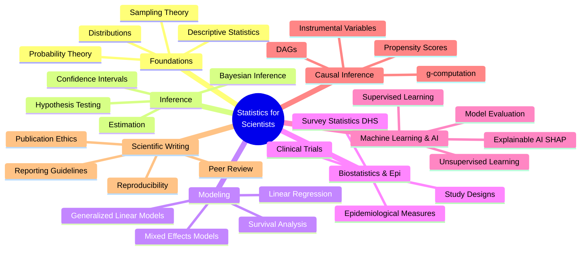
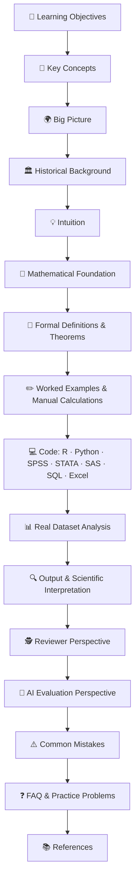
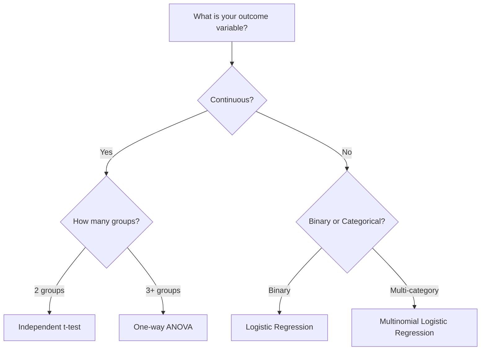
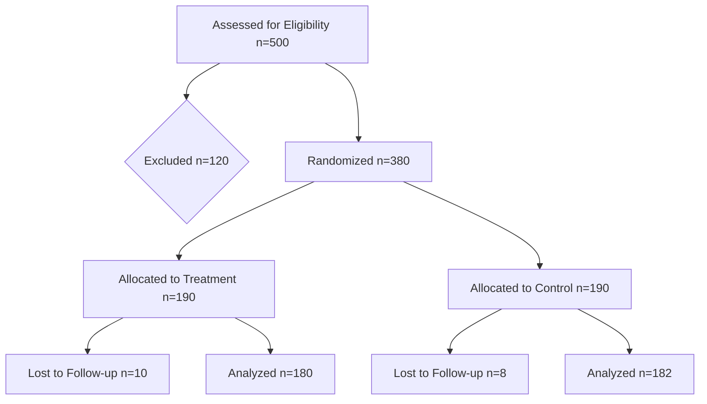

<div align="center">

# 📊 Statistics for Scientists

### *A Complete Open-Access Textbook for Statistics, Biostatistics, Epidemiology, Machine Learning, Artificial Intelligence, Data Science, and Scientific Research*

**From First Principles to Scientific Discovery.**

[]()
[]()
[]()
[]()
[]()

[]()
[]()
[]()
[]()
[]()
[]()
[]()

**[📖 Start Reading](#-table-of-contents) · [🗺️ Curriculum Map](#-complete-curriculum-overview) · [🤝 Contribute](#-contributing-guidelines) · [❓ FAQ](#-frequently-asked-questions)**

</div>

---

> *"Statistics is the grammar of science."* — **Karl Pearson**

This repository exists because the world's best statistical education is often locked behind paywalls, scattered across incompatible formats, or written in a style that treats students as passive note-takers rather than future scientists. **Statistics for Scientists** brings graduate-level rigor, research-grade reproducibility, and publication-quality visual design into a single, freely accessible, GitHub-native textbook — built for the way scientists actually learn: by seeing, coding, deriving, questioning, and applying.

---

## 📌 Table of Contents

<details>
<summary><strong>Click to expand full navigation</strong></summary>

- [Why This Repository Exists](#-why-this-repository-exists)
- [Who This Repository Is For](#-who-this-repository-is-for)
- [Learning Outcomes](#-learning-outcomes)
- [Complete Curriculum Overview](#-complete-curriculum-overview)
  - [Undergraduate Roadmap](#-undergraduate-roadmap)
  - [Graduate Roadmap](#-graduate-roadmap)
  - [Research Roadmap](#-research-roadmap)
  - [AI & Machine Learning Roadmap](#-ai--machine-learning-roadmap)
- [Repository Structure](#-repository-structure)
- [Chapter Organization](#-chapter-organization)
- [Example Chapter Structure](#-example-chapter-structure)
- [Features](#-features)
- [Technologies & Software Covered](#-technologies--software-covered)
- [Real Datasets Covered](#-real-datasets-covered)
- [Visualization Gallery](#-visualization-gallery)
- [Types of Diagrams Used](#-types-of-diagrams-used)
- [Mathematical Notation & Rendering](#-mathematical-notation--rendering)
- [Mermaid Diagram Support](#-mermaid-diagram-support)
- [Learning Workflow](#-learning-workflow)
- [Suggested Reading Paths](#-suggested-reading-paths)
- [Scientific Reviewer Perspective](#-scientific-reviewer-perspective)
- [AI Evaluation Perspective](#-ai-evaluation-perspective)
- [Contributing Guidelines](#-contributing-guidelines)
- [Citation Information](#-citation-information)
- [License](#-license)
- [Acknowledgements](#-acknowledgements)
- [Future Roadmap](#-future-roadmap)
- [Frequently Asked Questions](#-frequently-asked-questions)

</details>

---

## 🌍 Why This Repository Exists

Most statistics education suffers from one of three problems:

| Problem | Consequence |
|---|---|
| 📚 **Textbooks are static and expensive** | Students memorize formulas without ever running real code on real data |
| 🧩 **Courses are fragmented across software** | R users, Python users, and SPSS users rarely learn to translate between tools |
| 🔬 **Theory is disconnected from publication practice** | Students graduate without knowing what a Q1 journal reviewer actually checks |

> [!IMPORTANT]
> **Statistics for Scientists** was built to close all three gaps simultaneously — combining mathematical rigor, multi-software implementation, real research datasets, and a reviewer's-eye view of how statistics is actually judged in scientific publishing.

This repository treats every learner as a **future researcher**, not just a student passing an exam.

---

## 🎯 Who This Repository Is For

| Audience | How This Repository Helps |
|---|---|
| 🎓 **Undergraduate students** | Builds foundational intuition with visual-first explanations before formal notation |
| 🧑‍🔬 **MSc students** | Bridges coursework and thesis-level statistical modeling |
| 🎓 **PhD candidates** | Provides advanced inference, causal methods, and survey statistics for dissertations |
| 🧪 **Researchers & academics** | Serves as a fast, reliable reference for method selection and reporting standards |
| 👩‍🏫 **Professors & instructors** | Offers ready-to-use, richly illustrated teaching material |
| 📝 **Journal reviewers & editors** | Clarifies which statistical mistakes commonly trigger rejection |
| 💻 **Data scientists & ML engineers** | Connects classical statistics to modern machine learning practice |
| 🏥 **Medical & public health researchers** | Centers biostatistics, epidemiology, and DHS-style survey analysis |
| 🤖 **AI researchers** | Includes explicit sections on evaluating AI-generated statistical reasoning |

---

## 🧭 Learning Outcomes

By working through this repository, learners will be able to:

- ✅ Derive core statistical formulas from first principles, not just apply them
- ✅ Select the correct statistical test or model using structured decision frameworks
- ✅ Implement every method in **R, Python, SPSS, STATA, SAS, SQL, and Excel**
- ✅ Interpret output like a trained statistician, not a black-box user
- ✅ Diagnose violated assumptions and apply appropriate corrections
- ✅ Build publication-quality figures and tables (APA / journal style)
- ✅ Apply reporting guidelines (CONSORT, STROBE, PRISMA, TRIPOD, RECORD, STARD, CARE, ARRIVE)
- ✅ Critically evaluate AI-generated statistical explanations for hallucinations
- ✅ Translate statistical findings into scientifically defensible conclusions
- ✅ Design studies (clinical trials, surveys, cohort/case-control) with valid inferential structure

---

## 🗺️ Complete Curriculum Overview



### 🔰 Undergraduate Roadmap

| Stage | Topics | Outcome |
|---|---|---|
| **1. Foundations** | Data types, descriptive statistics, visualization | Summarize data correctly and honestly |
| **2. Probability** | Probability axioms, distributions, expectation | Reason quantitatively about uncertainty |
| **3. Sampling** | Sampling distributions, Central Limit Theorem | Understand why inference works at all |
| **4. Inference I** | Estimation, confidence intervals, hypothesis testing | Perform and interpret a basic test correctly |
| **5. Regression I** | Simple & multiple linear regression | Model a continuous outcome |
| **6. Categorical Data** | Chi-square, logistic regression basics | Model a binary outcome |

### 🎓 Graduate Roadmap

| Stage | Topics | Outcome |
|---|---|---|
| **7. Advanced Inference** | Likelihood theory, asymptotics, bootstrap | Justify inference beyond textbook formulas |
| **8. Generalized Linear Models** | Poisson, negative binomial, ordinal models | Model counts, rates, and ordered outcomes |
| **9. Mixed & Multilevel Models** | Random effects, hierarchical data | Analyze clustered / longitudinal data |
| **10. Survival Analysis** | Kaplan-Meier, Cox regression, competing risks | Analyze time-to-event outcomes |
| **11. Multivariate Statistics** | PCA, factor analysis, cluster analysis | Reduce and structure high-dimensional data |
| **12. Bayesian Statistics** | Priors, posteriors, MCMC | Perform full probabilistic inference |

### 🔬 Research Roadmap

| Stage | Topics | Outcome |
|---|---|---|
| **13. Study Design** | RCTs, cohort, case-control, cross-sectional | Choose a design that supports valid causal claims |
| **14. Epidemiological Measures** | Risk ratios, odds ratios, incidence, prevalence | Quantify disease burden and association |
| **15. Survey Statistics** | Complex survey design, weighting (e.g., DHS) | Correctly analyze nationally representative data |
| **16. Causal Inference** | DAGs, confounding, propensity scores, g-computation | Distinguish association from causation |
| **17. Reporting & Reviewing** | CONSORT, STROBE, PRISMA, TRIPOD | Publish and review research to Q1 standards |

### 🤖 AI & Machine Learning Roadmap

| Stage | Topics | Outcome |
|---|---|---|
| **18. ML Foundations** | Bias-variance tradeoff, cross-validation | Avoid overfitting and data leakage |
| **19. Supervised Learning** | Trees, random forests, gradient boosting, SVM | Build predictive models with proper validation |
| **20. Model Evaluation** | ROC/AUC, calibration, precision-recall | Judge models the way a reviewer would |
| **21. Explainable AI** | SHAP, feature importance, partial dependence | Explain "black-box" predictions transparently |
| **22. Deep Learning Basics** | Neural network architecture and training | Understand the statistical basis of deep learning |
| **23. AI in Research** | Using and auditing AI-generated statistical text | Detect hallucinated statistics and false reasoning |

---

## 📁 Repository Structure

```text
statistics-for-scientists/
│
├── 📘 00-front-matter/
│   ├── preface.md
│   ├── how-to-use-this-book.md
│   └── notation-glossary.md
│
├── 📗 01-foundations/
│   ├── 01-descriptive-statistics.md
│   ├── 02-probability-theory.md
│   ├── 03-random-variables-distributions.md
│   └── 04-sampling-and-clt.md
│
├── 📙 02-inference/
│   ├── 05-estimation-theory.md
│   ├── 06-hypothesis-testing.md
│   ├── 07-confidence-intervals.md
│   └── 08-bayesian-inference.md
│
├── 📕 03-regression-modeling/
│   ├── 09-simple-linear-regression.md
│   ├── 10-multiple-regression.md
│   ├── 11-generalized-linear-models.md
│   └── 12-mixed-effects-models.md
│
├── 📔 04-biostatistics-epidemiology/
│   ├── 13-study-designs.md
│   ├── 14-epidemiological-measures.md
│   ├── 15-survival-analysis.md
│   └── 16-survey-statistics-dhs.md
│
├── 📒 05-causal-inference/
│   ├── 17-dags-and-confounding.md
│   ├── 18-propensity-score-methods.md
│   └── 19-g-computation-iv.md
│
├── 📓 06-machine-learning-ai/
│   ├── 20-supervised-learning.md
│   ├── 21-model-evaluation.md
│   ├── 22-explainable-ai-shap.md
│   └── 23-ai-in-scientific-research.md
│
├── 📚 07-scientific-writing/
│   ├── 24-reporting-guidelines.md
│   ├── 25-peer-review-process.md
│   └── 26-reproducibility-and-ethics.md
│
├── 🧮 datasets/
│   ├── dhs-sample/
│   ├── clinical-trial-sample/
│   └── public-health-sample/
│
├── 💻 code/
│   ├── r/
│   ├── python/
│   ├── spss-syntax/
│   ├── stata-do-files/
│   ├── sas-programs/
│   └── sql-queries/
│
├── 🖼️ figures/
├── 📄 LICENSE
└── 📄 README.md
```

---

## 🧱 Chapter Organization

Every chapter in this repository follows an identical, predictable, textbook-grade structure so learners always know what to expect next.



---

## 📖 Example Chapter Structure

<details>
<summary><strong>Click to view a fully worked example: "Chapter 09 — Simple Linear Regression"</strong></summary>

```markdown
# Chapter 09: Simple Linear Regression

## 🎯 Learning Objectives
- Derive the least squares estimator from first principles
- Interpret slope and intercept in scientific terms
- Diagnose and correct violated assumptions

## 🧩 Key Concepts
| Term | Definition |
|---|---|
| Slope (β₁) | Expected change in Y per one-unit increase in X |
| Residual | Observed minus predicted value |
| R² | Proportion of variance in Y explained by X |

## 📐 Mathematical Foundation
The least squares estimator minimizes:

  S(β₀, β₁) = Σ(yᵢ − β₀ − β₁xᵢ)²

Solving ∂S/∂β₀ = 0 and ∂S/∂β₁ = 0 yields:

  β̂₁ = Σ(xᵢ − x̄)(yᵢ − ȳ) / Σ(xᵢ − x̄)²
  β̂₀ = ȳ − β̂₁x̄

## 💻 Code (Python)
​```python
import statsmodels.api as sm
X = sm.add_constant(df['age'])
model = sm.OLS(df['blood_pressure'], X).fit()
print(model.summary())
​```

**Expected Output:** Coefficient table with β̂₀, β̂₁, standard errors, t-statistics, and R².
**Interpretation:** Each additional year of age is associated with a β̂₁ mmHg change in blood pressure, holding no other variables constant.
**Common Errors:** Forgetting `sm.add_constant()` omits the intercept entirely.

## 🕵️ Reviewer Perspective
> [!WARNING]
> A Q1 reviewer will immediately check: Was linearity assessed? Were residuals plotted? Is causal language used despite an observational design?

## 🤖 AI Evaluation Perspective
> [!NOTE]
> AI tools frequently miscompute R² when asked "by hand." Always verify against software output before trusting a language model's manual derivation.
```

</details>

---

## ⭐ Features

| Feature | Description |
|---|---|
| 🖼️ **Visual-first pedagogy** | Every concept introduced through a diagram or figure before formal notation |
| 🌐 **Seven-language code parity** | Every method implemented in R, Python, SPSS, STATA, SAS, SQL, and Excel |
| 🧬 **Real research datasets** | DHS, clinical trial, and public health data used throughout |
| 🕵️ **Reviewer-lens commentary** | Every chapter answers "what would a Q1 reviewer flag?" |
| 🤖 **AI-literacy layer** | Explicit sections on detecting AI hallucinations in statistical reasoning |
| 📐 **Full derivations** | No "trust me" formulas — every key result is derived |
| 📊 **Publication-grade figures** | ROC curves, forest plots, Kaplan-Meier curves, and more, fully captioned |
| 🧭 **Reporting-guideline integration** | CONSORT, STROBE, PRISMA, TRIPOD, RECORD, STARD, CARE, ARRIVE |
| 🔗 **GitHub-native rendering** | Mermaid diagrams, LaTeX math, and callouts render directly on GitHub |

---

## 🛠️ Technologies & Software Covered

<div align="center">

| Language / Tool | Use Case | Badge |
|---|---|---|
| **R** | Statistical modeling, `ggplot2`, `survminer`, mixed models |  |
| **Python** | `statsmodels`, `scikit-learn`, `lifelines`, `pandas`, `matplotlib` |  |
| **SPSS** | Menu-driven and syntax-based analysis |  |
| **STATA** | Survey-weighted regression, `svyset` designs |  |
| **SAS** | PROC-based statistical programming |  |
| **SQL** | Data extraction and aggregation for analysis-ready datasets |  |
| **Excel** | Formula-based calculation and quick visualization |  |

</div>

---

## 🗃️ Real Datasets Covered

| Dataset Type | Example Source | Used In |
|---|---|---|
| 🌍 **Demographic and Health Surveys (DHS)** | Bangladesh, Nepal, Mozambique, Zambia, Lesotho | Survey statistics, maternal health, women's empowerment chapters |
| 🏥 **Clinical Trial Data** | Simulated RCT datasets | CONSORT, survival analysis, treatment effect chapters |
| 🧑‍⚕️ **Public Health Data** | Disease surveillance datasets | Epidemiological measures, outbreak analysis |
| 🩺 **Medical Datasets** | Patient-level clinical records | Diagnostic accuracy, logistic regression |
| 🧬 **Bioinformatics / Genomics** | Gene expression datasets | Volcano plots, Manhattan plots, multiple testing |
| 🤖 **Machine Learning Benchmarks** | Structured tabular ML datasets | Classification, SHAP, model evaluation chapters |

---

## 🖼️ Visualization Gallery

> [!TIP]
> Every figure below is reproduced inside its parent chapter with full **Figure Number · Title · Caption · Interpretation · Reviewer Notes · Common Mistakes.**

| Category | Figures Included |
|---|---|
| **Distributional** | Histograms, density plots, boxplots, violin plots, QQ plots |
| **Relational** | Scatter plots, pair plots, correlation heatmaps |
| **Model Diagnostics** | Residual plots, calibration plots, confusion matrices |
| **Classification Performance** | ROC curves, precision–recall curves |
| **Survival & Epidemiology** | Kaplan-Meier curves, forest plots, funnel plots |
| **High-Dimensional Data** | PCA biplots, cluster dendrograms, scree plots |
| **Genomics** | Manhattan plots, volcano plots |
| **Method Comparison** | Bland-Altman plots |
| **Causal Structure** | DAGs, Bayesian networks, causal graphs |

---

## 🧩 Types of Diagrams Used

| Diagram Type | Purpose |
|---|---|
| 🔀 **Flowcharts** | Illustrate decision logic (e.g., test selection) |
| 🌳 **Decision Trees** | Guide statistical test / model choice |
| 🧠 **Mind Maps** | Show topic hierarchies and relationships |
| ⏳ **Timelines** | Trace historical development of methods |
| 🔗 **DAGs / Bayesian Networks** | Represent causal assumptions |
| 🏥 **Clinical Trial Flowcharts** | Depict CONSORT-style participant flow |
| 📋 **Survey Sampling Diagrams** | Show multistage/stratified sampling design |
| 🔁 **ML Pipelines** | Represent end-to-end modeling workflows |
| 🌊 **Sankey Diagrams** | Show flow between categorical states |

### Sample Decision Tree — Choosing a Statistical Test



### Sample Clinical Trial Flow (CONSORT-style)



---

## 🔢 Mathematical Notation & Rendering

This repository uses GitHub's native LaTeX rendering for all mathematical content.

**Inline math:** The sample mean is $\bar{x} = \frac{1}{n}\sum_{i=1}^{n} x_i$

**Display math:**

$$
\text{Var}(X) = E[(X - \mu)^2] = E[X^2] - (E[X])^2
$$

$$
\hat{\beta} = (X^TX)^{-1}X^Ty
$$

> [!NOTE]
> All notation follows a consistent glossary defined in `00-front-matter/notation-glossary.md` to avoid symbol conflicts across chapters.

---

## 🧜 Mermaid Diagram Support

All diagrams in this repository are written in native **Mermaid syntax**, which renders automatically on GitHub without any external tools or images.

Supported diagram types used throughout the book:

- `flowchart` — process and decision logic
- `graph` — DAGs and causal graphs
- `mindmap` — topic and curriculum maps
- `sequenceDiagram` — data pipeline and workflow steps
- `gantt` — study design timelines
- `sankey-beta` — categorical flow diagrams

---

## 🔄 Learning Workflow


---

## 🧗 Suggested Reading Paths

| Path | Recommended Chapters | Best For |
|---|---|---|
| 🟢 **Beginner** | Chapters 1–6 | First exposure to statistics |
| 🟡 **Intermediate** | Chapters 7–12 | Graduate coursework, thesis modeling |
| 🔴 **Advanced Research** | Chapters 13–19 | Epidemiology, causal inference, survey data |
| 🟣 **AI/ML Track** | Chapters 20–23 | Data science and machine learning careers |
| 🟠 **Publishing Track** | Chapters 24–26 | Preparing manuscripts and peer reviews |

### Beginner → Advanced Roadmap


---

## 🕵️ Scientific Reviewer Perspective

> [!WARNING]
> Every chapter includes a dedicated **"Reviewer's Desk"** callout answering:
> - What would a Q1 journal reviewer check first?
> - What statistical mistakes commonly lead to rejection?
> - What assumptions are most often violated without acknowledgment?
> - How should results be reported according to the relevant guideline (CONSORT / STROBE / PRISMA / TRIPOD / RECORD / STARD / CARE / ARRIVE)?

| Reporting Guideline | Applies To |
|---|---|
| **CONSORT** | Randomized controlled trials |
| **STROBE** | Observational studies (cohort, case-control, cross-sectional) |
| **PRISMA** | Systematic reviews and meta-analyses |
| **TRIPOD** | Prediction model development and validation |
| **RECORD** | Studies using routinely collected health data |
| **STARD** | Diagnostic accuracy studies |
| **CARE** | Case reports |
| **ARRIVE** | Animal research |

---

## 🤖 AI Evaluation Perspective

> [!CAUTION]
> Large language models can produce statistically fluent but **factually incorrect** explanations. Every chapter includes an **"AI Check"** box addressing:
> - Can a general-purpose AI answer this correctly?
> - What are common AI hallucinations for this topic?
> - How should a reader verify AI-generated statistical output?
> - What subtle reasoning errors do reviewers catch that AI tools miss?

| Common AI Hallucination Pattern | Example |
|---|---|
| Confusing correlation with causation | Claiming a regression coefficient "causes" an outcome from observational data |
| Misapplying test assumptions | Recommending a t-test on non-independent (clustered) data |
| Fabricated p-values | Producing plausible-looking but unverifiable exact p-values without data |
| Overconfident manual arithmetic | Miscalculating variance or standard error "by hand" |

---

## 🤝 Contributing Guidelines

We welcome contributions from statisticians, researchers, educators, and students.

<details>
<summary><strong>How to contribute</strong></summary>

1. **Fork** the repository
2. Create a feature branch: `git checkout -b chapter/new-topic`
3. Follow the **standard chapter structure** (see [Chapter Organization](#-chapter-organization))
4. Include code in **at least R and Python**; other languages are welcome
5. Add at least one **diagram or figure** with full caption and interpretation
6. Include a **Reviewer Perspective** and **AI Evaluation** section
7. Submit a **pull request** with a clear description of the addition

</details>

> [!TIP]
> Small contributions matter too — fixing a typo, improving a derivation's clarity, or adding a missing dataset citation are all valuable.

---

## 📑 Citation Information

If you use this repository in teaching, research, or coursework, please cite it as:

```bibtex
@misc{statistics_for_scientists,
  title        = {Statistics for Scientists: A Complete Open-Access Textbook for Statistics,
                   Biostatistics, Epidemiology, Machine Learning, Artificial Intelligence,
                   Data Science, and Scientific Research},
  author       = {{Statistics for Scientists Contributors}},
  year         = {2026},
  howpublished = {\url{https://github.com/}},
  note         = {Open-access GitHub textbook}
}
```

---

## 📜 License

This work is licensed under the **[Creative Commons Attribution 4.0 International License (CC BY 4.0)](https://creativecommons.org/licenses/by/4.0/)**.

You are free to **share** and **adapt** this material for any purpose, even commercially, as long as appropriate credit is given.

---

## 🙏 Acknowledgements

This repository draws inspiration from the pedagogical traditions of Harvard, Stanford, MIT, Oxford, Cambridge, Johns Hopkins, and Imperial College London, and from the global community of open-access science advocates who believe rigorous statistical education should be free for everyone, everywhere.

---

## 🚧 Future Roadmap

| Milestone | Status |
|---|---|
| Core undergraduate chapters (1–6) | 🟢 In Progress |
| Graduate-level chapters (7–12) | 🟡 Planned |
| Biostatistics & epidemiology chapters (13–17) | 🟡 Planned |
| Causal inference chapters (18–19) | ⚪ Planned |
| Machine learning & AI chapters (20–23) | ⚪ Planned |
| Scientific writing chapters (24–26) | ⚪ Planned |
| Interactive Shiny/Streamlit companion apps | ⚪ Planned |
| Multi-language translations | ⚪ Under Consideration |

---

## ❓ Frequently Asked Questions

<details>
<summary><strong>Do I need to know programming to use this textbook?</strong></summary>

No. Every concept is explained conceptually and visually first. Code is provided for those who want to implement the methods themselves.
</details>

<details>
<summary><strong>Which software should I focus on?</strong></summary>

If you're heading toward academic research in health or social sciences, prioritize **R** and **STATA**. If you're heading toward data science or ML, prioritize **Python**. This repository supports both paths equally.
</details>

<details>
<summary><strong>Is this suitable for PhD-level research methods courses?</strong></summary>

Yes. Chapters 13–19 in particular (biostatistics, epidemiology, and causal inference) are written at a level suitable for PhD coursework and dissertation methodology chapters.
</details>

<details>
<summary><strong>Can I use this material in my own course?</strong></summary>

Yes, under the CC BY 4.0 license, with attribution. See the [Citation Information](#-citation-information) section.
</details>

<details>
<summary><strong>How do the "Reviewer Perspective" sections work?</strong></summary>

Each one is written from the standpoint of an experienced Q1 journal reviewer, highlighting the specific statistical issues that most commonly lead to major revisions or rejection.
</details>

---

<div align="center">

**⭐ If this repository helps your learning or research, consider starring it to support open-access statistical education.**

*Made with rigor, care, and a genuine belief that great statistical education should belong to everyone.*

</div>
